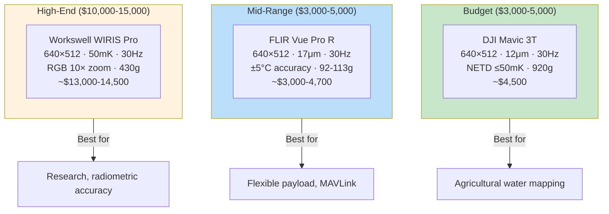
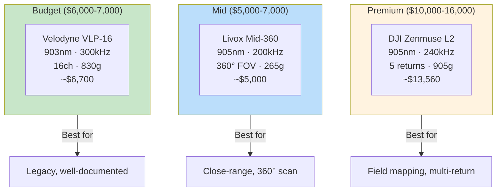
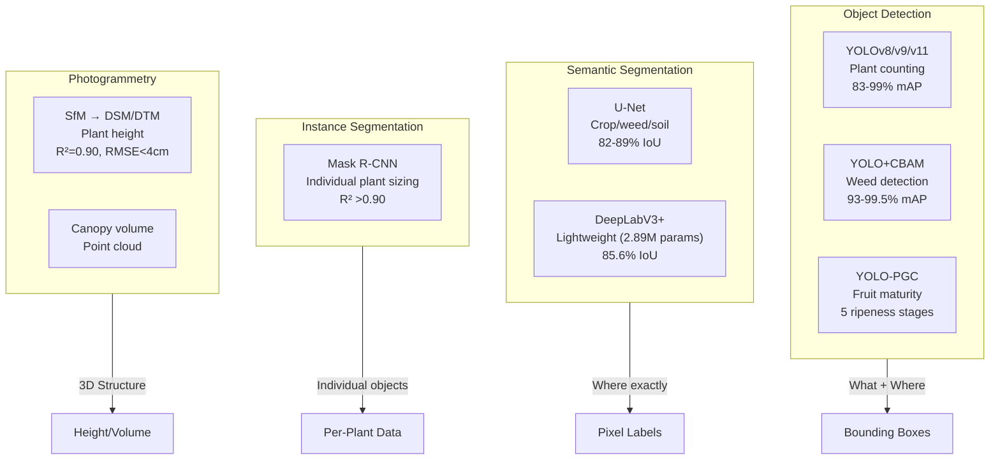
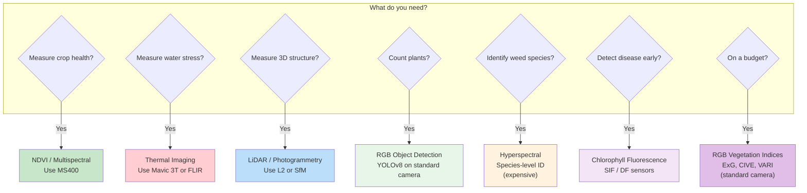
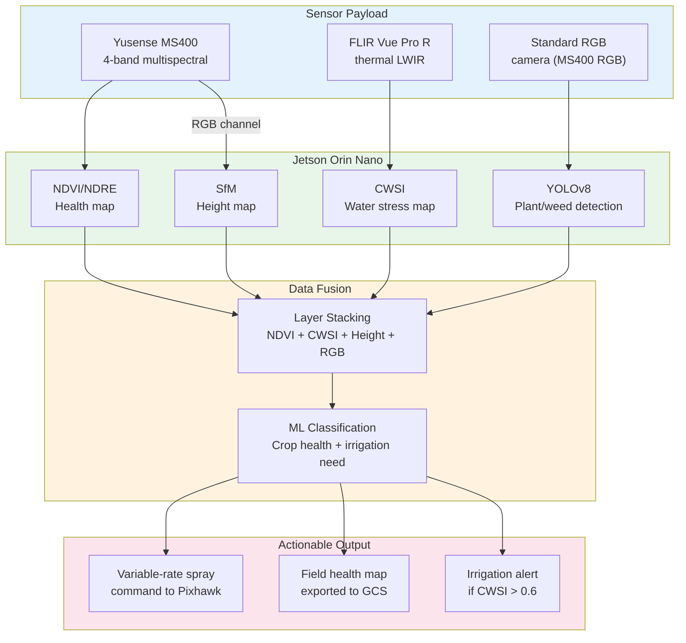

# Beyond NDVI — Alternative Camera Vision Techniques for Agricultural Drones

> **Project:** COEP Agricultural Hexacopter
> **Last Updated:** May 29, 2026
> **Status:** COMPLETE
> **Companion to:** `NDVI_Multispectral_Camera_ML_Reference.md`

---

## How to Read This Document

1. **Short direct questions** → One topic per section, dig deeper each round
2. **Sources not summaries** → Every claim has a citation you can verify
3. **Component-level thinking** → Physical parts, dimensions, what connects to what
4. **Aggressive verification** → Numbers cross-checked against datasheets
5. **Iterative deepening** → Broad → deep → deeper
6. **Build, not study** → Real hardware, real specs
7. **No fluff** → Direct, concise
8. **Skeptical** → Faults exposed
9. **Visual/mathematical** → Diagrams, formulas
10. **Real-world grounded** → Actual products, datasheets

---

## 1. Thermal Imaging (LWIR) — Crop Water Stress

### What It Is

Thermal cameras detect **long-wave infrared radiation (8–14 μm)** emitted by objects based on their temperature. Plants transpire water which cools their leaves below air temperature. Water-stressed plants close stomata → stop transpiring → leaf temperature rises.

```
Well-watered plant:  T_canopy < T_air    (cool, transpiring)
Stressed plant:      T_canopy > T_air    (hot, stomata closed)
```

### Crop Water Stress Index (CWSI)

```
CWSI = (dTm − dTLL) / (dTUL − dTLL)
```

Where:
- `dTm = T_canopy − T_air` (measured temperature difference)
- `dTLL` = lower baseline (well-watered plant, varies with VPD)
- `dTUL` = upper baseline (maximum stress, stomata closed)

| CWSI | Stress Level |
|---|---|
| 0 – 0.2 | Well-watered, no stress |
| 0.2 – 0.4 | Mild stress |
| 0.4 – 0.6 | Moderate — irrigation recommended |
| 0.6 – 0.8 | Severe — yield decline |
| > 0.8 | Critical — physiological damage |

**Optimal capture:** 11 AM – 2 PM, clear skies, sunny. Needs concurrent weather station data.

**Source:** Agrobit 2026; ISPRS Archives 2024

### Thermal Camera Comparison



### DJI Mavic 3T — Full Specs

| Parameter | Value |
|---|---|
| Sensor | Uncooled VOx Microbolometer |
| Resolution | 640 × 512 |
| Pixel pitch | 12 μm |
| Spectral band | 8–14 μm |
| NETD | ≤ 50 mK @ f/1.0 |
| DFOV | 61° |
| Aperture | f/1.0 |
| Frame rate | 30 Hz |
| Temp range | −20° to 150°C (High Gain) |
| Digital zoom | 8× (56× hybrid) |
| Weight | 920g (drone) |
| Interface | DJI Pilot app, USB-C |
| Price | ~$4,500 USD |

**Source:** DJI Enterprise specs

### FLIR Vue Pro R — Full Specs

| Parameter | Value |
|---|---|
| Sensor | Uncooled VOx (Tau2 core) |
| Resolution | 640 × 512 |
| Pixel pitch | 17 μm |
| Spectral band | 7.5–13.5 μm |
| Lens options | 9mm (69°), 13mm (45°), 19mm (32°) |
| Frame rate | 30 Hz |
| Temp range | −40° to +550°C |
| Radiometric accuracy | ±5°C or 5% |
| Size | 63 × 45 × 45 mm |
| Weight | 92–113g |
| Power | 2.1W (peak 3.9W) |
| Interface | MAVLink, PWM, Bluetooth, microSD |
| Price | ~$3,000–4,700 USD |

**Source:** FLIR.com

### Workswell WIRIS Pro — Full Specs

| Parameter | Value |
|---|---|
| Sensor | LWIR Microbolometric |
| Resolution | 640 × 512 (SuperRes: 1266×1010) |
| Spectral band | 7.5–13.5 μm |
| Sensitivity | 50mK (std) / 30mK (optional) |
| Accuracy | ±2% or ±2°C |
| Frame rate | 30 Hz or 9 Hz |
| Lens options | 18°, 32°, 45°, 69° (exchangeable) |
| RGB camera | 1920×1080, 10× optical zoom |
| Storage | 128/256 GB SSD |
| Interface | S.BUS, CAN, MAVLink, Ethernet, USB |
| Weight | <430g |
| Dimensions | 83 × 85 × 68 mm |
| Price | ~$13,000–14,500 USD |

**Source:** workswell.eu

### What Thermal Can Do That NDVI Cannot

- Detect water stress (NDVI detects biomass/health, not hydration)
- Measure actual canopy temperature (precise °C, not index)
- Night-time operation possible
- Detect irrigation leaks, drainage issues
- Identify diseased areas before visible symptoms
- Assess soil moisture patterns

---

## 2. RGB Vegetation Indices — No Special Camera Needed

### The Formulas

Using `r = R/(R+G+B)`, `g = G/(R+G+B)`, `b = B/(R+G+B)`:

| Index | Formula | Detects |
|---|---|---|
| **ExG** (Excess Green) | `2g − r − b` | Vegetation vs soil (near-binary) |
| **ExR** (Excess Red) | `1.4r − g` | Illumination issues, soil separation |
| **ExGR** | `ExG − ExR` | Combined, reduces illumination variation |
| **VARI** | `(G − R) / (G + R − B)` | Leaf chlorophyll (R² = 0.61) |
| **CIVE** | `0.441r − 0.881g + 0.385b + 18.79` | Crop growth, biomass (R² = 0.72) |

### When RGB Indices Work

| Use RGB Indices When | Use Spectral Indices When |
|---|---|
| Simple vegetation mapping | Precise chlorophyll quantification |
| Crop coverage / stand counting | Moisture content (needs NIR) |
| Limited budget (standard camera) | Species-level discrimination |
| Growth stage classification | Sub-leaf stress differentiation |
| Temporal monitoring of canopy closure | Regulatory/standardized reporting |

**Key limitation:** RGB indices are sensitive to solar elevation angle. Consistent flight times recommended.

**Source:** PMC 2024 review; Nature Scientific Reports 2024

---

## 3. LiDAR — 3D Structure & Canopy Mapping

### How It Works

LiDAR fires laser pulses (905nm), measures round-trip time, calculates distance via speed of light. Combined with RTK-GNSS + IMU, each pulse produces an exact 3D coordinate. Modern systems support **multiple returns** (up to 5 on DJI L2), penetrating canopy to map ground surface.

### What LiDAR Can Do That NDVI Cannot

- True 3D volumetric models (not 2D spectral indices)
- Precise per-plant height without separate ground flight
- Terrain beneath vegetation (multiple returns)
- Plant counting from 3D point density
- Biomass volume estimation
- Lodging detection, canopy gap analysis

### Point Cloud Density Requirements

| Application | Density (pts/m²) |
|---|---|
| DTM, volumetrics | 2–8 |
| Crop height/volume | 10–100 |
| Dense canopy penetration | 100–500+ |

### LiDAR Systems Comparison



### DJI Zenmuse L2 — Full Specs

| Parameter | Value |
|---|---|
| Laser wavelength | 905 nm |
| Detection range | 450m @50% reflectivity |
| System accuracy | Horizontal: 5cm, Vertical: 4cm @150m |
| Ranging accuracy | 2cm RMS @150m |
| Pulse frequency | 240 kHz |
| Point rate (single) | 240,000 pts/s |
| Point rate (multi) | 1,200,000 pts/s |
| Max returns | 5 |
| FOV | 70° H × 75° V (non-repetitive) |
| RGB camera | 4/3" CMOS, 20MP, f/2.8–f/11 |
| IP rating | IP54 |
| Dimensions | 155 × 128 × 176 mm |
| Weight | 905g |
| Power | 28W typical, 58W max |
| Coverage | 2.5 km² per flight (150m, 15m/s) |
| Price | ~$13,560 USD |

**Source:** DJI Enterprise specs

### Livox Mid-360 — Full Specs

| Parameter | Value |
|---|---|
| Laser wavelength | 905 nm |
| Detection range | 40m @10%, 70m @80% |
| Min range | 0.1m |
| FOV | 360° H × 59° V |
| Point rate | 200,000 pts/s |
| Distance error | ≤2cm @10m |
| Built-in IMU | ICM40609 (200Hz) |
| IP rating | IP67 |
| Dimensions | 65 × 65 × 60 mm |
| Weight | 265g |
| Power | 6.5W |
| Price | ~$5,000 USD |

**Source:** Livox specs

---

## 4. Photogrammetry (SfM) — 3D from RGB Images

### How It Works

Hundreds of overlapping RGB images → matching pixels (tie points) → triangulation using RTK positions → sparse cloud → dense cloud → mesh → DSM/DTM.

```
DSM (Digital Surface Model) = top of everything (crops + buildings)
DTM (Digital Terrain Model) = bare ground only
CHM (Canopy Height Model)   = DSM − DTM
```

### Requirements

| Parameter | Value |
|---|---|
| GSD | 0.5–2.0 cm/pixel |
| Front overlap | 70–80% |
| Side overlap | 60–80% |
| Optimal altitude | 60–90m (1.0–1.5cm GSD) |
| Height accuracy | 0.06–0.10m with RTK/GCPs |

### Software Comparison

| Software | Price | Key Strength |
|---|---|---|
| **Pix4Dmapper** | ~$350/mo or $5,990 | Survey-grade, agriculture module |
| **Agisoft Metashape** | $179 (Std) / $3,499 (Pro) | Python scripting, research-grade |
| **DJI Terra** | ~$1,680/yr | Native DJI integration, fast |
| **OpenDroneMap** | Free (open source) | No cost, customizable |

### Accuracy Benchmarks (48-acre, 80m AGL, RTK, 8 GCPs)

| Software | Checkpoint RMSE | Points/m² |
|---|---|---|
| Pix4D | 1.8 cm | 412 |
| Metashape | 1.9 cm | 389 |
| OpenDroneMap | 2.7 cm | 341 |

### What Photogrammetry Enables

- **Plant height** from CHM (R² > 0.80, MAE 4–7cm)
- **Canopy volume** from point clouds
- **Stand count** from individual plant detection
- **Biomass proxy** correlated with height (R² 0.74–0.94)
- **Growth tracking** over multiple flights

---

## 5. Hyperspectral Imaging — Beyond Multispectral

### Multispectral vs Hyperspectral

| Feature | Multispectral (4–5 bands) | Hyperspectral (100+ bands) |
|---|---|---|
| Spectral resolution | 25–70 nm BW | 1–10 nm BW |
| Number of bands | 4–5 | 100–300+ |
| Disease detection | General stress | Specific pathogen ID |
| Weed species ID | Limited | Species-level |
| NPK deficiency | General | Element-specific |
| Cost | $5,000–$15,000 | $50,000–$200,000+ |
| Data volume | 4–5 MB/capture | 1–10 GB/flight |

### Key Advantage

Hyperspectral enables AI/ML-driven discovery of **new spectral markers** that multispectral cannot support due to limited information richness.

### Sensor Comparison

| Sensor | Bands | Range | Resolution | Weight | Price |
|---|---|---|---|---|---|
| **Headwall Nano-Hyperspec** | 270 spectral | 400–1000nm | 2–3nm | <520g | $50k–100k |
| **Cubert ULTRIS X20 Plus** | 100+ | 450–950nm | 10nm | Light | $80k+ |
| **Cubert UHD 185-Firefly** | 125 | 450–950nm | ~5nm | ~500g | $100k+ |
| **imec Snapscan UAV** | 16–25 | VNIR or NIR | Variable | Very light | $30k–60k |

**Source:** Headwall.com, Cubert/UnmannedSystemsTechnology 2025

### When Hyperspectral Is Worth It

- Early disease detection (unique spectral markers before visible symptoms)
- Weed species identification at species level
- Specific nutrient deficiency diagnosis (N, P, K individually)
- Research requiring discovery of new spectral relationships

**Not worth it for:** General health mapping (use multispectral), basic crop counting (use RGB).

---

## 6. Chlorophyll Fluorescence — Photosynthesis Health

### What It Measures

Probes **Photosystem II (PSII) activity** directly — actual photosynthetic efficiency, not just greenness. Detects stress before visible symptoms appear.

### Two Types

| Property | Prompt Fluorescence (PF) | Delayed Fluorescence (DF) |
|---|---|---|
| Timescale | Picoseconds to nanoseconds | Milliseconds to hours |
| Mechanism | Direct emission from chlorophyll | Charge recombination at PSII |
| Equipment | PAM fluorometer, hyperspectral SIF | SiPM photon counters |
| Key parameters | Fv/Fm, ΦII, NPQ | DF lifetime decay |
| Cost | $20k–30k (handheld) | ~$2,500 (prototype) |
| Maturity | Established | Emerging |

### Drone-Based Fluorescence Sensors

| System | Type | Weight | Source |
|---|---|---|---|
| Yusense FD500 Pro | Passive SIF at 760nm | 915g | drone-payload.com |
| FROG system | 2× point spectrometers | On Matrice 600 Pro | Tagliabue et al. 2025 |
| Active fluorescence LIDAR | 405nm laser + spectrometer | ~310g + 600g | Lednev et al. 2023 |
| PhotosynQ MultispeQ | SiPM-based DF | Emerging | MDPI Agriculture 2025 |

### Use Cases

- Early disease detection (more sensitive than vegetation indices)
- Drought stress monitoring (SIF correlates with actual photosynthesis)
- Breeding phenotyping (Fv/Fm heritability H² = 0.77–0.81)
- Nitrogen management (SIF + ML improves N-use by 20–30%)

---

## 7. RGB Computer Vision — Object Detection & Segmentation

### What Standard RGB Cameras Can Do (No Special Hardware)



### Plant Counting

| Model | Crop | Accuracy | Source |
|---|---|---|---|
| YOLOv5s | Maize | mAP@0.5: 0.83–0.86 | PMC 2023 |
| YOLOv3 | Cotton | R² = 0.96–0.97 | MDPI 2020 |

### Weed Detection (RGB only)

| Model | Accuracy | Speed | Source |
|---|---|---|---|
| YOLOv5 | F1 >0.85 | Real-time | MDPI 2025 |
| YOLOv8-X | mAP@0.5: 93.6% | 2.2–3.4ms | IET CPS 2026 |
| YOLOv9-E+CBAM | mAP@0.5: **99.5%** | 2.5–10.6ms | IET CPS 2026 |
| YOLO11n | mAP@0.5: 0.83 | 10ms (Jetson) | J. Ag & Food Research 2025 |

### Pest/Disease Detection (RGB)

| Model | Accuracy | Notes | Source |
|---|---|---|---|
| Insect-YOLO | mAP₅₀: 93.8% | Low-res images | C&E in Ag 2025 |
| YOLOv11 | Best vs v8/v9/v10/v12 | Tomato leaf, 6 classes | Sci Reports 2025 |
| SWIN Transformer | 88% (field) vs 53% (CNN) | Real-world conditions | PMC 2025 |
| CropViT | **98.64%** | Lightweight | Dronelife 2025 |

**Key finding:** Lab accuracy 95–99%, field accuracy drops to 70–85%.

### Fruit Maturity (RGB)

| Model | Task | Accuracy | Source |
|---|---|---|---|
| YOLO-PGC (v11) | 5 ripeness stages (tomato) | Superior mAP | Applied Sciences 2025 |
| YOLOv8 | Apple/banana/mango ripeness | >90% mAP | GitHub 2024 |

---

## 8. Integration with Our Drone — What to Add

### Technique Selection Matrix



### Recommended Additions to Our Hexacopter

| Priority | Technique | Hardware | Cost | What It Adds |
|---|---|---|---|---|
| **1 (essential)** | Multispectral NDVI | Yusense MS400 | ~$6,000 | Health mapping (already planned) |
| **2 (high)** | Thermal CWSI | FLIR Vue Pro R | ~$3,500 | Water stress detection |
| **3 (medium)** | RGB Object Detection | Standard camera + Jetson | ~$500 | Plant counting, weed detection |
| **4 (medium)** | Photogrammetry CHM | Same MS400 RGB channel | Free (software) | Plant height, canopy volume |
| **5 (optional)** | LiDAR | Livox Mid-360 | ~$5,000 | 3D structure, terrain mapping |
| **6 (research)** | Hyperspectral | Headwall Nano | ~$75,000 | Species-level disease ID |
| **7 (research)** | SIF Fluorescence | Yusense FD500 Pro | ~$15,000 | Photosynthesis efficiency |

### Multi-Sensor Fusion Architecture



### Combined Decision Matrix

| NDVI | CWSI | 3D Height | Action |
|---|---|---|---|
| Low (<0.3) | High (>0.6) | Short | **Severe stress — targeted spray + irrigate** |
| Low (<0.3) | Low (<0.2) | Normal | **Disease/pest — investigate, spray fungicide** |
| High (>0.6) | Low (<0.2) | Normal | **Healthy — no action** |
| High (>0.6) | High (>0.6) | Normal | **Water stress only — irrigate, no spray** |
| Variable | Variable | Variable | **Zone-based prescription map** |

---

## 9. Quick Reference — All Techniques Compared

| Technique | What It Measures | Camera/Sensor | Cost | Best For |
|---|---|---|---|---|
| **NDVI** | Biomass / chlorophyll | Multispectral | $6,000 | General health mapping |
| **Thermal (CWSI)** | Canopy temperature / water stress | LWIR 8-14μm | $3,500 | Irrigation management |
| **RGB Indices** | Vegetation cover | Standard RGB | $0 | Budget, basic mapping |
| **LiDAR** | 3D structure / height | 905nm laser | $5,000–16,000 | Canopy mapping, terrain |
| **Photogrammetry** | Height / volume | Standard RGB (overlapping) | Free (software) | Plant height, biomass |
| **Hyperspectral** | Species / nutrient specific | 100+ narrow bands | $50,000–200,000 | Research, disease ID |
| **Fluorescence (SIF)** | Photosynthetic efficiency | 760nm narrow band | $15,000+ | Early stress detection |
| **RGB Detection** | Plant/weed counting | Standard RGB | $0 | Counting, classification |
| **Stereo/Depth** | Distance / obstacle avoidance | Dual cameras | $200–400 | Obstacle avoidance |
| **ToF** | Short-range depth | IR modulated light | $100–500 | Indoor/greenhouse only |

---

## 10. Source Index

### Thermal Imaging
- Agrobit CWSI — https://agrobit.net
- ISPRS Archives — https://archives-ouvertes.fr
- DJI Mavic 3T — https://enterprise.dji.com/mavic-3-t
- FLIR Vue Pro R — https://www.flir.com
- Workswell WIRIS Pro — https://workswell.eu

### RGB Vegetation Indices
- PMC 2024 review — https://www.ncbi.nlm.nih.gov/pmc/
- Nature Scientific Reports 2024 — https://www.nature.com/srep/
- AgPipeline RGB indices — https://github.com/agpipeline

### LiDAR
- DJI Zenmuse L2 — https://enterprise.dji.com/zenmuse-l2
- Livox Mid-360 — https://www.livoxtech.com/mid-360
- Velodyne VLP-16 — https://velodynelidar.com
- ABJ Academy 2026 — https://abjacademy.global
- TheFuture3D 2026 — https://thefuture3d.com

### Photogrammetry
- Pix4D — https://www.pix4d.com
- Agisoft Metashape — https://www.agisoft.com
- OpenDroneMap — https://www.opendronemap.org
- MDPI 2026 — https://www.mdpi.com/2072-4292/18/2/360

### Hyperspectral
- Headwall Nano-Hyperspec — https://headwall.com
- Cubert ULTRIS — https://www.cubert-gmbh.com
- imec Snapscan — https://www.imec-int.com

### Chlorophyll Fluorescence
- Yusense FD500 Pro — https://drone-payload.com
- Lednev et al. 2023 — https://www.mdpi.com/2076-3417
- PhotosynQ — https://www.photosynq.org

### RGB Computer Vision
- YOLOv8/v9/v11 agriculture — https://www.mdpi.com/2072-4292/16/23/4394
- Insect-YOLO — Computers & Electronics in Agriculture 232 (2025)
- SWIN Transformer — PMC/12570820 (2025)
- CropViT — Dronelife (2025)
- Mask R-CNN plant counting — MDPI Remote Sensing 12(18):3015

---

*Document compiled from web research + verified manufacturer datasheets.*
*Companion to: NDVI_Multispectral_Camera_ML_Reference.md*
