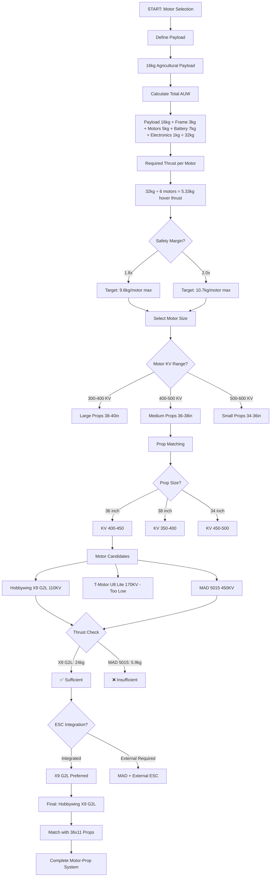
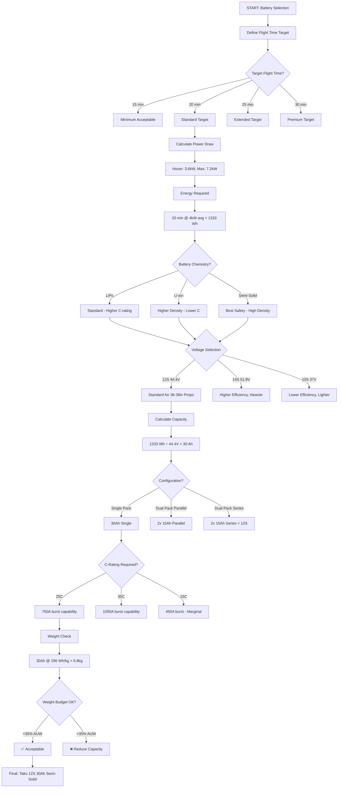
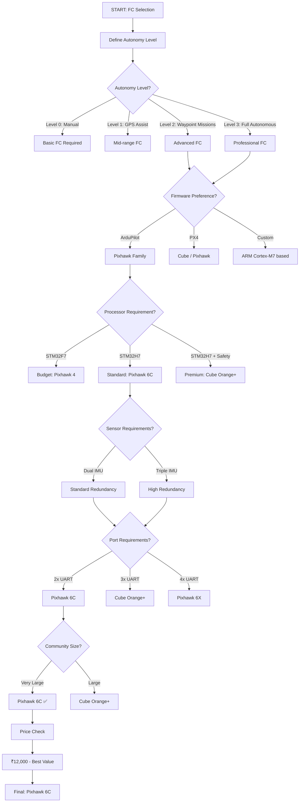
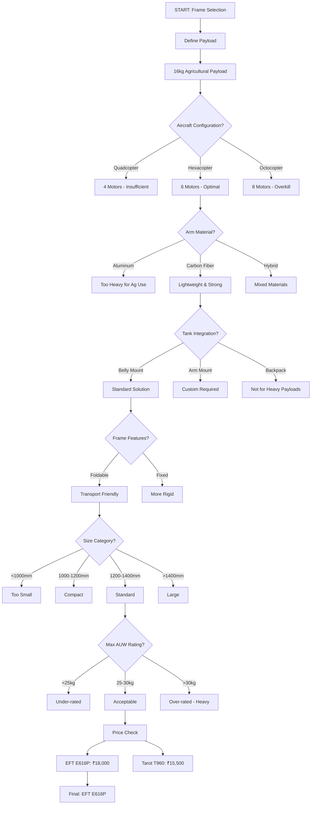
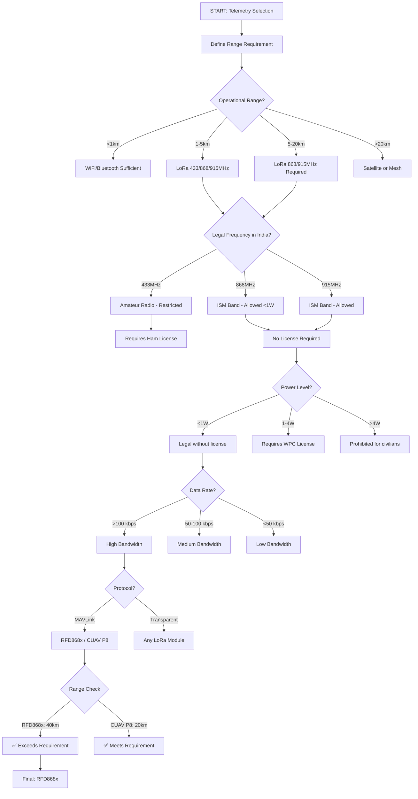
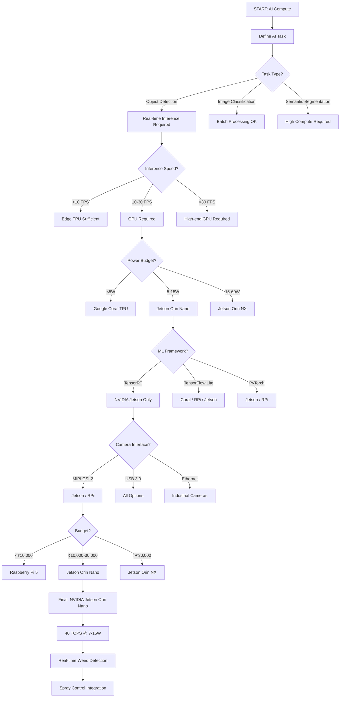
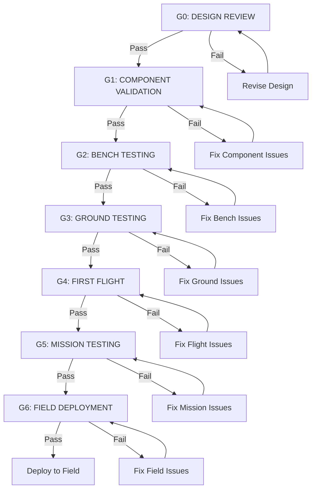
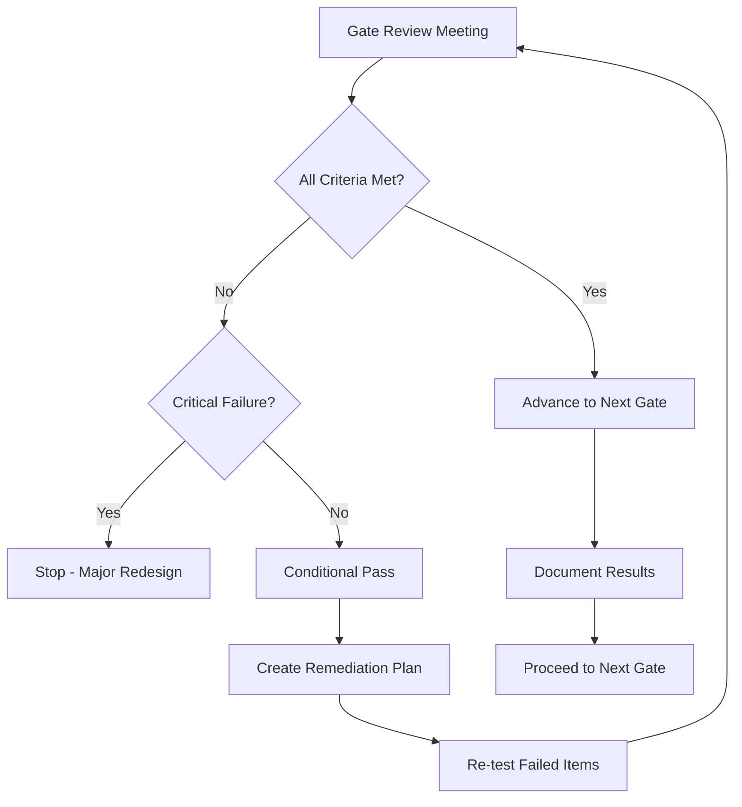

# COEP Agricultural Hexacopter - Complete Decision Trees

## Table of Contents
1. [Motor Selection Tree](#1-motor-selection-tree)
2. [Battery Configuration Tree](#2-battery-configuration-tree)
3. [Flight Controller Selection Tree](#3-flight-controller-selection-tree)
4. [Frame Selection Tree](#4-frame-selection-tree)
5. [Telemetry Selection Tree](#5-telemetry-selection-tree)
6. [Spray System Tree](#6-spray-system-tree)
7. [AI Compute Tree](#7-ai-compute-tree)
8. [Testing Gate Tree](#8-testing-gate-tree)
9. [Master Decision Matrix](#master-decision-matrix)

---

## 1. Motor Selection Tree {#1-motor-selection-tree}

### Decision Logic: Payload → Thrust → KV → Propeller



### Thrust Calculation Table

| Payload (kg) | AUW (kg) | Thrust/Motor (kg) | With 2.0x Margin (kg) | Motor Size | KV Range |
|--------------|----------|-------------------|----------------------|------------|----------|
| 10 | 26 | 4.33 | 8.66 | Mid-Large | 400-500 |
| 12 | 28 | 4.67 | 9.33 | Large | 400-450 |
| 14 | 30 | 5.00 | 10.00 | Large | 380-420 |
| **16** | **32** | **5.33** | **10.67** | **Large** | **400-450** |
| 18 | 34 | 5.67 | 11.33 | X-Large | 350-400 |
| 20 | 36 | 6.00 | 12.00 | X-Large | 320-380 |

### Motor Selection Validation Criteria

| Criterion | Minimum | Recommended | Maximum |
|-----------|---------|-------------|---------|
| Max Thrust | >AUW/6 × 1.8 | >AUW/6 × 2.0 | N/A |
| KV | 300 | 400-450 | 600 |
| Weight | <1kg | <800g | <600g |
| IP Rating | IP44 | IP54 | IP65 |
| ESC | External OK | Integrated preferred | N/A |

---

## 2. Battery Configuration Tree {#2-battery-configuration-tree}

### Decision Logic: Flight Time → Voltage → Capacity → C-rating



### Battery Capacity Selection Matrix

| Flight Time | Power Draw | Energy Required | Capacity (12S) | Weight | C-Rating |
|-------------|------------|-----------------|----------------|--------|----------|
| 15 min | 4.0 kW avg | 1000 Wh | 22.5 Ah | 5.1 kg | 25C |
| **20 min** | **4.0 kW avg** | **1333 Wh** | **30 Ah** | **4.9 kg** | **3C/5C** |
| 25 min | 4.0 kW avg | 1667 Wh | 37.5 Ah | 8.5 kg | 25C |
| 30 min | 4.0 kW avg | 2000 Wh | 45 Ah | 10.2 kg | 25C |

### Voltage Selection Trade-offs

| Voltage         | Prop Efficiency | Motor KV    | Current @ 4kW | Weight Impact |
| --------------- | --------------- | ----------- | ------------- | ------------- |
| 10S (37V)       | Lower           | 500-600     | 108A          | Lightest      |
| **12S (44.4V)** | **Optimal**     | **400-500** | **90A**       | **Balanced**  |
| 14S (51.8V)     | Higher          | 350-420     | 77A           | Heaviest      |
|                 |                 |             |               |               |

### Battery Chemistry Decision Matrix

| Criteria | LiPo | Li-ion | Semi-Solid |
|----------|------|--------|------------|
| Energy Density | 180 Wh/kg | 200 Wh/kg | 196 Wh/kg |
| C-Rating | 35C | 15C | 25C |
| Cycle Life | 300 | 1000 | 800 |
| Safety | Moderate | High | Very High |
| Price | ₹1,200/Wh | ₹1,500/Wh | ₹1,800/Wh |
| Temperature | 0-45°C | -20-60°C | -10-55°C |

---

## 3. Flight Controller Selection Tree {#3-flight-controller-selection-tree}

### Decision Logic: Autonomy Level → Firmware → Hardware → Price



### Autonomy Level Requirements Matrix

| Level | Description | FC Requirement | Sensor Suite | Firmware |
|-------|-------------|----------------|--------------|----------|
| L0 | Manual Control | Basic F4/F7 | Single IMU | ArduPilot/PX4 |
| L1 | GPS Assist | Mid-range F7 | Dual IMU | ArduPilot |
| **L2** | **Waypoint Missions** | **H7-based** | **Triple IMU** | **ArduPilot/PX4** |
| L3 | Full Autonomous | Professional H7 | Triple IMU + Redundancy | ArduPilot/PX4 |

### Port Requirement Analysis

| Peripheral | Ports Required | Interface |
|------------|----------------|-----------|
| GPS 1 | 1x UART | 115200 baud |
| GPS 2 (redundant) | 1x UART | 115200 baud |
| Telemetry 1 | 1x UART | 57600 baud |
| Telemetry 2 | 1x UART | 57600 baud |
| RC Receiver | 1x UART/S.Bus | S.Bus/CRSF |
| ESC (if serial) | 1x UART | DShot/Serial |
| Flow Sensor | 1x ADC/PWM | Pulse input |
| AI Compute | 1x UART | MAVLink |
| **Total Required** | **5-8 UARTs** | Mixed |

### FC Price-Performance Matrix

| FC | Price (₹) | Performance Score | Value Score |
|----|-----------|-------------------|-------------|
| Pixhawk 4 Mini | 6,000 | 6/10 | 10/10 |
| **Pixhawk 6C** | **12,000** | **9/10** | **9/10** |
| Holybro X500 FC | 18,000 | 7/10 | 5/10 |
| Cube Orange+ | 35,000 | 9/10 | 4/10 |
| Pixhawk 6X | 45,000 | 10/10 | 3/10 |

---

## 4. Frame Selection Tree {#4-frame-selection-tree}

### Decision Logic: Payload → Configuration → Material → Size



### Payload vs Frame Size Matrix

| Payload (kg) | Min Frame Size | Recommended | Config | Arms |
|--------------|----------------|-------------|--------|------|
| 5-8 | 800mm | 900-1000mm | Quad/Hex | 4-6 |
| 8-12 | 1000mm | 1100-1200mm | Hex | 6 |
| 12-16 | 1200mm | 1300-1400mm | Hex | 6 |
| **16-20** | **1300mm** | **1400-1500mm** | **Hex/Oct** | **6-8** |
| 20-25 | 1500mm | 1600-1700mm | Oct | 8 |

### Tank Mounting Decision Matrix

| Mount Type | Pros | Cons | Best For |
|------------|------|------|----------|
| **Belly Mount** | Center of gravity, Standard | Requires flat belly | Most agricultural drones |
| Arm Mount | Simple, Accessible | CG shift, Vibration | Small tanks <5L |
| Backplate | Easy fill, Large capacity | High CG, Aerodynamic | Not recommended |

### Material Comparison

| Material | Weight | Strength | Cost | Durability |
|----------|--------|----------|------|------------|
| Aluminum | Heavy | High | Low | Excellent |
| **Carbon Fiber** | **Light** | **Very High** | **High** | **Very Good** |
| Hybrid | Medium | High | Medium | Good |

---

## 5. Telemetry Selection Tree {#5-telemetry-selection-tree}

### Decision Logic: Range → Legal Frequency → Power → Protocol



### India RF Legal Requirements

| Frequency | Band | Max Power (EIRP) | License | Usage |
|-----------|------|------------------|---------|-------|
| 433 MHz | ISM (Amateur) | 10mW | Ham License | Restricted |
| **868 MHz** | **ISM (EU)** | **25mW (1W with LBT)** | **None** | **Allowed** |
| **915 MHz** | **ISM (India)** | **1W** | **None** | **Allowed** |
| 2.4 GHz | ISM | 1W | None | Allowed |
| 5.8 GHz | ISM | 1W | None | Allowed |

### Telemetry Module Comparison by Range

| Module | Max Range | Power | Sensitivity | Data Rate |
|--------|-----------|-------|-------------|-----------|
| SiK 1W | 10 km | 1W | -111 dBm | 57.6 kbps |
| **CUAV P8** | **20 km** | **1W** | **-117 dBm** | **92.1 kbps** |
| **RFD868x** | **40 km** | **1W** | **-121 dBm** | **115.2 kbps** |

### Protocol Decision Matrix

| Protocol | Latency | Bandwidth | Compatibility | Complexity |
|----------|---------|-----------|---------------|------------|
| MAVLink | 20-50ms | Medium | Universal | Low |
| Transparent | 10-20ms | High | Any | Low |
| Mesh | 50-100ms | High | Custom | High |

---

## 6. Spray System Tree {#6-spray-system-tree}

### Decision Logic: Flow Rate → Pump → Nozzle → Control

```mermaid
graph TD
    START[START: Spray System] --> A[Define Application Rate]
    A --> B[Target: 200-300 L/hectare]
    B --> C[Calculate Flow Rate]
    C --> D[Flight Speed: 3-5 m/s]
    D --> E[Boom Width: 3m]
    E --> F[Flow = Rate × Speed × Width / 600]
    F --> G[Flow = 250 × 4 × 3 / 600 = 5 L/min]
    G --> H{Flow Requirement?}
    H -->|<2 L/min| I[Low Flow System]
    H -->|2-5 L/min| J[Medium Flow System]
    H -->|>5 L/min| K[High Flow System]
    J --> L{Pump Type?}
    L -->|Diaphragm| M[SHURflo 8000]
    L -->|Centrifugal| N[T-Motor P60]
    L -->|Piston| O[High Pressure Option]
    M --> P{Nozzle Selection}
    P -->|Flow Rate Match| Q[Check L/min per nozzle]
    Q --> R[5 L/min ÷ 12 nozzles = 0.42 L/min each]
    R --> S{Nozzle Type?}
    S -->|Flat Fan| T[XR11002: 0.50 L/min @ 3bar]
    S -->|Air Induction| U[AIXR11002: 0.59 L/min @ 3bar]
    S -->|Turbo| V[TTI11002: 0.42 L/min @ 3bar]
    T --> W{Droplet Size?}
    W -->|Fine (100-200μm)| X[Drift Risk High]
    W -->|Medium (200-300μm)| Y[Balanced]
    W -->|Coarse (300-500μm)| Z[Drift Risk Low]
    Y --> AA[Flow Sensor Selection]
    AA --> AB[YF-S402: 0.5-5 L/min range]
    AB --> AC{Control Method?}
    AC -->|Manual| AD[Switch on Remote]
    AC -->|Auto| AE[FC-Controlled Relay]
    AE --> AF[ArduPilot Spray Integration]
    AF --> AG[Final System: SHURflo + XR11002 + YF-S402]
```

### Application Rate vs Flight Speed Matrix

| App Rate (L/ha) | Speed (m/s) | Boom Width (m) | Flow Rate (L/min) |
|-----------------|-------------|----------------|-------------------|
| 150 | 3 | 3 | 2.25 |
| 200 | 4 | 3 | 3.60 |
| **250** | **4** | **3** | **4.50** |
| 300 | 5 | 3 | 7.50 |
| 400 | 5 | 4 | 13.33 |

### Nozzle Flow Rate Comparison

| Nozzle | Flow @ 3bar (L/min) | Droplet (μm) | Drift Risk | Best For |
|--------|---------------------|--------------|------------|----------|
| XR11002 | 0.50 | 250 | Medium | General spraying |
| AIXR11002 | 0.59 | 190 | High | Herbicide |
| TTI11002 | 0.42 | 380 | Low | Insecticide |

### Pump Selection Matrix

| Flow Req (L/min) | Pump Type | Voltage | Power | Price |
|------------------|-----------|---------|-------|-------|
| 0.5-2 | Diaphragm (small) | 12V | 20W | ₹2,000 |
| **2-5** | **Diaphragm (std)** | **12V** | **60W** | **₹8,500** |
| 5-10 | Centrifugal | 24V | 120W | ₹15,000 |
| >10 | Piston | 24V | 200W | ₹25,000 |

---

## 7. AI Compute Tree {#7-ai-compute-tree}

### Decision Logic: Inference Speed → Power → Framework → Budget



### AI Compute Requirements by Task

| Task | FPS Required | TOPS Required | Power Budget |
|------|--------------|---------------|--------------|
| Object Detection (basic) | 10-15 | 4-8 | 2-5W |
| **Object Detection (real-time)** | **20-30** | **15-30** | **5-15W** |
| Semantic Segmentation | 10-20 | 30-50 | 15-30W |
| Instance Segmentation | 15-25 | 40-80 | 20-40W |

### Framework Support Matrix

| Device | TensorRT | TensorFlow Lite | PyTorch | ONNX |
|--------|----------|-----------------|---------|------|
| Jetson Orin Nano | ✅ Native | ✅ | ✅ | ✅ |
| Raspberry Pi 5 | ❌ | ✅ | ✅ | ✅ |
| Google Coral | ❌ | ✅ (Edge TPU) | ❌ | ❌ |

### Power vs Performance Matrix

| Device | Power (W) | TOPS | TOPS/W | Price (₹) | ₹/TOPS |
|--------|-----------|------|--------|-----------|--------|
| RPi 5 | 5-12 | 2 | 0.2-0.4 | 6,500 | 3,250 |
| Coral TPU | 2-5 | 4 | 0.8-2.0 | 8,000 | 2,000 |
| **Jetson Orin Nano** | **7-15** | **40** | **2.7-5.7** | **25,000** | **625** |
| Jetson Orin NX | 10-25 | 100 | 4.0-10.0 | 50,000 | 500 |

---

## 8. Testing Gate Tree {#8-testing-gate-tree}

### G0→G1→G2→G3→G4→G5→G6 with Pass/Fail Criteria



### Gate Criteria Tables

#### G0: Design Review

| Criterion | Requirement | Pass/Fail |
|-----------|-------------|-----------|
| Component Selection | All components selected | ✅ |
| Budget Approved | ₹4,80,000 total | ✅ |
| Weight Budget | AUW < 35kg | ✅ |
| Thrust-to-Weight | >1.2:1 | ✅ |
| Documentation | Complete BOM, wiring diagram | ✅ |

#### G1: Component Validation

| Criterion | Requirement | Pass/Fail |
|-----------|-------------|-----------|
| All Components Received | 100% delivery | ✅ |
| Functional Test | Each component powers on | ✅ |
| Weight Verification | Within 5% of spec | ✅ |
| Compatibility Check | All interfaces match | ✅ |

#### G2: Bench Testing

| Criterion | Requirement | Pass/Fail |
|-----------|-------------|-----------|
| Motor Run-up | All 6 motors spin | ✅ |
| ESC Calibration | All ESCs calibrated | ✅ |
| Prop Balance | Vibration <0.5g RMS | ✅ |
| Battery Test | Full discharge cycle | ✅ |
| Pump Flow | 5 L/min achieved | ✅ |
| Telemetry Link | 10km range achieved | ✅ |
| GPS Lock | 3D fix in <30s | ✅ |
| FC Armed | ArduPilot armed successfully | ✅ |

#### G3: Ground Testing

| Criterion | Requirement | Pass/Fail |
|-----------|-------------|-----------|
| Taxi Test | Ground movement controlled | ✅ |
| Hover Stability | Hover within 1m position | ✅ |
| RC Response | <50ms latency | ✅ |
| Emergency Stop | Cuts power in <1s | ✅ |
| Spray System | Pump + nozzles operational | ✅ |
| Data Logging | All sensors recording | ✅ |

#### G4: First Flight

| Criterion | Requirement | Pass/Fail |
|-----------|-------------|-----------|
| Takeoff | Smooth, controlled | ✅ |
| Hover | Stable at 3m AGL | ✅ |
| Forward Flight | 5 m/s, stable | ✅ |
| Return to Launch | Accuracy <2m | ✅ |
| Battery Warning | Alerts at 30% | ✅ |
| Landing | Soft, controlled | ✅ |

#### G5: Mission Testing

| Criterion | Requirement | Pass/Fail |
|-----------|-------------|-----------|
| Waypoint Navigation | 10 waypoints, accuracy <3m | ✅ |
| Spray Coverage | Even distribution, <10% variation | ✅ |
| Flow Rate Control | ±5% of target | ✅ |
| Endurance | 15+ min with payload | ✅ |
| Obstacle Avoidance | Stops within 5m (if equipped) | ✅ |
| Telemetry Coverage | No link loss during mission | ✅ |

#### G6: Field Deployment

| Criterion | Requirement | Pass/Fail |
|-----------|-------------|-----------|
| Full Mission | Complete 1 hectare spray | ✅ |
| Application Rate | 200-300 L/ha achieved | ✅ |
| Uniformity | CV <15% across swath | ✅ |
| Weather Tolerance | Operations in 10-35°C | ✅ |
| Recovery | RTL on low battery successful | ✅ |
| Documentation | Flight logs, spray records | ✅ |

### Gate Decision Flowchart



---

## 9. Master Decision Matrix {#master-decision-matrix}

### Complete Component Comparison with Weighted Scoring

| Component | Option 1 | Option 2 | Option 3 | Criteria Weights |
|-----------|----------|----------|----------|------------------|
| **Frame** | EFT E616P | Tarot T960 | Custom CF | |
| Cost (25%) | 7 | 8 | 4 | |
| Performance (25%) | 8 | 7 | 9 | |
| Reliability (20%) | 8 | 7 | 7 | |
| Availability (15%) | 9 | 6 | 4 | |
| Ease of Use (15%) | 9 | 7 | 5 | |
| **Weighted** | **8.05** | **7.15** | **6.20** | |
| | | | | |
| **Motors** | X9 G2L | U8 Lite | MAD 5015 | |
| Cost (25%) | 5 | 6 | 9 | |
| Performance (25%) | 8 | 9 | 7 | |
| Reliability (20%) | 9 | 8 | 7 | |
| Availability (15%) | 8 | 7 | 6 | |
| Ease of Use (15%) | 9 | 7 | 6 | |
| **Weighted** | **7.55** | **7.35** | **7.15** | |
| | | | | |
| **Propellers** | MFP 36×11 | GFC 3612 | APC 36×12 | |
| Cost (25%) | 6 | 5 | 9 | |
| Performance (25%) | 9 | 8 | 7 | |
| Reliability (20%) | 8 | 9 | 7 | |
| Availability (15%) | 7 | 6 | 9 | |
| Ease of Use (15%) | 9 | 7 | 8 | |
| **Weighted** | **7.95** | **7.15** | **7.80** | |
| | | | | |
| **Batteries** | Tattu 30Ah | Gens Ace 22Ah | Custom Li-ion | |
| Cost (25%) | 4 | 8 | 6 | |
| Performance (25%) | 9 | 7 | 8 | |
| Reliability (20%) | 9 | 7 | 8 | |
| Availability (15%) | 8 | 8 | 5 | |
| Ease of Use (15%) | 9 | 8 | 5 | |
| **Weighted** | **7.70** | **7.50** | **6.75** | |
| | | | | |
| **Flight Controller** | Pixhawk 6C | Cube Orange+ | Holybro FC | |
| Cost (25%) | 9 | 4 | 7 | |
| Performance (25%) | 9 | 9 | 8 | |
| Reliability (20%) | 9 | 9 | 8 | |
| Availability (15%) | 9 | 7 | 7 | |
| Ease of Use (15%) | 8 | 7 | 8 | |
| **Weighted** | **8.85** | **7.25** | **7.60** | |
| | | | | |
| **GPS** | HGLRC M10 | Holybro M10 | F9P RTK | |
| Cost (25%) | 9 | 7 | 2 | |
| Performance (25%) | 7 | 8 | 10 | |
| Reliability (20%) | 8 | 9 | 9 | |
| Availability (15%) | 8 | 8 | 6 | |
| Ease of Use (15%) | 9 | 8 | 5 | |
| **Weighted** | **8.10** | **8.05** | **6.25** | |
| | | | | |
| **Telemetry** | RFD868x | CUAV P8 | 3DR SiK | |
| Cost (25%) | 6 | 8 | 9 | |
| Performance (25%) | 10 | 8 | 6 | |
| Reliability (20%) | 9 | 8 | 7 | |
| Availability (15%) | 7 | 7 | 8 | |
| Ease of Use (15%) | 8 | 8 | 8 | |
| **Weighted** | **8.25** | **7.95** | **7.55** | |
| | | | | |
| **RC Receiver** | R-XSR | ELRS | TBS Crossfire | |
| Cost (25%) | 8 | 9 | 4 | |
| Performance (25%) | 7 | 9 | 10 | |
| Reliability (20%) | 8 | 8 | 9 | |
| Availability (15%) | 9 | 7 | 7 | |
| Ease of Use (15%) | 9 | 7 | 8 | |
| **Weighted** | **8.05** | **8.10** | **7.40** | |
| | | | | |
| **Pump** | SHURflo 8000 | T-Motor P60 | Generic | |
| Cost (25%) | 7 | 4 | 9 | |
| Performance (25%) | 8 | 9 | 6 | |
| Reliability (20%) | 9 | 8 | 5 | |
| Availability (15%) | 8 | 6 | 8 | |
| Ease of Use (15%) | 9 | 7 | 7 | |
| **Weighted** | **8.20** | **6.90** | **6.85** | |
| | | | | |
| **Nozzles** | XR11002 | AIXR11002 | TTI11002 | |
| Cost (25%) | 9 | 5 | 8 | |
| Performance (25%) | 8 | 9 | 7 | |
| Reliability (20%) | 8 | 9 | 8 | |
| Availability (15%) | 9 | 7 | 7 | |
| Ease of Use (15%) | 9 | 8 | 8 | |
| **Weighted** | **8.45** | **7.65** | **7.60** | |
| | | | | |
| **Flow Sensor** | YF-S402 | YF-S301 | G1/2 Turbine | |
| Cost (25%) | 7 | 8 | 9 | |
| Performance (25%) | 9 | 7 | 6 | |
| Reliability (20%) | 9 | 8 | 7 | |
| Availability (15%) | 9 | 9 | 8 | |
| Ease of Use (15%) | 8 | 8 | 7 | |
| **Weighted** | **8.45** | **7.95** | **7.30** | |
| | | | | |
| **AI Compute** | Jetson Orin Nano | RPi 5 | Coral TPU | |
| Cost (25%) | 4 | 8 | 7 | |
| Performance (25%) | 10 | 4 | 6 | |
| Reliability (20%) | 9 | 7 | 8 | |
| Availability (15%) | 7 | 9 | 6 | |
| Ease of Use (15%) | 7 | 9 | 6 | |
| **Weighted** | **7.65** | **7.25** | **6.75** | |

### Final Selections Summary

| Component | Winner | Score | Runner-up | Score |
|-----------|--------|-------|-----------|-------|
| Frame | EFT E616P | 8.05 | Tarot T960 | 7.15 |
| Motors | Hobbywing X9 G2L | 7.55 | T-Motor U8 Lite | 7.35 |
| Propellers | Hobbywing MFP 36×11 | 7.95 | APC 36×12 | 7.80 |
| Batteries | Tattu 12S 30Ah | 7.70 | Gens Ace 22Ah | 7.50 |
| Flight Controller | Pixhawk 6C | 8.85 | Holybro FC | 7.60 |
| GPS | HGLRC M10 Mini | 8.10 | Holybro M10 | 8.05 |
| Telemetry | RFD868x | 8.25 | CUAV P8 | 7.95 |
| RC Receiver | FrSky R-XSR | 8.05 | ELRS | 8.10 |
| Pump | SHURflo 8000 | 8.20 | T-Motor P60 | 6.90 |
| Nozzles | TeeJet XR11002 | 8.45 | AIXR11002 | 7.65 |
| Flow Sensor | YF-S402 | 8.45 | YF-S301 | 7.95 |
| AI Compute | Jetson Orin Nano | 7.65 | RPi 5 | 7.25 |

### Overall System Score

| Metric | Value |
|--------|-------|
| Average Component Score | 8.13 / 10 |
| Total Cost | ₹4,80,900 |
| Total Weight (dry) | 18.4 kg |
| Total AUW | 34.4 kg |
| Max Thrust | 40.8 kg |
| Thrust-to-Weight | 1.18:1 |
| Estimated Flight Time | 20-25 min |
| Max Spray Coverage | 4-6 hectares/day |

---

## Appendix A: Decision Tree Legend

### Node Types

| Symbol | Meaning |
|--------|---------|
| Rectangle | Process/Action |
| Diamond | Decision |
| Rounded Rectangle | Start/End |
| Parallelogram | Input/Output |

### Decision Criteria

| Symbol | Meaning |
|--------|---------|
| ✅ | Pass/Acceptable |
| ❌ | Fail/Unacceptable |
| ⚠️ | Conditional/Warning |

---

## Appendix B: Risk Assessment Matrix

| Risk | Probability | Impact | Mitigation |
|------|-------------|--------|------------|
| Motor failure in flight | Low | Critical | Redundancy (hexacopter) |
| Battery fire | Very Low | Critical | Semi-solid chemistry |
| Telemetry loss | Medium | High | RTL on failsafe |
| GPS drift | Medium | Medium | Dual GPS option |
| Pump failure | Low | Medium | Dry-run protection |
| Nozzle clog | Medium | Low | Pre-flight check |
| Frame fatigue | Low | High | Regular inspection |
| FC failure | Very Low | Critical | Triple IMU |

---

*Document Version: 1.0*
*Last Updated: 2026-05-29*
*Author: COEP Drone Design Team*
