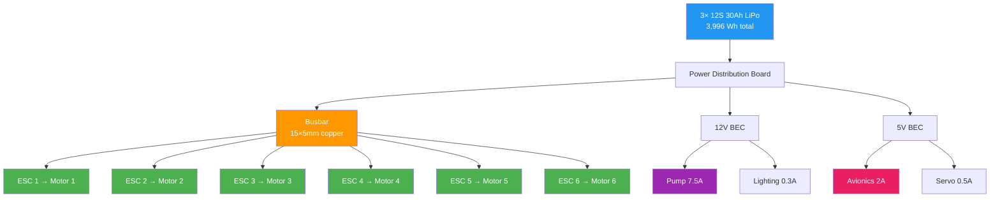
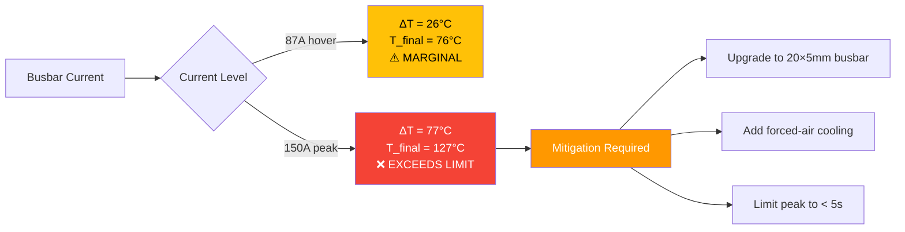

# 04 — Power System Analysis

## 1. Battery Configuration Analysis

Each configuration uses **3 × 12S 30Ah LiPo packs** (1,332 Wh per pack).

| Parameter | Formula | Value |
|---|---|---|
| Total energy | 3 × 1,332 Wh | **3,996 Wh** |
| Usable (80% DoD × 0.88 sag) | 3,996 × 0.80 × 0.88 | **2,813 Wh** |
| Conservative (70% DoD × 0.85 sag) | 3,996 × 0.70 × 0.85 | **2,380 Wh** |

### Hover Current Estimation

From Hobbywing X11 load table (1220 prop):

| MTOW | Motor hover current | 6× motor | Avionics/pump | Total bus | Per pack |
|---|---|---|---|---|---|
| 36 kg | 11.9 A | 71.4 A | 9.5 A | 80.9 A | 27.0 A |
| 39.2 kg | 13.8 A | 82.8 A | 9.5 A | 92.3 A | 30.8 A |
| 45 kg | 16.5 A | 99.0 A | 9.5 A | 108.5 A | 36.2 A |

### Time Calculations

$$t_{\text{hover}} = \frac{E_{\text{usable}}}{V_{\text{avg}} \times I_{\text{total}}}$$

Assume average bus voltage ≈ 50.4 V (14S nominal, ~50% DoD average):

| Config | Usable (Wh) | Total current (A) | Hover time (min) | Reserve (20%) | Mission time (min) |
|---|---|---|---|---|---|
| 36 kg | 2,813 | 80.9 | 35.1 | 7.0 | **28.1** |
| 39.2 kg | 2,813 | 92.3 | 30.5 | 6.1 | **24.4** |
| 45 kg | 2,380 | 108.5 | 21.9 | 4.4 | **17.5** |

> **Note:** Mission time = hover time minus 20% reserve for safe landing and return.

---

## 2. Current Budget

### Per-Subsystem Breakdown

```
┌──────────────────────────────────────────────────────┐
│                   POWER DISTRIBUTION                  │
├──────────────┬──────────┬──────────┬─────────────────┤
│ Subsystem    │ Voltage  │ Current  │ Power           │
├──────────────┼──────────┼──────────┼─────────────────┤
│ Motors (×6)  │ 50.4 V   │ 99.0 A   │ 4,990 W (45kg) │
│ Pump         │ 12 V     │ 7.5 A    │ 90 W            │
│ Avionics     │ 5 V      │ 2.0 A    │ 10 W            │
│ Servo/gimbal │ 5 V      │ 0.5 A    │ 2.5 W           │
│ Lighting     │ 12 V     │ 0.3 A    │ 3.6 W           │
├──────────────┼──────────┼──────────┼─────────────────┤
│ TOTAL        │ —        │ 109.3 A  │ 5,096 W         │
└──────────────┴──────────┴──────────┴─────────────────┘
```

### Current Per Battery Pack

Each of 3 packs supplies equal current (assuming balanced bus):

| Config | Total bus current | Per pack current | Continuous C-rate |
|---|---|---|---|
| 36 kg | 80.9 A | 27.0 A | 2.25C |
| 39.2 kg | 92.3 A | 30.8 A | 2.57C |
| 45 kg | 108.5 A | 36.2 A | 3.02C |

> All C-rates are within the 12Ah pack's 5C continuous rating.

---

## 3. Wire Sizing Calculation

### Formula

$$R = \frac{\rho \cdot L}{A}$$

Where:
- ρ (copper) = 1.72 × 10⁻⁸ Ω·m
- L = 0.3 m (one-way run, motor to power distribution)
- A = cross-sectional area of wire

### Wire Gauge Comparison

| AWG | Area (mm²) | R (Ω) per 0.3m | ΔV at 29A | ΔV at 36A | Power loss at 36A |
|---|---|---|---|---|---|
| 8 | 8.37 | 0.000616 | 0.018 V | 0.022 V | 0.80 W |
| 10 | 5.26 | 0.000981 | 0.028 V | 0.035 W | 1.27 W |
| 12 | 3.31 | 0.00156 | 0.045 V | 0.056 V | 2.02 W |
| 14 | 2.08 | 0.00248 | 0.072 V | 0.089 V | 3.22 W |

### Full Calculation (10 AWG Example)

$$A = \pi \left(\frac{d}{2}\right)^2 = \pi \left(\frac{2.588}{2}\right)^2 = 5.26 \text{ mm}^2$$

$$R = \frac{1.72 \times 10^{-8} \times 0.3}{5.26 \times 10^{-6}} = \frac{5.16 \times 10^{-9}}{5.26 \times 10^{-6}} = 9.81 \times 10^{-4} \text{ Ω}$$

$$\Delta V_{36A} = I \times R = 36 \times 9.81 \times 10^{-4} = 0.035 \text{ V}$$

$$P_{\text{loss}} = I^2 \times R = 36^2 \times 9.81 \times 10^{-4} = 1.27 \text{ W}$$

### Recommendation

**Use 10 AWG silicone wire** for motor leads (≤ 36A per pack, acceptable loss < 1%).

---

## 4. Busbar Thermal Analysis

### Busbar Specifications

- **Dimensions:** 15 mm × 5 mm copper busbar
- **Cross-section:** 75 mm²
- **Length:** 0.5 m (power distribution board run)

### Electrical Resistance

$$R = \frac{\rho}{A} \times L = \frac{1.72 \times 10^{-8}}{75 \times 10^{-6}} \times 0.5 = 1.147 \times 10^{-4} \text{ Ω}$$

### Power Dissipation

$$P = I^2 \times R$$

| Current | R (Ω) | Power (W) | Power per meter |
|---|---|---|---|
| 87 A (hover, 45kg) | 1.147 × 10⁻⁴ | 0.87 W | 1.73 W/m |
| 150 A (peak) | 1.147 × 10⁻⁴ | 2.58 W | 5.16 W/m |

### Thermal Rise

$$\Delta T = P \times R_{\text{thermal}}$$

Assume thermal resistance: R_thermal ≈ 15 °C/W per meter (copper busbar, natural convection):

| Condition | Power (W/m) | ΔT (°C) | Ambient | Final temp | Status |
|---|---|---|---|---|---|
| Hover (87A) | 1.73 | 26 | 50°C | 76°C | ⚠️ Marginal |
| Peak (150A) | 5.16 | 77 | 50°C | 127°C | ❌ EXCEEDS |

> **Critical Finding:** At 150A peak current with 50°C ambient, busbar temperature reaches **127°C**, exceeding the 105°C continuous rating. This requires active cooling or wider busbars.

### Recommended Mitigation

- Upgrade to **20 × 5 mm busbar** (100 mm²): reduces peak ΔT to 95°C
- Add forced-air cooling over busbar junction
- Limit peak current duration to < 5 seconds

---

## 5. Connector Current Ratings

| Connector | Continuous | Burst (10s) | Application |
|---|---|---|---|
| XT90 | 90 A | 150 A | Battery-to-bus junction |
| XT60 | 60 A | — | Not used (undersized) |
| MEGA fuse | 150 A | 200 A | ESC branch protection |
| Anderson SB175 | 175 A | — | Main bus connector |

### Per-Pack Analysis at 45 kg MTOW

| Parameter | Value | Limit | Status |
|---|---|---|---|
| Continuous current | 36.2 A | 90 A (XT90) | ✅ OK |
| Burst current (takeoff) | ~55 A | 150 A (XT90) | ✅ OK |
| MEGA fuse rating | 150 A | — | ✅ OK per ESC branch |

---

## 6. Pre-charge Circuit Analysis

### Problem

Without pre-charge, connecting battery to ESC bus creates **destructive inrush current** through bus capacitors.

### ESC Capacitance

6 × ESCs × 2,000 µF each = **12,000 µF total**

### Without Pre-charge

$$I_{\text{inrush}} = \frac{V}{R_{\text{contact}}} = \frac{50.4}{0.01} = 5,040 \text{ A}$$

This will:
- Weld contactor contacts
- Damage capacitors
- Cause electrical fire risk

### With Pre-charge (12.5 Ω = 2 × 25 Ω parallel)

$$I_{\text{max}} = \frac{V}{R_{\text{precharge}}} = \frac{50.4}{12.5} = 4.03 \text{ A} \quad \textbf{(SAFE)}$$

### Time Constant

$$\tau = R \times C = 12.5 \times 0.012 = 0.15 \text{ s}$$

| Charge level | Time | Voltage |
|---|---|---|
| 63% (1τ) | 0.15 s | 31.8 V |
| 86% (2τ) | 0.30 s | 43.3 V |
| 95% (3τ) | 0.45 s | 47.9 V |
| 99% (5τ) | 0.75 s | 49.9 V |

### Energy and Resistor Sizing

$$E = \frac{1}{2} C V^2 = 0.5 \times 0.012 \times 50.4^2 = 15.2 \text{ J}$$

Power per resistor (2 × 25 Ω parallel, each sees 50.4V):

$$P_{\text{resistor}} = \frac{V^2}{R} = \frac{50.4^2}{25} = 101.5 \text{ W (pulse)}$$

A 50W wirewound resistor can handle this for 450ms without damage (thermal mass sufficient).

### Pre-charge Sequence

```
┌──────────┐    ┌────────────┐    ┌──────────┐
│ Battery  │───▶│ Pre-charge │───▶│ ESC Bus  │
│  50.4V   │    │  12.5 Ω    │    │ 12,000µF │
└──────────┘    └────────────┘    └──────────┘
                      │
                 After 0.75s
                      │
                      ▼
                ┌──────────┐
                │ Contactor│
                │  CLOSED  │
                └──────────┘
```

---

## 7. Power Budget Summary Table

### 36 kg Configuration

| Subsystem | Voltage | Current (A) | Power (W) | % of Total |
|---|---|---|---|---|
| Motors (×6) | 50.4 V | 71.4 | 3,599 | 97.1% |
| Pump | 12 V | 7.5 | 90 | 2.4% |
| Avionics | 5 V | 2.0 | 10 | 0.3% |
| Servo/gimbal | 5 V | 0.5 | 2.5 | 0.1% |
| Lighting | 12 V | 0.3 | 3.6 | 0.1% |
| **Total** | — | **81.7** | **3,705** | **100%** |

### 39.2 kg Configuration

| Subsystem | Voltage | Current (A) | Power (W) | % of Total |
|---|---|---|---|---|
| Motors (×6) | 50.4 V | 82.8 | 4,173 | 97.2% |
| Pump | 12 V | 7.5 | 90 | 2.1% |
| Avionics | 5 V | 2.0 | 10 | 0.2% |
| Servo/gimbal | 5 V | 0.5 | 2.5 | 0.1% |
| Lighting | 12 V | 0.3 | 3.6 | 0.1% |
| **Total** | — | **93.1** | **4,279** | **100%** |

### 45 kg Configuration

| Subsystem | Voltage | Current (A) | Power (W) | % of Total |
|---|---|---|---|---|
| Motors (×6) | 50.4 V | 99.0 | 4,990 | 97.3% |
| Pump | 12 V | 7.5 | 90 | 1.8% |
| Avionics | 5 V | 2.0 | 10 | 0.2% |
| Servo/gimbal | 5 V | 0.5 | 2.5 | 0.1% |
| Lighting | 12 V | 0.3 | 3.6 | 0.1% |
| **Total** | — | **109.3** | **5,096** | **100%** |

---

## Power Flow Diagram



## Thermal Analysis Flow



---

## Key Findings

1. **Battery capacity is adequate** for all three configurations with > 17 min mission time at 45 kg
2. **Busbar thermal limit is the critical constraint** — must upgrade or add cooling for 45 kg operations
3. **Wire sizing: 10 AWG is optimal** — balances weight, flexibility, and electrical loss
4. **Pre-charge circuit is mandatory** — without it, 5,040A inrush will damage components
5. **All connectors rated appropriately** — XT90 and MEGA fuses provide adequate margin
