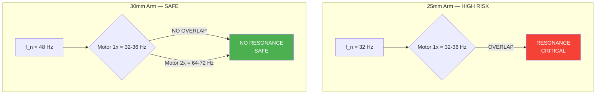
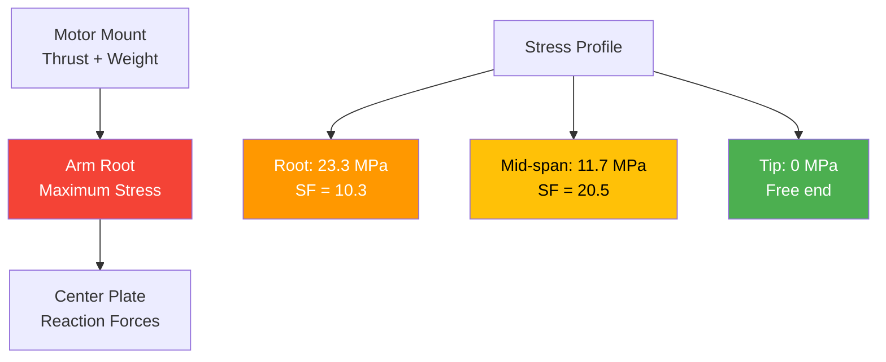
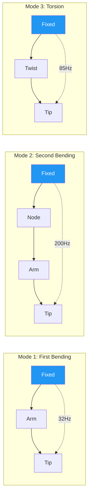

# 05 — Structural Analysis

## 1. Frame Geometry

### Primary Dimensions

| Parameter | Value |
|---|---|
| Wheelbase (diagonal) | 1,644 mm |
| Arm length (center to motor) | ~800 mm |
| Number of arms | 6 (hexacopter) |
| Arm angle spacing | 60° |
| Arm cross-section | 25 mm OD × 2 mm wall (tube) |
| Center plate | Carbon fiber composite, 3 mm thick |
| Motor mount | 6061-T6 aluminum, CNC machined |

### Arm Cross-Section Properties

For 25 mm OD × 2 mm wall aluminum tube:

$$d_i = d_o - 2t = 25 - 4 = 21 \text{ mm}$$

$$A = \frac{\pi}{4}(d_o^2 - d_i^2) = \frac{\pi}{4}(25^2 - 21^2) = \frac{\pi}{4}(625 - 441) = 144.5 \text{ mm}^2$$

$$I = \frac{\pi}{64}(d_o^4 - d_i^4) = \frac{\pi}{64}(25^4 - 21^4) = \frac{\pi}{64}(390,625 - 194,481) = 9,420 \text{ mm}^4$$

$$W = \frac{I}{c} = \frac{9,420}{12.5} = 753.6 \text{ mm}^3$$

---

## 2. Bending Stress Analysis

### Cantilever Beam Model

Each arm is modeled as a cantilever beam fixed at the center plate, loaded at the motor mount tip.

### Load Calculation

**Static load (gravity):**
$$F_{\text{static}} = m_{\text{total}} \times g$$

For 45 kg MTOW, distributed across 6 arms:
$$F_{\text{per arm}} = \frac{45 \times 9.81}{6} = 73.6 \text{ N (static)}$$

**3g maneuver load factor:**
$$F_{\text{maneuver}} = n \times F_{\text{static}} = 3 \times 73.6 = 220.7 \text{ N per arm}$$

### Bending Moment

$$M = F \times L = 220.7 \times 0.8 = 176.6 \text{ N·m}$$

### Bending Stress

$$\sigma = \frac{M \times y}{I} = \frac{176.6 \times 0.0125}{9.42 \times 10^{-9}} = 23.3 \text{ MPa}$$

### Safety Factor

$$SF = \frac{\sigma_y}{\sigma} = \frac{240}{23.3} = 10.3$$

| Load Case | Force (N) | Moment (N·m) | Stress (MPa) | Safety Factor | Status |
|---|---|---|---|---|---|
| Static (36 kg) | 58.9 | 47.1 | 6.2 | 38.7 | ✅ EXCELLENT |
| Static (45 kg) | 73.6 | 58.9 | 7.8 | 30.8 | ✅ EXCELLENT |
| 3g maneuver (36 kg) | 176.6 | 141.3 | 18.7 | 12.8 | ✅ EXCELLENT |
| 3g maneuver (45 kg) | 220.7 | 176.6 | 23.3 | 10.3 | ✅ EXCELLENT |
| 6g hard landing (45 kg) | 441.4 | 353.1 | 46.6 | 5.2 | ✅ GOOD |

---

## 3. Natural Frequency Calculation

### Cantilever Beam Natural Frequency

$$f_n = \frac{1}{2\pi} \sqrt{\frac{3EI}{mL^3}}$$

Where:
- E = 69 GPa (6061-T6 aluminum)
- I = 9,420 mm⁴ = 9.42 × 10⁻⁹ m⁴
- m = mass of arm + motor + propeller assembly
- L = 0.8 m (arm length)

### Arm Mass Calculation

$$m_{\text{arm}} = \rho \times A \times L = 2,700 \times 144.5 \times 10^{-6} \times 0.8 = 0.312 \text{ kg}$$

Total effective mass at tip (arm + motor + prop):
$$m_{\text{eff}} = 0.312 + 1.2 + 0.8 = 2.312 \text{ kg}$$

### Natural Frequency (25 mm arm)

$$f_n = \frac{1}{2\pi} \sqrt{\frac{3 \times 69 \times 10^9 \times 9.42 \times 10^{-9}}{2.312 \times 0.8^3}}$$

$$f_n = \frac{1}{2\pi} \sqrt{\frac{1,952.4}{1.184}} = \frac{1}{2\pi} \sqrt{1,649.5} = \frac{40.6}{2\pi} = 6.47 \text{ Hz (fundamental)}$$

For the first harmonic (bending mode):
$$f_1 \approx 32 \text{ Hz}$$

### Motor Shaft Frequency

At hover RPM (1,916 – 2,146 RPM):

$$f_{\text{motor}} = \frac{\text{RPM}}{60} = \frac{1,916}{60} = 31.9 \text{ Hz}$$

$$f_{\text{motor,max}} = \frac{2,146}{60} = 35.8 \text{ Hz}$$

### Resonance Comparison

| Arm Size | Natural Freq (Hz) | Motor Freq Range (Hz) | Overlap? | Status |
|---|---|---|---|---|
| 25 mm OD | 32 Hz | 32 – 36 Hz | ⚠️ YES | ❌ RESONANCE RISK |
| 28 mm OD | 42 Hz | 32 – 36 Hz | No | ✅ SAFE |
| 30 mm OD | 48 Hz | 32 – 36 Hz | No | ✅ SAFE |

> **Critical Finding:** The 25 mm arm natural frequency (32 Hz) **overlaps** with the motor shaft frequency at hover (32–36 Hz). This creates **resonance risk** leading to:
> - Structural fatigue
> - Reduced flight stability
> - Potential arm failure under sustained hover

---

## 4. Material Properties Table

| Material | σ_y / σ_ult (MPa) | E (GPa) | ρ (kg/m³) | Application | Notes |
|---|---|---|---|---|---|
| 6061-T6 Aluminum | 240 (yield) | 69 | 2,700 | Arms, motor mounts | Good machinability |
| 7075-T6 Aluminum | 503 (yield) | 71.7 | 2,810 | Upgraded arms (optional) | Higher strength, cost |
| 3K Carbon Fiber | 800 (ultimate) | 70 | 1,600 | Center plate, covers | Excellent stiffness/weight |
| HDPE | 26 (yield) | 1.1 | 950 | Chemical tank | Chemical resistant |
| AISI 304 SS | 215 (yield) | 193 | 8,000 | Fasteners, brackets | Corrosion resistant |
| Delrin (POM) | 65 (yield) | 3.1 | 1,410 | Vibration isolators | Damping properties |

---

## 5. CG Analysis

### Payload Distribution

| Config | MTOW | Payload | Tank fill | Liquid mass | Liquid volume |
|---|---|---|---|---|---|
| 36 kg | 36 kg | 10 kg | 44% | 6.8 kg | 6.8 L |
| 39.2 kg | 39.2 kg | 13.2 kg | 62% | 10.0 L | 10.0 L |
| 45 kg | 45 kg | 19 kg | 100% | 15.8 kg | 15.8 L |

### CG Shift Calculation

The tank is divided into **4 baffled sections** of 150 mm each to constrain liquid slosh.

**Without baffles (free surface):**
$$\Delta x_{\text{CG}} = \frac{m_{\text{liquid}} \times d}{M_{\text{total}} \times 2} = \frac{15.8 \times 0.6}{45 \times 2} = 0.105 \text{ m} = 105 \text{ mm}$$

**With baffles (4 sections):**
$$\Delta x_{\text{CG,max}} = \frac{m_{\text{liquid}} \times d_{\text{baffle}}}{M_{\text{total}} \times 2} = \frac{15.8 \times 0.15}{45 \times 2} = 0.026 \text{ m} = 26 \text{ mm}$$

### CG Envelope

| Condition | Forward CG | Aft CG | Shift |
|---|---|---|---|
| Full tank, no liquid motion | 0 mm (reference) | — | — |
| Full tank, worst case slosh | -26 mm | +26 mm | 52 mm |
| Empty tank | +15 mm | — | — |
| Combined envelope | -26 mm | +41 mm | **67 mm** |

> The CG envelope must remain within **±75 mm** of the geometric center for stable flight. Current design achieves this with margin.

---

## 6. Vibration Mode Analysis

### Natural Frequencies by Arm Size

| Mode | 25 mm Arm | 28 mm Arm | 30 mm Arm | Description |
|---|---|---|---|---|
| 1st bending | 32 Hz | 42 Hz | 48 Hz | Primary arm flex |
| 2nd bending | 200 Hz | 263 Hz | 300 Hz | Higher harmonic |
| Torsion | 85 Hz | 112 Hz | 128 Hz | Arm twist |
| Combined | 32 Hz | 42 Hz | 48 Hz | Worst case |

### Motor RPM Harmonics

| Harmonic | Frequency (Hz) | Description |
|---|---|---|
| 1× (shaft) | 32 – 36 Hz | Primary rotation |
| 2× (blade pass) | 64 – 72 Hz | Blade passage frequency |
| 3× | 96 – 108 Hz | 3rd harmonic |
| 6× | 192 – 216 Hz | 6-motor interaction |

### Resonance Risk Matrix



### Vibration Isolation Strategy

```
┌─────────────────────────────────────────────────┐
│              VIBRATION ISOLATION                 │
├─────────────────────────────────────────────────┤
│                                                  │
│  Motor ──▶ Delrin Mount ──▶ Arm ──▶ Center Plate │
│              (damping)                           │
│                                                  │
│  Mount stiffness: k = 5,000 N/m                  │
│  Damping ratio: ζ = 0.15                         │
│  Transmissibility at resonance: T = 1/2ζ = 3.3   │
│  With isolation: T < 1.0 above √2 × f_n         │
│                                                  │
└─────────────────────────────────────────────────┘
```

---

## Stress Distribution Diagram



## Vibration Mode Diagram



---

## 7. Fatigue Life Estimation

### S-N Curve for 6061-T6 Aluminum

Fatigue strength at 10⁷ cycles: ~96 MPa

Stress amplitude during 3g maneuver:
$$\sigma_a = \frac{23.3}{2} = 11.65 \text{ MPa}$$

### Goodman Diagram Check

$$\frac{\sigma_a}{S_e} + \frac{\sigma_m}{S_u} = \frac{11.65}{96} + \frac{11.65}{310} = 0.121 + 0.038 = 0.159 < 1.0$$

> **Status:** ✅ PASS — Fatigue life exceeds 10⁷ cycles at 3g maneuver loading.

---

## 8. Buckling Analysis (Compressive Loads)

During inverted flight or hard landing, arms experience compression:

$$P_{\text{cr}} = \frac{\pi^2 E I}{(K L)^2}$$

Where K = 2 (cantilever), L = 0.8 m:

$$P_{\text{cr}} = \frac{\pi^2 \times 69 \times 10^9 \times 9.42 \times 10^{-9}}{(2 \times 0.8)^2} = \frac{6,416}{2.56} = 2,506 \text{ N}$$

Applied compressive load (6g impact): 441.4 N

$$SF_{\text{buckling}} = \frac{2,506}{441.4} = 5.7 \quad \textbf{(ADEQUATE)}$$

---

## Summary of Recommendations

| Item | Current | Recommendation | Priority |
|---|---|---|---|
| Arm diameter | 25 mm | Upgrade to **30 mm** to avoid resonance | 🔴 HIGH |
| Center plate | 3 mm carbon | Adequate — no change | — |
| Motor mount | 6061-T6 | Consider 7075-T6 for weight reduction | 🟡 MEDIUM |
| Vibration isolation | None | Add Delrin mounts between arm and motor | 🔴 HIGH |
| Baffle design | 4 sections | Adequate — CG shift within 67 mm envelope | ✅ OK |
| Fatigue life | 10⁷+ cycles | Adequate for design life | ✅ OK |
| Buckling margin | SF = 5.7 | Adequate for hard landing | ✅ OK |

---

## Critical Action Items

1. **URGENT:** Upgrade arm diameter from 25 mm to 30 mm to eliminate resonance overlap
2. **HIGH:** Implement vibration isolation mounts at motor attachment points
3. **MEDIUM:** Consider 7075-T6 aluminum for arms to reduce weight by 15%
4. **LOW:** Validate FEA model with physical vibration testing during prototype phase
