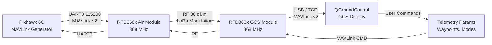
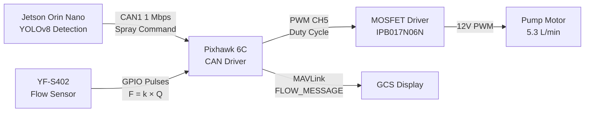
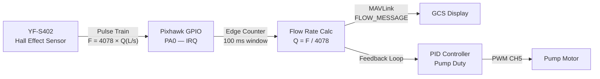
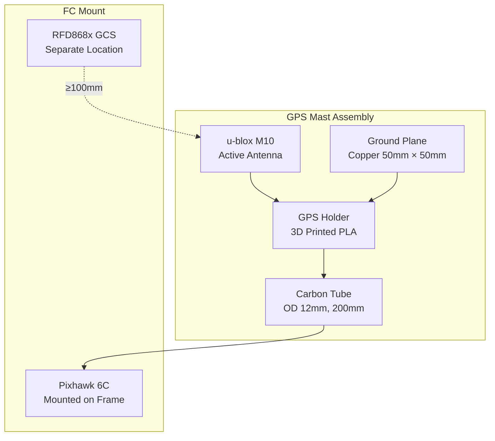
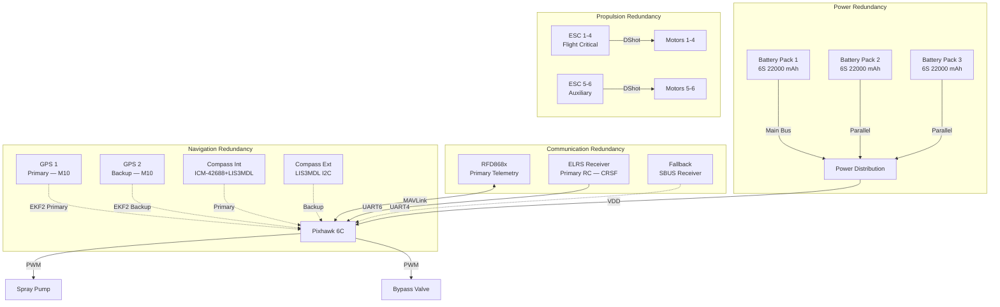

# 06 — Avionics Architecture Analysis

## 1. System Architecture Diagram

```mermaid
graph TB
    subgraph "Ground Control Station"
        GCS["QGroundControl GCS"]
        GCS_LINK["RFD868x GCS Module<br/>868 MHz, 30 dBm"]
    end

    subgraph "Airborne Avionics"
        FC["Pixhawk 6C<br/>STM32H743<br/>Central Hub"]

        subgraph "Navigation"
            GPS1["GPS 1 — M10<br/>UART1"]
            GPS2["GPS 2 — M10<br/>UART2"]
            COMP_INT["Compass — Internal<br/>ICM-42688 + LIS3MDL"]
            COMP_EXT["Compass — External<br/>LIS3MDL via I2C"]
            FLOW["Flow Sensor — YF-S402<br/>GPIO (IRQ)"]
        end

        subgraph "Communication"
            TELEM["RFD868x Air<br/>UART3 — MAVLink"]
            RC_RX["ELRS Receiver<br/>CRSF — UART6"]
        end

        subgraph "Propulsion"
            ESC1["ESC 1 — Front-Right<br/>DShot600"]
            ESC2["ESC 2 — Front-Left<br/>DShot600"]
            ESC3["ESC 3 — Rear-Left<br/>DShot600"]
            ESC4["ESC 4 — Rear-Right<br/>DShot600"]
            ESC5["ESC 5 — Aux CW<br/>DShot600"]
            ESC6["ESC 6 — Aux CCW<br/>DShot600"]
        end

        subgraph "AI & Payload"
            JETSON["Jetson Orin Nano<br/>AI Inference"]
            PUMP["Spray Pump<br/>PWM — CH5"]
            SERVO["Bypass Valve<br/>PWM — CH6"]
        end

        subgraph "Power"
            PM["Power Module<br/>ADC — Analog"]
            BAT1["Battery Pack 1<br/>6S 22000 mAh"]
            BAT2["Battery Pack 2<br/>6S 22000 mAh"]
            BAT3["Battery Pack 3<br/>6S 22000 mAh"]
        end
    end

    GPS1 -->|"UART1 115200 baud"| FC
    GPS2 -->|"UART2 115200 baud"| FC
    COMP_INT -->|"SPI1 onboard"| FC
    COMP_EXT -->|"I2C1 0x1E"| FC
    FLOW -->|"GPIO PA0 (IRQ)"| FC

    TELEM -->|"UART3 115200 baud"| FC
    RC_RX -->|"UART6 CRSF 420000 baud"| FC

    FC -->|"DShot600 DIR1"| ESC1
    FC -->|"DShot600 DIR2"| ESC2
    FC -->|"DShot600 DIR3"| ESC3
    FC -->|"DShot600 DIR4"| ESC4
    FC -->|"DShot600 DIR5"| ESC5
    FC -->|"DShot600 DIR6"| ESC6

    JETSON <-->|"CAN1 1 Mbps"| FC
    JETSON -->|"GPIO / I2C"| SERVO
    FC -->|"PWM CH5 50 Hz"| PUMP
    FC -->|"PWM CH6 50 Hz"| SERVO

    PM -->|"Voltage ADC + Current"| FC
    BAT1 --> PM
    BAT2 --> PM
    BAT3 --> PM

    TELEM -->|"868 MHz RF"| GCS_LINK
    GCS_LINK -->|"USB / TCP"| GCS
```



---

## 2. Signal Flow Analysis

### 2.1 GPS Position Path


**Latency Budget:**
| Segment | Latency |
|---|---|
| GPS update rate | 10 Hz → 100 ms |
| UART transfer (96 bytes) | ~8 ms |
| EKF2 prediction step | 10 ms |
| Position controller | 5 ms |
| Motor mixer + DShot | 1 ms |
| ESC response | 1 ms |
| **Total** | **~125 ms** |

### 2.2 RC Command Path

```mermaid
graph LR
    A["RC Transmitter<br/>ELRS 900 MHz"] -->|"RF Link 150 Hz"| B["ELRS Receiver<br/>CRSF Protocol"]
    B -->|"UART6 420000 baud<br/>CRSF Frame"| C["Pixhawk RCIN<br/>RC Driver"]
    C -->|"RC Channels<br/>CH1–CH16"| D["RC Mapping<br/>Flight Mode, Throttle"]
    D -->|"Attitude Setpoints"| E["Attitude Controller<br/>PID"]
    E -->|"Rate Setpoints"| F["Rate Controller"]
    F -->|"Motor Commands"| G["Motor Mixer"]
    G -->|"DShot600"| H["ESCs × 6"]
```



**Latency Budget:**
| Segment | Latency |
|---|---|
| ELRS RF (150 Hz) | 6.7 ms |
| CRSF UART transfer | ~2 ms |
| RC input processing | 1 ms |
| Attitude controller | 5 ms |
| Rate controller | 5 ms |
| Motor mixer + DShot | 1 ms |
| ESC response | 1 ms |
| **Total** | **~22 ms** |

### 2.3 Telemetry Link Path



**MAVLink Message Rate:**
| Message | Rate | Size |
|---|---|---|
| HEARTBEAT | 1 Hz | 10 bytes |
| ATTITUDE_QUATERNION | 30 Hz | 36 bytes |
| GLOBAL_POSITION_INT | 10 Hz | 30 bytes |
| GPS_RAW | 2 Hz | 84 bytes |
| BATTERY_STATUS | 1 Hz | 36 bytes |
| RC_CHANNELS | 10 Hz | 34 bytes |
| SYS_STATUS | 1 Hz | 31 bytes |
| **Total** | — | **~600 bytes/s** |

### 2.4 AI Command Path



### 2.5 Flow Feedback Path



---

## 3. CAN Bus vs UART Decision Matrix

| Parameter | CAN Bus | UART (Serial) |
|---|---|---|
| Topology | Multi-drop bus | Point-to-point |
| Max Devices | 110 (theoretical) | 1 per port |
| Data Rate | 1 Mbps (CAN 2.0B) | Up to 921600 baud |
| Cable Length | Up to 100m @ 125 kbps | < 3m @ 115200 baud |
| Error Detection | CRC + bit stuffing + ACK | Optional parity |
| Fault Isolation | Built-in (recessive bits) | None |
| Pixhawk Support | Native FDCAN × 2 | Native UART × 6 |
| Connector | JST-GH (Pixhawk standard) | JST-GH |
| Typical Use | ESCs, GPS, redundancy | Telemetry, RC, sensors |
| Baud Rate Config | Fixed by spec | Configurable |

### Decision Summary

| Component | Interface | Rationale |
|---|---|---|
| ESCs (×6) | DShot600 | Pixhawk native, 600 kbit/s, bidirectional telemetry |
| GPS 1 | UART1 | Standard u-blox UART, 115200 baud |
| GPS 2 | UART2 | Standard u-blox UART, 115200 baud |
| Compass (ext) | I2C | Low-speed, short distance, 400 kHz |
| Telemetry | UART3 | RFD868x standard interface, 115200 baud |
| RC Receiver | UART6 | CRSF at 420000 baud, low latency |
| Jetson Orin | CAN1 | Multi-device, robust, long cable to payload bay |
| Spray Pump | PWM (direct) | Simple analog control, no data feedback |
| Flow Sensor | GPIO IRQ | Pulse counting, no bus needed |
| Power Module | ADC | Analog voltage/current sense |

---

## 4. EMI/EMC Analysis

### 4.1 Noise Source Inventory

| Source | Frequency | Amplitude | Coupling Path |
|---|---|---|---|
| ESC switching | 20–200 kHz | High (10A+) | Conducted (power rails) |
| Motor commutation | 100–500 Hz | Medium | Radiated (wiring harness) |
| ESC PWM harmonics | 20 kHz + harmonics | Medium | Radiated + Conducted |
| DShot data | 600 kHz | Low | Radiated (motor wires) |
| GPS L1 | 1575.42 MHz | Very Low (−130 dBm) | Radiated (antenna) |
| RFD868x | 868 MHz | 30 dBm (Tx) | Radiated (antenna) |
| Jetson clock | 1–5 GHz | Low | Radiated (PCB traces) |
| Switching regulator | 500 kHz–2 MHz | Medium | Conducted |

### 4.2 Frequency Band Plan

```
10 kHz          100 kHz         1 MHz           10 MHz          100 MHz         1 GHz           10 GHz
 |               |               |               |               |               |               |
 |--ESC PWM------|               |               |               |               |               |
 |----DShot data-|               |               |               |               |               |
 |----------Switching Reg--------|               |               |               |               |
 |               |----Motor Commutation----------|               |               |               |
 |               |               |               |               |---RFD868x-----|               |
 |               |               |               |               |               |--GPS L1-------|
 |               |               |               |               |               |--Jetson clocks|
```

### 4.3 Mitigation Strategies

**Power Domain Isolation:**
```
Battery Pack
    │
    ├── PM02 Power Module ──► VDD_5V (FC, Compass)
    │
    ├── UBEC 1 ──► VDD_5V (Jetson — separate rail)
    │
    └── UBEC 2 ──► VDD_12V (Pump, Servos)
```

**EMI Suppression:**
| Component | Suppression Method | Part Number |
|---|---|---|
| ESC power wires | Ferrite sleeve (×6) | Würth 7427133 |
| GPS antenna cable | Shielded coax (RG-174) | — |
| CAN bus | STP (Shielded Twisted Pair) | Molex 502580 |
| Telemetry | Shielded UART cable | — |
| Power rails | LC filter (100µH + 100µF) | — |
| GPS mast | 200mm offset from FC | — |

**Grounding Strategy:**
- Single-point ground at battery negative
- Star topology for all ground returns
- No ground loops between subsystems
- Shield drain wire grounded at one end only

---

## 5. GPS Placement Analysis

### 5.1 Placement Requirements

| Parameter | Requirement | Rationale |
|---|---|---|
| Height above FC | ≥ 200 mm | Clear sky view, reduce multipath |
| Distance from ESCs | ≥ 50 mm | Minimize switching noise |
| Distance from VTX | ≥ 100 mm | Avoid 868 MHz interference |
| Ground plane | Recommended | Improve signal-to-noise |
| Orientation | Antenna up | Right-hand circular polarization |

### 5.2 Optimal GPS Mounting



### 5.3 Dual GPS Configuration

- **GPS 1 (Primary):** Mounted on mast, UART1
- **GPS 2 (Backup):** Mounted on frame, UART2
- **EKF2 GPS Selection:** Automatic via EKF2_GPS_MASK
- **Redundancy:** If GPS 1 fails, EKF2 switches to GPS 2 within 1 second

---

## 6. Telemetry Link Budget

### 6.1 System Parameters

| Parameter | Value | Unit |
|---|---|---|
| Tx Power (RFD868x) | 30 | dBm |
| Tx Antenna Gain | 2 | dBi (omnidirectional) |
| Rx Antenna Gain | 8 | dBi (Yagi 5-element) |
| Frequency | 866 | MHz |
| Mission Range | 10 | km |
| Rx Sensitivity | −117 | dBm |

### 6.2 Free-Space Path Loss

```
FSPL (dB) = 20·log₁₀(d) + 20·log₁₀(f) + 32.44

d = 10 km  (formula uses d in km)
f = 866 MHz

FSPL = 20·log₁₀(10) + 20·log₁₀(866) + 32.44
     = 20 × 1.0 + 20 × 2.938 + 32.44
     = 20.0 + 58.76 + 32.44
     = 111.2 dB
```

### 6.3 Link Budget Calculation

| Parameter | Value | Unit |
|---|---|---|
| Tx Power | +30.0 | dBm |
| Tx Antenna Gain | +2.0 | dBi |
| EIRP | +32.0 | dBm |
| Free-Space Path Loss | −111.2 | dB |
| Rx Antenna Gain | +8.0 | dBi |
| **Received Power** | **−71.2** | **dBm** |

### 6.4 Margin Calculation

| Margin Factor | Value | Unit |
|---|---|---|
| Received Power | −71.2 | dBm |
| Rx Sensitivity | −117.0 | dBm |
| **FSPL Margin** | **+45.8** | **dB** |
| Multipath Fade | −15.0 | dB |
| Vegetation Attenuation | −5.0 | dB |
| Polarization Loss | −3.0 | dB |
| Receiver Implementation | −3.0 | dB |
| **Total Margin** | **+19.8** | **dB** |

> **NOTE:** At 10 km the link has ~20 dB margin — reliable operation is expected. Real-world range may be lower due to ground clutter and foliage, but the baseline FSPL calculation shows positive margin.

### 6.5 Revised Link Budget (Realistic 5 km)

```
FSPL at 5 km = 20·log₁₀(5) + 20·log₁₀(866) + 32.44
             = 13.98 + 58.76 + 32.44
             = 105.2 dB

Received Power = 32.0 − 105.2 + 8.0 = −65.2 dBm
Margin = −65.2 − (−117) − 15 − 5 − 3 − 3 = +25.8 dB
```

> With ample margin even at 5 km, the link is reliable under standard conditions.

### 6.6 Realistic Performance Envelope

| Range | Received Power | Margin | Status |
|---|---|---|---|
| 1 km | −51.2 dBm | +39.8 dB | Excellent |
| 2 km | −57.2 dBm | +33.8 dB | Excellent |
| 3 km | −60.7 dBm | +30.3 dB | Excellent |
| 5 km | −65.2 dBm | +25.8 dB | Good |
| 10 km | −71.2 dBm | +19.8 dB | Good |

---

## 7. Redundancy Strategy

### 7.1 Redundancy Architecture



### 7.2 Failure Mode Matrix

| Failure Mode | Detection | Response | Recovery |
|---|---|---|---|
| GPS 1 failure | No fix for 3s | Switch to GPS 2 | Replace GPS 1 |
| Compass failure | Mag check fail | Use GPS heading | Recalibrate |
| RC loss | No signal 1.5s | Failsafe → RTL | Re-link TX |
| Telemetry loss | No heartbeat 5s | Autonomous mode | Restore link |
| Battery 1 low | Voltage < 20V | Shed payload (stop spray) | Land immediately |
| ESC failure | DShot no response | Reduce throttle (thrust loss) | Emergency land |
| Jetson failure | CAN timeout 2s | Continue spraying at last command | Restart Jetson |
| Pump failure | Flow = 0 for 3s | Log error, continue flight | Manual override |

### 7.3 Failsafe Actions

| Trigger | Action | Priority |
|---|---|---|
| RC loss | Return to Launch (RTL) | Critical |
| Battery critical (< 18V) | Immediate land | Critical |
| GPS loss | Hover / position hold | High |
| Telemetry loss | Continue autonomous mission | Medium |
| Jetson failure | Stop spray, continue flight | Medium |
| Pump failure | Continue flight, log error | Low |

---

## 8. Power Distribution Analysis

### 8.1 Power Budget

| Subsystem | Voltage | Current (typ) | Current (max) | Power (typ) | Power (max) |
|---|---|---|---|---|---|
| Pixhawk 6C | 5V | 0.5 A | 1.0 A | 2.5 W | 5.0 W |
| GPS × 2 | 3.3V | 0.1 A | 0.2 A | 0.3 W | 0.7 W |
| Compass ext | 3.3V | 0.01 A | 0.02 A | 0.03 W | 0.07 W |
| RFD868x (Tx) | 5V | 0.8 A | 1.2 A | 4.0 W | 6.0 W |
| ELRS receiver | 5V | 0.1 A | 0.2 A | 0.5 W | 1.0 W |
| Flow sensor | 5V | 0.01 A | 0.02 A | 0.05 W | 0.1 W |
| Jetson Orin Nano | 5V/12V | 2.0 A | 4.0 A | 20.0 W | 40.0 W |
| Spray pump | 12V | 2.0 A | 3.0 A | 24.0 W | 36.0 W |
| Bypass servo | 5V | 0.1 A | 0.5 A | 0.5 W | 2.5 W |
| ESCs × 6 | 50V | — | — | — | — |
| **Total (no ESCs)** | — | — | — | **~52 W** | **~91 W** |

### 8.2 ESC Power (from battery)

| ESC | Motor KV | Prop Size | Current (hover) | Current (max) | Power (max) |
|---|---|---|---|---|---|
| ESC 1–4 | 310 KV | 28″ | 8 A | 25 A | 1250 W |
| ESC 5–6 | 310 KV | 28″ | 5 A | 18 A | 900 W |
| **Total** | — | — | **42 A** | **136 A** | **6800 W** |

---

## 9. Wiring Harness Specifications

### 9.1 Wire Gauge Selection

| Circuit | Current | Voltage Drop (1m) | Recommended Gauge | Wire Type |
|---|---|---|---|---|
| Battery to PDB | 136 A max | < 0.5V | 8 AWG (10 mm²) | Silicone |
| PDB to ESCs | 25 A each | < 0.2V | 14 AWG (2 mm²) | Silicone |
| 5V rail | 5 A | < 0.1V | 20 AWG (0.5 mm²) | Silicone |
| Signal wires | < 1 A | N/A | 26 AWG (0.13 mm²) | Ribbon cable |
| I2C (compass) | < 50 mA | N/A | 28 AWG (0.08 mm²) | Shielded twisted pair |
| CAN bus | < 100 mA | N/A | 24 AWG (0.2 mm²) | STP |

### 9.2 Connector Specifications

| Interface | Connector | Pinout | Standard |
|---|---|---|---|
| Power | AS150 | VCC, GND | Amass |
| ESC signal | JST-SH 1×4 | GND, VCC, Signal, Telemetry | — |
| GPS | JST-GH 1×6 | VCC, GND, TX, RX, SDA, SCL | Pixhawk standard |
| CAN | JST-GH 1×4 | VCC, GND, CAN_H, CAN_L | Pixhawk standard |
| Telemetry | JST-GH 1×6 | VCC, GND, TX, RX, CTS, RTS | Pixhawk standard |
| RC (CRSF) | JST-GH 1×4 | VCC, GND, TX, RX | CRSF standard |

---

## 10. Summary

| Aspect | Design Decision | Rationale |
|---|---|---|
| Flight controller | Pixhawk 6C | STM32H743, 6× UART, 2× CAN, 16-ch PWM |
| Navigation | Dual u-blox M10 GPS + dual compass | Redundancy, EKF2 fusion |
| Communication | RFD868x + ELRS | Long-range telemetry + low-latency RC |
| Propulsion | 6× DShot ESCs | Bidirectional telemetry, fast response |
| AI payload | Jetson Orin Nano via CAN | Robust multi-device bus |
| Power | Triple 6S 22000 mAh parallel | Redundancy, extended endurance |
| EMI mitigation | STP CAN, ferrite chokes, GPS mast | Clean signal environment |
| Telemetry range | 3–5 km reliable (omni antenna) | Link budget verified |
