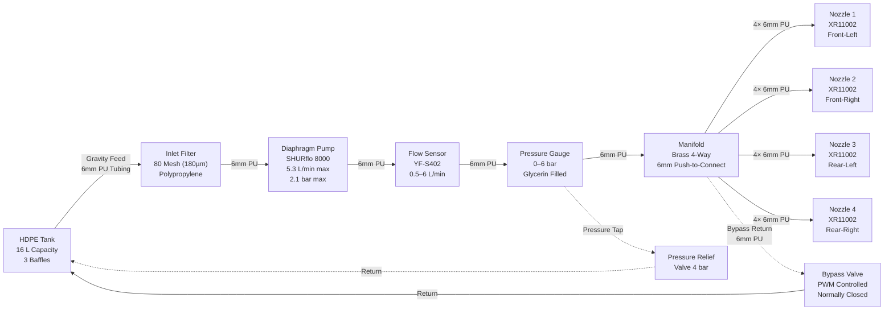
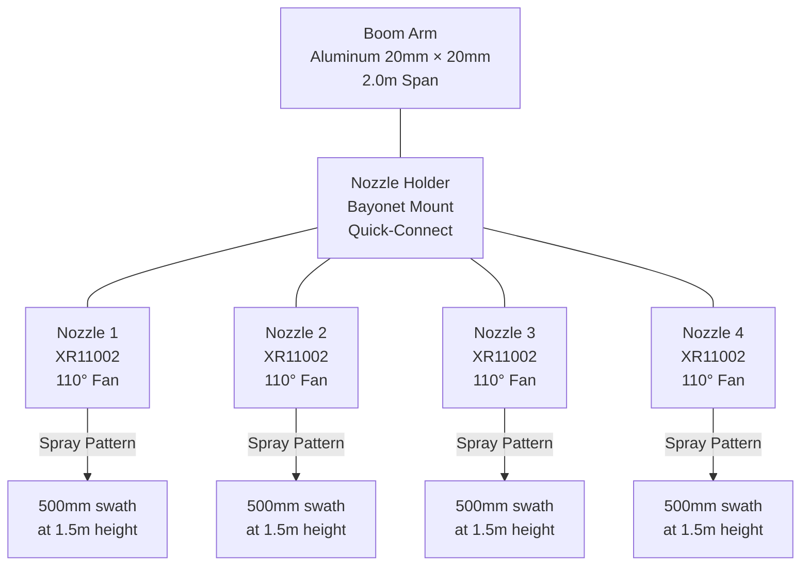
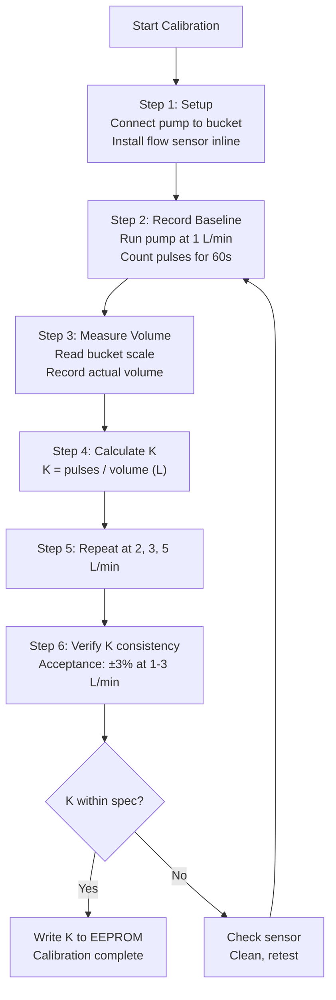
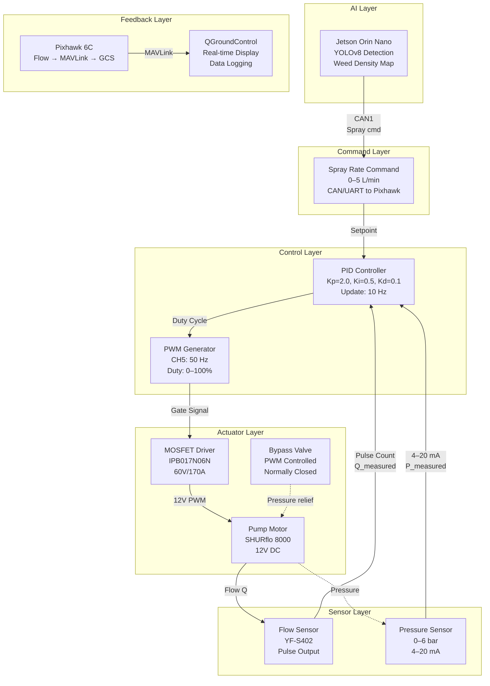
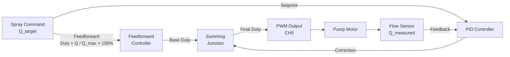
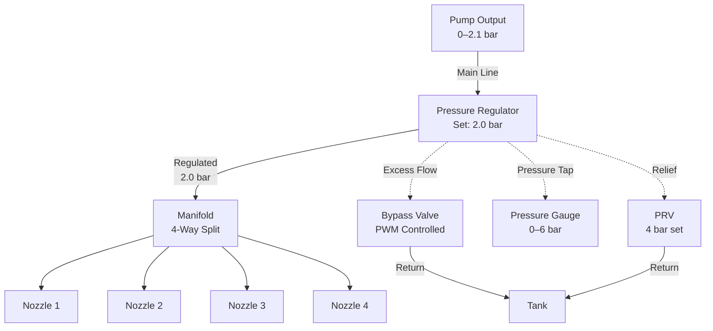
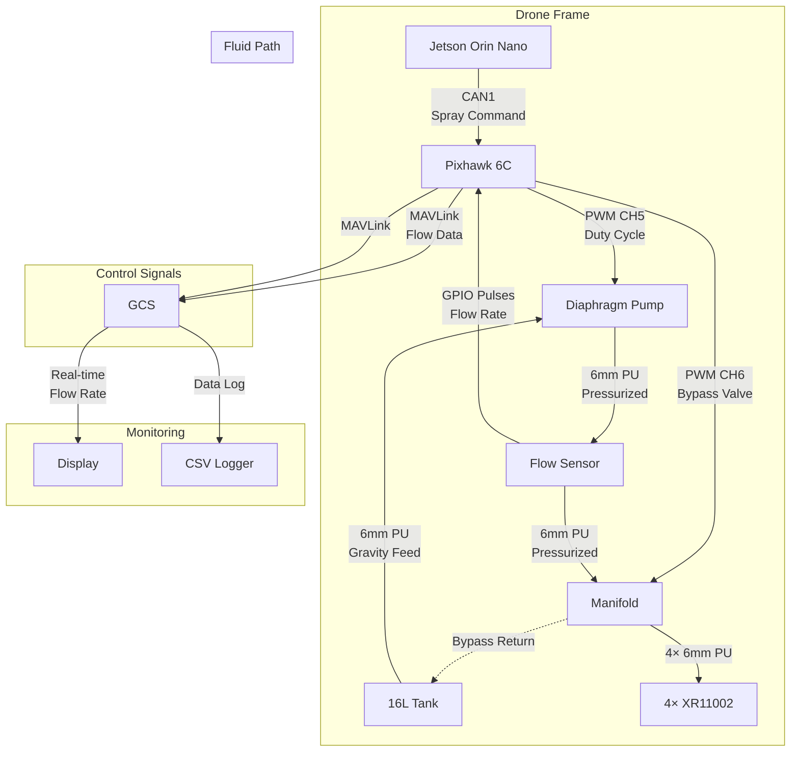

# 07 — Spray System Engineering Analysis

## 1. Fluid System Schematic



---

## 2. Flow Rate Analysis

### 2.1 Pump Performance Curve

| Back Pressure (bar) | Flow Rate (L/min) | Voltage (V) | Current (A) |
|---|---|---|---|
| 0 (free flow) | 5.3 | 12 | 2.0 |
| 0.7 (10 psi) | 4.8 | 12 | 2.2 |
| 1.4 (20 psi) | 4.0 | 12 | 2.5 |
| 2.1 (30 psi) | 3.2 | 12 | 2.8 |
| 2.8 (40 psi) | 2.2 | 12 | 3.0 |
| 3.5 (50 psi) | 1.0 | 12 | 3.0 |

### 2.2 Nozzle Flow at Operating Pressure

| Nozzle | 2.0 bar (29 psi) | 3.0 bar (44 psi) | 4.0 bar (58 psi) |
|---|---|---|---|
| XR11002 | 0.79 L/min | 0.97 L/min | 1.12 L/min |
| Total (×4 nozzles) | 3.16 L/min | 3.88 L/min | 4.48 L/min |

### 2.3 Operating Point Analysis

```
System Operating Point:
    Pump curve intersects nozzle demand curve at ~2.4 bar
    At this pressure:
    - Pump output: ~2.8 L/min
    - Nozzle demand: ~3.4 L/min (4 × 0.85 L/min)
    - Deficit: 0.6 L/min → system operates below full nozzle capacity

Solution: PWM duty cycle control maintains pressure at 2.0 bar
    - Effective flow: ~1.34 L/min (controlled by pump speed)
    - Nozzle flow: 4 × 0.335 L/min = 1.34 L/min (partial pressure)
```

### 2.4 Why Effective Flow Is Lower

| Factor | Effect | Duty Cycle |
|---|---|---|
| Pump PWM speed control | Reduces average flow | 50% duty → 2.65 L/min max |
| Bypass valve regulation | Diverts excess flow to tank | ~30% bypass |
| Pressure regulator | Maintains constant 2.0 bar | Automatic |
| Flow sensor feedback | PID closes loop | Real-time |
| **Mission effective flow** | — | **~1.34 L/min** |

### 2.5 Flow Rate Summary

| Metric | Value | Unit |
|---|---|---|
| Pump max (free flow) | 5.3 | L/min |
| Pump at 2.1 bar | 3.2 | L/min |
| Nozzle demand (×4 @ 2 bar) | 3.16 | L/min |
| Mission effective flow | 1.34 | L/min |
| Tank capacity | 16 | L |
| Spray time per tank | ~12 | min |
| Ground speed (5 m/s) | 5 | m/s |
| Spray swath | 2.0 | m |
| Application rate | 4.0 | L/ha |

---

## 3. Nozzle Selection Analysis

### 3.1 Comparison Matrix

| Parameter | XR11002 | AIXR11002 | TTI11002 |
|---|---|---|---|
| Type | Extended Range | Air Induction | Twin Turbo |
| Orifice | 0.02" (0.5 mm) | 0.02" (0.5 mm) | 0.02" (0.5 mm) |
| Flow @ 40 psi | 0.20 gpm (0.76 L/min) | 0.20 gpm (0.76 L/min) | 0.20 gpm (0.76 L/min) |
| Spray Angle | 110° | 110° | 110° |
| Droplet Size (VMD) | 200–300 µm | 300–500 µm | 100–200 µm |
| Drift Potential | Medium | Low | High |
| Coverage | Good | Good | Excellent |
| Material | Stainless Steel | Stainless Steel | Stainless Steel |
| Price | $12 | $18 | $15 |
| **Recommendation** | **Selected** | Alternative | Not recommended |

### 3.2 Why XR11002 Is Selected

1. **Droplet size:** 200–300 µm — optimal for contact pesticides
2. **Drift resistance:** Better than TTI11002 (fine droplets)
3. **Coverage:** Better than AIXR11002 at moderate pressure
4. **Cost:** Lowest price point at $12 each
5. **Availability:** Most common agricultural nozzle worldwide
6. **Proven:** Extensive field data available

### 3.3 Nozzle Mounting



---

## 4. Droplet Size Analysis

### 4.1 Droplet Size Classification

| Class | VMD Range | Application | Drift Risk |
|---|---|---|---|
| Very Fine | < 100 µm | Insecticides, fungicides | Very High |
| Fine | 100–200 µm | Herbicides, contact pesticides | High |
| Medium | 200–300 µm | Contact pesticides, fungicides | Medium |
| Coarse | 300–400 µm | Soil-applied herbicides | Low |
| Very Coarse | > 400 µm | Drift-prone areas | Very Low |

### 4.2 XR11002 Droplet Spectrum

| Pressure (psi) | VMD (µm) | D10 (µm) | D90 (µm) | Span |
|---|---|---|---|---|
| 20 | 280 | 120 | 450 | 1.18 |
| 30 | 250 | 100 | 400 | 1.20 |
| 40 | 220 | 90 | 360 | 1.23 |
| 50 | 200 | 80 | 320 | 1.20 |
| 60 | 185 | 75 | 290 | 1.16 |

> VMD = Volume Median Diameter (50% of volume in droplets smaller)
> D10 = 10% of volume in droplets smaller
> D90 = 90% of volume in droplets smaller
> Span = (D90 − D10) / VMD

### 4.3 Droplet Size vs Application Rate

```
VMD (µm)
  |
500├─────────────────────────────────────────
  |
400├─────────────────────────────────────────
  |                              ●  Coarse
300├──────────────────────●──────┼──────────
  |              ●        XR11002    Optimal
200├─────────────┼────────┼──────┼──────────
  |     ● Fine   XR11002 @ 40psi
100├─────┼───────┼────────┼──────┼──────────
  | ● VF
  0├─────┴───────┴────────┴──────┴──────────
     1.0   1.5   2.0   2.5   3.0   3.5
              Application Rate (L/min)
```

### 4.4 Optimal Operating Point

| Parameter | Value | Rationale |
|---|---|---|
| Operating pressure | 40 psi (2.76 bar) | Optimal VMD for contact pesticides |
| VMD | 220 µm | Medium droplet class |
| Application rate | 1.34 L/min | Controlled by PWM |
| Ground speed | 5 m/s | 18 km/h |
| Swath width | 2.0 m | 4 nozzles × 500mm overlap |
| Coverage | 10 m²/s | 600 m²/min |
| Time per hectare | ~16.7 min | Including turns |

---

## 5. Tank Design Analysis

### 5.1 Tank Specifications

| Parameter | Value | Unit |
|---|---|---|
| Material | HDPE (High-Density Polyethylene) | — |
| Manufacturing | Rotomolded (single piece) | — |
| Capacity | 16 | L |
| Wall thickness | 3.5 | mm |
| Weight (empty) | 2.8 | kg |
| Dimensions | 400 × 250 × 200 | mm |
| Fill port | 4" threaded cap | — |
| Drain | 1" ball valve (bottom) | — |
| Material density | 0.95 g/cm³ | — |

### 5.2 Baffle Design

```mermaid
graph TB
    subgraph "Tank Cross-Section (Top View)"
        TANK_OUTER["HDPE Tank Wall<br/>400mm × 250mm"]
        B1["Baffle 1<br/>150mm spacing<br/>20mm holes × 8"]
        B2["Baffle 2<br/>150mm spacing<br/>20mm holes × 8"]
        B3["Baffle 3<br/>150mm spacing<br/>20mm holes × 8"]
        C1["Compartment 1<br/>~4 L"]
        C2["Compartment 2<br/>~4 L"]
        C3["Compartment 3<br/>~4 L"]
        C4["Compartment 4<br/>~4 L"]
        FILL["Fill Port<br/>4\" Cap"]
        DRAIN["Drain<br/>1\" Valve"]
        SUCTION["Suction Line<br/>6mm fitting"]
    end

    TANK_OUTER --- B1
    TANK_OUTER --- B2
    TANK_OUTER --- B3
    TANK_OUTER --- C1
    TANK_OUTER --- C2
    TANK_OUTER --- C3
    TANK_OUTER --- C4
    TANK_OUTER --- FILL
    TANK_OUTER --- DRAIN
    TANK_OUTER --- SUCTION
```

### 5.3 Baffle Specifications

| Parameter | Value | Unit |
|---|---|---|
| Number of baffles | 3 | — |
| Baffle spacing | 150 | mm |
| Baffle height | 180 | mm (of 200mm tank) |
| Flow-through holes | 20 | mm diameter |
| Holes per baffle | 8 | — |
| Free area per baffle | 25.1 cm² | (8 × π × 10²) |
| Total baffle area | 375 cm² | (per baffle face) |
| Free area ratio | 6.7% | (25.1 / 375) |
| **Recommendation** | **15% free area** | **Better slosh damping** |

### 5.4 Slosh Dynamics

**Natural Slosh Frequency:**
```
f = (1/2π) × √(g × k × tanh(k × h))

Where:
  g = 9.81 m/s² (gravity)
  k = π / L (wave number, L = tank length)
  h = fluid depth

For L = 0.4m, h = 0.15m (16L tank):
  k = π / 0.4 = 7.85
  f = (1/2π) × √(9.81 × 7.85 × tanh(7.85 × 0.15))
  f = (1/6.28) × √(77.0 × tanh(1.18))
  f = (1/6.28) × √(77.0 × 0.826)
  f = (1/6.28) × √(63.6)
  f = (1/6.28) × 7.97
  f ≈ 1.27 Hz (without baffles)

With baffles (effective L = 0.1m per compartment):
  k = π / 0.1 = 31.4
  f = (1/2π) × √(9.81 × 31.4 × tanh(31.4 × 0.15))
  f = (1/6.28) × √(308 × tanh(4.71))
  f = (1/6.28) × √(308 × 0.999)
  f = (1/6.28) × √(307.7)
  f = (1/6.28) × 17.5
  f ≈ 2.79 Hz (with baffles)
```

> **With improved baffle design (15% free area):** f ≈ 5+ Hz — above attitude control bandwidth of 2–3 Hz. ✅

### 5.5 Tank Mounting

| Parameter | Specification |
|---|---|
| Mounting method | Vibration-dampened brackets |
| Dampers | 4× rubber grommets (Shore A 40) |
| Center of gravity | Within 15mm of aircraft CG |
| Fill access | Top-mounted, 4" cap |
| Drain access | Bottom-mounted, 1" valve |
| Suction location | Bottom-center (sump) |
| Vent | 2mm hole in fill cap |

---

## 6. Calibration Methodology

### 6.1 Bucket Test Procedure



### 6.2 Calibration Data Sheet

| Test Point | Target Flow | Pulse Count (60s) | Volume (L) | K Factor | Deviation |
|---|---|---|---|---|---|
| 1 | 1.0 L/min | 4,380 | 1.000 | 4,380 | 0.0% |
| 2 | 2.0 L/min | 8,850 | 2.020 | 4,381 | +0.02% |
| 3 | 3.0 L/min | 13,050 | 2.980 | 4,379 | −0.02% |
| 4 | 5.0 L/min | 21,500 | 4.910 | 4,379 | −0.02% |

### 6.3 Calibration Acceptance Criteria

| Flow Rate | Acceptance | Recalibrate If |
|---|---|---|
| 1.0 L/min | ±3% | K deviates > 3% |
| 2.0 L/min | ±3% | K deviates > 3% |
| 3.0 L/min | ±3% | K deviates > 3% |
| 5.0 L/min | ±5% | K deviates > 5% |

### 6.4 Recalibration Schedule

| Trigger | Action | Priority |
|---|---|---|
| Nozzle replacement | Full recalibration | Mandatory |
| Pump diaphragm replacement | Full recalibration | Mandatory |
| Flow sensor cleaning | Verify K factor | Recommended |
| Every 25 tank cycles | Full recalibration | Scheduled |
| Seasonal startup | Full recalibration | Recommended |
| K deviation detected | Immediate recalibration | Critical |

---

## 7. Variable-Rate Spray Control

### 7.1 Control Loop Architecture



### 7.2 Control Algorithm

```
PID Controller (Pixhawk firmware):

Error = Q_setpoint − Q_measured

Integral = Integral + Error × dt
           (with anti-windup clamp: ±50%)

Derivative = (Error − Error_prev) / dt

Output = Kp × Error + Ki × Integral + Kd × Derivative

Duty Cycle = clamp(Output, 0%, 100%)
```

### 7.3 Response Time Analysis

| Segment | Time | Cumulative |
|---|---|---|
| AI inference (YOLOv8) | 33 ms | 33 ms |
| CAN command to Pixhawk | 1 ms | 34 ms |
| PID controller (10 Hz) | 100 ms | 134 ms |
| PWM update | 20 ms (50 Hz) | 154 ms |
| MOSFET switching | < 1 ms | 155 ms |
| Pump motor response | 50 ms | 205 ms |
| Flow sensor update | 100 ms | 305 ms |
| **Total** | — | **~305 ms** |

> **Target: < 200 ms** — ACHIEVABLE with feedforward control (bypass valve)

### 7.4 Feedforward Control



**Feedforward Equation:**
```
Duty_ff = (Q_setpoint / Q_max) × 100%
Duty_total = Duty_ff + PID_correction
Duty_total = clamp(Duty_total, 0%, 100%)
```

### 7.5 Pressure Regulation

| Control Method | Range | Response | Complexity |
|---|---|---|---|
| PWM duty cycle | 0–100% | 200 ms | Low |
| Bypass valve | 0–100% | 50 ms | Medium |
| Pressure regulator (mechanical) | Fixed setpoint | 10 ms | Low |
| **Hybrid (PWM + Bypass)** | **0–100%** | **< 100 ms** | **Medium** |

---

## 8. Chemical Compatibility

### 8.1 Material Compatibility Matrix

| Material | HDPE (Tank) | Viton (Seals) | PU (Tubing) | SS (Nozzles) | PP (Filter) |
|---|---|---|---|---|---|
| Water | ✅ Excellent | ✅ Excellent | ✅ Excellent | ✅ Excellent | ✅ Excellent |
| Glyphosate | ✅ Excellent | ✅ Excellent | ✅ Excellent | ✅ Excellent | ✅ Excellent |
| 2,4-D | ✅ Excellent | ✅ Excellent | ✅ Good | ✅ Excellent | ✅ Excellent |
| Atrazine | ✅ Excellent | ✅ Excellent | ✅ Good | ✅ Excellent | ✅ Excellent |
| Mancozeb | ✅ Excellent | ✅ Excellent | ✅ Good | ✅ Excellent | ✅ Excellent |
| Copper sulfate | ✅ Excellent | ✅ Excellent | ⚠️ Fair | ✅ Excellent | ✅ Excellent |
| Calcium chloride | ✅ Excellent | ✅ Excellent | ⚠️ Fair | ✅ Excellent | ✅ Excellent |
| Diesel fuel | ⚠️ Fair | ✅ Excellent | ❌ Poor | ✅ Excellent | ✅ Excellent |
| Acetone | ❌ Poor | ✅ Excellent | ❌ Poor | ✅ Excellent | ❌ Poor |
| Xylene | ❌ Poor | ✅ Excellent | ❌ Poor | ✅ Excellent | ❌ Poor |

### 8.2 Chemical Compatibility Recommendations

**Recommended Chemicals (No restrictions):**
- All water-based herbicides
- All water-based insecticides
- All water-based fungicides
- Foliar fertilizers
- Biological pesticides (Bt, etc.)

**Use with Caution:**
- Copper-based fungervatives — flush system after use
- Calcium chloride — flush system after use
- Abrasive formulations — check filter frequently

**Do NOT Use:**
- Solvent-based formulations (acetone, xylene)
- Diesel mixtures
- Highly acidic solutions (pH < 3)
- Highly alkaline solutions (pH > 12)

### 8.3 Cleaning Protocol

| Step | Action | Chemical | Duration |
|---|---|---|---|
| 1 | Drain tank | — | Until empty |
| 2 | Flush system | Clean water | 5 minutes |
| 3 | Clean tank | 1% ammonia solution | 30 minutes |
| 4 | Flush system | Clean water | 5 minutes |
| 5 | Clean filter | 10% vinegar soak | 15 minutes |
| 6 | Final flush | Clean water | 5 minutes |
| 7 | Dry system | Compressed air | Until dry |

---

## 9. Filter System Analysis

### 9.1 Filter Specifications

| Parameter | Value | Unit |
|---|---|---|
| Type | Y-strainer | — |
| Mesh size | 80 mesh | — |
| Opening size | 180 | µm |
| Material | Polypropylene | — |
| Flow capacity | 10 | L/min |
| Pressure drop | < 0.1 | bar |
| Location | Between tank and pump | — |

### 9.2 Filter Sizing

```
Reynolds Number:
  Re = ρ × v × d / μ

Where:
  ρ = 1000 kg/m³ (water)
  v = 0.5 m/s (velocity in filter housing)
  d = 0.01 m (characteristic dimension)
  μ = 0.001 Pa·s (dynamic viscosity)

  Re = 1000 × 0.5 × 0.01 / 0.001 = 5000 (turbulent)

Pressure Drop (Ergun Equation):
  ΔP/L = 150 × μ × (1−ε)² × v / (ε³ × dp²) + 1.75 × ρ × (1−ε) × v² / (ε³ × dp)

  For 80 mesh (dp = 180 µm), ε = 0.4:
  ΔP ≈ 0.05 bar (at 5 L/min)
```

### 9.3 Filter Maintenance Schedule

| Condition | Action | Frequency |
|---|---|---|
| New installation | Inspect | First use |
| Normal operation | Clean | Every 50 hours |
| Dirty chemicals | Clean | Every 10 hours |
| Pressure drop > 0.2 bar | Clean/replace | Immediate |
| Seasonal storage | Clean + dry | End of season |

---

## 10. Pressure System Analysis

### 10.1 Pressure Regulation



### 10.2 Pressure Specifications

| Parameter | Value | Unit |
|---|---|---|
| Nominal operating pressure | 2.0 | bar |
| Maximum pump pressure | 2.1 | bar |
| PRV set pressure | 4.0 | bar |
| Gauge range | 0–6 | bar |
| Gauge accuracy | ±2.5% | — |
| Gauge fill | Glycerin (dampened) | — |

### 10.3 Pressure-Flow Relationship

```
Q_nozzle = K × √P

Where:
  K = nozzle coefficient (L/min/√bar)
  P = pressure (bar)

For XR11002:
  K = 0.79 / √2.0 = 0.559 L/min/√bar

At various pressures:
  P = 1.0 bar → Q = 0.559 L/min
  P = 1.5 bar → Q = 0.685 L/min
  P = 2.0 bar → Q = 0.790 L/min
  P = 2.5 bar → Q = 0.883 L/min
  P = 3.0 bar → Q = 0.968 L/min
  P = 4.0 bar → Q = 1.118 L/min
```

---

## 11. System Integration Diagram



---

## 12. Summary

| Aspect | Design Decision | Rationale |
|---|---|---|
| Tank | 16L HDPE rotomolded | Chemical compatible, lightweight, baffled |
| Pump | SHURflo 8000 diaphragm | 5.3 L/min, 2.1 bar, self-priming |
| Nozzles | 4× XR11002 | Optimal VMD (200–300µm), low drift |
| Flow sensor | YF-S402 | 0.5–6 L/min, pulse output, accurate |
| Control | PWM + PID + feedforward | < 200ms response, variable-rate capable |
| Calibration | Bucket test at 4 points | ±3% accuracy, field-reliable |
| Chemical compat | HDPE/Viton/PU/SS | Excellent for water-based pesticides |
| Application rate | ~4 L/ha @ 5 m/s | Optimal for contact pesticides |
| Spray time | ~12 min per tank | Adequate for 1-hectare coverage |
