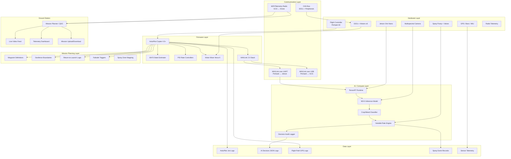
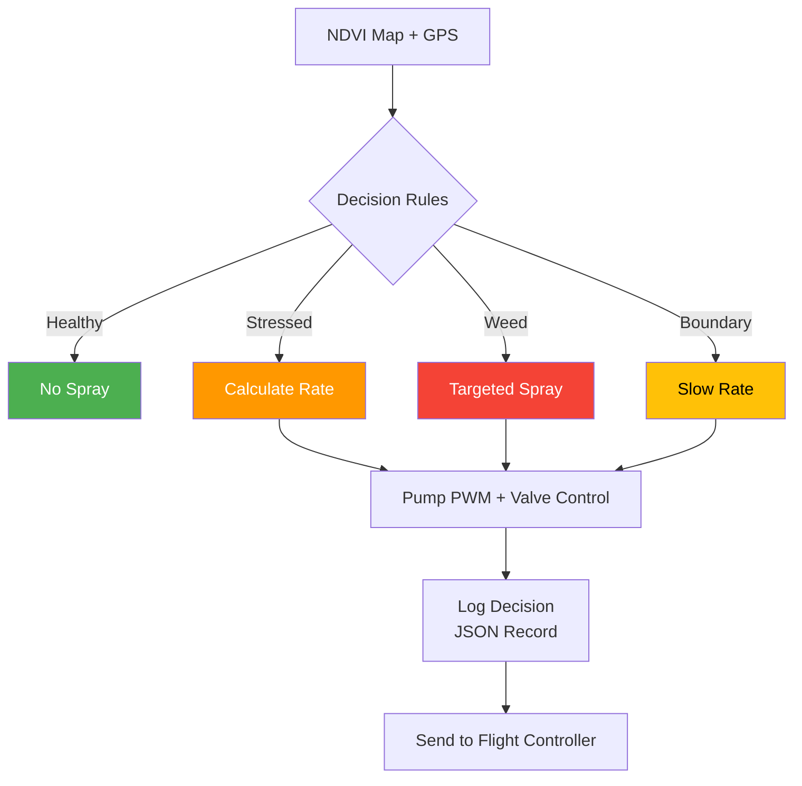
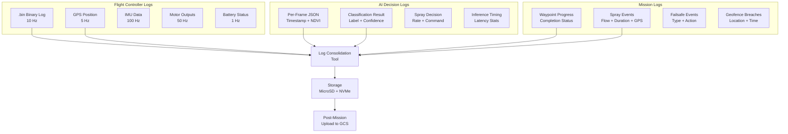

# 08 — Software Architecture

> Complete software stack, ArduPilot configuration, Jetson deployment, and AI pipeline for the COEP Agricultural Drone.

---

## 1. Complete Software Stack Diagram



### Layer Descriptions

| Layer | Purpose | Key Components |
|-------|---------|----------------|
| Hardware | Physical subsystems | Pixhawk, Jetson, cameras, actuators |
| Firmware | Real-time flight control | ArduPilot, EKF3, PID loops, motor mixer |
| Communication | Inter-module data flow | MAVLink 2.0, CAN, UART, telemetry radio |
| Mission Planning | Operational logic | Waypoints, geofence, RTL, failsafes |
| AI / Compute | Perception and decisions | TensorRT, NDVI model, variable rate |
| Ground Station | Operator interface | Mission Planner, telemetry, video |
| Data | Persistent storage | Logs, audit trails, sensor records |

---

## 2. ArduCopter Configuration

### 2.1 Frame and Mixer

| Parameter | Value | Notes |
|-----------|-------|-------|
| `FRAME_CLASS` | 6 (Hexa) | Hexacopter frame class |
| `FRAME_TYPE` | 1 (X) | Hexa-X motor layout |
| `MIXING_GAIN` | 0.5 | Default yaw/thrust mixing |
| `DSHOT_RATE` | 100 | DShot100 for ESCs |
| `MOTOR_PWM_MIN` | 1000 | Minimum PWM (µs) |
| `MOTOR_PWM_MAX` | 2000 | Maximum PWM (µs) |

### 2.2 ATC (Attitude Controller) Tuning

| Parameter | Recommended Value | Description |
|-----------|-------------------|-------------|
| `ATC_RAT_RLL_P` | 0.15 | Rate P gain for roll |
| `ATC_RAT_RLL_I` | 0.10 | Rate I gain for roll |
| `ATC_RAT_RLL_D` | 0.005 | Rate D gain for roll |
| `ATC_RAT_PIT_P` | 0.15 | Rate P gain for pitch |
| `ATC_RAT_PIT_I` | 0.10 | Rate I gain for pitch |
| `ATC_RAT_PIT_D` | 0.005 | Rate D gain for pitch |
| `ATC_RAT_YAW_P` | 0.20 | Rate P gain for yaw |
| `ATC_RAT_YAW_I` | 0.02 | Rate I gain for yaw |
| `ATC_ANG_RLL_P` | 4.5 | Angle P gain for roll |
| `ATC_ANG_PIT_P` | 4.5 | Angle P gain for pitch |
| `ATC_ANG_YAW_P` | 3.5 | Angle P gain for yaw |
| `ATC_INPUT_TC` | 0.25 | Input time constant (responsiveness) |

### 2.3 Throttle and Altitude

| Parameter | Value | Notes |
|-----------|-------|-------|
| `MOT_THST_HOVER` | 0.45 | Estimated hover throttle (60 kg AUW) |
| `PSC_ACCZ_P` | 0.50 | Altitude hold acceleration P |
| `PSC_ACCZ_I` | 1.00 | Altitude hold acceleration I |
| `PSC_ACCZ_D` | 0.05 | Altitude hold acceleration D |
| `THR_MAX` | 100 | Maximum throttle percentage |
| `THR_MIN` | 15 | Minimum throttle percentage |
| `TKOFF_THR_MAX` | 100 | Takeoff throttle maximum |

### 2.4 Navigation and Safety

| Parameter | Value | Notes |
|-----------|-------|-------|
| `RTL_ALT` | 1000 | Return-to-launch altitude (cm) = 10 m |
| `RTL_SPEED` | 500 | RTL speed (cm/s) = 5 m/s |
| `FENCE_ENABLE` | 1 | Geofence enabled |
| `FENCE_TYPE` | 9 | Altitude + polygon |
| `FENCE_ALT_MAX` | 50 | Maximum fence altitude (m) |
| `FENCE_RADIUS` | 500 | Fence radius (m) |
| `FS_BATT_ENABLE` | 1 | Battery failsafe enabled |
| `FS_BATT_VOLTAGE` | 44.0 | Low voltage trigger (V) — 12S config |
| `FS_BATT_MAH` | 10000 | Remaining capacity trigger (mAh) |
| `BATT_CAPACITY` | 90000 | Total battery capacity (mAh) — 3×30Ah |
| `BATT_CELLS` | 12 | Cells per pack (parallel packs) |
| `BATT_LOW_VOLT` | 44.0 | Low voltage warning (V) |
| `BATT_CRT_VOLT` | 42.0 | Critical voltage (V) |

### 2.5 PID Tuning Starting Points

```
# Roll Rate
ATC_RAT_RLL_P = 0.15
ATC_RAT_RLL_I = 0.10
ATC_RAT_RLL_D = 0.005
ATC_RAT_RLL_FF = 0.01

# Pitch Rate
ATC_RAT_PIT_P = 0.15
ATC_RAT_PIT_I = 0.10
ATC_RAT_PIT_D = 0.005
ATC_RAT_PIT_FF = 0.01

# Yaw Rate
ATC_RAT_YAW_P = 0.20
ATC_RAT_YAW_I = 0.02
ATC_RAT_YAW_D = 0.001
ATC_RAT_YAW_FF = 0.01

# Angle P
ATC_ANG_RLL_P = 4.5
ATC_ANG_PIT_P = 4.5
ATC_ANG_YAW_P = 3.5
```

---

## 3. Jetson Orin Nano Deployment

### 3.1 System Configuration

| Component | Specification |
|-----------|---------------|
| OS | Ubuntu 22.04 LTS (JetPack 6.x) |
| CUDA | 12.x |
| cuDNN | 8.x |
| TensorRT | 8.6+ |
| DeepStream | Optional for video pipeline |
| Camera Interface | MIPI CSI-2 (4-lane) |
| Storage | NVMe SSD (256 GB minimum) |
| Power | 15W mode (7W / 15W selectable) |

### 3.2 Camera Configuration

| Parameter | Value |
|-----------|-------|
| Sensor | Multispectral (Red, Green, Blue, NIR) |
| Interface | MIPI CSI-2, 4-lane |
| Resolution | 1280×960 per band |
| Frame Rate | 30 FPS (all bands) |
| Exposure | Global shutter |
| Lens | 72° FOV, matched across bands |

### 3.3 Model Deployment Pipeline

```
Training (Cloud/Workstation)
  │
  ├─ PyTorch/TensorFlow training
  ├─ ONNX export
  ├─ TensorRT engine build (FP16)
  └─ Deploy .engine to Jetson
      │
  ┌───┴───┐
  │ Inference Loop
  │  1. Capture frame (CSI-2)
  │  2. Preprocess (resize, normalize)
  │  3. Run TensorRT inference
  │  4. Postprocess (NMS, threshold)
  │  5. Generate NDVI map
  │  6. Classify: crop / weed / stress
  │  7. Output spray decision
  └───────┘
```

### 3.4 Inference Performance Targets

| Metric | Target | Notes |
|--------|--------|-------|
| Latency (per frame) | < 100 ms | End-to-end including capture |
| Throughput | ≥ 10 FPS | All 4 spectral bands |
| GPU Utilization | 60-80% | Leave headroom for stability |
| Power Consumption | < 10W GPU | Within 15W TDP envelope |
| Model Size | < 50 MB | FP16 quantized |

---

## 4. AI Pipeline

### 4.1 Pipeline Architecture


### 4.2 NDVI Calculation

```
NDVI = (NIR - Red) / (NIR + Red)

Classification thresholds:
  NDVI > 0.6  →  Healthy crop (no spray)
  0.3 < NDVI ≤ 0.6  →  Moderate stress (low spray rate)
  0.1 < NDVI ≤ 0.3  →  Severe stress (high spray rate)
  NDVI ≤ 0.1  →  Bare soil / weed (targeted spray)
```

### 4.3 Decision Engine



### 4.4 Variable Rate Spray Matrix

| Zone Type | NDVI Range | Spray Rate (L/ha) | Duty Cycle (%) |
|-----------|------------|-------------------|----------------|
| Healthy crop | > 0.6 | 0 | 0 |
| Mild stress | 0.4 – 0.6 | 50 | 25 |
| Moderate stress | 0.2 – 0.4 | 100 | 50 |
| Severe stress | 0.1 – 0.2 | 150 | 75 |
| Weed / bare | < 0.1 | 200 | 100 |

---

## 5. Data Logging Architecture

### 5.1 Log Sources



### 5.2 Log Format Specifications

#### ArduPilot Binary Log (.bin)
- Format: Binary, ArduPilot standard
- Rate: 10 Hz (main loop), 100 Hz (IMU)
- Fields: ATT, IMU, GPS, BARO, CTUN, NTUN, MOT, BAT
- Storage: MicroSD card (16 GB minimum)

#### AI Decision Log (JSON)
```json
{
  "timestamp_ms": 1234567890,
  "frame_id": 4521,
  "gps": {"lat": 18.5204, "lon": 73.8567, "alt": 15.2},
  "ndvi_map": "base64_encoded_heatmap",
  "classification": {
    "healthy_crop": 0.72,
    "stress": 0.18,
    "weed": 0.10
  },
  "spray_decision": {
    "active": true,
    "rate_lpha": 75,
    "duty_cycle": 0.38,
    "zone": "moderate_stress"
  },
  "inference_ms": 87,
  "model_version": "v1.2.0"
}
```

#### Spray Event Log (JSON)
```json
{
  "event_id": "spr_001",
  "timestamp_ms": 1234567890,
  "gps": {"lat": 18.5204, "lon": 73.8567},
  "flow_rate_lpm": 1.25,
  "duration_s": 4.5,
  "volume_ml": 94,
  "nozzle_id": 3,
  "pump_duty": 0.65
}
```

### 5.3 Data Retention Policy

| Log Type | Retention | Storage Location |
|----------|-----------|------------------|
| ArduPilot .bin | 30 days | On-board MicroSD |
| AI decisions | 90 days | On-board NVMe |
| Spray events | 1 year | Uploaded to server |
| Mission summaries | Permanent | Cloud storage |
| Telemetry archive | 30 days | GCS local |

---

## 6. Version Control Strategy

### 6.1 Repository Structure

```
coep-agricultural-drone/
├── firmware/                  # ArduPilot config and custom parameters
│   ├── parameters/
│   │   ├── hexa_default.param
│   │   ├── spray_mission.param
│   │   └── tuning_notes.md
│   └── custom_libraries/      # Any ArduPilot library patches
│
├── ai/                        # AI inference code
│   ├── models/                # TensorRT engines
│   │   └── ndvi_classifier_v1/
│   ├── training/              # Training scripts
│   ├── inference/             # On-device inference
│   │   ├── capture.py
│   │   ├── preprocess.py
│   │   ├── infer.py
│   │   └── spray_decision.py
│   └── data/                  # Training data (gitignore large files)
│
├── ground_station/            # GCS customizations
│   ├── missions/
│   │   └── field_survey.py
│   └── overlays/
│
├── docs/                      # Documentation
│   ├── architecture.md
│   ├── build_guide.md
│   └── flight_manual.md
│
├── tests/                     # Automated tests
│   ├── unit/
│   ├── integration/
│   └── simulation/
│
├── scripts/                   # Build and deploy scripts
│   ├── build_tensorrt.sh
│   ├── deploy_to_jetson.sh
│   └── export_logs.sh
│
├── .github/
│   └── workflows/
│       ├── ci.yml
│       └── deploy.yml
│
├── README.md
├── LICENSE
└── .gitignore
```

### 6.2 Branching Model

```
main ─────────────────────────────────────────── Production release
  │
  ├── develop ────────────────────────────────── Integration branch
  │     │
  │     ├── feature/ndvi-model-v2 ────────────── AI model improvements
  │     ├── feature/spray-rate-tuning ────────── Pump calibration
  │     ├── feature/geofence-polygon ─────────── Custom fence shapes
  │     └── fix/altitude-oscillation ─────────── PID tuning fix
  │
  ├── release/v1.0 ──────────────────────────── Release candidate
  └── hotfix/battery-failsafe ───────────────── Critical fix
```

### 6.3 CI/CD Pipeline


### 6.4 Commit Convention

```
<type>(<scope>): <description>

Types: feat, fix, docs, test, refactor, perf, ci
Scopes: firmware, ai, gcs, docs, scripts

Examples:
feat(ai): add NDVI heatmap generation
fix(firmware): correct motor mixing for hexa-X
test(gcs): add waypoint upload validation
docs(build): update Jetson deployment guide
```

---

## 7. Interoperability Requirements

### 7.1 Communication Protocols

| Interface | Protocol | Baud Rate | Purpose |
|-----------|----------|-----------|---------|
| Pixhawk ↔ Jetson | MAVLink 2.0 | 921600 | Flight commands, telemetry |
| Pixhawk ↔ GCS | MAVLink 2.0 | 57600 (radio) | Mission control |
| Pixhawk ↔ ESCs | DShot100 | — | Motor commands |
| Pixhawk ↔ GPS | UAVCAN | 1 Mbit/s | Position data |
| Jetson ↔ Camera | MIPI CSI-2 | — | Image capture |
| Jetson ↔ Storage | NVMe | — | Log storage |

### 7.2 MAVLink Message Integration

| Message | Direction | Rate | Content |
|---------|-----------|------|---------|
| `HEARTBEAT` | Both | 1 Hz | System status |
| `GLOBAL_POSITION_INT` | FC → Jetson | 5 Hz | GPS position |
| `ATTITUDE` | FC → Jetson | 10 Hz | Roll, pitch, yaw |
| `RC_CHANNELS` | FC → Jetson | 10 Hz | Manual override |
| `COMMAND_LONG` | Jetson → FC | On demand | Spray commands |
| `STATUSTEXT` | FC → GCS | On event | Status messages |
| `LOG_DATA` | FC → GCS | On request | Log download |

### 7.3 JSON Schema for AI Decisions

```json
{
  "$schema": "http://json-schema.org/draft-07/schema#",
  "title": "AIDecision",
  "type": "object",
  "required": ["timestamp_ms", "frame_id", "gps", "classification", "spray_decision"],
  "properties": {
    "timestamp_ms": {"type": "integer"},
    "frame_id": {"type": "integer"},
    "gps": {
      "type": "object",
      "properties": {
        "lat": {"type": "number"},
        "lon": {"type": "number"},
        "alt": {"type": "number"}
      }
    },
    "classification": {
      "type": "object",
      "properties": {
        "healthy_crop": {"type": "number", "minimum": 0, "maximum": 1},
        "stress": {"type": "number", "minimum": 0, "maximum": 1},
        "weed": {"type": "number", "minimum": 0, "maximum": 1}
      }
    },
    "spray_decision": {
      "type": "object",
      "properties": {
        "active": {"type": "boolean"},
        "rate_lpha": {"type": "number"},
        "duty_cycle": {"type": "number", "minimum": 0, "maximum": 1},
        "zone": {"type": "string", "enum": ["healthy", "mild_stress", "moderate_stress", "severe_stress", "weed"]}
      }
    },
    "inference_ms": {"type": "number"},
    "model_version": {"type": "string"}
  }
}
```

### 7.4 API Endpoints (Ground Station Integration)

| Endpoint | Method | Description |
|----------|--------|-------------|
| `/api/v1/mission` | POST | Upload mission plan |
| `/api/v1/mission/{id}` | GET | Get mission status |
| `/api/v1/telemetry` | GET | Real-time telemetry stream |
| `/api/v1/spray-log` | GET | Download spray event logs |
| `/api/v1/ndvi-report` | GET | NDVI analysis report |
| `/api/v1/health` | GET | System health status |

---

## 8. Software Deployment Checklist

### Pre-Deployment

- [ ] ArduPilot firmware compiled and flashed
- [ ] Frame parameters loaded (.param file)
- [ ] PID values tuned in simulation
- [ ] Geofence boundaries configured
- [ ] Failsafe parameters verified
- [ ] Jetson OS flashed with JetPack
- [ ] TensorRT engine built and tested
- [ ] Camera calibrated (all 4 bands)
- [ ] MAVLink connection verified (Pixhawk ↔ Jetson)
- [ ] GCS connected and receiving telemetry

### Post-Deployment

- [ ] IMU calibration verified
- [ ] Compass calibration verified
- [ ] GPS lock acquired (≥ 10 satellites)
- [ ] Motor test passed (all 6 spin correctly)
- [ ] RC input verified (all channels)
- [ ] Flight mode switching tested
- [ ] Telemetry link stable
- [ ] Data logging confirmed
- [ ] AI inference running at target FPS
- [ ] Spray pump responds to commands

---

*Last updated: 2026-05-29*
*Document version: 1.0*
