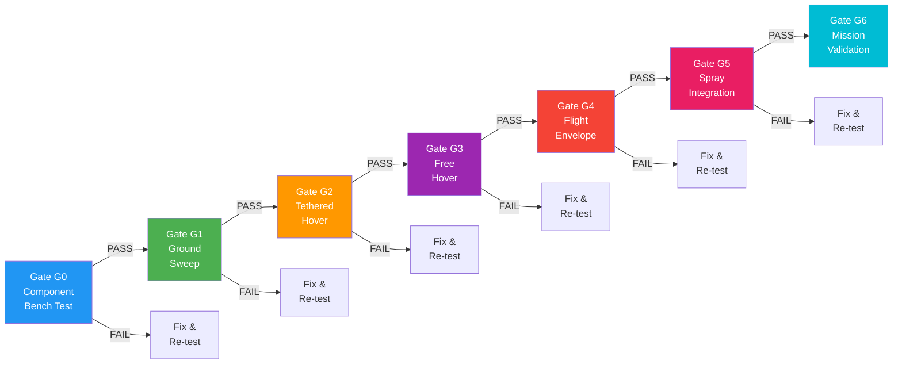
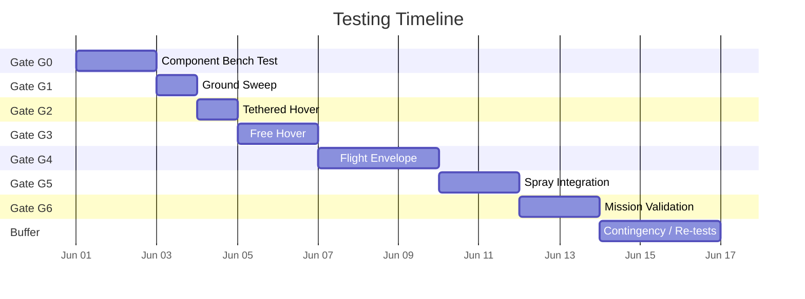

# 09 — Testing Protocols

> Complete testing protocols from bench test to full mission validation, covering all 7 gates.

---

## 1. Testing Gate Structure



### Gate Summary

| Gate | Name | Duration | Location | Risk Level |
|------|------|----------|----------|------------|
| G0 | Component Bench Test | 1-2 days | Workshop | Low |
| G1 | Ground Sweep | 0.5 day | Open field | Low |
| G2 | Tethered Hover | 1 day | Open field | Medium |
| G3 | Free Hover | 1-2 days | Open field | Medium |
| G4 | Flight Envelope | 2-3 days | Open field | High |
| G5 | Spray Integration | 1-2 days | Test field | High |
| G6 | Mission Validation | 1-2 days | Target field | High |

---

## 2. Gate G0 — Component Bench Test

### 2.1 Entry Criteria

- [ ] All components received and inspected
- [ ] Component-level documentation reviewed
- [ ] Workshop bench set up with test equipment
- [ ] Battery charged to storage voltage (3.8V/cell)
- [ ] Multimeter, oscilloscope, power supply available

### 2.2 Test Procedure

#### 2.2.1 Thrust Stand Protocol

**Objective:** Verify each motor/prop/ESC combination meets manufacturer specs.

**Equipment:**
- Thrust stand with load cell (0-10 kg range)
- Power supply (50V, 30A minimum)
- Data acquisition system (sampling ≥ 100 Hz)
- Tachometer (non-contact)
- Known calibration weights (1 kg, 2 kg, 5 kg)

**Procedure:**

```
1. CALIBRATION
   ├── Mount load cell to stand
   ├── Apply known weights (1 kg, 2 kg, 5 kg)
   ├── Record ADC values
   ├── Linear regression → calibration factor
   └── Verify ±2% accuracy

2. MOTOR INSTALLATION
   ├── Mount motor with consistent orientation
   ├── Tighten bolts to 2 N·m (apply threadlocker)
   ├── Connect ESC to power supply
   └── Connect ESC signal to test controller

3. THROTTLE SWEEP
   ├── Idle (0% throttle) — record 5 sec baseline
   ├── Step: 5%, 10%, 15%, ... 100%
   ├── Hold each step: 5 seconds
   ├── Record at each step:
   │   ├── Thrust (N)
   │   ├── Current (A)
   │   ├── Voltage (V)
   │   ├── RPM
   │   └── ESC temperature (°C)
   └── Cool-down: 30 sec between runs

4. DATA ANALYSIS
   ├── Plot thrust vs throttle curve
   ├── Plot efficiency (g/W) vs throttle
   ├── Compare to manufacturer datasheet
   ├── Calculate max thrust, max efficiency
   └── Identify any anomalies (vibration, current spikes)
```

**Pass/Fail Criteria:**

| Metric | Acceptance | Notes |
|--------|------------|-------|
| Max thrust | ≥ 80% of datasheet | Per motor |
| Efficiency at hover | ≥ 10 g/W | At 50% throttle |
| Current draw | ≤ 110% of datasheet | At max throttle |
| RPM consistency | ±5% across 6 motors | Same throttle input |
| Temperature rise | < 30°C above ambient | At hover throttle |
| Vibration | No visible oscillation | Visual + accelerometer |

**Data to Collect:**
- Thrust vs throttle curve (per motor)
- Efficiency vs throttle curve
- Current vs throttle curve
- RPM vs throttle curve
- Temperature vs time at hover throttle
- Pass/fail status per motor

#### 2.2.2 Battery System Test

```
1. Cell Voltage Check
   ├── Measure each cell: 3.0V - 4.2V range
   ├── Cell imbalance: < 0.05V
   └── Total voltage matches expected (12S × 3.7V = 44.4V nominal)

2. Capacity Test
   ├── Charge to 4.2V/cell
   ├── Discharge at 1C (30A) to 3.5V/cell
   ├── Record total capacity (mAh)
   └── Acceptance: ≥ 90% of rated capacity

3. Internal Resistance
   ├── Measure at each cell
   ├── Acceptance: < 5 mΩ per cell
   └── Imbalance: < 1 mΩ between cells

4. Connector and Wiring
   ├── Inspect all solder joints
   ├── Check connector tightness
   ├── Verify wire gauge adequate for max current
   └── Check for chafing or damage
```

#### 2.2.3 Electronics Integration Test

```
1. Pixhawk Power-Up
   ├── Power via battery (through PDB)
   ├── Verify all status LEDs
   ├── Check USB connection
   ├── Load parameters (.param file)
   └── Verify sensor readings (IMU, baro, GPS)

2. ESC Calibration
   ├── Connect all 6 ESCs
   ├── Calibrate ESC throttle range
   ├── Verify DShot communication
   └── Run motor test (spin each motor individually)

3. Camera Test
   ├── Connect multispectral camera to Jetson
   ├── Verify all 4 bands capture
   ├── Check image quality
   ├── Verify frame rate ≥ 30 FPS
   └── Test NDVI calculation

4. Communication Test
   ├── Pixhawk ↔ Jetson (MAVLink over UART)
   ├── Pixhawk ↔ GCS (MAVLink over telemetry)
   ├── Verify command passthrough
   └── Check data integrity (no corruption)
```

### 2.3 Decision Authority

- **Pass:** All components meet specifications → Proceed to G1
- **Conditional:** Minor issues noted → Document and proceed with monitoring
- **Fail:** Any critical component fails → Fix and re-test G0

---

## 3. Gate G1 — Ground Sweep

### 3.1 Entry Criteria

- [ ] G0 passed — all components verified
- [ ] Frame fully assembled (without propellers)
- [ ] All wiring inspected and secured
- [ ] Battery installed and connected
- [ ] GCS connected and telemetry stable
- [ ] Safe outdoor area cleared (50m radius)
- [ ] Fire extinguisher present
- [ ] All personnel wearing safety glasses

### 3.2 Test Procedure

```
PRE-FLIGHT CHECKLIST
├── [ ] Remove all propellers
├── [ ] Secure drone to ground (straps or weighted base)
├── [ ] Verify motor direction (visual marker on each)
├── [ ] Arm the drone via GCS
├── [ ] Verify motor spin order (1→2→3→4→5→6)
└── [ ] Set throttle to minimum

TEST SEQUENCE
├── Step 1: LOW RPM (10%)
│   ├── Duration: 10 seconds
│   ├── Record: vibration, current, noise
│   └── Check: all motors spinning, no binding
│
├── Step 2: MEDIUM RPM (30%)
│   ├── Duration: 10 seconds
│   ├── Record: vibration, current, noise
│   └── Check: smooth acceleration, no oscillation
│
├── Step 3: HIGH RPM (60%)
│   ├── Duration: 10 seconds
│   ├── Record: vibration, current, noise, temperature
│   └── Check: stable RPM, no overheating
│
├── Step 4: MAX RPM (100%)
│   ├── Duration: 5 seconds (short burst)
│   ├── Record: vibration, current, temperature
│   └── Check: no component failure
│
└── Step 5: SHUTDOWN
    ├── Throttle to minimum
    ├── Disarm
    ├── Wait 30 seconds
    └── Check component temperatures
```

### 3.3 Pass/Fail Criteria

| Metric | Acceptance | Measurement |
|--------|------------|-------------|
| Vibration (VIBE) | < 30 m/s² | IMU sensor |
| Motor clipping | < 100 counts | ArduPilot log |
| Current draw (max) | < rated ESC limit | Power monitor |
| Temperature (ESC) | < 80°C | Thermal camera / IR thermometer |
| Temperature (motor) | < 70°C | IR thermometer |
| Noise level | No abnormal sounds | Auditory inspection |
| FFT analysis | No resonance peaks | Vibration analysis software |

### 3.4 Vibration Analysis

```
FFT ANALYSIS PROCEDURE
├── Collect VIBE data from ArduPilot log
├── Perform FFT on X, Y, Z axes
├── Identify peak frequencies
│
├── Expected peaks:
│   ├── Motor rotation frequency (RPM/60)
│   ├── Blade pass frequency (RPM × blades / 60)
│   └── ESC switching frequency (typically 8-16 kHz)
│
├── Red flags:
│   ├── Peak at frame resonance → stiffen frame
│   ├── Peak at 2× motor freq → imbalance
│   ├── Broadband noise → loose component
│   └── Random spikes → electrical interference
│
└── Acceptance: No peaks > 15 m/s² at any frequency
```

### 3.5 Failure Modes and Corrective Actions

| Failure | Cause | Corrective Action |
|---------|-------|-------------------|
| High vibration at motor freq | Unbalanced prop | Balance or replace prop |
| High vibration at 2× motor freq | Bent shaft | Replace motor |
| Resonance at frame freq | Frame flex | Upgrade arms to 30mm |
| ESC overtemperature | Insufficient airflow | Add cooling or reduce max throttle |
| Motor overtemperature | Binding or friction | Inspect bearings, re-mount |
| Current spike | Short circuit | Inspect wiring, re-solder |

### 3.6 Decision Authority

- **Pass:** All metrics within limits → Proceed to G2
- **Conditional:** Vibration slightly high → Tune and re-test
- **Fail:** Resonance or component failure → Fix and re-test G1

---

## 4. Gate G2 — Tethered Hover

### 4.1 Entry Criteria

- [ ] G1 passed — ground sweep clean
- [ ] Props installed and balanced
- [ ] Drone secured with rope/tether (5m length)
- [ ] Tether attached to ground anchor (concrete block, vehicle)
- [ ] Safe outdoor area (100m radius minimum)
- [ ] Wind < 10 km/h
- [ ] No rain or fog
- [ ] GCS connected, telemetry stable
- [ ] Battery fully charged
- [ ] First responders briefed

### 4.2 Test Procedure

```
PHASE 1: ARM AND IDLE
├── Arm drone via GCS
├── Verify props spinning at idle
├── Check motor directions
├── Listen for abnormal sounds
└── Duration: 30 seconds

PHASE 2: LOW HOVER (20% throttle)
├── Slowly increase throttle
├── Drone should lift slightly but be held by tether
├── Check: stability, drift, oscillation
├── Duration: 1 minute
└── Record: throttle %, vibration, current

PHASE 3: HOVER THROTTLE (45% throttle)
├── Increase to hover throttle
├── Tether should be slack (drone hovering)
├── Check: position hold, altitude stability
├── Duration: 3 minutes
└── Record: throttle %, vibration, current, GPS

PHASE 4: MODE TESTING
├── Switch to Stabilize mode
│   ├── Check manual control response
│   └── Duration: 1 minute
├── Switch to AltHold mode
│   ├── Check altitude hold accuracy
│   └── Duration: 2 minutes
├── Switch to Loiter mode
│   ├── Check position hold accuracy
│   └── Duration: 2 minutes
└── Switch to RTL mode
    ├── Check return-to-launch behavior
    └── Duration: 1 minute (or until landed)

PHASE 5: STRESS TEST
├── Quick throttle changes (up/down)
├── Check response time
├── Check for prop wash effects
├── Duration: 1 minute
└── Record: max current, max vibration

PHASE 6: SHUTDOWN
├── Throttle to minimum
├── Disarm
├── Wait 60 seconds
├── Check all component temperatures
└── Download and review logs
```

### 4.3 Pass/Fail Criteria

| Metric | Acceptance | Measurement |
|--------|------------|-------------|
| Hover stability | Drift < 0.5m | GPS / visual |
| Altitude hold | ±0.3m | Barometer / GPS |
| Position hold | ±1.0m (Loiter) | GPS |
| Vibration | < 30 m/s² | IMU |
| Current draw | Stable, no spikes | Power monitor |
| Temperature (motor) | < 70°C | IR thermometer |
| Temperature (ESC) | < 80°C | IR thermometer |
| RTL behavior | Lands within 2m of home | GPS |
| Control response | < 0.5s delay | Visual / telemetry |

### 4.4 Data to Collect

- [ ] Throttle vs current curve (hover phase)
- [ ] Vibration spectrum (all phases)
- [ ] GPS position accuracy (hold phases)
- [ ] Altitude accuracy (AltHold phase)
- [ ] Component temperatures (pre/post)
- [ ] Flight mode transition times
- [ ] Any anomalies or incidents

### 4.5 Decision Authority

- **Pass:** All metrics within limits → Proceed to G3
- **Conditional:** Minor oscillation → Tune PIDs and re-test
- **Fail:** Instability or thermal issues → Fix and re-test G2

---

## 5. Gate G3 — Free Hover

### 5.1 Entry Criteria

- [ ] G2 passed — tethered hover stable
- [ ] Tether removed
- [ ] Safe outdoor area (150m radius minimum)
- [ ] Wind < 15 km/h
- [ ] Battery fully charged
- [ ] GCS connected, telemetry stable
- [ ] Failsafe parameters verified (battery, geofence, RC)
- [ ] Camera recording (if applicable)
- [ ] Observer positioned with kill switch

### 5.2 Test Procedure

```
PHASE 1: TAKEOFF AND HOVER
├── Arm and takeoff to 2m altitude
├── Hold position for 5 minutes
├── Monitor: stability, drift, vibration
└── Record: all telemetry

PHASE 2: ALTITUDE CONTROL
├── Climb to 5m, hold 1 minute
├── Climb to 10m, hold 1 minute
├── Descend to 5m, hold 1 minute
├── Descend to 2m, hold 1 minute
└── Record: altitude accuracy at each level

PHASE 3: POSITION HOLD
├── Enable Loiter mode
├── Hold position for 5 minutes
├── Apply gentle stick inputs
├── Verify position return after input
└── Record: drift distance, return accuracy

PHASE 4: RTL TEST
├── Enable RTL mode from 10m altitude
├── Verify drone climbs to RTL_ALT
├── Verify drone returns to home
├── Verify drone lands at home
└── Record: RTL accuracy, landing speed

PHASE 5: BATTERY FAILSAFE
├── Monitor battery voltage
├── Verify low voltage warning at FS_BATT_VOLTAGE
├── Verify RTL at critical voltage
├── Record: failsafe trigger voltage
└── (Optional) Simulate with reduced battery

PHASE 6: THERMAL MONITORING
├── Continuous temperature logging
├── Check motor temperatures
├── Check ESC temperatures
├── Check battery temperature
├── Check Jetson temperature
└── Duration: 10 minutes minimum total flight

PHASE 7: LANDING
├── Land via GCS command
├── Verify soft landing (< 1 m/s descent)
├── Disarm and power down
├── Post-flight inspection
└── Download and review all logs
```

### 5.3 Pass/Fail Criteria

| Metric | Acceptance | Measurement |
|--------|------------|-------------|
| Hover stability | Drift < 1.0m | GPS / visual |
| Altitude hold | ±0.5m | Barometer / GPS |
| Position hold (Loiter) | ±2.0m | GPS |
| RTL accuracy | Lands within 3m of home | GPS |
| RTL altitude | Reaches RTL_ALT (10m) | Barometer |
| Flight time | ≥ 10 minutes | Timer |
| Vibration | < 30 m/s² | IMU |
| Temperature (motor) | < 75°C | IR thermometer |
| Temperature (ESC) | < 85°C | IR thermometer |
| Temperature (battery) | < 50°C | IR thermometer |
| Temperature (Jetson) | < 70°C | Sensor |
| Battery consumption | < 50% in 10 min | BATT_MAH logged |
| Failsafe trigger | Voltage threshold correct | Log analysis |

### 5.4 Decision Authority

- **Pass:** All metrics within limits → Proceed to G4
- **Conditional:** Minor issues → Tune and re-test
- **Fail:** Stability, thermal, or failsafe failure → Fix and re-test G3

---

## 6. Gate G4 — Flight Envelope Expansion

### 6.1 Entry Criteria

- [ ] G3 passed — free hover stable
- [ ] Large test area (500m × 500m minimum)
- [ ] Wind < 20 km/h
- [ ] Battery fully charged (carry spare)
- [ ] GCS connected, telemetry stable
- [ ] All failsafes enabled
- [ ] Spotter with binoculars
- [ ] Emergency plan reviewed

### 6.2 Test Procedure

```
PHASE 1: ALTITUDE EXPANSION
├── Takeoff to 2m
├── Climb in 5m increments
├── Hold at each altitude for 30 seconds
├── Maximum altitude: 30m (or legal limit)
├── Record: vibration, current, GPS accuracy
└── Descend and repeat

PHASE 2: SPEED EXPANSION
├── Enable Stabilize or Acro mode
├── Forward flight at increasing speeds
├── Speeds: 2, 5, 8, 10, 12 m/s
├── Hold each speed for 30 seconds
├── Record: current, vibration, pitch angle
└── Verify GPS tracking at speed

PHASE 3: LATERAL EXPANSION
├── Fly patterns: square, circle, figure-8
├── Lateral speed: 2, 5, 8 m/s
├── Record: position accuracy, vibration
└── Test yaw coordination

PHASE 4: FLIGHT MODE MATRIX
├── Test each mode at hover:
│   ├── Stabilize
│   ├── AltHold
│   ├── Loiter
│   ├── Auto (waypoint)
│   ├── Guided
│   └── RTL
├── Test mode transitions
└── Record: transition time, stability

PHASE 5: WIND TOLERANCE
├── Fly in available wind conditions
├── Record: wind speed, ground speed, air speed
├── Test position hold in wind
├── Test RTL in wind
└── Maximum acceptable wind: 20 km/h

PHASE 6: BATTERY DRAIN TEST
├── Fly at hover until battery reaches failsafe
├── Verify low voltage warning
├── Verify RTL triggered
├── Record: total flight time, mAh consumed
└── Calculate projected max flight time

PHASE 7: FAILSAFE VERIFICATION
├── RC failsafe: Turn off transmitter
│   ├── Verify RTL triggered within 2 seconds
│   └── Verify drone returns and lands
├── Geofence: Fly to fence boundary
│   ├── Verify fence warning
│   └── Verify RTL triggered
├── Battery: (covered in Phase 6)
└── Communication loss: (covered by RC failsafe)
```

### 6.3 Pass/Fail Criteria

| Metric | Acceptance | Measurement |
|--------|------------|-------------|
| Max altitude | ≥ 20m achieved | Barometer / GPS |
| Max speed | ≥ 10 m/s achieved | GPS ground speed |
| Position accuracy (Loiter) | ±3.0m in wind | GPS |
| Mode transitions | < 2s stable | Telemetry |
| RTL in wind | Lands within 5m of home | GPS |
| RC failsafe | RTL within 2s | Log analysis |
| Geofence | Warning + RTL triggered | Log analysis |
| Battery failsafe | RTL at correct voltage | Log analysis |
| Total flight time | ≥ 15 minutes | Timer |
| No component failure | Visual + log inspection | Post-flight |

### 6.4 Decision Authority

- **Pass:** All metrics within limits → Proceed to G5
- **Conditional:** Performance below target → Document limitations and proceed
- **Fail:** Safety-critical failure → Fix and re-test G4

---

## 7. Gate G5 — Spray Integration Test

### 7.1 Entry Criteria

- [ ] G4 passed — flight envelope verified
- [ ] Spray system installed and plumbed
- [ ] Tank filled with WATER (not chemicals)
- [ ] Pump tested off-drone (bench test)
- [ ] Nozzle pattern verified (bench test)
- [ ] Variable rate control verified (bench test)
- [ ] Safe test field available
- [ ] Wind < 10 km/h (for spray accuracy)
- [ ] Protective equipment for ground crew
- [ ] Water collection targets placed

### 7.2 Test Procedure

```
PHASE 1: PUMP SYSTEM TEST (Ground)
├── Power pump via flight controller
├── Verify pump starts at minimum duty
├── Verify pump stops at 0% duty
├── Measure flow rate at various duty cycles:
│   ├── 25% duty: ___ L/min
│   ├── 50% duty: ___ L/min
│   ├── 75% duty: ___ L/min
│   └── 100% duty: ___ L/min
├── Verify flow rate vs command linearity
└── Check for leaks at all connections

PHASE 2: NOZZLE PATTERN TEST (Ground)
├── Place white paper on ground
├── Activate spray at 1m height
├── Measure spray pattern width
├── Check for even distribution
├── Document: width, coverage, gaps
└── Compare to manufacturer spec

PHASE 3: HOVER SPRAY TEST
├── Takeoff to 3m altitude
├── Enable spray pump at 50% duty
├── Hover over collection targets
├── Duration: 2 minutes
├── Collect water in measuring containers
├── Measure volume per container
├── Calculate: L/ha at hover speed
└── Check for drift

PHASE 4: VARIABLE RATE TEST
├── Pre-program rate changes:
│   ├── 0-30s: 0% (no spray)
│   ├── 30-60s: 25% duty
│   ├── 60-90s: 50% duty
│   ├── 90-120s: 75% duty
│   └── 120-150s: 100% duty
├── Fly at constant speed (3 m/s)
├── Collect samples at each rate
├── Verify rate changes in real-time
└── Verify spray event logs

PHASE 5: FLIGHT SPRAY RUN
├── Program waypoint mission with spray zones
├── Fly mission at 5 m/s, 3m altitude
├── Spray activated at designated zones
├── Measure: flow rate, coverage, drift
├── Verify spray events logged correctly
└── Check: GPS accuracy, waypoint tracking

PHASE 6: CUTOFF TEST
├── Activate spray at 50% duty
├── Command spray OFF
├── Measure time to stop (cutoff time)
├── Acceptance: < 2 seconds
└── Check for drips after cutoff
```

### 7.3 Pass/Fail Criteria

| Metric | Acceptance | Measurement |
|--------|------------|-------------|
| Pump response time | < 1s to reach target | Flow meter |
| Pump cutoff time | < 2s to stop | Flow meter |
| Flow rate accuracy | ±10% of commanded | Flow meter / bucket test |
| Flow rate linearity | R² > 0.95 | Multiple data points |
| Nozzle pattern | Even, no gaps | Visual + measurement |
| Spray width | ±15% of spec | Ruler measurement |
| Drift | < 2m at 3 m/s, 3m height | Visual + collection |
| Variable rate response | Rate changes logged correctly | JSON log analysis |
| Spray event logging | All events recorded | Log review |
| No leaks | Dry connections | Visual inspection |
| Coverage uniformity | CV < 20% | Collection samples |

### 7.4 Bucket Test Method

```
BUCKET TEST PROCEDURE
├── Place 5 buckets in a line perpendicular to flight path
│   ├── Bucket 1: 2m left of center
│   ├── Bucket 2: 1m left of center
│   ├── Bucket 3: Directly under flight path
│   ├── Bucket 4: 1m right of center
│   └── Bucket 5: 2m right of center
├── Fly over at 3 m/s, 3m altitude
├── Activate spray at 50% duty
├── Collect for 30 seconds
├── Measure volume in each bucket
├── Calculate:
│   ├── Total volume collected
│   ├── Distribution pattern (left/center/right)
│   ├── Coefficient of Variation (CV)
│   └── Effective spray width
└── CV = (standard deviation / mean) × 100%
    Acceptance: CV < 20%
```

### 7.5 Decision Authority

- **Pass:** All metrics within limits → Proceed to G6
- **Conditional:** Minor flow rate deviation → Calibrate and re-test
- **Fail:** Pump failure, leak, or poor coverage → Fix and re-test G5

---

## 8. Gate G6 — Mission Validation

### 8.1 Entry Criteria

- [ ] G5 passed — spray integration verified
- [ ] Target field selected and mapped
- [ ] Field boundaries defined in GCS
- [ ] Waypoint mission created with spray zones
- [ ] AI model loaded and tested (if applicable)
- [ ] Battery fully charged
- [ ] Tank filled with WATER (not chemicals)
- [ ] Weather: wind < 15 km/h, no rain
- [ ] GCS connected, all telemetry verified
- [ ] Emergency plan in place
- [ ] All team members briefed

### 8.2 Test Procedure

```
PHASE 1: MISSION PREVIEW
├── Load mission into GCS
├── Review waypoints on map
├── Verify spray zones marked
├── Verify altitude and speed settings
├── Verify geofence boundaries
├── Check battery estimation for mission
└── Confirm: mission within battery capacity

PHASE 2: PRE-FLIGHT
├── Complete pre-flight checklist
├── Verify GPS lock (≥ 12 satellites)
├── Verify HDOP < 1.5
├── Calibrate compass (if needed)
├── Verify all flight modes
├── Verify spray system ready
├── Verify AI system running (if applicable)
└── Arm and takeoff

PHASE 3: AUTONOMOUS MISSION
├── Launch autonomous mission
├── Monitor via GCS (do not intervene unless safety-critical)
├── Verify:
│   ├── Waypoint tracking accuracy
│   ├── Altitude hold accuracy
│   ├── Speed consistency
│   ├── Spray activation at correct zones
│   ├── Spray rate matches target
│   ├── AI inference active (if applicable)
│   └── Decision audit trail logged
├── Duration: entire mission (typically 10-30 minutes)
└── Record: full telemetry and logs

PHASE 4: MISSION COMPLETION
├── Verify mission completed 100%
├── Verify RTL activated after mission
├── Verify drone returns to home
├── Verify soft landing
├── Disarm and power down
└── Post-flight inspection

PHASE 5: DATA REVIEW
├── Download all logs:
│   ├── ArduPilot .bin log
│   ├── AI decision log (JSON)
│   ├── Spray event log
│   ├── GPS track log
│   └── Video/NDVI recording
├── Analyze:
│   ├── Waypoint tracking error
│   ├── Altitude error
│   ├── Spray coverage accuracy
│   ├── AI decision accuracy
│   └── Any anomalies or incidents
└── Generate mission report
```

### 8.3 Pass/Fail Criteria

| Metric | Acceptance | Measurement |
|--------|------------|-------------|
| Mission completion | 100% waypoints visited | GCS log |
| Waypoint tracking error | < 3m lateral | GPS log |
| Altitude error | ±1.0m | Barometer / GPS |
| Speed consistency | ±1 m/s of target | GPS ground speed |
| Spray zone accuracy | Sprays at correct zones | Spray event log |
| Spray rate accuracy | ±15% of target | Flow meter / log |
| AI inference active | Running throughout | AI log |
| AI classification accuracy | > 80% correct | Manual verification |
| Decision audit trail | All decisions logged | JSON log review |
| RTL accuracy | Lands within 5m of home | GPS |
| Total flight time | Within battery capacity | Log analysis |
| No safety incidents | Zero incidents | Incident log |
| No component failures | Post-flight inspection | Visual check |

### 8.4 Mission Report Template

```
MISSION REPORT
═══════════════════════════════════════════════════
Date: _______________
Time Start: __________  Time End: __________
Duration: _____________ minutes

WEATHER
├── Wind: _______ km/h, Direction: _______
├── Temperature: _______ °C
├── Humidity: _______ %
└── Conditions: _______________

BATTERY
├── Start Voltage: _______ V
├── End Voltage: _______ V
├── Capacity Used: _______ mAh
└── Remaining: _______ %

MISSION PERFORMANCE
├── Waypoints Visited: ___/___
├── Total Distance: _______ m
├── Average Speed: _______ m/s
├── Max Altitude: _______ m
└── Completion: _______ %

SPRAY PERFORMANCE
├── Total Volume Used: _______ L
├── Area Covered: _______ m²
├── Application Rate: _______ L/ha
├── Spray Zones Activated: ___/___
└── Estimated Coverage: _______ %

AI PERFORMANCE (if applicable)
├── Total Frames Processed: _______
├── Average Inference Time: _______ ms
├── Classification Accuracy: _______ %
├── NDVI Range: _______ to _______
└── Spray Decisions Made: _______

ISSUES / NOTES
├── _________________________________
├── _________________________________
└── _________________________________

RECOMMENDATIONS
├── _________________________________
├── _________________________________
└── _________________________________

SIGN-OFF
├── Test Pilot: _________________
├── Date: _________________
└── Result: PASS / CONDITIONAL / FAIL
═══════════════════════════════════════════════════
```

### 8.5 Decision Authority

- **Pass:** All metrics within limits → System ready for field deployment
- **Conditional:** Minor issues → Address and re-test mission
- **Fail:** Major issues → Return to appropriate gate for re-testing

---

## 9. Data Collection Template

### 9.1 Per-Test Data Sheet

```
TEST DATA SHEET
═══════════════════════════════════════════════════
Test ID: ___________  Gate: G___
Date: _____________  Time: __________
Location: __________
Tester: ____________

ENVIRONMENT
├── Weather: ☐ Clear ☐ Cloudy ☐ Windy ☐ Rain
├── Wind Speed: _______ km/h
├── Temperature: _______ °C
├── Humidity: _______ %
└── Field Conditions: _______________

BATTERY STATUS
├── Voltage (Start): _______ V
├── Voltage (End): _______ V
├── Capacity: _______ mAh
├── Temperature: _______ °C
└── Cycles: _______

MOTOR/ESC DATA
├── Motor 1: RPM=____ Temp=____°C
├── Motor 2: RPM=____ Temp=____°C
├── Motor 3: RPM=____ Temp=____°C
├── Motor 4: RPM=____ Temp=____°C
├── Motor 5: RPM=____ Temp=____°C
├── Motor 6: RPM=____ Temp=____°C
└── ESC Temps: _______ °C (avg)

VIBRATION
├── X-axis: _______ m/s²
├── Y-axis: _______ m/s²
├── Z-axis: _______ m/s²
├── Clipping: _______ counts
└── FFT Notes: _______________

GPS STATUS
├── Satellites: _______
├── HDOP: _______
├── Fix Type: _______
└── Position Accuracy: _______ m

FLIGHT DATA
├── Flight Time: _______ minutes
├── Max Altitude: _______ m
├── Max Speed: _______ m/s
├── Distance Flown: _______ m
└── Modes Used: _______________

SPRAY DATA (if applicable)
├── Tank Level Start: _______ L
├── Tank Level End: _______ L
├── Volume Used: _______ L
├── Flow Rate: _______ L/min
├── Nozzle Pattern: ☐ Good ☐ Fair ☐ Poor
└── Drift Observed: ☐ None ☐ Minor ☐ Major

TEST RESULT
├── Outcome: ☐ PASS ☐ CONDITIONAL ☐ FAIL
├── Issues Found: _______________
├── Corrective Actions: _______________
└── Next Steps: _______________

LOGS COLLECTED
├── ☐ ArduPilot .bin log
├── ☐ AI decision log
├── ☐ Spray event log
├── ☐ GPS track log
├── ☐ Video/NDVI recording
└── ☐ Photos

SIGN-OFF
├── Tester Signature: _______________
└── Date: _______________
═══════════════════════════════════════════════════
```

### 9.2 Log File Naming Convention

```
{date}_{gate}_{test_type}_{counter}

Examples:
2026-05-29_G0_thrust_stand_001.bin
2026-05-29_G1_ground_sweep_001.bin
2026-05-30_G2_tethered_hover_001.bin
2026-05-30_G3_free_hover_001.json
2026-05-31_G5_spray_test_001.bin
2026-06-01_G6_mission_001.bin
```

### 9.3 Log Storage Structure

```
test_logs/
├── G0_bench_test/
│   ├── thrust_stand/
│   │   ├── 2026-05-29_motor01_001.csv
│   │   ├── 2026-05-29_motor02_001.csv
│   │   └── ...
│   ├── battery_test/
│   └── electronics_test/
│
├── G1_ground_sweep/
│   ├── 2026-05-29_G1_ground_sweep_001.bin
│   ├── vibration_analysis/
│   └── fft_results/
│
├── G2_tethered_hover/
│   ├── 2026-05-30_G2_tethered_001.bin
│   └── temperature_log.csv
│
├── G3_free_hover/
│   ├── 2026-05-30_G3_free_hover_001.bin
│   ├── ai_decisions/
│   └── gps_track.csv
│
├── G4_flight_envelope/
│   ├── 2026-05-31_G4_envelope_001.bin
│   └── wind_data.csv
│
├── G5_spray_integration/
│   ├── 2026-06-01_G5_spray_001.bin
│   ├── spray_events.json
│   ├── bucket_test_results.csv
│   └── nozzle_pattern.jpg
│
└── G6_mission_validation/
    ├── 2026-06-02_G6_mission_001.bin
    ├── mission_log.json
    ├── ai_decisions.json
    ├── spray_events.json
    └── mission_report.md
```

---

## 10. Safety Protocols

### 10.1 Personal Protective Equipment

| Phase | Required PPE |
|-------|--------------|
| G0 Bench | Safety glasses, anti-static wrist strap |
| G1 Ground Sweep | Safety glasses, hearing protection, closed-toe shoes |
| G2 Tethered | Safety glasses, hearing protection, gloves |
| G3 Free Hover | Safety glasses, hearing protection |
| G4 Envelope | Safety glasses, high-visibility vest |
| G5 Spray | Safety glasses, chemical-resistant gloves, respirator (if chemicals) |
| G6 Mission | Safety glasses, high-visibility vest, communication headset |

### 10.2 Emergency Procedures

```
EMERGENCY RESPONSE
├── DRONE CRASH
│   ├── 1. Ensure area is clear of personnel
│   ├── 2. Disconnect battery immediately
│   ├── 3. Assess for injuries
│   ├── 4. Document incident
│   └── 5. Do not re-fly until root cause identified
│
├── BATTERY FIRE
│   ├── 1. Do NOT use water
│   ├── 2. Use Class D fire extinguisher or sand
│   ├── 3. Move away from flammable materials
│   ├── 4. Call emergency services if needed
│   └── 5. Monitor for re-ignition
│
├── LOSS OF CONTROL
│   ├── 1. Switch to Stabilize mode (if possible)
│   ├── 2. Activate RTL (if available)
│   ├── 3. Use GCS kill switch
│   ├── 4. If unresponsive, wait for battery failsafe
│   └── 5. Document flight path and failure mode
│
├── INJURY TO PERSONNEL
│   ├── 1. Stop all operations immediately
│   ├── 2. Provide first aid
│   ├── 3. Call emergency services if needed
│   ├── 4. Document incident
│   └── 5. Do not resume until investigation complete
│
└── CHEMICAL EXPOSURE (if spraying chemicals)
    ├── 1. Move to fresh air
    ├── 2. Remove contaminated clothing
    ├── 3. Wash affected area with water
    ├── 4. Call poison control
    └── 5. Seek medical attention
```

### 10.3 Go/No-Go Checklist

```
PRE-FLIGHT GO/NO-GO
═══════════════════════════════════════════════════
├── [ ] Weather acceptable (wind < limit, no rain)
├── [ ] Area clear of bystanders (≥ 100m)
├── [ ] Battery charged and tested
├── [ ] All props inspected (no cracks, chips)
├── [ ] Frame integrity verified
├── [ ] GPS lock acquired (≥ 10 sats)
├── [ ] HDOP acceptable (< 2.0)
├── [ ] Compass calibrated
├── [ ] IMU calibrated
├── [ ] Failsafes enabled and tested
├── [ ] GCS connected and telemetry stable
├── [ ] RC transmitter bound and tested
├── [ ] Emergency plan reviewed
├── [ ] PPE available for all personnel
├── [ ] Fire extinguisher present
├── [ ] Communication channels established
└── [ ] Test plan reviewed and approved

ALL BOXES MUST BE CHECKED BEFORE FLIGHT
═══════════════════════════════════════════════════
```

---

## 11. Testing Timeline Estimate



**Total estimated duration:** 14-17 days (including buffer)

---

*Last updated: 2026-05-29*
*Document version: 1.0*
