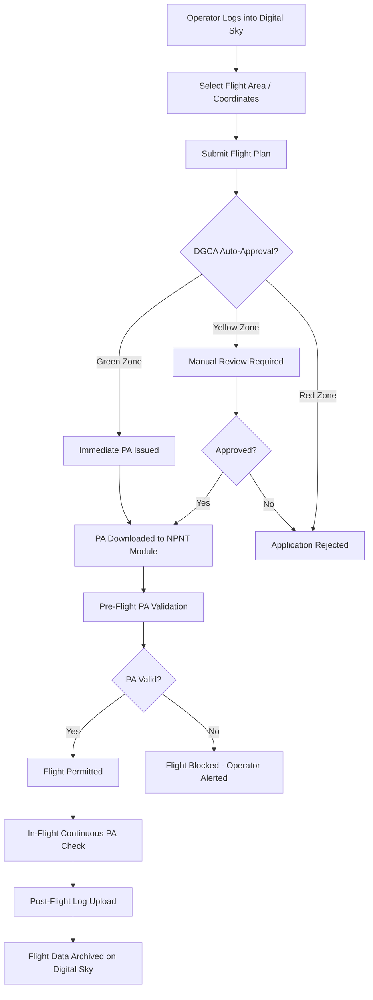
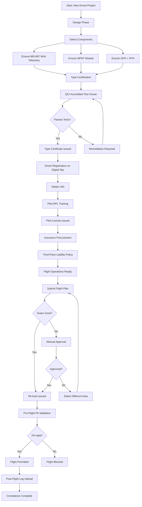

# 10. Regulatory Compliance Analysis

## 1. DGCA Compliance Checklist

### 45 kg Hexacopter — Full Compliance Matrix

| # | Requirement | Status | Priority | Notes |
|---|-------------|--------|----------|-------|
| [ ] | Drone registration on Digital Sky Platform | Required | P0 | digitalsky.dgca.gov.in |
| [ ] | UIN (Unique Identification Number) displayed | Required | P0 | Physically engraved/stickered on airframe |
| [ ] | Type Certificate from QCI-accredited agency | Required | P0 | Through CAR-compliant test house |
| [ ] | Remote Pilot License (RPL) for all operators | Required | P0 | DGCA-approved training school |
| [ ] | Third-party insurance (mandatory Rule 44) | Required | P0 | Up to ₹40,00,000 (IRDAI) |
| [ ] | NPNT module integrated | Required | P0 | No-flight without valid PA |
| [ ] | Anti-collision strobe lights | Required | P1 | Visible 3 km, 1 Hz flash |
| [ ] | GPS with return-to-home capability | Required | P0 | Dual-constellation (GPS+GLONASS) |
| [ ] | Geo-fencing capability | Required | P1 | Software-enforced airspace boundaries |
| [ ] | Flight data logging | Required | P0 | Min 30 days onboard storage |
| [ ] | 865-867 MHz telemetry band | Required | P0 | ISM band allocated for drones in India |
| [ ] | VLOS operations (or BVLOS with special permission) | Required | P0 | Visual line of sight ≤500m |
| [ ] | Maximum takeoff weight marking | Required | P1 | Per NDMA guidelines |
| [ ] | Noise level compliance | Required | P1 | ≤75 dB at 1m (standard limit) |
| [ ] | Emergency kill switch | Recommended | P2 | Motor cutoff within 2 seconds |

---

## 2. Standards Gap Analysis

### Current Regulatory Landscape vs AI-Agricultural Drone Requirements

| Standard | Current Coverage | Gap for AI Agri-Drones | Proposed Amendment |
|----------|------------------|------------------------|-------------------|
| **DGCA Drone Rules 2021** | NPNT, UIN, RPL, VLOS | No AI autonomy certification; no edge-AI safety validation framework | Add "AI Safety Validation" section with mandatory inference reliability testing |
| **BIS IS 17081:2023** | UAS general requirements, airworthiness | No AI model testing protocols; no adversarial robustness requirements | Add "Edge-AI Performance Testing" with model accuracy, latency, failure mode testing |
| **ISO 21384-3:2019** | UAS operational procedures | No autonomous spraying safety envelope; no pesticide-specific flight parameters | Add "Autonomous Spray Safety Envelope" with chemical-specific operational limits |
| **ASTM F3269-21** | UAS remote ID | No AI decision logging; no audit trail for autonomous actions | Add "Decision Audit Log Format" with timestamped AI inference records |
| **ISO 21384-1:2023** | UAS general operations | No soil-crop interaction modeling; no agronomic data standards | Add "Precision Agriculture Data Interoperability" standard |
| **DGCA CAR Section 3, Series X** | Medium category operations | No multi-drone coordination protocol; no swarm certification | Add "Swarm Operations Certification" for coordinated fleet |
| **BIS IS 17480:2022** | Drone delivery operations | Not applicable to spraying operations; no chemical payload safety | Add "Agricultural Chemical Payload Safety" with spill containment |

---

## 3. NPNT Implementation Plan

### 3.1 Hardware Requirements

| Component | Specification | Estimated Cost | Supplier |
|-----------|---------------|----------------|----------|
| NPNT Module | 865-867 MHz transceiver with Digital Sky authentication | ₹20,000–40,000 |翱翔创新, ideaForge |
| SIM Card | IoT-grade with data plan | ₹500–1,000/year | Jio IoT, Airtel M2M |
| Antenna | Omni-directional, 866 MHz tuned | ₹1,500–3,000 | — |
| GPS Module | Dual-frequency, PPS output | ₹5,000–8,000 | u-blox NEO-M9N |

### 3.2 Software Integration

```
┌─────────────────────────────────────────────────────────────┐
│                    NPNT Software Stack                        │
├─────────────────────────────────────────────────────────────┤
│  Flight Controller ──► NPNT Middleware ──► Digital Sky API  │
│       │                      │                    │          │
│  Position data          Authentication       Permission     │
│  (GPS PPS)              Token request        Artefact (PA)  │
│       │                      │                    │          │
│  Geo-fence check        PA validation         Flight plan   │
│  Altitude limit         Anti-spoofing         submission    │
└─────────────────────────────────────────────────────────────┘
```

### 3.3 Flight Plan Submission Process



### 3.4 Permission Artefact (PA) Validation

| Step | Action | Timing |
|------|--------|--------|
| 1 | Request PA from Digital Sky API | Pre-flight (within 24h of planned flight) |
| 2 | Receive signed PA with flight window | Instant (green zone) or up to 48h |
| 3 | Store PA in NPNT module secure element | Before power-on |
| 4 | Validate PA signature against DGCA public key | Every 60 seconds during flight |
| 5 | Compare current GPS position against PA bounds | Continuous |
| 6 | Compare current altitude against PA limits | Continuous |
| 7 | Check PA expiry timestamp | Every 60 seconds |
| 8 | If PA invalid/expired → automatic RTH or landing | Immediate |

### 3.5 Post-Flight Log Upload

| Data Element | Format | Upload Timing |
|--------------|--------|---------------|
| Flight path (GPS trace) | GeoJSON | Within 24 hours |
| PA validation events | JSON array | Within 24 hours |
| Telemetry snapshot | Parquet | Within 24 hours |
| Event/fault log | Structured text | Within 24 hours |
| Pilot identity | Digital certificate hash | With flight plan |

---

## 4. Airspace Zone Mapping

### 4.1 Zone Classifications

| Zone Type | Color | Max AGL | Permission | Typical Areas |
|-----------|-------|---------|------------|---------------|
| **Unrestricted** | Green | 120m | NPNT auto-approval | Agricultural land, open fields |
| **Controlled** | Yellow | 60m | Prior DGCA permission | Near airports, military cantonments |
| **Prohibited** | Red | 0m (no flight) | No permission available | Border areas, nuclear facilities, government buildings |
| **Restricted** | Orange | Variable | Multiple agency approval | Wildlife sanctuaries, cantonment boards |

### 4.2 Interactive Zone Verification

- **Digital Sky Portal**: https://digitalsky.dgca.gov.in
- **No-Permission-No-Takeoff**: Real-time zone check before every flight
- **Geo-fence upload**: Coordinates of farm boundaries pre-loaded into NPNT module

### 4.3 Typical Agricultural Flight Zone Requirements

| Operation | Zone | Max Altitude | Max Distance | Speed Limit |
|-----------|------|-------------|--------------|-------------|
| Crop spraying | Green | 3–5m AGL | 500m VLOS | 3–5 m/s |
| Mapping/survey | Green | 30–60m AGL | 500m VLOS | 5–8 m/s |
| Seed dropping | Green | 3–5m AGL | 500m VLOS | 3–5 m/s |
| Boundary inspection | Green | 10–30m AGL | 500m VLOS | 5–8 m/s |

---

## 5. Insurance Requirements

### 5.1 Mandatory Coverage

| Requirement | Details | Regulation |
|-------------|---------|------------|
| **Third-party liability** | Mandatory for all drone operations | DGCA Rule 44 |
| **Coverage amount** | Up to ₹40,00,000 for Medium category (25–150 kg) per IRDAI | Based on MTOW and risk category |
| **Policy validity** | Must cover entire operational period | Digital Sky verification |
| **Claim process** | Report to DGCA within 48 hours | Written notice to insurance company |

### 5.2 Insurance Types

| Type | Coverage | Estimated Premium | Recommended For |
|------|----------|-------------------|-----------------|
| **Third-party liability** | Damage to property/persons on ground | ₹15,000–25,000/year | All operations (mandatory) |
| **Hull insurance** | Damage to the drone itself | ₹25,000–50,000/year | High-value aircraft |
| **Operational liability** | Pilot error, operational mistakes | ₹10,000–20,000/year | Commercial operators |
| **Payload insurance** | Crop damage from payload spillage | ₹5,000–15,000/year | Spraying operations |

### 5.3 Insurance Providers in India

| Provider | Product | Coverage Limit | Contact |
|----------|---------|----------------|---------|
| ICICI Lombard | Drone Insurance | Up to ₹50 lakh | icicilombard.com |
| HDFC Ergo | UAS Insurance | Up to ₹1 crore | hdfcergo.com |
| New India Assurance | Drone Policy | Up to ₹25 lakh | newindia.co.in |
| Bajaj Allianz | UAV Insurance | Up to ₹50 lakh | bajajallianz.com |
| Tata AIG | Drone Cover | Up to ₹1 crore | tataaig.com |

### 5.4 Claims Documentation

| Document | Required | Timing |
|----------|----------|--------|
| FIR (if applicable) | Yes (for third-party claims) | Within 24 hours |
| Drone flight log | Yes | At time of claim |
| Photographs of damage | Yes | At time of incident |
| Pilot statement | Yes | Within 48 hours |
| Insurance policy copy | Yes | At time of claim |
| DGCA incident report | Yes (if required) | Per DGCA timeline |

---

## 6. Pilot Training Requirements

### 6.1 Remote Pilot License (RPL)

| Parameter | Details |
|-----------|---------|
| **Cost** | ₹15,000–25,000 |
| **Duration** | 5–10 days at DGCA-approved school |
| **Minimum age** | 18 years |
| **Medical fitness** | Class 2 medical certificate (or self-declaration for <25 kg) |
| **Validity** | 5 years |
| **Renewal** | Refresher course + exam |
| **Language** | English or Hindi |

### 6.2 Training Curriculum

| Module | Duration | Topics |
|--------|----------|--------|
| **Air Law** | 1 day | DGCA regulations, airspace rules, penalties |
| **Meteorology** | 0.5 day | Wind patterns, microclimate, spray drift |
| **Flight Operations** | 2 days | Pre-flight checks, emergency procedures, RTH |
| **Agricultural Application** | 2 days | Spray calibration, crop-specific parameters |
| **NPNT & Digital Sky** | 0.5 day | Flight plan submission, PA validation |
| **Practical Flying** | 2–3 days | Supervised flight time (min 10 hours) |
| **Assessment** | 0.5 day | Written exam + practical test |

### 6.3 DGCA-Approved Training Organizations

| Organization | Location | Contact | Capacity |
|--------------|----------|---------|----------|
| **ideaForge Academy** | Mumbai | ideaForge.co.in | 50 pilots/month |
| **Flytting Academy** | Bengaluru | flytting.com | 30 pilots/month |
| **Throttle Aerospace** | Hyderabad | throttle.aero | 40 pilots/month |
| **Skylark Drones** | Bengaluru | skylarkdrones.com | 25 pilots/month |
| **Garuda Aerospace** | Chennai | garuda.aero | 60 pilots/month |
| **Dhaksha Unmanned Systems** | Chennai | dhaksha.in | 35 pilots/month |

### 6.4 Pilot Competency Requirements

| Skill | Level | Verification |
|-------|-------|--------------|
| Manual flying | Proficient | Practical test |
| Emergency handling | Proficient | Scenario-based test |
| NPNT operation | Proficient | Written + practical |
| Spray calibration | Proficient | Field demonstration |
| Weather assessment | Knowledgeable | Written exam |
| Maintenance awareness | Knowledgeable | Written exam |
| First aid | Basic | Certification |

---

## 7. BVLOS Considerations

### 7.1 Current Status

| Aspect | Current (VLOS) | BVLOS Future |
|--------|----------------|--------------|
| **Visibility** | Pilot must see drone at all times | Camera/sensor-based surveillance |
| **Range** | ≤500m from pilot | Up to 10 km (drone corridors) |
| **Communication** | Direct radio link | Redundant cellular + satellite |
| **Approval** | NPNT auto-approval | Special DGCA permission required |
| **Insurance** | Standard third-party | Higher premium (2–3×) |

### 7.2 Approved BVLOS Corridors

| State | Location | Status | Purpose |
|-------|----------|--------|---------|
| Telangana | IIT Hyderabad (TIHAN) | Operational | Testing & validation |
| Uttarakhand | Dehradun corridor | Approved | Agricultural operations |
| Gujarat | Ahmedabad corridor | Approved | Cargo & agriculture |
| Karnataka | Bengaluru corridor | Under review | Urban logistics |
| Tamil Nadu | Chennai corridor | Under review | Coastal operations |

### 7.3 BVLOS Technical Requirements

| System | Requirement | Purpose |
|--------|-------------|---------|
| **Detect-and-avoid (DAA)** | ADS-B In/Out, radar, or FLARM | Avoid mid-air collisions |
| **Redundant C2 link** | Primary + backup (cellular + satellite) | Ensure command continuity |
| **Redundant navigation** | GPS + IMU + visual odometry | Prevent loss of position |
| **Real-time telemetry** | 1 Hz position reporting to Digital Sky | Regulatory compliance |
| **Geofence enforcement** | Hard/soft boundaries in firmware | Airspace compliance |
| **Emergency landing** | Pre-designated safe zones | Controlled emergency descent |

### 7.4 TIHAN Testing Framework

```
┌─────────────────────────────────────────────────────────────┐
│                    TIHAN Testbed Pipeline                     │
├─────────────────────────────────────────────────────────────┤
│  Phase 1: Ground Testing                                    │
│  ├── Communication link validation                          │
│  ├── DAA system calibration                                 │
│  └── NPNT BVLOS integration                                 │
│                                                              │
│  Phase 2: Supervised Flight                                 │
│  ├── Short-range BVLOS (≤2 km)                              │
│  ├── Multi-aircraft coordination                            │
│  └── Emergency response testing                             │
│                                                              │
│  Phase 3: Operational Validation                            │
│  ├── Full corridor flight                                   │
│  ├── Agricultural mission simulation                        │
│  └── Weather resilience testing                             │
│                                                              │
│  Phase 4: Certification                                     │
│  ├── Data submission to DGCA                                │
│  ├── Safety case review                                     │
│  └── BVLOS Type Certificate application                     │
└─────────────────────────────────────────────────────────────┘
```

---

## 8. Compliance Workflow



---

## 9. Penalty Summary

| Violation | Penalty (₹) | Regulation |
|-----------|-------------|------------|
| Flying without registration | Up to ₹50,000 | Drone Rules 2021 Rule 10 |
| Flying without UIN | Up to ₹50,000 | Drone Rules 2021 Rule 11 |
| Flying without RPL | Up to ₹25,000 | Drone Rules 2021 Rule 15 |
| Violating NPNT | Up to ₹1,00,000 | Drone Rules 2021 Rule 8 |
| Flying in prohibited zone | Up to ₹1,00,000 | Drone Rules 2021 Rule 9 |
| Endangering safety | Up to ₹5,00,000 | Bharatiya Nyaya Sanhita |
| Flying without insurance | Up to ₹50,000 | Drone Rules 2021 Rule 44 |
| Operating above MTOW | Up to ₹25,000 | Drone Rules 2021 |

---

## 10. References

1. [DGCA Drone Rules 2021](https://www.dgca.gov.in/digigov-portal/jsp/dgca/rulesPage)
2. [Digital Sky Platform](https://digitalsky.dgca.gov.in)
3. [BIS IS 17081:2023 - Unmanned Aircraft Systems](https://bis.gov.in)
4. [ISO 21384 Series - UAS Standards](https://www.iso.org)
5. [ASTM F3269-21 - UAS Remote ID](https://www.astm.org)
6. [TIHAN Testbed - IIT Hyderabad](https://tihan.org)
7. [NPNT Protocol Specification v2.0](https://digitalsky.dgca.gov.in/npnt-spec)

---

*Document Version: 1.0*
*Last Updated: May 2026*
*Classification: Public*
