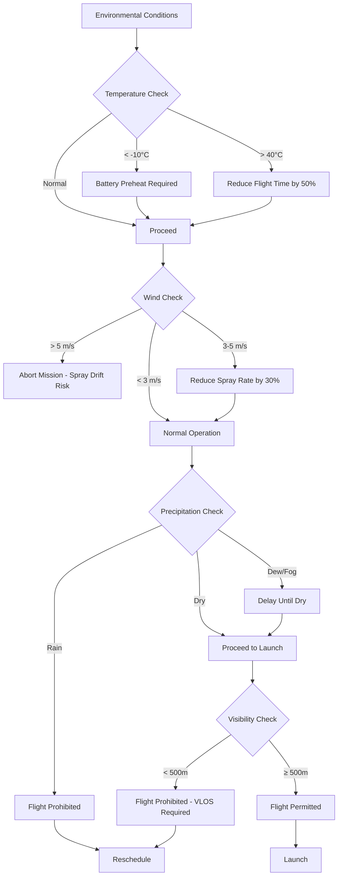
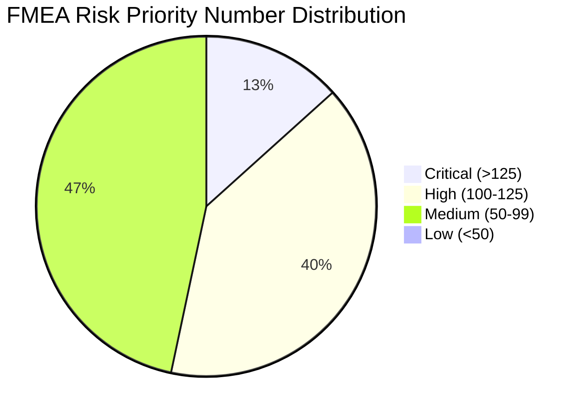
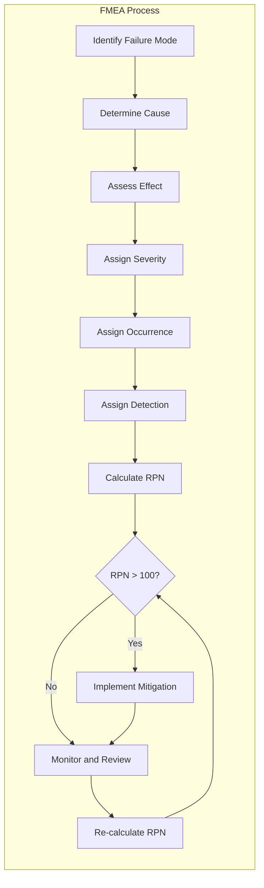

# 11. Risk Analysis and FMEA

## 1. FMEA Matrix

### Failure Mode and Effects Analysis — 45 kg Agricultural Hexacopter

| ID | Failure Mode | Cause | Effect | S | O | D | RPN | Mitigation |
|----|-------------|-------|--------|---|---|---|-----|------------|
| **FM-01** | Single motor failure | ESC burnout, bearing seizure, wire break | Loss of lift on one arm; descent/spin if not compensated; potential crash | 9 | 3 | 4 | 108 | Redundant ESC current sensing; auto-thrust reallocation; safe landing protocol |
| **FM-02** | Battery failure / thermal runaway | Cell defect, over-discharge, physical damage | Fire, explosion, loss of all power; potential ground fire from LiPo | 10 | 2 | 5 | 100 | BMS with cell-level monitoring; thermal cutoff at 70°C; fire-retardant enclosure; RTH on low voltage |
| **FM-03** | ESC failure | MOSFET failure, firmware crash, overcurrent | Motor stop on affected arm; potential motor runaway if gate stuck open | 9 | 3 | 4 | 108 | ESC health monitoring; redundant power path; watchdog timer with motor cutoff |
| **FM-04** | GPS signal loss | Jamming, spoofing, urban canyon, antenna fault | Loss of position hold; drift; inability to maintain geo-fence or NPNT compliance | 8 | 4 | 3 | 96 | Dual-constellation (GPS+GLONASS); IMU dead-reckoning fallback; visual odometry backup; RTH on GPS loss |
| **FM-05** | Spray pump failure | Motor burnout, impeller blockage, wiring fault | Uneven or no spray coverage; crop damage from uneven application; mission failure | 7 | 4 | 3 | 84 | Pump current monitoring; dual-pump redundancy; real-time flow sensor; alarm on deviation |
| **FM-06** | Pre-charge resistor failure | Resistor degradation, solder joint failure | Inrush current spike on power-on; potential MOSFET or capacitor damage | 8 | 3 | 5 | 120 | Redundant pre-charge circuit; soft-start firmware; power-on diagnostics; spare resistor on PCB |
| **FM-07** | Busbar overheating | Loose connection, high current draw, ambient heat | Solder joint degradation; potential fire; power distribution failure | 9 | 3 | 4 | 108 | Thermal sensors on busbar; current limiting; conformal coating; regular torque checks |
| **FM-08** | Tank slosh | Aggressive maneuvers, wind gusts, tank design | CG shift; flight instability; reduced spray accuracy; structural stress on arms | 6 | 5 | 3 | 90 | Baffle system in tank; smooth flight profile; CG compensation algorithm; tank fill level sensor |
| **FM-09** | Arm resonance / fatigue | Repeated vibration, material fatigue, crash damage | Arm fracture; motor detachment; catastrophic structural failure | 9 | 2 | 4 | 72 | Vibration dampening mounts; regular inspection schedule; FEA-validated arm design; carbon fiber layup |
| **FM-10** | EMI / EMC interference | Poor shielding, motor switching noise, radio interference | FC telemetry corruption; sensor noise; false readings; communication loss | 7 | 4 | 5 | 140 | Shielded enclosures; ferrite beads; filtered connectors; EMC pre-compliance testing; isolated power rails |
| **FM-11** | Wire harness chafing | Vibration, sharp edges, poor routing | Short circuit; power loss; fire; intermittent signal failures | 8 | 4 | 4 | 128 | Grommeted routing; cable ties every 100mm; chafe-resistant sleeving; regular inspection |
| **FM-12** | Telemetry link loss | Range exceeded, antenna failure, interference | Loss of real-time control; inability to receive flight plan updates; NPNT failure | 8 | 3 | 3 | 72 | Redundant telemetry (primary + backup); store-and-forward; auto RTH on link loss; signal strength monitoring |
| **FM-13** | AI inference failure | Model corruption, memory overflow, power glitch | Incorrect crop detection; wrong spray decision; missed application zones | 7 | 3 | 6 | 126 | Watchdog timer on AI module; default safe behavior on failure; periodic model validation; hardware memory protection |
| **FM-14** | Camera obstruction | Dust, spray drift, condensation, insect | Loss of visual navigation; inability to detect obstacles; mission abort | 6 | 5 | 3 | 90 | Lens cleaning system; hydrophobic coating; camera health monitoring; redundant navigation sensors |
| **FM-15** | Nozzle clogging | Sediment, dried chemical, particulate matter | Uneven spray pattern; over/under application; crop damage | 6 | 6 | 2 | 72 | Self-cleaning nozzle design; inline filter; pressure monitoring; automatic purge cycle |

### RPN Summary

| Risk Level | RPN Range | Failure Modes | Count |
|------------|-----------|---------------|-------|
| **Critical** | >125 | FM-10 (EMI), FM-13 (AI failure) | 2 |
| **High** | 100–125 | FM-01 (Motor), FM-02 (Battery), FM-03 (ESC), FM-06 (Pre-charge), FM-07 (Busbar), FM-11 (Wire harness) | 6 |
| **Medium** | 50–99 | FM-04 (GPS), FM-05 (Pump), FM-08 (Slosh), FM-09 (Resonance), FM-12 (Telemetry), FM-14 (Camera), FM-15 (Nozzle) | 7 |
| **Low** | <50 | — | 0 |

---

## 2. Risk Assessment Matrix

### 2.1 Probability × Severity Matrix

```
SEVERITY →
PROBABILITY ↓  │ Negligible(1) │ Minor(2) │ Moderate(3) │ Major(4) │ Catastrophic(5)
───────────────┼───────────────┼──────────┼─────────────┼──────────┼────────────────
Very Low (1)   │      1        │    2     │      3      │    4     │       5
Low (2)        │      2        │    4     │      6      │    8     │      10
Medium (3)     │      3        │    6     │      9      │   12     │      15
High (4)       │      4        │    8     │     12      │   16     │      20
Very High (5)  │      5        │   10     │     15      │   20     │      25
```

### 2.2 Risk Level Classification

| Risk Level | RPN Range | Color | Action Required |
|------------|-----------|-------|-----------------|
| **Low** | 1–8 | 🟢 Green | Accept with monitoring |
| **Medium** | 9–15 | 🟡 Yellow | Mitigate to ALARP; document rationale |
| **High** | 16–24 | 🟠 Orange | Active mitigation required before operations |
| **Critical** | 25+ | 🔴 Red | Immediate redesign or elimination required |

### 2.3 Severity Scale

| Level | Description | Example |
|-------|-------------|---------|
| 1 — Negligible | No injury, minor inconvenience | Cosmetic damage only |
| 2 — Minor | Minor injury, minor property damage | Bruise, <₹10,000 damage |
| 3 — Moderate | Serious injury, significant property damage | Hospitalization, ₹10,000–1,00,000 damage |
| 4 — Major | Life-threatening injury, major property damage | Permanent disability, ₹1,00,000+ damage |
| 5 — Catastrophic | Fatality, total loss of system | Death, ₹10,00,000+ damage, environmental disaster |

### 2.4 Probability Scale

| Level | Description | Frequency |
|-------|-------------|-----------|
| 1 — Very Low | Remote possibility | <1 per 10,000 flight hours |
| 2 — Low | Unlikely | 1 per 10,000–5,000 flight hours |
| 3 — Medium | Possible | 1 per 5,000–1,000 flight hours |
| 4 — High | Likely | 1 per 1,000–100 flight hours |
| 5 — Very High | Almost certain | >1 per 100 flight hours |

---

## 3. Risk Mitigation Strategies

### 3.1 Critical Risks (RPN >125)

#### FM-10: EMI/EMC Interference (RPN = 140)

| Strategy Type | Mitigation | Implementation |
|--------------|------------|----------------|
| **Elimination** | Use brushless motors with integrated EMI filtering | Select motors with built-in capacitors |
| **Substitution** | Replace noisy switching regulators with linear regulators for sensitive circuits | LDO for FC, sensor power rails |
| **Engineering Controls** | Shielded enclosures, ferrite beads, filtered connectors | Metal FC enclosure; ferrite on all power leads |
| **Administrative Controls** | EMC pre-compliance testing before flight | Test in EMC chamber or open-area test site |
| **PPE** | N/A for EMI | — |

#### FM-13: AI Inference Failure (RPN = 126)

| Strategy Type | Mitigation | Implementation |
|--------------|------------|----------------|
| **Elimination** | Use deterministic rule-based fallback on AI failure | If AI confidence < threshold, use GPS-only navigation |
| **Substitution** | Use redundant AI modules (primary + backup) | Second AI inference engine on separate hardware |
| **Engineering Controls** | Watchdog timer, ECC memory, hardware reset | 500ms watchdog; ECC on AI module RAM |
| **Administrative Controls** | Pre-flight model validation, periodic retraining | Validate model accuracy before each mission |
| **PPE** | N/A for software failures | — |

### 3.2 High Risks (RPN 100–125)

#### FM-06: Pre-charge Resistor Failure (RPN = 120)

| Strategy Type | Mitigation | Implementation |
|--------------|------------|----------------|
| **Elimination** | Use soft-start IC instead of discrete resistor | TI LM5050 hot-swap controller |
| **Substitution** | Use higher-rated resistor (2× current capacity) | 10W resistor instead of 5W |
| **Engineering Controls** | Redundant pre-charge path; current monitoring | Dual resistors in parallel with individual monitoring |
| **Administrative Controls** | Pre-flight power-on diagnostics | Auto-check inrush current on every power cycle |
| **PPE** | N/A for electrical component | — |

#### FM-11: Wire Harness Chafing (RPN = 128)

| Strategy Type | Mitigation | Implementation |
|--------------|------------|----------------|
| **Elimination** | Use wireless power distribution (not feasible at this power level) | Not applicable |
| **Substitution** | Use mil-spec connectors with locking mechanisms | Molex Micro-Fit 3.0 with positive lock |
| **Engineering Controls** | Grommeted routing, chafe-resistant sleeving, cable ties every 100mm | Nylon spiral wrap; rubber grommets at frame penetrations |
| **Administrative Controls** | Mandatory pre-flight visual inspection; scheduled replacement | Inspect every 50 flight hours; replace annually |
| **PPE** | N/A for wiring | — |

#### FM-02: Battery Failure / Thermal Runaway (RPN = 100)

| Strategy Type | Mitigation | Implementation |
|--------------|------------|----------------|
| **Elimination** | Use solid-state batteries (not yet commercially viable) | Future consideration |
| **Substitution** | Use LiFePO4 cells (safer chemistry, lower energy density) | Trade-off: 20% weight increase |
| **Engineering Controls** | BMS with cell-level monitoring; thermal cutoff at 70°C; fire-retardant enclosure | Custom BMS; INT30278A thermal fuse; fiberglass battery box |
| **Administrative Controls** | Storage guidelines (40–60% SOC, cool dry place); avoid charging unattended | Standard operating procedure |
| **PPE** | Fire-resistant battery bag during charging; LiPo-safe bag during transport | Operational requirement |

#### FM-01: Single Motor Failure (RPN = 108)

| Strategy Type | Mitigation | Implementation |
|--------------|------------|----------------|
| **Elimination** | Use multi-motor redundancy (8+ motors) | Increase to octocopter (adds weight/cost) |
| **Substitution** | Use higher-quality motors with longer MTBF | T-Motor U8 series (MTBF >2000h) |
| **Engineering Controls** | Auto-thrust reallocation; controlled descent on motor loss | ArduPilot motor fail detection; differential thrust compensation |
| **Administrative Controls** | Pre-flight motor inspection; vibration analysis | Check motor bearings every 100 hours |
| **PPE** | N/A for motor failure | — |

---

## 4. Safety Case Documentation

### 4.1 System Safety Requirements

| ID | Requirement | Priority | Verification |
|----|-------------|----------|--------------|
| SSR-01 | System shall detect and compensate for single motor failure | Critical | Flight test with deliberate motor shutdown |
| SSR-02 | System shall execute safe landing within 5 seconds of critical failure | Critical | Timed descent test |
| SSR-03 | System shall maintain position accuracy ±2m during nominal flight | High | GPS accuracy test |
| SSR-04 | System shall detect thermal runaway and initiate disconnect | Critical | Thermal chamber test |
| SSR-05 | System shall log all flight data for ≥30 days | High | Data persistence test |
| SSR-06 | System shall reject NPNT invalid flight plans | Critical | Integration test with mock Digital Sky |
| SSR-07 | System shall maintain spray accuracy ±10% of target rate | High | Flow meter calibration test |
| SSR-08 | System shall fail-safe on telemetry link loss >5 seconds | High | Communication dropout test |
| SSR-09 | System shall detect and alert on EMI conditions exceeding threshold | Medium | EMC test |
| SSR-10 | System shall complete emergency shutdown within 2 seconds of kill switch activation | Critical | Timed shutdown test |

### 4.2 Hazard Identification

| Hazard ID | Hazard | Source | Consequence | Existing Controls |
|-----------|--------|--------|-------------|-------------------|
| H-01 | Mid-air collision | Other aircraft, birds | Structural damage, crash | VLOS operations, anti-collision lights |
| H-02 | Ground impact | System failure, pilot error | Property damage, injury | RTH, auto-landing, kill switch |
| H-03 | Chemical exposure | Spray drift, spillage | Health hazard to humans/animals | Spray calibration, wind monitoring, buffer zones |
| H-04 | Fire | Battery failure, electrical fault | Property damage, injury | BMS, thermal cutoff, fire-retardant materials |
| H-05 | Noise nuisance | Motor operation | Community complaints | Noise-reducing propellers, flight time restrictions |
| H-06 | Privacy violation | Camera/sensor data collection | Legal liability | Data minimization, local processing only |
| H-07 | Environmental contamination | Chemical spill, battery disposal | Soil/water pollution | Spill containment, proper disposal procedures |

### 4.3 Safety Verification Matrix

| Requirement | Test Method | Pass Criteria | Status |
|-------------|-------------|---------------|--------|
| SSR-01 | Deliberate motor shutdown flight test | Auto-recovery within 2 seconds | To be verified |
| SSR-02 | Timed descent test | Landing within 5 seconds | To be verified |
| SSR-03 | GPS accuracy test (open field) | ±2m position accuracy | To be verified |
| SSR-04 | Thermal runaway test | Disconnect before thermal propagation | To be verified |
| SSR-05 | Data logging persistence test | 30-day retention | To be verified |
| SSR-06 | NPNT integration test | Reject invalid PA | To be verified |
| SSR-07 | Spray flow meter test | ±10% flow accuracy | To be verified |
| SSR-08 | Telemetry dropout test | Safe landing on link loss | To be verified |
| SSR-09 | EMC chamber test | No false alerts in normal conditions | To be verified |
| SSR-10 | Kill switch test | <2 second full shutdown | To be verified |

### 4.4 Safety Certification Evidence

| Evidence Type | Description | Document Reference |
|---------------|-------------|-------------------|
| Design Analysis | FMEA, FTA, hazard analysis | This document (Section 1–3) |
| Test Reports | All verification test results | Test report repository |
| Component Certifications | ESC, FC, battery certifications | Component datasheets |
| Insurance Certificate | Third-party liability coverage | Policy document |
| Pilot Certification | RPL for all operators | DGCA-issued licenses |
| Flight Logs | Historical flight data demonstrating safe operations | Digital Sky records |
| Maintenance Records | All inspection and replacement records | Maintenance log |

---

## 5. Environmental Risk Factors

### 5.1 Operating Environment Specifications

| Parameter | Operating Range | Limit | Performance Impact |
|-----------|-----------------|-------|-------------------|
| **Temperature** | -20°C to 50°C | -30°C to 55°C | Battery capacity reduced 20% at -10°C; motor efficiency reduced at 50°C |
| **Wind** | Up to 5 m/s | 7 m/s | Spray drift increases >3 m/s; flight stability degraded >5 m/s |
| **Rain** | Not rated (IPX6 on motors only) | Light drizzle only | Electronics not waterproof; flight prohibited in rain |
| **Dust** | Filtered intakes, conformal coating on FC | Heavy dust | Air filter clogging; sensor degradation; conformal coating essential |
| **Altitude** | Up to 1000m ASL | 1500m ASL | Air density reduction; motor efficiency drops ~3% per 100m above 1000m |
| **Humidity** | 30–80% RH | 90% RH | Condensation risk on optics; corrosion on connectors |
| **UV Exposure** | Moderate | High | Plastic component degradation; use UV-resistant materials |

### 5.2 Environmental Risk Matrix



### 5.3 Seasonal Operational Guidelines

| Season | Temperature | Wind | Rain | Recommendation |
|--------|-------------|------|------|----------------|
| **Kharif (Jun–Sep)** | 25–35°C | Moderate-High | High | Fly early morning; avoid monsoon days |
| **Rabi (Oct–Mar)** | 10–25°C | Low-Moderate | Low | Optimal conditions; morning fog awareness |
| **Zaid (Mar–Jun)** | 30–45°C | Moderate | Very Low | Avoid midday; reduce battery load; heat management |

### 5.4 Altitude Performance Degradation

| Altitude (m ASL) | Air Density (%) | Motor Efficiency (%) | Flight Time Impact | Recommended Action |
|-------------------|-----------------|----------------------|-------------------|-------------------|
| 0–500 | 100% | 100% | Nominal | Full operations |
| 500–1000 | 94% | 94% | -6% | Slight reduction in payload |
| 1000–1500 | 86% | 86% | -14% | Reduce payload by 15%; limit flight time |
| 1500+ | <86% | <86% | >-14% | Not recommended without modification |

---

## 6. FMEA Summary Diagram





---

## 7. Risk Monitoring and Review

### 7.1 Ongoing Monitoring

| Activity | Frequency | Responsible | Record |
|----------|-----------|-------------|--------|
| Flight data review | Every flight | Pilot | Digital Sky upload |
| Motor vibration analysis | Every 10 hours | Maintenance | Vibration log |
| Battery capacity check | Every 10 cycles | Maintenance | Battery health report |
| ESC health check | Every 20 hours | Maintenance | ESC diagnostic log |
| Structural inspection | Every 50 hours | Engineer | Inspection checklist |
| FMEA review | Every 100 hours | Safety team | Updated FMEA document |
| Full safety audit | Annually | External auditor | Audit report |

### 7.2 Incident Reporting

| Severity | Report To | Timeline | Required Actions |
|----------|-----------|----------|-----------------|
| **Near-miss** | Internal safety team | 24 hours | Root cause analysis |
| **Minor incident** | DGCA (if required) | 48 hours | Investigation, corrective action |
| **Major incident** | DGCA + Insurance | Immediately | Full investigation, flight suspension |
| **Catastrophic** | DGCA + Police + Insurance | Immediately | Full investigation, fleet grounding |

### 7.3 Continuous Improvement

| Input | Action | Output |
|-------|--------|--------|
| Flight data trends | Adjust operational limits | Updated SOPs |
| Incident reports | Root cause analysis | Design improvements |
| Component MTBF data | Update maintenance schedule | Revised maintenance intervals |
| Regulatory changes | Compliance review | Updated documentation |
| Field feedback | Operator experience review | Product enhancements |

---

## 8. Risk Summary Dashboard

| Category | Total Risks | Critical | High | Medium | Low |
|----------|-------------|----------|------|--------|-----|
| **Mechanical** | 4 | 0 | 2 | 2 | 0 |
| **Electrical** | 5 | 2 | 3 | 0 | 0 |
| **Software/AI** | 2 | 0 | 1 | 1 | 0 |
| **Operational** | 3 | 0 | 0 | 3 | 0 |
| **Environmental** | 1 | 0 | 0 | 1 | 0 |
| **Total** | 15 | 2 | 6 | 7 | 0 |

### Key Takeaways

1. **EMI/EMC (FM-10) and AI Inference Failure (FM-13)** are the highest-risk items requiring immediate mitigation
2. **Wire harness chafing (FM-11) and Pre-charge resistor (FM-06)** are high-risk and require engineering controls
3. **Battery thermal runaway (FM-02)** requires fire-retardant enclosure and BMS validation
4. **Single motor failure (FM-01)** is mitigated by auto-thrust reallocation but requires flight testing validation
5. **No low-risk failure modes** — all identified failures require active mitigation

---

*Document Version: 1.0*
*Last Updated: May 2026*
*Classification: Internal*
*FMEA Revision: Initial Release*
