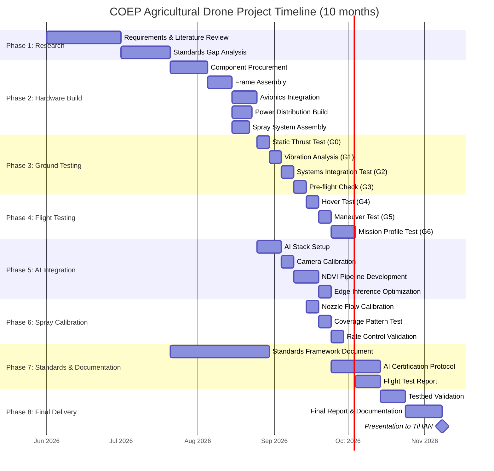
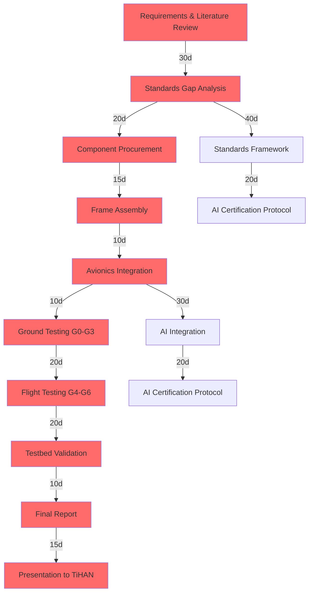
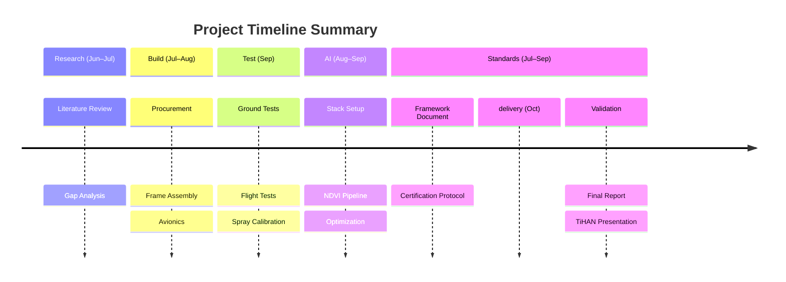

# Project Timeline & Execution Plan

## 1. Master Gantt Chart



---

## 2. Project Phases Overview

| Phase | Name | Duration | Start | End | Key Deliverable |
|-------|------|----------|-------|-----|-----------------|
| 1 | Research | 50 days | Jun 1 | Jul 20 | Standards Gap Report |
| 2 | Hardware Build | 35 days | Jul 21 | Aug 24 | Assembled Testbed |
| 3 | Ground Testing | 20 days | Aug 25 | Sep 13 | G3 Pre-flight Pass |
| 4 | Flight Testing | 20 days | Sep 14 | Oct 3 | G6 Mission Complete |
| 5 | AI Integration | 30 days | Aug 25 | Sep 23 | NDVI Pipeline Live |
| 6 | Spray Calibration | 15 days | Sep 14 | Sep 28 | Calibrated Spray System |
| 7 | Standards & Docs | 60 days | Jul 21 | Sep 18 | Framework Document |
| 8 | Final Delivery | 25 days | Oct 4 | Oct 28 | Presentation Complete |

---

## 3. Milestone Table

| ID | Milestone | Target Date | Gate | Deliverable | Status |
|----|-----------|-------------|------|-------------|--------|
| M1 | Literature Review Complete | 2026-07-01 | — | Literature survey document | ⬜ |
| M2 | Standards Gap Analysis Complete | 2026-07-20 | G0 | Gap analysis report | ⬜ |
| M3 | All Components Received | 2026-08-05 | — | BOM verification checklist | ⬜ |
| M4 | Testbed Hardware Assembled | 2026-08-24 | — | Physical drone ready | ⬜ |
| M5 | Ground Sweep Passed | 2026-09-01 | G1 | Vibration & thermal data | ⬜ |
| M6 | Stable Hover Achieved | 2026-09-07 | G2 | Hover flight log | ⬜ |
| M7 | First Free Flight | 2026-09-13 | G3 | Flight envelope data | ⬜ |
| M8 | All Flight Modes Working | 2026-09-18 | G4 | Mode test report | ⬜ |
| M9 | Spray System Calibrated | 2026-09-28 | G5 | Calibration certificate | ⬜ |
| M10 | AI Integration Complete | 2026-09-23 | — | NDVI demo video | ⬜ |
| M11 | Mission Validation Passed | 2026-10-03 | G6 | Mission flight log | ⬜ |
| M12 | Standards Framework Document | 2026-09-18 | — | 50+ page framework | ⬜ |
| M13 | Flight Test Report | 2026-10-13 | — | Formal test report | ⬜ |
| M14 | Final Report Submitted | 2026-10-28 | — | Complete project report | ⬜ |
| M15 | Presentation to TiHAN | 2026-10-28 | — | Slide deck + demo | ⬜ |

---

## 4. Critical Path Analysis

The critical path determines the minimum project duration. Any delay on these tasks delays the entire project.

### Critical Path Diagram



### Critical Path Tasks (Cannot Be Delayed)

| # | Task | Duration | Float | Impact if Delayed |
|---|------|----------|-------|-------------------|
| 1 | Requirements & Literature Review | 30 days | 0 | Delays everything |
| 2 | Standards Gap Analysis | 20 days | 0 | Delays framework document |
| 3 | Component Procurement | 15 days | 0 | Delays hardware build |
| 4 | Frame Assembly | 10 days | 0 | Delays integration |
| 5 | Avionics Integration | 10 days | 0 | Delays ground testing |
| 6 | Ground Testing (G0–G3) | 20 days | 0 | Delays flight testing |
| 7 | Flight Testing (G4–G6) | 20 days | 0 | Delays validation |
| 8 | Testbed Validation | 10 days | 0 | Delays final report |
| 9 | Final Report & Presentation | 15 days | 0 | Delays TiHAN delivery |

### Non-Critical Paths (Have Float)

| Path | Float | Tasks |
|------|-------|-------|
| AI Integration | 10 days | Can start after avionics; has buffer before mission validation |
| Spray Calibration | 5 days | Can overlap with flight testing |
| Standards Framework | 0 days | Actually critical; runs parallel to build |

---

## 5. Resource Allocation

| Phase | Personnel | Equipment | Budget (₹) | Location |
|-------|-----------|-----------|------------|----------|
| **Phase 1: Research** | 1 researcher | Laptop, internet, library | 5,000 | COEP campus |
| **Phase 2: Build** | 2 researchers | Workshop, tools, soldering station | 3,50,000 | COEP lab |
| **Phase 3: Ground Test** | 2–3 people | Test bench, oscilloscope, safety gear | 15,000 | Outdoor test area |
| **Phase 4: Flight Test** | 3–4 people | Test site, safety perimeter, first aid | 20,000 | Approved test field |
| **Phase 5: AI** | 1–2 researchers | Jetson, camera, GPU workstation | 40,000 | COEP lab |
| **Phase 6: Spray Test** | 2–3 people | Test crop area, measurement tools | 10,000 | Agricultural field |
| **Phase 7: Documentation** | 1 researcher | LaTeX/Overleaf, reference materials | 5,000 | COEP campus |
| **Phase 8: Final** | Full team | Presentation equipment, demo drone | 25,000 | TiHAN facility |

### Team Roles

| Role | Responsibility | Phase Involvement |
|------|---------------|-------------------|
| Project Lead | Overall coordination, standards framework | All phases |
| Hardware Lead | Component selection, assembly, testing | Phases 2–4, 6 |
| Software Lead | ArduPilot config, AI integration | Phases 4–5 |
| Test Pilot | Flight operations, safety | Phases 3–4, 6 |
| Documentation Lead | Reports, standards document | Phases 1, 7–8 |

---

## 6. Go/No-Go Decision Points

### Gate Review Process

Each gate requires formal review before proceeding:

| Gate | Decision Point | Criteria | Review Board | Go Criteria |
|------|---------------|----------|--------------|-------------|
| **G0** | Component verification | All parts received, inspected, functional | Project Lead + Hardware Lead | 100% BOM verified |
| **G1** | Vibration within limits | All motors <4.0 mm/s RMS, no resonance | Hardware Lead + Test Pilot | All 6 motors pass |
| **G2** | Stable hover achieved | Hover hold <1m drift, 30s minimum | Test Pilot + Safety Officer | Stable for 60s |
| **G3** | Flight envelope acceptable | All axes responsive, no oscillations | Test Pilot + Project Lead | Full envelope mapped |
| **G4** | All flight modes working | Manual, AltHold, Loiter, Auto | Software Lead + Test Pilot | All modes functional |
| **G5** | Spray system calibrated | Flow rate ±5% of target | Hardware Lead + Spray Tech | Calibration cert issued |
| **G6** | Mission completed | Full mission profile flown autonomously | Full team | Mission log verified |

### Gate Review Template

```markdown
## Gate Review: G[Number]
**Date:** YYYY-MM-DD
**Attendees:** [Names]
**Decision:** GO / NO-GO / CONDITIONAL

### Checklist
- [ ] Criterion 1: PASS/FAIL
- [ ] Criterion 2: PASS/FAIL
- [ ] Criterion 3: PASS/FAIL

### Issues Found
1. [Issue description]

### Corrective Actions
1. [Action item] — Owner: [Name] — Due: [Date]

### Decision Rationale
[Why GO or NO-GO]
```

---

## 7. Risk-Adjusted Timeline

| Scenario | Duration | Completion Date | Key Assumptions |
|----------|----------|----------------|-----------------|
| **Best Case** | 8 months | Oct 2026 | No delays, all components in stock, favorable weather |
| **Expected** | 10 months | Dec 2026 | Minor delays, standard procurement, typical testing |
| **Worst Case** | 13 months | Mar 2027 | Major delays, component failures, regulatory hurdles |

### Buffer Allocation

| Buffer Type | Duration | Purpose |
|-------------|----------|---------|
| Technical buffer | 6 weeks | Unforeseen integration issues |
| Procurement buffer | 3 weeks | Shipping delays, customs |
| Weather buffer | 2 weeks | Flight testing weather windows |
| Regulatory buffer | 2 weeks | NPNT/registration delays |
| **Total buffer** | **~13 weeks** | Absorbs most realistic delays |

### Delay Risk Matrix

| Risk | Probability | Impact | Mitigation |
|------|------------|--------|-----------|
| Component shipping delay | High | 2 weeks | Order early; identify local alternatives |
| Motor/ESC failure | Medium | 1 week | Order 1 spare motor + ESC |
| Vibration issues | Medium | 2 weeks | Pre-balanced props; vibration isolators ready |
| Weather delays | Medium | 1 week | Flexible testing schedule; indoor alternatives |
| Regulatory delays | Low | 3 weeks | Start NPNT application in Phase 1 |
| AI integration issues | Medium | 2 weeks | Simplified baseline; full features as stretch goal |
| Battery issues | Low | 2 weeks | Pre-test each pack; order spare |

---

## 8. Weekly Schedule Template

### Phase 2–4 (Active Build & Test)

| Week | Monday | Tuesday | Wednesday | Thursday | Friday | Saturday |
|------|--------|---------|-----------|----------|--------|----------|
| 1 | Procurement research | Order components | Order components | Follow up | Review specs | — |
| 2 | Receive parts | Inspect parts | Frame prep | Frame assembly | Frame assembly | — |
| 3 | Mount motors | Wire ESCs | Install FC | Install GPS | Wiring review | — |
| 4 | Power system test | Integration | Integration | Integration | G0 Review | — |
| 5 | Static test | Vibration test | Vibration fix | Systems test | G1 Review | — |
| 6 | Hover test | Hover tuning | Loiter test | Auto test | G2 Review | — |
| 7 | Mission planning | Mission test | Mission test | Mission test | G3 Review | — |

---

## 9. Deliverables Schedule

| Deliverable | Type | Due Date | Reviewer | Format |
|-------------|------|----------|----------|--------|
| Literature Survey | Document | Jul 1, 2026 | Guide | PDF |
| Standards Gap Report | Document | Jul 20, 2026 | Guide + TiHAN | PDF |
| BOM & Procurement Plan | Spreadsheet | Jul 21, 2026 | Project Lead | XLSX |
| Assembly Manual | Document | Aug 24, 2026 | Hardware Lead | PDF |
| Ground Test Report | Report | Sep 13, 2026 | Guide | PDF |
| Flight Test Report | Report | Oct 3, 2026 | Guide + TiHAN | PDF |
| Standards Framework | Document | Sep 18, 2026 | TiHAN | PDF (50+ pages) |
| AI Certification Protocol | Document | Oct 13, 2026 | TiHAN | PDF |
| NDVI Demo Video | Video | Sep 23, 2026 | Guide | MP4 |
| Final Project Report | Document | Oct 28, 2026 | Guide + TiHAN | PDF (100+ pages) |
| Presentation | Slides | Oct 28, 2026 | TiHAN panel | PPTX |

---

## 10. Communication Plan

| Meeting | Frequency | Attendees | Purpose |
|---------|-----------|-----------|---------|
| Daily Standup | Daily (15 min) | Build team | Progress, blockers |
| Weekly Review | Weekly (1 hr) | Full team + guide | Milestone tracking |
| Gate Review | Per gate | Full team + reviewers | Go/No-Go decision |
| TiHAN Update | Bi-weekly | Project lead + TiHAN | Progress report |
| Final Review | End of project | Full team + TiHAN panel | Presentation & defense |

### Status Reporting Template

```markdown
## Weekly Status Report — Week [X]
**Date:** YYYY-MM-DD
**Phase:** [Current phase]

### Completed This Week
- [Task 1]
- [Task 2]

### Planned Next Week
- [Task 3]
- [Task 4]

### Blockers
- [Blocker 1]

### Risks Identified
- [Risk 1]

### Budget Status
- Spent: ₹[X]
- Remaining: ₹[Y]
```

---

## 11. Critical Success Factors

| Factor | Importance | How to Ensure |
|--------|-----------|---------------|
| Early component procurement | Critical | Order in Week 1 of Phase 2 |
| Safety compliance | Critical | No shortcuts; full safety checklist |
| Iterative testing | High | Test at each gate; don't skip |
| Documentation discipline | High | Document as you go; not retroactively |
| Guide engagement | High | Weekly meetings; share progress promptly |
| TiHAN alignment | High | Bi-weekly updates; align on standards scope |
| Weather planning | Medium | Monitor forecast; have backup indoor tests |
| Spare components | Medium | Keep 1 spare motor, ESC, prop set |

---

## 12. Project Summary

| Metric | Value |
|--------|-------|
| **Total Duration** | 10 months (Jun–Oct 2026) |
| **Total Budget** | ₹5,70,000 |
| **Team Size** | 2–4 members |
| **Critical Path Length** | 20 weeks |
| **Gate Reviews** | 7 |
| **Key Milestones** | 15 |
| **Major Deliverables** | 11 |

### Timeline Visualization



### Key Dates

| Date | Event |
|------|-------|
| Jun 1, 2026 | Project kickoff |
| Jul 20, 2026 | Standards gap analysis complete |
| Aug 24, 2026 | Hardware assembled |
| Sep 13, 2026 | Ground testing complete |
| Sep 23, 2026 | AI integration complete |
| Oct 3, 2026 | Flight testing complete |
| Oct 28, 2026 | Final presentation to TiHAN |

---

**Note:** This timeline assumes realistic component availability and weather conditions. The 3-month buffer provides resilience against most foreseeable delays. Regular gate reviews ensure early detection of schedule risks.
