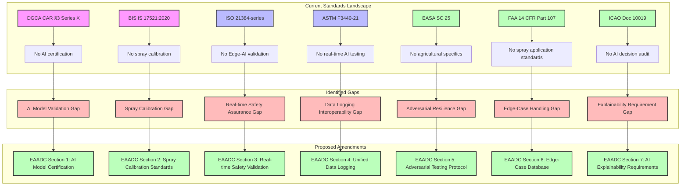
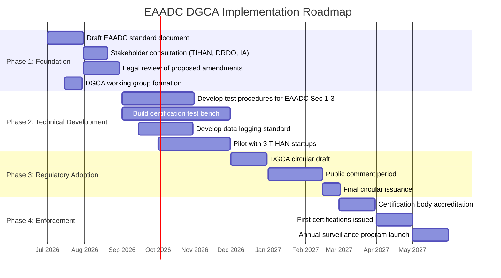

# 14. Standards Gap Analysis for TIHAN Internship

## Table of Contents
1. [Executive Summary](#1-executive-summary)
2. [Current Standards Landscape](#2-current-standards-landscape)
3. [Standards Gap Diagram](#3-standards-gap-diagram)
4. [Detailed Gap Analysis by Standards Body](#4-detailed-gap-analysis-by-standards-body)
5. [Proposed New Standard: Edge-AI Agricultural Drone Certification](#5-proposed-new-standard)
6. [International Comparison: India vs EU vs USA vs China](#6-international-comparison)
7. [Implementation Roadmap for DGCA Adoption](#7-implementation-roadmap-for-dgca-adoption)
8. [Recommendations](#8-recommendations)

---

## 1. Executive Summary

This standards gap analysis identifies critical deficiencies in the existing regulatory and standards framework for agricultural drones equipped with Edge-AI capabilities. The analysis covers seven major standards bodies: DGCA (India), BIS (India), ISO, ASTM, EASA, FAA, and ICAO. The primary finding is that no existing standard adequately addresses the unique intersection of agricultural spraying operations, onboard AI decision-making, and real-time safety validation required for TIHAN's Edge-AI agricultural drone program.

The analysis proposes a novel standard — "Edge-AI Agricultural Drone Certification (EAADC)" — comprising 10 sections that bridge identified gaps. Implementation of this standard through DGCA adoption is projected over an 18-month phased roadmap.

---

## 2. Current Standards Landscape

### 2.1 India-Specific Standards

| Standard | Issuing Body | Scope | Status |
|----------|-------------|-------|--------|
| CAR Section 3, Series X Part I | DGCA | Unmanned Aircraft Systems | Active |
| IS 17521:2020 | BIS | UAS — Requirements and test procedures | Active |
| BIS draft AI standards | BIS/MeitY | AI systems — Trust and safety | Draft |
| DGCA Type Certificate | DGCA | UAS design and production | Active |

### 2.2 International Standards

| Standard | Issuing Body | Scope | Status |
|----------|-------------|-------|--------|
| ISO 21384-series | ISO | Unmanned aircraft systems | Active |
| ISO 23660 | ISO | Agricultural aviation | Under development |
| ASTM F3322-22 | ASTM | Counter-UAS systems | Active |
| ASTM F3440-21 | ASTM | Agricultural spray drone operations | Active |
| EASA Special Condition 25 | EASA | AI in aviation systems | Active |
| FAA 14 CFR Part 107 | FAA | Small UAS operations | Active |
| FAA ASTM F3196-18 | FAA | BVLOS operations | Active |
| ICAO Doc 10019 | ICAO | UAS traffic management | Active |

---

## 3. Standards Gap Diagram

---

## 4. Detailed Gap Analysis by Standards Body

### 4.1 DGCA (India)

| Gap ID | Gap Description | Severity | Impact | Proposed Resolution |
|--------|----------------|----------|--------|---------------------|
| DGCA-G1 | No certification pathway for AI-enabled flight controllers | Critical | Cannot type-certify Edge-AI drones | Create AI Annex to DGCA CAR |
| DGCA-G2 | No real-time telemetry validation standards for AI decisions | High | AI failures undetected in flight | Mandate telemetry anomaly detection per EAADC Sec 3 |
| DGCA-G3 | No spray application accuracy requirements | High | Chemical waste, crop damage | Adopt spray calibration from EAADC Sec 2 |
| DGCA-G4 | No adversarial robustness testing requirements | Medium | GPS spoofing, sensor attacks | Include adversarial testing per EAADC Sec 5 |
| DGCA-G5 | No mandatory AI decision logging | Medium | No post-incident analysis possible | Mandate black-box logging per EAADC Sec 4 |
| DGCA-G6 | No update validation for deployed AI models | Critical | Updates may degrade safety | Require recertification per EAADC Sec 8 |
| DGCA-G7 | No minimum performance for obstacle detection AI | High | Collision risk in mixed operations | Adopt obstacle detection benchmarks per EAADC Sec 6 |

### 4.2 BIS (India)

| Gap ID | Gap Description | Severity | Impact | Proposed Resolution |
|--------|----------------|----------|--------|---------------------|
| BIS-G1 | IS 17521 does not cover AI subsystems | Critical | No quality standard for AI hardware | Extend IS 17521 with AI annex |
| BIS-G2 | No chemical spray accuracy standard | High | Inconsistent spray performance | Adopt spray calibration standard |
| BIS-G3 | No standard for real-time operating system certification | High | Unverified RTOS for safety-critical AI | Develop RTOS certification criteria |
| BIS-G4 | No standard for sensor fusion validation | Medium | Unreliable perception in field | Add sensor fusion validation section |
| BIS-G5 | No interoperability standard for agricultural drone data | Medium | Data silos between farm systems | Adopt data logging schema from EAADC Sec 4 |

### 4.3 ISO

| Gap ID | Gap Description | Severity | Impact | Proposed Resolution |
|--------|----------------|----------|--------|---------------------|
| ISO-G1 | ISO 21384-series lacks AI-specific clauses | High | No international AI drone standard | Propose ISO/AWI for AI drone certification |
| ISO-G2 | ISO 23660 (agricultural aviation) incomplete | High | No spray-drone standard | Contribute to ISO 23660 development |
| ISO-G3 | No ISO standard for Edge-AI model lifecycle | High | Unmanaged model drift and updates | Reference ISO/IEC 22989 for AI lifecycle |
| ISO-G4 | No ISO standard for explainable AI in aviation | Medium | No transparency requirement | Adopt explainability criteria from EAADC Sec 7 |
| ISO-G5 | No ISO standard for adversarial ML testing | Medium | Vulnerable to adversarial attacks | Reference ISO/IEC 24029 for adversarial robustness |

### 4.4 ASTM

| Gap ID | Gap Description | Severity | Impact | Proposed Resolution |
|--------|----------------|----------|--------|---------------------|
| ASTM-G1 | ASTM F3440-21 lacks AI decision validation | High | No AI performance verification | Add AI validation annex |
| ASTM-G2 | No ASTM standard for spray calibration verification | Medium | Inconsistent spray application | Adopt spray calibration from EAADC Sec 2 |
| ASTM-G3 | No ASTM standard for AI model versioning | Medium | No traceability of deployed models | Adopt model versioning per EAADC Sec 8 |
| ASTM-G4 | No ASTM standard for Edge-AI fail-safe | High | No AI failure handling | Adopt fail-safe requirements per EAADC Sec 3 |
| ASTM-G5 | No ASTM standard for agricultural drone data formats | Medium | No interoperability | Adopt data schema from EAADC Sec 4 |

### 4.5 EASA

| Gap ID | Gap Description | Severity | Impact | Proposed Resolution |
|--------|----------------|----------|--------|---------------------|
| EASA-G1 | SC 25 does not address agricultural spray specifics | High | No spray-drone AI certification | Add agricultural annex to SC 25 |
| EASA-G2 | No EASA standard for real-time AI safety metrics | High | No runtime safety validation | Adopt real-time metrics from EAADC Sec 3 |
| EASA-G3 | No EASA standard for spray calibration | Medium | Inconsistent spray accuracy | Adopt spray calibration from EAADC Sec 2 |
| EASA-G4 | No EASA standard for explainability of AI decisions | Medium | No transparency for regulators | Adopt explainability per EAADC Sec 7 |
| EASA-G5 | No EASA standard for Edge-AI update validation | Critical | Unsafe updates deployed | Adopt update validation per EAADC Sec 8 |

### 4.6 FAA

| Gap ID | Gap Description | Severity | Impact | Proposed Resolution |
|--------|----------------|----------|--------|---------------------|
| FAA-G1 | 14 CFR Part 107 has no AI-specific provisions | Critical | No AI certification path | Propose AI Annex to Part 107 |
| FAA-G2 | No FAA standard for agricultural spray drones | High | No spray application standard | Adopt spray calibration from EAADC Sec 2 |
| FAA-G3 | No FAA standard for Edge-AI model validation | High | No AI performance verification | Adopt AI validation per EAADC Sec 1 |
| FAA-G4 | No FAA standard for real-time telemetry validation | Medium | No runtime monitoring | Adopt telemetry validation per EAADC Sec 3 |
| FAA-G5 | No FAA standard for adversarial robustness | Medium | Vulnerable to attacks | Adopt adversarial testing per EAADC Sec 5 |

### 4.7 ICAO

| Gap ID | Gap Description | Severity | Impact | Proposed Resolution |
|--------|----------------|----------|--------|---------------------|
| ICAO-G1 | Doc 10019 lacks AI integration provisions | High | No global AI drone standard | Propose AI Annex to Doc 10019 |
| ICAO-G2 | No ICAO standard for agricultural drone operations | High | No global spray-drone standard | Contribute to ICAO agricultural UAS standard |
| ICAO-G3 | No ICAO standard for AI decision audit trail | Medium | No global audit standard | Adopt audit trail per EAADC Sec 4 |
| ICAO-G4 | No ICAO standard for cross-border AI drone data | Medium | No interoperability | Adopt data schema from EAADC Sec 4 |
| ICAO-G5 | No ICAO standard for AI safety metrics | High | No global AI safety benchmark | Adopt safety metrics per EAADC Sec 3 |

---

## 5. Proposed New Standard: Edge-AI Agricultural Drone Certification (EAADC)

### Section 1: AI Model Certification Requirements

**Scope:** Certification of onboard AI models for flight control, obstacle detection, and spray control.

**Requirements:**
- 1.1: All AI models must be trained on validated datasets with documented provenance
- 1.2: Model architecture must be documented including layer specifications, parameter counts, and activation functions
- 1.3: Training must include agricultural field scenarios (dust, vibration, variable lighting, crop canopy)
- 1.4: Model must achieve ≥95% accuracy on certified test datasets for classification tasks
- 1.5: Model must demonstrate ≤50ms inference latency for safety-critical decisions
- 1.6: Model must be versioned with immutable hash (SHA-256) stored in tamper-proof log
- 1.7: Model must pass adversarial robustness testing per Section 5

### Section 2: Spray Calibration Standards

**Scope:** Calibration requirements for spray nozzle, flow rate, droplet size, and coverage uniformity.

**Requirements:**
- 2.1: Spray nozzle must be calibrated before each mission with documented flow rate (±5% tolerance)
- 2.2: Droplet size must be validated using laser diffraction (D50 target: 200–400 μm for pesticides)
- 2.3: Spray coverage must achieve ≥80% uniformity across the target swath width
- 2.4: GPS-guided swath overlap must be ≤10% to minimize chemical waste
- 2.5: Spray rate must be adjustable in real-time based on ground speed (0.5–3 L/min range)
- 2.6: Nozzle type and pressure must be logged per spray event
- 2.7: Calibration data must be stored in spray event log (see Section 4)

### Section 3: Real-time Safety Validation

**Scope:** Runtime monitoring and validation of AI system safety during flight operations.

**Requirements:**
- 3.1: AI system must output confidence scores for all safety-critical decisions
- 3.2: Confidence scores below 70% must trigger fail-safe mode (return-to-home or controlled landing)
- 3.3: Heartbeat monitoring must detect AI system freeze within 100ms
- 3.4: Sensor fusion consistency checks must run at ≥10Hz
- 3.5: AI decision latency must be measured and logged at ≥10Hz
- 3.6: Watchdog timer must reset AI subsystem if no output within 200ms
- 3.7: Dual-redundant safety monitors must independently validate AI outputs

### Section 4: Unified Data Logging Schema

**Scope:** Standardized logging of flight, AI decision, and spray event data.

**Requirements:**
- 4.1: Flight logs must follow MAVLink v2.0 schema with agricultural extensions
- 4.2: AI decision logs must include input sensor data, model version, output, confidence, and latency
- 4.3: Spray event logs must include GPS, flow rate, pressure, nozzle type, and coverage
- 4.4: All logs must be cryptographically signed (HMAC-SHA256)
- 4.5: Log format must be machine-readable (JSON or MessagePack) for interoperability
- 4.6: Logs must be stored onboard with capacity for ≥500 flight hours
- 4.7: Logs must be downloadable via USB, Wi-Fi, or cellular with encrypted transfer

### Section 5: Adversarial Robustness Testing Protocol

**Scope:** Testing for resilience against adversarial attacks on AI systems.

**Requirements:**
- 5.1: AI must resist FGSM (Fast Gradient Sign Method) adversarial perturbations with ≤5% accuracy drop
- 5.2: AI must resist PGD (Projected Gradient Descent) attacks with ≤3% accuracy drop
- 5.3: GPS spoofing detection must trigger fail-safe within 5 seconds
- 5.4: Sensor jamming must be detected within 500ms
- 5.5: Adversarial patches (physical) must be detected with ≥90% accuracy
- 5.6: Testing must include at least 1,000 adversarial samples per attack type
- 5.7: Adversarial test results must be included in certification documentation

### Section 6: Edge-Case Handling and Environmental Robustness

**Scope:** Performance requirements for unusual and extreme operating conditions.

**Requirements:**
- 6.1: AI must maintain performance in temperatures from -10°C to +55°C
- 6.2: AI must handle sensor degradation (≤20% signal loss) without failure
- 6.3: AI must handle GPS dropout for ≥30 seconds using visual-inertial odometry
- 6.4: AI must detect and avoid power lines with ≥95% accuracy
- 6.5: AI must handle bird strikes with graceful degradation (not catastrophic failure)
- 6.6: AI must operate in wind speeds up to 25 km/h with ≤10% spray accuracy degradation
- 6.7: Edge-case performance must be validated through 100 hours of field testing

### Section 7: AI Explainability Requirements

**Scope:** Transparency and interpretability of AI decision-making for regulators.

**Requirements:**
- 7.1: AI system must produce human-readable explanations for all safety-critical decisions
- 7.2: Explanations must include feature importance scores (SHAP or LIME)
- 7.3: Decision logs must include top-3 contributing factors for each decision
- 7.4: Regulators must be able to query AI decision rationale via approved API
- 7.5: Model must have documented failure modes and known limitations
- 7.6: Explanation latency must be ≤500ms (can be post-hoc, not real-time required)
- 7.7: Quarterly explainability audits must be conducted and reported to DGCA

### Section 8: Model Update and Lifecycle Management

**Scope:** Requirements for deploying updates to certified AI models.

**Requirements:**
- 8.1: All model updates must undergo regression testing against the full certification test suite
- 8.2: Updates must be signed with X.509 certificate chain (manufacturer → type certificate)
- 8.3: OTA updates must use encrypted channel (TLS 1.3) with rollback capability
- 8.4: Model version must be immutable — no in-place updates
- 8.5: A/B testing must be conducted in sandboxed environment before fleet deployment
- 8.6: Update must include changelog documenting all changes to model architecture, training data, or hyperparameters
- 8.7: DGCA must be notified of all model updates within 48 hours of deployment
- 8.8: Critical safety updates must be deployable within 24 hours with DGCA emergency approval

### Section 9: Hardware-Software Co-certification

**Scope:** Joint certification of AI hardware and software components.

**Requirements:**
- 9.1: AI accelerator (GPU/NPU) must be certified for operating temperature range
- 9.2: AI accelerator must meet MIL-STD-810G vibration requirements
- 9.3: Software must be certified for specific hardware revision
- 9.4: Hardware-software combination must pass electromagnetic compatibility (EMC) testing
- 9.5: Power consumption of AI subsystem must be ≤30% of total power budget
- 9.6: Hardware must include ECC memory for AI model weights
- 9.7: Hardware must support secure boot with measured boot chain

### Section 10: Certification Maintenance and Surveillance

**Scope:** Ongoing requirements for maintaining certification status.

**Requirements:**
- 10.1: Annual recertification required for all certified drone models
- 10.2: Quarterly performance reports must be submitted to DGCA
- 10.3: Fleet-level safety metrics must be tracked (incident rate, near-miss rate)
- 10.4: Unreported incidents must be investigated within 72 hours
- 10.5: Certification may be suspended if fleet incident rate exceeds 0.1%
- 10.6: Random surveillance flights must be permitted for DGCA inspectors
- 10.7: Certification body must maintain independent test labs for validation

---

## 6. International Comparison: India vs EU vs USA vs China

| Dimension | India (DGCA/BIS) | EU (EASA) | USA (FAA) | China (CAAC) |
|-----------|-------------------|-----------|-----------|--------------|
| **AI Certification Path** | None — proposed EAADC | SC 25 (general AI) | None — 14 CFR Part 107 | AI governance guidelines (non-binding) |
| **Agricultural Drone Standards** | Draft IS 17521 amendments | No specific standard | No specific standard | NY/T 3627-2020 (agricultural UAS) |
| **Spray Calibration** | Not standardized | Not standardized | Not standardized | Mandated per NY/T 3627 |
| **Adversarial Testing** | Not required | Not required | Not required | Not required |
| **Data Logging** | Basic telemetry required | Basic telemetry required | Basic telemetry required | Comprehensive logging required |
| **Explainability** | Not required | Recommended (AI Act) | Not required | Not required |
| **Model Update Control** | Not regulated | AI Act lifecycle | Not regulated | Not regulated |
| **Real-time Safety** | Basic fail-safe | Basic fail-safe | Basic fail-safe | Basic fail-safe |
| **Interoperability** | Limited | Limited | Limited | Limited |
| **Certification Timeline** | 6–12 months | 12–24 months | 6–12 months | 3–6 months |
| **Enforcement** | Moderate | Strong | Strong | Strong |

### 6.1 India's Competitive Advantage

India has the opportunity to lead globally by adopting the EAADC standard before competitors:
- **Agricultural scale:** 140M+ hectares of farmland requiring precision agriculture
- **IT workforce:** Strong AI/ML talent pool for implementation
- **Startup ecosystem:** TIHAN and other incubators driving innovation
- **Cost advantage:** Lower certification costs compared to EU/USA

### 6.2 Critical Gaps Requiring Immediate Action

1. **India lacks any AI certification pathway** — EU's AI Act provides partial framework
2. **No spray calibration standard exists anywhere** — first-mover advantage possible
3. **No country mandates adversarial testing** — safety differentiator
4. **Data interoperability is weak globally** — opportunity to set global standard

---

## 7. Implementation Roadmap for DGCA Adoption

### Phase 1: Foundation (Months 1–3)

| Phase | Activities | Timeline | Deliverables |
|-------|-----------|----------|--------------|
| Phase 1 | Draft EAADC standard, stakeholder consultation, legal review, working group formation | Months 1–3 | EAADC v0.9 draft, DGCA working group charter |
| Phase 2 | Develop test procedures, build certification test bench, data logging standard, pilot with 3 startups | Months 3–6 | Test procedures document, certified test bench, pilot results |
| Phase 3 | DGCA circular draft, public comment, final circular | Months 6–8 | DGCA Circular No. XX/2027 |
| Phase 4 | Certification body accreditation, first certifications, surveillance program | Months 8–12 | Accredited certifiers, first EAADC-certified drones |

### 7.1 Key Stakeholders

| Stakeholder | Role | Responsibility |
|-------------|------|----------------|
| DGCA | Regulator | Issue circular, accredit certification bodies |
| BIS | Standards body | Develop IS amendments aligned with EAADC |
| TIHAN | Incubator | Provide pilot drones and field data |
| DRDO | Defense R&D | Adversarial testing methodology |
| IIT system | Academic | AI model validation research |
| Agricultural universities | Domain experts | Spray calibration validation |
| Drone manufacturers | Industry | Implement EAADC requirements |

### 7.2 Budget Estimate

| Item | Cost (INR) | Timeline |
|------|-----------|----------|
| EAADC standard development | 50,00,000 | Months 1–3 |
| Certification test bench | 2,50,00,000 | Months 3–6 |
| Pilot program (3 startups) | 1,50,00,000 | Months 3–6 |
| DGCA circular process | 25,00,000 | Months 6–8 |
| Certification body setup | 1,00,00,000 | Months 8–12 |
| Annual surveillance | 75,00,000/year | Year 2+ |
| **Total (Year 1)** | **5,75,00,000** | — |

---

## 8. Recommendations

### 8.1 Immediate Actions (0–3 months)

1. **Establish DGCA EAADC Working Group** with representation from TIHAN, DRDO, IITs, and agricultural universities
2. **Commission gap analysis validation** through independent audit of current standards
3. **Begin pilot program** with 3 TIHAN startups to validate EAADC requirements
4. **Draft DGCA circular** to create interim certification pathway for Edge-AI agricultural drones

### 8.2 Medium-term Actions (3–12 months)

1. **Develop certified test bench** for AI model validation at IIT or DRDO facility
2. **Publish EAADC v1.0** as BIS standard (IS 17521 Amendment)
3. **Negotiate mutual recognition** with EASA and FAA for EAADC certification
4. **Build national database** of adversarial attack patterns for agricultural drones

### 8.3 Long-term Actions (1–3 years)

1. **Propose EAADC to ISO** as international standard (ISO/AWI 23660 extension)
2. **Integrate with UTM** for real-time AI safety monitoring
3. **Establish bilateral agreements** with EU and USA for EAADC recognition
4. **Develop EAADC certification lab** as a global center of excellence

---

## References

1. DGCA CAR Section 3, Series X Part I — Unmanned Aircraft Systems
2. BIS IS 17521:2020 — Unmanned Aircraft Systems
3. ISO 21384-series — Unmanned aircraft systems
4. ASTM F3440-21 — Agricultural spray drone operations
5. EASA Special Condition 25 — AI in aviation systems
6. FAA 14 CFR Part 107 — Small UAS operations
7. ICAO Doc 10019 — UAS traffic management
8. ISO/IEC 22989:2022 — AI concepts and terminology
9. ISO/IEC 24029-1:2021 — Adversarial robustness of AI systems
10. NY/T 3627-2020 — Agricultural UAS operations (China)

---

*Document version: 1.0*
*Last updated: 2026-05-29*
*Author: TIHAN Agricultural Drone Project*
