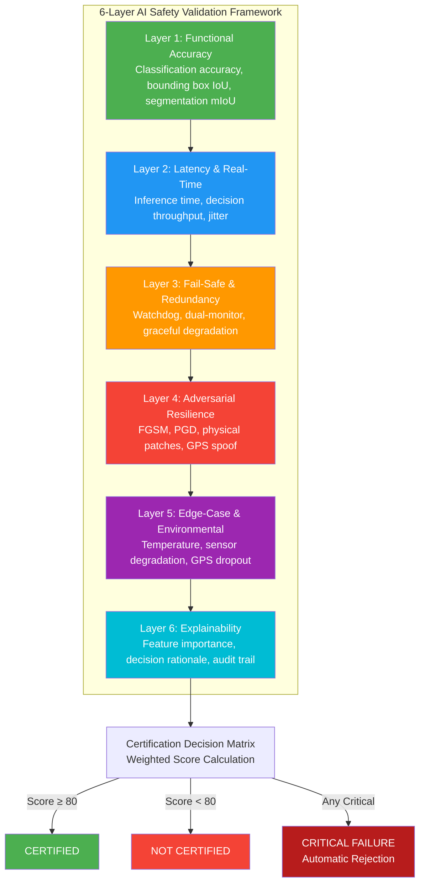
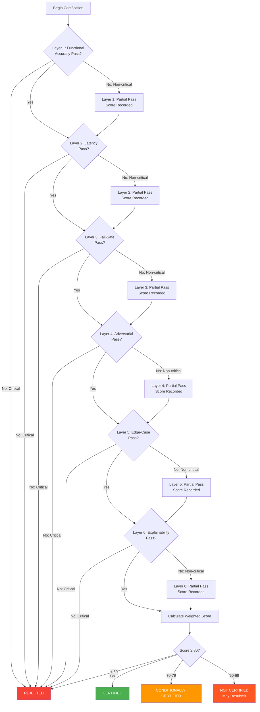

# 15. Edge-AI Certification Framework

## Table of Contents
1. [Executive Summary](#1-executive-summary)
2. [6-Layer AI Safety Validation Framework](#2-6-layer-ai-safety-validation-framework)
3. [Layer 1: Functional Accuracy Testing](#3-layer-1-functional-accuracy-testing)
4. [Layer 2: Latency and Real-Time Performance Testing](#4-layer-2-latency-and-real-time-performance-testing)
5. [Layer 3: Fail-Safe and Redundancy Testing](#5-layer-3-fail-safe-and-redundancy-testing)
6. [Layer 4: Adversarial Resilience Testing](#6-layer-4-adversarial-resilience-testing)
7. [Layer 5: Edge-Case and Environmental Testing](#7-layer-5-edge-case-and-environmental-testing)
8. [Layer 6: Explainability and Transparency Testing](#8-layer-6-explainability-and-transparency-testing)
9. [Certification Decision Matrix](#9-certification-decision-matrix)
10. [Model Update Requirements](#10-model-update-requirements)
11. [Continuous Monitoring Requirements](#11-continuous-monitoring-requirements)
12. [Certification Decision Tree](#12-certification-decision-tree)

---

## 1. Executive Summary

This document defines the Edge-AI certification framework for agricultural drones operated under the TIHAN program. The framework establishes a 6-layer safety validation methodology covering functional accuracy, real-time performance, fail-safe reliability, adversarial resilience, edge-case handling, and explainability. Each layer has defined test procedures, pass/fail criteria, and weighted scoring for the certification decision matrix.

The certification is granted only when the weighted score exceeds 80/100 and no critical failure occurs in any layer. Certified models must undergo continuous monitoring and recertification upon any update.

---

## 2. 6-Layer AI Safety Validation Framework

---

## 3. Layer 1: Functional Accuracy Testing

### 3.1 Test Procedures

**Test 1.1: Crop Disease Classification**
- **Input:** 1,000 labeled images of 10 common crop diseases (rice blast, wheat rust, etc.)
- **Environment:** Controlled lighting, standard resolution (640×480 minimum)
- **Procedure:** Run inference on full test set, record predictions
- **Metric:** Top-1 accuracy and Top-5 accuracy
- **Pass Criteria:** Top-1 ≥ 92%, Top-5 ≥ 99%
- **Critical Threshold:** Top-1 < 85% → automatic failure

**Test 1.2: Obstacle Detection**
- **Input:** 500 annotated scenarios with obstacles (trees, power lines, birds, humans)
- **Environment:** Simulated and real-world obstacle courses
- **Procedure:** Run detection pipeline, measure IoU with ground truth
- **Metric:** Mean IoU, Recall at 90% precision
- **Pass Criteria:** Mean IoU ≥ 0.75, Recall ≥ 95% at 90% precision
- **Critical Threshold:** Recall < 85% → automatic failure

**Test 1.3: Weed Identification**
- **Input:** 2,000 field images with weed/crop segmentation masks
- **Environment:** Various field conditions (morning, noon, dusk)
- **Procedure:** Run semantic segmentation, compute mIoU
- **Metric:** Mean Intersection over Union (mIoU)
- **Pass Criteria:** mIoU ≥ 0.80
- **Critical Threshold:** mIoU < 0.70 → automatic failure

**Test 1.4: Spray Target Classification**
- **Input:** 300 flight paths with annotated spray/no-spray zones
- **Environment:** Simulated flight at 3m/s, 3m altitude
- **Procedure:** Run spray decision model, compare with ground truth
- **Metric:** F1-score for spray/no-spray classification
- **Pass Criteria:** F1 ≥ 0.95
- **Critical Threshold:** F1 < 0.90 → automatic failure

### 3.2 Layer 1 Scoring

| Test | Weight | Pass Score | Fail Score | Critical Failure |
|------|--------|-----------|-----------|-----------------|
| Crop Disease Classification | 25% | 25 | 0 | Top-1 < 85% |
| Obstacle Detection | 30% | 30 | 0 | Recall < 85% |
| Weed Identification | 20% | 20 | 0 | mIoU < 0.70 |
| Spray Target Classification | 25% | 25 | 0 | F1 < 0.90 |
| **Total** | **100%** | **100** | **0** | **Any critical** |

---

## 4. Layer 2: Latency and Real-Time Performance Testing

### 4.1 Test Procedures

**Test 2.1: Single-Frame Inference Latency**
- **Input:** 1,000 random field images (640×480, RGB)
- **Environment:** Onboard AI accelerator (Jetson Orin NX or equivalent)
- **Procedure:** Measure time from image receipt to output
- **Metric:** Mean, P95, P99 inference latency
- **Pass Criteria:** Mean ≤ 30ms, P95 ≤ 50ms, P99 ≤ 80ms
- **Critical Threshold:** Mean > 100ms → automatic failure

**Test 2.2: End-to-End Decision Latency**
- **Input:** Simulated sensor stream (camera + LiDAR + GPS)
- **Environment:** Full onboard system with sensors
- **Procedure:** Measure time from sensor input to actuator command
- **Metric:** End-to-end latency (sensor → decision → actuator)
- **Pass Criteria:** ≤ 100ms for safety-critical decisions
- **Critical Threshold:** > 200ms → automatic failure

**Test 2.3: Decision Throughput**
- **Input:** Sustained sensor stream at 30 FPS
- **Environment:** Full onboard system
- **Procedure:** Run system for 1 hour, measure frame processing rate
- **Metric:** Frames processed per second, dropped frames
- **Pass Criteria:** ≥ 25 FPS processed, ≤ 1% dropped frames
- **Critical Threshold:** < 15 FPS or > 5% dropped → automatic failure

**Test 2.4: Latency Jitter**
- **Input:** 10,000 sequential frames
- **Environment:** Full onboard system under load
- **Procedure:** Measure standard deviation of inference latency
- **Metric:** Jitter (standard deviation of latency)
- **Pass Criteria:** Jitter ≤ 5ms
- **Critical Threshold:** Jitter > 20ms → automatic failure

### 4.2 Layer 2 Scoring

| Test | Weight | Pass Score | Fail Score | Critical Failure |
|------|--------|-----------|-----------|-----------------|
| Single-Frame Inference | 30% | 30 | 0 | Mean > 100ms |
| End-to-End Decision | 35% | 35 | 0 | > 200ms |
| Decision Throughput | 20% | 20 | 0 | < 15 FPS |
| Latency Jitter | 15% | 15 | 0 | Jitter > 20ms |
| **Total** | **100%** | **100** | **0** | **Any critical** |

---

## 5. Layer 3: Fail-Safe and Redundancy Testing

### 5.1 Test Procedures

**Test 3.1: Watchdog Timer Response**
- **Input:** Forced AI model freeze (SIGSTOP process)
- **Environment:** Full onboard system
- **Procedure:** Kill AI process, measure time to watchdog reset
- **Metric:** Time to fail-safe activation
- **Pass Criteria:** ≤ 200ms
- **Critical Threshold:** > 500ms → automatic failure

**Test 3.2: Dual-Monitor Independence**
- **Input:** Injected AI output error (wrong spray decision)
- **Environment:** Full onboard system with dual safety monitors
- **Procedure:** Inject error, verify both monitors detect independently
- **Metric:** Detection rate by each monitor independently
- **Pass Criteria:** Both monitors detect error with ≥ 99% reliability
- **Critical Threshold:** Either monitor < 95% → automatic failure

**Test 3.3: Graceful Degradation**
- **Input:** Progressive sensor failure (camera → LiDAR → GPS)
- **Environment:** Full onboard system in field
- **Procedure:** Fail each sensor sequentially, verify safe behavior
- **Metric:** Success rate of safe landing/RTH after sensor loss
- **Pass Criteria:** ≥ 99% safe landing/RTH
- **Critical Threshold:** Any catastrophic failure → automatic failure

**Test 3.4: Fail-Safe Mode Activation**
- **Input:** Confidence score below 70% threshold
- **Environment:** Full onboard system
- **Procedure:** Feed ambiguous inputs, verify fail-safe activation
- **Metric:** Fail-safe activation rate when confidence < 70%
- **Pass Criteria:** 100% fail-safe activation
- **Critical Threshold:** Any missed fail-safe → automatic failure

**Test 3.5: Battery Emergency Handling**
- **Input:** Simulated battery level at 15%, then 10%, then 5%
- **Environment:** Full onboard system in flight
- **Procedure:** Verify appropriate response at each threshold
- **Metric:** Correct action at each battery threshold
- **Pass Criteria:** 15% → warning, 10% → RTH, 5% → immediate landing
- **Critical Threshold:** No response at 5% → automatic failure

### 5.2 Layer 3 Scoring

| Test | Weight | Pass Score | Fail Score | Critical Failure |
|------|--------|-----------|-----------|-----------------|
| Watchdog Timer | 25% | 25 | 0 | > 500ms |
| Dual-Monitor Independence | 25% | 25 | 0 | Either < 95% |
| Graceful Degradation | 20% | 20 | 0 | Any catastrophic |
| Fail-Safe Activation | 20% | 20 | 0 | Any missed |
| Battery Emergency | 10% | 10 | 0 | No response at 5% |
| **Total** | **100%** | **100** | **0** | **Any critical** |

---

## 6. Layer 4: Adversarial Resilience Testing

### 6.1 Test Procedures

**Test 4.1: FGSM Attack Resistance**
- **Input:** 1,000 test images perturbed with FGSM (ε = 0.03)
- **Environment:** Onboard AI accelerator
- **Procedure:** Run inference on perturbed images, measure accuracy drop
- **Metric:** Accuracy drop under FGSM attack
- **Pass Criteria:** Accuracy drop ≤ 5%
- **Critical Threshold:** Accuracy drop > 15% → automatic failure

**Test 4.2: PGD Attack Resistance**
- **Input:** 1,000 test images perturbed with PGD (ε = 0.03, 20 iterations)
- **Environment:** Onboard AI accelerator
- **Procedure:** Run inference on perturbed images, measure accuracy drop
- **Metric:** Accuracy drop under PGD attack
- **Pass Criteria:** Accuracy drop ≤ 3%
- **Critical Threshold:** Accuracy drop > 10% → automatic failure

**Test 4.3: Physical Adversarial Patch Detection**
- **Input:** 200 images with adversarial patches (printed patterns on ground)
- **Environment:** Field conditions with printed patches
- **Procedure:** Fly drone over patched area, measure detection rate
- **Metric:** Detection rate of adversarial patches
- **Pass Criteria:** ≥ 90% detection rate
- **Critical Threshold:** < 70% detection → automatic failure

**Test 4.4: GPS Spoofing Detection**
- **Input:** GPS signal simulator with spoofed coordinates
- **Environment:** Controlled GPS environment
- **Procedure:** Inject spoofed GPS, measure detection time
- **Metric:** Time to GPS spoof detection
- **Pass Criteria:** ≤ 5 seconds
- **Critical Threshold:** > 10 seconds → automatic failure

**Test 4.5: Sensor Jamming Detection**
- **Input:** RF jammer targeting camera or LiDAR
- **Environment:** Shielded test chamber
- **Procedure:** Jam each sensor, measure detection time
- **Metric:** Time to sensor jam detection
- **Pass Criteria:** ≤ 500ms
- **Critical Threshold:** > 2 seconds → automatic failure

### 6.2 Layer 4 Scoring

| Test | Weight | Pass Score | Fail Score | Critical Failure |
|------|--------|-----------|-----------|-----------------|
| FGSM Resistance | 20% | 20 | 0 | Drop > 15% |
| PGD Resistance | 25% | 25 | 0 | Drop > 10% |
| Physical Patch Detection | 20% | 20 | 0 | Detection < 70% |
| GPS Spoofing Detection | 20% | 20 | 0 | > 10 seconds |
| Sensor Jamming Detection | 15% | 15 | 0 | > 2 seconds |
| **Total** | **100%** | **100** | **0** | **Any critical** |

---

## 7. Layer 5: Edge-Case and Environmental Testing

### 7.1 Test Procedures

**Test 5.1: Temperature Extremes**
- **Input:** 500 test images at each temperature point
- **Environment:** Thermal chamber (-10°C, 0°C, 25°C, 40°C, 55°C)
- **Procedure:** Run inference at each temperature, measure accuracy
- **Metric:** Accuracy degradation vs. baseline (25°C)
- **Pass Criteria:** ≤ 5% degradation at all temperatures
- **Critical Threshold:** > 15% degradation → automatic failure

**Test 5.2: Sensor Degradation**
- **Input:** Images with progressive blur, noise, and occlusion (10%–30%)
- **Environment:** Onboard system with synthetic degradation
- **Procedure:** Run inference with degraded inputs, measure accuracy
- **Metric:** Accuracy vs. degradation level
- **Pass Criteria:** ≥ 80% accuracy at 20% degradation
- **Critical Threshold:** < 70% accuracy at 20% → automatic failure

**Test 5.3: GPS Dropout Handling**
- **Input:** GPS signal loss for 30, 60, 120 seconds
- **Environment:** Indoor or GPS-denied environment
- **Procedure:** Verify visual-inertial odometry maintains position
- **Metric:** Position drift during GPS outage
- **Pass Criteria:** ≤ 2m drift after 60 seconds
- **Critical Threshold:** > 5m drift → automatic failure

**Test 5.4: Power Line Detection**
- **Input:** 200 images containing power lines (various angles, lighting)
- **Environment:** Field and simulated environments
- **Procedure:** Run detection, measure recall and precision
- **Metric:** Recall and precision for power line detection
- **Pass Criteria:** Recall ≥ 95%, Precision ≥ 90%
- **Critical Threshold:** Recall < 85% → automatic failure

**Test 5.5: Wind Resistance**
- **Input:** Simulated wind from 0–25 km/h
- **Environment:** Wind tunnel or simulated environment
- **Procedure:** Measure spray accuracy degradation under wind
- **Metric:** Spray accuracy vs. wind speed
- **Pass Criteria:** ≤ 10% degradation at 25 km/h
- **Critical Threshold:** > 20% degradation → automatic failure

### 7.2 Layer 5 Scoring

| Test | Weight | Pass Score | Fail Score | Critical Failure |
|------|--------|-----------|-----------|-----------------|
| Temperature Extremes | 20% | 20 | 0 | > 15% degradation |
| Sensor Degradation | 20% | 20 | 0 | < 70% at 20% |
| GPS Dropout Handling | 25% | 25 | 0 | > 5m drift |
| Power Line Detection | 20% | 20 | 0 | Recall < 85% |
| Wind Resistance | 15% | 15 | 0 | > 20% degradation |
| **Total** | **100%** | **100** | **0** | **Any critical** |

---

## 8. Layer 6: Explainability and Transparency Testing

### 8.1 Test Procedures

**Test 6.1: Feature Importance Generation**
- **Input:** 100 safety-critical decision scenarios
- **Environment:** Onboard system or post-hoc analysis
- **Procedure:** Generate SHAP/LIME feature importance for each decision
- **Metric:** Coverage of safety-relevant features in explanation
- **Pass Criteria:** ≥ 90% of safety-relevant features captured
- **Critical Threshold:** < 70% → automatic failure

**Test 6.2: Decision Rationale Readability**
- **Input:** 50 AI decisions with generated explanations
- **Environment:** Human evaluation panel (5 domain experts)
- **Procedure:** Experts rate explanation clarity (1–5 scale)
- **Metric:** Average clarity score
- **Pass Criteria:** Average ≥ 3.5/5.0
- **Critical Threshold:** Average < 2.5/5.0 → automatic failure

**Test 6.3: Explanation Consistency**
- **Input:** 200 similar decision scenarios (minor variations)
- **Environment:** Onboard system
- **Procedure:** Generate explanations, measure consistency
- **Metric:** Explanation consistency (cosine similarity of feature importance vectors)
- **Pass Criteria:** ≥ 85% consistency
- **Critical Threshold:** < 70% → automatic failure

**Test 6.4: Regulatory Audit API**
- **Input:** API calls from regulatory audit tool
- **Environment:** Integration test environment
- **Procedure:** Verify API returns decision history, explanations, model metadata
- **Metric:** API response completeness and correctness
- **Pass Criteria:** 100% correct responses
- **Critical Threshold:** Any data loss → automatic failure

**Test 6.5: Known Limitations Documentation**
- **Input:** Documentation review
- **Environment:** Desk review
- **Procedure:** Verify completeness of failure mode documentation
- **Metric:** Percentage of known failure modes documented
- **Pass Criteria:** ≥ 95%
- **Critical Threshold:** < 80% → automatic failure

### 8.2 Layer 6 Scoring

| Test | Weight | Pass Score | Fail Score | Critical Failure |
|------|--------|-----------|-----------|-----------------|
| Feature Importance | 25% | 25 | 0 | < 70% coverage |
| Decision Rationale | 25% | 25 | 0 | Average < 2.5 |
| Explanation Consistency | 20% | 20 | 0 | < 70% consistency |
| Regulatory Audit API | 15% | 15 | 0 | Any data loss |
| Limitations Documentation | 15% | 15 | 0 | < 80% documented |
| **Total** | **100%** | **100** | **0** | **Any critical** |

---

## 9. Certification Decision Matrix

### 9.1 Weighted Scoring

| Layer | Weight | Max Score | Weighted Max |
|-------|--------|-----------|--------------|
| Layer 1: Functional Accuracy | 30% | 100 | 30 |
| Layer 2: Latency & Real-Time | 20% | 100 | 20 |
| Layer 3: Fail-Safe & Redundancy | 20% | 100 | 20 |
| Layer 4: Adversarial Resilience | 15% | 100 | 15 |
| Layer 5: Edge-Case & Environmental | 10% | 100 | 10 |
| Layer 6: Explainability | 5% | 100 | 5 |
| **Total** | **100%** | — | **100** |

### 9.2 Decision Criteria

| Score Range | Decision | Conditions |
|-------------|----------|------------|
| 90–100 | **CERTIFIED — GOLD** | No critical failures, all layers pass |
| 80–89 | **CERTIFIED — STANDARD** | No critical failures, all layers pass |
| 70–79 | **CONDITIONALLY CERTIFIED** | No critical failures, remediation plan required within 30 days |
| 60–69 | **NOT CERTIFIED** | May resubmit after addressing failures |
| < 60 | **REJECTED** | Fundamental redesign required |

### 9.3 Certification Decision Tree

---

## 10. Model Update Requirements

### 10.1 Update Classification

| Update Type | Description | Testing Required | Approval |
|-------------|-------------|-----------------|----------|
| **Hotfix** | Bug fix, no model change | Regression test suite | Internal QA |
| **Minor Update** | Hyperparameter tuning, data augmentation | Full Layer 1–3 tests | Internal QA + Documentation |
| **Major Update** | Architecture change, new training data | Full 6-layer test suite | DGCA notification within 48h |
| **Emergency Update** | Critical safety fix | Abbreviated safety test | DGCA emergency approval |

### 10.2 Update Procedure

1. **Pre-Update Testing:** All updates must pass regression test suite in sandboxed environment
2. **Version Control:** Model version must be incremented (MAJOR.MINOR.PATCH format)
3. **Digital Signature:** Update must be signed with X.509 certificate chain
4. **Encrypted Delivery:** OTA updates must use TLS 1.3
5. **Rollback Capability:** Previous version must be recoverable within 5 minutes
6. **A/B Testing:** Major updates must run A/B test for ≥ 24 hours before fleet deployment
7. **Changelog:** Update must include documented changes to architecture, training data, or hyperparameters
8. **DGCA Notification:** Major updates must be reported to DGCA within 48 hours
9. **Fleet Monitoring:** Post-update performance must be monitored for 7 days

### 10.3 Update Testing Matrix

| Test Layer | Hotfix | Minor | Major | Emergency |
|-----------|--------|-------|-------|-----------|
| Layer 1: Functional Accuracy | Regression | Full | Full | Abbreviated |
| Layer 2: Latency | Regression | Full | Full | Abbreviated |
| Layer 3: Fail-Safe | Regression | Full | Full | Full |
| Layer 4: Adversarial | Not required | Regression | Full | Not required |
| Layer 5: Edge-Case | Not required | Regression | Full | Not required |
| Layer 6: Explainability | Not required | Regression | Full | Not required |

---

## 11. Continuous Monitoring Requirements

### 11.1 Real-Time Monitoring

| Metric | Threshold | Action |
|--------|-----------|--------|
| AI inference latency | > 50ms for > 5% of frames | Log warning, alert operator |
| AI confidence score | < 70% for > 10 consecutive frames | Trigger fail-safe |
| Sensor data quality | SNR < 20dB | Log warning, reduce spray rate |
| GPS accuracy | HDOP > 3.0 | Switch to visual-inertial navigation |
| Battery level | < 20% | Initiate RTH |
| Temperature | > 50°C or < -10°C | Reduce AI workload, log warning |

### 11.2 Post-Flight Analysis

| Analysis | Frequency | Responsible Party |
|----------|-----------|-------------------|
| Flight log review | Every flight | Automated system |
| AI decision audit | Weekly | QA team |
| Performance trend analysis | Monthly | Engineering team |
| Adversarial attack analysis | Quarterly | Security team |
| Explainability audit | Quarterly | Compliance team |
| Full regression testing | Semi-annually | Certification body |

### 11.3 Fleet-Level Metrics

| Metric | Target | Action if Below Target |
|--------|--------|----------------------|
| Fleet incident rate | < 0.1% | Investigation required |
| Near-miss rate | < 1.0% | Root cause analysis |
| AI failure rate | < 0.05% | Model review required |
| False positive rate (fail-safe) | < 2.0% | Threshold tuning required |
| False negative rate (fail-safe) | < 0.01% | Critical — immediate review |
| Spray accuracy (fleet average) | ≥ 85% | Calibration review |

### 11.4 Reporting Requirements

| Report | Frequency | Recipient | Content |
|--------|-----------|-----------|---------|
| Daily flight summary | Daily | Operator | Flights, incidents, metrics |
| Weekly performance report | Weekly | TIHAN | Fleet metrics, anomalies |
| Monthly compliance report | Monthly | DGCA | Compliance status, incidents |
| Quarterly audit report | Quarterly | DGCA | Full audit results |
| Annual certification report | Annually | DGCA | Recertification assessment |

---

## 12. Certification Decision Tree

*(Covered in Section 9.3 above)*

### 12.1 Certification Validity

| Condition | Validity Period | Renewal Requirements |
|-----------|----------------|---------------------|
| Standard certification | 12 months | Annual recertification |
| Conditional certification | 30 days | Remediation plan + retest |
| Emergency certification | 90 days | Full certification within 90 days |

### 12.2 Suspension and Revocation

| Trigger | Action | Timeline |
|---------|--------|----------|
| Fleet incident rate > 0.1% | Suspension pending investigation | Immediate |
| AI failure rate > 0.1% | Suspension pending model review | 48 hours |
| Failed surveillance test | Suspension pending retest | 7 days |
| Falsified test data | Permanent revocation | Immediate |
| Unreported incident | Suspension pending inquiry | 7 days |

---

## References

1. DGCA CAR Section 3, Series X Part I — Unmantic Aircraft Systems
2. EAADC Standard Section 3: Real-time Safety Validation
3. EAADC Standard Section 5: Adversarial Robustness Testing
4. EAADC Standard Section 7: AI Explainability Requirements
5. ISO/IEC 22989:2022 — AI concepts and terminology
6. ISO/IEC 24029-1:2021 — Adversarial robustness of AI systems
7. NIST AI Risk Management Framework (AI RMF 1.0)
8. EASA AI Roadmap 2.0

---

*Document version: 1.0*
*Last updated: 2026-05-29*
*Author: TIHAN Agricultural Drone Project*
