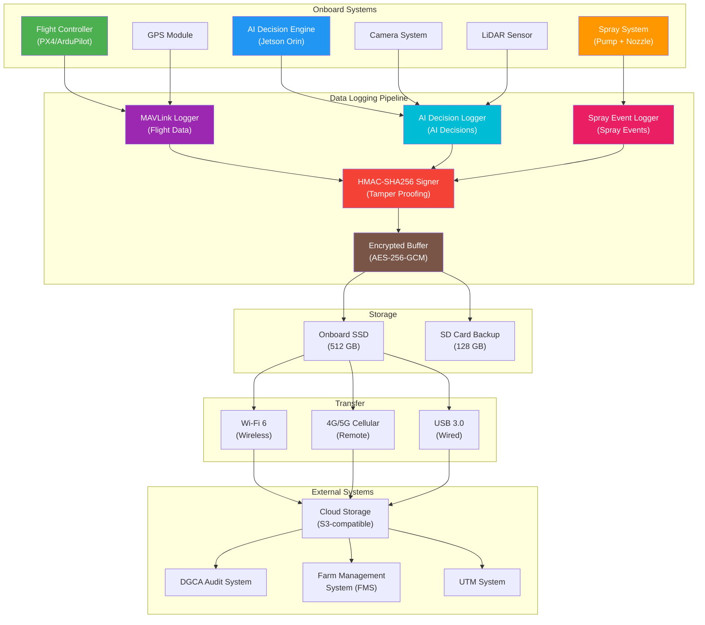
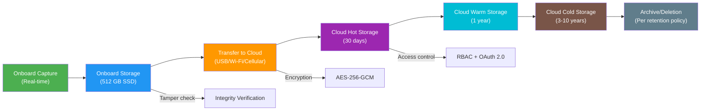
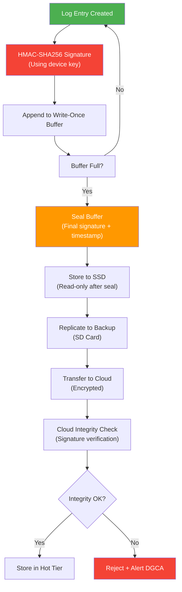

# 16. Data Logging Schema and Interoperability

## Table of Contents
1. [Executive Summary](#1-executive-summary)
2. [Data Logging Architecture](#2-data-logging-architecture)
3. [MAVLink Flight Log Schema](#3-mavlink-flight-log-schema)
4. [AI Decision Log JSON Schema](#4-ai-decision-log-json-schema)
5. [Spray Event Log JSON Schema](#5-spray-event-log-json-schema)
6. [Interoperability Requirements](#6-interoperability-requirements)
7. [Data Retention Requirements](#7-data-retention-requirements)
8. [Privacy and Security Considerations](#8-privacy-and-security-considerations)
9. [Implementation Guide](#9-implementation-guide)

---

## 1. Executive Summary

This document defines the data logging architecture, schemas, and interoperability requirements for the TIHAN Edge-AI agricultural drone program. The logging system captures three categories of data: MAVLink flight logs, AI decision logs, and spray event logs. All logs are cryptographically signed, machine-readable (JSON/MessagePack), and designed for interoperability with existing agricultural and aviation data systems.

The architecture supports onboard storage with capacity for ≥500 flight hours, encrypted transfer via USB/Wi-Fi/cellular, and tamper-proof audit trails for regulatory compliance.

---

## 2. Data Logging Architecture



---

## 3. MAVLink Flight Log Schema

### 3.1 MAVLink v2.0 Message Types

| Message ID | Name | Description | Frequency |
|-----------|------|-------------|-----------|
| 0 | HEARTBEAT | System status | 1 Hz |
| 33 | ATTITUDE | Roll, pitch, yaw | 10 Hz |
| 34 | GLOBAL_POSITION_INT | GPS position | 10 Hz |
| 35 | MISSION_CURRENT | Current waypoint | 1 Hz |
| 74 | VFR_HUD | Airspeed, altitude | 10 Hz |
| 129 | RAW_IMU | Raw sensor data | 20 Hz |
| 136 | GPS_RAW_INT | GPS fix data | 5 Hz |
| 253 | STATUSTEXT | Status messages | Event-driven |

### 3.2 Extended Agricultural Flight Log

```json
{
  "schema_version": "1.0",
  "message_type": "AGRI_FLIGHT_LOG",
  "timestamp": "2026-05-29T10:30:00.000Z",
  "drone_id": "TIHAN-AG-001",
  "mission_id": "MISSION-2026-05-29-001",
  "pilot_id": "PILOT-2024-0156",

  "flight_data": {
    "timestamp_ms": 1716968400000,
    "latitude": 18.5204,
    "longitude": 73.8567,
    "altitude_amsl": 320.5,
    "altitude_agl": 3.2,
    "heading": 90.5,
    "ground_speed": 3.2,
    "air_speed": 3.5,
    "roll": 1.2,
    "pitch": -0.3,
    "yaw": 90.5,
    "battery_voltage": 44.8,
    "battery_current": 12.5,
    "battery_remaining": 72,
    "gps_hdop": 1.2,
    "gps_satellites": 14,
    "rc_signal_strength": 95
  },

  "environmental_data": {
    "temperature_c": 32.5,
    "humidity_percent": 65,
    "wind_speed_ms": 2.8,
    "wind_direction_deg": 225,
    "pressure_hpa": 1013.25,
    "visibility_km": 10
  },

  "mission_progress": {
    "current_waypoint": 15,
    "total_waypoints": 50,
    "distance_to_waypoint": 2.5,
    "mission_elapsed_time_s": 300,
    "estimated_time_remaining_s": 450,
    "area_covered_m2": 12500,
    "total_area_m2": 50000
  },

  "safety_status": {
    "ai_confidence": 0.92,
    "fail_safe_active": false,
    "sensor_health": {
      "camera": "OK",
      "lidar": "OK",
      "gps": "OK",
      "imu": "OK",
      "barometer": "OK"
    },
    "obstacle_proximity_m": 15.2,
    "geofence_status": "INSIDE"
  }
}
```

### 3.3 MAVLink Custom Message Definitions

```xml
<!-- MAVLink custom messages for agricultural drone logging -->
<mavlink>
  <messages>
    <message id="12000" name="AGRI_SPRAY_STATUS">
      <field type="uint64_t" name="timestamp">Timestamp (microseconds since epoch)</field>
      <field type="int32_t" name="latitude">Latitude (degE7)</field>
      <field type="int32_t" name="longitude">Longitude (degE7)</field>
      <field type="float" name="flow_rate">Current flow rate (L/min)</field>
      <field type="float" name="pressure">Nozzle pressure (kPa)</field>
      <field type="float" name="droplet_size_um">Droplet size (micrometers)</field>
      <field type="uint8_t" name="nozzle_id">Nozzle identifier</field>
      <field type="uint8_t" name="spray_active">Spray active (0/1)</field>
      <field type="float" name="swath_width_m">Swath width (meters)</field>
      <field type="float" name="coverage_percent">Coverage percentage</field>
    </message>

    <message id="12001" name="AI_DECISION_LOG">
      <field type="uint64_t" name="timestamp">Timestamp (microseconds since epoch)</field>
      <field type="uint8_t" name="decision_type">0=spray, 1=obstacle, 2=reroute, 3=failsafe</field>
      <field type="float" name="confidence">Decision confidence (0-1)</field>
      <field type="float" name="latency_ms">Inference latency (ms)</field>
      <field type="uint32_t" name="model_version_hash">Model version hash (first 32 bits)</field>
      <field type="int32_t" name="input_lat">Input position latitude (degE7)</field>
      <field type="int32_t" name="input_lon">Input position longitude (degE7)</field>
      <field type="int32_t" name="output_lat">Output action latitude (degE7)</field>
      <field type="int32_t" name="output_lon">Output action longitude (degE7)</field>
      <field type="uint8_t[16]" name="hmac_signature">HMAC-SHA256 signature (first 16 bytes)</field>
    </message>

    <message id="12002" name="AI_HEALTH_STATUS">
      <field type="uint64_t" name="timestamp">Timestamp (microseconds since epoch)</field>
      <field type="float" name="cpu_temperature_c">CPU temperature (Celsius)</field>
      <field type="float" name="gpu_utilization_percent">GPU utilization (0-100)</field>
      <field type="float" name="inference_latency_avg_ms">Average inference latency (ms)</field>
      <field type="uint32_t" name="frames_processed">Total frames processed</field>
      <field type="uint32_t" name="frames_dropped">Dropped frames count</field>
      <field type="uint8_t" name="model_status">0=nominal, 1=degraded, 2=fault</field>
      <field type="uint8_t" name="memory_usage_percent">Memory usage (0-100)</field>
    </message>
  </messages>
</mavlink>
```

---

## 4. AI Decision Log JSON Schema

### 4.1 Schema Definition

```json
{
  "$schema": "http://json-schema.org/draft-07/schema#",
  "title": "AI Decision Log",
  "description": "Schema for AI decision logging in Edge-AI agricultural drones",
  "type": "object",
  "required": ["schema_version", "log_id", "timestamp", "drone_id", "mission_id", "decision", "signature"],
  "properties": {
    "schema_version": {
      "type": "string",
      "const": "1.0",
      "description": "Schema version"
    },
    "log_id": {
      "type": "string",
      "format": "uuid",
      "description": "Unique log entry identifier"
    },
    "timestamp": {
      "type": "string",
      "format": "date-time",
      "description": "ISO 8601 timestamp of decision"
    },
    "drone_id": {
      "type": "string",
      "pattern": "^TIHAN-AG-[0-9]{3}$",
      "description": "Drone identifier"
    },
    "mission_id": {
      "type": "string",
      "description": "Mission identifier"
    },
    "decision": {
      "type": "object",
      "required": ["type", "input_data", "output_data", "confidence", "latency_ms", "model_version"],
      "properties": {
        "type": {
          "type": "string",
          "enum": ["spray_control", "obstacle_avoidance", "path_reroute", "failsafe_activation", "crop_classification", "weed_detection"],
          "description": "Decision type"
        },
        "input_data": {
          "type": "object",
          "description": "Input sensor data snapshot",
          "properties": {
            "camera_frame_hash": {
              "type": "string",
              "description": "SHA-256 hash of camera frame"
            },
            "lidar_points_hash": {
              "type": "string",
              "description": "SHA-256 hash of LiDAR point cloud"
            },
            "gps_position": {
              "type": "object",
              "properties": {
                "latitude": { "type": "number" },
                "longitude": { "type": "number" },
                "altitude_m": { "type": "number" },
                "hdop": { "type": "number" }
              }
            },
            "imu_data": {
              "type": "object",
              "properties": {
                "roll": { "type": "number" },
                "pitch": { "type": "number" },
                "yaw": { "type": "number" },
                "accel_x": { "type": "number" },
                "accel_y": { "type": "number" },
                "accel_z": { "type": "number" }
              }
            },
            "environmental": {
              "type": "object",
              "properties": {
                "temperature_c": { "type": "number" },
                "humidity_percent": { "type": "number" },
                "wind_speed_ms": { "type": "number" },
                "wind_direction_deg": { "type": "number" }
              }
            }
          }
        },
        "output_data": {
          "type": "object",
          "description": "Decision output",
          "properties": {
            "action": {
              "type": "string",
              "description": "Action taken or recommended"
            },
            "parameters": {
              "type": "object",
              "description": "Action parameters"
            },
            "bounding_box": {
              "type": "object",
              "properties": {
                "x_min": { "type": "integer" },
                "y_min": { "type": "integer" },
                "x_max": { "type": "integer" },
                "y_max": { "type": "integer" }
              }
            },
            "classification": {
              "type": "string",
              "description": "Classification result"
            },
            "segmentation_mask_hash": {
              "type": "string",
              "description": "SHA-256 hash of segmentation mask"
            }
          }
        },
        "confidence": {
          "type": "number",
          "minimum": 0,
          "maximum": 1,
          "description": "Decision confidence score"
        },
        "latency_ms": {
          "type": "number",
          "minimum": 0,
          "description": "Inference latency in milliseconds"
        },
        "model_version": {
          "type": "object",
          "required": ["model_id", "version", "hash"],
          "properties": {
            "model_id": {
              "type": "string",
              "description": "Model identifier"
            },
            "version": {
              "type": "string",
              "description": "Semantic version (MAJOR.MINOR.PATCH)"
            },
            "hash": {
              "type": "string",
              "description": "SHA-256 hash of model weights"
            }
          }
        },
        "explanation": {
          "type": "object",
          "description": "AI explanation data",
          "properties": {
            "feature_importance": {
              "type": "array",
              "description": "SHAP/LIME feature importance scores",
              "items": {
                "type": "object",
                "properties": {
                  "feature_name": { "type": "string" },
                  "importance_score": { "type": "number" },
                  "direction": { "type": "string", "enum": ["positive", "negative"] }
                }
              }
            },
            "top_factors": {
              "type": "array",
              "description": "Top contributing factors",
              "items": { "type": "string" },
              "maxItems": 3
            },
            "human_readable_explanation": {
              "type": "string",
              "description": "Natural language explanation"
            }
          }
        }
      }
    },
    "context": {
      "type": "object",
      "description": "Operational context",
      "properties": {
        "flight_mode": {
          "type": "string",
          "enum": ["manual", "auto", "loiter", "return_to_home", "failsafe"]
        },
        "battery_percent": { "type": "number" },
        "ground_speed_ms": { "type": "number" },
        "altitude_agl_m": { "type": "number" },
        "spray_active": { "type": "boolean" },
        "payload_weight_kg": { "type": "number" }
      }
    },
    "safety_flags": {
      "type": "object",
      "description": "Safety-related flags",
      "properties": {
        "confidence_below_threshold": { "type": "boolean" },
        "sensor_degraded": { "type": "boolean" },
        "gps_degraded": { "type": "boolean" },
        "fail_safe_triggered": { "type": "boolean" },
        "adversarial_detected": { "type": "boolean" }
      }
    },
    "signature": {
      "type": "object",
      "required": ["algorithm", "hash", "timestamp"],
      "properties": {
        "algorithm": {
          "type": "string",
          "const": "HMAC-SHA256"
        },
        "hash": {
          "type": "string",
          "description": "HMAC signature"
        },
        "timestamp": {
          "type": "string",
          "format": "date-time"
        }
      }
    }
  }
}
```

### 4.2 Example AI Decision Log Entry

```json
{
  "schema_version": "1.0",
  "log_id": "550e8400-e29b-41d4-a716-446655440000",
  "timestamp": "2026-05-29T10:30:05.123Z",
  "drone_id": "TIHAN-AG-001",
  "mission_id": "MISSION-2026-05-29-001",
  "decision": {
    "type": "weed_detection",
    "input_data": {
      "camera_frame_hash": "a1b2c3d4e5f6789012345678901234567890abcdef1234567890abcdef12345678",
      "lidar_points_hash": "b2c3d4e5f6789012345678901234567890abcdef1234567890abcdef1234567890",
      "gps_position": {
        "latitude": 18.5204,
        "longitude": 73.8567,
        "altitude_m": 320.5,
        "hdop": 1.2
      },
      "imu_data": {
        "roll": 1.2,
        "pitch": -0.3,
        "yaw": 90.5,
        "accel_x": 0.1,
        "accel_y": -0.2,
        "accel_z": -9.81
      },
      "environmental": {
        "temperature_c": 32.5,
        "humidity_percent": 65,
        "wind_speed_ms": 2.8,
        "wind_direction_deg": 225
      }
    },
    "output_data": {
      "action": "spray_weed",
      "parameters": {
        "flow_rate_l_min": 1.5,
        "nozzle_id": 1,
        "spray_duration_ms": 500
      },
      "bounding_box": {
        "x_min": 120,
        "y_min": 80,
        "x_max": 250,
        "y_max": 200
      },
      "classification": "Parthenium hysterophorus",
      "segmentation_mask_hash": "c3d4e5f6789012345678901234567890abcdef1234567890abcdef1234567890ab"
    },
    "confidence": 0.94,
    "latency_ms": 28.5,
    "model_version": {
      "model_id": "weed-detection-v2",
      "version": "2.3.1",
      "hash": "d4e5f6789012345678901234567890abcdef1234567890abcdef1234567890abcd"
    },
    "explanation": {
      "feature_importance": [
        { "feature_name": "leaf_shape", "importance_score": 0.35, "direction": "positive" },
        { "feature_name": "flower_color", "importance_score": 0.28, "direction": "positive" },
        { "feature_name": "growth_pattern", "importance_score": 0.22, "direction": "positive" },
        { "feature_name": "stem_texture", "importance_score": 0.15, "direction": "negative" }
      ],
      "top_factors": [
        "White flower cluster matches Parthenium profile",
        "Deeply lobed leaf pattern consistent with species",
        "Growth pattern indicates invasive species stage 2"
      ],
      "human_readable_explanation": "Detected Parthenium hysterophorus weed based on white flower cluster, lobed leaves, and growth pattern. Confidence: 94%. Recommended spray application."
    }
  },
  "context": {
    "flight_mode": "auto",
    "battery_percent": 72,
    "ground_speed_ms": 3.2,
    "altitude_agl_m": 3.2,
    "spray_active": true,
    "payload_weight_kg": 8.5
  },
  "safety_flags": {
    "confidence_below_threshold": false,
    "sensor_degraded": false,
    "gps_degraded": false,
    "fail_safe_triggered": false,
    "adversarial_detected": false
  },
  "signature": {
    "algorithm": "HMAC-SHA256",
    "hash": "e5f678901234567890abcdef1234567890abcdef1234567890abcdef1234567890ab",
    "timestamp": "2026-05-29T10:30:05.130Z"
  }
}
```

---

## 5. Spray Event Log JSON Schema

### 5.1 Schema Definition

```json
{
  "$schema": "http://json-schema.org/draft-07/schema#",
  "title": "Spray Event Log",
  "description": "Schema for spray event logging in Edge-AI agricultural drones",
  "type": "object",
  "required": ["schema_version", "log_id", "timestamp", "drone_id", "mission_id", "spray_event", "signature"],
  "properties": {
    "schema_version": {
      "type": "string",
      "const": "1.0"
    },
    "log_id": {
      "type": "string",
      "format": "uuid"
    },
    "timestamp": {
      "type": "string",
      "format": "date-time"
    },
    "drone_id": {
      "type": "string",
      "pattern": "^TIHAN-AG-[0-9]{3}$"
    },
    "mission_id": {
      "type": "string"
    },
    "spray_event": {
      "type": "object",
      "required": ["event_type", "position", "chemical", "spray_parameters"],
      "properties": {
        "event_type": {
          "type": "string",
          "enum": ["spray_start", "spray_stop", "spray_adjustment", "nozzle_change", "tank_refill"]
        },
        "position": {
          "type": "object",
          "required": ["latitude", "longitude", "altitude_agl"],
          "properties": {
            "latitude": { "type": "number" },
            "longitude": { "type": "number" },
            "altitude_agl": { "type": "number" },
            "heading": { "type": "number" },
            "ground_speed": { "type": "number" }
          }
        },
        "chemical": {
          "type": "object",
          "required": ["name", "concentration"],
          "properties": {
            "name": { "type": "string" },
            "concentration": { "type": "number" },
            "batch_id": { "type": "string" },
            "manufacturer": { "type": "string" },
            "expiry_date": { "type": "string", "format": "date" }
          }
        },
        "spray_parameters": {
          "type": "object",
          "properties": {
            "flow_rate_l_min": { "type": "number" },
            "pressure_kpa": { "type": "number" },
            "nozzle_type": { "type": "string" },
            "nozzle_id": { "type": "integer" },
            "droplet_size_d50_um": { "type": "number" },
            "swath_width_m": { "type": "number" },
            "application_rate_l_ha": { "type": "number" }
          }
        },
        "coverage": {
          "type": "object",
          "properties": {
            "area_sprayed_m2": { "type": "number" },
            "total_area_m2": { "type": "number" },
            "coverage_percent": { "type": "number" },
            "uniformity_percent": { "type": "number" },
            "overlap_percent": { "type": "number" }
          }
        },
        "environmental_conditions": {
          "type": "object",
          "properties": {
            "temperature_c": { "type": "number" },
            "humidity_percent": { "type": "number" },
            "wind_speed_ms": { "type": "number" },
            "wind_direction_deg": { "type": "number" },
            "rain_risk_percent": { "type": "number" }
          }
        },
        "quality_metrics": {
          "type": "object",
          "properties": {
            "droplet_spectrum_span": { "type": "number" },
            "coverage_vcv": { "type": "number" },
            "drift_risk_score": { "type": "number" },
            "target_accuracy_percent": { "type": "number" }
          }
        },
        "ai_assist": {
          "type": "object",
          "properties": {
            "ai_controlled": { "type": "boolean" },
            "ai_confidence": { "type": "number" },
            "ai_adjustments": {
              "type": "array",
              "items": {
                "type": "object",
                "properties": {
                  "parameter": { "type": "string" },
                  "old_value": {},
                  "new_value": {},
                  "reason": { "type": "string" }
                }
              }
            }
          }
        }
      }
    },
    "tank_status": {
      "type": "object",
      "properties": {
        "level_before_l": { "type": "number" },
        "level_after_l": { "type": "number" },
        "consumed_l": { "type": "number" },
        "total_capacity_l": { "type": "number" }
      }
    },
    "signature": {
      "type": "object",
      "required": ["algorithm", "hash", "timestamp"],
      "properties": {
        "algorithm": { "type": "string", "const": "HMAC-SHA256" },
        "hash": { "type": "string" },
        "timestamp": { "type": "string", "format": "date-time" }
      }
    }
  }
}
```

### 5.2 Example Spray Event Log Entry

```json
{
  "schema_version": "1.0",
  "log_id": "660e8400-e29b-41d4-a716-446655440001",
  "timestamp": "2026-05-29T10:30:10.456Z",
  "drone_id": "TIHAN-AG-001",
  "mission_id": "MISSION-2026-05-29-001",
  "spray_event": {
    "event_type": "spray_start",
    "position": {
      "latitude": 18.5204,
      "longitude": 73.8567,
      "altitude_agl": 3.2,
      "heading": 90.5,
      "ground_speed": 3.2
    },
    "chemical": {
      "name": "2,4-D Amine Salt",
      "concentration": 0.5,
      "batch_id": "BATCH-2026-05-01",
      "manufacturer": "UPL Limited",
      "expiry_date": "2027-05-01"
    },
    "spray_parameters": {
      "flow_rate_l_min": 1.5,
      "pressure_kpa": 250,
      "nozzle_type": "flat_fan",
      "nozzle_id": 1,
      "droplet_size_d50_um": 280,
      "swath_width_m": 4.0,
      "application_rate_l_ha": 75
    },
    "coverage": {
      "area_sprayed_m2": 12500,
      "total_area_m2": 50000,
      "coverage_percent": 25,
      "uniformity_percent": 88,
      "overlap_percent": 8
    },
    "environmental_conditions": {
      "temperature_c": 32.5,
      "humidity_percent": 65,
      "wind_speed_ms": 2.8,
      "wind_direction_deg": 225,
      "rain_risk_percent": 5
    },
    "quality_metrics": {
      "droplet_spectrum_span": 0.65,
      "coverage_vcv": 0.12,
      "drift_risk_score": 0.15,
      "target_accuracy_percent": 92
    },
    "ai_assist": {
      "ai_controlled": true,
      "ai_confidence": 0.94,
      "ai_adjustments": [
        {
          "parameter": "flow_rate_l_min",
          "old_value": 1.2,
          "new_value": 1.5,
          "reason": "Wind speed increased, compensating for drift"
        }
      ]
    }
  },
  "tank_status": {
    "level_before_l": 8.5,
    "level_after_l": 7.9,
    "consumed_l": 0.6,
    "total_capacity_l": 10.0
  },
  "signature": {
    "algorithm": "HMAC-SHA256",
    "hash": "f678901234567890abcdef1234567890abcdef1234567890abcdef1234567890abcd",
    "timestamp": "2026-05-29T10:30:10.462Z"
  }
}
```

---

## 6. Interoperability Requirements

### 6.1 Data Format Standards

| System | Format | Encoding | Compression |
|--------|--------|----------|-------------|
| MAVLink | MessagePack | Binary | None |
| AI Decision Log | JSON | UTF-8 | gzip |
| Spray Event Log | JSON | UTF-8 | gzip |
| Cloud Transfer | Parquet | Binary | Snappy |
| DGCA Audit | XML/JSON | UTF-8 | None |

### 6.2 API Requirements

| API | Protocol | Authentication | Rate Limit |
|-----|----------|---------------|------------|
| Flight Log Upload | REST/HTTPS | OAuth 2.0 + API Key | 100 req/min |
| AI Decision Query | REST/HTTPS | OAuth 2.0 | 50 req/min |
| Spray Event Query | REST/HTTPS | OAuth 2.0 | 50 req/min |
| Real-time Stream | WebSocket/WSS | OAuth 2.0 Token | Continuous |
| DGCA Audit Push | REST/HTTPS | mTLS + API Key | 10 req/min |

### 6.3 Interoperability with Farm Management Systems

| FMS Platform | Integration Method | Data Mapping |
|-------------|-------------------|--------------|
| FarmLogs | REST API | Spray events → Field activity |
| Trimble Ag | FMIS connector | Flight data → Equipment logs |
| CNH Industrial | ISOBUS/UTC | Spray data → Application records |
| Generic FMS | CSV/JSON export | Full log export |

### 6.4 Interoperability with UTM Systems

| UTM System | Integration | Data Shared |
|-----------|-------------|-------------|
| Digital Sky (India) | REST API | Flight telemetry, position |
| U-space (EU) | S-1/S-2 interfaces | Flight plan, telemetry |
| UTM (USA) | ASTM F3411 | RID, telemetry |
| Custom UTM | MAVLink relay | Full telemetry |

---

## 7. Data Retention Requirements

### 7.1 Retention Periods

| Data Type | Minimum Retention | Recommended | Storage Location |
|-----------|-------------------|-------------|-----------------|
| Flight logs | 3 years | 5 years | Onboard + Cloud |
| AI decision logs | 3 years | 7 years | Onboard + Cloud |
| Spray event logs | 5 years | 10 years | Onboard + Cloud |
| Calibration data | 3 years | 5 years | Onboard + Cloud |
| Model versions | Lifetime | Permanent | Cloud (versioned) |
| Training datasets | 5 years | 10 years | Cloud (archived) |
| Certification records | 10 years | Permanent | DGCA archive |

### 7.2 Storage Requirements

| Location | Capacity | Redundancy | Access |
|----------|----------|------------|--------|
| Onboard SSD | 512 GB | RAID-1 mirror | Real-time read/write |
| SD Card backup | 128 GB | Mirror of critical logs | Write-once, read-many |
| Cloud (hot) | 10 TB | 3x replication | API access, <1s latency |
| Cloud (warm) | 100 TB | 2x replication | API access, <5s latency |
| Cloud (cold/archive) | 1 PB | 3x geographic | Batch access, <1hr latency |

### 7.3 Data Lifecycle



---

## 8. Privacy and Security Considerations

### 8.1 Data Classification

| Data Type | Classification | Sensitivity | Access Level |
|-----------|---------------|-------------|--------------|
| Flight position data | Operational | Medium | Operator + DGCA |
| AI decision logs | Confidential | High | QA + DGCA |
| Chemical application data | Restricted | High | Operator + DGCA + Environmental |
| Camera imagery | Confidential | High | QA only (anonymized) |
| Pilot identification | Personal (PII) | Critical | HR + DGCA |
| Crop health data | Commercial | Medium | Farmer + Operator |
| Adversarial attack logs | Security | Critical | Security team + DGCA |

### 8.2 Privacy Requirements

1. **Camera Imagery Anonymization:** All human faces and identifying features must be redacted before storage
2. **Data Minimization:** Only necessary data is logged (no full video streams unless mission-critical)
3. **Right to Access:** Farmers may request access to spray data for their fields
4. **Right to Erasure:** Personal data (pilot ID) may be pseudonymized after retention period
5. **Cross-border Transfer:** Data must remain within India unless explicitly authorized by DGCA
6. **Consent:** Farmers must consent to field data collection before mission start

### 8.3 Security Requirements

| Security Control | Implementation | Standard |
|-----------------|----------------|----------|
| Encryption at rest | AES-256-GCM | NIST SP 800-38D |
| Encryption in transit | TLS 1.3 | RFC 8446 |
| Access control | RBAC + OAuth 2.0 | NIST SP 800-63B |
| Audit logging | All access logged | ISO 27001 |
| Tamper detection | HMAC-SHA256 signatures | FIPS 180-4 |
| Secure boot | TPM 2.0 measured boot | NIST SP 800-193 |
| Key management | HSM-backed key storage | FIPS 140-2 Level 3 |
| Vulnerability management | CVE monitoring, patching | NIST SP 800-40 |

### 8.4 Tamper-Proofing Mechanism



### 8.5 Compliance Requirements

| Regulation | Jurisdiction | Applicability | Status |
|-----------|-------------|---------------|--------|
| DPDP Act 2023 | India | Personal data of pilots, farmers | Compliant |
| IT Act 2000 | India | Electronic records, digital signatures | Compliant |
| CAR Section 3 | India | UAS operational data | Compliant |
| GDPR | EU | If operating in EU | Not applicable (India only) |
| CCPA | California | If operating in USA | Not applicable (India only) |

---

## 9. Implementation Guide

### 9.1 Hardware Requirements

| Component | Specification | Purpose |
|-----------|--------------|---------|
| Onboard SSD | 512 GB NVMe, industrial grade | Primary log storage |
| SD Card | 128 GB, industrial grade, write-protected | Backup log storage |
| HSM Module | TPM 2.0 or secure element | Key storage, signing |
| Cellular Modem | 4G/5G with SIM | Remote log transfer |
| Wi-Fi Module | Wi-Fi 6 (802.11ax) | Local log transfer |

### 9.2 Software Stack

| Component | Technology | Purpose |
|-----------|-----------|---------|
| MAVLink Logger | MAVSDK + custom logger | Flight data capture |
| AI Decision Logger | Python/ROS2 node | AI decision capture |
| Spray Event Logger | C++ module | Spray data capture |
| HMAC Signer | OpenSSL/libhydrogen | Tamper-proofing |
| Encryption | libsodium (AES-256-GCM) | Data encryption |
| Transfer Agent | Custom daemon | Cloud synchronization |
| Cloud Backend | AWS S3 + Lambda | Storage and API |

### 9.3 Deployment Checklist

- [ ] Onboard SSD formatted with ext4, encrypted with LUKS
- [ ] SD card write-protected after initial setup
- [ ] TPM 2.0 provisioned with device identity key
- [ ] HMAC keys generated and stored in TPM
- [ ] MAVLink logger configured for custom messages
- [ ] AI decision logger integrated with inference pipeline
- [ ] Spray event logger connected to pump controller
- [ ] Transfer agent configured with cloud endpoints
- [ ] Cloud backend provisioned with IAM roles
- [ ] DGCA audit endpoint configured and tested
- [ ] FMS integration tested with at least one farm system
- [ ] End-to-end encryption verified (TLS 1.3 + AES-256-GCM)
- [ ] Tamper-proofing verified (signature generation + verification)
- [ ] Data retention policies configured in cloud lifecycle rules
- [ ] Privacy controls implemented (anonymization, consent management)

---

## References

1. MAVLink v2.0 Protocol Specification
2. EAADC Standard Section 4: Unified Data Logging Schema
3. NIST SP 800-88: Guidelines for Media Sanitization
4. ISO 27001:2022 — Information Security Management
5. FIPS 140-3: Security Requirements for Cryptographic Modules
6. DPDP Act 2023 — Digital Personal Data Protection Act (India)
7. AWS S3 Lifecycle Policies Documentation
8. ROS2 Logging Framework

---

*Document version: 1.0*
*Last updated: 2026-05-29*
*Author: TIHAN Agricultural Drone Project*
