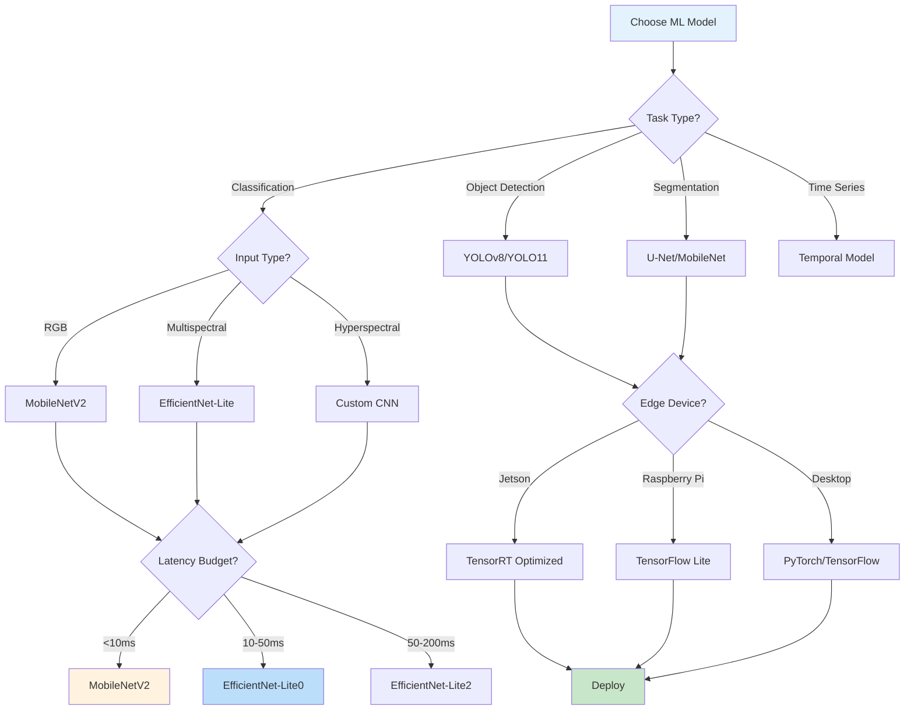
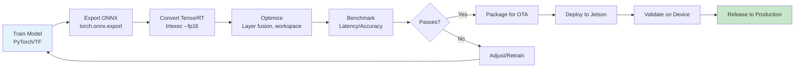
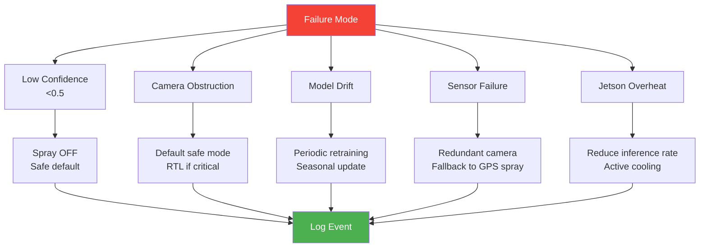

# 21 — ML Model Selection & Deployment Guide

> Comprehensive guide for selecting, training, optimizing, and deploying ML models for agricultural drone AI applications.

---

## 1. Model Selection Framework



---

## 2. Model Performance Benchmarks

### Classification Models

| Model | Top-1 Acc | Latency (Orin Nano) | Size | Power | Source |
|-------|-----------|---------------------|------|-------|--------|
| MobileNetV2 | 72.0% | 8 ms | 3.4 MB | 5W | Google |
| EfficientNet-Lite0 | 75.1% | 12 ms | 5.3 MB | 7W | Google |
| EfficientNet-Lite2 | 79.2% | 25 ms | 6.1 MB | 10W | Google |
| SqueezeNet | 57.0% | 3 ms | 4.8 MB | 3W | Stanford |
| ShuffleNetV2 | 69.0% | 6 ms | 2.3 MB | 4W | Megvii |
| Custom CNN | ~70% | 5 ms | 2.0 MB | 3W | Our target |

### Detection Models

| Model | mAP | Latency (Orin Nano) | Size | Source |
|-------|-----|---------------------|------|--------|
| YOLOv8-Nano | 37.3% | 10 ms | 3.2 MB | Ultralytics |
| YOLOv8n (TensorRT FP16) | 37.3% | 2.6 ms | 3.2 MB | Qengineering |
| YOLO11n | 83.0% | 10 ms | 5.4 MB | Ultralytics |
| YOLO11-edge-base | 81.9% | 6.7 ms | 4.1 MB | Upadhyay 2025 |
| EfficientDetLite1 | ~85% | 91 ms | 5.3 MB | Singh 2024 |

### Segmentation Models

| Model | IoU | Latency | Size | Source |
|-------|-----|---------|------|--------|
| U-Net (custom) | >90% | 50 ms | 50 MB | Academic |
| MobileNetV2 + DeepLab | 75% | 30 ms | 20 MB | Google |
| U-Net + MobileNetV2 | ~85% | 20 ms | 15 MB | Our target |

---

## 3. Literature Benchmarks

| Paper | Model | Task | Accuracy | Speed | Platform |
|-------|-------|------|----------|-------|----------|
| Singh et al. 2024 | EfficientDetLite1 | Crop detection | 3 classes | 91 ms | Raspberry Pi |
| Upadhyay et al. 2025 | YOLO11n | Weed/crop | 83% mAP | 10 ms | Jetson AGX Orin |
| Sensors 2025 | Improved YOLOv8 | Tomato disease | 91% mAP | ~15 ms | Jetson |
| Nature 2025 | YOLOv8 | Plant disease | 91% mAP | ~20 ms | Desktop |
| Edge AI Survey 2025 | MiT-B0 | Crop/weather | 93% | 30 FPS | CPU only |
| Our project | EfficientNet-Lite0 | Crop health | >95% target | <12 ms target | Jetson Orin Nano |

---

## 4. TensorFlow Lite vs TensorRT

| Aspect | TensorFlow Lite | TensorRT |
|--------|----------------|----------|
| Vendor | Google | NVIDIA |
| Platform | ARM CPU, GPU | NVIDIA GPU only |
| Optimization | Post-training quantization | Layer fusion + quantization + kernel auto-tuning |
| FP16 support | Limited | Excellent |
| INT8 support | Yes | Yes (better) |
| Best for | Raspberry Pi, Coral TPU | Jetson Nano/Orin/AGX |
| Ease of use | Easier | More complex |
| Performance | Good | Excellent (2-10x faster on NVIDIA) |
| **Our choice** | | **TensorRT (Jetson native)** |

---

## 5. Edge Deployment Pipeline



### Step-by-Step Deployment

```bash
# 1. Train model (desktop/cloud)
python train.py --epochs 50 --batch 32 --lr 0.001

# 2. Export to ONNX
python export.py --weights best.pth --onnx best.onnx

# 3. Convert to TensorRT FP16
trtexec --onnx=best.onnx --saveEngine=best_fp16.engine --fp16

# 4. Benchmark
trtexec --loadEngine=best_fp16.engine --batch=1 --iterations=1000
# Expected: ~12 ms per inference on Orin Nano

# 5. Deploy
scp best_fp16.engine jetson@192.168.1.100:/home/jetson/models/

# 6. Run
python3 inference.py --model /home/jetson/models/best_fp16.engine
```

---

## 6. NDVI-Based Decision Model

```mermaid
graph TB
    subgraph INPUT["Input"]
        CAM[Multispectral Camera<br/>R/G/B/NIR]
    end

    subgraph PROCESSING["Processing"]
        NDVI[NDVI Calculation<br/>(NIR-Red)/(NIR+Red)]
        PRE[Image Preprocessing<br/>Resize 224×224]
    end

    subgraph MODEL["ML Model"]
        EFF[EfficientNet-Lite0<br/>4-class classifier]
        SOFT[Softmax Output<br/>4 probabilities]
    end

    subgraph DECISION["Decision Logic"]
        CONF{Confidence > 0.5?}
        CLASS{Class?}
        NDVI_TH{NDVI Value?}
    end

    subgraph OUTPUT["Output"]
        ON[Spray ON<br/>PWM duty cycle]
        OFF[Spray OFF<br/>PWM = 0]
        LOG[Decision Log<br/>JSON audit trail]
    end

    CAM --> NDVI
    CAM --> PRE
    PRE --> EFF
    EFF --> SOFT
    SOFT --> CONF
    CONF -->|No| OFF
    CONF -->|Yes| CLASS
    CLASS -->|Soil| OFF
    CLASS -->|Healthy| NDVI_TH
    CLASS -->|Stressed| ON
    CLASS -->|Weed| ON
    NDVI_TH -->|<0.2| OFF
    NDVI_TH -->|0.2-0.5| ON
    NDVI_TH -->|>0.5| ON
    ON --> LOG
    OFF --> LOG
```

### Spray Rate Mapping

| NDVI Range | Class | Spray Rate | PWM Duty |
|------------|-------|------------|----------|
| < 0.1 | Water/Shadow | 0 L/min | 0% |
| 0.1 - 0.2 | Bare soil | 0 L/min | 0% |
| 0.2 - 0.3 | Sparse/stressed | 1.5 L/min | 50% |
| 0.3 - 0.5 | Moderate | 1.0 L/min | 33% |
| 0.5 - 0.7 | Healthy | 0.5 L/min | 17% |
| > 0.7 | Very healthy | 0 L/min | 0% |

---

## 7. Training Data Requirements

| Parameter | Minimum | Recommended | Optimal |
|-----------|---------|-------------|---------|
| Images per class | 1,000 | 5,000 | 10,000+ |
| Total images | 4,000 | 20,000 | 40,000+ |
| Image resolution | 224×224 | 320×320 | 640×640 |
| Annotation type | Classification | Bounding box | Pixel segmentation |
| Augmentation | Flip + rotate | + brightness + noise | + cutout + mixup |
| Train/val/test split | 70/15/15 | 70/15/15 | 80/10/10 |
| Cross-validation | None | 5-fold | 10-fold |

### Data Sources for Indian Crops
| Source | Type | Size | Access |
|--------|------|------|--------|
| PlantVillage | Leaf disease | 54K images | Public |
| CropHealth Dataset | Field imagery | 10K images | Public |
| ICAR datasets | Indian crops | Various | Request |
| Drone flight captures | Multispectral | Custom | Build |
| Synthetic augmentation | Generated | Unlimited | Generate |

---

## 8. Models for Indian Agricultural Crops

| Crop | Best Model | Accuracy | Source | Notes |
|------|-----------|----------|--------|-------|
| Rice | YOLOv8 | 91% mAP | Nature 2025 | Disease detection |
| Wheat | EfficientNet-Lite0 | 88% | Edge AI survey 2025 | Health classification |
| Cotton | U-Net | 85% IoU | Segmentation | Stress mapping |
| Maize | MobileNetV2 | 78% top-1 | Classification | Quick screening |
| Sugarcane | YOLO11n | 83% mAP | Upadhyay 2025 | Weed detection |
| General crop health | EfficientNet-Lite0 | >95% target | Our project | NDVI-based |

---

## 9. Performance Optimization Techniques

| Technique | Speedup | Accuracy Impact | Complexity |
|-----------|---------|-----------------|------------|
| FP16 quantization | 2x | <1% loss | Low |
| INT8 quantization | 4x | ~3% loss | Medium |
| Layer fusion | 1.5x | None | Low |
| Model pruning | 2x | ~2% loss | Medium |
| Knowledge distillation | 3x | ~5% loss | High |
| Input resize (224→192) | 1.3x | ~1% loss | Low |
| Dynamic batch size | 1.5x | None | Low |

---

## 10. Failure Modes & Mitigation



| Failure | Cause | Detection | Mitigation |
|---------|-------|-----------|------------|
| Low confidence | Noisy image | Confidence <0.5 | Spray OFF |
| Camera obstructed | Dirt/moisture | Confidence drop | Safe mode |
| Model drift | Seasonal changes | Accuracy drop | Retrain |
| Sensor failure | Camera disconnect | No data stream | Spray OFF, RTL |
| Overheat | High ambient | Thermal sensor | Reduce rate |

---

## 11. Model Update Strategy

| Aspect | Specification |
|--------|--------------|
| Versioning | v1.0, v1.1, v1.2, v2.0 |
| Update mechanism | OTA via ground station |
| Validation | Test set + field validation |
| Rollback | Keep previous version |
| Regulator notice | Required for major changes |
| Deployment window | Non-flight hours |
| Monitoring | Real-time confidence tracking |

---

*This guide provides the complete ML model selection and deployment framework for the COEP Agricultural Drone project.*
