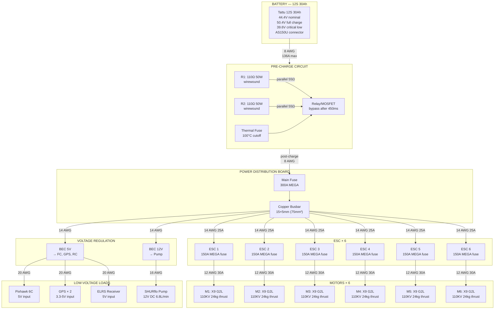
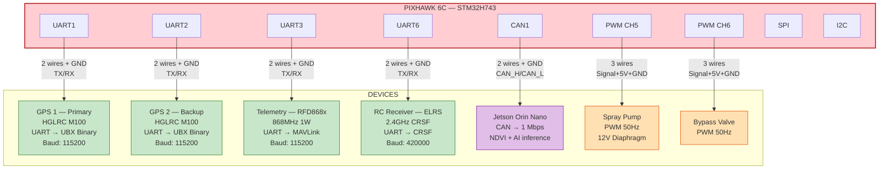
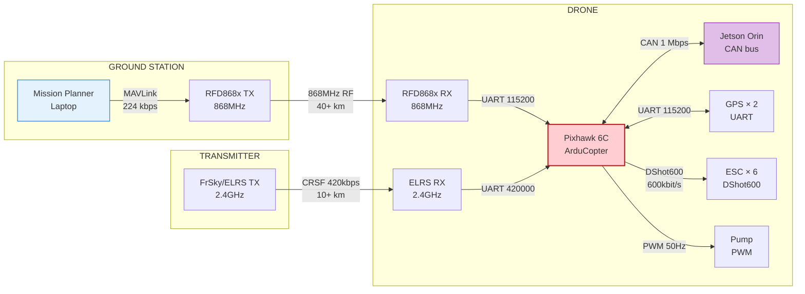
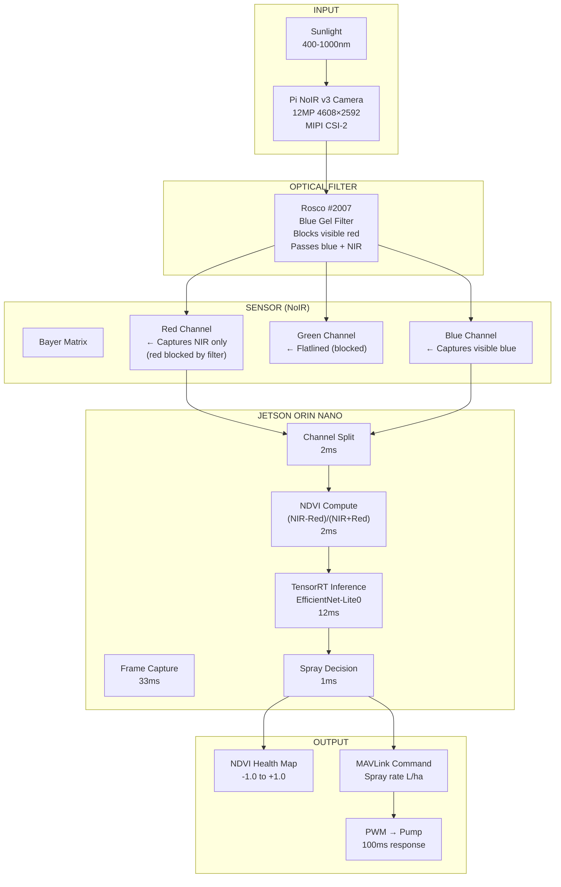
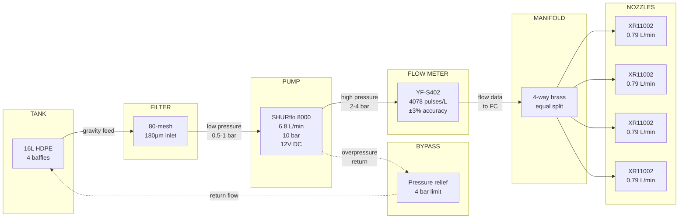
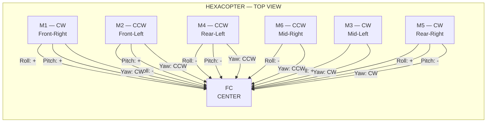
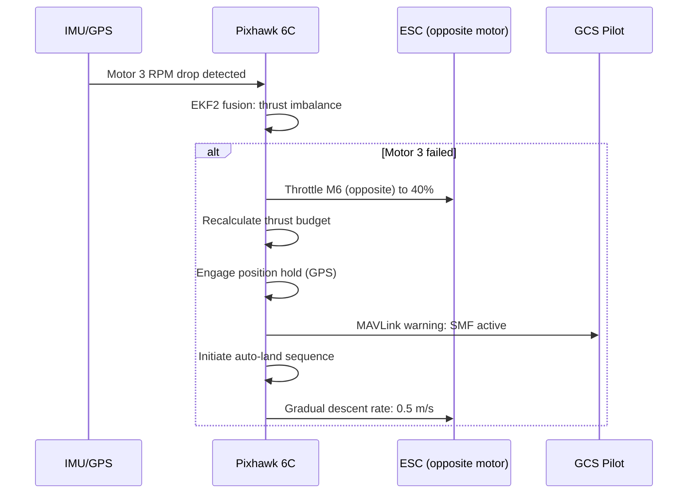

# System Wiring Diagrams — Mermaid (Obsidian Compatible)

> All diagrams render natively in Obsidian. No plugins needed.

---

## 1. Power Distribution — 12S 44.4V System

---

## 2. Signal/Wiring — Pixhawk 6C Port Map

---

## 3. Communication Protocol Map

---

## 4. NDVI Processing Pipeline

---

## 5. Spray Hydraulic Flow

---

## 6. Motor Layout & Control Moments

---

## 7. Single Motor Failure (SMF) Response

