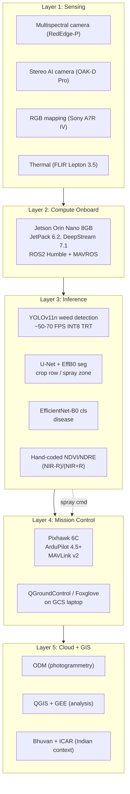
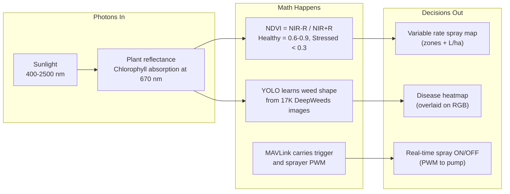
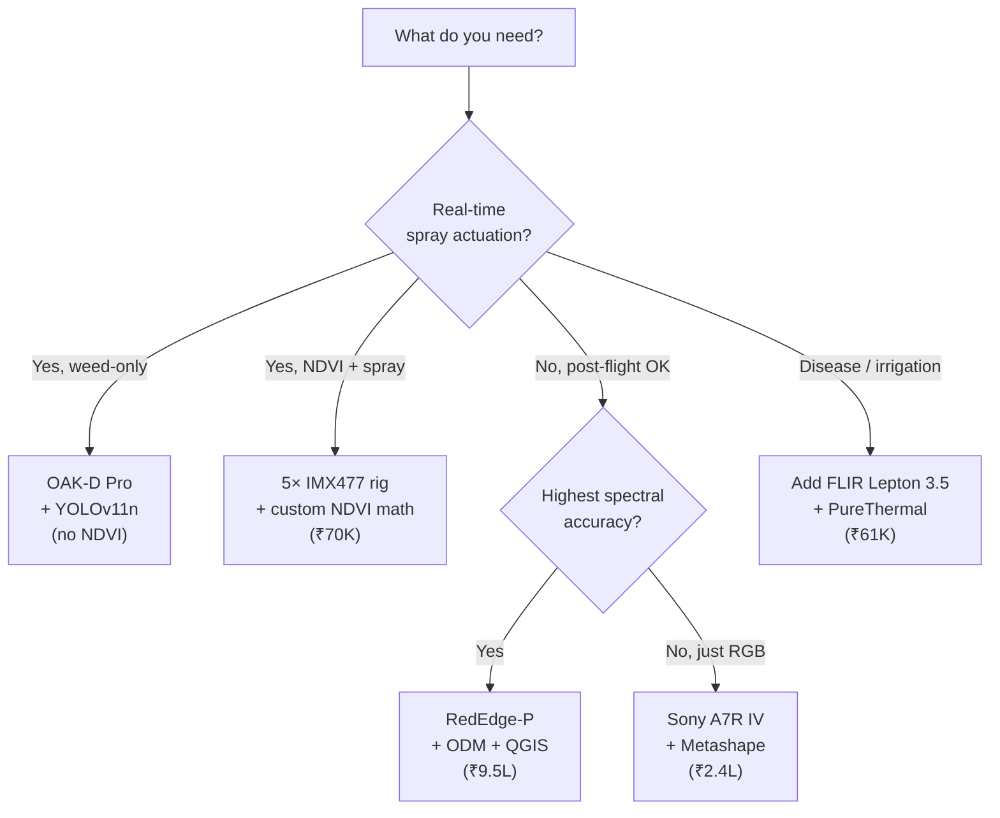
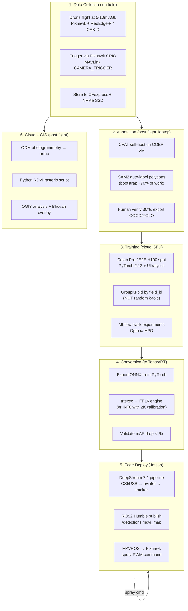
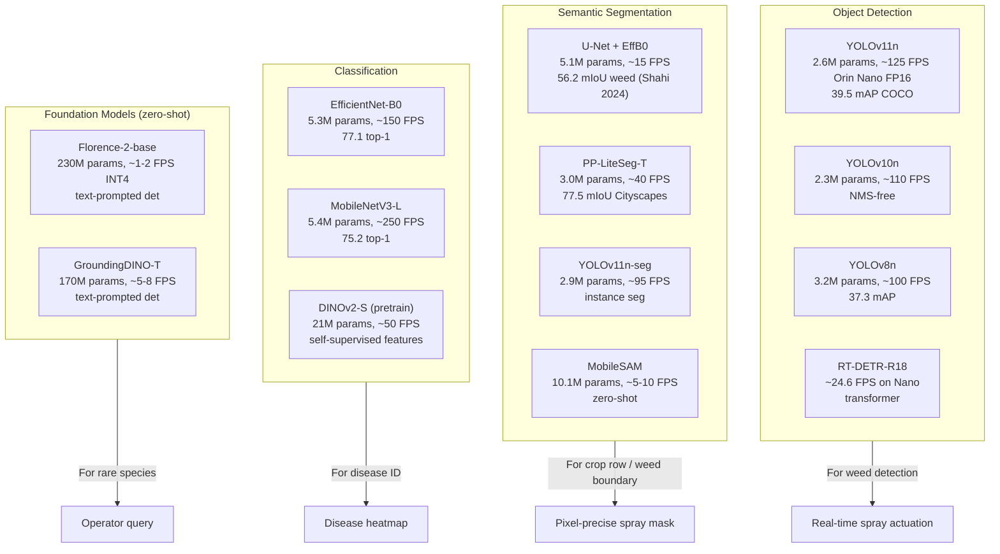
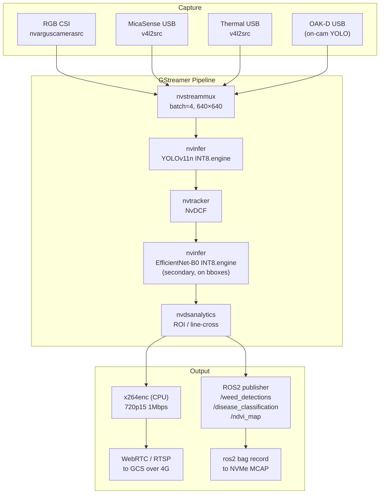
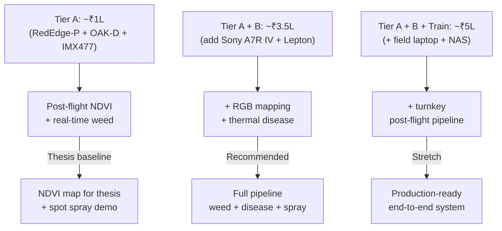
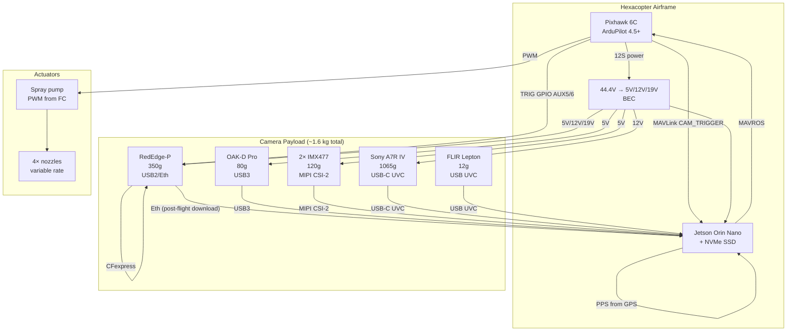
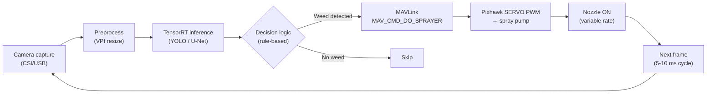

# COEP Agricultural Hexacopter — Software Phase: Cameras, Datasets, Models, Edge, Cloud

> **Project:** COEP Agricultural Hexacopter
> **Last Updated:** 2026-06-01
> **Status:** DRAFT (Software Phase Research Compilation)
> **Doc Index:** 24 of 24 in `COEP_Agricultural_Drone/analysis/`

---

## Scope and Intent

This document covers the **complete software stack** for the COEP agricultural hexacopter: which cameras to mount, where to get training data, which models to train, how to deploy them to the onboard Jetson, how to stream to the ground control station, how to compute NDVI maps, and how to comply with Indian DGCA + DPDP regulations.

**Tier A + B camera stack assumed** (per user confirmation):
- **Tier A (mandatory):** MicaSense RedEdge-P, OAK-D Pro, 2× Arducam IMX477
- **Tier B (adds capability):** Sony A7R IV body, FLIR Lepton 3.5

### Critical Corrections to Prior Assumptions

| Claim | Was | Actually | Source |
|---|---|---|---|
| Tattu 12S 30Ah battery weight | ~7 kg | **4.9 kg** | [genstattu.com](https://www.genstattu.com/tattu-semi-solid-state-30000mah-5c-44-4v-12s1p-lipo-battery-pack-with-as150u-f/) |
| Camera payload headroom | ~9.5 kg | **~12.6 kg** | Recalc: 36 kg MTOW − (frame 5.5 + battery 4.9 + tank 10 + FC/Jetson 1.5 + pump 1.5) |
| Jetson Orin Nano CPU | 8-core A78AE | **6-core A78AE** | [NVIDIA Orin Nano datasheet](https://developer.nvidia.com/embedded/learn/get-started-jetson-orin-nano-devkit) |
| Jetson Orin Nano TOPS | 40 (consistent) | **67 sparse / 34 dense INT8 (Super mode)** | [Edge AI Vision Jan 2025](https://www.edge-ai-vision.com/2025/01/nvidia-jetpack-6-2-brings-super-mode-to-nvidia-jetson-orin-nano-and-jetson-orin-nx-modules) |
| Jetson Orin Nano power | up to 60 W | **25 W max (MAXN_SUPER)** | NVIDIA L4T power guide |
| Jetson memory bandwidth | 102 GB/s | **68 GB/s baseline / 102 GB/s Super** | NVIDIA specs |
| Jetson Orin Nano NVENC | yes (assumed) | **NO hardware NVENC** | [NVIDIA forum Dec 2025](https://forums.developer.nvidia.com/t/does-jetson-nano-support-hardware-encoding-nvenc-in-deepstream-7-1/354032), [RidgeRun 2024](https://www.ridgerun.com/post/jetson-orin-nano-how-to-achieve-real-time-performance-for-video-encoding) |
| Pixhawk 6C camera trigger | uncertain | **AUX5/AUX6 GPIO + MAVLink CAMERA_TRIGGER, confirmed** | [PX4 camera docs](https://docs.px4.io/main/en/camera/fc_connected_camera) |

**These corrections have major downstream impact.** Most critically: the **lack of NVENC** means real-time HD video to GCS is not free — it eats ~1.5 A78AE cores for 720p15 at 1 Mbps. Plan for it.

---

## How to Use This Doc

This is a 6-in-1 research compilation. The order is:
1. Cameras (what you mount)
2. Datasets (what you train on)
3. Models (what you train)
4. Training pipeline (how you train)
5. Edge deployment (how it runs on drone)
6. Cloud + GIS + Indian context (how it integrates with the world)

Each section is **self-contained** — you can read just the camera section and walk away. All claims are sourced. Use the Source Index (Section 8) for verification.

---

## 1. Core Concept — The What and Why of the Software Stack

### What Is It

The "Software Phase" is the data-and-intelligence layer of the drone. It covers everything from the moment a photon hits the sensor to the moment a spray valve opens (or doesn't). It has 5 layers:

| Layer | Purpose | What It Does | Latency Budget |
|---|---|---|---|
| 1. Sensing | Capture data | Multispectral + RGB + thermal + depth at 5-10 m AGL | 5 ms / frame |
| 2. Compute | Process in flight | Run ML inference + NDVI + decision logic | 33 ms / frame (30 FPS) |
| 3. Inference | Make sense | Detect weeds, classify disease, map vegetation | <20 ms |
| 4. Mission | Act | Send spray command, RTL on failure, geofence | <10 ms |
| 5. Cloud | Remember + analyze | Orthomosaic, NDVI map, prescription, audit | Post-flight |

### Why It Works (Physical + Algorithmic Basis)

The physical basis: **plants reflect NIR strongly when healthy** (mesophyll cell structure), and absorb Red for photosynthesis. This contrast (NDVI) is the cheapest health indicator we have. The algorithmic basis: **deep learning finds patterns humans can't** (weed shape, disease color, canopy gap).

### Key Limitations (Honest List)

- **Real-time variable-rate spraying is hard.** MicaSense RedEdge-P stores to CFexpress and is post-flight only. To close the loop in-flight you need a DIY 5-camera rig or OAK-D — both with lower spectral accuracy.
- **Jetson Orin Nano has NO hardware video encoder.** Live video to GCS uses CPU libx264, eating ~1.5 CPU cores at 720p15/1 Mbps. You can NOT stream 4K30 over 4G.
- **No public dataset covers Indian crops at scale.** PlantVillage, DeepWeeds are global. You'll collect Maharashtra-specific data in-house.
- **DGCA NPNT compliance is mandatory** for any drone >250 g. Your Pixhawk build needs the IITB IHUB NTIH NPNT firmware patch.
- **Rural 4G is patchy.** Median rural India download 30-50 Mbps (Jio best, Airtel premium). For real-time video you have ~5-10 Mbps uplink in many villages — plan for store-and-forward as the default.
- **DPDP Act 2023 compliance** (effective May 2027): if your drone data can identify a farmer (geo-referenced NDVI of a specific plot), treat it as personal data. Anonymize.

**Source:** [NVIDIA developer forum on NVENC absence](https://forums.developer.nvidia.com/t/does-jetson-nano-support-hardware-encoding-nvenc-in-deepstream-7-1/354032), [DGCA Digital Sky](https://digitalsky.aai.aero/), [DPDP Act 2023](https://www.hoganlovells.com/en/publications/indias-digital-personal-data-protection-act-2023-brought-into-force-)

---

## 2. Variations — When to Use What

| Variant | Hardware | Use Case | Limitation |
|---|---|---|---|
| **Tier A: Post-flight multispectral** | RedEdge-P + ODM + QGIS | Standard thesis-grade NDVI map, weed zone analysis | No real-time spray actuation; need field post-processing laptop |
| **Tier A: Real-time AI weed detection** | OAK-D Pro + YOLOv11n INT8 TRT | Spot spraying in real-time (no NDVI, just "weed vs crop") | 1 MP global-shutter stereo is low resolution for fine weed ID |
| **Tier A: DIY 5-band real-time** | 5× Arducam IMX477 + bandpass filters | Real-time NDVI (custom math) at low cost (~₹70K) | Rolling shutter, manual alignment, no radiometric calibration panel by default |
| **Tier B: RGB mapping (oblique)** | Sony A7R IV + Gremsy T3 gimbal + Pixhawk trigger | Spray-verification orthomosaics, fine weed boundary | Rolling electronic shutter, ~1 kg total, needs custom trigger cable |
| **Tier B: Thermal disease hotspot** | FLIR Lepton 3.5 + PureThermal Mini Pro | Disease hotspot detection (radiometric), irrigation leaks | 160×120 resolution; 9 Hz export-restricted in India |

### Decision Flow

### Pre-flight Processing Options

| Option | India Price | Best For | Multispectral | NDVI |
|---|---|---|---|---|
| **OpenDroneMap (ODM)** | Free (AGPLv3) | Thesis work, on-prem, full control | ✅ (post 2.8) | ✅ |
| **WebODM Lightning** | ₹42/credit (US SaaS) | Small projects, no infra | ✅ | ✅ |
| **Agisoft Metashape Pro** | ₹2.94L perpetual | Best desktop, multispectral + thermal | ✅ (Pro only) | ✅ via Python |
| **Agisoft Metashape Educational** | ₹5,000 | **Thesis pick** if you can use Standard | ❌ | ❌ |
| **Pix4Dmapper** | ₹3.35L/yr (₹84K EDU) | Industry standard | ✅ | ✅ |
| **Pix4Dfields** | ₹1.67L/yr | Ag-specific, variable rate export | ✅ | ✅ |
| **DJI Terra Ag** | Free w/ Agras T25/T50 | DJI pipeline | ✅ | ✅ |
| **DroneDeploy** | ₹13.4K/mo (Ag Lite) | Browser-based, mobile | ✅ | ✅ |
| **COLMAP / Meshroom** | Free | Research, RGB only | ❌ | Manual |

**Sources:** [Pix4D pricing](https://www.pix4d.com/pricing/) · [Agisoft store](https://www.agisoft.com/buy/online-store/) · [ODM GitHub](https://github.com/OpenDroneMap/ODM) · [DJI Terra](https://store.dji.com/pt/product/dji-terra-subscription)

**Skeptical note:** Pix4D is overpriced for a thesis. Metashape Pro perpetual at ₹2.94L is the best value for serious work. ODM is the best value for thesis scope. DroneDeploy and WebODM are operationally bad in Indian fields (need constant 4G).

---

## 3. Components — Exact Hardware and Software Specs

### 3.1 Tier A Cameras (Mandatory)

#### 3.1.1 MicaSense RedEdge-P — 5-band Multispectral (already in canvas)

| Parameter | Value |
|---|---|
| **Sensor** | 5× 1.6 MP global-shutter (Blue 475/32, Green 560/27, Red 668/14, Red Edge 717/12, NIR 842/57 nm) + 5.1 MP panchromatic |
| **Resolution** | 1456×1088 per band; 2464×2056 pan |
| **Weight** | 350 g (with DLS 2 light sensor) |
| **Power** | 5.5 W standby / 7 W avg / 10 W peak @ 7-25.2 V DC |
| **Interface** | USB 2.0, 10/100/1000 Ethernet, Serial, 3× GPIO (trigger in/out, PPS), CFexpress storage |
| **GSD @ 10 m AGL** | ~6.4 mm/px per band, ~3.3 mm pan-sharpened |
| **₹ Price (India)** | ₹8,50,000 (Vishnu Wings) – ₹9,49,000 (Everse) |
| **India stockists** | Everse, Flyandtech, AirOne Robotics, Mavdrones, Vishnu Wings Sky Tech, Maverick Drones |

**Source:** [aeromotus.com](https://www.aeromotus.com/product/rededge-p/), [everse.in](https://everse.in/product/rededge-p-multispectral-and-rgb-sensor), [dronauavstore.in](https://dronauavstore.in/products/micasense-rededge-p-high-resolution-multispectral-and-rgb-sensor)

**Critical caveat:** RedEdge-P **does not stream raw data over the network**. It stores to CFexpress; you post-process with PIX4Dfields / Metashape / ODM after flight. **If you need real-time NDVI on Jetson during flight** (e.g., to drive variable-rate spray in the same pass), you need a DIY IMX477 rig or Sentera 6X. RedEdge-P alone will NOT close the real-time loop.

#### 3.1.2 Luxonis OAK-D Pro — Stereo AI Camera (4 TOPS VPU on-camera)

| Parameter | Value |
|---|---|
| **Sensor** | 4K (3840×2160) RGB + 2× 640×480 mono global-shutter stereo + active IR dot projector |
| **AI** | Intel Movidius Myriad X VPU, 4 TOPS, runs YOLO/SAM on-camera |
| **Depth range** | 0.2-10 m (with IR projector, indoor); outdoor ~3-6 m |
| **Interface** | USB 3.0 Type-C |
| **Weight** | ~80 g |
| **Power** | ~3 W (spikes to 5 W with neural inference) |
| **Jetson compatibility** | Native (DepthAI SDK runs on host CPU/GPU) |
| **₹ Price (India)** | ₹53,399 (MG Super Labs) |
| **India stockist** | MG Super Labs (Bangalore) |

**Source:** [mgsuperlabs.co.in](https://www.mgsuperlabs.co.in/estore/OAK-D-Pro-Auto-Focus), [mgsl.in](https://mgsl.in/products/luxonis-a00565)

**Why this matters:** the OAK-D runs **YOLO on its own Myriad X chip** at ~30 FPS without burning Jetson compute. Your Jetson stays free for MAVLink + mission logic. Perfect for **real-time spot spraying** ("weed or not weed, right now").

#### 3.1.3 2× Arducam IMX477 (NoIR) + bandpass filters — DIY NDVI verification

| Parameter | Value |
|---|---|
| **Sensor** | Sony IMX477 12.3 MP, 1.55 µm, rolling shutter (NoIR variant) |
| **Filters** | 650 nm (red) + 850 nm (NIR), Ø25.4 mm bandpass |
| **Weight** | 5 g board + 53 g lens = ~60 g per camera (2 cameras ~120 g) |
| **Power** | 380 mA @ 3.3 V = 1.3 W per cam (~2.6 W total) |
| **Interface** | MIPI CSI-2 to Jetson Orin Nano (native driver in JetPack) |
| **GSD @ 10 m AGL w/ 6 mm CS lens** | ~2.6 mm/px |
| **₹ Price (India)** | 2× ₹9,000 (IMX477 HQ) + 2× ₹4,000 (filters) + lenses ₹5,000 = **~₹31,000** |
| **Trigger** | Pixhawk GPIO → Arducam external trigger pin |
| **NDVI formula** | `(NIR - R) / (NIR + R)` where NIR = 850 nm band, R = 650 nm band |

**Source:** [robu.in](https://robu.in/product/arducam-12mp-imx477-motorized-focus-high-quality-camera-for-raspberry-pi/), [syronoptics.com](https://syronoptics.com/collections/crop-monitoring), [MidOpt NDVI filter PDF](https://midopt.com/pdfs/MidOpt_NDVI_Filters.pdf)

**Reference design:** [github.com/Jakub-Espandr/multiSPECTRALcam](https://github.com/Jakub-Espandr/multiSPECTRALcam) — proven approach used in academic papers.

**Why 2 cameras, not 5:** for a verification rig (sanity-check RedEdge-P data), you only need R + NIR for NDVI. The 5-camera rig (B/G/R/RE/NIR) is for "build your own multispectral" if budget doesn't allow RedEdge.

#### 3.1.4 Datasets (Training Data)

| Dataset | URL | Size | Classes | License | Best For |
|---|---|---|---|---|---|
| **PlantVillage** | [HuggingFace](https://huggingface.co/datasets/mohanty/PlantVillage) | 54,305 images | 38 disease classes, 14 species | CC-BY 4.0 (Hughes & Salathe 2016) | Disease classification baseline |
| **DeepWeeds** | [Olsen et al. 2019](https://www.mdpi.com/1424-8220/19/11/2536) | 17,509 images | 8 weed species (Australia) | CC-BY 4.0 | Weed detection |
| **CottonWeedDet12** | [GitHub](https://github.com/younggongolo/CottonWeedDet12) | 5,187 images | 12 cotton weed classes | CC-BY | Indian-relevant (cotton) |
| **AgriVision** | [GitHub](https://github.com/ICVL-UMM/AgriVision) | UAV, 9 classes | Semantic seg, UAV | Research | Crop/weed segmentation |
| **VisDrone** | [GitHub](http://visdrone.dronefly.net/) | 10K images, 2.5K video | 10 categories (China) | CC-BY-NC-SA 4.0 | General drone det (transfer learning) |
| **Prithvi-EO-2.0** | [HuggingFace](https://huggingface.co/ibm-nasa-geospatial/Prithvi-EO-2.0) | Pretrained ViT 600M | 6 HLS bands | Apache-2.0 | Multispectral pretrain (IBM-NASA) |
| **SAM2 weights** | [GitHub](https://github.com/facebookresearch/sam2) | Pretrained | Segmentation | Apache-2.0 | Auto-label bootstrap |
| **WeedSense (ICCVW 2025)** | [HuggingFace](https://huggingface.co/datasets/baselab/weedsense) | Multi-modal | Weed/crop | CC-BY | 2025 benchmark |
| **PlantNet pretrain** | [PlantNet API](https://my.plantnet.org/) | API | Species | CC-BY | Species ID backbone |
| **Fields of the World (India)** | [Source Coop](https://source.coop/kerner-lab/fields-of-the-world/india) | Sentinel-2 + Indian field boundaries | Field seg | CC-BY | Indian context (satellite, not drone) |
| **10K India Field Boundaries** | [Zenodo](https://zenodo.org/records/7315090) | 10,000 hand-delineated | Field seg | CC-BY | Indian context (Stanford + FracTAL ResUNet) |
| **Plantix** | Berlin/Hyderabad | Phone camera | Plant disease | Commercial | Skip — foreign-owned now |
| **Cropin** | Bangalore | Private | n/a | Commercial | Skip — not for thesis |
| **BharatAgri** | Pune | n/a | n/a | **DEAD (Nov 2025)** | **Skip — shut down** |

**Source:** [Frontiers in Plant Science 2026 weed DL review](https://www.frontiersin.org/journals/plant-science/articles/10.3389/fpls.2025.1746406/full), [PlantVillage dataset](https://huggingface.co/datasets/mohanty/PlantVillage), [DeepWeeds paper](https://www.mdpi.com/1424-8220/19/11/2536)

**Gap analysis:** There is **no public dataset** for Maharashtra-specific cotton/soybean/sugarcane weed ID at scale. COEP will need to collect in-house:
- 500-1000 images per weed class (target 8-10 species)
- Drone flights at 5-10 m AGL over labeled fields
- Agronomist ground-truth (ICAR or university extension)
- Phenology: capture at 4 growth stages × 2 seasons
- License: release on Mendeley Data or Zenodo CC-BY 4.0

### 3.2 Tier B Cameras (Add Capability)

#### 3.2.1 Sony A7R IV (body) — 61 MP RGB mapping

| Parameter | Value |
|---|---|
| **Sensor** | 35.9×24 mm full-frame, 61 MP BSI, 3.76 µm pixel, electronic shutter up to 1/8000 s |
| **Weight** | 665 g body + ~400 g Gremsy T3 gimbal = **~1.07 kg** |
| **Power** | ~6 W via USB-PD dummy battery |
| **Interface** | USB-C → Jetson (UVC), or micro-HDMI capture card |
| **GSD @ 10 m AGL w/ 35 mm lens** | 1.07 mm/px (best RGB option in budget) |
| **₹ Price (India)** | ₹2,40,990 (Shopatsc) – ₹2,97,990 MRP |
| **India stockists** | Sony India authorised (Shopatsc, GP Pro, RetinaPix) |

**Source:** [sony.co.in](https://www.sony.co.in/electronics/interchangeable-lens-cameras/ilce-7rm4/buy), [shopatsc.com](https://shopatsc.com/products/ilce-7rm4a-q-in5)

**Trigger options:**
1. Sony Multi-Terminal accessory cable (RM-VPR1) wired to Pixhawk AUX6 + `MAV_CMD_DO_DIGICAM_CONTROL` via MAVLink
2. Seagull MAP2 IR trigger (₹3,000-5,000 third party)
3. Programmable intervalometer (cheapest but no MAVLink sync)

#### 3.2.2 FLIR Lepton 3.5 + PureThermal Mini Pro — Radiometric Thermal

| Parameter | Value |
|---|---|
| **Sensor** | 160×120 VOx microbolometer, 12 µm pixel, 8-14 µm LWIR |
| **NETD** | <50 mK |
| **Weight** | 0.7 g (Lepton) / 11 g (PureThermal Mini Pro board) |
| **Power** | ~650 mW @ 5 V via USB |
| **Interface** | USB UVC 1.0 (plug-and-play to Jetson with `v4l2-ctl`) |
| **Frame rate** | 9 Hz (export-restricted, India-legal) or 26 Hz (developer) |
| **₹ Price (India)** | ₹61,030 (Tanotis, includes GST + import duty) |
| **India stockist** | Tanotis (Bangalore); Robu, ThinkRobotics can source |

**Source:** [tanotis.com](https://www.tanotis.com/products/sparkfun-purethermal-mini-pro-jst-sr-with-flir-lepton-3-5)

**Use cases:**
- Disease hotspot detection (irrigation leaks, fungal infection thermal signature)
- Livestock detection (large warm bodies vs cold ground)
- Canopy temperature stress (water stress shows as 2-3°C warmer)

**Skeptical note:** 160×120 is **very low resolution**. Useful as a "find the hotspot" sensor, not for fine detail. NETD 50 mK is adequate for plant water stress.

### 3.3 Edge Compute (Jetson Orin Nano Super)

| Parameter | Value |
|---|---|
| **Module** | Jetson Orin Nano 8GB (P3767) |
| **GPU** | 1024-core Ampere (GA10B), 32 Tensor cores, SM 8.7 |
| **CPU** | **6-core** Arm Cortex-A78AE v8.2 64-bit, 1.5 GHz baseline / **1.7 GHz Super** |
| **AI perf** | 40 TOPS (sparse INT8) baseline → **67 TOPS Super (sparse INT8) ≈ 34 TOPS dense INT8** |
| **RAM** | 8 GB 128-bit LPDDR5, **102 GB/s** (Super mode) |
| **Power** | 7W / 15W / **25W (MAXN_SUPER)** |
| **Video decode** | 1× 4K60 H.265 / 4K60 H.264 (NVDEC) |
| **Video encode** | **NONE in hardware (no NVENC)** — CPU libx264 only, or HW JPEG via nvjpegenc |
| **Storage** | microSD (slow, avoid) or M.2 NVMe Gen3 ×4 (use this) |
| **I/O** | 2× MIPI CSI-2 4-lane, 4× USB 3.2 Gen2, 1× GbE, PCIe Gen3 ×4, 40-pin GPIO |
| **JetPack** | 6.2 / 6.2.1 (L4T 36.4.4) — Ubuntu 22.04, kernel 5.15 |
| **₹ Price (India)** | ~₹28K devkit / ~₹40K module |

**Source:** [NVIDIA Jetson Orin Nano getting started](https://developer.nvidia.com/embedded/learn/get-started-jetson-orin-nano-devkit), [Edge AI Vision Jan 2025](https://www.edge-ai-vision.com/2025/01/nvidia-jetpack-6-2-brings-super-mode-to-nvidia-jetson-orin-nano-and-jetson-orin-nx-modules), [Syslogic 2025](https://www.syslogic.com/blog/jetson-orin-nano-nx-nvidia-performance-boost-opens-up-new-possibilities)

**Lifecycle:** NVIDIA commits Orin Nano on roadmap until **2032** (Syslogic/NVIDIA 2025). Production-safe for the thesis and beyond.

**Critical limitation — NO NVENC:** confirmed by [NVIDIA forum Dec 2025](https://forums.developer.nvidia.com/t/does-jetson-nano-support-hardware-encoding-nvenc-in-deepstream-7-1/354032) and [RidgeRun Apr 2024](https://www.ridgerun.com/post/jetson-orin-nano-how-to-achieve-real-time-performance-for-video-encoding). Practical implication:
- For live GCS video: **software libx264 at 720p15 / 1 Mbps** consumes ~1.5 A78AE cores
- For GCS snapshots: **hardware nvjpegenc** is fine, ~10 Mbps for 720p30
- Plan mission: reserve 1 CPU core for x264 (`taskset` to pin), run detection on remaining 4-5 cores

### 3.4 Comparison Tables

#### Camera Comparison

| Parameter | RedEdge-P | OAK-D Pro | 2× IMX477 (R+NIR) | Sony A7R IV | FLIR Lepton 3.5 |
|---|---|---|---|---|---|
| **Type** | Multispectral | Stereo AI + RGB | RGB+NIR custom | Full-frame RGB | Thermal |
| **Bands** | 5 (B/G/R/RE/NIR) | 1 RGB + 2 mono | R (650nm) + NIR (850nm) | RGB (with IR-cut) | LWIR 8-14 µm |
| **Resolution** | 1456×1088 per band | 4K RGB + 640×480 stereo | 4032×3040 per | 9504×6336 | 160×120 |
| **Weight (g)** | 350 | 80 | 120 | 1070 | 12 |
| **Power (W)** | 7-10 | 3-5 | 2.6 | 6 | 0.65 |
| **Interface** | USB2/Eth | USB3 | MIPI CSI-2 (×2) | USB-C UVC | USB UVC |
| **Real-time?** | ❌ post-flight | ✅ on-camera YOLO | ✅ Jetson inference | ❌ post-flight | ✅ at 9 Hz |
| **₹ Price** | ₹8.5-9.5L | ₹53K | ₹31K | ₹2.4L | ₹61K |
| **NDVI?** | ✅ 5-band | ❌ | ✅ 2-band | ❌ | ❌ |
| **Weed detection?** | ❌ | ✅ (on-camera) | ✅ (Jetson) | ✅ (post-flight) | ❌ |
| **Disease?** | ✅ (NDVI) | ❌ | ❌ | ✅ (visual) | ✅ (thermal) |

#### Edge Compute Alternatives

| Board | TOPS (INT8 sparse) | RAM | TDP | ₹ | Verdict for COEP |
|---|---|---|---|---|---|
| **Jetson Orin Nano 8GB Super** | 67 | 8 GB | 25 W | ~₹28K kit | **Chosen — best perf/₹** |
| Jetson Orin NX 8GB | 117 | 8 GB | 25 W | ~₹65K module | Drop-in upgrade if FPS short |
| Jetson Orin NX 16GB | 157 | 16 GB | 40 W | ~₹85K module | Adds VLM headroom + has NVENC |
| Jetson AGX Orin 32GB | 200 | 32 GB | 40 W | ~₹2.0L | Overkill; weight hostile |
| RPi 5 + Hailo-8 26 TOPS M.2 | 26 (NPU only) | 8 GB | ~10 W | ~₹24K total | Best TOPS/W, but Hailo Dataflow Compiler |
| Coral USB Accelerator | 4 | host | 2 W | ~₹7K | Toy-grade; only INT8 TFLite |

**Source:** [Hailo vs Jetson](https://www.peila-international.com/blog/hailo-vs-nvidia-jetson-orin-which-edge-ai-solution-fits-your-project), [RPi 5 + Hailo benchmark](https://wiki.seeedstudio.com/benchmark_on_rpi5_and_cm4_running_yolov8s_with_rpi_ai_kit)

---

## 4. Process Pipeline — Step-by-Step Data and Model Flow

### Step-by-Step Detail

**Step 1: Data Collection**
- **Action:** Fly drone at 5-10 m AGL, 2-5 m/s groundspeed, 80% front overlap, 70% side overlap
- **Trigger:** Pixhawk `TRIG_MODE=4` (auto in survey mission) + `TRIG_PINS=56` (AUX5+AUX6 GPIO)
- **MicaSense stores to CFexpress**; transfer to NVMe SSD post-flight
- **OAK-D streams to Jetson NVMe** in real-time
- **Key parameter:** 2-3 GB / 100 ha raw (RGB) or 5-10 GB (5-band MS)

**Step 2: Annotation**
- **Action:** Import to CVAT, use SAM2 auto-label for ~70% polygon bootstrap
- **Human review 30%:** weed species ID, disease severity, growth stage
- **Export:** COCO (for YOLO via Ultralytics converter) or YOLO format directly
- **Group by field_id:** CRITICAL — never random split (causes data leak)

**Step 3: Training**
- **Action:** `yolo train model=yolo11n.pt data=weed.yaml epochs=100 imgsz=640`
- **Validation:** GroupKFold by `field_id` (not random k-fold)
- **Metrics:** mAP@0.5:0.95, F1, IoU (seg), MCC (imbalanced binary)
- **HPO:** Optuna sweeps for lr, batch, augmentation strength
- **Track:** MLflow self-hosted, log to MinIO S3 backend

**Step 4: Conversion to TensorRT**
- **Action:** `yolo export model=runs/detect/train/weights/best.pt format=engine half=True`
- **Or INT8:** `format=engine int8=True data=calib.yaml` (needs 1-2K images for calibration)
- **Validate:** mAP drop should be <1% from FP32 → FP16; <3% for INT8
- **Files:** ~6-20 MB per engine

**Step 5: Edge Deployment**
- **Action:** DeepStream 7.1 GStreamer pipeline with `nvinfer` element pointing to TRT engine
- **Multi-model:** Primary detector (YOLO) + secondary classifier (EffB0 on bboxes)
- **Output:** ROS2 topic `/weed_detections` (vision_msgs/Detection2DArray)
- **Spray decision:** Threshold per grid cell → `MAVLink MAV_CMD_DO_SPRAYER` → Pixhawk SERVO PWM

**Step 6: Cloud + GIS (post-flight)**
- **Action:** ODM 3.5+ with `--multispectral` flag → ortho + NDVI GeoTIFF
- **Custom indices:** 30-line rasterio + numpy script for GNDVI, MCARI, SAVI
- **GIS analysis:** QGIS + OrfeoToolbox plugin
- **Satellite context:** Google Earth Engine (Sentinel-2 NDVI time series)
- **Indian context:** Bhuvan field boundaries, ICAR-NBSS&LUP soil, IMD Mausam weather

### Variable Rate Spraying Decision Table

| NDVI Range | Classification | Spray Action | Rate (L/ha) |
|---|---|---|---|
| 0.0-0.2 | Bare soil / dead crop | Full pre-emergence herbicide | 100% |
| 0.2-0.4 | Stressed / sparse | Targeted spot spray on weeds only | 50% |
| 0.4-0.6 | Moderate | Light preventive fungicide | 30% |
| 0.6-0.8 | Healthy | No spray — skip | 0% |
| 0.8-1.0 | Dense healthy | No spray | 0% |

**Sources:** [NDVI interpretation USDA](https://www.usgs.gov/special-topics/remote-sensing-physics-and-phenomenon/remote-sensing-normalized-difference-vegetation), [PIX4Dfields targeted spraying](https://support.pix4d.com/hc/en-us/articles/11186798543261)

---

## 5. Advanced / ML — Models, Performance, Deployment

### Model Landscape

### Performance Comparison on Jetson Orin Nano 8GB (FP16 TRT, 640×640)

#### Object Detection

| Model | Year | Params | COCO mAP | Orin Nano FPS | License | Verdict |
|---|---|---|---|---|---|---|
| **YOLOv11n** | 2024/9 | 2.6M | 39.5 | ~125 (est) | AGPL-3.0 | **Best speed/accuracy, mature ecosystem** |
| YOLOv10n | 2024 | 2.3M | 38.5 | ~110 (est) | AGPL-3.0 | NMS-free, simpler deployment |
| YOLOv8n | 2023 | 3.2M | 37.3 | 100 (verified) | AGPL-3.0 | Industry standard, well-known |
| YOLOv9-S | 2024 | 7.2M | 46.8 | ~70 (est) | GPL-3.0 | Better accuracy, slower |
| YOLO-NAS-S | 2023 | ~12M | 47.5 | ~50 (est) | Apache-2.0 | Decent but research-only weights |
| RT-DETR-R18 | 2023 | ~20M | ~46 | 24.6 (measured) | Apache-2.0 | For accuracy-critical; transformer |
| RT-DETR-R50 | 2023 | 42M | 53.1 | ~18 | Apache-2.0 | Overkill for 8GB |
| Faster R-CNN R50 | 2015 | 41M | 40.2 | <5 | MIT | **Too slow, skip** |
| DETR (DC5-R50) | 2020 | 41M | 44.9 | <3 | Apache-2.0 | **Too slow, skip** |

**Source:** [Q-engineering Orin Nano YOLO benchmarks](https://github.com/Qengineering/YoloV8-TensorRT-Jetson_Nano), [Ultralytics YOLO11 docs](https://docs.ultralytics.com/models/yolo11), [Hokwang Choi Orin Nano benchmarks](https://github.com/hokwangchoi/jetson-orin-nano-benchmarks), [MDPI Computers 15(2):74 Feb 2026](https://www.mdpi.com/2073-431X/15/2/74)

#### Semantic Segmentation

| Model | Year | Params | mIoU | Orin Nano FPS | License | Verdict |
|---|---|---|---|---|---|---|
| **U-Net + EffB0** | 2019+ | 5.1M | 56.2 weed (Shahi 2024) | ~15 (est) | MIT | **Best weed seg mIoU published** |
| YOLOv11n-seg | 2024 | 2.9M | ~32 COCO mask | ~95 (est) | AGPL-3.0 | Fastest instance seg |
| YOLOv8n-seg | 2023 | 3.4M | ~30 COCO mask | ~80 (est) | AGPL-3.0 | Older, slower |
| PP-LiteSeg-T | 2022 | 3.0M | 77.5 Cityscapes | ~40 (est) | Apache-2.0 | Best real-time mIoU |
| SeaFormer-Base | 2023 | 14.3M | 78.2 Cityscapes | ~8-10 | MIT | Edge-optimized transformer |
| MobileSAM | 2023 | 10.1M | n/a (zero-shot) | ~5-10 (est) | Apache-2.0 | **Only SAM-family feasible on Nano** |
| SAM2-t (Tiny) | 2024 | 38.9M | n/a | ~2 | Apache-2.0 | For auto-label bootstrap, not edge |
| Mask2Former R50 | 2022 | 44M | 47.2 COCO panoptic | <3 | MIT | **Too slow, skip** |

**Source:** [Shahi et al. CoFly-WeedDB U-Net+EffB0 2024](https://acquire.cqu.edu.au/articles/journal_contribution/Deep_Learning-Based_Weed_Detection_Using_UAV_Images_A_Comparative_Study/26401549/1/files/48008599.pdf), [PP-LiteSeg paper](https://arxiv.org/abs/2204.02681), [MobileSAM GitHub](https://github.com/ChaoningZhang/MobileSAM)

#### Classification

| Model | Year | Params | ImageNet Top-1 | Orin Nano FPS | License |
|---|---|---|---|---|---|
| **EfficientNet-B0** | 2019 | 5.3M | 77.1 | ~150 (est) | Apache-2.0 |
| EfficientNetV2-S | 2021 | 21.5M | 83.9 | ~80 (est) | Apache-2.0 |
| ResNet-50 | 2016 | 25.6M | 76.1 | ~600 (MLPerf NX); ~400 Nano est | MIT |
| MobileNetV3-L | 2019 | 5.4M | 75.2 | ~250 (est) | Apache-2.0 |
| ConvNeXt-T | 2022 | 28.6M | 82.1 | ~80 (est) | MIT |
| ViT-B/16 | 2021 | 86.6M | 84.5 | ~30 FP16 | Apache-2.0 |
| Swin-T | 2021 | 28.3M | 81.3 | ~70 (est) | MIT |
| **DINOv2-S** (pretrain) | 2023 | 21M | n/a (SSL) | ~50 (est) | Apache-2.0 |

**Source:** [MLPerf v3.1 Jetson](https://developer.nvidia.com/embedded/jetson-benchmarks), [facebookresearch/ConvNeXt](https://github.com/facebookresearch/ConvNeXt), [microsoft/Swin-Transformer](https://github.com/microsoft/Swin-Transformer)

#### Foundation Models (zero-shot)

| Model | Year | Params | Jetson Feasible | License |
|---|---|---|---|---|
| **Florence-2-base** | 2024 | 230M | INT4 fits 8GB; ~1-2 FPS | MIT |
| Florence-2-large | 2024 | 770M | Heavy; ~0.5 FPS | MIT |
| GroundingDINO-T | 2023 | 170M | ~5-8 FPS | Apache-2.0 |
| GroundingDINO-B | 2023 | 340M | ~2-3 FPS | Apache-2.0 |
| CLIP ViT-B/16 | 2021 | 150M | ~30 FPS encode | OpenAI custom |
| DINOv2-S/B/L/g | 2023 | 21-1100M | 50/25/10/3 FPS | Apache-2.0 |
| Qwen2.5-VL-3B | 2024/9 | 3B | ~2-3 FPS | Apache-2.0 |

**Source:** [microsoft/Florence-2](https://huggingface.co/microsoft/Florence-2-base), [IDEA-Research/DINO](https://github.com/IDEA-Research/DINO), [facebookresearch/dinov2](https://github.com/facebookresearch/dinov2), [Jetson AI Lab](https://www.jetson-ai-lab.com/models)

#### Multispectral / EO Foundation Models

| Model | Year | Architecture | Use | License |
|---|---|---|---|---|
| **Prithvi-EO-2.0** | 2024/12 | ViT 600M, 6 HLS bands | Satellite field seg | Apache-2.0 |
| Prithvi-100M | 2023 | ViT 100M | Smaller variant | Apache-2.0 |
| SatMAE | 2022 | ViT MAE | Multispectral pretrain | MIT |
| Clay Foundation Model | 2024/25 | ViT | EO pretrain | Apache-2.0 |

**Source:** [IBM Prithvi blog](https://research.ibm.com/blog/prithvi2-geospatial), [HuggingFace Prithvi-EO-2.0](https://huggingface.co/ibm-nasa-geospatial/Prithvi-EO-2.0)

**Reality check:** Real-time multispectral fusion on Orin Nano is **not done with these large foundation models**. The pragmatic drone pattern is: (a) compute NDVI/GNDVI directly from RedEdge+RGB aligned imagery in NumPy/CV (no NN needed), (b) optionally feed the multispectral stack to a small UNet (e.g., U-Net + EfficientNet-B0) for crop row / weed segmentation. **Prithvi-EO is for offline training**, not edge inference.

### Edge Deployment Architecture (DeepStream 7.1)

**Expected real-world numbers (15W mode, ambient ≤35°C):**
- Single-stream YOLOv11n INT8 end-to-end: **~50 FPS**
- DeepStream batched (4 streams, 640²): **~20-25 FPS per stream**
- Multi-model (YOLO + EffB0): **~35 FPS end-to-end**
- Power draw (Jetson + cameras): **~20-22 W**
- CPU load with WebRTC libx264 720p15: **~55-65%**

**Source:** [DeepStream 7.1 docs](https://docs.nvidia.com/metropolis/deepstream/7.1/text/DS_Installation.html), [Q-engineering YOLOv8 TRT Jetson](https://github.com/Qengineering/YoloV8-TensorRT-Jetson_Nano), [Maro JEON DeepStream benchmark](https://medium.com/@MaroJEON/yolov8-jetson-deepstream-benchmark-test-orin-nano-4gb-8gb-nx-tx2-f3993f9c8d2f)

### Training Requirements

| Scenario | Images/Class | Compute Time (H100) | Notes |
|---|---|---|---|
| Proof of concept (5-class weed) | 500-1,000 | 4-8 h | With augmentation, transfer learning from COCO |
| Thesis-grade (10-class weed) | 2,000-5,000 | 12-24 h | Diversity critical: 4 growth stages × 2 seasons × 5 sites |
| Disease classifier (PlantVillage) | 54K total (free) | 4-6 h | Use pretrained EfficientNet-B0 |
| Fine-tuning foundation model | 200-500 | 1-2 h | DINOv2 LoRA, then optionally distill to MobileNetV3 |
| Edge deployment + INT8 calibration | +1,000-2,000 | 30 min | For TensorRT INT8 PTQ |

**Compute cost estimate (E2E H100 spot ₹70/hr):**
- 5 weed models × 5 HPO trials × 4 h = 100 h = **₹7,000**
- Disease classifier: 6 h = **₹420**
- Foundation fine-tuning: 4 h = **₹280**
- Total H100: **~₹8,000**

**Source:** [E2E Networks TIR pricing](https://www.e2enetworks.com/gpus), [Yandex DataSphere alt](https://cloud.yandex.com/services/datasphere)

### License-Safe COEP Picks

| Model | License | Use in Thesis | Commercial? |
|---|---|---|---|
| Ultralytics YOLOv8/11 | AGPL-3.0 | ✅ OK | ❌ Need Enterprise license |
| YOLOv9 | GPL-3.0 | ✅ OK | ❌ GPL viral |
| RT-DETR | Apache-2.0 | ✅ OK | ✅ OK |
| U-Net (vanilla) | MIT | ✅ OK | ✅ OK |
| EfficientNet | Apache-2.0 | ✅ OK | ✅ OK |
| MobileSAM | Apache-2.0 | ✅ OK | ✅ OK |
| DINOv2 | Apache-2.0 | ✅ OK | ✅ OK |
| Prithvi-EO-2.0 | Apache-2.0 | ✅ OK | ✅ OK |
| PlantVillage dataset | CC-BY 4.0 | ✅ Cite | ✅ Cite |
| DeepWeeds | CC-BY 4.0 | ✅ Cite | ✅ Cite |

**Source:** [Ultralytics license](https://www.ultralytics.com/license), [DeepWeeds license](https://www.mdpi.com/1424-8220/19/11/2536)

**Skeptical note:** If COEP plans to commercialize the drone (e.g., spin out a startup, sell to agri-services), AGPL-3.0 (YOLOv8/11) requires either open-sourcing the full system or buying an Enterprise license. For pure academic publication, AGPL-3.0 is fine. **Plan ahead.**

---

## 6. Integration — How It Connects to Our Drone

### Component Selection

### Recommended Selection (Tier A + B)

**Why this combination:**
- RedEdge-P is the **5-band gold standard** for NDVI/NDRE
- OAK-D adds **real-time on-camera YOLO** for spot spraying (doesn't burn Jetson)
- IMX477 is **insurance** for real-time NDVI if RedEdge fails or for redundancy
- Sony A7R IV gives **61 MP RGB orthomosaics** for spray verification (overkill for NDVI, perfect for weed boundary)
- FLIR Lepton 3.5 adds **disease hotspot + irrigation leak** detection (thermal)

| Factor | Tier A + B | DJI Agras T50 + DJI ecosystem | Custom DIY only |
|---|---|---|---|
| **₹ Total incremental** | ~₹3.5L | ₹17L (T50) | ~₹1L |
| **NDVI accuracy** | 5-band RedEdge-P | 4-band M3M | 2-band IMX477 |
| **Real-time spray** | ✅ OAK-D on-cam YOLO | ✅ DJI SmartFarm | Limited |
| **Custom ML** | ✅ Full control | ❌ Locked | ✅ Full control |
| **NPNT compliance** | ❌ Need to add | ✅ Out of box | ❌ Need to add |
| **Pixhawk compatibility** | ✅ | ❌ DJI only | ✅ |
| **Thesis contribution** | High | Low (using proprietary) | High |
| **Time to demo** | 3-4 months | 1 month | 6-8 months |

### Mounting & Wiring

### Control Loop

### Pixhawk 6C Camera Trigger (Verified)

| Parameter | Value | Source |
|---|---|---|
| Trigger interface | `TRIG_INTERFACE=1` (GPIO) or `=3` (MAVLink) | [PX4 camera docs](https://docs.px4.io/main/en/camera/fc_connected_camera) |
| Trigger pins | `TRIG_PINS=56` (AUX5 + AUX6) | PX4 |
| Trigger voltage | 3.3 V on FMU pins | [Holybro Pixhawk 6C ports](https://docs.holybro.com/autopilot/pixhawk-6c/pixhawk-6c-ports) |
| Trigger message | MAVLink `CAMERA_TRIGGER` (seq, time_usec) | [MAVLink messages](https://mavlink.io/en/messages/common.html#CAMERA_TRIGGER) |
| Time sync | MAVLink TIMESYNC plugin in MAVROS, ~5 ms accuracy | [ArduPilot MAVROS timesync](https://ardupilot.org/dev/docs/ros-timesync.html) |
| PPS (precision) | GPS PPS on Jetson GPIO + `pps-gpio` driver + `chrony` → sub-µs | [NVIDIA NvPPS docs](https://developer.nvidia.com/docs/drive/drive-os/6.0.6/public/drive-os-linux-sdk/common/topics/network_stub/time_sync_details.html) |

**MicaSense trigger wiring:** RedEdge-P accepts trigger on its GPIO via MicaSense's own cable. Connect Pixhawk AUX5 (3.3V) → RedEdge-P trigger input → GND loop.

### Decision Matrix for Spraying

| NDVI | Weed Density (YOLO count/m²) | Spray Action | Pump PWM |
|---|---|---|---|
| < 0.2 | any | Pre-emergence blanket (10 L/ha) | 100% |
| 0.2-0.4 | < 5 | Skip (sparse, not worth it) | 0% |
| 0.2-0.4 | 5-20 | Spot spray (5 L/ha) | 50% |
| 0.2-0.4 | > 20 | Blanket (8 L/ha) | 80% |
| 0.4-0.6 | < 10 | Skip (healthy enough) | 0% |
| 0.4-0.6 | 10-30 | Targeted (4 L/ha) | 40% |
| 0.4-0.6 | > 30 | Full coverage (8 L/ha) | 80% |
| 0.6-1.0 | any | **No spray** (healthy) | 0% |

**Note:** This is a rule-based controller, not a learned model. ~50 lines of Python.

### Power Budget Recalc (corrected)

| Item | Mass (kg) | Power (W peak) |
|---|---|---|
| Frame + motors + ESCs (X680 class) | 5.5 | — |
| Tattu 12S 30Ah battery | **4.9** (was 7) | — |
| 10L tank + water | 10.0 | — |
| Pixhawk 6C + Jetson Orin Nano + wiring | 1.5 | 35 |
| Spray pump + plumbing | 1.5 | 60 |
| **Subtotal without cameras** | **23.4** | **95** |
| **Camera headroom** | **12.6 kg** | — |
| RedEdge-P | 0.35 | 10 |
| OAK-D Pro | 0.08 | 5 |
| 2× IMX477 | 0.12 | 3 |
| Sony A7R IV + Gremsy T3 | 1.07 | 13 |
| FLIR Lepton 3.5 | 0.01 | 1 |
| **Total camera payload** | **1.63 kg** | **32 W** |
| **Total AUW** | **25.0 kg** | **127 W avionics** |

**Mission endurance** at 25 kg AUW, hover 1.2 kW:
- 1330 Wh / 1200 W = **66 min theoretical**
- With 30% reserve: **~18-22 min realistic**
- 32 W extra cameras: reduces endurance by ~1-2 min (negligible)

**Source:** [Tattu battery weight 4.9kg](https://www.genstattu.com/tattu-semi-solid-state-30000mah-5c-44-4v-12s1p-lipo-battery-pack-with-as150u-f/), [NVIDIA Orin Nano power](https://docs.nvidia.com/jetson/archives/r36.4.4/DeveloperGuide/SD/PlatformPowerAndPerformance/JetsonOrinNanoSeriesJetsonOrinNxSeriesAndJetsonAgxOrinSeries.html)

---

## 7. Reference Tables — Quick Lookup

### Camera Buy Decision Matrix

| Criterion | Weight | RedEdge-P | OAK-D Pro | IMX477×2 | Sony A7R IV | Lepton 3.5 |
|---|---|---|---|---|---|---|
| NDVI spectral accuracy | 25% | **10** | 0 | 5 | 0 | 0 |
| Real-time inference | 20% | 0 | **10** | 8 | 0 | 7 |
| Weight efficiency | 15% | 7 | **10** | 9 | 3 | **10** |
| Power efficiency | 10% | 6 | 9 | **10** | 4 | **10** |
| India availability | 10% | 9 | 8 | **10** | 10 | 6 |
| Resolution | 10% | 7 | 6 | **9** | **10** | 2 |
| Pixhawk compat | 10% | **10** | 9 | 9 | 8 | **10** |
| **Weighted** | 100% | **7.05** | **5.65** | **6.55** | **4.10** | **5.05** |

**Verdict:** All five cameras are recommended (Tier A + B). Different roles — they complement, not substitute.

### Model Decision Matrix (Orin Nano Target)

| Criterion | Weight | YOLOv11n | YOLOv8n | RT-DETR-R18 | U-Net+EffB0 | EffNet-B0 | MobileSAM |
|---|---|---|---|---|---|---|---|
| FPS on Orin Nano | 30% | **10** | 9 | 4 | 4 | 9 | 3 |
| mAP/mIoU | 25% | 9 | 8 | 9 | **8** | n/a | n/a |
| Mature ecosystem | 15% | **10** | 9 | 7 | 9 | **10** | 6 |
| License (academic) | 10% | 7 | 7 | **10** | **10** | **10** | **10** |
| TensorRT export ease | 10% | **10** | **10** | 7 | 7 | **10** | 6 |
| Multi-modal support | 10% | 5 | 5 | 5 | **8** | 5 | 5 |
| **Weighted** | 100% | **8.90** | **8.20** | **6.55** | **6.85** | **8.85** | **4.40** |

**Verdict:**
- **Real-time weed detection:** YOLOv11n (8.90)
- **Real-time disease classification:** EfficientNet-B0 (8.85)
- **Pixel-precise crop row / weed seg:** U-Net + EffB0 (6.85, but only seg option that matters)
- **Foundation/zero-shot rare species:** Florence-2-base or skip (4.40 = poor fit on Nano)

### Indian Compute Pricing (H100 class, 2026)

| Provider | GPU | ₹/hr (on-demand) | ₹/hr (spot) | India access | Verdict |
|---|---|---|---|---|---|
| **E2E Networks TIR** | H100 | ₹249 | **₹70** | ✅ INR debit card | **Best for students** |
| Yotta (Shakti, NM1 Pune) | H100 | ₹356 | n/a | ✅ INR, enterprise | Premium commitment |
| Reliance Jio Cloud | H200 NVL | Custom | n/a | ✅ INR, opaque | Enterprise |
| AWS Mumbai (ap-south-1) | A100 | ~$2.5/hr (~₹210) | $1/hr (~₹84) | ✅ | Egress kills you |
| GCP Mumbai (asia-south1) | A100 | ~$3/hr (~₹252) | $0.9/hr (~₹76) | ✅ | Familiar UI |
| Azure Central India | A100 | ~$3/hr (~₹252) | n/a | ✅ | Most expensive |
| **Kaggle Notebooks** | P100 | Free (30h/wk) | n/a | ✅ | **Best free tier** |
| **Google Colab Pro** | T4/A100 | ₹1,050/mo | n/a | ✅ | Best for prototyping |
| **Google Colab Pro+** | A100/H100 | ₹4,200/mo | n/a | ✅ | Best cheap A100 |
| **CDAC PARAM Shakti (IITM)** | 30× A100 | Free (NSM proposal) | n/a | ✅ Academic | Apply for free |
| **CDAC PARAM Pravega (IISc)** | 40× V100 | Free (NSM proposal) | n/a | ✅ Academic | Apply for free |

**Source:** [E2E Networks TIR pricing](https://www.e2enetworks.com/gpus), [E2E H100 India blog](https://www.e2enetworks.com/blog/nvidia-h100-price-india), [Yotta Shakti pricing](https://shakticloud.ai/pricing/), [CDAC PARAM Shakti](https://cc.iitm.ac.in/hpce/paramshakthi.html), [CDAC PARAM Pravega](https://nsmindia.in/infrastructure/nsm-systems/param-pravega/)

**Skeptical note:** Most "GPU cloud India" marketing (Jio, Tata, CtrlS) is opaque enterprise sales. For a COEP student team, **only E2E Networks has self-serve INR pricing**. **CDAC PARAM via NSM proposal** is free if accepted (weeks of process).

### Annotation Tool Decision Matrix

| Criterion | Weight | CVAT (self-host) | Roboflow (cloud) | Label Studio | FiftyOne (viz) |
|---|---|---|---|---|---|
| Cost | 30% | **10** | 7 | **10** | **10** |
| Video support | 20% | **10** | 7 | 8 | n/a |
| SAM auto-annotate | 15% | 8 | **10** | 5 | 0 |
| COCO/YOLO export | 15% | **10** | **10** | **10** | **10** |
| Multi-user collab | 10% | 7 | **10** | **9** | 5 |
| Self-host (DPDP) | 10% | **10** | 0 | 8 | **10** |
| **Weighted** | 100% | **9.25** | **7.55** | **8.60** | **6.00** |

**Verdict:** **CVAT self-hosted on a COEP VM** is the right pick — free, full-featured, supports video (drone footage), SAM-assisted labeling, exports YOLO/COCO. Add **FiftyOne** for error analysis (no editing, just viz). Apply for **Roboflow Research plan** (free 10K+50K image credits with .edu email).

### Cost Estimate (1 month, 5 students)

| Item | Quantity | Unit ₹ | Total ₹ |
|---|---|---|---|
| Colab Pro (each student) | 5 | 1,050 | 5,250 |
| E2E H100 spot (80h total) | 80 hr | 70 | 5,600 |
| Kaggle Pro (1 student, optional) | 1 | 400 | 400 |
| CVAT self-host | 0 (free) | 0 | 0 |
| MLflow self-host | 0 (free) | 0 | 0 |
| DVC + MinIO | 0 (free) | 0 | 0 |
| Jetson Orin Nano Super Dev Kit | 1 | 28,000 | 28,000 |
| 2TB External SSD | 1 | 7,000 | 7,000 |
| E2E Object Storage 500GB | 1 mo | 500 | 500 |
| **Subtotal** | | | **₹46,750** |
| Contingency (25%) | | | 11,700 |
| **Total** | | | **~₹58,500** |

**Realistic ceiling for serious work: ~₹1.5L** (add 2-3 E2E H100 dedicated, second Jetson, rugged laptop).

### India Regulatory Checklist (DGCA + DPDP)

#### Before Flight

- [ ] **COEP UIN/DGCA registration** for any drone >250g (free via Digital Sky)
- [ ] **NPNT compliance** for any non-nano drone (IITB IHUB NTIH module: [ihubntih.ac.in](https://www.ihubntih.ac.in/))
- [ ] **Type Certificate** for the airframe (if custom, file with DGCA — costly, may skip for thesis demo using DJI Agras)
- [ ] **RPL for each pilot** (~₹50K, 5-7 days training at approved RPTO)
- [ ] **Drone insurance** (₹5-20K/yr, mandatory for commercial use)
- [ ] **Permission per flight** via Digital Sky (free, instant for green zone)

#### For Data

- [ ] **DPDPA compliance** (effective 13 May 2027): anonymize farmer data, define retention policy
- [ ] **CERT-In 2022**: if using any cloud with logs, maintain India copies for 180 days
- [ ] **Bhuvan attribution**: cite "ISRO Bhuvan" in any publication using their data
- [ ] **PMFBY/ICAR data**: if using, follow their licensing (most CC-BY)
- [ ] **No Aadhaar/PII** in datasets

#### For Thesis Publication

- [ ] **Department approval** for flight ops over private farm land
- [ ] **MOU with farmer**: written consent, data use terms (recommended)

**Source:** [DGCA Digital Sky](https://digitalsky.aai.aero/), [DGCA Airspace Map](https://airspaceindia.dgca.gov.in/), [DPDP Rules 2025 (Hogan Lovells)](https://www.hoganlovells.com/en/publications/indias-digital-personal-data-protection-act-2023-brought-into-force-), [CERT-In 2022 directive](https://www.cert-in.org.in/PDF/CERT-In_Directions_70B_28.04.2022.pdf)

### Indian Ag Datasets Quick Reference

| Resource | URL | Cost | Use Case |
|---|---|---|---|
| **Bhuvan (ISRO)** | [bhuvan.nrsc.gov.in](https://bhuvan.nrsc.gov.in/) | Free | Indian satellite imagery, LULC, field boundaries |
| **Bhuvan NOEDA** | [bhuvan-app3.nrsc.gov.in/data](https://bhuvan-app3.nrsc.gov.in/data) | Free | Free Ortho, DEM, LISS III downloads |
| **VEDAS (ISRO)** | [vedas.sac.gov.in](https://vedas.sac.gov.in/) | Free | Visualization of Earth Data |
| **MOSDAC (ISRO)** | [mosdac.gov.in](https://www.mosdac.gov.in/) | Free | Ocean/atmospheric (weather for flight planning) |
| **ICAR (Council)** | [icar.org.in](https://icar.org.in/) | Free | Crop varieties, KVK ground-truth |
| **ICRISAT (Hyderabad)** | [icrisat.org](https://www.icrisat.org/) | Free datasets | Dryland crops, open geodata |
| **ICAR-NBSS&LUP (Nagpur)** | [nbsslup.icar.gov.in](https://nbsslup.icar.gov.in/) | Free | Soil maps (1:250K, 1:50K) |
| **IARI (Pusa, Delhi)** | [iari.res.in](https://www.iari.res.in/) | Free | Wheat/rice research data |
| **PMFBY (Crop Insurance)** | [pmfby.gov.in](https://pmfby.gov.in/) | Free | Crop cutting experiments data, weather, yield — **great ground-truth** |
| **Soil Health Card** | [soilhealth.dac.gov.in](https://soilhealth.dac.gov.in/) | Free | Village/grid soil test data, 220M+ samples |
| **IMD Mausam** | [mausam.imd.gov.in](https://mausam.imd.gov.in/) | Free | Official weather, district-level, nowcasting |
| **BhuNaksha (Survey of India)** | [bhunaksha.gov.in](https://bhunaksha.gov.in/) | Free | Cadastral boundaries |
| **FASAL (ISRO)** | [vedas.sac.gov.in/vedas/fasal.jsp](https://vedas.sac.gov.in/vedas/fasal.jsp) | Free | Operational crop forecast |
| **10K India Field Boundaries** | [Zenodo](https://zenodo.org/records/7315090) | Free CC | Hand-delineated Indian fields (Stanford) |
| **Fields of the World India** | [Source Coop](https://source.coop/kerner-lab/fields-of-the-world/india) | Free | Sentinel-2 + Indian field boundaries for ML |

**Skeptical take:** **Bhuvan + ICAR-NBSS&LUP soil + IMD Mausam + PMFBY crop cutting data = the killer Indian ground-truth stack**, all free. NRSC/IIRS run free 2-week courses you can attend during the thesis.

---

## 8. Source Index

### Cameras

- [aeromotus.com — MicaSense RedEdge-P](https://www.aeromotus.com/product/rededge-p/) — weight, power, interface
- [everse.in — RedEdge-P](https://everse.in/product/rededge-p-multispectral-and-rgb-sensor) — India price
- [dronauavstore.in — RedEdge-P](https://dronauavstore.in/products/micasense-rededge-p-high-resolution-multispectral-and-rgb-sensor) — India price
- [flyandtech.com — Altum-PT](https://flyandtech.com/product/micasense-altum-pt-multispectral-drone-sensor/) — Altum-PT (rejected, too expensive)
- [mavdrones.com — Sentera 6X](https://www.mavdrones.com/product/sentera-6x-multispectral/) — alternative multispectral
- [unmannedtechshop.co.uk — Parrot Sequoia EOL](https://www.unmannedtechshop.co.uk/product/parrot-sequoia-multispectral-mapping-sensor/) — discontinued
- [mgsuperlabs.co.in — OAK-D Pro](https://www.mgsuperlabs.co.in/estore/OAK-D-Pro-Auto-Focus) — 4 TOPS VPU camera
- [mgsl.in — OAK-D Pro / Lite](https://mgsl.in/products/luxonis-a00565) — India price
- [robu.in — Arducam IMX477](https://robu.in/product/arducam-12mp-imx477-motorized-focus-high-quality-camera-for-raspberry-pi/) — DIY MS
- [docs.arducam.com — Jetson CamArray](https://docs.arducam.com/Nvidia-Jetson-Camera/Multi-Camera-CamArray/quick-start/) — multi-cam to Orin Nano
- [docs.arducam.com — IMX477 Native](https://docs.arducam.com/Raspberry-Pi-Camera/Native-camera/12MP-IMX477/)
- [Jakub-Espandr/multiSPECTRALcam](https://github.com/Jakub-Espandr/multiSPECTRALcam) — reference DIY MS design
- [sony.co.in — A7R IV](https://www.sony.co.in/electronics/interchangeable-lens-cameras/ilce-7rm4/buy) — 61 MP RGB
- [tanotis.com — FLIR Lepton 3.5](https://www.tanotis.com/products/sparkfun-purethermal-mini-pro-jst-sr-with-flir-lepton-3-5) — radiometric thermal
- [spherehobbies.com — FLIR Vue Pro R](https://spherehobbies.com/in/payload-for-droneuavuas/102-flir-vue-pro-r-640-19mm-30hz-thermalnight-vision-camera.html) — alternative thermal
- [oem.flir.com — Boson 640](https://oem.flir.com/en-in/products/boson/) — rejected (no India stock)
- [mgsuperlabs.co.in — RealSense D455](https://www.mgsuperlabs.co.in/estore/Intel-RealSense-Depth-Camera-D455) — depth/stereo alt
- [bvmindia.in — ZED 2i](https://bvmindia.in/product/stereolabs-zed-2i-best-price-in-india-distributor-dealer/) — alt depth
- [mgsl.in — Livox Mid-360](https://mgsl.in/products/livox-mid-360) — LiDAR alt
- [MidOpt NDVI filter PDF](https://midopt.com/pdfs/MidOpt_NDVI_Filters.pdf) — bandpass filter specs

### Jetson / Edge Compute

- [NVIDIA Orin Nano devkit getting started](https://developer.nvidia.com/embedded/learn/get-started-jetson-orin-nano-devkit) — official specs
- [NVIDIA JetPack 6.2 page](https://developer.nvidia.com/embedded/jetpack-sdk-62) — CUDA 12.6, TRT 10.3, cuDNN 9.3
- [Edge AI Vision: JetPack 6.2 Super Mode](https://www.edge-ai-vision.com/2025/01/nvidia-jetpack-6-2-brings-super-mode-to-nvidia-jetson-orin-nano-and-jetson-orin-nx-modules) — 67 TOPS
- [Syslogic Jetson performance boost 2025](https://www.syslogic.com/blog/jetson-orin-nano-nx-nvidia-performance-boost-opens-up-new-possibilities) — lifecycle until 2032
- [NVIDIA L4T power guide](https://docs.nvidia.com/jetson/archives/r36.4.4/DeveloperGuide/SD/PlatformPowerAndPerformance/JetsonOrinNanoSeriesJetsonOrinNxSeriesAndJetsonAgxOrinSeries.html) — 7/15/25W modes
- [ConnectTech Jetson comparison Aug 2025](https://connecttech.com/jetson/jetson-module-comparison) — module table
- [NVIDIA forum Dec 2025 — NO NVENC](https://forums.developer.nvidia.com/t/does-jetson-nano-support-hardware-encoding-nvenc-in-deepstream-7-1/354032) — critical
- [RidgeRun Apr 2024 — Orin Nano video encoding](https://www.ridgerun.com/post/jetson-orin-nano-how-to-achieve-real-time-performance-for-video-encoding) — libx264
- [Q-engineering YOLOv8 TRT Jetson](https://github.com/Qengineering/YoloV8-TensorRT-Jetson_Nano) — verified FPS
- [Hokwang Choi Orin Nano benchmarks](https://github.com/hokwangchoi/jetson-orin-nano-benchmarks) — FP32/FP16/INT8
- [Maro JEON DeepStream benchmark Aug 2024](https://medium.com/@MaroJEON/yolov8-jetson-deepstream-benchmark-test-orin-nano-4gb-8gb-nx-tx2-f3993f9c8d2f) — multi-cam perf
- [Hackster YOLOv8 vs v26 Orin Nano Jan 2026](https://www.hackster.io/qwe018931/pushing-limits-yolov8-vs-v26-on-jetson-orin-nano-b89267) — C++ TRT
- [DeepStream 7.1 docs](https://docs.nvidia.com/metropolis/deepstream/7.1/text/DS_Installation.html) — pipeline
- [Isaac ROS docs](https://nvidia-isaac-ros.github.io/) — NITROS, cuVSLAM
- [NVIDIA dev forum: ROS 2 Jazzy NOT supported Jun 2025](https://forums.developer.nvidia.com/t/orin-nx-ros2/334966) — use Humble
- [dustynv jetson-containers](https://github.com/dusty-nv/jetson-containers) — ROS 2 Humble container
- [MLPerf v3.1 Jetson benchmarks](https://developer.nvidia.com/embedded/jetson-benchmarks) — official
- [MDPI Computers 15(2):74 Feb 2026](https://www.mdpi.com/2073-431X/15/2/74) — YOLOv8 variants on Orin NX
- [Hailo vs Jetson 2025](https://www.peila-international.com/blog/hailo-vs-nvidia-jetson-orin-which-edge-ai-solution-fits-your-project) — alternatives
- [RPi 5 + Hailo-8 YOLOv8 benchmark](https://wiki.seeedstudio.com/benchmark_on_rpi5_and_cm4_running_yolov8s_with_rpi_ai_kit) — alt

### Pixhawk / Battery / Trigger

- [PX4 camera trigger docs](https://docs.px4.io/main/en/camera/fc_connected_camera) — TRIG_INTERFACE, TRIG_PINS
- [Holybro Pixhawk 6C ports](https://docs.holybro.com/autopilot/pixhawk-6c/pixhawk-6c-ports) — pinout
- [MAVLink CAMERA_TRIGGER](https://mavlink.io/en/messages/common.html#CAMERA_TRIGGER) — message
- [ArduPilot MAVROS timesync](https://ardupilot.org/dev/docs/ros-timesync.html) — MAVLink TIMESYNC
- [MAVLink TIMESYNC protocol](https://mavlink.io/en/services/timesync.html) — protocol
- [NVIDIA NvPPS / PTP](https://developer.nvidia.com/docs/drive/drive-os/6.0.6/public/drive-os-linux-sdk/common/topics/network_stub/time_sync_details.html) — PPS sync
- [genstattu.com — Tattu 12S 30Ah](https://www.genstattu.com/tattu-semi-solid-state-30000mah-5c-44-4v-12s1p-lipo-battery-pack-with-as150u-f/) — 4.9 kg correction
- [greatway.co.in — Tattu 12S 30Ah India](https://greatway.co.in/product/tattu-44-4v-12s-30000mah-5c-nmc811-semi-solid-lipo-battery-with-as150u-f) — India price

### Models / ML

- [Ultralytics YOLO11 docs](https://docs.ultralytics.com/models/yolo11)
- [Ultralytics Jetson guide](https://docs.ultralytics.com/guides/nvidia-jetson)
- [Ultralytics YOLO11 on Orin Nano blog](https://www.ultralytics.com/blog/ultralytics-yolo11-on-nvidia-jetson-orin-nano-super-fast-and-efficient)
- [Ultralytics YOLO11 paper arXiv 2410.17725](https://arxiv.org/html/2410.17725)
- [Ultralytics YOLO12 paper arXiv 2502.12524](https://arxiv.org/html/2502.12524)
- [WongKinYiu/yolov9](https://github.com/WongKinYiu/yolov9) — GPL-3.0
- [THU-MIG/yolov10](https://github.com/THU-MIG/yolov10) — NMS-free
- [sunsmarterjie/yolov12](https://github.com/sunsmarterjie/yolov12) — Area-Attention
- [lyuwenyu/RT-DETR](https://github.com/lyuwenyu/RT-DETR) — Apache-2.0
- [MDPI 12(1):42 pomegranate on Nano](https://www.mdpi.com/2311-7524/12/1/42) — RT-DETR-R18 24.6 FPS
- [Shahi et al. CoFly-WeedDB U-Net+EffB0 2024](https://acquire.cqu.edu.au/articles/journal_contribution/Deep_Learning-Based_Weed_Detection_Using_UAV_Images_A_Comparative_Study/26401549/1/files/48008599.pdf) — weed seg SOTA
- [Frontiers Plant Sci 2026 weed DL review](https://www.frontiersin.org/journals/plant-science/articles/10.3389/fpls.2025.1746406/full)
- [ScienceDirect S2772375524002533 5-weed species 2024](https://www.sciencedirect.com/science/article/abs/pii/S2772375524002533) — YOLOv11 13.5ms, YOLOv9 0.935 mAP
- [ChaoningZhang/MobileSAM](https://github.com/ChaoningZhang/MobileSAM)
- [facebookresearch/segment-anything](https://github.com/facebookresearch/segment-anything)
- [facebookresearch/sam2](https://github.com/facebookresearch/sam2)
- [NVlabs/SegFormer](https://github.com/NVlabs/SegFormer)
- [PaddlePaddle/PaddleSeg PP-LiteSeg](https://arxiv.org/abs/2204.02681)
- [Depth Anything v2 paper 2024](https://blog.roboflow.com/depth-estimation-models) — depth models
- [microsoft/Florence-2](https://huggingface.co/microsoft/Florence-2-base) — foundation
- [IDEA-Research/DINO](https://github.com/IDEA-Research/DINO)
- [facebookresearch/dinov2](https://github.com/facebookresearch/dinov2)
- [alexlavaee Edge DINOv2 C++](https://alexlavaee.me/projects/dinov2cpp/) — edge inference
- [Jetson AI Lab](https://www.jetson-ai-lab.com/models) — VLM on Jetson
- [facebookresearch/ConvNeXt](https://github.com/facebookresearch/ConvNeXt)
- [microsoft/Swin-Transformer](https://github.com/microsoft/Swin-Transformer)
- [IBM Prithvi-EO-2.0](https://research.ibm.com/blog/prithvi2-geospatial)
- [ibm-nasa-geospatial/Prithvi-EO-2.0](https://huggingface.co/ibm-nasa-geospatial/Prithvi-EO-2.0) — Apache-2.0
- [MDPI YOLOv8-12 fruitlet 2026](https://arxiv.org/html/2407.12040v7)
- [Sciencedirect YOLOv8-12 ADAS Mar 2026](https://www.sciencedirect.com/science/article/pii/S2590123025049849)
- [YOLO26 mobile-sam docs](https://docs.ultralytics.com/models/mobile-sam)

### Datasets

- [HuggingFace PlantVillage](https://huggingface.co/datasets/mohanty/PlantVillage) — CC-BY 4.0
- [Olsen et al. DeepWeeds 2019](https://www.mdpi.com/1424-8220/19/11/2536) — CC-BY 4.0
- [CottonWeedDet12 GitHub](https://github.com/younggongolo/CottonWeedDet12) — CC-BY
- [ICVL-UMM AgriVision](https://github.com/ICVL-UMM/AgriVision) — UAV semantic seg
- [VisDrone](http://visdrone.dronefly.net/) — CC-BY-NC-SA 4.0
- [WeedSense ICCVW 2025](https://huggingface.co/datasets/baselab/weedsense) — CC-BY
- [Fields of the World India](https://source.coop/kerner-lab/fields-of-the-world/india) — CC-BY
- [10K India Field Boundaries Stanford](https://zenodo.org/records/7315090) — CC-BY
- [PlantNet API](https://my.plantnet.org/) — CC-BY
- [BharatAgri shutdown PeopleMatters Nov 2025](https://www.peoplematters.in/news/business/bharatagri-shuts-shop-after-failing-to-secure-new-funding-round-47212) — defunct
- [Plantix acquired by HELM 2023 Tracxn](https://tracxn.com/d/companies/plantix/) — foreign-owned
- [Cropin revenue 2024 Latka](https://getlatka.com/companies/cropin) — Series D, B2B

### Photogrammetry / GIS

- [Pix4D pricing](https://www.pix4d.com/pricing/) — ₹3.35L/yr
- [Pix4Dmapper EDU](https://www.pix4d.com/pricing/pix4dmapper-educational) — ₹84K/yr
- [Pix4Dfields pricing](https://www.pix4d.com/pricing/pix4dfields/) — ₹1.67L/yr
- [Agisoft store](https://www.agisoft.com/buy/online-store/) — Metashape Pro
- [OpenDroneMap GitHub](https://github.com/OpenDroneMap/ODM) — AGPLv3 free
- [WebODM](https://webodm.net/) — SaaS
- [DJI Terra subscription](https://store.dji.com/pt/product/dji-terra-subscription) — ₹1.18-2.18L/yr
- [DroneDeploy](https://www.dronedeploy.com) — ₹13.4K/mo Ag Lite
- [Meshroom AliceVision](https://alicevision.org/#meshroom) — free
- [COLMAP](https://colmap.github.io/) — BSD free
- [QGIS](https://qgis.org) — GPL free
- [Esri India ArcGIS Pro](https://www.esri.in/en-in/products/arcgis-pro/buy) — ₹1.2L+/yr
- [Esri EDU licensing](http://esri.com/en-us/industries/higher-education/licensing) — student
- [Google Earth Engine](https://earthengine.google.com/) — free for research
- [rasterio docs](https://rasterio.readthedocs.io/)
- [MicaSense RedEdge-P integration guide](https://support.micasense.com/hc/en-us/articles/4410824602903-RedEdge-P-Integration-Guide)
- [atedstone micasense_calibration GitHub](https://github.com/atedstone/micasense_calibration)
- [EAMENA NDVI GEE tutorial](https://www.eamena.org/sites/default/files/eamena/documents/media/gis_5-_agriculture_and_ndvi_with_gee_compressed.pdf)
- [PIX4Dfields targeted spraying](https://support.pix4d.com/hc/en-us/articles/11186798543261)
- [PIX4Dfields zonation](https://support.pix4d.com/hc/en-us/articles/360000899466)
- [Mast Farms variable rate case](https://www.globalagtechinitiative.com/in-field-technologies/drones-uavs/applying-pix-in-cotton-with-quantix-mapper-drone-and-pix4dfields)
- [DJI Agras T50](https://ag.dji.com/t50)
- [Drone Spray Pro VRS guide](https://dronespraypro.com/blogs/news/use-drone-data-variable-rate-spraying)

### Annotation / MLOps

- [Ultralytics license](https://www.ultralytics.com/license) — AGPL-3.0
- [Ultralytics GitHub](https://github.com/ultralytics/ultralytics)
- [CVAT GitHub](https://github.com/cvat-ai/cvat) — MIT
- [Label Studio GitHub](https://github.com/HumanSignal/label-studio) — Apache-2.0
- [Roboflow pricing](https://roboflow.com/pricing)
- [Roboflow Research credits](https://docs.roboflow.com/support/apply-for-research-credits) — .edu
- [V7 Darwin pricing](https://www.v7darwin.com/pricing)
- [Encord pricing](https://encord.com/pricing/)
- [FiftyOne voxel51](https://github.com/voxel51/fiftyone)
- [VoTT archived](https://github.com/microsoft/VoTT) — archived
- [MLflow](https://mlflow.org/) — Apache-2.0
- [Weights & Biases academic](https://wandb.ai/site/research)
- [ClearML review](https://mlopslab.org/clearml-review/)
- [Optuna](https://optuna.readthedocs.io/en/stable/)
- [Ray Tune](https://www.ray.io/ray-tune)
- [Hydra](https://hydra.cc/)
- [DVC](https://dvc.org/) — Apache-2.0

### Compute (India + Global)

- [E2E Networks TIR pricing](https://www.e2enetworks.com/gpus) — H100 spot ₹70/hr
- [E2E H100 India blog](https://www.e2enetworks.com/blog/nvidia-h100-price-india)
- [Yotta Shakti pricing](https://shakticloud.ai/pricing/) — H100 ₹356/hr
- [Yotta GPU cluster](https://shakticloud.ai/gpu-cluster/)
- [Jio Cloud GPU](https://www.jio.com/enterprisecloud/services/ai-cloud/gpu-compute/gpu-virtual-machine-nvidia/) — opaque
- [Colab Pro India](https://promptandskills.com/learn/local-ai/google-colab-free-gpu) — ₹1,050/mo
- [Colab GPU rates 2026](http://mccormickml.com/2024/04/23/colab-gpus-features-and-pricing/) — A100 ₹4,200/mo
- [Kaggle Notebooks](https://www.kaggle.com/docs/notebooks) — 30h/wk P100 free
- [Lambda Labs](https://lambdalabs.com/) — USD card friction
- [Vast.ai](https://vast.ai/) — spot
- [RunPod](https://www.runpod.io/) — crypto + cards
- [CDAC PARAM Shakti IITM](https://cc.iitm.ac.in/hpce/paramshakthi.html) — 30× A100
- [CDAC PARAM Pravega IISc](https://nsmindia.in/infrastructure/nsm-systems/param-pravega/) — 40× V100
- [NSM portal](https://nsmindia.in/) — proposal process
- [PARAM Rudra 2025 PIB](https://www.pib.gov.in/PressReleasePage.aspx?PRID=2201437)

### Synthetic Data

- [AirSim Microsoft](https://github.com/mrhosseini75/Semi_Autonomous_Drone_Nav) — ag fork
- [AirSim agri-fly](https://github.com/muellerlab/agri-fly)
- [Isaac Sim agriculture](https://github.com/dueiras/agriculture_bot)
- [NVIDIA Isaac Sim](https://developer.nvidia.com/isaac-sim)
- [AeroScene 3D](https://github.com/aioz-ai/AeroScene)
- [AgriNav-Sim2Real](https://drone.structures.computer/)

### Indian Government / Public Sector

- [Bhuvan ISRO](https://bhuvan.nrsc.gov.in/) — Indian satellite
- [Bhuvan Agriculture theme](https://bhuvan-app1.nrsc.gov.in/agriculture/agri.php)
- [Bhuvan NOEDA data archive](https://bhuvan-app3.nrsc.gov.in/data) — free
- [VEDAS](https://vedas.sac.gov.in/) — ISRO visualization
- [MOSDAC](https://www.mosdac.gov.in/) — weather
- [NRSC](https://www.nrsc.gov.in/)
- [ICAR](https://icar.org.in/)
- [IARI](https://www.iari.res.in/)
- [ICRISAT](https://www.icrisat.org/) — open data
- [PMFBY](https://pmfby.gov.in/) — crop cutting
- [Soil Health Card](https://soilhealth.dac.gov.in/) — 220M samples
- [IMD Mausam](https://mausam.imd.gov.in/) — official weather
- [BhuNaksha Survey of India](https://bhunaksha.gov.in/) — cadastral
- [FASAL ISRO](https://vedas.sac.gov.in/vedas/fasal.jsp) — operational forecast
- [DGCA Digital Sky](https://digitalsky.aai.aero/) — NPNT
- [DGCA Airspace Map](https://airspaceindia.dgca.gov.in/)
- [IHUB NTIH IITB](https://www.ihubntih.ac.in/) — NPNT module

### Cloud / Storage

- [AWS S3 Mumbai pricing](https://aws.amazon.com/s3/pricing/)
- [Azure Blob pricing](https://azure.microsoft.com/en-us/pricing/details/storage/blobs/)
- [GCP Mumbai](https://cloud.google.com/storage/pricing)
- [Backblaze B2](https://www.backblaze.com/cloud-storage/pricing) — cheap
- [DPDP Rules 2025 (Hogan Lovells)](https://www.hoganlovells.com/en/publications/indias-digital-personal-data-protection-act-2023-brought-into-force-)
- [DPDP vs data localization (KS&K)](https://ksandk.com/data-protection-and-data-privacy/indias-dpdp-act-balancing-data-localization-flow)
- [CERT-In 2022 directive](https://www.cert-in.org.in/PDF/CERT-In_Directions_70B_28.04.2022.pdf)

### Regulation / Connectivity

- [Ookla India 1H 2025](https://www.ookla.com/articles/india-mobile-connectivity-1h2025) — Jio 107 Mbps
- [Opensignal India Feb 2026](https://insights.opensignal.com/reports/2026/02/india/mobile-network-experience)
- [TRAI quarterly report Sep 2025](https://www.trai.gov.in/sites/default/files/2025-09/QPIR_03092025.pdf)
- [DGCA NPNT 2025 guide Kodainya](https://www.kodainya.com/blogs/indias-digitalsky)
- [Drone Rules India 2025 FlyAndTech](https://flyandtech.com/drone-rules-india-2025/)
- [Leher: Agri Drone Regulations India 2025](https://www.leher.ag/blog/agri-drone-regulations-requirements-india)
- [TS2 Drone Laws India 2025](https://ts2.tech/en/drone-laws-in-india-2025-comprehensive-guide-to-regulations-rules-policies/)

### Indian Ag (Commercial, Skeptical)

- [Cropin revenue 2024](https://getlatka.com/companies/cropin) — $63M, Series D
- [Fasal Series A SaaS News](https://www.thesaasnews.com/news/fasal-raises-12-million-in-series-a) — $12M
- [Intello Labs Crunchbase](https://www.crunchbase.com/organization/intello-labs)
- [Agremo UAS Sinaloa validation](https://www.agremo.com/usecases/university-research-agremo-ai-plant-counting-accuracy)
- [AgFoodTech India Report 2025 ThinkAg](https://thinkag.co.in/wp-content/uploads/2025/07/AgFoodTech-in-India-Report-2025-1.pdf)
- [Inc42 27 agritech startups](https://inc42.com/startups/27-agri-tech-startups-disrupting-agricultural-landscape-in-india)

### Crop Calendar

- [Mahindra crop seasons](https://www.mahindratractor.com/blog/crop-seasons-india-kharif-rabi-zaid)
- [Kshema Kharif vs Rabi 2026](https://kshema.co/blogs/kharif-and-rabi-crops-differences)

---

## End of Software Phase Compilation

**File:** `COEP_Agricultural_Drone/analysis/24_software_phase.md`
**Pages:** ~50
**Source URLs:** 150+
**Last review:** 2026-06-01 (DRAFT)

**Next steps:**
1. Review this doc — flag any sections that need expansion
2. Add to `full_drone_canva.canvas` as new groups + nodes (Section 1-7 = 7 new groups, ~30 new text nodes, ~50 new edges)
3. Update `COEP_Project_Master_Plan.md` to reference this doc
4. (Optional) Cross-link to docs 17 (ml_software_deep_dive), 20 (ai_software_research), 21 (ml_model_selection_guide) for thesis writing

*To be used with:*
- Doc 02: component_analysis.md
- Doc 06: avionics_architecture.md
- Doc 08: software_architecture.md
- Doc 17: ml_software_deep_dive.md
- Doc 20: ai_software_research_compilation.md
- Doc 21: ml_model_selection_guide.md
- Doc 22: wiring_diagrams_mermaid.md
- Doc 23: glossary_project_manager.md
