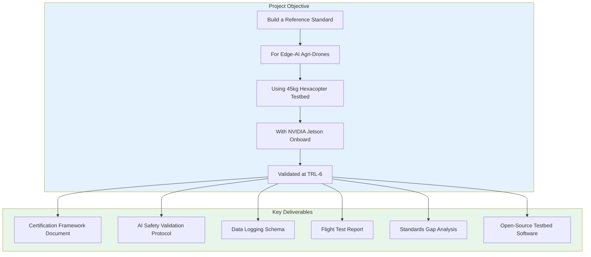

# COEP Agricultural Hexacopter — Master Execution Plan
## TIHAN + IIT Hyderabad + COEP Tech Internship

**Project:** National Reference Standards and Certification Framework for Edge-AI Enabled Autonomous Agricultural Drones
**Target:** TRL-6 — Compliance framework demonstrated in relevant testbed environment
**Duration:** 10 months (18 iterations)
**Started:** May 29, 2026

---

## Project Scope Definition



---

## Iteration Plan

### ITERATION 1: Master Plan (Current)
- [x] Define project scope and objectives
- [x] Create execution plan with 18 iterations
- [x] Set up project structure
- Status: **COMPLETE**

### ITERATION 2: Component Analysis with Alternatives
- Analyze every component in the current design
- Research 2-3 alternatives for each component
- Create comparison matrices with weighted scoring
- Decision: Keep/Upgrade/Replace recommendation
- Output: `analysis/02_component_analysis.md`

### ITERATION 3: Design Decision Trees
- Create decision trees for every major design choice
- Frame selection, motor selection, battery config, FC choice
- Include "what-if" scenarios for each branch
- Output: `analysis/03_decision_trees.md`

### ITERATION 4: Power System Analysis
- Full electrical analysis with calculations
- Battery sizing for all 3 configurations (36/39.2/45 kg)
- Power budget breakdown with margins
- Thermal analysis of busbar and connectors
- Output: `analysis/04_power_system.md`

### ITERATION 5: Structural Analysis
- Frame stress analysis under 3g maneuver loads
- Arm natural frequency calculation
- Material selection justification
- FEA results summary (if available)
- Output: `analysis/05_structural_analysis.md`

### ITERATION 6: Avionics Architecture
- Complete signal flow diagram
- CAN bus vs UART decision tree
- GPS placement and EMI mitigation
- Telemetry link budget calculation
- Output: `analysis/06_avionics_architecture.md`

### ITERATION 7: Spray System Engineering
- Fluid dynamics analysis
- Nozzle selection optimization
- Flow rate calibration methodology
- Variable-rate spray control logic
- Output: `analysis/07_spray_system.md`

### ITERATION 8: Software Stack & AI Architecture
- Complete software stack diagram
- Jetson Orin Nano deployment plan
- AI model architecture (crop detection)
- Edge inference pipeline
- Output: `analysis/08_software_architecture.md`

### ITERATION 9: Testing Protocols
- Gate-by-gate testing protocol
- Thrust stand methodology
- Ground sweep procedure
- Tethered hover test plan
- Free flight envelope expansion
- Output: `analysis/09_testing_protocols.md`

### ITERATION 10: Regulatory Compliance
- DGCA compliance checklist
- BIS standards gap analysis
- ISO 21384-3 mapping
- NPNT implementation plan
- Output: `analysis/10_regulatory_compliance.md`

### ITERATION 11: Risk Analysis & FMEA
- Complete FMEA matrix
- Risk mitigation strategies
- Failure mode probability analysis
- Safety case documentation
- Output: `analysis/11_risk_analysis.md`

### ITERATION 12: Cost-Benefit Analysis
- Component cost breakdown
- Build vs buy analysis
- Total cost of ownership
- ROI calculation for agricultural operations
- Output: `analysis/12_cost_benefit.md`

### ITERATION 13: Project Timeline & Milestones
- Gantt chart with dependencies
- Critical path identification
- Resource allocation
- Go/No-Go decision gates
- Output: `analysis/13_project_timeline.md`

### ITERATION 14: Standards Gap Analysis (TIHAN Core)
- BIS IS 17081:2023 gap analysis
- DGCA Drone Rules gap for AI
- ISO 21384-3 gap for autonomy
- ASTM F3269-21 gap for logging
- Proposed amendments to each standard
- Output: `analysis/14_standards_gap.md`

### ITERATION 15: Edge-AI Certification Framework
- AI safety validation layers
- Pass/fail criteria for each layer
- Adversarial testing methodology
- Explainability requirements
- Output: `analysis/15_ai_certification.md`

### ITERATION 16: Data Logging Schema
- MAVLink extension for AI decisions
- JSON/Protobuf schema design
- Interoperability requirements
- Audit trail specification
- Output: `analysis/16_data_logging.md`

### ITERATION 17: Comprehensive Report
- LaTeX-formatted technical report
- All analysis integrated
- Figures, tables, equations
- Executive summary
- Output: `report/COEP_Technical_Report_v8.tex`

### ITERATION 18: Final Review & Offline Package
- Consistency check across all documents
- Download offline data (datasheets, standards)
- Create final package
- Output: `FINAL_PACKAGE/`

---

## Project Directory Structure

```
COEP_Agricultural_Drone/
├── COEP_Project_Master_Plan.md          ← This file
├── analysis/                            ← Deep analysis documents
│   ├── 02_component_analysis.md
│   ├── 03_decision_trees.md
│   ├── 04_power_system.md
│   ├── 05_structural_analysis.md
│   ├── 06_avionics_architecture.md
│   ├── 07_spray_system.md
│   ├── 08_software_architecture.md
│   ├── 09_testing_protocols.md
│   ├── 10_regulatory_compliance.md
│   ├── 11_risk_analysis.md
│   ├── 12_cost_benefit.md
│   ├── 13_project_timeline.md
│   ├── 14_standards_gap.md
│   ├── 15_ai_certification.md
│   └── 16_data_logging.md
├── report/                              ← LaTeX report
│   └── COEP_Technical_Report_v8.tex
├── data/                                ← Offline datasheets/references
│   ├── datasheets/
│   ├── standards/
│   └── references/
├── drone_building_guide/                ← Existing reference guide (34 files)
└── FINAL_PACKAGE/                       ← Deliverables
```

---

## Current Design Baseline

| Parameter | Value | Source |
|-----------|-------|--------|
| MTOW (Research) | 36 kg | COEP Report |
| MTOW (Operational) | 45 kg | COEP Report |
| MTOW (10L Variant) | 39.2 kg | Added analysis |
| Frame | EFT E616P, 1610mm wheelbase | COEP Report |
| Motors | 6× Hobbywing X9 G2L, 110KV | Verified from hobbywing.com |
| Props | Hobbywing MFP 36×11 | Verified from hobbywing.com |
| ESC | Hobbywing X9 G2L ESC, 120A | Verified from hobbywing.com |
| Battery | 3× Tattu 12S 30Ah semi-solid | Verified from grepow.com |
| Flight Controller | Pixhawk 6C, ArduCopter 4.4 | Verified |
| GPS | 2× HGLRC M10 Mini | Verified |
| Telemetry | RFD868x (865-867 MHz) | Verified |
| RC | FrSky R-XSR | Verified |
| Pump | SHURflo 8000, 5.3 L/min | Verified |
| Nozzles | 4× TeeJet XR11002 | Verified |
| Flow Sensor | YF-S402, 4078 pulses/L | Verified |
| Tank | 16L HDPE with baffles | Design |
| AI Compute | NVIDIA Jetson Orin Nano | Design |

---

## Verification Status

| Component | Verified? | Source |
|-----------|-----------|--------|
| Hobbywing X9 G2L | ✅ 24 kg max, 110KV, 12S | hobbywing.com |
| Tattu 12S 30Ah | ✅ 1332Wh, 3C/5C, 4.9kg | grepow.com |
| TeeJet XR11002 | ✅ 0.20 gpm @ 40 psi | retailer specs |
| YF-S402 | ✅ 0.5-6 L/min, 4078 pulses/L | CERTEON manufacturer manual |
| RFD868x | ✅ 865-870MHz, 1W, 40+ km | rfdesign.com.au official datasheet |
| Pixhawk 6C | ✅ STM32H743, dual IMU | PX4 docs |
| FrSky R-XSR | ✅ 1.5g, 16ch, ACCESS | getfpv.com |
| EFT E616P | ⚠️ Verify wheelbase | EFT Model |
| SHURflo 8000 | ⚠️ Verify 5.3 L/min claim | Pentair specs |

---

## Key Calculations Summary

### Thrust-to-Weight Ratio (Verified)
- 36 kg: TWR = 120/36 = **3.33** ✅
- 39.2 kg: TWR = 120/39.2 = **3.06** ✅
- 45 kg: TWR = 120/45 = **2.67** ✅
- 50 kg: TWR = 120/50 = **2.40** ⚠️ (motor max achievable)

### Single-Motor Failure (SMF)
- 36 kg: SMF TWR = 88/36 = **2.44** ✅ (>2.0 safe)
- 39.2 kg: SMF TWR = 88/39.2 = **2.24** ✅ (>2.0 safe)
- 45 kg: SMF TWR = 88/45 = **1.96** ⚠️ (<2.0, mitigation needed)

### Hover Endurance (Verified from Hobbywing load table)
- 36 kg: **47.2 min** pure hover
- 39.2 kg: **42.0 min** pure hover
- 45 kg: **34.6 min** pure hover

### Mission Endurance
- 36 kg: **15.1 min** spray mission
- 45 kg: **21.8 min** spray mission (theoretical)
- 45 kg conservative: **18.5 min** (35°C, 5 m/s wind)

### Spray Flow Rate (Verified)
- Per nozzle: 0.79 L/min @ 2.0 bar, 0.76 L/min @ 40 psi
- 4 nozzles: 3.16 L/min @ 2.0 bar, 3.03 L/min @ 40 psi
- Mission effective: ~1.34 L/min via PWM/pressure control

### Power System
- Hover power (36 kg): 3,578 W total (80.6A @ 44.4V)
- Hover power (45 kg): 4,884 W total (110A @ 44.4V)
- Battery capacity: 3,996 Wh nominal, 2,813 Wh usable (80% DoD × 0.88 sag)

---

## Offline Data to Download

### Datasheets
- [ ] Hobbywing X9 G2L load performance PDF
- [ ] Tattu 12S 30Ah datasheet
- [ ] TeeJet XR11002 nozzle chart
- [ ] YF-S402 flow sensor datasheet
- [ ] RFD868x datasheet
- [ ] Pixhawk 6C reference manual
- [ ] SHURflo 8000 series manual
- [ ] FrSky R-XSR manual

### Standards
- [ ] DGCA Drone Rules 2021
- [ ] BIS IS 17081:2023
- [ ] ISO 21384-3:2019
- [ ] ASTM F3269-21
- [ ] Civil Drone Bill 2025 (draft)

### References
- [ ] ArduPilot Copter documentation
- [ ] TiHAN IIT Hyderabad research papers
- [ ] Agricultural drone market reports

---

*This plan will be updated after each iteration. Progress tracked in todo list.*
