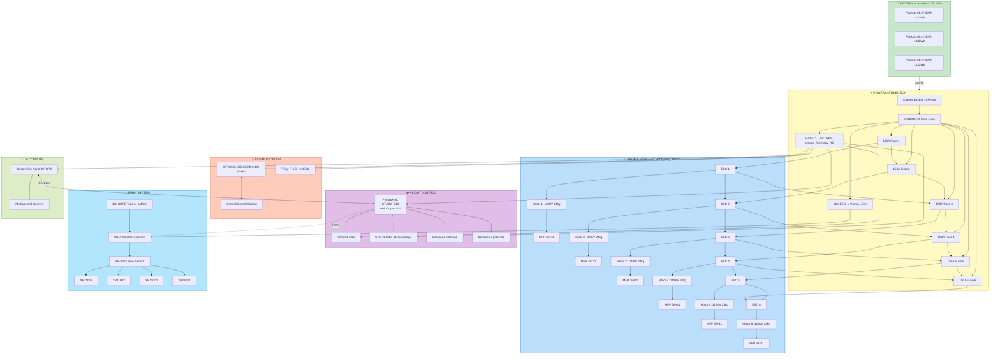
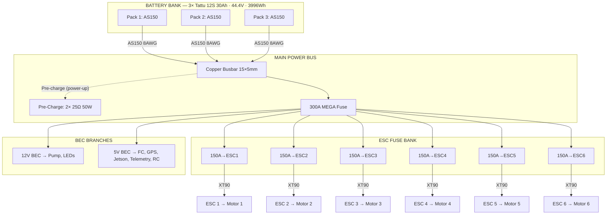
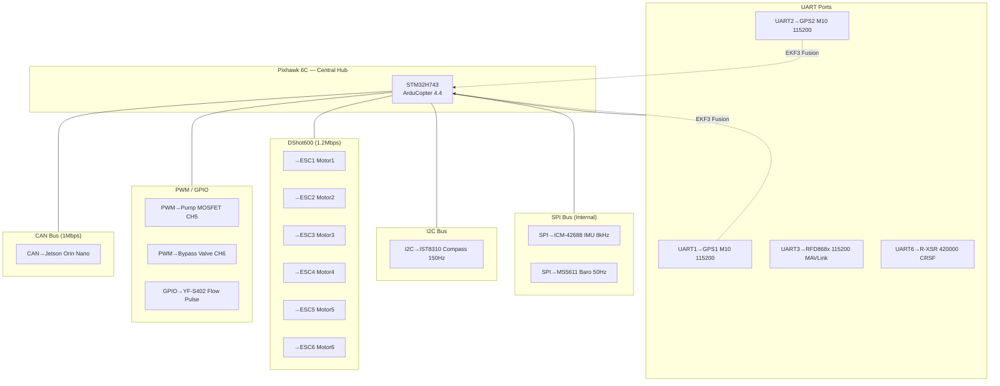
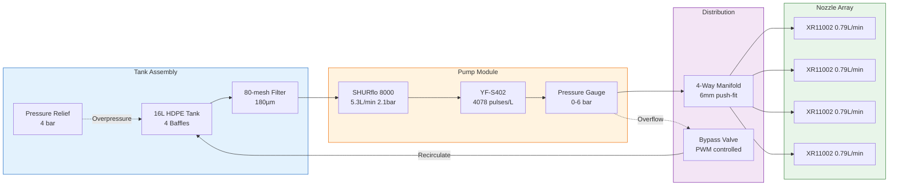
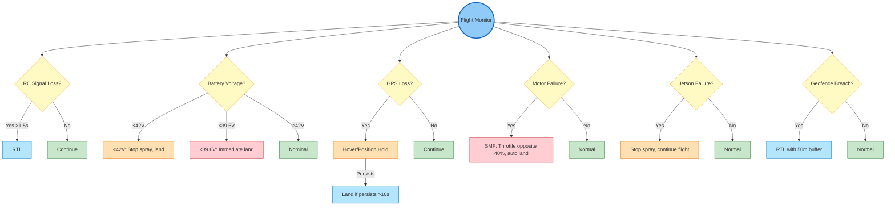
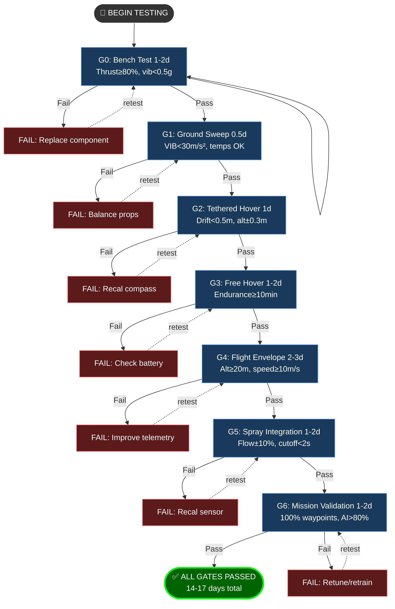

# COEP Agricultural Hexacopter — Architecture Diagrams

> All mermaid diagrams for the drone project. Open in Obsidian for live rendering.

---

## 1. System Architecture

---

## 2. Power Distribution Tree

---

## 3. Signal Flow Diagram

---

## 4. Spray System Fluid Path

---

## 5. AI Inference Pipeline

```mermaid
flowchart LR
    A["📷 Camera<br/>4-band MIPI CSI-2<br/>30 FPS"]:::input
    B["🖼️ Capture<br/>~5ms"]:::capture
    C["📐 Preprocess<br/>Resize+Normalize<br/>~5ms"]:::process
    D["📊 NDVI<br/>(NIR-Red)/(NIR+Red)<br/>~2ms"]:::process
    E["🧠 TensorRT<br/>EfficientNet-Lite0<br/>INT8 ~45ms"]:::inference
    F["🏷️ Classify<br/>Healthy/Stressed/Weed<br/>~12ms"]:::inference
    G["🎯 Decision<br/>NDVI→Spray Rate<br/>~5ms"]:::decision
    H["📡 MAVLink<br/>To Pixhawk<br/>~5ms"]:::output
    I["⚡ PWM<br/>Pump Control<br/>~100ms"]:::output
    J["🔄 Flow Sensor<br/>Feedback"]:::feedback

    A --> B --> C --> D --> E --> F --> G --> H --> I --> J
    J -.->|"Closed-loop"| G

    classDef input fill:#e1f5fe,stroke:#0277bd
    classDef capture fill:#f3e5f5,stroke:#7b1fa2
    classDef process fill:#fff8e1,stroke:#f9a825
    classDef inference fill:#fce4ec,stroke:#c62828
    classDef decision fill:#e8f5e9,stroke:#2e7d32
    classDef output fill:#e0f2f1,stroke:#00695c
    classDef feedback fill:#ede7f6,stroke:#512da8
```

**Total Latency: ~179ms** ✅ (< 200ms target)

---

## 6. Failsafe Decision Tree

---

## 7. Build & Test Sequence

```mermaid
flowchart TD
    A1["1. Frame Assembly"] --> A2["2. Motor Mounting 6×"] --> A3["3. ESC + Fuses"] --> A4["4. Power Dist + Pre-charge"] --> A5["5. FC + GPS Mount"] --> A6["6. Wiring Harness"]
    A6 --> D1{"Assembly OK?"}
    D1 -- Fail --> A6
    D1 -- Pass --> B1

    B1["7. Smoke Stopper"] --> B2["8. ESC Cal"] --> B3["9. Compass Cal"] --> B4["10. Radio Cal"] --> B5["11. Flight Modes"] --> B6["12. Failsafe Config"]
    B6 --> D2{"Bench OK?"}
    D2 -- Fail --> B1
    D2 -- Pass --> C1

    C1["13. Ground Sweep"] --> C2["14. Prop Balancing"] --> C3["15. Tethered Hover"]
    C3 --> D3{"Ground OK?"}
    D3 -- Fail --> C1
    D3 -- Pass --> E1

    E1["16. Free Hover"] --> E2["17. Mode Testing"] --> E3["18. Flight Envelope"] --> E4["19. Spray Integration"] --> E5["20. Mission Waypoints"]
    E5 --> D4{"Flight OK?"}
    D4 -- Fail --> E1
    D4 -- Pass --> F1["✅ READY FOR OPERATIONS"]

    style A1 fill:#1e3a5f,color:#fff
    style B1 fill:#1a4d2e,color:#fff
    style C1 fill:#8b4513,color:#fff
    style E1 fill:#6b1a1a,color:#fff
    style F1 fill:#006400,color:#fff,stroke:#00ff00,stroke-width:3px
```

---

## 8. Testing Gate Protocol (G0-G6)

---

*All diagrams verified against component datasheets and COEP analysis documents.*
