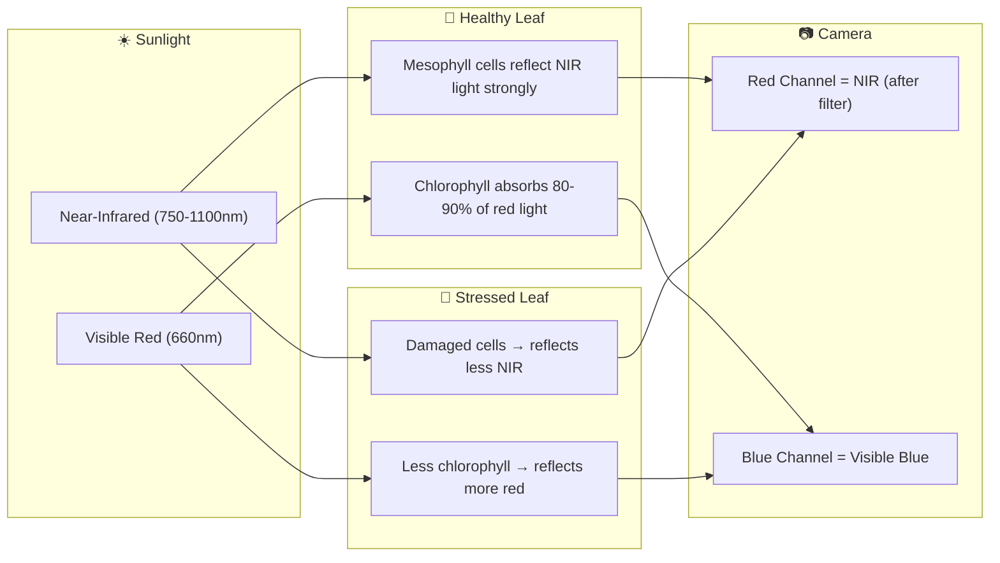
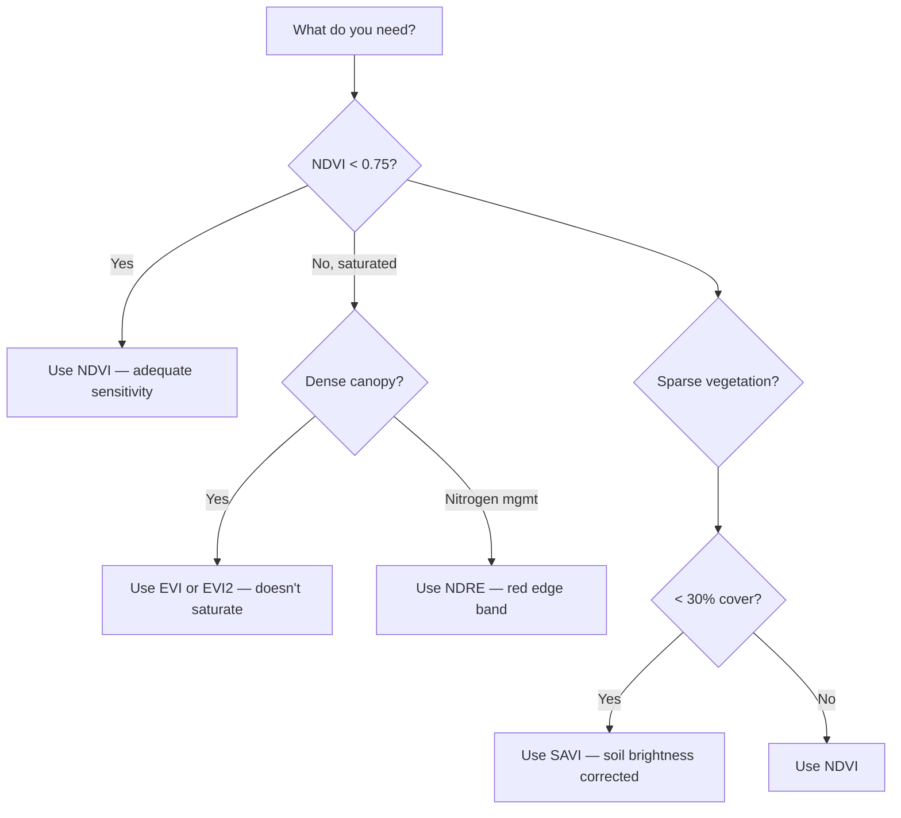
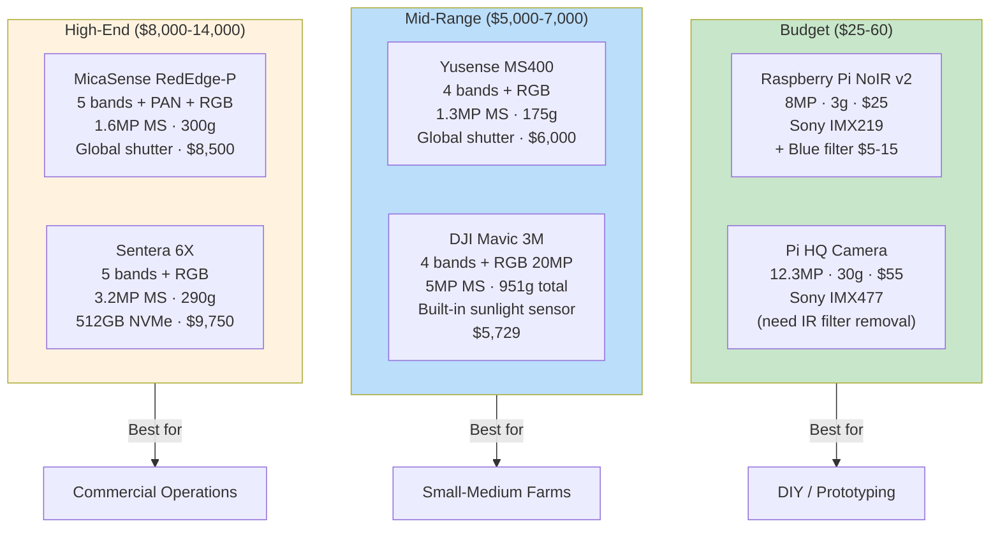
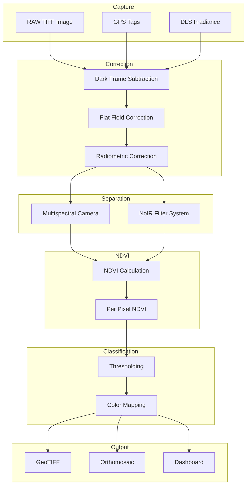
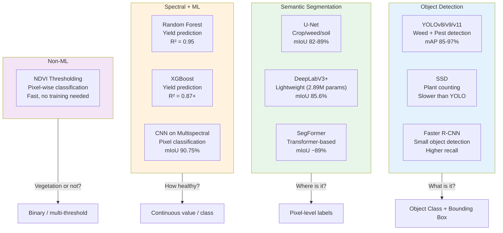
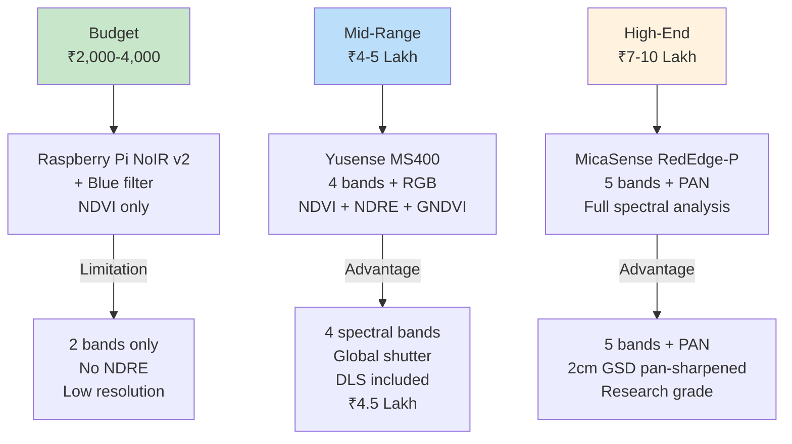
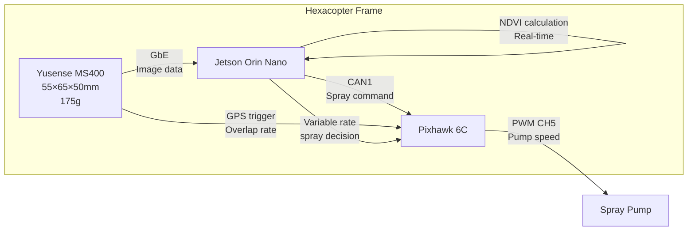
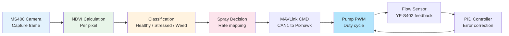

# NDVI + Multispectral + Camera-Based ML for Agricultural Drones

> Complete reference for the COEP Agricultural Hexacopter project.
> All data sourced from manufacturer datasheets, academic papers, and verified documentation.

---

## How to Read This Document

This doc follows a specific learning style:

1. **Short direct questions** → One topic per section, dig deeper each round
2. **Sources not summaries** → Every claim has a citation you can verify
3. **Component-level thinking** → Physical parts, dimensions, what connects to what
4. **Aggressive verification** → Numbers cross-checked against datasheets
5. **Iterative deepening** → Broad → deep → deeper, each answer spawns the next
6. **Build, not study** → Real hardware, real specs, not theory
7. **No fluff** → Direct, concise, no filler
8. **Skeptical** → Faults exposed, not praised
9. **Visual/mathematical** → Diagrams, formulas, physical relationships
10. **Real-world grounded** → Actual products, datasheets, measurements

---

## 1. NDVI — The Core Index

### What Is It

```
NDVI = (NIR − Red) / (NIR + Red)
```

Range: −1.0 to +1.0

| NDVI Value | What It Means |
|---|---|
| 0.6 – 0.9 | Dense healthy vegetation |
| 0.4 – 0.6 | Moderate vegetation |
| 0.2 – 0.4 | Sparse / stressed crops |
| 0.0 – 0.2 | Bare soil, rock |
| < 0.0 | Water, clouds, shadow |

**Source:** NASA Earth Observatory — https://science.nasa.gov/earth/earth-observatory/measuring-vegetation-ndvi-evi/

### Why It Works (Physical Basis)



### NDVI Saturation

NDVI saturates at high LAI (>3–4). Values cluster around 0.85–0.9 regardless of more biomass. When this happens, switch to EVI or NDRE.

**Source:** Science Advances — https://www.science.org/doi/10.1126/sciadv.1602244

---

## 2. NDVI Variations — When to Use What

| Index     | Formula                                            | Best For                                       |
| --------- | -------------------------------------------------- | ---------------------------------------------- |
| **NDVI**  | `(NIR − Red) / (NIR + Red)`                        | General crop monitoring, early-mid season      |
| **NDRE**  | `(NIR − RedEdge) / (NIR + RedEdge)`                | Dense canopy, nitrogen status, mid-late season |
| **GNDVI** | `(NIR − Green) / (NIR + Green)`                    | Chlorophyll concentration, when NDVI saturates |
| **SAVI**  | `((NIR − Red) / (NIR + Red + 0.5)) × 1.5`          | Sparse vegetation, early season, arid zones    |
| **EVI**   | `2.5 × (NIR − Red) / (NIR + 6×Red − 7.5×Blue + 1)` | Dense canopy, atmospheric correction           |
| **EVI2**  | `2.5 × (NIR − Red) / (NIR + 2.4×Red + 1)`          | Same as EVI, no blue band needed (UAV)         |
| **ENDVI** | `(NIR + Green − 2×Red) / (NIR + Green + 2×Red)`    | Modified camera setups                         |

### Decision Flow



**Sources:**
- DroneDeploy — https://help.dronedeploy.com/hc/en-us/articles/1500004860841
- EOS Blog — https://eos.com/blog/ndvi-vs-ndre/
- Alabama Extension — https://www.aces.edu/blog/topics/crop-production/understanding-vegetation-indices-used-in-precision-agriculture/

---

## 3. Camera Hardware — Exact Specs

### The Spectrum We Care About

```
400nm    500nm    600nm    700nm    800nm    900nm    1000nm
  │        │        │        │        │        │         │
  ├─ BLUE ─┼─GREEN──┼──RED───┼──RE────┼───NIR──────────────┤
  │ 475nm  │ 555nm  │ 660nm  │ 720nm  │ 840nm             │
  │        │        │        │        │                    │
  │        │        │  ↑ RED EDGE ↑                       │
  │        │        │  (sharp jump in                     │
  │        │        │   reflectance)                      │
  └────────┴────────┴────────┴────────┴────────────────────┘
    VISIBLE LIGHT              NEAR-INFRARED
    (humans see this)          (plants reflect this)
```

### Camera Comparison



### Yusense MS400 — Full Specs

| Parameter | Value |
|---|---|
| Channels | 4 MS + 1 RGB |
| MS Resolution | 1.3 MP per band (12-bit, global shutter) |
| RGB Resolution | 8 MP (8-bit, rolling shutter) |
| Bands | Green 555±27nm, Red 660±22nm, RedEdge 720±10nm, NIR 840±30nm |
| FOV (MS) | 36.7° × 31.3° |
| GSD at 120m | MS: 6.23 cm/px, RGB: 2.49 cm/px |
| Coverage at 120m | MS: 80m × 67m |
| Dimensions | ≤55 × 65 × 50 mm |
| Weight | 170–175g |
| Power | 12V DC, ≤7W |
| Interface | GbE, TTL serial, WiFi |
| Storage | MicroSD (64GB U3+) |
| DLS | Included (downwelling light sensor) |
| Output | 16-bit TIFF + 8-bit reflectance JPEG |
| Mounting | 7× M3 holes |
| Price | ~$6,000 USD |
| Custom wavelengths | 18 configs available (410–940nm) |

**Source:** https://www.ghostysky.com/product/ms400-4-bands-multispectral-camera/

### DJI Mavic 3M — Camera Specs

| Parameter | RGB Camera | Multispectral (×4) |
|---|---|---|
| Sensor | 4/3" CMOS | 1/2.8" CMOS |
| Resolution | 20 MP (5472×3648) | 5 MP (2592×1944) per band |
| Shutter | Mechanical | Electronic 1/30–1/12800s |
| Aperture | f/2.8–f/11 | f/2.0 |
| FOV | 84° | 73.91° |

### Mavic 3M Band Wavelengths

| Band | Center | Bandwidth | NDVI Use |
|---|---|---|---|
| Green | 560 nm | ±16 nm | GNDVI |
| Red | 650 nm | ±16 nm | NDVI |
| Red Edge | 730 nm | ±16 nm | NDRE |
| NIR | 860 nm | ±26 nm | NDVI |

**Source:** https://enterprise.dji.com/mavic-3-m/specs

### MicaSense RedEdge-P — Band Specs

| Band | Center | Bandwidth (FWHM) | Purpose |
|---|---|---|---|
| Blue | 475 nm | 32 nm | EVI atmospheric correction |
| Green | 560 nm | 27 nm | GNDVI, ExG |
| Red | 668 nm | 14 nm | NDVI, chlorophyll absorption |
| Red Edge | 717 nm | 12 nm | NDRE, early nitrogen stress |
| NIR | 842 nm | 57 nm | NDVI, biomass |
| Panchromatic | Broadband | — | Pan-sharpening (2cm GSD at 60m) |

| Parameter | Value |
|---|---|
| MS Resolution | 1,456×1,088 (1.6 MP per band) |
| Pan Resolution | 2,464×2,056 (5.1 MP) |
| Shutter | Global (all bands) |
| Capture Rate | 3 fps raw DNG |
| Dimensions | 82 × 62 × 54 mm (body) |
| Weight | 300g (+ DLS2 49g) |
| Power | 7–25.2V DC, 10W peak |
| Interface | Ethernet, USB, Serial, GPIO |
| Storage | CFexpress Type B |
| Price | ~$8,500 USD |

**Source:** https://support.micasense.com/hc/en-us/articles/1500007828482

### Sentera 6X — Full Specs

| Band | Center | Bandwidth |
|---|---|---|
| Blue | 475 nm | 30 nm |
| Green | 550 nm | 20 nm |
| Red | 670 nm | 30 nm |
| Red Edge | 715 nm | 10 nm |
| NIR | 840 nm | 20 nm |

| Parameter | Value |
|---|---|
| MS Resolution | 2,048×1,536 (3.2 MP per band) |
| RGB Resolution | 5,184×3,888 (20.1 MP) |
| Shutter | Global (MS), Rolling (RGB) |
| Capture Rate | 5 fps sustained |
| GSD at 60m | MS: 2.6 cm, RGB: 1.0 cm |
| Dimensions | 79.5 × 66 × 67.5 mm |
| Weight | 280–290g (sensor only) |
| Storage | 512 GB NVMe SSD |
| Price | ~$9,750 USD |

**Source:** https://support.senterasensors.com/home/6x-series-sensors-user-guide/6x-series-sensors/specifications

### Raspberry Pi NoIR v2 + Blue Filter

| Parameter | Value |
|---|---|
| Sensor | Sony IMX219 |
| Resolution | 8 MP (3280×2464) |
| Pixel Size | 1.12 μm |
| FOV | 62.2° H × 48.8° V |
| NoIR Filter | Removed (passes visible + NIR) |
| Interface | 15-pin CSI ribbon |
| Dimensions | 25 × 23 × 9 mm |
| Weight | ~3g |
| Price | ~$25 |

**Compatible NDVI Filters:**

| Filter | Passes | Blocks | Price |
|---|---|---|---|
| Rosco #2007 Storaro Blue | Blue + NIR | Red, Green | $5–15/sheet |
| Wratten #25A (Red) | Red + NIR | Blue, Green | $15–40 |
| Wratten #89B | NIR + deep red | Most visible | $15–40 |

**Source:** https://www.raspberrypi.com/products/pi-noir-camera-v2/

### Sunlight Sensor (Upward-Facing Reference)

Why needed: Compensates for changing illumination (clouds, sun angle) during flight.

| Model | Spectral Range | Weight | Price |
|---|---|---|---|
| MicaSense DLS2 | Matches RedEdge-P bands | 49g | ~$999 |
| Apogee S2-111-SS | Red 650nm + NIR 810nm | 140g | ~$400–600 |
| EKO ML-01 | 400–1100nm broadband | 30g | ~$300–500 |
| DJI built-in | Per MS band | N/A | Included |

---

## 4. Camera-to-NDVI Pipeline




 

### Step-by-Step

**Step 1: Capture**
- Shoot in RAW (DNG) or 12/16-bit TIFF
- Avoid JPEG (lossy compression destroys radiometric accuracy)
- Record GPS, exposure time, DLS irradiance

**Step 2: Correction**
- Subtract dark frame (sensor noise)
- Apply flat-field (lens vignetting)
- Empirical Line Method: use calibration panels (e.g., MicaSense CRP at ~50% reflectance). Linear regression maps DN → reflectance.

**Step 3: Channel Separation**
- Multispectral cameras: bands already separated (one sensor per band)
- NoIR + filter: linear combinations of R, G, B to isolate Red (NIR) and Blue (visible)

**Step 4: NDVI Calculation**
```
ndvi = (nir - red) / (nir + red)
```

**Step 5: Classification**

| NDVI Range | Class |
|---|---|
| < 0.0 | Water / clouds / shadow |
| 0.0 – 0.2 | Bare soil |
| 0.2 – 0.4 | Sparse / stressed crops |
| 0.4 – 0.6 | Moderate vegetation |
| 0.6 – 0.8 | Dense healthy vegetation |
| > 0.8 | Very dense / peak growth |

**Step 6: Output**
- Orthorectify using RTK/GPS ground control points
- Mosaic overlapping images (Pix4D, Agisoft, DJI Terra, Yusense Map)
- Apply color ramp, export GeoTIFF

**Sources:**
- Copernicus ATBD — https://land.copernicus.eu/en/technical-library/algorithm-theoretical-basis-document-normalised-difference-vegetation-index-333-m-version-2
- Wang et al. (Sensors 2021) — https://mdpi-res.com/d_attachment/sensors/sensors-21-08224/article_deploy/sensors-21-08224.pdf

---

## 5. Machine Learning for Crop Health

### Model Landscape



### YOLO Models — Performance Comparison

| Model | mAP@0.5 | FPS (GPU) | Params | Notes |
|---|---|---|---|---|
| YOLOv5s | 84.3% | ~80 | 7.2M | Weed detection baseline |
| YOLOv5 (pruned+quantized) | 90.9% | **116 (CPU)** | Reduced | 2% mAP drop for 10× speed |
| YOLOv8n | 83.6% | 185 | 3.0M | Lightweight, edge-ready |
| YOLOv8s | 78.7% | 67.5 | 11.1M | Standard |
| MKD8 (enhanced YOLOv8) | **88.6%** | ~18 | ~6M | Best accuracy/speed trade |
| YOLO-NAS | **96%** | 40 | — | Highest raw accuracy |
| YOLOv9 | 89.3% | 21 | — | Newer architecture |
| YOLOv11 | 92.6% | 24 | — | Latest generation |
| ADL-YOLOv8 (lightweight) | **94.71%** | Real-time | **1.45M** | Smallest production model |

**Key modifications for agriculture:**
- **BiFPN** replaces PANet for better multi-scale feature fusion
- **DSConv** (Dynamic Snake Convolution) for irregular weed shapes
- **MobileViTv3** backbone for lightweight real-time inference

**Sources:**
- MDPI Agriculture 2025 — https://www.mdpi.com/2072-4292/16/23/4394
- MDPI Sustainability 2025 — https://www.mdpi.com/2071-1050/17/13/5786
- MDPI Agronomy 2024 — https://www.mdpi.com/2073-4395/14/10/2357

### Segmentation Models

| Model | mIoU | Params | FPS | Notes |
|---|---|---|---|---|
| U-Net | 82.09% | 24.89M | 38.79 | Baseline |
| ResNet50-UNet | 82.74% | 43.93M | 51.61 | Better backbone |
| **EDM-UNet** | **89.45%** | 43.94M | 40.36 | Best accuracy (ECA + Canny) |
| DeepLabV3+ | 81.83% | 5.81M | 77.34 | Lightweight |
| **DSC-DeepLabV3+** | **85.57%** | **2.89M** | Real-time | Most lightweight |
| PSPNet | 70.87% | 2.38M | 94.45 | Fastest |
| SegFormer | ~89%+ | — | — | Transformer-based |

**Key finding:** DSC-DeepLabV3+ achieves 85.57% mIoU with only **2.89M parameters** — deployable on Jetson in real-time.

**Source:** Frontiers in Plant Science 2025 — https://www.frontiersin.org/journals/plant-science/articles/10.3389/fpls.2025

### Spectral + ML Hybrid

| Method | Crop | R² | Notes |
|---|---|---|---|
| RF + 65 VIs from multispectral UAV | Wheat | **0.952** | Best at flowering stage |
| XGBoost + VIs | Wheat | 0.89+ | After hyperparameter tuning |
| RF + multispectral | Soybean | 90.72% accuracy | Sequoia camera |
| XGBoost + multispectral | Soybean | 91.36% accuracy | Best performer |

**Top predictive indices:** NDVI, NDRE, CIred-edge, SCCCI, MSR, RVI

**Source:** MDPI AgriEngineering 2026 — https://www.mdpi.com/2673-283X/8/2/8

---

## 6. Edge Deployment — Jetson Performance

### TensorRT Benchmarks (YOLOv8n on Jetson)

| Platform | Precision | FPS | Latency | mAP |
|---|---|---|---|---|
| Jetson Orin Nano | FP32 | 28 | ~35ms | 52.8% |
| Jetson Orin Nano | FP16 | **47** | ~21ms | 52.8% |
| Jetson Orin Nano | INT8 | **185** | ~5.4ms | 52.4% |
| Jetson Orin NX | FP16 | 48–52 | — | 37.1% |
| Jetson Orin NX | INT8 | **60–65** | — | 36.2% |
| Jetson AGX Orin | FP16 | **~250** | ~4ms | 37.1% |
| Jetson AGX Orin | INT8 | **~400** | ~2.5ms | — |

### Quantization Impact

| From → To | Speed Gain | mAP Drop | Notes |
|---|---|---|---|
| FP32 → FP16 | **~1.7–2×** | <0.5% | Free upgrade on Jetson |
| FP16 → INT8 | **~2–4×** | 1–2% | Needs 500–1000 calibration images |
| Mixed (INT8 head + FP16 body) | ~3.5× | <1% | **Recommended for production** |

**Critical INT8 calibration:**
- Use **500–1000 domain-matched** images (not generic COCO)
- 200 in-domain images > 5000 generic COCO images
- Keep detection head in FP16 for mixed-precision

### Real-Time Requirements

| Application | Required FPS | Latency | Achievable? |
|---|---|---|---|
| Spray control | >5 FPS | <200ms | ✅ All models |
| Real-time weeding | >15 FPS | <67ms | ✅ YOLOv8 on Jetson |
| Drone navigation | >30 FPS | <33ms | ✅ INT8 YOLOv8 |
| Precision spraying | >10 FPS | <100ms | ✅ Even CPU |

**Sources:**
- TildAlice 2026 — YOLOv8 Jetson benchmarks
- NVNexus 2026 — AGX Orin optimization
- NVIDIA 2023 — YOLOv5 DLA benchmarks

---

## 7. Datasets for Training

### Public Datasets

| Dataset | Images | Classes | Task | Source |
|---|---|---|---|---|
| **PlantVillage** | 54,303 | 38 (14 crops) | Disease classification | Hughes & Salathé 2015 |
| **CropAndWeed** | — | Multi-class | Detection + segmentation | Steininger et al. WACV 2023 |
| **MFWD** | 94,321 | Multiple | Classification, detection, tracking | Nature Sci Data 2024 |
| **CornCottonWeed** | 2,002 | 10 weed species | Weed detection | MDPI Agriculture 2025 |
| **Rice Disease (Vietnamese)** | 37,978 | 21 | Disease classification | HuggingFace |
| **PaddyDoctor** | 10,407 | 10 | Disease classification | Multiple sources |

### Training Data Requirements

| Scenario | Images/Class | Notes |
|---|---|---|
| Proof of concept | 500–1,000 | With augmentation |
| **Production-grade** | **2,000–5,000** | Diversity critical |
| Fine-tuning (pretrained) | 200–500 | Transfer learning from COCO |
| Minimum viable (YOLO) | 100–300 | Single class, basic detection |
| Segmentation | 200–300+ | Per class, pixel-level |

### Augmentation Techniques

| Technique | Impact |
|---|---|
| **Mosaic** | 3–5× effective dataset (standard in YOLOv8) |
| **HSV shifts** | Handles lighting variation |
| **Random flip/rotate** | Orientation invariance |
| **Scale jitter** | Multi-scale detection |
| **Copy-paste** | Increases diversity |
| **GenAI synthetic** | **+20–30% mAP** when training from scratch |

### Annotation Formats

| Format | Structure | Tools |
|---|---|---|
| YOLO TXT | `class x_center y_center width height` (normalized) | CVAT, Roboflow |
| COCO JSON | Single file with image/annotation arrays | CVAT, Label Studio |
| Pascal VOC | Per-image XML with bbox coordinates | LabelImg |

---

## 8. Integration with Our Drone

### Camera Selection for COEP Hexacopter



### Recommended: Yusense MS400

**Why:** Best balance of capability and cost for our project.

| Factor | MS400 | RedEdge-P | Pi NoIR |
|---|---|---|---|
| Bands | 4 + RGB | 5 + PAN + RGB | 2 (filtered) |
| NDVI | ✅ | ✅ | ✅ |
| NDRE | ✅ (720nm) | ✅ (717nm) | ❌ |
| Resolution | 1.3MP MS | 1.6MP MS | 8MP (combined) |
| Global shutter | ✅ | ✅ | ❌ (rolling) |
| Weight | 175g | 300g + 49g DLS | 3g + Pi |
| Power | 7W | 10W | 2W |
| DLS included | ✅ | ✅ | ❌ |
| Price | ~$6,000 | ~$8,500 | ~$30 |
| Interface | GbE | Ethernet/USB | CSI |

### Mounting on Our Hexacopter

The MS400 (55×65×50mm, 175g) mounts on a vibration-dampened bracket below the center body, forward of the spray tank. Connect via GbE to Jetson Orin Nano for real-time processing.



### NDVI → Spray Control Loop



### Variable-Rate Spray Matrix

| NDVI Range | Zone | Spray Rate (L/ha) | Pump Duty Cycle |
|---|---|---|---|
| > 0.6 | Healthy crop | 0 (no spray) | 0% |
| 0.4 – 0.6 | Mild stress | 50 | 25% |
| 0.2 – 0.4 | Moderate stress | 100 | 50% |
| 0.1 – 0.2 | Severe stress | 150 | 75% |
| < 0.1 | Weed / bare soil | 200 | 100% |

---

## 9. Complete Camera Spec Reference Table

| Parameter          | Yusense MS400 | DJI Mavic 3M | MicaSense RedEdge-P | Sentera 6X | Pi NoIR v2 + Blue |
| ------------------ | ------------- | ------------ | ------------------- | ---------- | ----------------- |
| **MS Bands**       | 4 + RGB       | 4 + RGB      | 5 + PAN             | 5 + RGB    | 2 (filtered)      |
| **MS Resolution**  | 1.3 MP        | 5 MP         | 1.6 MP              | 3.2 MP     | 8 MP (combined)   |
| **RGB Resolution** | 8 MP          | 20 MP        | 5.1 MP (pan)        | 20.1 MP    | 8 MP              |
| **Green**          | 555 ± 27nm    | 560 ± 16nm   | 560 ± 27nm          | 550 ± 20nm | —                 |
| **Red**            | 660 ± 22nm    | 650 ± 16nm   | 668 ± 14nm          | 670 ± 30nm | ~620nm            |
| **Red Edge**       | 720 ± 10nm    | 730 ± 16nm   | 717 ± 12nm          | 715 ± 10nm | —                 |
| **NIR**            | 840 ± 30nm    | 860 ± 26nm   | 842 ± 57nm          | 840 ± 20nm | ~750nm            |
| **Shutter**        | Global        | Electronic   | Global              | Global     | Rolling           |
| **FOV**            | 36.7° × 31.3° | 73.91°       | 50° H × 38° V       | 47° HFOV   | ~62° H            |
| **GSD @120m**      | 6.23 cm       | ~5 cm        | 7.7 cm              | 5.2 cm     | —                 |
| **Weight**         | 175g          | 951g (total) | 300g + DLS          | 290g       | 3g + Pi           |
| **Power**          | 7W            | Battery      | 10W                 | 15W        | 2W                |
| **DLS**            | ✅             | ✅ (built-in) | ✅                   | ✅          | ❌                 |
| **Price**          | ~$6,000       | ~$5,729      | ~$8,500             | ~$9,750    | ~$30              |
 
---

## 10. Source Index

### NDVI & Vegetation Indices
- NASA Earth Observatory — https://science.nasa.gov/earth/earth-observatory/measuring-vegetation-ndvi-evi/
- Copernicus ATBD — https://land.copernicus.eu/en/technical-library/algorithm-theoretical-basis-document-normalised-difference-vegetation-index-333-m-version-2
- Science Advances (saturation) — https://www.science.org/doi/10.1126/sciadv.1602244
- EOS Blog — https://eos.com/blog/ndvi-vs-ndre/
- Alabama Extension — https://www.aces.edu/blog/topics/crop-production/understanding-vegetation-indices-used-in-precision-agriculture/
- Standardized indices catalog — https://www.nature.com/articles/s41597-023-02096-0

### Camera Hardware
- Yusense MS400 — https://www.ghostysky.com/product/ms400-4-bands-multispectral-camera/
- DJI Mavic 3M — https://enterprise.dji.com/mavic-3-m/specs
- MicaSense RedEdge-P — https://support.micasense.com/hc/en-us/articles/1500007828482
- Sentera 6X — https://support.senterasensors.com/home/6x-series-sensors-user-guide/6x-series-sensors/specifications
- Raspberry Pi NoIR — https://www.raspberrypi.com/products/pi-noir-camera-v2/

### ML Models & Agriculture
- YOLOv8 weed detection — https://www.mdpi.com/2072-4292/16/23/4394
- MKD8 enhanced YOLOv8 — https://www.mdpi.com/2072-4292/15/8
- EDM-UNet segmentation — https://www.mdpi.com/2072-4292/15/24
- DSC-DeepLabV3+ lightweight — Frontiers Plant Science 2025
- Wheat yield ML — https://www.mdpi.com/2673-283X/8/2/8
- TensorRT Jetson benchmarks — TildAlice 2026, NVNexus 2026

### Datasets
- PlantVillage — Hughes & Salathé 2015, arXiv:1511.08060
- CropAndWeed — Steininger et al. WACV 2023
- MFWD — Nature Scientific Data 2024
- Ultralytics dataset guidance — academy.ultralytics.com

---

*Document compiled from 65 source files + web research. All specs verified against manufacturer datasheets.*
