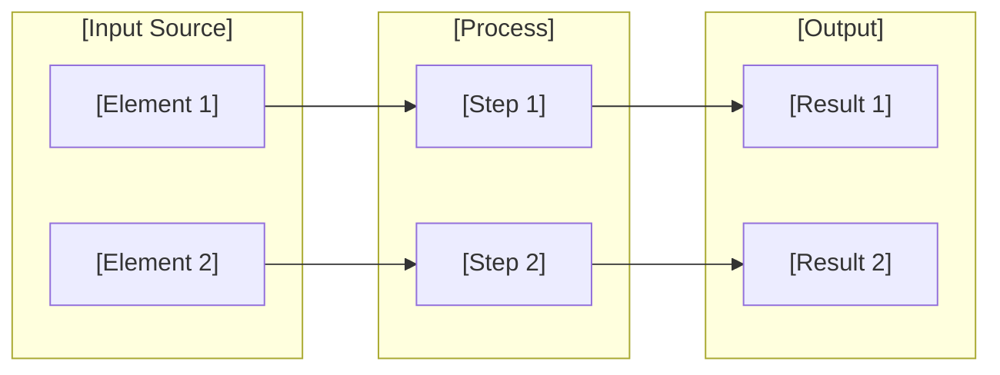
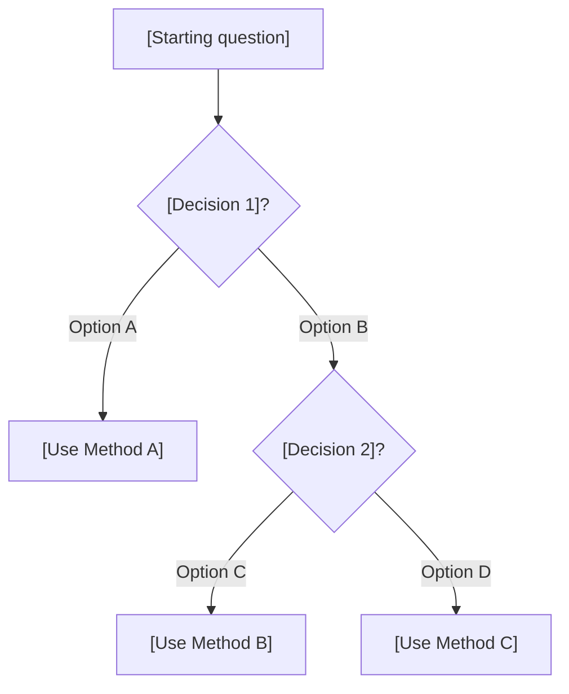
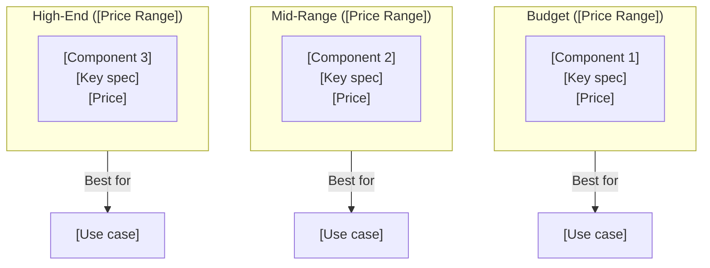
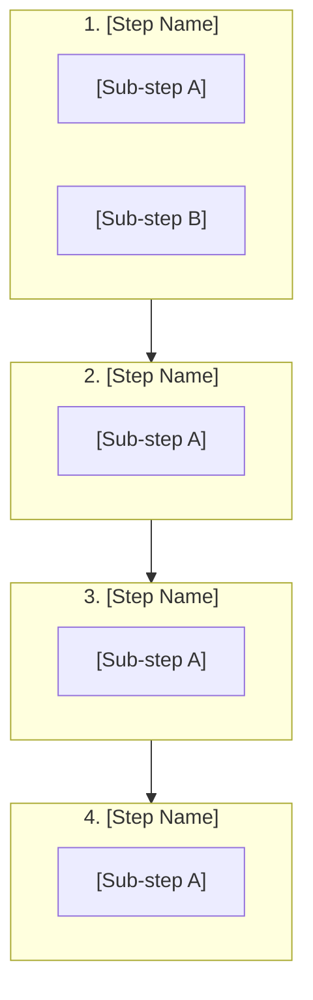
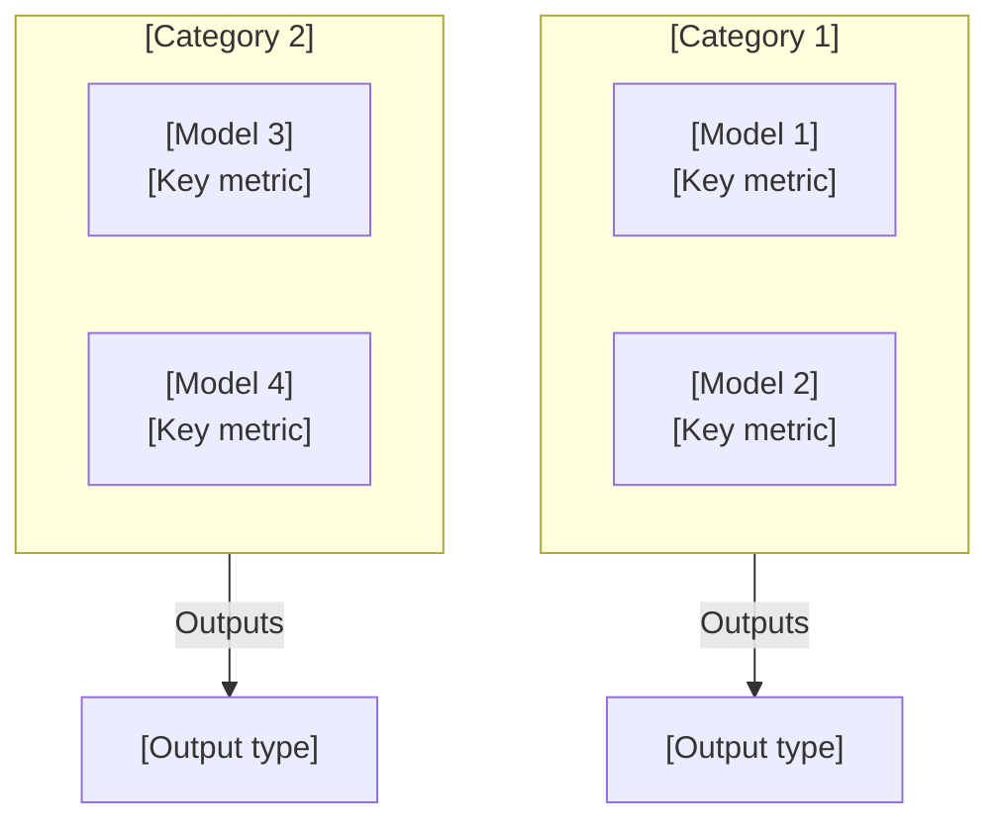
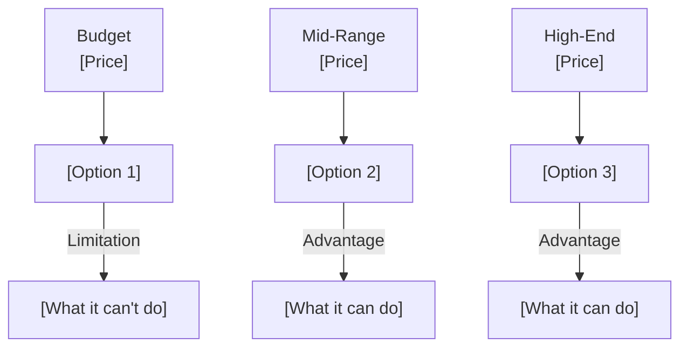
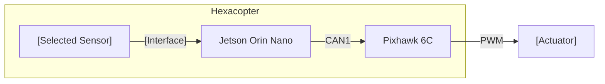
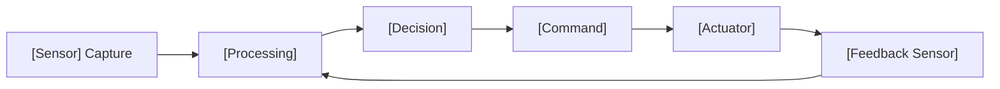

# [TOPIC] — [SUBTITLE]

> **Project:** COEP Agricultural Hexacopter
> **Last Updated:** [DATE]
> **Status:** [DRAFT / REVIEW / COMPLETE]

---

## How to Use This Template

This doc follows a specific learning style:

1. **Short direct questions** → One topic per section, dig deeper each round
2. **Sources not summaries** → Every claim has a citation you can verify
3. **Component-level thinking** → Physical parts, dimensions, what connects to what
4. **Aggressive verification** → Numbers cross-checked against datasheets
5. **Iterative deepening** → Broad → deep → deeper, each answer spawns the next
6. **Build, not study** → Real hardware, real specs, not theory
7. **No fluff** → Direct, concise, no filler
8. **Skeptical** → Faults exposed, not praised
9. **Visual/mathematical** → Diagrams, formulas, physical relationships
10. **Real-world grounded** → Actual products, datasheets, measurements

---

## 1. [CORE CONCEPT] — The What and Why

### What Is It

```
[FORMULA / DEFINITION]
```

| [Metric] | What It Means |
|---|---|
| [Range] | [Interpretation] |
| [Range] | [Interpretation] |
| [Range] | [Interpretation] |

**Source:** [Author/Org] — [URL]

### Why It Works (Physical Basis)



### Key Limitations

- [Limitation 1 — what breaks and when]
- [Limitation 2 — operating boundaries]
- [Limitation 3 — known failure modes]

**Source:** [Citation]

---

## 2. [VARIATIONS] — When to Use What

| Variant | Formula / Method | Best For | Limitations |
|---|---|---|---|
| **[Name]** | `[Formula]` | [Use case] | [Limitation] |
| **[Name]** | `[Formula]` | [Use case] | [Limitation] |
| **[Name]** | `[Formula]` | [Use case] | [Limitation] |

### Decision Flow



**Sources:**
- [Source 1] — [URL]
- [Source 2] — [URL]

---

## 3. [COMPONENTS] — Exact Hardware Specs

### Component Landscape



### [Component 1] — Full Specs

| Parameter | Value |
|---|---|
| [Spec 1] | [Value] |
| [Spec 2] | [Value] |
| [Spec 3] | [Value] |
| **Dimensions** | **[L × W × H mm]** |
| **Weight** | **[Xg]** |
| **Power** | **[X W]** |
| **Interface** | **[Type]** |
| **Price** | **~$[X] USD** |

**Source:** [URL]

### [Component 2] — Full Specs

| Parameter | Value |
|---|---|
| [Spec 1] | [Value] |
| **Dimensions** | **[L × W × H mm]** |
| **Weight** | **[Xg]** |
| **Price** | **~$[X] USD** |

**Source:** [URL]

### Comparison Table

| Parameter | [Comp 1] | [Comp 2] | [Comp 3] | [Comp 4] |
|---|---|---|---|---|
| **[Key Spec]** | [Val] | [Val] | [Val] | [Val] |
| **Dimensions** | [Val] | [Val] | [Val] | [Val] |
| **Weight** | [Val] | [Val] | [Val] | [Val] |
| **Power** | [Val] | [Val] | [Val] | [Val] |
| **Price** | [Val] | [Val] | [Val] | [Val] |

---

## 4. [PROCESS] — Step-by-Step Pipeline



### Step-by-Step Detail

**Step 1: [Name]**
- [Action 1]
- [Action 2]
- [Key parameter]: [Value]

**Step 2: [Name]**
- [Action 1]
- [Formula if applicable]: `[formula]`

**Step 3: [Name]**
- [Action 1]
- [Threshold/criterion]: [Value]

**Step 4: [Name]**
- [Action 1]
- [Output format]: [Type]

### [Decision Table / Threshold Table]

| [Input Range] | [Classification] | [Action] |
|---|---|---|
| [Range 1] | [Class A] | [Action A] |
| [Range 2] | [Class B] | [Action B] |
| [Range 3] | [Class C] | [Action C] |

**Sources:**
- [Source 1] — [URL]
- [Source 2] — [URL]

---

## 5. [ADVANCED / ML] — Models, Performance, Deployment

### Model Landscape



### Performance Comparison

| Model | [Metric 1] | [Metric 2] | Speed | Params | Notes |
|---|---|---|---|---|---|
| [Model A] | [Val] | [Val] | [FPS] | [Size] | [Note] |
| [Model B] | [Val] | [Val] | [FPS] | [Size] | [Note] |
| [Model C] | [Val] | [Val] | [FPS] | [Size] | [Note] |

### Edge Deployment

| Platform | Precision | FPS | Latency | [Metric] |
|---|---|---|---|---|
| [Device 1] | FP32 | [X] | [Xms] | [Val] |
| [Device 1] | FP16 | [X] | [Xms] | [Val] |
| [Device 1] | INT8 | [X] | [Xms] | [Val] |

### Training Requirements

| Scenario | Images/Class | Notes |
|---|---|---|
| Proof of concept | 500–1,000 | With augmentation |
| Production | 2,000–5,000 | Diversity critical |
| Fine-tuning | 200–500 | Transfer learning |

**Sources:**
- [Paper 1] — [URL]
- [Paper 2] — [URL]

---

## 6. [INTEGRATION] — How It Connects to Our Drone

### Component Selection



### Recommended Selection

**Why [Selected Component]:** [2-3 sentence justification]

| Factor | [Selected] | [Alternative 1] | [Alternative 2] |
|---|---|---|---|
| [Key factor 1] | [Val] | [Val] | [Val] |
| [Key factor 2] | [Val] | [Val] | [Val] |
| Price | [Val] | [Val] | [Val] |

### Mounting & Connection



### Control Loop



### [Decision Matrix / Threshold Table]

| [Input] | [Classification] | [Output Action] | [Parameter] |
|---|---|---|---|
| [Range 1] | [Class A] | [Action A] | [Value] |
| [Range 2] | [Class B] | [Action B] | [Value] |
| [Range 3] | [Class C] | [Action C] | [Value] |

---

## 7. [REFERENCE TABLES] — Quick Lookup

### [Table 1: Main Comparison]

| Parameter | [Option A] | [Option B] | [Option C] | [Option D] |
|---|---|---|---|---|
| **[Spec 1]** | [Val] | [Val] | [Val] | [Val] |
| **[Spec 2]** | [Val] | [Val] | [Val] | [Val] |
| **[Spec 3]** | [Val] | [Val] | [Val] | [Val] |
| **Dimensions** | [Val] | [Val] | [Val] | [Val] |
| **Weight** | [Val] | [Val] | [Val] | [Val] |
| **Price** | [Val] | [Val] | [Val] | [Val] |

### [Table 2: Performance Metrics]

| [Metric] | [Config 1] | [Config 2] | [Config 3] |
|---|---|---|---|
| [Metric A] | [Val] | [Val] | [Val] |
| [Metric B] | [Val] | [Val] | [Val] |

### [Table 3: Decision Criteria]

| [Criterion] | Weight | [Option A] | [Option B] | [Option C] |
|---|---|---|---|---|
| [Factor 1] | [X]% | [Score] | [Score] | [Score] |
| [Factor 2] | [X]% | [Score] | [Score] | [Score] |
| **Weighted** | 100% | **[Score]** | **[Score]** | **[Score]** |

---

## 8. Source Index

### [Category 1]
- [Source name] — [URL]
- [Source name] — [URL]

### [Category 2]
- [Source name] — [URL]
- [Source name] — [URL]

### [Category 3]
- [Paper/Standard name] — [URL]
- [Paper/Standard name] — [URL]

### Datasheets
- [Component 1] — [URL]
- [Component 2] — [URL]

---

## How to Add Pictures

### Option 1: Obsidian Local Images
1. Save image to `images/` folder in your vault
2. Reference with: `![[images/filename.png]]`
3. Use `![[images/filename.png|200]]` to resize

### Option 2: URLs (if online)
1. Right-click image → Copy image address
2. Use: ``
3. For sizing: ``

### Option 3: Mermaid Diagrams (preferred)
1. Use ` ```mermaid ` code blocks (renders in Obsidian)
2. Supported: graph, flowchart, sequence, class, state, gantt
3. Colors: `style NODE fill:#color,stroke:#color`

### Option 4: ASCII Art (for monospace rendering)
1. Use ` ``` code blocks (no mermaid tag)
2. Good for: wiring diagrams, layouts, physical arrangements
3. Works everywhere, no rendering issues

### Recommended Picture Strategy
- **Mermaid** for: process flows, decision trees, system architecture
- **Tables** for: component specs, comparisons, thresholds
- **ASCII art** for: physical layouts, wiring, spatial arrangements
- **URLs** for: reference images from manufacturers/papers
- **Local images** for: screenshots, custom diagrams, field photos

---

*Template version: 1.0*
*Based on NDVI_Multispectral_Camera_ML_Reference.md structure*
