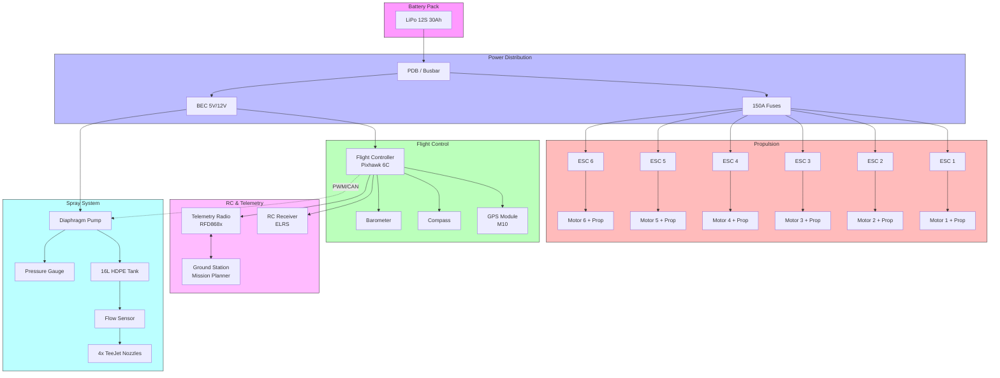
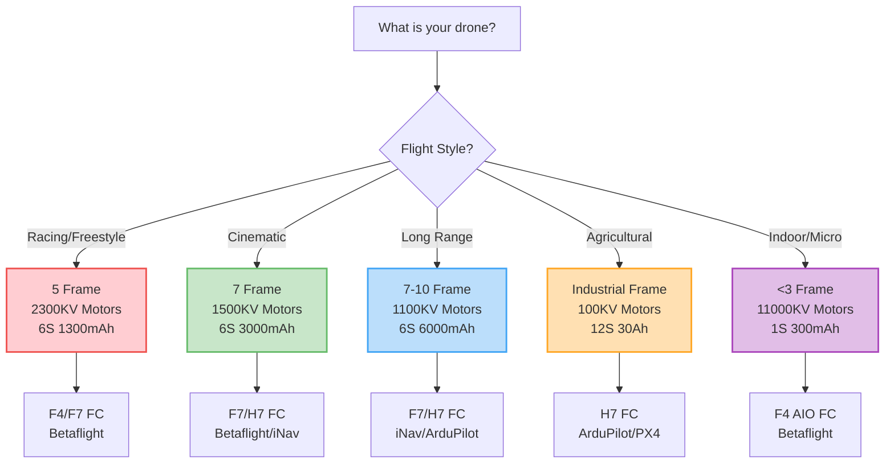

# Complete Drone Building Reference Guide
## Compiled from Internet Sources — May 2026

### Files in this Folder

| #   | File                            | Topic                                       |
| --- | ------------------------------- | ------------------------------------------- |
| 01  | `01_frame_types.md`             | Frame selection, types, materials, sizing   |
| 02  | `02_motors.md`                  | Motor selection, KV, thrust, stator sizing  |
| 03  | `03_escs.md`                    | ESC selection, protocols, firmware          |
| 04  | `04_propellers.md`              | Propeller sizing, pitch, diameter, matching |
| 05  | `05_batteries.md`               | LiPo, Li-ion, LiFe, C-rating, voltage       |
| 06  | `06_flight_controllers.md`      | ArduPilot, PX4, Betaflight comparison       |
| 07  | `07_gps_modules.md`             | GPS modules, M10, M9N, RTK                  |
| 08  | `08_telemetry_radios.md`        | RFD868x, RFD900x, LoRa, 3DR                 |
| 09  | `09_rc_receivers.md`            | ELRS, FrSky, CRSF protocols                 |
| 10  | `10_power_distribution.md`      | PDB, busbar, wiring, current rating         |
| 11  | `11_wiring_connectors.md`       | XT60, XT90, AS150, wire gauges              |
| 12  | `12_spray_systems.md`           | Agricultural spray systems, pumps, nozzles  |
| 13  | `13_vibration_damping.md`       | Vibration isolation, FC mounting            |
| 14  | `14_assembly_tips.md`           | Build process, common issues                |
| 15  | `15_tuning_calibration.md`      | PID tuning, calibration procedures          |
| 16  | `16_safety_regulations.md`      | India DGCA rules, safety                    |
| 17  | `17_tools_needed.md`            | Essential tools and supplies                |
| 18  | `18_common_mistakes.md`         | Beginner mistakes to avoid                  |
| 19  | `19_sitl_virtual_testing.md`    | ArduPilot SITL virtual testing              |
| 20  | `20_thrust_stand_design.md`     | Thrust stand build & motor testing          |
| 21  | `21_precharge_circuit.md`       | Pre-charge circuit design & math            |
| 22  | `22_hexacopter_motor_mixing.md` | Motor mixing & SMF simulation               |
| 23  | `23_glossary.md`                | Drone terminology glossary (80+ terms)      |
| 24  | `24_multirotor_physics.md`      | How multirotors fly (differential thrust)   |
| 25  | `25_lipo_safety_charging.md`    | LiPo safety & charging procedures           |
| 26  | `26_ardupilot_setup_guide.md`   | Step-by-step ArduPilot setup                |
| 27  | `27_maiden_flight.md`           | First hover test procedure                  |
| 28  | `28_communication_protocols.md` | PWM/SBUS/CRSF/DShot/CAN/MAVLink             |
| 29  | `29_troubleshooting.md`         | 15 common problems & solutions              |
| 30  | `30_key_parameters.md`          | ArduPilot key parameters explained          |
| 31  | `31_software_tools.md`          | All software tools for drones               |
| 32  | `32_india_drone_ecosystem.md`   | India DGCA, market stats, TiHAN             |
| 33  | `33_similar_projects.md`        | Similar projects, papers, GitHub repos      |
| 34  | `34_project_execution_plan.md`  | TIHAN internship 6-phase plan               |
| 23  | `23_glossary.md`                | Drone terminology glossary (80+ terms)      |
| 24  | `24_multirotor_physics.md`      | How multirotors fly, differential thrust    |
| 25  | `25_lipo_safety_charging.md`    | LiPo safety, charging, fire prevention      |
| 26  | `26_ardupilot_setup_guide.md`   | ArduCopter 4.4 setup on Pixhawk 6C          |
| 27  | `27_maiden_flight.md`           | First hover test procedure & checklists     |
| 28  | `28_communication_protocols.md` | All drone protocols (PWM, DShot, CAN, etc.) |
| 29  | `29_troubleshooting.md`         | 15 common drone problems with solutions     |

### Drone System Architecture




### Build Process Flow

```mermaid
graph LR
    A[Frame Assembly] --> B[Motor Mounting]
    B --> C[ESC Installation]
    C --> D[FC + GPS Mounting]
    D --> E[Wiring Harness]
    E --> F[Power System Test]
    F --> G[Radio Calibration]
    G --> H[Prop Balancing]
    H --> I[Ground Sweep<br/>Vibration Test]
    I --> J{TIDOK?}
    J -->|No| H
    J -->|Yes| K[Tethered Hover]
    K --> L{Stable?}
    L -->|No| M[Tune PIDs]
    M --> K
    L -->|Yes| N[Free Flight]
    N --> O[Mission Testing]
    O --> P[Full Operations]

    style A fill:#e1f5fe
    style I fill:#fff3e0
    style K fill:#e8f5e9
    style N fill:#f3e5f5
```



### Component Selection Decision Tree


 
##### widget
 
![[Pasted image 20260529172455.png]]

### Analytical Framework & Physics Calculations

1. **Target Motor Speed calculation:**
    
    Based on empirical brushless DC motor constants under no-load, the rotational velocity is estimated using:
    
    $$RPM_{no-load} = KV \times V_{nominal}$$
    
 
    
2. **Endurance Modelling:**
    
    Our flight time projection utilizes battery energy capacity $E$ in Watt-hours ($Wh$) relative to the estimated hover power draw $P_{hover}$ (derived from propeller efficiency margins $\eta$ in $g/W$):
    
    $$E = \frac{C \times V_{nominal}}{1000}$$
    
    $$P_{hover} = \frac{W_{total}}{\eta_{prop}}$$
    
    $$T_{hover} = \frac{E \times 0.85}{P_{hover}} \times 60 \text{ minutes}$$
    
 

```dataviewjs

// 1. Establish structural DOM container strings using unique scoping IDs
const uniqueId = "drone_" + Math.random().toString(36).substr(2, 9);

this.container.innerHTML = `
<div id="${uniqueId}" style="background:#1e1e2e; padding:16px; border-radius:8px; border:1px solid #45475a; font-family:sans-serif; max-width:550px;">
  <h4 style="margin:0 0 4px 0; color:#cdd6f4; font-size:14px; font-weight:bold;">⚡ Dynamic Drone Performance Evaluator</h4>
  <p style="margin:0 0 14px 0; color:#6c7086; font-size:11px;">Native Javascript Dataview Subsystem Core</p>
  
  <div style="display:grid; grid-template-columns:repeat(5, 1fr); gap:4px; margin-bottom:14px;">
    <button data-prof="RACE" style="background:#313244; color:#fff; border:none; padding:6px; border-radius:4px; cursor:pointer; font-size:10px;">🏁 Race</button>
    <button data-prof="CINE" style="background:#313244; color:#fff; border:none; padding:6px; border-radius:4px; cursor:pointer; font-size:10px;">🎥 Cine</button>
    <button data-prof="LR" style="background:#313244; color:#fff; border:none; padding:6px; border-radius:4px; cursor:pointer; font-size:10px;">📡 LR</button>
    <button data-prof="AGI" style="background:#313244; color:#fff; border:none; padding:6px; border-radius:4px; cursor:pointer; font-size:10px;">🚜 Ag</button>
    <button data-prof="MICRO" style="background:#313244; color:#fff; border:none; padding:6px; border-radius:4px; cursor:pointer; font-size:10px;">🏠 Micro</button>
  </div>

  <div style="display:grid; grid-template-columns:1fr 1fr; gap:12px;">
    <div style="display:flex; flex-direction:column; gap:8px; font-size:11px;">
      <div>
        <label style="color:#a6adc8; display:block; margin-bottom:2px;">Takeoff Weight (AUW): <span class="lbl-w" style="color:#fff; font-weight:bold;">650</span>g</label>
        <input type="range" class="inp-w" min="40" max="4000" value="650" style="width:100%; accent-color:#89b4fa;">
      </div>
      <div>
        <label style="color:#a6adc8; display:block; margin-bottom:2px;">Battery Pack Link (S):</label>
        <select class="inp-s" style="width:100%; background:#313244; color:#fff; border:1px solid #45475a; padding:4px; border-radius:4px;">
          <option value="1">1S (3.7V nominal)</option>
          <option value="4">4S (14.8V nominal)</option>
          <option value="6" selected>6S (22.2V nominal)</option>
          <option value="12">12S (44.4V nominal)</option>
        </select>
      </div>
      <div>
        <label style="color:#a6adc8; display:block; margin-bottom:2px;">Capacity: <span class="lbl-cap" style="color:#fff; font-weight:bold;">1300</span>mAh</label>
        <input type="range" class="inp-cap" min="300" max="30000" step="50" value="1300" style="width:100%; accent-color:#89b4fa;">
      </div>
    </div>

    <div style="background:#11111b; padding:12px; border-radius:6px; border:1px solid #313244; display:flex; flex-direction:column; justify-content:space-between; font-size:11px;">
      <div>
        <span style="color:#94e2d5; font-size:10px; font-weight:bold; letter-spacing:0.5px; uppercase;">EST. HOVER ENDURANCE</span>
        <div class="out-time" style="font-size:22px; font-weight:900; color:#a6e3a1; margin:4px 0;">0.0 min</div>
      </div>
      <div style="border-t:1px solid #313244; padding-top:6px; color:#a6adc8; font-family:monospace; font-size:10px; space-y:2px;">
        <div>Power Draw: <span class="out-pwr" style="color:#fff;">0 W</span></div>
        <div>Energy Cap: <span class="out-wh" style="color:#fff;">0 Wh</span></div>
      </div>
    </div>
  </div>
</div>
`;

// 2. Profile Matrix Definitions
const PROFILES = {
  RACE: { w: 650, s: 6, cap: 1300, eff: 6.0 },
  CINE: { w: 1200, s: 6, cap: 3000, eff: 7.5 },
  LR: { w: 1800, s: 6, cap: 6000, eff: 8.5 },
  AGI: { w: 15000, s: 12, cap: 30000, eff: 11.0 },
  MICRO: { w: 45, s: 1, cap: 300, eff: 4.5 }
};

let currentEff = 6.0;

// 3. Isolated DOM elements pointer resolution 
const wrapper = document.getElementById(uniqueId);
const inpW = wrapper.querySelector(".inp-w");
const inpS = wrapper.querySelector(".inp-s");
const inpCap = wrapper.querySelector(".inp-cap");

const lblW = wrapper.querySelector(".lbl-w");
const lblCap = wrapper.querySelector(".lbl-cap");

const outTime = wrapper.querySelector(".out-time");
const outPwr = wrapper.querySelector(".out-pwr");
const outWh = wrapper.querySelector(".out-wh");

// 4. Operational UAV Formulation Logic
const runPhysicsEngine = () => {
  const w = parseFloat(inpW.value);
  const s = parseInt(inpS.value);
  const cap = parseFloat(inpCap.value);

  // Update dynamic numeric label text values
  lblW.innerText = w;
  lblCap.innerText = cap;

  const nominalVoltage = s * 3.7;
  const totalPowerWatts = w / currentEff;
  const batteryWh = (cap * nominalVoltage) / 1000;
  const usableWh = batteryWh * 0.85; // Respect 85% depth of discharge constraints
  const hoverMinutes = totalPowerWatts > 0 ? (usableWh / totalPowerWatts) * 60 : 0;

  // Render metrics safely back to scoped variables
  outTime.innerText = hoverMinutes.toFixed(1) + " min";
  outPwr.innerText = Math.round(totalPowerWatts) + " W";
  outWh.innerText = batteryWh.toFixed(1) + " Wh";
};

// 5. Context-safe event binding infrastructure
inpW.addEventListener("input", runPhysicsEngine);
inpS.addEventListener("change", runPhysicsEngine);
inpCap.addEventListener("input", runPhysicsEngine);

// Profile buttons listener allocation
wrapper.querySelectorAll("button[data-prof]").forEach(btn => {
  btn.addEventListener("click", (e) => {
    const profKey = e.currentTarget.getAttribute("data-prof");
    const p = PROFILES[profKey];
    currentEff = p.eff;
    
    // Dynamically expand limits for industrial profile variables to prevent clipping
    if(profKey === "AGI") {
      inpW.max = 40000; inpW.min = 4000;
      inpCap.max = 50000; inpCap.min = 5000;
    } else {
      inpW.max = 4000; inpW.min = 30;
      inpCap.max = 8000; inpCap.min = 100;
    }

    inpW.value = p.w;
    inpS.value = p.s;
    inpCap.value = p.cap;
    
    runPhysicsEngine();
  });
});

// Run immediate calculations to render layout numbers correctly
runPhysicsEngine();
```


### Visual Component Reference

 

#### Complete Drone Wiring Diagram

```
                    ┌─────────────────────────────────────────┐
                    │          BATTERY SYSTEM                 │
                    │  ┌─────┐  ┌─────┐  ┌─────┐            │
                    │  │12S  │  │12S  │  │12S  │  3× Tattu   │
                    │  │30Ah │  │30Ah │  │30Ah │  30Ah packs │
                    │  └──┬──┘  └──┬──┘  └──┬──┘            │
                    │     │        │        │                 │
                    │     └────┬───┴────┬───┘                 │
                    │          │        │                     │
                    │    ┌─────▼────────▼─────┐               │
                    │    │   COPPER BUSBAR     │  15×5mm      │
                    │    │   200A rated        │               │
                    │    └──┬──┬──┬──┬──┬──┬──┘               │
                    │       │  │  │  │  │  │                  │
                    │  150A │  │  │  │  │  │ 150A             │
                    │  FUSE │  │  │  │  │  │ FUSE             │
                    └───────┼──┼──┼──┼──┼──┼──────────────────┘
                            │  │  │  │  │  │
              ┌─────────────┼──┼──┼──┼──┼──┼─────────────┐
              │  ESCS       │  │  │  │  │  │              │
              │  ┌──────┐  ┌▼──▼──▼──▼──▼──▼┐  ┌──────┐  │
              │  │ESC 1 │  │  6× ESCs        │  │ESC 6 │  │
              │  │120A  │  │  DShot600       │  │120A  │  │
              │  └──┬───┘  └──────┬──────────┘  └──┬───┘  │
              │     │             │                 │      │
              │  ┌──▼───┐     ┌──▼───┐         ┌──▼───┐  │
              │  │M1    │     │M2-M5 │         │M6    │  │
              │  │20kg  │     │      │         │20kg  │  │
              │  └──────┘     └──────┘         └──────┘  │
              │     │             │                 │      │
              │  ┌──▼───┐     ┌──▼───┐         ┌──▼───┐  │
              │  │PROP  │     │PROP  │         │PROP  │  │
              │  │36×11 │     │36×11 │         │36×11 │  │
              │  └──────┘     └──────┘         └──────┘  │
              └───────────────────────────────────────────┘
                            │
              ┌─────────────▼─────────────────────┐
              │        FLIGHT CONTROLLER           │
              │  ┌─────────────────────────────┐   │
              │  │      Pixhawk 6C              │   │
              │  │  STM32H743, Dual IMU         │   │
              │  │  ArduPilot 4.4               │   │
              │  └──┬──┬──┬──┬──┬──┬──┬──┬──┬──┘   │
              │     │  │  │  │  │  │  │  │  │      │
              │     │  │  │  │  │  │  │  │  │      │
              │  ┌──▼┐┌▼┐┌▼┐┌▼┐┌▼┐┌▼┐┌▼┐┌▼┐┌▼┐┌▼┐ │
              │  │GPS││C││B││RC││TL││AN││AN││IN││BE││BU│ │
              │  │M10││ ││ ││XS││86││1 ││2 ││V1││C ││Z │ │
              │  └───┘└─┘└─┘└──┘└──┘└──┘└──┘└──┘└──┘└──┘ │
              │                                           │
              │  GPS: HGLRC M10 Mini (2×)                  │
              │  Compass: QMC5883L (external)              │
              │  Telemetry: RFD868x (865-867 MHz)          │
              │  RC: FrSky R-XSR (2.4 GHz)                │
              └───────────────────────────────────────────┘
                            │
              ┌─────────────▼─────────────────────┐
              │         SPRAY SYSTEM               │
              │  ┌─────────────────────────────┐   │
              │  │  16L HDPE Tank (with baffles)│   │
              │  └──────────┬──────────────────┘   │
              │             │                      │
              │  ┌──────────▼──────────────────┐   │
              │  │  80-mesh Inline Filter       │   │
              │  └──────────┬──────────────────┘   │
              │             │                      │
              │  ┌──────────▼──────────────────┐   │
              │  │  SHURflo 8000 Pump           │   │
              │  │  5.3 L/min @ 2.1 bar         │   │
              │  │  90W (7.5A @ 12V)            │   │
              │  └──────────┬──────────────────┘   │
              │             │                      │
              │  ┌──────────▼──────────────────┐   │
              │  │  YF-S402 Flow Sensor         │   │
               │  │  4078 pulses/L               │   │
              │  └──────────┬──────────────────┘   │
              │             │                      │
              │  ┌──────────▼──────────────────┐   │
              │  │  4-way Manifold              │   │
              │  └─┬────────┬────────┬────────┬┘   │
              │    │        │        │        │    │
              │  ┌─▼──┐  ┌─▼──┐  ┌─▼──┐  ┌─▼──┐  │
              │  │N1  │  │N2  │  │N3  │  │N4  │  │
              │  │XR  │  │XR  │  │XR  │  │XR  │  │
              │  │11002│  │11002│  │11002│  │11002│  │
              │  └────┘  └────┘  └────┘  └────┘  │
              │   0.79 L/min each @ 2.0 bar       │
              │   Total: 3.16 L/min (4 nozzles)   │
              └───────────────────────────────────┘
```

#### Battery Voltage & C-Rating Reference

```
LiPo Cell Voltage Levels:
═══════════════════════════════════════════════════════════

4.20V ████████████████████████████████████ 100% (Full Charge)
      │
4.10V ██████████████████████████████████   90%
      │
4.00V ████████████████████████████████     84%
      │
3.90V ████████████████████████████         63%
      │
3.85V ███████████████████████████          60% (STORAGE)
      │
3.80V █████████████████████████            43%
      │
3.70V █████████████████████                21%
      │
3.50V █████████████████                    ~10% (WARNING)
      │
3.30V ███████████████                      ~0% (CUTOFF - DO NOT GO BELOW)
      │
      └──────────────────────────────────────────────────────

C-Rating Quick Reference:
  Max Continuous Amps = Battery mAh × C-rating ÷ 1000
  Example: 1500mAh × 100C = 150A continuous
  Example: 30000mAh × 3C = 90A continuous
  Example: 30000mAh × 5C = 150A burst (3 sec)
```

#### Motor KV vs Prop Size Matrix

```
KV Rating     │  3" Prop  │  5" Prop  │  7" Prop  │  10"+ Prop │ Use Case
══════════════╪═══════════╪═══════════╪═══════════╪════════════╪════════════════
15000+ KV     │    ✓✓✓    │     -     │     -     │     -      │ Micro indoor
 8000 KV      │    ✓✓     │     -     │     -     │     -      │ Toothpick
 2300 KV      │     -     │    ✓✓✓    │     -     │     -      │ 4S racing
 1900 KV      │     -     │    ✓✓✓    │     -     │     -      │ 6S racing
 1500 KV      │     -     │     ✓     │    ✓✓✓    │     -      │ Long-range
 1100 KV      │     -     │     -     │    ✓✓     │     ✓✓     │ Cinema/LR
  240 KV      │     -     │     -     │     ✓     │    ✓✓✓     │ Aerial photo
  110 KV      │     -     │     -     │     -     │    ✓✓✓     │ Heavy-lift
  50-100 KV   │     -     │     -     │     -     │    ✓✓✓     │ Industrial

Legend: ✓✓✓ = Ideal match, ✓✓ = Good match, ✓ = Possible, - = Not recommended
```

#### Wire Gauge Selection Chart

```
Current Load    │  Recommended AWG  │  Wire Diameter  │  Use Case
════════════════╪═══════════════════╪═════════════════╪════════════════
< 3A            │  22-24 AWG        │  0.3-0.5mm      │  Signal wires
3A - 10A        │  18-20 AWG        │  0.8-1.0mm      │  BEC, small motors
10A - 30A       │  14-16 AWG        │  1.3-1.6mm      │  ESC to motor
30A - 60A       │  12 AWG           │  2.0mm          │  ESC power leads
60A - 100A      │  10 AWG           │  2.6mm          │  Battery to busbar
100A - 150A     │  8 AWG            │  3.3mm          │  Main battery leads
150A - 250A     │  6 AWG            │  4.1mm          │  Heavy industrial
> 250A          │  4 AWG            │  5.2mm          │  Industrial busbar

Important: Always use silicone-insulated wire for drones!
           Temperature rating: 200°C
           Flexibility: Excellent even in cold weather
```

### Key Reference Links

- **ArduPilot Wiki**: https://ardupilot.org
- **PX4 Guide**: https://docs.px4.io
- **Betaflight**: https://betaflight.com
- **Oscar Liang FPV**: https://oscarliang.com
- **Hobbywing**: https://www.hobbywing.com
- **Holybro**: https://holybro.com
- **DGCA Digital Sky**: https://digitalsky.dgca.gov.in

### Visual Component Gallery (Click to View)

> These links open manufacturer product pages with high-resolution images of each component type.

| Component | Recommended Product | Image Source |
|-----------|-------------------|--------------|
| Frame | TBS Source One V5 | https://www.racedayquads.com/collections/frames |
| Motor | Hobbywing X9 G2L | https://www.hobbywing.com/en/products/x9-g2l |
| ESC | Hobbywing X9 G2L ESC | https://www.hobbywing.com/en/products/x9-g2l |
| Flight Controller | Pixhawk 6C | https://holybro.com/products/pixhawk-6c |
| GPS | Holybro M10 | https://holybro.com/products/m10-gps |
| Telemetry | RFD868x | https://www.readymaderc.com/products/details/86316-rfdesign-rfd868x-telemetry-modem-bundle |
| RC Receiver | FrSky R-XSR | https://www.getfpv.com/frsky-r-xsr-2-4ghz-16ch-accst-micro-receiver-w-s-bus-cppm.html |
| Battery | Tattu 12S 30Ah | https://www.genstattu.com/tattu-semi-solid-state-30000mah-5c-44-4v-12s1p-lipo-battery-pack-with-as150u-f/ |
| Propellers | Hobbywing MFP 36×11 | https://www.hobbywing.com/en/products/x9-g2l |
| Nozzles | TeeJet XR11002 | https://www.teejet.com/spray-application-products/spray-tips/xr |
| Flow Sensor | YF-S402 | https://www.amazon.com/YF-S402-Sensor-3-5-24V-0-3-6L-Effect/dp/B0CL4TZL7V |
| Soldering Iron | Miniware TS101 | https://www.getfpv.com/accessories/tools/miniware-ts101-digital-oled-smart-soldering-iron.html |
| Multimeter | Any standard DMM | https://www.getfpv.com/accessories/tools.html |
