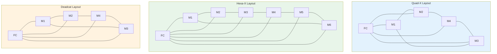
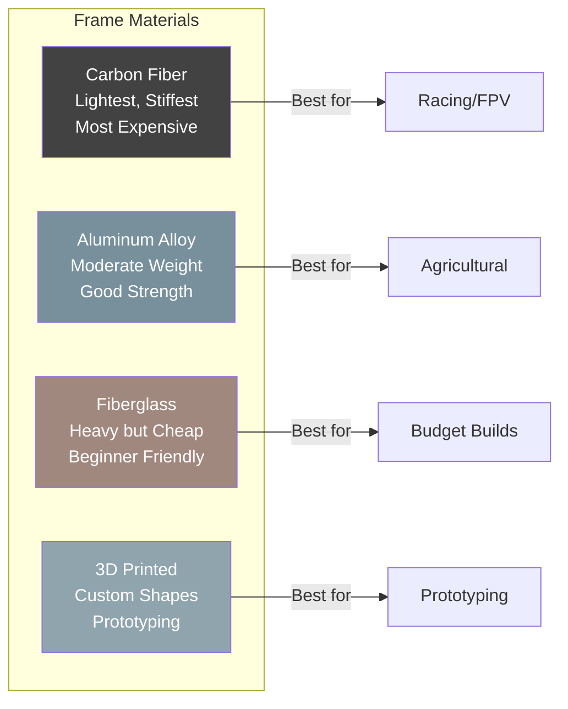

# Drone Frame Types & Selection Guide

## Multirotor Frame Configurations 


| Type | Motors | Use Case | Complexity |
|------|--------|----------|------------|
| **Quadcopter** | 4 | Racing, freestyle, cinematography | Low |
| **Hexacopter** | 6 | Redundancy, heavier payloads | Medium |
| **Octocopter** | 8 | Heavy-lift, professional cinema | High |

### Quadcopter Variants
- **Quad-X**: Symmetrical X-shape, most common, best for general flying
- **Quad-Plus (+)**: Cross configuration, easier yaw control, less common
- **Deadcat**: Widened front arms, camera clearance for cinematic rigs
- **Hybrid X/Deadcat**: Blended geometry for cinematic + agility

### Hexacopter & Octocopter
- **Hexa-X**: 6 motors in X pattern, motor-out redundancy
- **Hexa-Y6**: 3 arm pairs with coaxial top/bottom motors, compact but less efficient
- **Octa-X**: 8 motors, two motor failure tolerant
- **Octa-X8**: Coaxial 8, 4 arms, compact heavy-lift

---

## Frame Layout Comparison



### Motor Rotation Direction (Hexacopter)

```
        M2(CCW)          M1(CW)
           \              /
            \            /
     M3(CW) ----FC---- M6(CCW)
            /            \
           /              \
        M4(CCW)          M5(CW)
```

### Frame Material Comparison



---

## Frame Size Naming Convention

Frame size is typically named by the **propeller diameter** it supports:

| Size Label | Prop Diameter | Typical Use | Weight Class |
|------------|---------------|-------------|--------------|
| Micro/Toothpick | 31-65mm (1-2.5") | Indoor whoop | <50g |
| Mini | 65-120mm (2.5-5") | FPV racing, freestyle | 50-250g |
| Standard | 210-330mm (5-7") | Freestyle, long-range | 250-1000g |
| Large | 400-700mm (10-14") | Cinematic, survey | 1-5kg |
| X-Large | 700mm+ (14"+) | Agriculture, heavy-lift | 5-30kg+ |

### Wheelbase
**Wheelbase** = diagonal motor-to-motor distance, measured in millimeters.
- Directly determines maximum propeller size
- Example: 250mm wheelbase typically fits 5-6" props
- Larger wheelbase = more stable flight but larger transport footprint

---

## Frame Materials

### Carbon Fiber
- **Best strength-to-weight ratio** — industry standard
- Weave types: 3K twill (aesthetic), unidirectional (structural)
- Thickness: 1.5-3mm for arms, 2-4mm for plates
- Cost: $30-200+ depending on quality and size
- Susceptible to impact cracking at joints

### Aluminum
- **Budget option**, heavier than carbon
- Good for prototyping and heavy-lift industrial frames
- Easier to machine and modify
- Better impact resistance but poor vibration damping
- Common in agricultural drone frames (e.g., EFT E616P)

### Fiberglass (FR4/G10)
- **Lowest cost** structural material
- Flexible, absorbs vibration well
- Heavier than carbon fiber
- Common in budget kit frames
- Good for beginners building first drones

### Other Materials
- **TPU (3D printed)**: Crash-resistant, custom designs, arm braces
- **Wood/Bamboo**: DIY frames, surprisingly effective damping
- **Titanium**: Premium hardware (screws, standoffs), vibration resistant

---

## Frame Geometries

### X-Frame (Symmetric)
```
    M1        M2
      \      /
       \    /
        \  /
         \/
         /\
        /  \
       /    \
      /      \
    M4        M3
```
- Equal arm angles (90° between arms)
- **Most versatile** — symmetric flight characteristics
- Best for: racing, freestyle, general FPV
- Standard for most 5" builds

### Deadcat Frame
```
    M1          M2
      \          /
       \        /
        \      /
         ------
        /      \
       /        \
      /          \
    M4          M3
```
- Front arms wider apart, rear arms closer
- **Camera sits forward** without prop-in-view
- Best for: cinematic FPV, aerial photography
- Reduced yaw authority due to asymmetry

### H-Frame
```
  M1 ---- M2
  |        |
  |        |
  M4 ---- M3
```
- Arms form an H-shape, electronics in center
- **Maximum internal space** for components
- Best for: heavy-lift, agricultural, industrial
- Easy maintenance and component access

### Foldable Arms
- Arms pivot for **compact transport**
- Common in agricultural and commercial drones
- Locking mechanisms critical — vibrations can loosen
- Example: DJI Mavic series, EFT agricultural drones

---

## Agricultural Frame Considerations

### EFT E616P (Reference Frame)
- Foldable arm design, 16L tank capacity
- Aluminum/carbon hybrid construction
- Spray system integration mounts
- Typical 6-8 motor configuration
- Wheelbase: 1200-1600mm

### Key Agricultural Requirements
| Requirement | Specification |
|-------------|---------------|
| Payload capacity | 10-30kg (tank + liquid) |
| Foldable arms | Required for field transport |
| Vibration isolation | Critical for spray system |
| Redundancy | 6+ motors for motor-out capability |
| IP rating | IP54+ for dust/water resistance |
| Landing gear | Wide stance for stability on uneven ground |

---

## Selection Criteria

### 1. Payload Capacity
- Calculate: frame weight + battery + motors + payload
- Rule: total weight should be **50-70% of max thrust**
- Agricultural drones need 2-3x payload margin for tank weight changes during flight

### 2. Vibration Characteristics
- Carbon fiber dampens better than aluminum
- Arm thickness affects resonant frequency
- Mounting holes should use **silicone grommets**
- Gyro vibration filtering depends on frame stiffness

### 3. Transport Size
- Foldable arms: 50-70% reduction in transport volume
- Consider: car trunk, hiking, airline carry-on
- Fixed frames: simpler but bulkier

### 4. Repairability
- **Replaceable arms**: crash damage isolated to arm ($5-15 replacement)
- **Integrated arms**: stronger but total frame loss on break
- Check spare part availability before purchase

### 5. Component Mounting
- Standard mounting patterns: 20x20mm, 30x30mm (for FC/ESC stacks)
- Camera mount type: SMA, TPU, direct bolt
- Battery mounting: top plate, bottom plate, or side-mount
- Antenna mounting: SMA bulkhead, 3D printed

---

## Frame Selection by Use Case

| Use Case | Recommended Frame | Size | Key Features |
|----------|-------------------|------|--------------|
| FPV Racing | Minimal X | 3-5" | Low weight, rigid |
| Freestyle | Reinforced X | 5" | Crash-resistant arms |
| Cinematic | Deadcat/Hybrid | 5-7" | Camera clearance |
| Long Range | Extended X | 7" | Efficiency, battery space |
| Agriculture | H-frame/Foldable | 10"+ | Payload, foldable |
| Indoor/Micro | Whoop/Toothpick | 1-3" | Prop guards, lightweight |

---

## Popular Frame Manufacturers

| Brand | Specialty | Price Range |
|-------|-----------|-------------|
| TBS Source One | Budget FPV frames | $15-30 |
| ImpulseRC | High-end racing | $50-150 |
| iFlight | Cinematic/Freestyle | $30-100 |
| Hobbywing | Complete kits | $50-200 |
| EFT | Agricultural | $200-500 |
| DJI | Consumer/Prosumer | $100-2000+ |

---

## Sources & Further Reading

- **ligpower.com** — Frame specifications and agricultural solutions
- **grepow.com** — Multirotor frame configurations
- **getfpv.com** — FPV frame catalog and builds
- **oscarliang.com** — Frame selection guides and reviews
- **tytorobotics.com** — Industrial frame platforms
- **px4.io** — Supported frame configurations

---

## EFT E616P Build Connection

> **Our build uses the EFT E616P hexacopter frame.** All frame decisions in this document filter down to one choice.

| Parameter | EFT E616P Value | Source |
|---|---|---|
| Wheelbase | 1,644 mm | effort-tech.com (official) |
| Arm tube OD | 40 mm (T700 carbon) | effort-tech.com |
| Arm length (folding part) | 380 mm | store.effort-tech.com |
| Center body | ~300mm diameter | Derived from unfolded dims |
| Frame weight | 6,410 g | effort-tech.com |
| Tank capacity | 16 L (HDPE) | effort-tech.com |
| Max AUW | 36 kg (design), 45 kg (operational) | COEP Report |
| Foldable | Yes (cross-folding mechanism) | effort-tech.com |
| Landing gear | Retractable optional | effort-tech.com |
| Supply voltage | 12S LiPo | effort-tech.com |

**Why this frame won the weighted comparison (score 8.05/10):**
- Best balance of weight, strength, and price (₹18,000)
- Folding arms critical for field transport
- Belly-mount tank integration without custom fabrication
- Indian market availability with spare parts
- Individual arm replacement reduces repair costs

**⚠️ Critical finding from structural analysis:** The 25mm arm natural frequency (32 Hz) overlaps with motor shaft frequency at hover (32-36 Hz). **Upgrade to 30mm arm recommended** to shift resonance to 48 Hz (safe margin).

---

## Common Mistakes & Pitfalls

| Mistake | Consequence | Prevention |
|---|---|---|
| Choosing frame by price alone | Insufficient payload capacity | Calculate AUW first, then select frame |
| Ignoring vibration characteristics | Poor flight stability, video jello | Check arm stiffness, use vibration-dampened FC mount |
| Skipping transport size check | Can't fit in vehicle | Verify folded dimensions before purchase |
| Wrong wheelbase for props | Props hit frame or each other | Match wheelbase to prop diameter (1.8:1 ratio) |
| No foldable arms on ag drone | Can't transport to field | Always choose foldable for agricultural use |
| Ignoring tank mount points | Custom fabrication needed | Verify belly-mount compatibility |
| Buying carbon when aluminum suffices | Overpaying for weight savings | Carbon best for <10kg, aluminum for heavy-lift |

---

## Quick Troubleshooting

| Problem | Likely Frame Issue | Fix |
|---|---|---|
| Excessive vibration | Arm resonance, loose bolts | Tighten all bolts, check arm stiffness, upgrade arm diameter |
| Drifting in hover | CG off-center | Reposition battery, check component placement |
| Prop strike on frame | Wheelbase too small for prop | Verify 1.8:1 wheelbase-to-prop ratio |
| Arm cracking | Fatigue from vibration | Replace arm, check motor balance, add vibration damping |
| Tank leaking at mount | Poor fit, missing gaskets | Use vibration-isolated mounting brackets, add rubber gaskets |
| Can't transport | Frame too large when unfolded | Choose foldable arms, verify folded dimensions |

---

## Datasheet & Product Links

| Resource | URL |
|---|---|
| EFT E616P Official | https://effort-tech.com |
| EFT Store (India) | https://store.effort-tech.com |
| TBS Source One V5 | https://www.racedayquads.com/collections/frames |
| ImpulseRC frames | https://www.impulserc.com |
| iFlight frames | https://www.iflight-rc.com |
| Hobbywing frames | https://www.hobbywing.com |
| Oscar Liang frame guide | https://oscarliang.com/fpv-drone-guide/ |
| PX4 supported frames | https://docs.px4.io/main/en/airframes/airframe_reference.html |

---

*Enrichment added: May 29, 2026 | Template v1.0*
