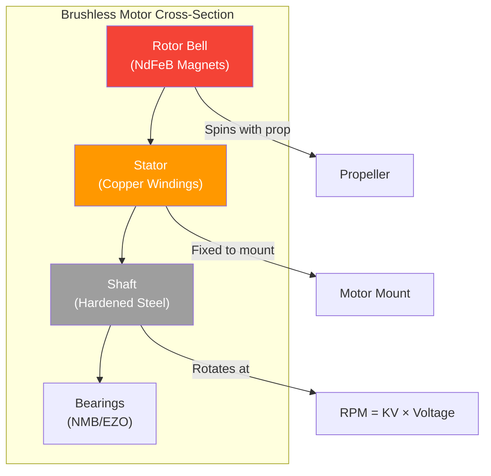

# Drone Motor Selection Guide

## BLDC Motor Basics

Brushless DC (BLDC) motors are the standard for modern multirotors. They use electronic commutation instead of mechanical brushes, providing higher efficiency and longer lifespan.

### Core Components
- **Stator**: Stationary windings (copper wire wrapped around laminated steel core)
- **Rotor**: Rotating permanent magnets (neodymium N52 grade typical)
- **Bell/Housing**: Outer can that holds magnets, spins with shaft
- **Shaft**: Output shaft connected to propeller adapter
- **Bearings**: Support shaft rotation (NMB, EZO, or ceramic bearings)

### How It Works
1. ESC sends 3-phase AC signal to stator windings
2. Electromagnetic field interacts with permanent magnets
3. Rotor spins to align with changing magnetic field
4. Hall sensors or back-EMF detects rotor position for timing

### BLDC Motor Cross-Section



---

## KV Rating Explained

**KV = RPM per Volt** (no-load, no propeller)

| KV Rating | Characteristics | Typical Use |
|-----------|-----------------|-------------|
| 50-200 KV | Slow spin, massive torque | Heavy-lift, industrial |
| 200-800 KV | Medium spin, balanced | Aerial photography, long-range |
| 800-1500 KV | Fast response | Freestyle, general FPV |
| 1500-2500 KV | Very fast spin | FPV racing |
| 2500+ KV | Maximum speed | Micro racing, indoor |

### KV and Voltage Relationship
```
RPM = KV × Voltage
Example: 1000KV × 22.2V (6S) = 22,200 RPM
Example: 2300KV × 14.8V (4S) = 34,040 RPM
```

**Key insight**: Higher voltage with lower KV = same RPM but more torque and efficiency.

---

## Stator Dimensions

Motor size is specified as **WWWW** format: **Stator Width × Stator Height** (in mm)

| Size | Width × Height | Weight | Thrust (6S) | Use Case |
|------|----------------|--------|-------------|----------|
| 1104 | 11mm × 4mm | 3-5g | 50-80g | Micro/Whoop |
| 1404 | 14mm × 4mm | 6-8g | 100-150g | Toothpick, 3" |
| 1507 | 15mm × 7mm | 12-15g | 200-300g | 3-4" lightweight |
| 2205 | 22mm × 5mm | 25-30g | 400-500g | 5" racing |
| 2207 | 22mm × 7mm | 30-35g | 500-700g | 5" freestyle |
| 2306 | 23mm × 6mm | 33-38g | 600-800g | 5" heavy |
| 2507 | 25mm × 7mm | 40-50g | 800-1000g | 5-6" cinematic |
| 2806.5 | 28mm × 6.5mm | 50-65g | 1000-1500g | 7" long-range |
| 2812 | 28mm × 12mm | 70-90g | 1500-2000g | 7-10" heavy |
| 3110 | 31mm × 10mm | 80-100g | 2000-2500g | 10" cinematic |
| 4014 | 40mm × 14mm | 120-180g | 3000-4000g | Agricultural |
| 5010+ | 50mm+ | 200g+ | 5000g+ | Heavy-lift industrial |

### Stator Dimensions Impact
- **Wider stator**: More copper = higher torque, better heat dissipation
- **Taller stator**: More magnetic flux = higher efficiency at lower RPM
- **Square ratio** (e.g., 2222): Balanced torque and efficiency

---

## Motor Sizing by Frame Size

| Frame Size | Prop | Recommended Motor | KV Range | Thrust/Prop |
|------------|------|-------------------|----------|-------------|
| 65mm Micro | 31mm | 0802-1103 | 15000-19000KV | 20-40g |
| 100mm | 2.5" | 1103-1104 | 11000-15000KV | 40-80g |
| 130mm | 3" | 1404-1507 | 3600-4500KV | 80-180g |
| 180mm | 4" | 2204-2305 | 2400-3200KV | 200-400g |
| 210-250mm | 5" | 2205-2306 | 1700-2600KV | 400-800g |
| 300-350mm | 6" | 2407-2506 | 1500-2100KV | 600-1000g |
| 350-450mm | 7" | 2806.5-2812 | 1100-1700KV | 800-1500g |
| 500-600mm | 10" | 3110-4014 | 700-1100KV | 1500-3000g |
| 700mm+ | 12-15" | 4014-5010 | 100-500KV | 3000-8000g |

---

## KV Ranges by Application

### Racing (5" Frame)
- **Motor**: 2205-2207, 2400-2800KV on 4S / 1700-2100KV on 6S
- **Goal**: Maximum RPM, aggressive throttle response
- **Trade-off**: Lower flight time, higher amp draw

### Freestyle (5" Frame)
- **Motor**: 2207-2306, 1700-2450KV
- **Goal**: Balanced power and efficiency
- **Trade-off**: Slightly less top speed than racing

### Cinematic/Long-Range (5-7" Frame)
- **Motor**: 2806.5-2812, 900-1500KV on 6S
- **Goal**: Maximum efficiency, smooth flight
- **Trade-off**: Slower acceleration

### Agricultural/Heavy-Lift (10"+ Frame)
- **Motor**: 4014-5010, 100-300KV on 12S-14S
- **Goal**: Maximum payload capacity, redundancy
- **Trade-off**: Large size, expensive

### Micro/Indoor (65-130mm Frame)
- **Motor**: 0802-1404, 7000-19000KV on 1S-4S
- **Goal**: Lightweight, responsive
- **Trade-off**: Limited outdoor capability

---

## Thrust-to-Weight Ratio

The **thrust-to-weight ratio** is the single most important motor selection metric.

| Ratio | Flight Characteristics | Use Case |
|-------|----------------------|----------|
| 1.5:1 | Barely flyable | Heavy cargo (not recommended) |
| 2:1 | Minimum acceptable | Slow cinematography |
| 3:1 | Good general performance | Freestyle, general FPV |
| 4:1 | Very agile | Aggressive freestyle |
| 5:1+ | Extreme performance | FPV racing |

### Calculation
```
Total Motor Thrust = Max thrust per motor × Number of motors
All-Up Weight (AUW) = Frame + Battery + Motors + FC/ESC + Camera + Payload

Thrust-to-Weight = Total Motor Thrust / AUW
```

### Example (5" Freestyle)
- Motors: 4× 2306 2450KV, each produces 1200g max thrust
- Total thrust: 4800g
- AUW: 650g (frame 120g + battery 180g + motors 140g + electronics 100g + camera 30g + misc 80g)
- **Ratio: 7.4:1** (excellent)

---

## Efficiency Metrics

### Grams per Watt (g/W)
The primary efficiency metric for motors:

| Efficiency | Rating | Description |
|------------|--------|-------------|
| <2.0 g/W | Poor | Heavy, inefficient setup |
| 2.0-4.0 g/W | Average | Acceptable for racing |
| 4.0-6.0 g/W | Good | Good for freestyle |
| 6.0-8.0 g/W | Excellent | Great for long-range |
| 8.0+ g/W | Outstanding | Specialized efficiency builds |

### Hover Efficiency
- Amount of thrust needed to hover = AUW
- Lower hover throttle = longer flight time
- Efficiency peaks at 30-50% throttle, drops at max throttle

### Current Draw at Hover
```
Hover Current = AUW / (g/W × Voltage)
Example: 650g / (6 g/W × 22.2V) = 4.9A hover current
```

---

## Premium Motor: Hobbywing X9 G2L

| Specification | Value |
|---------------|-------|
| Max Thrust | 24 kg |
| KV Rating | 110 KV |
| Voltage Range | 12S-14S (44.4-51.8V) |
| Recommended Prop | MFP 36×11 |
| Weight | ~1.53 kg |
| Application | Heavy-lift, agricultural, industrial |

### When to Use Industrial Motors
- Payload >5kg (spray tanks, cargo)
- Redundancy required (6+ motors)
- Long flight time needed (efficiency priority)
- Commercial operations (reliability over cost)

---

## Motor Selection Checklist

- [ ] Frame size determined → motor size range known
- [ ] Battery voltage (S count) selected → KV range narrowed
- [ ] Target thrust-to-weight ratio calculated
- [ ] Efficiency requirements matched (racing vs endurance)
- [ ] Mounting pattern compatible with frame (M3, M2.5)
- [ ] Shaft diameter matches prop adapter (5mm, 6mm, 8mm)
- [ ] Wire length sufficient for frame layout
- [ ] Budget allows for quality bearings (NMB/EZO)
- [ ] Spare motors available for replacement

---

## Sources & Further Reading

- **ligpower.com** — Motor specifications and selection guides
- **tmotor.com** — Premium motor catalog and thrust data
- **oscarliang.com** — Motor comparisons and real-world testing
- **zbotic.in** — Motor sizing charts and recommendations
- **rcgroups.com** — Community motor thrust data databases

---

## EFT E616P Build Connection

> **Our build uses 6× Hobbywing X9 G2L integrated motor+ESC units.**

| Parameter | X9 G2L Value | Source |
|---|---|---|
| KV Rating | 110 KV | hobbywing.com |
| Max Thrust | 24 kg (sea level) | hobbywing.com |
| Motor Body Diameter | 104 mm | hobbywing.com CAD |
| Motor Body Height | 53 mm | hobbywing.com CAD |
| Stator Size | 96 × 16 mm | hobbywing.com |
| Fan Diameter | 130 mm | hobbywing.com |
| Shaft OD | 14 mm | hobbywing.com CAD |
| Total Weight (with prop + cable) | 1,532 g ±10g | hobbywing.com |
| Weight (motor+ESC only) | ~1,245 g | Calculated |
| Input Voltage | 12S-14S (18–63V) | hobbywing.com |
| ESC Continuous | 30A | hobbywing.com |
| ESC Peak (3s) | 120A | hobbywing.com |
| IP Rating | IPX6 | hobbywing.com |
| Arm Tube Clamp | ⌀40.1mm bore | hobbywing.com CAD |
| Mount Pattern | 6× M3 on ⌀130.4mm PCD | hobbywing.com CAD |
| Power Cable | 12AWG, 1,000mm | hobbywing.com |
| Signal Cable | 1,090mm | hobbywing.com |
| Price | ₹32,000 each | hobbywing.com |

### Thrust-to-Weight Analysis for Our Build

| Config | Total Thrust | MTOW | TWR | SMF TWR | Hover Time |
|---|---|---|---|---|---|
| 36 kg | 120 kg | 36 kg | 3.33 | 2.44 | 47.2 min |
| 39.2 kg | 120 kg | 39.2 kg | 3.06 | 2.24 | 42.0 min |
| 45 kg | 120 kg | 45 kg | 2.67 | 1.96 | 34.6 min |
| 50 kg | 120 kg | 50 kg | 2.40 | — | — |

**Hover current per motor:** 11.9A (36 kg) to 16.5A (45 kg)

---

## Common Mistakes & Pitfalls

| Mistake | Consequence | Prevention |
|---|---|---|
| Mismatching KV to battery voltage | Motor burns out or underperforms | Use KV-voltage matrix: 100-200KV for 12S |
| Ignoring thrust-to-weight ratio | Drone can't lift payload | Calculate TWR > 2.0 for safe operation |
| Not checking motor direction | Drone flips on takeoff | Verify CW/CCW before first flight |
| Using wrong prop for motor | Overloaded motor, overheating | Match motor KV to prop size per datasheet |
| Buying counterfeit motors | Failed bearings, wrong specs | Buy from authorized dealers only |
| Ignoring IP rating for ag drones | Water/dust damage during spraying | Use IPX5+ rated motors |
| Not checking mounting pattern | Can't attach to frame | Verify bolt pattern matches frame arm |

---

## Quick Troubleshooting

| Problem | Likely Motor Issue | Fix |
|---|---|---|
| Motor overheating | Props too large, KV too low for battery | Reduce prop size, check KV-voltage match |
| Unusual vibration | Bent shaft, damaged bearings | Check bell runout, replace bearings |
| Motor desync | ESC timing wrong, low throttle | Update ESC firmware, check motor wires |
| Motor not spinning | ESC not calibrated, broken wire | Calibrate ESC, check phase wires |
| Reduced thrust | Worn bearings, magnet degradation | Replace motor, check for cracks |
| Clicking/grinding | Debris in motor, bearing failure | Clean motor, replace bearings |

---

## Datasheet & Product Links

| Resource | URL |
|---|---|
| Hobbywing X9 G2L Official | https://www.hobbywing.com/en/products/x9-g2l |
| Hobbywing X9 G2L CAD Drawings | https://hobbywing.com (product page → downloads) |
| T-Motor U8 Lite | https://www.tmotor.com |
| MAD Motors | https://www.mad-motors.com |
| Oscar Liang motor guide | https://oscarliang.com/motor-guide/ |
| Thrust curve database | https://www.rcgroups.com/forums/showthread.php?1321079 |
| Motor KV calculator | https://www.motorcalc.com |

---

*Enrichment added: May 29, 2026 | Template v1.0*
