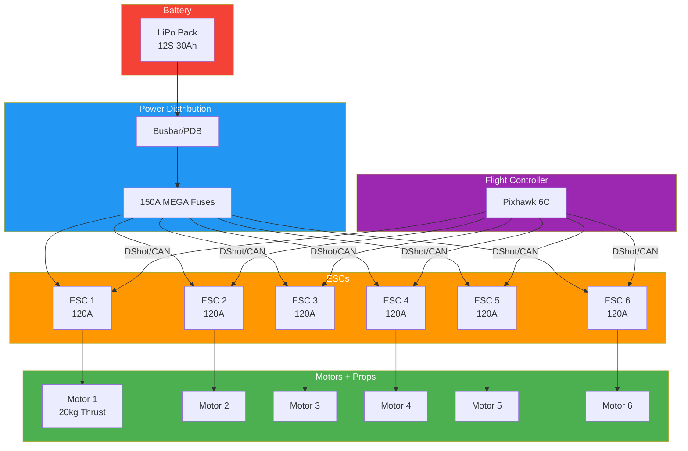
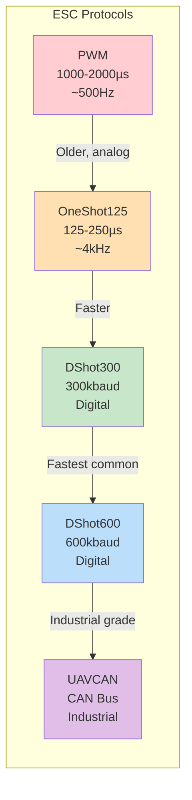

# ESC Selection & Protocols Guide

## ESC Function

The Electronic Speed Controller (ESC) is the bridge between the flight controller and the motor. It converts DC battery power into 3-phase AC signal to drive brushless motors.

### How It Works
1. Receives throttle command from flight controller
2. Converts DC battery voltage to 3-phase AC
3. Commutates phases in sequence to spin motor
4. Adjusts frequency/amplitude to control speed
5. Reads back-EMF or Hall sensors for rotor position

### Core Components
- **MOSFETs**: Power transistors that switch current (typically 6 per ESC)
- **MCU**: Microcontroller running firmware (STM32, EFM8, AT32)
- **Capacitors**: Filter voltage spikes, protect electronics
- **Voltage regulator**: Powers MCU from main battery
- **Current sensor**: Monitors amp draw (optional on some ESCs)

---

## ESC System Architecture



### ESC Protocol Speed Comparison



## ESC Form Factors

### Single ESC (Per Motor)
```
Motor 1 ←→ ESC 1
Motor 2 ←→ ESC 2
Motor 3 ←→ ESC 3
Motor 4 ←→ ESC 4
```
- **Mounting**: Direct to frame arms or motor mount
- **Pros**: Individual replacement, distributed weight, better cooling
- **Cons**: More wiring, harder to clean up
- **Use**: Large builds, agricultural, where individual service matters

### 4-in-1 ESC Stack
```
┌─────────────────┐
│  ESC 1 │ ESC 2 │
│─────────────────│
│  ESC 3 │ ESC 4 │
└─────────────────┘
```
- **Mounting**: Sits under flight controller in a stack
- **Pros**: Clean wiring, compact, lighter total weight
- **Cons**: Single point of failure, one bad ESC = replace whole board
- **Use**: FPV racing, freestyle, most consumer builds

### All-in-One (AIO)
- Flight controller and ESC on single board
- **Pros**: Maximum weight savings, simplest build
- **Cons**: No modularity, high-density thermal concerns
- **Use**: Micro builds, toothpick frames

---

## ESC Mounting Patterns

| Pattern | Dimensions | Typical Use |
|---------|------------|-------------|
| 20×20mm | 20mm hole spacing | Micro, 3" builds |
| 25.5×25.5mm | 25.5mm spacing | Whoop, 1S-3S builds |
| 30×30mm | 30mm hole spacing | Standard 5"+ builds |
| 36.5×36.5mm | 36.5mm spacing | Larger boards |
| Custom | Varies | Industrial, agricultural |

### Stack Height
- Standard: 30.5×30.5mm M3 hardware
- Micro: 20×20mm M2 hardware
- Standoffs: 5-10mm height between FC and ESC
- Use rubber grommets for vibration isolation

---

## ESC Protocols

### PWM (Pulse Width Modulation)
- **Speed**: 50-490Hz update rate
- **Signal**: 1000-2000μs pulse width
- **Status**: Legacy, not recommended for new builds
- **Latency**: 2-10ms

### OneShot125
- **Speed**: 2-8kHz update rate
- **Signal**: 125-250μs pulse width
- **Status**: Legacy, supported by older firmware
- **Latency**: 0.125-0.5ms
- **Improvement**: 2-8x faster than PWM

### OneShot42
- **Speed**: Up to 8kHz
- **Signal**: 42-84μs pulse width
- **Status**: Rare, mostly obsolete
- **Latency**: <0.125ms

### DShot (DigitalShot)
| Protocol | Speed | Resolution | Status |
|----------|-------|------------|--------|
| DShot150 | 150kbit/s | 11-bit (0-2047) | Minimum for digital |
| DShot300 | 300kbit/s | 11-bit | Good balance |
| DShot600 | 600kbit/s | 11-bit | **Most common** |
| DShot1200 | 1200kbit/s | 11-bit | Maximum speed |

**DShot Advantages over analog protocols:**
- Digital signal — no calibration needed
- Built-in telemetry requests
- Direction commands (DShot commands)
- RPM filtering support
- Error detection (CRC)

### DShot Commands
| Command | ID | Function |
|---------|-----|----------|
| DShot Command 1 | 1 | Direction reverse |
| DShot Command 2 | 2 | 3D mode (reversible) |
| DShot Command 7 | 7 | Save settings |
| DShot Command 8 | 8 | LED control |
| DShot Command 16 | 16 | Status telemetry |

### UAVCAN (DroneCAN)
- **Speed**: 1MHz CAN bus
- **Protocol**: Packet-based, bidirectional
- **Status**: Industrial standard (PX4, ArduPilot)
- **Advantages**: Long wire runs, multiple devices, robust error handling
- **Use**: Professional, industrial, agricultural drones

---

## ESC Firmware

### BLHeli_S
- **MCU**: EFM8BB10/21 (8-bit)
- **Features**: Basic DShot, Oneshot, PWM
- **DShot support**: Up to DShot600
- **RPM filtering**: Limited (betaflight-rpm-filter branch)
- **Status**: Legacy, widely supported
- **Best for**: Budget builds, older hardware

### BLHeli_32
- **MCU**: STM32 (32-bit ARM)
- **Features**: Full DShot, telemetry, RPM filtering
- **DShot support**: Up to DShot1200
- **RPM filtering**: Full support
- **Status**: Mature, reliable
- **Best for**: Performance builds, reliability critical

### AM32
- **MCU**: STM32 (32-bit ARM)
- **Features**: Open-source BLHeli_32 alternative
- **DShot support**: Full DShot1200
- **RPM filtering**: Full support
- **Status**: Active development, community-driven
- **Best for**: Open-source preference, custom builds

### BlueJay
- **MCU**: EFM8BB (8-bit)
- **Features**: Open-source BLHeli_S replacement
- **DShot support**: Up to DShot600
- **RPM filtering**: Betaflight-rpm-filter branch
- **Status**: Active, community-driven
- **Best for**: Budget builds wanting open-source firmware

### Firmware Comparison

| Feature | BLHeli_S | BLHeli_32 | AM32 | BlueJay |
|---------|----------|-----------|------|---------|
| MCU | 8-bit | 32-bit | 32-bit | 8-bit |
| Max DShot | 600 | 1200 | 1200 | 600 |
| RPM Filter | Limited | Yes | Yes | Limited |
| Telemetry | Basic | Full | Full | Basic |
| Open Source | No | No | Yes | Yes |
| Price | Budget | Premium | Budget | Budget |

---

## Current Rating

The ESC must handle the motor's maximum current draw with safety margin.

### Calculation
```
Motor max current: Look up motor specs (e.g., 40A)
Safety margin: 1.5× recommended
Required ESC rating: 40A × 1.5 = 60A per motor
```

### Common Current Ratings

| ESC Rating | Typical Motor | Use Case |
|------------|---------------|----------|
| 12-20A | 0802-1104 | Micro/Whoop |
| 25-35A | 1404-1507 | 3-4" builds |
| 45-55A | 2205-2306 | 5" racing/freestyle |
| 60-80A | 2407-2812 | 5-7" heavy |
| 80-120A | 3110+ | 10"+ agricultural |
| 150A+ | Industrial | Heavy-lift multi-rotor |

### Burst vs Continuous
- **Continuous**: Current ESC can handle indefinitely (e.g., 45A)
- **Burst**: Current ESC can handle for 10-30 seconds (e.g., 55A)
- **Always size for continuous rating** — burst is for throttle punches

---

## Voltage Rating

ESC voltage rating must match or exceed battery S count.

| S Count | Voltage Range | Typical ESC Rating |
|---------|---------------|---------------------|
| 1S | 2.5-4.2V | 1-2S rated |
| 2S | 7.4-8.4V | 2-3S rated |
| 4S | 14.8-16.8V | 4S rated |
| 6S | 22.2-25.2V | 6S rated |
| 12S | 44.4-50.4V | 12S rated |
| 14S | 51.8-58.8V | 14S rated |

**Rule**: ESC voltage rating should exceed battery max voltage (fully charged).

---

## ESC Features

### Telemetry
- Real-time data: voltage, current, temperature, RPM
- DShot telemetry: bidirectional on DShot protocols
- Current sensors: inline shunt resistors
- Useful for: battery management, motor health monitoring

### Dynamic Braking
- Actively slows motor when throttle reduced
- Improves throttle response and braking
- Critical for: 3D flying, acrobatics
- Can cause voltage spikes — adequate capacitance required

### RPM Filtering
- ESC reports actual motor RPM to flight controller
- Flight controller notches out motor RPM harmonics from gyro
- **Significantly reduces vibration** in flight controller data
- Requires: BLHeli_32/AM32 + DShot bidirectional
- Recommended for all builds

### Startup Behavior
- Soft start: gradual throttle ramp on power-up
- Programming: via BLHeli Suite, AM32 Configurator
- Direction: normal or reversed (DShot command)
- Timing advance: affects motor smoothness and efficiency

---

## ESC Selection Checklist

- [ ] Current rating ≥ motor max draw × 1.5
- [ ] Voltage rating ≥ battery max voltage
- [ ] Mounting pattern matches frame (20×20, 30×30)
- [ ] Firmware compatible with flight controller
- [ ] DShot protocol supported at desired speed
- [ ] Telemetry enabled (if needed)
- [ ] Current sensor present (recommended)
- [ ] Capacitor pads available (for voltage filtering)
- [ ] Wire gauge sufficient for current (12-14AWG typical)
- [ ] Heat dissipation adequate (airflow, heatsink)

---

## ESC Wiring Overview

```
Battery (+) ──→ ESC Battery Pads
Battery (-) ──→ ESC Ground Pads

ESC Motor A ──→ Motor Phase A (usually black/white wire)
ESC Motor B ──→ Motor Phase B (usually blue wire)
ESC Motor C ──→ Motor Phase C (usually yellow wire)

ESC Signal ──→ FC Motor Output (3-pin: Signal, GND, VCC)
ESC Telemetry ──→ FC Telemetry UART (optional)
```

### Wire Gauge Guide
| Current | Minimum Wire Gauge |
|---------|-------------------|
| <20A | 18-20 AWG |
| 20-40A | 16-18 AWG |
| 40-80A | 14-16 AWG |
| 80-120A | 12-14 AWG |
| 120A+ | 10-12 AWG or bus bars |

---

## Sources & Further Reading

- **px4.io** — ESC protocol specifications and UAVCAN integration
- **oscarliang.com** — ESC comparisons, firmware guides, and builds
- **mattyfleisch.com** — DShot protocol deep dive
- **bharathcomponents.com** — ESC selection guides and specs
- **blhelisuite.com** — BLHeli_S/32 configuration
- **github.com/am32-firmware** — AM32 open-source ESC firmware

---

## EFT E616P Build Connection

> **Our build uses Hobbywing X9 G2L integrated motor+ESC units.** The ESC is built into the motor base — no separate ESC purchase needed.

| Parameter | X9 G2L ESC Value | Source |
|---|---|---|
| Integration | Built into motor base | hobbywing.com |
| Continuous Current | 30A | hobbywing.com |
| Peak Current (3s) | 120A | hobbywing.com |
| Protocol | Cyphal (UAVCAN) + HWCAN | hobbywing.com |
| Throttle Signal | PWM + CAN (dual redundant) | hobbywing.com |
| PWM Pulse Width | 1,050–1,950 μs | hobbywing.com |
| Failure Logging | 1–24 hr black box | hobbywing.com |
| Total System Weight | 1,532g (ESC + motor + cable + prop) | hobbywing.com |

### Why Integrated ESC Matters for Agricultural Drones
- Fewer failure points (no separate ESC wire connections)
- Shorter signal path = better noise immunity
- IPX6 rating matches motor protection
- Built-in telemetry via CAN bus

### ArduPilot ESC Configuration
```
MOT_PWM_TYPE = 5        (DShot600 for non-X9 builds)
CAN_D1_PROTOCOL = 1     (DroneCAN for X9 G2L)
DSHOT_ONESHOT = 1       (Bidirectional DShot)
```

---

## Common Mistakes & Pitfalls

| Mistake | Consequence | Prevention |
|---|---|---|
| ESC current rating too low | ESC burns out under load | Size ESC at motor max × 1.5 safety margin |
| Wrong voltage rating | ESC voltage breakdown | ESC voltage must exceed fully charged battery |
| Mismatched ESC protocols | Motors won't respond | Verify DShot/CAN compatibility with FC firmware |
| No pre-charge on 12S | Connector welding, inrush damage | Install pre-charge circuit (>12S mandatory) |
| Poor ESC cooling | Thermal shutdown | Mount with airflow, use thermal pads |
| Firmware mismatch | Motor desync, oscillation | Use same firmware version on all ESCs |
| Ignoring CAN bus termination | Intermittent communication | 120Ω resistor at each CAN bus end |

---

## Quick Troubleshooting

| Problem | Likely ESC Issue | Fix |
|---|---|---|
| Motor desync | ESC timing wrong, low throttle startup | Update firmware, check motor wiring, increase startup power |
| ESC beeping continuously | No FC signal, wrong protocol | Check signal wire, verify DShot/CAN config |
| ESC overheating | Current exceeding rating, poor airflow | Reduce load, add heatsink, check motor efficiency |
| Motor cogging at startup | ESC startup power too low | Increase STARTUP_POWER in BLHeli/AM32 |
| Intermittent motor cutout | Loose signal wire, EMI | Resolder connections, add ferrite chokes |
| ESC not detected on CAN | Wrong node ID, termination missing | Check CAN_H/CAN_L wiring, add 120Ω termination |

---

## Datasheet & Product Links

| Resource | URL |
|---|---|
| Hobbywing X9 G2L (integrated ESC) | https://www.hobbywing.com/en/products/x9-g2l |
| BLHeli_32 firmware | https://www.blheli32.com |
| AM32 firmware | https://github.com/AM32-ESC/AM32 |
| BlueJay firmware | https://github.com/BluejayFirmware/Bluejay |
| DShot protocol spec | https://mattyfleisch.com/dshot-protocol |
| Oscar Liang ESC guide | https://oscarliang.com/esc-guide/ |

---

*Enrichment added: May 29, 2026 | Template v1.0*
