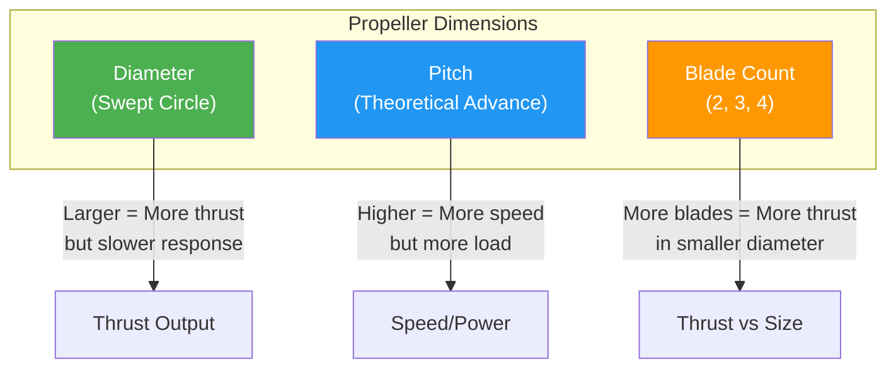

# Propeller Selection Guide

## Propeller Fundamentals

Propellers convert rotational energy from motors into thrust by accelerating air downward. The three primary design parameters are diameter, pitch, and blade count.

### How Propellers Generate Thrust
1. Motor spins propeller at high RPM
2. Blade angle (pitch) pushes air downward
3. Pressure differential creates lift/thrust
4. Newton's third law: air pushed down → propeller pushed up

---

## Propeller Geometry



## Diameter

**Diameter** = tip-to-tip measurement of the full propeller circle (inches or mm)

### Effects of Diameter
| Larger Diameter | Smaller Diameter |
|-----------------|------------------|
| More thrust per RPM | Less thrust per RPM |
| Higher efficiency at low RPM | Higher RPM needed for same thrust |
| Slower throttle response | Faster throttle response |
| More stable in hover | More agile, faster response |
| Requires more torque | Less torque required |

### Diameter Guidelines
| Frame Size | Typical Diameter | Reason |
|------------|------------------|--------|
| 65mm Micro | 31mm (1.2") | Weight constrained |
| 100mm | 2.5" (65mm) | Balance of thrust/response |
| 130mm | 3" (76mm) | Racing micro |
| 210-250mm | 5" (127mm) | Standard FPV |
| 300-400mm | 6-7" (152-178mm) | Long-range |
| 500mm+ | 10-15" (254-381mm) | Agricultural/heavy-lift |

---

## Pitch

**Pitch** = theoretical distance propeller would travel in one revolution (inches)

### Pitch Effects
| Higher Pitch | Lower Pitch |
|--------------|-------------|
| More speed/thrust at same RPM | Less speed/thrust at same RPM |
| Higher motor load | Lower motor load |
| More amp draw | Less amp draw |
| Better for fast forward flight | Better for hovering/efficiency |
| More "bite" in air | Smoother, less aggressive |

### Pitch-to-Diameter Ratio
| Ratio | Characteristics | Use Case |
|-------|-----------------|----------|
| <0.5 | Very efficient, slow | Hovering, survey |
| 0.5-0.7 | Balanced | General FPV |
| 0.7-0.9 | Speed-oriented | Racing, freestyle |
| >0.9 | Maximum speed | Speed runs |

### Common Pitch Values
- **3" props**: 1.5-2.5" pitch typical
- **5" props**: 3-5" pitch typical
- **7" props**: 3.5-5" pitch typical
- **10"+ props**: 4-7" pitch typical

---

## Blade Count

### 2-Blade Props
- **Most efficient** configuration
- Lowest drag, highest g/W
- Standard for: racing, freestyle, long-range
- Best for: maximum flight time

### 3-Blade Props
- ~15-20% more thrust than 2-blade at same diameter
- Higher drag, slightly less efficient
- Better for: cinematic where smaller diameter needed
- Good for: moderate performance builds

### 4-Blade Props
- ~30-40% more thrust than 2-blade at same diameter
- Highest drag, lowest efficiency per blade
- Good for: maximum thrust in constrained diameter
- Use: racing where frame size limits prop diameter

### 5+ Blade Props
- Rarely used in multirotors
- More for specialized applications (e.g., quiet operation)
- Diminishing returns beyond 4 blades

### Blade Count Comparison
| Blades | Relative Thrust | Relative Efficiency | Best Use |
|--------|-----------------|---------------------|----------|
| 2 | Baseline | 100% | Racing, efficiency |
| 3 | +15-20% | 80-85% | Cinematic, balanced |
| 4 | +30-40% | 65-75% | High thrust, small frame |

---

## Numbering Convention

Propellers are labeled as **Diameter × Pitch** (inches)

### Examples
| Label | Diameter | Pitch | Notes |
|-------|----------|-------|-------|
| 5×3 | 5 inches | 3 inches | Low-pitch, efficient |
| 5×4.5 | 5 inches | 4.5 inches | Balanced |
| 5×5.3 | 5 inches | 5.3 inches | High-pitch, fast |
| 7×3.5 | 7 inches | 3.5 inches | Long-range efficient |
| 3×2 | 3 inches | 2 inches | Micro racing |
| 10×4.5 | 10 inches | 4.5 inches | Agricultural |

### Additional Markings
- **CW/CCW**: Clockwise or counter-clockwise rotation
- **R**: Reverse rotation (some manufacturers)
- **V**: Version or revision number
- **Material code**: CF (carbon), NYL (nylon), etc.

---

## Propeller Materials

### Carbon Fiber
- **Best performance**: rigid, efficient, lightweight
- Vibration characteristics: minimal flex, clean signal
- Durability: brittle on impact, shatters rather than bends
- Cost: $8-25 per pair
- Best for: racing, performance builds
- Manufacturing: molded carbon fiber sheets

### Nylon (Plastic)
- **Budget option**: flexible, forgiving on crashes
- Vibration characteristics: more flex, introduces noise
- Durability: bends before breaking, survives crashes
- Cost: $2-8 per pair
- Best for: beginners, freestyle where crashes expected
- Note: less efficient than carbon

### Carbon-Reinforced Nylon
- **Middle ground**: carbon fiber strands in nylon matrix
- Vibration: moderate stiffness
- Durability: better than pure carbon on impact
- Cost: $5-15 per pair
- Best for: general use, balance of performance and durability

### Wood (Baltic Birch)
- **Traditional**: used in vintage and agricultural builds
- Vibration: excellent damping properties
- Durability: moderate, repairable
- Cost: $3-10 per set
- Best for: agricultural, vintage, DIY builds

---

## Folding Propellers

### Design
- Blades pivot on hub, fold inward when not spinning
- Spring or centrifugal force extends blades at speed
- Hub contains pivot mechanism and balance weights

### Advantages
- **Compact transport**: 50-70% size reduction
- **Reduced damage**: folded blades less likely to break in transport
- **VTOL aircraft**: essential for tilt-rotor designs
- **Agricultural**: easier field transport

### Disadvantages
- More complex, potential failure points
- Slightly less efficient than fixed props
- Higher cost
- Require balancing after installation

### Common Folding Prop Sizes
| Size | Application | Folded Diameter |
|------|-------------|-----------------|
| 12" folding | Long-range VTOL | ~180mm |
| 18" folding | Agricultural | ~280mm |
| 24"+ folding | Heavy-lift | ~400mm+ |

---

## Prop-Motor Matching

The relationship between motor KV, propeller size, and performance is critical.

### Low KV + Large Propeller
```
Example: 300KV motor + 18" propeller
- High torque, low RPM
- Excellent efficiency
- Maximum thrust per watt
- Slow response time
Best for: agriculture, heavy-lift, long-endurance
```

### High KV + Small Propeller
```
Example: 2500KV motor + 5" propeller
- Low torque, high RPM
- Lower efficiency
- Fast acceleration and response
- Maximum speed potential
Best for: racing, aggressive freestyle
```

### Matching Table
| Motor KV | Prop Size | Pitch | Result |
|----------|-----------|-------|--------|
| 100-200 | 18-24" | 5-7" | Heavy-lift efficiency |
| 300-500 | 12-15" | 4-6" | Aerial photography |
| 700-1100 | 8-10" | 4-5" | Long-range cruiser |
| 1500-2000 | 5-6" | 4-5" | Freestyle/cinematic |
| 2000-2500 | 5" | 4.5-5.3" | Racing |

---

## Common Propeller Sizes by Application

### Micro (31-65mm)
| Prop | Motor | Frame | Use |
|------|-------|-------|-----|
| 31mm | 0802-1103 | 65mm Whoop | Indoor racing |
| 2.5" | 1103-1104 | 100mm | Indoor/outdoor |
| 3" | 1404-1507 | 130mm | Micro FPV |

### Standard (100-178mm)
| Prop | Motor | Frame | Use |
|------|-------|-------|-----|
| 4" | 2204-2305 | 180mm | Lightweight FPV |
| 5" | 2205-2306 | 210-250mm | Freestyle, racing |
| 6" | 2407-2506 | 300mm | Long-range |

### Large (178-381mm)
| Prop | Motor | Frame | Use |
|------|-------|-------|-----|
| 7" | 2806.5-2812 | 350-400mm | Long-range, cinematic |
| 8" | 2812-3110 | 450mm | Heavy lift, survey |
| 10" | 3110-4014 | 500-600mm | Agricultural, cinema |
| 12-15" | 4014-5010 | 700mm+ | Heavy-lift industrial |

---

## Propeller Balance & Maintenance

### Why Balance Matters
- Unbalanced props cause vibrations
- Vibrations reduce image quality (jello effect)
- Vibrations cause gyro noise
- Reduces bearing and motor lifespan

### Balancing Method
1. Mount prop on balancing rod (or vertical shaft)
2. Note which side falls (heavier side)
3. Sand or add tape to lighter side
4. Repeat until prop stays level

### Inspection Checklist
- [ ] No cracks or chips on blade edges
- [ ] Hub hole not elongated
- [ ] No bend in blade profile
- [ ] Spinner/boss flat and undamaged
- [ ] CW/CCW marked correctly

### Storage
- Store flat, not stacked under pressure
- Avoid direct sunlight (UV degrades nylon)
- Keep away from solvents and chemicals
- Use prop organizer for transport

---

## Propeller Selection Checklist

- [ ] Diameter fits frame (clearance from frame and camera)
- [ ] Pitch matched to motor KV and battery voltage
- [ ] Blade count appropriate for application
- [ ] Rotation direction matches motor (CW/CCW)
- [ ] Hub bore matches motor shaft (5mm, 6mm, 8mm)
- [ ] Material suited to flying style (CF for performance, nylon for crashes)
- [ ] Weight acceptable for target AUW
- [ ] Balanced before installation
- [ ] Spare set available (props break frequently)
- [ ] Pitcher/prop tool available for field changes

---

## Sources & Further Reading

- **tmotor.com** — Propeller specifications and thrust data
- **getfpv.com** — Propeller catalog and reviews
- **oscarliang.com** — Prop selection guides and motor matching
- **apc-propellers.com** — Industrial propeller data and calculators
- **masterairscrew.com** — FPV propeller manufacturer

---

## EFT E616P Build Connection

> **Our build uses Hobbywing MFP 36×11 folding propellers.**

| Parameter | MFP 36×11 Value | Source |
|---|---|---|
| Diameter | 927.1 mm (tip-to-tip unfolded) | hobbywing.com CAD |
| Pitch | 11 inches | hobbywing.com |
| Blade Count | 2 (folding pair) | hobbywing.com |
| Material | Carbon-Nylon composite | hobbywing.com |
| Hub Height | 34.7 mm | hobbywing.com CAD |
| Hub Width | 26.5 mm | hobbywing.com CAD |
| Hub Bore | ⌀14 mm | hobbywing.com CAD |
| Bolt Circle | ⌀31 mm (4× M4) | hobbywing.com CAD |
| Total Weight | 287g (set with adapter) | hobbywing.com |
| Single Blade Weight | 82g | hobbywing.com |
| RPM Range | 1,500–3,500 | hobbywing.com |
| Max RPM | 4,150 | hobbywing.com |
| Recommended Thrust | 4–14.5 kg | hobbywing.com |
| Max Thrust | 25 kg | hobbywing.com |
| Efficiency | 8.2 g/W | hobbywing.com |
| Price | ₹4,500 each | hobbywing.com |

### Why MFP 36×11 Was Selected
- Folding design reduces transport size by 60% (critical for field ops)
- Best efficiency in class (8.2 g/W) → longer flight time
- Perfect match with X9 G2L motor mounting (⌀40mm clamp)
- Carbon fiber construction for durability
- Low vibration reduces airframe stress

### Prop-Motor Match Verification
- X9 G2L: 110KV at 12S = 4,884 RPM (no-load)
- MFP 36×11 recommended RPM: 1,600–3,500
- **Match confirmed** — operating RPM within recommended range

---

## Common Mistakes & Pitfalls

| Mistake | Consequence | Prevention |
|---|---|---|
| Wrong rotation direction (CW/CCW) | Drone flips on takeoff | Match prop marking to motor rotation |
| Incorrect pitch for motor KV | Motor overloaded or underperforming | Use KV-prop matching table |
| Not balancing props | Excessive vibration | Balance all props before first flight |
| Damaged blade tips | Reduced efficiency, vibration | Inspect before each flight, replace if chipped |
| Wrong hub bore | Can't mount on motor | Verify ⌀14mm bore matches X9 G2L shaft |
| Not using folding props on ag drone | Can't transport to field | Always choose folding for agricultural |

---

## Quick Troubleshooting

| Problem | Likely Prop Issue | Fix |
|---|---|---|
| Excessive vibration | Unbalanced prop, damaged blade | Balance prop, replace if damaged |
| Reduced flight time | Wrong pitch, damaged blades | Verify pitch matches motor, inspect blades |
| Motor running hot | Prop too large or pitch too high | Downsize prop or reduce pitch |
| Prop coming loose | Wrong thread direction | Verify CW/CCW thread matches motor |
| Uneven wear on blades | Motor shaft bent, mounting loose | Check motor shaft, tighten hub bolts |
| Noise during flight | Prop not seated properly | Reseat prop, check hub bore fit |

---

## Datasheet & Product Links

| Resource | URL |
|---|---|
| Hobbywing MFP 36×11 Official | https://www.hobbywing.com/en/products/x9-g2l |
| Hobbywing Prop CAD | https://hobbywing.com (product page → downloads) |
| T-Motor GFC 3612 | https://www.tmotor.com |
| APC propeller calculator | https://www.apc-propellers.com/techsection/propSelection.htm |
| Oscar Liang prop guide | https://oscarliang.com/propeller-guide/ |
| MasterAirScrew | https://www.masterairscrew.com |

---

*Enrichment added: May 29, 2026 | Template v1.0*
