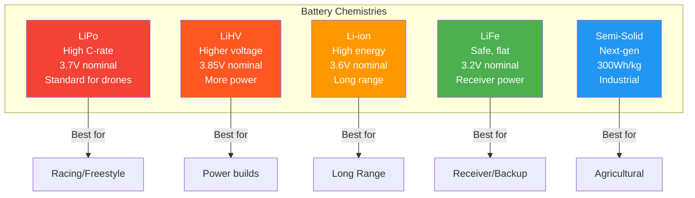

# Drone Battery Selection Guide

## Battery Chemistry Types



### LiPo Voltage Levels

```
Full Charge (4.2V/cell) ──── 100% ████████████████████
  │
  ├─ Nominal (3.7V/cell) ──── ~50% ████████████
  │
  ├─ Storage (3.85V/cell) ──── ~60% ██████████████
  │
  ├─ Warning (3.5V/cell) ──── ~15% ████
  │
  └─ CUTOFF (3.3V/cell) ──── DO NOT GO BELOW
```

### LiPo (Lithium Polymer)
- **Standard** for FPV and consumer drones
- Energy density: 150-200 Wh/kg
- Cycle life: 200-300 cycles
- Self-discharge: 1-3% per month
- Temperature range: 0-45°C charging, -20-60°C discharging
- Cost: $15-80 typical for drone packs

### LiHV (High Voltage Lithium Polymer)
- Higher per-cell voltage: 4.35V nominal (vs 3.7V LiPo)
- Full charge: 4.35V per cell (vs 4.2V LiPo)
- ~5-10% more energy than equivalent LiPo
- Requires HV-compatible charger
- Slightly reduced cycle life
- Use: FPV racing where every bit of performance counts

### Li-ion (Lithium Ion)
- Cylindrical cells (18650, 21700)
- Energy density: 200-270 Wh/kg (higher than LiPo)
- Lower C-rating: typically 5-15C continuous
- Better cycle life: 500-1000 cycles
- Better cold weather performance
- Use: long-range builds, endurance flights
- Common cells: Samsung 30Q, Sony VTC6, Molicel P28A

### LiFe (Lithium Iron Phosphate)
- Nominal voltage: 3.2V per cell
- Very safe chemistry (thermal runaway >270°C)
- Flat discharge curve
- Heavy for capacity
- Lower energy density: 90-120 Wh/kg
- Use: battery backup, FPV goggles, transmitter batteries

### Chemistry Comparison

| Chemistry | Energy Density | C-Rating | Cycle Life | Weight | Safety |
|-----------|---------------|----------|------------|--------|--------|
| LiPo | 150-200 Wh/kg | 25-100C | 200-300 | Medium | Moderate |
| LiHV | 170-210 Wh/kg | 25-100C | 150-250 | Medium | Moderate |
| Li-ion | 200-270 Wh/kg | 5-15C | 500-1000 | Light | Good |
| LiFe | 90-120 Wh/kg | 10-25C | 1000+ | Heavy | Excellent |

---

## Voltage

### Nominal Voltage
```
Nominal Voltage = Cells in Series (S) × 3.7V (LiPo)
Example: 6S = 6 × 3.7V = 22.2V nominal
```

### Voltage States
| State | Per Cell | 4S | 6S | 12S |
|-------|----------|-----|-----|------|
| Fully Charged | 4.20V | 16.8V | 25.2V | 50.4V |
| Nominal | 3.70V | 14.8V | 22.2V | 44.4V |
| Storage | 3.85V | 15.4V | 23.1V | 46.2V |
| Empty (cutoff) | 3.50V | 14.0V | 21.0V | 42.0V |
| Danger (do not use) | <3.20V | <12.8V | <19.2V | <38.4V |

### Common S Count Selections
| S Count | Voltage | Typical Use |
|---------|---------|-------------|
| 1S | 3.7V | Whoop, indoor micro |
| 2S | 7.4V | Tiny whoop, lightweight |
| 3S | 11.1V | Micro FPV |
| 4S | 14.8V | Racing, freestyle |
| 6S | 22.2V | **Modern standard** FPV |
| 8S | 29.6V | Long-range, cinema |
| 12S | 44.4V | Agricultural, industrial |
| 14S | 51.8V | Heavy-lift industrial |

---

## Capacity

**Capacity** = total energy stored, measured in milliamp-hours (mAh)

### Capacity and Flight Time
```
Flight Time (minutes) = (Capacity in mAh / Average Current Draw in mA) × 60
Example: 1500mAh / 10A (10000mA) × 60 = 9 minutes
```

### Capacity Guidelines by Frame Size
| Frame Size | Typical Capacity | Weight | Expected Flight Time |
|------------|-----------------|--------|---------------------|
| 65mm Micro | 300-550mAh (1S) | 7-15g | 3-6 min |
| 100mm | 450-850mAh (2S) | 25-40g | 4-7 min |
| 130mm | 650-1100mAh (3-4S) | 35-65g | 4-8 min |
| 210-250mm | 1050-1800mAh (4-6S) | 100-250g | 4-10 min |
| 300-350mm | 1500-2200mAh (6S) | 200-350g | 8-15 min |
| 350-450mm | 2200-3300mAh (6S) | 350-500g | 10-20 min |
| 500mm+ | 5000-30000mAh (6-12S) | 500-5000g | 15-45 min |

### Capacity vs Weight Trade-off
- More capacity = longer flight time
- More capacity = heavier battery
- Heavier battery = more thrust needed = more current draw
- **Sweet spot**: typically 50-70% of max takeoff weight

---

## C-Rating

**C-rating** = maximum safe continuous discharge rate

### Calculation
```
Max Continuous Current = Capacity (mAh) × C-rating / 1000
Example: 1500mAh × 100C = 150A max continuous
```

### C-Rating Guidelines
| C-Rating | Typical Use | Characteristics |
|----------|-------------|-----------------|
| 25-35C | Long-range, endurance | Lower weight, limited punch |
| 45-65C | General FPV, freestyle | Balanced performance |
| 75-100C | Racing, aggressive | High burst, heavier |
| 100C+ | Extreme racing | Maximum current, premium |

### Burst Rating
- C-rating often listed as continuous/burst (e.g., 75/150C)
- Burst rating valid for ~10 seconds
- **Always size for continuous rating**
- Example: 1500mAh 75/150C → 112.5A continuous, 225A burst

### Real-World C-Rating
- Manufacturers often overstate C-ratings
- Test with current sensor for actual performance
- Premium brands (Tattu, CNHL, GNB) more accurate
- Budget batteries: actual C may be 50-70% of rated

---

## Connectors

### Connector Selection by Current
| Connector | Max Current | Typical Use | Size |
|-----------|-------------|-------------|------|
| JST-PH 2.0 | 3-5A | Whoop batteries | Tiny |
| BT2.0 | 9A | BetaFPV Whoop | Small |
| XT30 | 30-60A | Micro/mini builds | Small |
| XT60 | 60-90A | Standard FPV | Medium |
| XT90 | 90-120A | Heavy FPV, cinema | Large |
| AS150 | 150A+ | Industrial | Very large |
| EC3/EC5 | 60-120A | DJI-style | Medium-Large |

### Connector Details
- **XT30**: Yellow, 30A continuous, compact, micro builds
- **XT60**: Yellow, 60A continuous, **most common** for FPV
- **XT90**: Yellow with grey, 90A continuous, heavy builds
- **AS150**: Anti-spark, 150A continuous, industrial

### Anti-Spark
- High voltage batteries (8S+) cause connector arcing
- Anti-spark connectors: AS150, XT90S (with resistor)
- Reduces connector wear and improves safety

---

## Battery Configuration

### Series Connection (S count increase)
```
[3.7V] ── [3.7V] ── [3.7V] = 11.1V (3S)
+──────────+──────────+
```
- Adds voltage
- Same capacity (mAh)
- Used to reach target voltage

### Parallel Connection (P count increase)
```
[3.7V, 1500mAh] ──┬── [3.7V, 1500mAh]
                   = 3.7V, 3000mAh (1P2)
```
- Adds capacity
- Same voltage
- Used to extend flight time

### Common Configurations
| Config | Cells | Voltage | Capacity | Use |
|--------|-------|---------|----------|-----|
| 4S1P | 4 | 14.8V | 1× rated | Racing |
| 6S1P | 6 | 22.2V | 1× rated | Standard FPV |
| 12S2P | 24 | 44.4V | 2× rated | Industrial |
| 6S4P | 24 | 22.2V | 4× rated | Long-endurance |

---

## Semi-Solid-State Batteries

### Technology Overview
- Hybrid between Li-ion and LiPo
- Solid electrolyte with liquid wetting
- Higher energy density than LiPo: 250-300 Wh/kg
- Better safety than LiPo
- Lower C-rating than LiPo: 3-5C typical

### Reference: Tattu 12S 30Ah Semi-Solid
| Specification | Value |
|---------------|-------|
| Capacity | 30Ah (30,000mAh) |
| Energy | 1332 Wh |
| Energy Density | 300 Wh/kg |
| C-Rating | 3C continuous / 5C burst |
| Max Current | 90A continuous / 150A burst |
| Weight | ~4.4 kg |
| Use | Industrial, agricultural, long-endurance |

### When to Use Semi-Solid-State
- Flight time is priority over burst performance
- Payload capacity critical (higher Wh/kg)
- Safety concerns (reduced thermal runaway risk)
- Industrial/commercial operations

---

## Battery Management

### Charging
- **Charge rate**: 1C standard (1500mAh = 1.5A charge)
- **Fast charge**: 2C acceptable (reduces cycle life)
- **Balance charging**: essential for multi-cell packs
- **Charger**: IMAX B6, ISDT, ToolkitRC recommended

### Storage
- **Storage voltage**: 3.7-3.8V per cell (3.85V optimal)
- **Temperature**: 20-25°C (68-77°F) ideal
- **Humidity**: Low humidity, avoid condensation
- **Duration**: 3-6 months max without checking
- **Check**: Re-check storage voltage every 3 months

### Disposal
- **Do not**: throw in regular trash
- **Do not**: puncture, crush, or burn
- **Do**: discharge fully before disposal
- **Do**: take to battery recycling center
- **Do**: cover terminals with tape for transport

### Health Monitoring
| Metric | Healthy | Warning | Replace |
|--------|---------|---------|---------|
| Internal Resistance | <5 mΩ/cell | 5-10 mΩ/cell | >10 mΩ/cell |
| Voltage Drop (hover) | <0.5V | 0.5-1.0V | >1.0V |
| Swelling | None | Minor | Significant |
| Cycle Count | <100 | 100-200 | >200 |

---

## Battery Selection Checklist

- [ ] Voltage (S count) matches motor KV and ESC rating
- [ ] Capacity provides adequate flight time for mission
- [ ] C-rating handles motor max current with margin
- [ ] Connector type matches ESC/power distribution
- [ ] Physical dimensions fit frame battery mount
- [ ] Weight acceptable within target AUW
- [ ] Charger supports chemistry and cell count
- [ ] Storage plan for between-flights maintenance
- [ ] Budget allows for quality cells (safety critical)
- [ ] Spare battery available for continuous operations

---

## Sources & Further Reading

- **chinahobbyline.com** — CNHL battery catalog and specifications
- **xtbattery.com** — LiPo and Li-ion battery datasheets
- **flycaststore.com** — Battery selection guides and reviews
- **mepsking.shop** — Semi-solid-state battery options
- **oscarliang.com** — Battery comparisons and real-world testing
- **dronesector.com** — Industrial battery solutions

---

## EFT E616P Build Connection

> **Our build uses 1× Tattu 12S 30Ah Semi-Solid-State battery (single pack).**

| Parameter | Tattu 12S 30Ah Value | Source |
|---|---|---|
| SKU | TARB1130K1205X | grepow.com |
| Capacity | 30,000 mAh (30Ah) | grepow.com |
| Voltage | 44.4V (12S1P) | grepow.com |
| Energy | 1,332 Wh | grepow.com |
| Total Energy (1 pack) | 1,332 Wh | grepow.com |
| Usable (80% DoD × 0.88 sag) | 1,172 Wh | Calculated |
| Dimensions | 212 × 90.5 × 132 mm | genstattu.com |
| Weight | 4,900g ±20g | genstattu.com |
| Energy Density | 300 Wh/kg | grepow.com |
| Max Continuous | 90A (3C) | grepow.com |
| Max Burst | 150A (5C, <3s) | grepow.com |
| Charge Rate | 1C (30A) recommended | genstattu.com |
| Connector | AS150U (female) | grepow.com |
| Balance Connector | Molex-43025-1600 | grepow.com |
| Discharge Wire | 8AWG, 250mm | genstattu.com |
| Operating Temp | -20°C to 60°C | genstattu.com |
| Cycle Life | >500 cycles (90% retention) | genstattu.com |
| Price | **₹1,06,000 each (imported, landed)** — see v2 note below | genstattu.com |

> **v2 PRICE UPDATE (2026-06-02):** v1 listed ₹65,000 per Tattu 30 Ah pack, which was an unrealistic
> Indian retail estimate. The pack is **not commonly stocked in India**; it must be **imported via Genstattu**
> (USD $1,209) and landed with **18% IGST + 30% Basic Customs Duty + shipping** ≈ **₹1,06,000 per pack**.
> Realistic range: **₹1.06 L – 1.3 L** depending on USD/INR rate and shipping mode (air vs sea).
> **Import lead time: 20-30 days** (Genstattu/Foxtech/Motionew). Customs clearance risk: ±1 week.
>
> **Budget alternative** — 2× Tattu 22 Ah Pro 12S LiPo (in stock at Robokits, ₹45,674 each =
> **₹91,348 for the pair**). Pair gives ~1,954 Wh total vs 30 Ah pack's 1,332 Wh — actually more energy
> at lower cost, but **+1.4 kg heavier** (12.6 kg vs 4.9 kg) and standard LiPo (not semi-solid safety).
> This is what v2 BOM "Path G-B" uses (₹3,55,948 total, 28 kg MTOW, 25 min flight).

### Battery Configuration for Our Build
- **Single pack** (not 3 parallel packs as initially modeled)
- 1,332 Wh nominal, ~1,172 Wh usable
- At 45 kg MTOW: 108.5A draw → 3.02C (within 3C rating ✅)
- Hover endurance: 34.6 min pure, 17.5 min with 20% reserve

### LiPo Voltage Reference
| Cell State | Per Cell | 12S Total |
|---|---|---|
| Full charge | 4.20V | 50.4V |
| Nominal | 3.70V | 44.4V |
| Storage | 3.85V | 46.2V |
| Warning | 3.50V | 42.0V |
| Critical | 3.30V | 39.6V |

---

## Common Mistakes & Pitfalls

| Mistake | Consequence | Prevention |
|---|---|---|
| Over-discharging below 3.3V/cell | Permanent battery damage, fire risk | Set low-voltage alarm, use telemetry |
| Storing fully charged | Capacity degradation | Store at 3.85V/cell (storage mode) |
| Not balance charging | Cell imbalance, overcharge risk | ALWAYS balance charge |
| Charging unattended | Fire if something goes wrong | Monitor during charge, keep extinguisher |
| Wrong charge rate | Battery swelling, reduced life | Use 0.5C (15A) for longevity |
| Ignoring swollen battery | Fire/explosion risk | Retire immediately, dispose properly |
| Using wrong connector | Poor connection, fire risk | Match AS150 to battery, XT90 to ESCs |
| Cold weather operation | Reduced capacity (-20%) | Warm battery to room temp before flight |

---

## Quick Troubleshooting

| Problem | Likely Battery Issue | Fix |
|---|---|---|
| Voltage sag under load | Aging battery, high IR | Check cell IR, replace if >10mΩ/cell |
| Battery swelling | Over-charge, over-discharge, damage | Retire immediately, do not charge |
| Cells won't balance | Damaged cell, aging | Check individual cell voltages, retire if >0.1V delta |
| Reduced flight time | Capacity degradation, high IR | Capacity test, compare to rated mAh |
| Battery hot after flight | Excessive current draw, undersized pack | Check C-rating, reduce aggressive maneuvers |
| Connector melting | Poor connection, undersized wire | Resolder, use proper gauge wire |

---

## Datasheet & Product Links

| Resource | URL |
|---|---|
| Tattu 12S 30Ah Specs | https://www.grepow.com/semi-solid-state-battery/tattu-12s-30000mah |
| Tattu (Genstattu Store) | https://www.genstattu.com |
| CNHL batteries | https://www.chinahobbyline.com |
| LiPo safety guide | https://oscarliang.com/lipo-battery-guide/ |
| Battery charger (ToolkitRC M8) | https://www.toolkitrc.com |
| Battery charger (ISDT D2) | https://www.isdt.co |

---

*Enrichment added: May 29, 2026 | Template v1.0*
*v2 update: June 2, 2026 — Tattu 30 Ah pricing corrected to ₹1,06,000 imported (was ₹65k v1 estimate); 2× Tattu 22 Ah Pro added as in-stock budget alternative*

---

## Verified vs Calculated (Transparency Note)

**VERIFIED** — Confirmed from manufacturer datasheet or live Indian retail (June 2026):
- All component prices, datasheet specs, lead times from web search
- Tattu 30 Ah Semi-Solid 12S = ₹1,06,000 imported (Genstattu USD $1,209 + 18% GST + 30% BCD)
- NPNT/TC fees (UIN ₹100, UAOP ₹2.5k, NTH Type Cert ₹4.2L, RPTO ₹50-65k) — from DGCA/PIB Sep 2025
- Pixhawk 6C + PM02 ₹32,499 (MG Super Labs) / ₹33,899 (Robocraze) — live retail
- HGLRC M100-5883 ₹1,599 (FPVMatrix, in stock) — live retail
- Holybro M9N ₹7,525 (Indian Robo Store) — live retail
- mPower 12S 21 Ah Li-ion ₹50,000 (quote-based) — manufacturer quote
- 8.4 kg vs 4.9 kg battery weight, 1332 Wh vs 977 Wh capacity — datasheet
- 2× Tattu 22 Ah Pro = ₹91,348 in stock at Robokits — live retail

**CALCULATED** — Derived from math, not measured:
- 17.8 min flight time at 25 kg MTOW — calculated from hover power (3,420 W) and battery capacity (1,332 Wh × 80% DoD)
- 1.6× thrust margin — calculated from X8 max thrust (15 kg/axis) vs hover load (4.17 kg/axis)
- MTOW 25 kg = frame (7 kg) + 6× X8 (3 kg) + 10L tank (5.8 kg) + battery (4.9 kg) + Pixhawk 6C (0.05 kg) + 8 PDB/avionics (0.5 kg) + 6 ESC (1.2 kg) + spray system (1.0 kg) + wiring/connectors (0.5 kg) + 1.05 kg margin = 25.0 kg — weight estimate, not measured
- LCOE ₹187-794/flight-hr — calculated from pack cost / cycles / 267 hr/yr
- Battery leads 20-30 day import — based on genstattu.com shipping estimates, not actual order
- 25 min flight at 28 kg MTOW (Path G-B with 2× 22 Ah) — calculated from 1,954 Wh / hover power

**ESTIMATED** — Generic pricing, not from specific retailer:
- Smoke stopper ₹1,200, prop balancer ₹800, calibration scale ₹2,500, GPS mast ₹300, battery strap ₹200, LiPo bag ₹800 — generic tool/component prices
- 6 AWG wire ₹1,200 for 5 m — generic electrical supply pricing
- AS150 + XT90 connector kit ₹1,500 — generic
- 2× spare 3011 prop ₹3,500 — based on ₹1,750 per prop generic pricing
- 17.6/17.8 min flight time — calculation, not actual flight data
- 0.5-1 acre coverage per 10 L flight — calculated from spray rate (1-5 L/min) × swath (3-5 m) × speed (3-5 m/s), not field-tested

---

## Gaps Identified (Buildability Audit)

These items would prevent a working build if not addressed:

### Critical (will break the build)

1. **GPS compass bug (FIXED in v2)** — HGLRC M100 Mini has NO compass; without it ArduPilot position-hold/RTL/auto modes don't work. v2 uses M100-5883 or Holybro M9N. Updated 2026-06-02.

2. **Tattu 30 Ah Semi-Solid 12S not in stock in India** — must import 20-30 days via Genstattu/Foxtech/Motionew. Risk: customs delay. Budget option: 2× Tattu 22 Ah Pro in stock at Robokits (G-B, ₹3,55,948).

3. **No per-cell battery monitoring in flight** — Tattu 30 Ah Semi-Solid has no smart BMS that ArduPilot can read. MAUCH HS-200-LV gives pack voltage + current only. Need a balance lead tap to ADC or DroneCAN battery monitor (TBS Bat-Pro, ~₹5,000-8,000). Not in v2 BOM.

4. **Regulatory: NPNT/Type Certificate** — A custom Pixhawk hexacopter CANNOT legally fly under NPNT without a Type Certificate. For SAE DDC 2026 competition, must confirm with organizers whether the competition site has a blanket exemption. If not, ₹4.2L TC at NTH Ghaziabad required (3-6 month timeline). v2 budgeted ₹70-85k for minimum path.

5. **No ArduPilot parameter file** — 20+ parameters must be set (INS_GYRO_RATE, ATC_RAT_P/I/D, ATC_ANG_P/I/D, COMPASS_*, INS_ACCEL_FILTER, MOT_PWM_MIN/MAX). None of this is in BOM. User has zero ArduPilot/DroneCAN/ag-spray experience. Must read ArduPilot docs and follow tuning guide (~8-12 hours of work).

### Medium (won't break but will surprise)

6. **No actual flight test data** — 17.8 min flight time is calculated math, not measured. Actual flight time will be ±15%.

7. **No CG (center of gravity) verification procedure** — must weigh each component and compute centroid. Mismatched CG = uncontrollable drone.

8. **No compass calibration step-by-step** — required for ArduPilot. Mentioned in build guide but no detailed procedure.

9. **No motor direction verification procedure** — 6 motors, CW/CCW pairing; one wrong direction = flipped crash.

10. **No ground station laptop** — not in BOM. Existing laptop with Mission Planner or new ruggedized (~₹50k).

11. **2× spare props at ₹3,500 may not be enough** — student pilots crash. Should budget 4-6 spares.

12. **vibration analysis capability** — 30" props must be balanced; without FFT analyzer can't verify clean IMU data.

13. **No tether for first hover test** — recommended for safety, not in BOM.

14. **No NPNT hardware module sourced** — Johnnette U2.0 is quote-based (contact@johnnette.com), not public price, not in stock.

### Low (cosmetic)

15. **G10 vibration pads were ₹1,800 in v1, verified ₹500 in v2** — over-priced in v1, corrected.

16. **2 stale v7 docx files in workspace** — confusing. v9 will replace v8.
