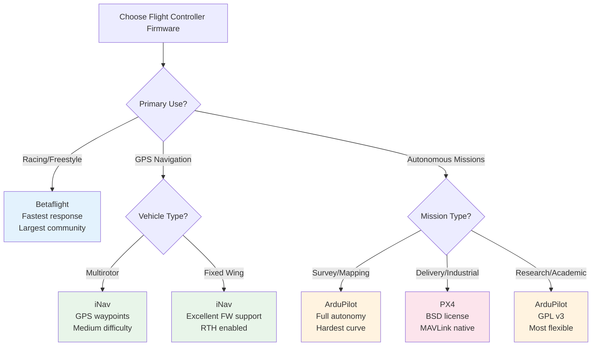

# Flight Controller Software Guide

## Overview

Flight controller (FC) software interprets sensor data and commands motor outputs to stabilize and control the drone. Three major platforms dominate the market, each targeting different use cases.

---

## Firmware Decision Flowchart



### Betaflight

### Profile
- **Type**: FPV racing and freestyle
- **License**: Open source (GPL)
- **Difficulty**: Beginner to intermediate
- **Community**: Largest FPV community, most resources
- **Hardware**: STM32 F4/F7/H7 (F4 minimum recommended)

### Core Features
- **PID controller**: Highly tuned for acrobatic flight
- **Loop times**: Up to 8kHz gyro/PID loop
- **Rates**: Configurable (actual, betaflight, KISS rates)
- **Filtering**: Advanced gyro filtering (RPM, dynamic, notch)
- **OSD**: Full on-screen display customization
- **Modes**: Angle, Horizon, Acro,acro trainer

### What Betaflight Does NOT Support
- GPS waypoint navigation
- Return-to-home (RTH)
- Autonomous missions
- Ground station integration
- Terrain following

### Key Configuration Areas
| Parameter | Description | Typical Values |
|-----------|-------------|----------------|
| **P gain** | Proportional response to error | 40-80 (5") |
| **I gain** | Integral (steady-state correction) | 40-80 (5") |
| **D gain** | Derivative (rate of change damping) | 25-45 (5") |
| **F gain** | Feed-forward (throttle response) | 80-120 (5") |
| **Rates** | Stick sensitivity (deg/sec) | 600-900 |
| **Expo** | Stick curve non-linearity | 0.1-0.5 |
| **Dynamic Filter** | Auto gyro filtering | Enabled |
| **RPM Filter** | Motor RPM notch filtering | Enabled (if ESC supports) |

### Best For
- FPV racing (quadcopter only)
- Freestyle flying
- Indoor Whoop racing
- Learning to fly FPV

### Setup Difficulty
- **Easy**: GUI configurator (Betaflight Configurator)
- **Easy**: Preset defaults work well
- **Moderate**: PID tuning for competition
- **Easy**: Community support and tutorials

---

## iNav

### Profile
- **Type**: GPS navigation and waypoint missions
- **License**: Open source (GPL)
- **Difficulty**: Intermediate
- **Community**: Active, focused on navigation
- **Hardware**: STM32 F4/F7/H7 with GPS module

### Core Features
- **GPS waypoint missions**: Plan and execute autonomous flights
- **Return-to-home (RTH)**: Automatic return on failsafe
- **Position hold**: Loiter at GPS coordinates
- **Altitude hold**: Barometer-based height maintenance
- **Fixed-wing support**: Airplane and flying wing modes
- **Multi-rotor support**: Quad, hex, octo configurations
- **Telemetry**: MAVLink, CRSF, SmartPort

### Navigation Modes
| Mode | Description | Requirements |
|------|-------------|--------------|
| **NAV POSHOLD** | Hold GPS position | GPS + Compass |
| **NAV ALTHOLD** | Hold altitude | Barometer |
| **NAV RTH** | Return to home | GPS + Compass |
| **NAV WP** | Follow waypoint mission | GPS + Mission plan |
| **NAV CRUISE** | Fixed-wing cruise mode | GPS |
| **NAV LAUNCH** | Automated takeoff | GPS + Barometer |

### Key Configuration Areas
| Parameter | Description | Typical Values |
|-----------|-------------|----------------|
| **PID Navigation** | Position/velocity control | 20-40 P, 10-30 I |
| **RTH Altitude** | Return height | 30-50m |
| **Waypoint Speed** | Mission flight speed | 5-15 m/s |
| **Failsafe Delay** | Time before RTH | 0.5-2.0s |
| **Max Speed** | Navigation speed limit | 10-30 m/s |

### Best For
- Long-range FPV with GPS
- Autonomous waypoint missions
- Fixed-wing aircraft
- Search and rescue operations
- Aerial survey (basic)

### Setup Difficulty
- **Moderate**: Requires GPS and compass
- **Moderate**: More complex than Betaflight
- **Moderate**: Mission planning software needed
- **Good**: Documentation improving

---

## ArduPilot

### Profile
- **Type**: Industrial/professional autonomous operations
- **License**: Open source (GPL)
- **Difficulty**: Advanced
- **Community**: Professional, extensive documentation
- **Hardware**: Wide range (Pixhawk, CubePilot, etc.)

### Core Features
- **Full autonomy**: Beyond waypoint missions
- **Terrain following**: Altitude relative to ground
- **Survey grids**: Automated mapping patterns
- **Object avoidance**: Integrated with proximity sensors
- **Fleet management**: Multiple vehicle coordination
- **Companion computers**: Raspberry Pi integration
- ** MAVLink native**: Ground station communication

### Vehicle Support
| Vehicle | ArduCopter | ArduPlane | ArduRover | ArduSub |
|---------|------------|-----------|-----------|---------|
| Multi-rotor | Yes | - | - | - |
| Fixed-wing | - | Yes | - | - |
| Rover | - | - | Yes | - |
| Submarine | - | - | - | Yes |
| Helicopter | Yes | - | - | - |
| Tracker | - | - | - | - |

### Advanced Features
- **Geo-fence**: Virtual boundary with failsafe
- **Precision landing**: IR beacon or vision-based
- **Follow-me**: GPS-based vehicle tracking
- **Delivery**: Payload drop missions
- **Precision agriculture**: Spray pattern control
- **Structure scan**: Building inspection automation

### Key Parameters
| Parameter | Description | Typical Values |
|-----------|-------------|----------------|
| **ATC_RATE_P/RP** | Angular rate P gain | 0.1-0.3 |
| **ATC_ANG_P/RP** | Angle P gain | 4.0-8.0 |
| **WP_SPEED** | Waypoint navigation speed | 500-1500 cm/s |
| **RTL_ALT** | Return-to-home altitude | 1000-5000 cm |
| **FENCE_ENABLE** | Geo-fence on/off | 1=enabled |
| **PRX_TYPE** | Proximity sensor type | 0=none, 99=MAVLink |

### Ground Stations
| Software | Platform | Complexity | Features |
|----------|----------|------------|----------|
| Mission Planner | Windows | Advanced | Full control, analysis |
| QGroundControl | Cross-platform | Intermediate | Clean interface, MAVLink |
| APM Planner 2.0 | Cross-platform | Intermediate | Legacy, still functional |

### Best For
- Agricultural drones
- Survey and mapping
- Commercial delivery
- Industrial inspection
- Research platforms
- Fleet operations

### Setup Difficulty
- **Hard**: Steep learning curve
- **Hard**: Extensive parameter configuration
- **Moderate**: Good documentation
- **Moderate**: Professional support available

---

## PX4

### Profile
- **Type**: Industrial with permissive licensing
- **License**: BSD-3 (allows closed-source derivatives)
- **Difficulty**: Advanced
- **Community**: Professional, academic partnerships
- **Hardware**: Pixhawk family, STM32-based

### Core Features
- **MAVLink native**: First-class MAVLink support
- **Modular architecture**: Clean, extensible codebase
- **Academic focus**: Research-friendly platform
- **Offboard control**: Companion computer integration
- **Simulator support**: Gazebo, jMAVSim integration
- **ROS integration**: ROS/ROS2 native support

### PX4 vs ArduPilot
| Aspect | PX4 | ArduPilot |
|--------|-----|-----------|
| License | BSD-3 (permissive) | GPL (copyleft) |
| Closed-source OK | Yes | No |
| Community size | Smaller | Larger |
| Documentation | Good | Excellent |
| Vehicle types | Copter, plane, rover | All types |
| Ground station | QGroundControl | Mission Planner/QGC |
| Academic use | High | High |
| Commercial | High | High |

### Key Features
- **Offboard mode**: Control from companion computer
- **Replay logging**: Full sensor data replay
- **Flight review**: Online flight log analysis
- **Vehicle abstraction**: Clean vehicle type separation
- **UAVCAN**: Native CAN protocol support

### Best For
- Research and development
- Commercial products (BSD license allows proprietary)
- Academic projects
- Custom vehicle platforms
- ROS-based robotics

### Setup Difficulty
- **Hard**: Requires PX4 knowledge
- **Hard**: Less beginner-friendly than ArduPilot
- **Good**: Good documentation
- **Good**: Active development

---

## Software Comparison

| Feature | Betaflight | iNav | ArduPilot | PX4 |
|---------|-----------|------|-----------|-----|
| **Primary Use** | FPV racing | GPS navigation | Industrial | Research/Commercial |
| **Difficulty** | Easy | Intermediate | Hard | Hard |
| **GPS Waypoints** | No | Yes | Yes | Yes |
| **Return-to-home** | No | Yes | Yes | Yes |
| **Autonomous** | No | Limited | Full | Full |
| **Terrain following** | No | No | Yes | Yes |
| **Survey grids** | No | No | Yes | Yes |
| **Fixed-wing** | No | Yes | Yes | Yes |
| **Rover support** | No | No | Yes | Yes |
| **Max loop rate** | 8kHz | 1kHz | 1kHz | 1kHz |
| **OSD support** | Full | Full | Via MAVLink | Via MAVLink |
| **Hardware req** | F4+ | F4+ + GPS | F7+ / Pixhawk | F7+ / Pixhawk |
| **Community** | Largest | Active | Professional | Professional |

---

## Hardware Requirements

### Processor (MCU)
| MCU | Specs | Recommended For |
|-----|-------|-----------------|
| STM32 F405 | 168MHz, 1MB flash | Budget FPV |
| STM32 F407 | 168MHz, 1MB flash | Standard FPV |
| STM32 F722 | 216MHz, 512KB flash | Mid-range FPV |
| STM32 F745 | 216MHz, 1MB flash | High-end FPV |
| STM32 F765 | 216MHz, 2MB flash | Professional |
| STM32 H743 | 480MHz, 2MB flash | Top-tier |
| STM32 H750 | 480MHz, 1MB flash | Top-tier (budget) |

### Sensors
| Sensor | Purpose | Required For |
|--------|---------|--------------|
| Gyroscope | Angular rate measurement | All flight controllers |
| Accelerometer | Linear acceleration, tilt | Angle/Horizon modes |
| Barometer | Altitude measurement | Altitude hold |
| Magnetometer | Heading/compass | GPS navigation |
| GPS | Position | Navigation modes |
| Pitot tube | Airspeed | Fixed-wing |
| Proximity | Obstacle detection | Avoidance systems |

### Common Flight Controller Boards
| Board | MCU | Gyro | Mounting | Use Case |
|-------|-----|------|----------|----------|
| Matek F405-SE | F405 | ICM-42688 | 30×30 | Budget FPV |
| Matek F722-SE | F722 | BMI270 | 30×30 | Standard FPV |
| Matek H743-SLIM | H743 | ICM-42688 | 30×30 | Professional |
| Pixhawk 6C | H743 | ICM-42688 | Pixhawk standard | ArduPilot/PX4 |
| Cube Orange+ | H757 | ICM-42688 | CubePilot | Industrial |
| SpeedyBee F405 | F405 | BMI270 | 25.5×25.5 | Micro FPV |

---

## Key Parameters Explained

### PID Gains
```
Error = Setpoint - Actual

P (Proportional): Output = Kp × Error
  - Immediate response to error
  - Higher = more responsive, more oscillation
  - Lower = sluggish, less oscillation

I (Integral): Output = Ki × Integral(Error)
  - Corrects steady-state error
  - Higher = holds position better, wind-up risk
  - Lower = drift, slower correction

D (Derivative): Output = Kd × d(Error)/dt
  - Dampens rate of change
  - Higher = smoother, less overshoot
  - Lower = overshoot, oscillation
```

### Rates
- **Actual rates**: Deg/sec at full stick deflection
- **Betaflight rates**: Sensitivity curve
- **KISS rates**: Alternative curve shape
- Typical range: 400-1000 deg/sec

### Expo
- **Stick expo**: Reduces sensitivity near center
- Range: 0 (linear) to 1.0 (maximum expo)
- Typical: 0.1-0.3 for racing, 0.3-0.5 for freestyle
- Makes fine control easier while keeping full throw

### Filters
- **Gyro filtering**: Removes vibration noise
- **Notch filter**: Targets specific frequencies
- **Dynamic filter**: Adjusts based on motor RPM
- **RPM filter**: Notches at motor RPM harmonics
- Too much filtering: latency, sluggish response
- Too little filtering: noise, hot motors

---

## Software Selection Guide

| Use Case | Recommended Software | Why |
|----------|---------------------|-----|
| FPV racing | Betaflight | Lowest latency, fastest loop |
| Freestyle FPV | Betaflight | Best acrobatic performance |
| Whoop racing | Betaflight | Micro build support |
| Long-range FPV | iNav | GPS navigation, RTH |
| Mapping/survey | ArduPilot | Survey grid support |
| Agriculture | ArduPilot | Precision spray, terrain follow |
| Inspection | ArduPilot | Automated flight patterns |
| Research | PX4 | BSD license, ROS integration |
| Commercial product | PX4 | Permissive licensing |
| Hobby GPS flying | iNav | Simpler than ArduPilot |
| Professional fleet | ArduPilot or PX4 | Maturity, support |

---

## Sources & Further Reading

- **oscarliang.com** — FC comparisons, Betaflight guides, tuning
- **thinkrobotics.com** — ArduPilot and PX4 tutorials
- **mepsking.shop** — Flight controller hardware and guides
- **unmannedtechshop.co.uk** — FC selection and setup guides
- **ardupilot.org** — ArduPilot official documentation
- **px4.io** — PX4 official documentation
- **betaflight.com** — Betaflight official documentation and configurator
- **github.com/iNavFlight/inav** — iNav source and documentation

---

## EFT E616P Build Connection

> **Our build uses Pixhawk 6C with ArduCopter 4.4 firmware.**

| Parameter | Pixhawk 6C Value | Source |
|---|---|---|
| Processor | STM32H743, Arm Cortex-M7, 480MHz | holybro.com |
| Flash / SRAM | 2MB / 1MB | holybro.com |
| IMU 1 | ICM-42688-P (Accel/Gyro) | holybro.com |
| IMU 2 | BMI088 (Accel/Gyro) | holybro.com |
| Magnetometer | IST8310 (3.0×3.0×1.0mm LGA) | isentek.com |
| Barometer | MS5611 | holybro.com |
| PWM Outputs | 14 (8 IO + 6 FMU) | holybro.com |
| UART Ports | 3 (TELEM1, TELEM2, FMU Debug) | holybro.com |
| GPS Ports | 2 (GPS1 full + safety, GPS2 basic) | holybro.com |
| CAN Buses | 2 | holybro.com |
| I2C Ports | 1 | holybro.com |
| Dimensions | 54.3 × 39 × 17.5 mm | holybro.com |
| Weight | 42.4g | holybro.com |
| Max Input Voltage | 6V | holybro.com |
| Servo Rail | 0–36V | holybro.com |
| Operating Temp | -40°C to +85°C | holybro.com |
| Firmware | ArduCopter 4.4 | ardupilot.org |
| Price | ₹12,000 | holybro.com |

### Port Allocation for Our Build
| Port | Device | Protocol | Baud Rate |
|---|---|---|---|
| UART1 | GPS 1 (HGLRC M10 Mini) | UBX Binary | 115,200 |
| UART2 | GPS 2 (HGLRC M10 Mini) | UBX Binary | 115,200 |
| UART3 | RFD868x Telemetry | MAVLink | 115,200 |
| UART6 | FrSky R-XSR RC | CRSF | 420,000 |
| CAN1 | Jetson Orin Nano | CAN | 1 Mbps |
| PWM CH5 | SHURflo Pump | PWM 50Hz | — |
| PWM CH6 | Bypass Valve | PWM 50Hz | — |

### Why Pixhawk 6C Won (score 8.85/10)
- Dual redundant IMU for vibration rejection
- STM32H7 handles complex ArduPilot missions
- Best price-to-performance (₹12,000)
- Largest community for troubleshooting
- Native CAN for Jetson Orin integration

---

## Common Mistakes & Pitfalls

| Mistake | Consequence | Prevention |
|---|---|---|
| Wrong firmware for FC | Motors don't respond | Verify board matches firmware (Pixhawk 6C → ArduCopter) |
| Compass not calibrated | Erratic heading, flyaway | Calibrate away from metal, rotate in all orientations |
| GPS mounted too low | Poor satellite lock, high HDOP | Mount GPS on mast ≥200mm above FC |
| No failsafe configured | Drone flies away on RC loss | Configure RC/battery/GPS failsafe before first flight |
| Wrong motor order | Drone flips on takeoff | Verify motor order matches ArduCopter hexa-X layout |
| Ignoring vibration warnings | Unstable flight, sensor noise | Check VIBE values, balance props, fix FC mount |
| No geofence | Drone leaves safe area | Configure FENCE_ENABLE before outdoor flights |

---

## Quick Troubleshooting

| Problem | Likely FC Issue | Fix |
|---|---|---|
| Won't arm | Pre-arm check failing | Check Mission Planner messages for specific error |
| Compass error | Poor calibration, interference | Recalibrate away from metal, check GPS mast placement |
| GPS not locking | Poor sky view, antenna blocked | Move to open area, check antenna orientation |
| Drifting in Loiter | GPS HDOP high, compass interference | Wait for GPS lock (HDOP<2.0), recalibrate compass |
| Motor wrong direction | ESC/motor wiring | Swap two motor wires or reverse ESC direction |
| Excessive vibration | Loose props, motor issues | Tighten props, check motor bearings, balance props |
| Failsafe not working | Configuration error | Review FS parameters in Mission Planner |

---

## Datasheet & Product Links

| Resource | URL |
|---|---|
| Pixhawk 6C Official | https://holybro.com/products/pixhawk-6c |
| Pixhawk 6C Datasheet | https://holybro.com/downloads |
| ArduPilot Documentation | https://ardupilot.org |
| PX4 Documentation | https://docs.px4.io |
| Mission Planner | https://ardupilot.org/planner/ |
| QGroundControl | https://qgroundcontrol.com |
| ArduPilot Parameter Reference | https://ardupilot.org/copter/docs/parameters.html |
| Cube Orange+ | https://cubepilot.com |

---

*Enrichment added: May 29, 2026 | Template v1.0*
