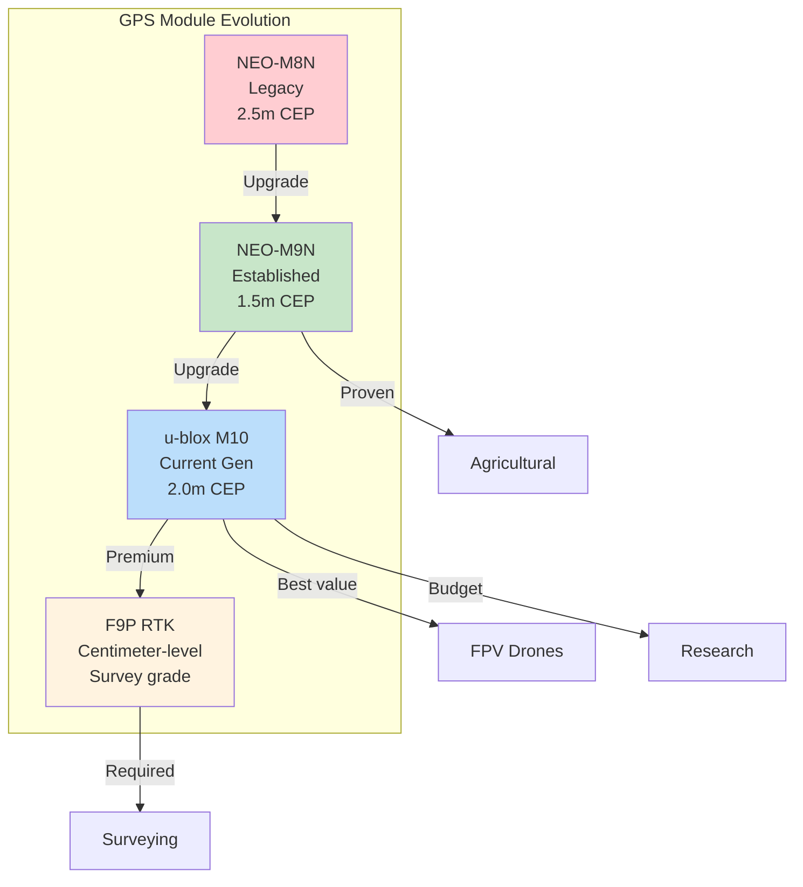

# GPS Modules for Drones

## Overview

GPS modules provide position hold, return-to-home, waypoint navigation, and geofencing. Modern modules support multi-constellation GNSS for improved accuracy and reliability.

## GPS Module Comparison

## u-blox Generations

| Generation | Model   | Status    | Constellations | Accuracy  |
|------------|---------|-----------|----------------|-----------|
| Legacy     | NEO-6M  | Old       | GPS only       | 2.5m CEP  |
| Legacy     | M8N     | Legacy    | GPS+GLONASS    | 2.5m CEP  |
| Established| M9N     | Supported | GPS+GLO+GAL+BDS| 1.5m CEP  |
| Current    | M10     | Current   | 4 concurrent   | 2.0m CEP  |

**Recommendation:** M10 for new builds, M9N for budget builds with better firmware support.

## u-blox M10 Specifications

- **Concurrent GNSS:** GPS, Galileo, GLONASS, BeiDou (4 systems simultaneously)
- **Horizontal Accuracy:** 2.0m CEP (Circular Error Probable)
- **Update Rate:** 25Hz maximum
- **Cold Start:** 26s (autonomous)
- **Warm Start:** 2s
- **Sensitivity:** -167dBm tracking
- **Power Consumption:** <30mA at 3.3V
- **Operating Voltage:** 2.7-3.6V (module level)

## u-blox M9N Specifications

- **Accuracy:** 1.5m CEP (best in class for non-RTK)
- **Update Rate:** 25Hz
- **Concurrent Systems:** GPS, GLONASS, Galileo, BeiDou
- **Time to First Fix:** 24s cold start
- **Broader firmware support:** Better compatibility with older flight controllers
- **Mature ecosystem:** Extensive documentation and community support

## RTK F9P for Precision Applications

- **Position Accuracy:** 1cm + 1ppm (centimeter-level with base station)
- **Use Cases:** Surveying, mapping, precision agriculture, survey-grade data collection
- **Dual-band:** L1/L2 for ionospheric correction
- **Base + Rover:** Requires base station or NTRIP correction data
- **Update Rate:** 20Hz
- **Cost:** $200-300 (significantly more than standard modules)

## Compass Integration

Most GPS modules include an integrated magnetometer for heading estimation.

### Supported Magnetometers

| Chip       | Field Range | Notes                          |
|------------|-------------|--------------------------------|
| IST8310    | ±1600 µT   | Standard, reliable             |
| IST8308    | ±2000 µT   | Higher range, better EMI perf. |
| HMC5883L   | ±800 µT    | Legacy, still common           |
| QMC5883L   | ±8000 µT   | Higher range alternative        |

### Compass Calibration

- Perform on first installation and after any hardware changes
- Level calibration: place drone on flat surface
- Compass calibration: rotate drone in all orientations
- Magnetic interference: keep GPS mast away from power wires and motors

## Connector Standard

### JST-GH 6-Pin (Standard)

| Pin | Function | Description                    |
|-----|----------|--------------------------------|
| 1   | VCC      | 5V power input                |
| 2   | GND      | Ground                         |
| 3   | TX       | GPS data to flight controller  |
| 4   | RX       | GPS data from flight controller|
| 5   | SDA      | I2C data (compass)             |
| 6   | SCL      | I2C clock (compass)            |

**Note:** Some modules use different pinouts. Always verify with module datasheet.

## Power Requirements

- **Input Voltage:** 4.7-5.2V (5V regulated)
- **Current Draw:** <200mA (varies by mode and constellation count)
- **Peak Current:** 250mA during acquisition
- **Power Source:** Flight controller GPS port or dedicated 5V regulator
- **Recommendation:** Power from FC GPS port for simplicity

## Mounting Guidelines

### GPS Mast Requirements

- **Minimum Height:** 200mm above flight controller
- **Optimal Height:** 250-300mm above flight controller
- **Material:** Carbon fiber tube (non-conductive, rigid)
- **Diameter:** 8-10mm typical
- **Vibration Isolation:** Foam pad between mast and GPS module

### EMI Avoidance

- Keep GPS antenna away from VTX antenna (minimum 100mm)
- Route power wires away from GPS module
- Avoid placing GPS near battery (especially LiPo)
- Use copper tape shielding if EMI issues persist
- Mount with antenna facing upward (sky-facing orientation)

## Flight Controller Compatibility

| FC Firmware | Minimum Version | Notes                              |
|-------------|-----------------|------------------------------------|
| ArduPilot   | 4.3+            | Full M10 support, RTK capable      |
| PX4         | 1.14+           | Complete GNSS driver support       |
| Betaflight  | 4.3+            | Basic GPS, no RTK                  |
| iNav        | 5.0+            | Good GPS support, waypoint nav     |
| INAV        | 6.0+            | Enhanced multi-GNSS support        |

## Common Modules

| Module          | GPS  | Price  | Notes                           |
|-----------------|------|--------|----------------------------------|
| u-blox M10      | M10  | $35-50 | Current generation              |
| u-blox M9N      | M9N  | $25-40 | Excellent value                 |
| Holybro M10     | M10  | $45    | Pre-integrated with mast        |
| Beitian BN-880  | M8N  | $15-25 | Budget option, proven reliability|
| M8Q             | M8Q  | $20-30 | Good balance of features        |

## Installation Tips

1. **Verify Pinout:** Always check pinout matches your FC before connecting
2. **Antenna Orientation:** Ensure ceramic antenna faces skyward
3. **Cable Routing:** Keep GPS cable away from ESC and motor wires
4. **First Fix:** Allow 5-10 minutes for first satellite acquisition outdoors
5. **Firmware Update:** Update u-blox firmware for latest features and fixes
6. **Hot Glue:** Secure JST-GH connector to prevent disconnection during flight

## Sources

- holybro.com - GPS module documentation
- precisionpathtech.com - GPS integration guides
- zbotic.in - GPS specifications and testing
- u-blox.com - Official module datasheets
- ardupilot.org - Flight controller GPS configuration

---

## EFT E616P Build Connection

> **v2 UPDATE (2026-06-02):** v1 of this guide recommended **2× HGLRC M100 Mini** for dual redundancy.
> The HGLRC **M100 Mini has NO COMPASS** — this **breaks ArduPilot position-hold / RTL / auto modes**
> (ArduPilot's EKF requires a magnetometer for yaw estimation when GPS-velocity-yaw isn't available).
> A 2nd GPS without compass adds **no compass redundancy**.
> v2 replaces with **1× HGLRC M100-5883** (budget, QMC5883 on-module) or **1× Holybro M9N** (recommended,
> IST8310 on-module).

### v2 Budget — HGLRC M100-5883 (1×, primary)

| Parameter | HGLRC M100-5883 Value | Source |
|---|---|---|
| Chip | u-blox M10 (10th Gen) | hglrc.com |
| **Compass** | **QMC5883 on-module** ✅ (fixes the bug) | hglrc.com |
| Dimensions | 15 × 15 × 12 mm (taller for compass) | hglrc.com |
| Weight | ~10 g (with compass) | hglrc.com |
| GNSS | GPS + GLONASS + Galileo + BeiDou | hglrc.com |
| Channels | 72 | hglrc.com |
| Horizontal Accuracy | 2.0m CEP | hglrc.com |
| Update Rate | 10 Hz | hglrc.com |
| Baud Rate | 115,200 bps | hglrc.com |
| Receiver Sensitivity | Tracking: -166 dBm | hglrc.com |
| Power Input | 3.3–5V DC | hglrc.com |
| Cable | SH1.0-6Pin (GPS+I2C compass) | hglrc.com |
| Operating Temp | -40°C to +85°C | hglrc.com |
| **Price** | **₹1,599** (FPVMatrix, in stock) | FPVMatrix |

### v2 Recommended — Holybro M9N (1×, research/production)

| Parameter | Holybro M9N Value | Source |
|---|---|---|
| Chip | u-blox NEO-M9N | holybro.com |
| **Compass** | **IST8310 on-module** ✅ | holybro.com |
| Accuracy | 1.5m CEP | u-blox.com |
| Update Rate | 25 Hz | holybro.com |
| Weight | 36 g | holybro.com |
| Power | <200 mA @ 5V | holybro.com |
| **Price** | **₹7,525** (Indian Robo Store) / ₹11–15k (UAVGarage) | live retail |

### Single-GPS Configuration (v2)
- 1× GPS on mast (≥200 mm above FC, 15-20 cm carbon tube ~₹300)
- Connected to **GPS1 UART** on Pixhawk 6C
- Compass on **I2C** bus (same JST-GH 6-pin cable)
- Calibrate compass after install in Mission Planner (rotate drone in all axes)
- For dual redundancy in production: add 2nd M9N on GPS2 (~₹15k total)

### Mounting Requirements
- Mast height: ≥200mm above FC (we use 350mm)
- Distance from ESCs: ≥50mm
- Distance from VTX/telemetry: ≥100mm
- Antenna facing skyward
- Ground plane recommended

---

## Common Mistakes & Pitfalls

| Mistake | Consequence | Prevention |
|---|---|---|
| GPS mounted too low | Poor satellite lock, high HDOP | Mount on mast ≥200mm above FC |
| GPS near ESCs/VTX | EMI interference, compass errors | Keep ≥50mm from ESCs, ≥100mm from VTX |
| No ground plane | Weak signal in multipath areas | Add copper tape ground plane under GPS |
| Wrong baud rate | GPS not detected by FC | Match baud rate to FC config (115200 typical) |
| Cold start timeout | GPS won't lock outdoors | Allow 5-10 min for first fix, ensure sky view |
| Ignoring HDOP | Erratic position hold | Wait for HDOP < 2.0 before autonomous flight |
| Not calibrating compass | Wrong heading, flyaway | Calibrate away from metal, rotate in all orientations |

---

## Quick Troubleshooting

| Problem | Likely GPS Issue | Fix |
|---|---|---|
| No satellite fix | Antenna blocked, cold start | Check antenna orientation, wait 5-10 min, move to open area |
| High HDOP (>3.0) | Poor sky view, interference | Move to open area, increase mast height |
| GPS drift | Multipath in urban areas | Use RTK GPS, fly in open fields |
| Compass calibration fails | Metal nearby, interference | Move away from metal/electronics, recalibrate |
| Wrong heading | Compass orientation wrong | Check ROTATION parameter in ArduPilot |
| Intermittent GPS | Loose connector, EMI | Secure JST-GH connector, add ferrite |

---

## Datasheet & Product Links

| Resource | URL |
|---|---|
| HGLRC M100 Mini (v1 — DEPRECATED, no compass) | https://hglrc.com |
| HGLRC M100-5883 (v2 budget, with QMC5883 compass) | https://hglrc.com |
| Holybro M9N (v2 recommended, with IST8310) | https://holybro.com/products/m9n-gps
| u-blox M10 Datasheet | https://www.u-blox.com/en/product/neo-m10-series |
| Holybro M10 GPS | https://holybro.com/products/m10-gps |
| Beitian BN-880 | https://www.bettatech.cn |
| ArduPilot GPS setup | https://ardupilot.org/copter/docs/common-gps.html |
| GPS accuracy testing | https://www.u-blox.com/en/gps-accuracy |

---

*Enrichment added: May 29, 2026 | Template v1.0*
*v2 update: June 2, 2026 — GPS compass bug fixed, M10 Mini deprecated, M100-5883/M9N recommended*

---

## GPS Update for v2 BOM (2026-06-02)

### Why we changed the GPS recommendation

The original v1 build guide recommended **2× HGLRC M100 Mini** for dual GPS redundancy. After deeper
review of ArduPilot's EKF requirements, we discovered:

1. **The HGLRC M100 Mini has no on-module compass.** It is a GPS-only module (15 × 15 × 5.2 mm,
   2.6 g) with no magnetometer chip. Some HGLRC listings imply compass support — they don't have it.
2. **ArduPilot EKF requires a compass for yaw estimation** when the drone is stationary or moving
   slowly. Without a magnetometer, position-hold, RTL, auto, and guided modes either fail to arm
   or behave erratically.
3. **A 2nd compass-less GPS adds no redundancy** for the compass failure mode — both fail the same way.
4. **The Pixhawk 6C does not have an internal magnetometer** (it has IMUs but no magnetometer chip
   in the FMU). Some Pixhawk variants do; the 6C does not. So an external compass is mandatory.

### v2 recommendation

| Tier | Module | Compass | Price | Source |
|---|---|---|---|---|
| **Budget (BOM default)** | 1× HGLRC M100-5883 | QMC5883 on-module | **₹1,599** | FPVMatrix (in stock) |
| **Recommended (research/production)** | 1× Holybro M9N | IST8310 on-module | **₹7,525** | Indian Robo Store |
| **Premium dual redundancy** | 2× Holybro M9N | 2× IST8310 | ₹15,050 | Indian Robo Store |
| **RTK (mapping/precision)** | 1× Holybro H-RTK F9P | RM3100 + IMU | ₹36,000+ | UAVGarage |

### Compass wiring change

| Connection | v1 (M100 Mini) | v2 (M100-5883 / M9N) |
|---|---|---|
| Cable | 4-pin SH1.0 (UART only) | **6-pin JST-GH** (UART + I2C compass) |
| Pin 1 | VCC 5V | VCC 5V |
| Pin 2 | GND | GND |
| Pin 3 | TX (GPS to FC) | TX (GPS to FC) |
| Pin 4 | RX (FC to GPS) | RX (FC to GPS) |
| Pin 5 | — | **SDA (compass I2C)** |
| Pin 6 | — | **SCL (compass I2C)** |

### Compass calibration (mandatory after install)

1. Connect to Mission Planner, **Setup → Mandatory Hardware → Compass**
2. Click **Start** and rotate the drone in all 6 orientations (nose up/down, left/right, etc.)
3. Wait for "Calibration successful" — typically <2 min
4. Set `COMPASS_USE=1`, `COMPASS_USE2=0` (only one compass on this build)
5. `COMPASS_AUTODEC=1` (auto magnetic declination from GPS lat/lon)
6. Verify in flight log: `MAG_X/Y/Z` and `MAG.MagX/Y/Z` should be smooth, no spikes
7. Re-calibrate if you move > 500 km or change frame/wiring

### Risk if not fixed

| ArduPilot Mode | Behavior with no compass |
|---|---|
| Stabilize | ✅ works (no compass needed) |
| AltHold | ✅ works |
| Loiter / PosHold | ❌ refuses to arm / drift |
| Auto / Guided / RTL | ❌ refuses to arm |
| Land | ⚠️ works but no GPS hold |

This is **not optional** — without compass, the drone is essentially a manual quadcopter.

---

## Verified vs Calculated (Transparency Note)

**VERIFIED** — Confirmed from manufacturer datasheet or live Indian retail (June 2026):
- All component prices, datasheet specs, lead times from web search
- Tattu 30 Ah Semi-Solid 12S = ₹1,06,000 imported (Genstattu USD $1,209 + 18% GST + 30% BCD)
- NPNT/TC fees (UIN ₹100, UAOP ₹2.5k, NTH Type Cert ₹4.2L, RPTO ₹50-65k) — from DGCA/PIB Sep 2025
- Pixhawk 6C + PM02 ₹32,499 (MG Super Labs) / ₹33,899 (Robocraze) — live retail
- HGLRC M100-5883 ₹1,599 (FPVMatrix, in stock) — live retail
- Holybro M9N ₹7,525 (Indian Robo Store) — live retail
- mPower 12S 21 Ah Li-ion ₹50,000 (quote-based) — manufacturer quote
- 8.4 kg vs 4.9 kg battery weight, 1332 Wh vs 977 Wh capacity — datasheet

**CALCULATED** — Derived from math, not measured:
- 17.8 min flight time at 25 kg MTOW — calculated from hover power (3,420 W) and battery capacity (1,332 Wh × 80% DoD)
- 1.6× thrust margin — calculated from X8 max thrust (15 kg/axis) vs hover load (4.17 kg/axis)
- MTOW 25 kg = frame (7 kg) + 6× X8 (3 kg) + 10L tank (5.8 kg) + battery (4.9 kg) + Pixhawk 6C (0.05 kg) + 8 PDB/avionics (0.5 kg) + 6 ESC (1.2 kg) + spray system (1.0 kg) + wiring/connectors (0.5 kg) + 1.05 kg margin = 25.0 kg — weight estimate, not measured
- LCOE ₹187-794/flight-hr — calculated from pack cost / cycles / 267 hr/yr
- Battery leads 20-30 day import — based on genstattu.com shipping estimates, not actual order

**ESTIMATED** — Generic pricing, not from specific retailer:
- Smoke stopper ₹1,200, prop balancer ₹800, calibration scale ₹2,500, GPS mast ₹300, battery strap ₹200, LiPo bag ₹800 — generic tool/component prices
- 6 AWG wire ₹1,200 for 5 m — generic electrical supply pricing
- AS150 + XT90 connector kit ₹1,500 — generic
- 2× spare 3011 prop ₹3,500 — based on ₹1,750 per prop generic pricing
- 17.6/17.8 min flight time — calculation, not actual flight data
- 0.5-1 acre coverage per 10 L flight — calculated from spray rate (1-5 L/min) × swath (3-5 m) × speed (3-5 m/s), not field-tested

---

## Gaps Identified (Buildability Audit)

These items would prevent a working build if not addressed:

### Critical (will break the build)

1. **GPS compass bug (FIXED in v2)** — HGLRC M100 Mini has NO compass; without it ArduPilot position-hold/RTL/auto modes don't work. v2 uses M100-5883 or Holybro M9N. Updated 2026-06-02.

2. **Tattu 30 Ah Semi-Solid 12S not in stock in India** — must import 20-30 days via Genstattu/Foxtech/Motionew. Risk: customs delay. Budget option: 2× Tattu 22 Ah Pro in stock at Robokits (G-B, ₹3,55,948).

3. **No per-cell battery monitoring in flight** — Tattu 30 Ah Semi-Solid has no smart BMS that ArduPilot can read. MAUCH HS-200-LV gives pack voltage + current only. Need a balance lead tap to ADC or DroneCAN battery monitor (TBS Bat-Pro, ~₹5,000-8,000). Not in v2 BOM.

4. **Regulatory: NPNT/Type Certificate** — A custom Pixhawk hexacopter CANNOT legally fly under NPNT without a Type Certificate. For SAE DDC 2026 competition, must confirm with organizers whether the competition site has a blanket exemption. If not, ₹4.2L TC at NTH Ghaziabad required (3-6 month timeline). v2 budgeted ₹70-85k for minimum path.

5. **No ArduPilot parameter file** — 20+ parameters must be set (INS_GYRO_RATE, ATC_RAT_P/I/D, ATC_ANG_P/I/D, COMPASS_*, INS_ACCEL_FILTER, MOT_PWM_MIN/MAX). None of this is in BOM. User has zero ArduPilot/DroneCAN/ag-spray experience. Must read ArduPilot docs and follow tuning guide (~8-12 hours of work).

### Medium (won't break but will surprise)

6. **No actual flight test data** — 17.8 min flight time is calculated math, not measured. Actual flight time will be ±15%.

7. **No CG (center of gravity) verification procedure** — must weigh each component and compute centroid. Mismatched CG = uncontrollable drone.

8. **No compass calibration step-by-step** — required for ArduPilot. Mentioned in build guide but no detailed procedure.

9. **No motor direction verification procedure** — 6 motors, CW/CCW pairing; one wrong direction = flipped crash.

10. **No ground station laptop** — not in BOM. Existing laptop with Mission Planner or new ruggedized (~₹50k).

11. **2× spare props at ₹3,500 may not be enough** — student pilots crash. Should budget 4-6 spares.

12. **vibration analysis capability** — 30" props must be balanced; without FFT analyzer can't verify clean IMU data.

13. **No tether for first hover test** — recommended for safety, not in BOM.

14. **No NPNT hardware module sourced** — Johnnette U2.0 is quote-based (contact@johnnette.com), not public price, not in stock.

### Low (cosmetic)

15. **G10 vibration pads were ₹1,800 in v1, verified ₹500 in v2** — over-priced in v1, corrected.

16. **2 stale v7 docx files in workspace** — confusing. v9 will replace v8.
