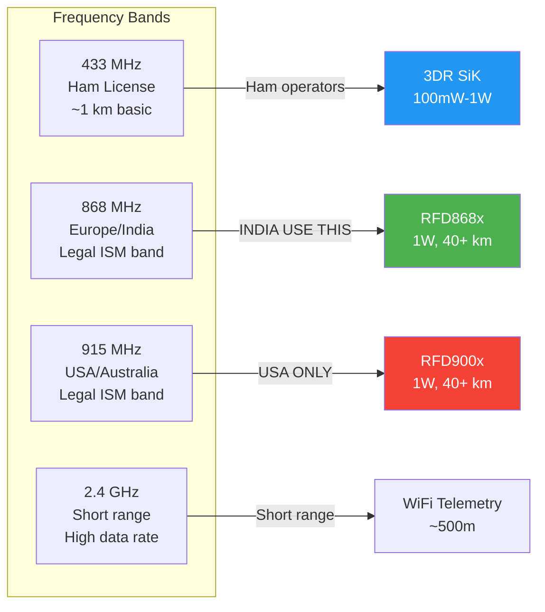

# Telemetry Radios for Drones

## Overview

Telemetry radios enable wireless communication between ground station and flight controller for real-time monitoring, parameter tuning, and mission planning. Choice depends on range, region, and frequency regulations.



## Radio Comparison

| Radio          | Frequency | Power  | Range    | Protocol  | Price    |
|----------------|-----------|--------|----------|-----------|----------|
| RFD868x        | 868MHz    | 1W     | 40+ km   | MAVLink   | $80-120  |
| RFD900x        | 900MHz    | 1W     | 40+ km   | MAVLink   | $100-150 |
| 3DR SiK Radio  | 433/915MHz| 100mW  | 1-2 km   | MAVLink   | $30-50   |
| LoRa-based     | 433/868MHz| 100mW  | 5-15 km  | Custom    | $20-60   |
| HolyBro SiK    | 433/915MHz| 200mW  | 2-3 km   | MAVLink   | $40-60   |

## RFD868x (Recommended for India)

### Specifications

- **Frequency:** 865-870MHz (ISM band)
- **Transmit Power:** 1W (30dBm)
- **Receiver Sensitivity:** -120dBm
- **Range:** 40+ km line-of-sight
- **Data Rate:** Up to 224 kbps
- **Processor:** ARM 32-bit Cortex-M4
- **Firmware:** SiK compatible
- **Interface:** UART serial (MAVLink)
- **Voltage:** 3.3-5.5V
- **Current:** ~1A TX, 45mA RX

### India Region Lock

- **Legal Frequency:** 865-867MHz only
- **Maximum Power:** 1W EIRP
- **License:** No license required (ISM band)
- **Compliance:** WPC India regulations
- **Note:** RFD868x units sold in India are region-locked to 865-867MHz

### Protocol Support

- **MAVLink:** Direct serial MAVLink pass-through
- **AT Commands:** Configuration via AT command set
- **Transparent:** Point-to-point serial bridge
- **Mesh:** Not supported (use RFD900x for mesh)

## RFD900x (NOT for India)

### Warning: BANNED in India

- **Status:** BANNED for civilian use in India
- **Restricted Regions:** USA (FCC), India (WPC)
- **Allowed Regions:** Australia, New Zealand, parts of Europe
- **Reason:** 900MHz band allocated to military/government
- **Compliance:** Check local regulations before use

### Specifications (International Use Only)

- **Frequency:** 902-928MHz (USA), 915-928MHz (Australia)
- **Power:** 1W
- **Range:** 40+ km
- **Mesh Networking:** Supported
- **Use Case:** Long-range surveying, mapping missions

## 3DR SiK Radio

### Specifications

- **Frequency:** 433MHz or 915MHz (select model)
- **Power:** 100mW-1W (configurable)
- **Range:** 1-2 km typical
- **Data Rate:** Up to 250 kbps (auto-negotiated)
- **Protocol:** MAVLink transparent serial
- **Interface:** UART (3.3V logic)
- **Voltage:** 3.3-5V
- **Current:** 100mA TX, 25mA RX

### Features

- **Auto-configuration:** Paired radios auto-sync settings
- **AT Commands:** Parameter configuration
- **LED Indicators:** Link status, RSSI
- **Firmware:** Upgradeable via serial
- **Cost-effective:** Best budget option

## LoRa-Based Radios

### Advantages

- **Long Range:** Up to 15 km with proper antenna
- **Low Power:** Excellent battery life
- **Mesh Capability:** Multi-hop relay support
- **Interference Resistant:** Spread spectrum modulation
- **Low Cost:** $20-60 per radio

### Limitations

- **Bandwidth:** Limited data rate (typically 50-375 kbps)
- **Latency:** Higher than SiK (5-20ms)
- **Not MAVLink Native:** Requires protocol adaptation
- **Complex Setup:** More configuration required

### Popular LoRa Radios

- **E220-900T30S:** 900MHz, 1W, 30km range
- **Ra-02:** 433MHz, 100mW, 5km range
- **RFM95W:** 433/868/915MHz, 100mW, 10km range

## Frequency Selection Guide

| Region   | Frequency | Notes                              |
|----------|-----------|------------------------------------|
| India    | 868MHz    | Legal, use RFD868x                |
| Europe   | 868MHz    | EU868 band, duty cycle limited    |
| USA      | 915MHz    | ISM band, full power allowed      |
| Australia| 915MHz    | ISM band, full power allowed      |
| Ham Radio| 433MHz    | Requires ham license              |
| Global   | 2.4GHz    | WiFi-based, limited range         |

## Protocol: MAVLink over Serial

### Connection

- **UART Configuration:** 57600-115200 baud, 8N1
- **TX/RX Cross:** Radio TX → FC RCIN, Radio RX → FC RCOUT
- **Flow Control:** Not required (hardware flow control optional)

### MAVLink Message Types

- **HEARTBEAT:** Connection status
- **ATTITUDE:** Roll, pitch, yaw
- **GLOBAL_POSITION_INT:** Lat, lon, alt
- **BATTERY_STATUS:** Voltage, current, capacity
- **RC_CHANNELS:** Channel values
- **PARAM_VALUE:** Parameter responses
- **COMMAND_ACK:** Command acknowledgments

## Antenna Selection

### Omnidirectional (Monopole)

- **Pattern:** 360° horizontal coverage
- **Gain:** 2-5 dBi
- **Use Case:** General flying, takeoff/landing
- **Mounting:** Vertical orientation, away from carbon fiber

### Directional (Yagi)

- **Pattern:** Narrow beamwidth (30-60°)
- **Gain:** 8-14 dBi
- **Use Case:** Long-range missions, fixed direction
- **Tracking:** Manual pointing toward aircraft
- **Recommendation:** Use for range testing only

### Antenna Best Practices

- **Vertical Polarization:** Standard for drone telemetry
- **Mount Height:** Above pilot head level
- **Clear Line-of-Sight:** Avoid obstacles between antennas
- **Avoid Carbon Fiber:** RF shield, keep antenna away
- **Coax Length:** Minimize cable length (<1m ideal)

## Range Factors

### Improving Range

- Higher antenna gain (directional)
- Higher transmit power (within legal limits)
- Clear line-of-sight
- Reduced interference
- Optimal antenna placement
- Lower data rate setting

### Reducing Range

- Obstacles (buildings, terrain)
- RF interference (WiFi, other radios)
- Low antenna gain
- Poor antenna orientation
- High data rate (less robust)
- Multipath interference

## ArduPilot Configuration

### Serial Port Setup

```
SERIAL4_PROTOCOL = 2 (MAVLink2)
SERIAL4_BAUD = 57 (57600)
```

### Radio Settings

```
BRD_SBUS_OUT = 0
SYSID_MYGCS = 255
```

### Telemetry Rate

```
SR0_EXT_STAT = 2 (2Hz)
SR0_POSITION = 2 (2Hz)
SR0_EXTRA1 = 4 (4Hz)
```

## Sources

- holybro.com - RFD868x documentation
- readymaderc.com - Radio selection guides
- px4.io - PX4 telemetry configuration
- semtech.com - LoRa technology specifications
- ardupilot.org - Telemetry setup guides
- rfd900.com - RFD radio specifications

---

## EFT E616P Build Connection

> **Our build uses RFD868x telemetry (865-867 MHz, India legal).**

| Parameter | RFD868x Value | Source |
|---|---|---|
| Frequency | 865–870 MHz (India locked: 865–867 MHz) | rfdesign.com.au |
| Max TX Power | 30 dBm (1W) | rfdesign.com.au |
| RX Sensitivity | -121 dBm @ 12 kbps | rfdesign.com.au |
| Data Rate | Up to 224 kbps | rfdesign.com.au |
| Modulation | 2GFSK / 4GFSK | rfdesign.com.au |
| FHSS | Yes (except EU locked) | rfdesign.com.au |
| Encryption | Hardware AES up to 256-bit | rfdesign.com.au |
| Serial Interface | 2,400–1,200,000 baud | rfdesign.com.au |
| Supply Voltage | 5V (5–5.5V) | rfdesign.com.au |
| TX Current | 1A peak @ 30dBm | rfdesign.com.au |
| RX Current | 60 mA typical | rfdesign.com.au |
| Range (LOS) | 40+ km | rfdesign.com.au |
| Dimensions (x module) | 30 × 57 × 12.8 mm | rfdesign.com.au |
| Weight | 14g (x module) | rfdesign.com.au |
| RF Connectors | 2× RP-SMA (diversity) | rfdesign.com.au |
| Operating Temp | -40°C to +85°C | rfdesign.com.au |
| Price | ₹12,000 | rfdesign.com.au |

### ⚠️ 915 MHz is BANNED in India
- 900 MHz band allocated to military/government
- RFD900x is NOT legal for Indian civilian use
- Use RFD868x on 865–867 MHz ISM band only

### Link Budget for Our Build (10 km)
| Parameter | Value |
|---|---|
| Tx Power | +30 dBm |
| Tx Antenna Gain | +2 dBi (omni) |
| EIRP | +32 dBm |
| Free-Space Path Loss | -111.2 dB |
| Rx Antenna Gain | +8 dBi (Yagi 5-element) |
| **Received Power** | **-71.2 dBm** |
| Rx Sensitivity | -117 dBm |
| **Margin** | **+19.8 dB** ✅ |

---

## Common Mistakes & Pitfalls

| Mistake | Consequence | Prevention |
|---|---|---|
| Using 915 MHz in India | Illegal, confiscation risk | Use 865-867 MHz RFD868x only |
| Antenna near carbon fiber | Signal blocked, reduced range | Keep antenna away from CF frame |
| Wrong baud rate | No telemetry data | Match serial config to radio settings |
| No antenna diversity | Dead spots during flight | Use dual whip antennas, spaced apart |
| Low battery on radio | Link drops out | Monitor radio battery voltage |

---

## Quick Troubleshooting

| Problem | Likely Telemetry Issue | Fix |
|---|---|---|
| No data on ground station | Wrong COM port, baud rate | Verify COM port, check baud (57600) |
| Intermittent telemetry | Antenna issue, interference | Check antenna connections, relocate |
| Short range only | Low power setting, bad antenna | Verify 1W power, use high-gain antenna |
| High latency | Packet loss, high data rate | Reduce telemetry rate, check LQ |

---

## Datasheet & Product Links

| Resource | URL |
|---|---|
| RFD868x Official | https://rfdesign.com.au |
| RFD868x Datasheet | https://rfdesign.com.au/products/rfd868x |
| RFD900x (NOT for India) | https://rfdesign.com.au/products/rfd900x |
| 3DR SiK Radio | https://store.3dr.com |
| LoRa technology | https://www.semtech.com/lora |

---

*Enrichment added: May 29, 2026 | Template v1.0*
