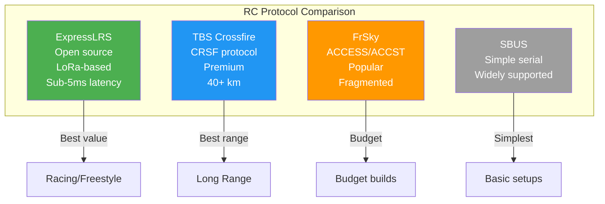

# RC Receivers for Drones

## Overview

RC receivers provide manual control input from pilot transmitter to flight controller. Modern protocols offer low latency, long range, and telemetry capabilities.



## Protocol Comparison

| Protocol     | Frequency | Range    | Latency  | Telemetry | Price   |
|--------------|-----------|----------|----------|-----------|---------|
| ELRS         | 2.4/900MHz| 30+ km   | <5ms     | Yes       | $15-40  |
| CRSF (TBS)  | 868/915MHz| 40+ km   | 2-5ms    | Yes       | $50-80  |
| SBUS         | 2.4GHz   | 1-2 km   | 2-5ms    | No        | $10-20  |
| FrSky ACCESS | 2.4GHz   | 2-5 km   | 5-10ms   | Yes       | $20-50  |
| DSMX         | 2.4GHz   | 1-2 km   | 5-10ms   | Limited   | $20-40  |

## ELRS (ExpressLRS) - Recommended

### Specifications

- **Frequency:** 2.4GHz or 900MHz
- **Range:** 30+ km (2.4GHz), 50+ km (900MHz)
- **Latency:** Sub-5ms (250Hz mode)
- **Packet Rate:** 50-500Hz (configurable)
- **Telemetry:** Full bidirectional
- **Open Source:** Yes, community-driven
- **Binding:** WiFi or Lua script

### ELRS 2.4GHz vs 900MHz

| Feature       | 2.4GHz          | 900MHz          |
|---------------|-----------------|-----------------|
| Range         | 30+ km          | 50+ km          |
| Latency       | <5ms            | <10ms           |
| Antenna Size  | Small           | Larger          |
| Regulatory    | Global ISM      | Region-specific |
| Use Case      | FPV racing/freestyle | Long-range |

### ELRS Binding Procedure

1. **Power on** receiver with bound module
2. **Enter bind mode:** Power cycle 3 times rapidly
3. **LED Pattern:** Rapid flashing indicates bind mode
4. **Bind via WiFi:** Connect to receiver WiFi AP
5. **Configure:** Set packet rate, telemetry ratio
6. **Verify:** Check LED solid when connected

### ELRS Configuration

```
# Packet Rate Options
# 50Hz: Maximum range, minimum latency sensitivity
# 150Hz: Good balance
# 250Hz: Low latency, recommended for most use
# 500Hz: Minimum latency, reduced range

# Telemetry Ratio
# 1:2, 1:4, 1:8, 1:16, 1:32, 1:64, 1:128
# Lower ratio = more telemetry updates, more bandwidth
```

## TBS Crossfire (CRSF)

### Specifications

- **Frequency:** 868MHz (EU), 915MHz (US/AU)
- **Range:** 40+ km
- **Latency:** 2-5ms
- **Protocol:** CRSF (Crossfire Serial)
- **Telemetry:** Full support
- **Build Quality:** Premium
- **Price:** $50-80

### CRSF Protocol Details

- **Baud Rate:** 420kbps
- **Frame Format:** Address + Length + Payload + CRC
- **Channels:** Up to 16
- **Telemetry:** RSSI, battery, GPS, attitude
- **Injection:** Telemetry injected into RC stream

### Binding Procedure

1. **Power on** receiver
2. **Press bind button** (or power cycle 3x)
3. **LED:** Rapid flash = bind mode
4. **Transmitter:** Enter bind mode
5. **Connection:** Establish within 10 seconds
6. **LED:** Solid = bound

## SBUS (Serial Bus)

### Specifications

- **Protocol:** Futaba SBUS
- **Baud Rate:** 100kbps
- **Channels:** 16 (17th for telemetry)
- **Latency:** 2-5ms
- **Inverted Signal:** Yes (requires inverter on some FCs)
- **Widespread Support:** All major FCs

### SBUS Signal Details

- **Voltage:** 3.3V logic
- **Connector:** 3-pin (Signal, 5V, GND)
- **Wiring:** Signal to RCIN pin on FC
- **Inversion:** Some FCs have built-in SBUS inverter
- **Channel Order:** AETR (default, configurable)

### Limitations

- **No Telemetry:** One-way communication only
- **Limited Range:** Typically 1-2 km
- **Single Protocol:** Not compatible with other protocols
- **Channel Limit:** 16 channels maximum

## FrSky Protocols

### ACCESS (Advanced)

- **Frequency:** 2.4GHz FHSS
- **Range:** 2-5 km
- **Telemetry:** Full bidirectional
- **Features:** Telemetry, model match, OTA updates
- **Binding:** Smart match or manual

### ACCST (Legacy)

- **Frequency:** 2.4GHz FHSS
- **Range:** 1-3 km
- **Telemetry:** Basic
- **Compatibility:** Wide receiver support
- **Note:** Being phased out by ACCESS

### FrSky Limitations

- **Ecosystem Fragmented:** Multiple protocols
- **Regional Differences:** EU/US LBT versions
- **Telemetry Variants:** Different telemetry protocols
- **Support:** Community-driven only

## Antenna Placement

### Optimal Locations

- **Away from VTX:** Minimum 100mm from video transmitter
- **Away from Carbon Fiber:** RF shielding material
- **Away from Battery:** LiPo blocks RF signals
- **Horizontal Orientation:** Best for most flight scenarios
- **45° Orientation:** Good compromise for all orientations

### Antenna Types

| Type        | Pattern    | Gain   | Use Case              |
|-------------|------------|--------|------------------------|
| Monopole    | Omnidirectional | 2dBi | General flying        |
| Dipole      | Omnidirectional | 3dBi | Better performance    |
| Sleeve Dipole | Omnidirectional | 3dBi | Compact, durable      |

### Placement Tips

- Use heat shrink to secure antenna
- Avoid zip ties directly on antenna
- Provide strain relief at connector
- Keep antenna straight (not coiled)
- Test range before long flights

## Flight Controller Integration

### ArduPilot Configuration

#### CRSF Protocol

```
# Serial port configuration
SERIAL4_PROTOCOL = 23 (RCIN via CRSF)
SERIAL4_BAUD = 420 (420kbps)

# RC input source
RC_PROTOCOLS = 2097152 (CRSF)

# Channel mapping
RC1_FUNCTION = 0 (Aileron)
RC2_FUNCTION = 0 (Elevator)
RC3_FUNCTION = 0 (Throttle)
RC4_FUNCTION = 0 (Rudder)
```

#### SBUS Protocol

```
# Serial port configuration
SERIAL4_PROTOCOL = 15 (SBUS)
SERIAL4_BAUD = 100 (100kbps)

# RC input
RC_PROTOCOLS = 512 (SBUS)
```

### PX4 Configuration

```
# CRSF
SER_TEL4_BAUD = 420000
RC_PORT_CONFIG = /dev/ttyS3
RC_INPUT_PROTOCOL = 23

# SBUS
RC_INPUT_PROTOCOL = 1
```

### Betaflight Configuration

```
# CRSF on UART
serial 0 2048 115200 57600 0 115200

# SBUS on UART
serial 0 16384 115200 57600 0 115200

# Receiver mode
set receiver_provider = CRSF
```

## Binding Best Practices

1. **Always Bind Indoors:** Avoid RF interference
2. **Verify Channel Order:** AETR or TAER
3. **Test Failsafe:** Verify failsafe settings
4. **Check Failsafe Action:** Drop or return-to-home
5. **Calibrate Endpoints:** Full stick travel
6. **Verify Rates:** Match transmitter rates to FC
7. **Label Receivers:** Note bound protocol and TX

## Common Issues and Solutions

| Issue              | Cause                    | Solution                    |
|-------------------|--------------------------|------------------------------|
| No connection     | Wrong protocol           | Verify protocol match        |
| Intermittent      | Poor antenna placement   | Relocate antenna             |
| High latency      | Low packet rate          | Increase packet rate         |
| Range issues      | Antenna orientation      | Adjust antenna angle         |
| Failsafe not working | Configuration error   | Check failsafe settings      |
| Telemetry lost    | Telemetry ratio too high | Lower telemetry ratio        |

## Sources

- expresslrs.org - ELRS documentation
- mepsking.shop - RC receiver guides
- ardupilot.org - ArduPilot RC configuration
- tbs.sh - Crossfire documentation
- frsky-rc.com - FrSky protocol specifications
- betaflight.com - Betaflight RC setup

---

## EFT E616P Build Connection

> **Our build uses FrSky R-XSR receiver (ACCST/S.BUS protocol).**

| Parameter | FrSky R-XSR Value | Source |
|---|---|---|
| Dimensions | 16 × 11 × 5.4 mm | frsky-rc.com |
| Weight | 1.5g | frsky-rc.com |
| Channels | 16 (1–16 SBUS, 1–8 CPPM) | frsky-rc.com |
| Protocol | ACCST D16 / ACCESS mode | frsky-rc.com |
| Signal Output | SBUS / CPPM (switchable) | frsky-rc.com |
| Operating Voltage | 3.5–10V | frsky-rc.com |
| Operating Current | 70 mA @ 5V | frsky-rc.com |
| Antenna Connector | IPEX (replaceable) | frsky-rc.com |
| Telemetry | Smart Port enabled | frsky-rc.com |
| Redundancy | Built-in master/slave | frsky-rc.com |
| Firmware | Upgradable | frsky-rc.com |
| Price | ₹3,500 | frsky-rc.com |

### Why R-XSR Was Selected
- Proven reliability in agricultural applications
- S.BUS protocol has native Pixhawk support
- Ultra-lightweight (1.5g) minimizes AUW impact
- Excellent availability in Indian market
- Simple bind process for field operations

---

## Common Mistakes & Pitfalls

| Mistake | Consequence | Prevention |
|---|---|---|
| Wrong protocol (SBUS vs CRSF) | Receiver not detected | Verify protocol matches FC configuration |
| Antenna near carbon fiber | Reduced range | Mount antenna away from CF, use IPEX extension |
| No failsafe configured | Drone flies away on signal loss | Configure RC failsafe before first flight |
| Wrong channel order | Controls mixed up | Verify AETR vs TAER mapping |
| Low battery on TX | Intermittent control | Monitor TX battery, use fresh cells |

---

## Datasheet & Product Links

| Resource | URL |
|---|---|
| FrSky R-XSR | https://www.frsky-rc.com/product/r-xsr/ |
| ELRS Receivers | https://www.expresslrs.org |
| TBS Crossfire | https://www.team-blacksheep.com |
| ArduPilot RC config | https://ardupilot.org/copter/docs/rc-configuration.html |

---

*Enrichment added: May 29, 2026 | Template v1.0*
