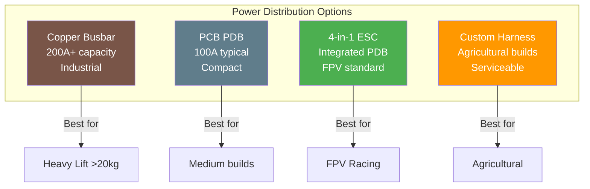

# Power Distribution for Drones

## Overview

Power distribution systems manage battery power to all drone components. Proper design prevents voltage drops, ensures safety, and handles high-current demands.



## Power Distribution Board Types

### Dedicated PDB Board

- **Description:** Standalone board with battery input and ESC outputs
- **Current Capacity:** Up to 100A continuous
- **Features:** Built-in BEC, voltage/current monitoring
- **Advantages:** Clean wiring, easy troubleshooting
- **Disadvantages:** Additional weight and space

### 4-in-1 ESC with PDB

- **Description:** ESC board with integrated power distribution
- **Current Capacity:** 4x 30-60A per ESC channel
- **Features:** Single board, reduces wiring complexity
- **Advantages:** Compact, weight savings, simpler build
- **Disadvantages:** Single point of failure, harder to replace individual ESC

### Busbar System (Industrial)

- **Description:** Copper or aluminum busbars for high-current applications
- **Current Capacity:** 200A+ continuous
- **Features:** Excellent thermal management, modular
- **Advantages:** Highest current capacity, best散热
- **Disadvantages:** Heavy, complex installation
- **Use Case:** Heavy-lift industrial drones, 12S+ systems

## Copper Busbar Specifications

### Advantages

- **High Current Capacity:** Up to 500A+ with proper sizing
- **Thermal Management:** Excellent heat dissipation
- **Low Resistance:** Minimal voltage drop
- **Reliability:** Solid construction, vibration resistant
- **Serviceability:** Easy to modify and repair

### Sizing Guide

| Current | Cross Section | Width | Thickness |
|---------|---------------|-------|-----------|
| 100A    | 10mm²         | 20mm  | 0.5mm     |
| 200A    | 20mm²         | 30mm  | 0.7mm     |
| 300A    | 30mm²         | 40mm  | 0.8mm     |
| 500A    | 50mm²         | 50mm  | 1.0mm     |

### Installation Tips

- Use star washers for secure connections
- Apply thermal paste for better heat transfer
- Insulate busbars with Kapton tape or heat shrink
- Use proper torque on bolts (avoid over-tightening)
- Mount with vibration isolation

## Current Ratings Calculation

### Formula

```
Total Current = (Motor Max Draw × Number of Motors) + 20% Safety Margin

Example:
- Motor Max Draw: 40A
- Motors: 6
- Total: (40A × 6) × 1.2 = 288A
```

### Component Power Budget

| Component         | Typical Draw | Peak Draw |
|-------------------|--------------|-----------|
| Motor (per)       | 10-20A       | 40-60A    |
| Flight Controller | 0.5A         | 1A        |
| VTX               | 0.5-1A       | 2A        |
| Camera            | 0.2A         | 0.5A      |
| GPS Module        | 0.1A         | 0.2A      |
| Telemetry Radio   | 0.1A         | 0.2A      |
| Servos (per)      | 0.5A         | 2A        |

### Safety Factors

- **Minimum:** 20% above calculated maximum
- **Recommended:** 30% for reliability
- **Conservative:** 50% for extreme conditions

## Voltage Monitoring

### Per-Cell Monitoring

- **Purpose:** Detect cell imbalance and low voltage
- **Method:** BMS (Battery Management System) or cell taps
- **Accuracy:** ±0.05V per cell
- **Alert Levels:**
  - Warning: 3.5V/cell
  - Critical: 3.3V/cell
  - Cutoff: 3.0V/cell

### Power Module Monitoring

- **Voltage Sensing:** Resistor divider network
- **Current Sensing:** Hall-effect or shunt resistor
- **Accuracy:** ±1% voltage, ±3% current
- **Output:** Analog voltage proportional to input

## Current Monitoring

### Hall-Effect Sensors

#### MAUCH HS-200-LV

- **Range:** 0-200A continuous
- **Output:** 0.5-4.5V (proportional to current)
- **Accuracy:** ±1%
- **Response Time:** <20µs
- **Power Supply:** 5-24V
- **Price:** $30-50

#### Advantages

- No insertion loss
- Galvanic isolation
- High accuracy
- Wide bandwidth
- No temperature drift

### Shunt Resistors

- **Principle:** Voltage drop across known resistance
- **Range:** 0-500A
- **Accuracy:** ±0.5%
- **Cost:** $5-20
- **Limitation:** Power dissipation (heat)
- **Use Case:** High-current industrial applications

## Fusing

### Individual ESC Fuses

- **Type:** Automotive blade fuse (MEGA or ANL)
- **Rating:** 150A MEGA typical
- **Purpose:** Isolate single ESC failure
- **Location:** Between battery and each ESC
- **Advantage:** Prevents cascading failure

### Main Battery Fuse

- **Type:** MEGA fuse or manual disconnect
- **Rating:** Total current + 20% margin
- **Purpose:** Protect main power bus
- **Location:** Directly after battery connector
- **Manual Switch:** High-current disconnect switch recommended

### Fuse Selection

```
Fuse Rating = Total Motor Current × 1.2 (safety margin)

Example:
- Total Motor Current: 240A
- Fuse Rating: 288A → Use 300A MEGA fuse
```

## Pre-Charge Circuit

### Purpose

- **Inrush Current:** Limits initial capacitor charging current
- **Protection:** Prevents connector welding and damage
- **Required For:** 12S+ systems (>44V)
- **Not Required For:** 6S-10S systems (<37V)

### Circuit Design

```
Battery → Pre-Charge Resistor (2W, 10Ω) → Capacitor Bank → Load
                    ↓
              Bypass Switch (engaged after charge)
```

### Components

- **Resistor:** 2-10Ω, 2-5W wirewound
- **Bypass Switch:** High-current contactor or relay
- **Time Constant:** 5-10 seconds for full charge
- **Indicator:** LED showing charge status

## Voltage Regulators (BEC)

### Linear Regulator

- **Efficiency:** 40-60%
- **Noise:** Low
- **Heat:** High
- **Use Case:** Low-current (<1A) sensitive electronics
- **Example:** 5V linear for flight controller

### Switching Regulator (BEC)

- **Efficiency:** 85-95%
- **Noise:** Higher
- **Heat:** Low
- **Use Case:** High-current applications
- **Example:** 5V/12V UBEC for servos and VTX

### Regulator Sizing

```
Current Capacity = Total Load × 1.3 (safety margin)

Example:
- Servo Load: 4A
- VTX Load: 1A
- Total: 5A
- Regulator: 6.5A minimum → Use 10A UBEC
```

## Wiring Gauge Guide

| Current | Wire Gauge | Use Case              |
|---------|------------|------------------------|
| 0-2A    | 24-22 AWG | Signal wires, LEDs     |
| 2-10A   | 20-18 AWG | Low-power peripherals  |
| 10-30A  | 16-14 AWG | Individual ESC power   |
| 30-60A  | 14-12 AWG | ESC power, battery leads|
| 60-100A | 12-10 AWG | Main battery leads     |
| 100A+   | 10-8 AWG  | Industrial applications|

## Power Distribution Best Practices

### Layout Guidelines

1. **Star Configuration:** Run separate wires from battery to each ESC
2. **Minimize Wire Length:** Shorter wires = less resistance
3. **Equal Wire Lengths:** Balance resistance across motors
4. **Avoid Sharp Bends:** Reduce stress on wires and connectors
5. **Secure Connections:** Use heat shrink on all solder joints

### Thermal Management

- **Heat Sinks:** Add to high-current components
- **Airflow:** Ensure adequate cooling
- **Temperature Monitoring:** Use thermal sensors
- **Derating:** Reduce current rating in high ambient temperature

### Safety Features

- **Main Disconnect:** High-current switch for emergency shutdown
- **Voltage Alarm:** Audible alert at low voltage
- **Current Limiting:** Prevent overcurrent damage
- **Fusing:** Protect against short circuits
- **Insulation:** Cover all exposed conductors

## Common Issues and Solutions

| Issue                | Cause                     | Solution                     |
|---------------------|---------------------------|------------------------------|
| Voltage sag         | Undersized wiring         | Upgrade wire gauge           |
| Connector melting   | Poor connection           | Resolder, use proper connector|
| ESC failure         | Voltage spikes            | Add capacitor bank           |
| Inconsistent motors  | Unequal resistance        | Equalize wire lengths        |
| Overheating         | High current              | Add cooling, reduce load     |
| Intermittent power  | Loose connection          | Secure all connections       |

## Sources

- oscarliang.com - Power distribution guides
- holybro.com - PDB specifications
- mauch.de - Current sensor documentation
- mouser.com - Fuse and connector specifications
- ti.com - Voltage regulator design resources
- ardupilot.org - Power module configuration

---

## EFT E616P Build Connection

> **Our build uses copper busbar + 300A MEGA main fuse + 6× 150A ESC fuses.**

| Parameter | Value | Source |
|---|---|---|
| Busbar | 15×5mm copper (75mm²) | tameson.co.uk |
| Main Fuse | 300A MEGA | COEP Report |
| ESC Fuses | 6× 150A MEGA | COEP Report |
| Battery Connector | AS150U (7mm bullet) | COEP Report |
| ESC Connectors | XT90 (90A) | COEP Report |
| BEC 12V | For pump, lighting | COEP Report |
| BEC 5V | For FC, GPS, telemetry, RC, Jetson | COEP Report |

### Power Budget (45 kg MTOW)
| Subsystem | Voltage | Current | Power |
|---|---|---|---|
| Motors ×6 | 50.4V | 99.0A | 4,990W |
| Pump | 12V | 7.5A | 90W |
| Avionics | 5V | 2.0A | 10W |
| **Total** | — | **109.3A** | **5,096W** |

### ⚠️ Critical: Pre-Charge Circuit Required
- Without pre-charge: 5,040A inrush current
- With pre-charge (12.5Ω): 4.03A (safe)
- τ = 150ms, 95% charge in 450ms
- 2× 25Ω 50W wirewound resistors + 100°C thermal fuse

### Thermal Warning
- Busbar at hover (87A): ΔT = +26°C → marginal
- Busbar at peak (150A): ΔT = +77°C → EXCEEDS limits
- **Fix:** Upgrade to 20×5mm busbar or add forced-air cooling

---

## Common Mistakes & Pitfalls

| Mistake | Consequence | Prevention |
|---|---|---|
| No pre-charge on 12S | Connector welding, inrush damage | Install pre-charge circuit (mandatory >12S) |
| Undersized busbar | Overheating, fire risk | Calculate I²R, use thermal analysis |
| Wrong fuse rating | Fuse blows during normal operation | Size fuse at motor max × 1.2 |
| Loose connections | Voltage drop, heating | Use star washers, proper torque |
| No main disconnect | Can't emergency shutdown | Install high-current disconnect switch |

---

## Quick Troubleshooting

| Problem | Likely Power Issue | Fix |
|---|---|---|
| Voltage sag under load | Undersized wiring, loose connections | Upgrade wire gauge, resolder connections |
| Connector melting | Poor connection, undersized wire | Resolder with proper technique |
| ESC failure on startup | Voltage spike, no pre-charge | Install pre-charge circuit |
| Inconsistent motor speeds | Unequal wire resistance | Equalize wire lengths across ESCs |
| Overheating busbar | Excessive current, poor airflow | Upgrade busbar, add cooling |

---

## Datasheet & Product Links

| Resource | URL |
|---|---|
| Copper busbar specs | https://www.tameson.co.uk/copper-busbar |
| MEGA fuses | https://www.littelfuse.com |
| AS150 connectors | https://www.amass.net |
| XT90 connectors | https://www.amass.net |
| Pre-charge circuit design | https://www.electronics-tutorials.ws |

---

*Enrichment added: May 29, 2026 | Template v1.0*
