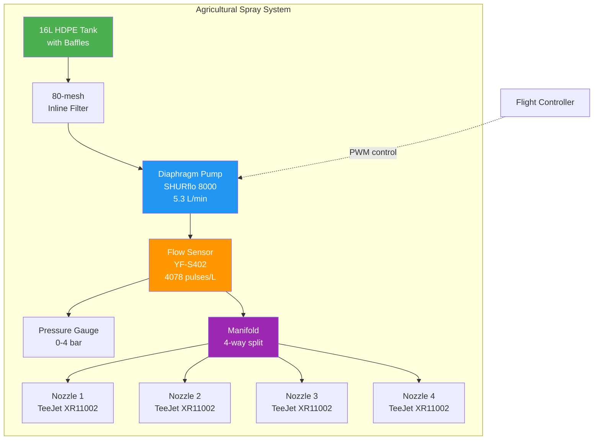

# Spray Systems for Agricultural Drones

## Overview

Agricultural spray drones deliver pesticides, herbicides, and fertilizers with precision. System design balances flow rate, droplet size, coverage area, and payload capacity.



## Pump Types

### Diaphragm Pumps

- **Model:** SHURflo 8000 series
- **Flow Rate:** 1-5 L/min
- **Pressure:** 0-60 PSI
- **Power:** 12V DC, 5-15A
- **Advantages:** Self-priming, chemical resistant, low maintenance
- **Disadvantages:** Pulsating flow, limited pressure
- **Use Case:** Most agricultural drone applications

### Centrifugal Pumps

- **Flow Rate:** 5-20 L/min
- **Pressure:** 0-30 PSI
- **Power:** 12-24V DC, 10-30A
- **Advantages:** Continuous flow, high volume
- **Disadvantages:** Not self-priming, less precise
- **Use Case:** Large area, high-volume applications

### Piston Pumps

- **Flow Rate:** 1-10 L/min
- **Pressure:** 0-100+ PSI
- **Power:** 12-24V DC, 10-25A
- **Advantages:** High pressure, precise flow control
- **Disadvantages:** Heavy, complex, higher maintenance
- **Use Case:** Precision applications requiring high pressure

### Pump Selection Guide

| Application       | Recommended Pump | Flow Rate | Pressure |
|-------------------|------------------|-----------|----------|
| Small field (<1ha)| Diaphragm        | 1-2 L/min | 20-30 PSI|
| Medium field (1-5ha)| Diaphragm      | 2-4 L/min | 30-40 PSI|
| Large field (>5ha)| Centrifugal      | 5-10 L/min| 20-30 PSI|
| Precision spot    | Piston           | 1-3 L/min | 40-60 PSI|

## Nozzle Types

### Flat-Fan Nozzles

- **Model:** TeeJet 11002
- **Flow Rate:** 0.20 US gpm at 40 PSI
- **Spray Angle:** 110°
- **Droplet Size:** 200-400 µm
- **Pattern:** Flat fan shape
- **Use Case:** General spraying, herbicide application
- **Advantages:** Uniform coverage, well-characterized

### Hollow-Cone Nozzles

- **Flow Rate:** 0.15-0.5 gpm at 40 PSI
- **Spray Angle:** 80-120°
- **Droplet Size:** 100-300 µm
- **Pattern:** Hollow cone shape
- **Use Case:** Insecticide, fungicide application
- **Advantages:** Fine droplets, good canopy penetration

### Air-Induction Nozzles

- **Flow Rate:** 0.2-0.8 gpm at 40 PSI
- **Spray Angle:** 80-120°
- **Droplet Size:** 300-600 µm
- **Pattern:** Air-included droplets
- **Use Case:** Drift-prone applications
- **Advantages:** Reduced drift, larger droplets

### Nozzle Selection Guide

| Application       | Nozzle Type    | Droplet Size | Angle  |
|-------------------|----------------|--------------|--------|
| Herbicide         | Flat-fan       | 200-400 µm   | 110°   |
| Insecticide       | Hollow-cone    | 100-300 µm   | 80°    |
| Fungicide         | Flat-fan       | 150-300 µm   | 110°   |
| Drift-prone area  | Air-induction  | 300-600 µm   | 80°    |

## Flow Rate Specifications

### Typical Agricultural Rates

| Crop Type    | Flow Rate    | Application Rate |
|--------------|--------------|------------------|
| Rice         | 1.5-2.5 L/min| 10-15 L/ha       |
| Wheat        | 1.0-2.0 L/min| 8-12 L/ha        |
| Cotton       | 2.0-3.0 L/min| 15-25 L/ha       |
| Orchards     | 2.0-5.0 L/min| 20-40 L/ha       |
| Vegetables   | 1.0-2.0 L/min| 10-20 L/ha       |

### Application Rate Formula

```
Application Rate (L/ha) = (Flow Rate (L/min) × 60) / (Speed (km/h) × Swath Width (m))

Example:
- Flow Rate: 2 L/min
- Speed: 5 km/h
- Swath Width: 3m
- Application Rate: (2 × 60) / (5 × 1000/10000 × 3) = 8 L/ha
```

## TeeJet XR11002 Specifications

### Detailed Specifications

- **Model:** XR11002
- **Orifice Size:** 0.020 inches (0.508mm)
- **Flow Rate:** 0.20 US gpm at 40 PSI
- **Pressure Range:** 20-60 PSI
- **Spray Angle:** 110°
- **Droplet Size:** 250-400 µm (at 40 PSI)
- **Material:** Acetal (chemical resistant)
- **Color Code:** Orange (02 size)

### Performance Table

| Pressure (PSI) | Flow Rate (gpm) | Droplet Size (µm) |
|----------------|-----------------|-------------------|
| 20             | 0.14            | 350-500           |
| 30             | 0.17            | 300-450           |
| 40             | 0.20            | 250-400           |
| 50             | 0.22            | 220-370           |
| 60             | 0.24            | 200-350           |

## Pressure Regulation

### System Components

1. **Pump:** Generates pressure
2. **Pressure Gauge:** Monitors system pressure
3. **Pressure Regulator:** Maintains constant pressure
4. **PWM Controller:** Adjusts pump speed
5. **Check Valve:** Prevents backflow

### Pressure Control Methods

- **Mechanical Regulator:** Fixed pressure, simple
- **PWM Control:** Variable speed, precise control
- **Electronic Regulator:** Feedback control, most accurate
- **Combination:** PWM + mechanical for redundancy

### Pressure Settings

| Application       | Pressure (PSI) | Notes                    |
|-------------------|----------------|--------------------------|
| General spraying  | 30-40          | Standard setting         |
| Fine droplets     | 40-60          | Smaller droplets         |
| Coarse droplets   | 20-30          | Larger droplets, less drift|
| High coverage     | 35-45          | Balanced approach        |

## Flow Sensors

### YF-S402 Hall-Effect Sensor

- **Type:** Hall-effect turbine
- **Range:** 0.3-6 L/min
- **Output:** Pulse frequency (4078 pulses/L)
- **Voltage:** 5-12V DC
- **Accuracy:** ±10%
- **Response Time:** <1 second
- **Price:** $10-20

### Specifications

| Parameter       | Value                |
|-----------------|----------------------|
| Flow Range      | 0.3-6 L/min         |
| Output Frequency| 4078 pulses/L        |
| Max Pressure    | 1.0 MPa (145 PSI)   |
| Operating Temp  | -25°C to +80°C      |
| Material        | Nylon (chemical resistant)|

### Calibration

```
Calibration Factor = Known Volume (L) × 4078 pulses/L

Example:
- 10L bucket test
- Expected: 10 × 4078 = 40,780 pulses
- Actual count: 42,500 pulses
- Correction factor: 40780/42500 = 0.9595
```

### Calibration Procedure

1. **Setup:** Connect sensor inline with pump
2. **Collection:** Place container of known volume
3. **Run:** Operate pump for measured time
4. **Count:** Record pulse count
5. **Calculate:** Determine actual flow rate
6. **Adjust:** Update firmware calibration factor

## Tank Design

### Tank Materials

- **HDPE (High-Density Polyethylene):** Chemical resistant, lightweight
- **Polypropylene:** Good chemical resistance, lower cost
- **Stainless Steel:** Durable, easy clean, heavy
- **FRP (Fiber Reinforced Plastic):** Custom shapes, strong

### Tank Sizes

| Drone Size | Tank Capacity | Typical Use          |
|------------|---------------|----------------------|
| Small (<10kg)| 5-10L       | Small field, testing |
| Medium (10-20kg)| 10-20L   | General agriculture  |
| Large (20-30kg)| 20-40L   | Large field operations|
| Industrial (>30kg)| 40-100L | Heavy-lift operations|

### Baffle Design

- **Purpose:** Prevent liquid slosh during flight
- **Configuration:** 2-4 compartments
- **Flow:** Allow liquid flow between compartments
- **Material:** Same as tank (HDPE)
- **Benefits:** Improved stability, reduced weight shift

### Tank Features

- **Fill Port:** Wide mouth for easy filling
- **Drain Port:** Low point for complete drainage
- **Level Sensor:** Ultrasonic or float type
- **Mixing:** Agitator for chemical mixing
- **Cleanout:** Access port for cleaning

## System Integration

### Electrical Connections

```
Battery → Main Switch → Distribution Board
                         ↓
                    Pump Controller (PWM)
                         ↓
                    Pressure Sensor (Analog)
                         ↓
                    Flow Sensor (Pulse)
                         ↓
                    Flight Controller (GPIO)
```

### Flight Controller Integration

#### ArduPilot Configuration

```
# Pump Control
RELAY_PIN = 54 (GPIO pin)
RELAY_FUNCTION = 22 (Spray)

# Flow Sensor
RPM_SENSOR_ENABLE = 1
RPM_SENSOR_PIN = 55 (GPIO pin)
RPM_SCALING = 4078 (pulses per liter)

# Pressure Sensor
ANALOG_PIN = 0 (ADC pin)
ANALOG_SCALING = 0.1 (V/PSI)
```

### PWM Control

```
# PWM Configuration
PWM_FREQ = 1000 (1kHz)
PWM_MIN = 1000 (µs)
PWM_MAX = 2000 (µs)
PWM_OFF = 1000 (µs)
PWM_FULL = 2000 (µs)
```

## Calibration and Testing

### Bucket Test

1. **Prepare:** 10L bucket, timer, scale
2. **Setup:** Run system into bucket
3. **Measure:** Time to fill known volume
4. **Calculate:** Flow rate = Volume / Time
5. **Compare:** With expected flow rate
6. **Adjust:** Update calibration factors

### Field Calibration

1. **Reference:** Use known application rate
2. **Measure:** Actual coverage area
3. **Calculate:** Actual vs. theoretical rate
4. **Adjust:** Modify flow rate or speed
5. **Verify:** Spot-check with sample collection

### Spray Pattern Test

1. **Setup:** Place sampling cards in grid pattern
2. **Spray:** Run system over grid
3. **Analyze:** Measure deposition on cards
4. **Calculate:** Uniformity coefficient
5. **Adjust:** Modify nozzle height or pressure

## DJI Agras T100 Reference

### Specifications

- **Tank Capacity:** 100L
- **Spray Rate:** 40 L/min
- **Coverage:** 156 acres/hour
- **Nozzles:** 16 (XR11002 or equivalent)
- **Pump:** Centrifugal, high-volume
- **Control:** DJI FlightHub 2
- **GPS:** RTK for precision application
- **Weight:** 52.5kg (empty)

### Performance Metrics

- **Swath Width:** 6-8m
- **Flight Speed:** 3-8 m/s
- **Application Rate:** 1-20 L/ha (adjustable)
- **Droplet Size:** 100-500 µm (nozzle dependent)
- **Efficiency:** 10-20× faster than manual

### Lessons Learned

- **Tank Design:** Baffles essential for large volumes
- **Pump Selection:** Centrifugal for high flow
- **Nozzle Array:** Multiple nozzles for uniform coverage
- **Control System:** Real-time flow monitoring
- **Maintenance:** Daily cleaning required

## Safety Considerations

### Chemical Handling

- **PPE:** Gloves, mask, goggles when mixing
- **Ventilation:** Mix in well-ventilated area
- **Spill Kit:** Keep on-site for emergencies
- **Storage:** Locked, labeled containers
- **Disposal:** Follow local regulations

### Operational Safety

- **Wind Speed:** <10 km/h for spraying
- **No Fly Zones:** Stay away from people, animals, water
- **Buffer Zones:** 10-30m from sensitive areas
- **Emergency Stop:** Kill switch for pump
- **Communication:** Ground crew in constant contact

## Maintenance

### Daily Maintenance

1. **Flush System:** Run clean water through entire system
2. **Clean Nozzles:** Soak in cleaning solution
3. **Inspect Filters:** Clean or replace
4. **Check Connections:** Tighten all fittings
5. **Lubricate:** Moving parts (per manual)

### Weekly Maintenance

1. **Deep Clean:** Full system flush with detergent
2. **Inspect Pump:** Check diaphragm and valves
3. **Calibrate:** Verify flow rate accuracy
4. **Test Pressure:** Check for leaks
5. **Update Firmware:** If available

### Seasonal Maintenance

1. **Winterize:** Anti-freeze solution for cold storage
2. **Replace Wear Parts:** Diaphragms, seals
3. **Full Inspection:** Check all components
4. **Documentation:** Log maintenance activities
5. **Training:** Review procedures with crew

## Sources

- mdpi.com - Agricultural drone spray research
- sciencedirect.com - Spray system engineering
- atlantis-press.com - Precision agriculture
- teejet.com - Nozzle specifications
- shurflo.com - Pump specifications
- yf-sensor.com - Flow sensor documentation
- dji.com - Agras series specifications
- ardupilot.org - Sprayer configuration

---

## EFT E616P Build Connection

> **Our spray system: SHURflo 8000 pump + 4× TeeJet XR11002 nozzles + YF-S402 flow sensor + 16L HDPE tank.**

### Complete Component Specs

| Component | Specification | Source |
|---|---|---|
| **Tank** | 16L HDPE, 380×280×280mm, 800g, 4 baffles | jmrdrone.com |
| **Pump** | SHURflo 8000, 213×102×104mm, 1860g | Pentair datasheet |
| Pump Flow | 5.3 L/min (open), 4.3 L/min @ 40 PSI | Pentair datasheet |
| Pump Pressure | 2.1 bar max (30 PSI) | Pentair datasheet |
| Pump Power | 12V DC, 60W normal, 90W peak | Pentair datasheet |
| Pump Inlet/Outlet | 3/8" NPT Female | Pentair datasheet |
| Pump Mounting Base | 57 × 79 mm | Pentair datasheet |
| **Nozzles** | 4× TeeJet XR11002 | teejet.com |
| Nozzle Body | 15mm dia × 12mm (gray polymer) | teejet.com |
| Nozzle Cap | 25mm dia × 30mm (Quick TeeJet) | teejet.com |
| Nozzle Tip | Green VisiFlo (02 size) | teejet.com |
| Flow @ 40 PSI | 0.20 GPM (0.76 L/min) per nozzle | teejet.com |
| Spray Angle | 110° | teejet.com |
| Connection | 1/4" BSP Quick TeeJet | teejet.com |
| **Flow Sensor** | YF-S402, 58×35×27mm, 29g | tomsonelectronics.com |
| Sensor Thread | G1/4" BSPP | tomsonelectronics.com |
| Flow Range | 0.5–6 L/min ±3% | tomsonelectronics.com |
| Pulses/Liter | 4,078 | tomsonelectronics.com |
| **Manifold** | Brass 4-way, 6mm push-to-connect | COEP Report |
| **Bypass Valve** | PWM controlled, normally closed | COEP Report |
| **Pressure Relief** | 4 bar set point | COEP Report |

### Performance Summary
| Metric | Value |
|---|---|
| Pump Max | 5.3 L/min |
| Nozzle Demand (×4 @ 2 bar) | 3.16 L/min |
| Mission Effective Flow | ~1.34 L/min |
| Spray Time per Tank | ~12 min |
| Swath Width | 2.0 m |
| Application Rate | ~4 L/ha @ 5 m/s |
| Droplet VMD | 220 µm (medium) |
| Application Rate (target) | 200–300 L/ha |

---

## Common Mistakes & Pitfalls

| Mistake | Consequence | Prevention |
|---|---|---|
| No bypass valve | Pressure spikes, nozzle damage | Install PWM-controlled bypass |
| Wrong nozzle size | Uneven coverage, drift | Match nozzle to pressure and speed |
| No flow sensor feedback | Can't verify spray rate | Install YF-S402 inline |
| Tank not baffled | CG shift during flight, instability | Use baffled tank (4 sections minimum) |
| No pressure relief valve | System overpressure, burst tubing | Install 4 bar PRV |
| Clogged filter | Reduced flow, pump damage | Clean 80-mesh filter regularly |
| Wrong chemical compatibility | Tank/pump degradation | Use HDPE tank, Viton seals |

---

## Quick Troubleshooting

| Problem | Likely Spray Issue | Fix |
|---|---|---|
| Low flow rate | Clogged filter, pump wear | Clean filter, check pump diaphragm |
| Uneven spray pattern | Nozzle clogged, pressure imbalance | Clean nozzles, check manifold |
| Pressure too high | Bypass valve stuck closed | Check bypass valve operation |
| Pressure too low | Pump worn, leak in system | Check pump, inspect tubing |
| No spray at all | Pump not running, fuse blown | Check pump power, fuses, wiring |
| Chemical settling | No agitation in tank | Add mixing feature, use baffles |

---

## Datasheet & Product Links

| Resource | URL |
|---|---|
| SHURflo 8000 | https://www.shurflo.com |
| TeeJet XR11002 | https://www.teejet.com |
| YF-S402 Flow Sensor | https://www.amazon.com/YF-S402 |
| ArduPilot Sprayer Config | https://ardupilot.org/plane/docs/common-sprayer.html |
| DJI Agras T50 Specs | https://ag.dji.com/t50/specs |

---

*Enrichment added: May 29, 2026 | Template v1.0*
