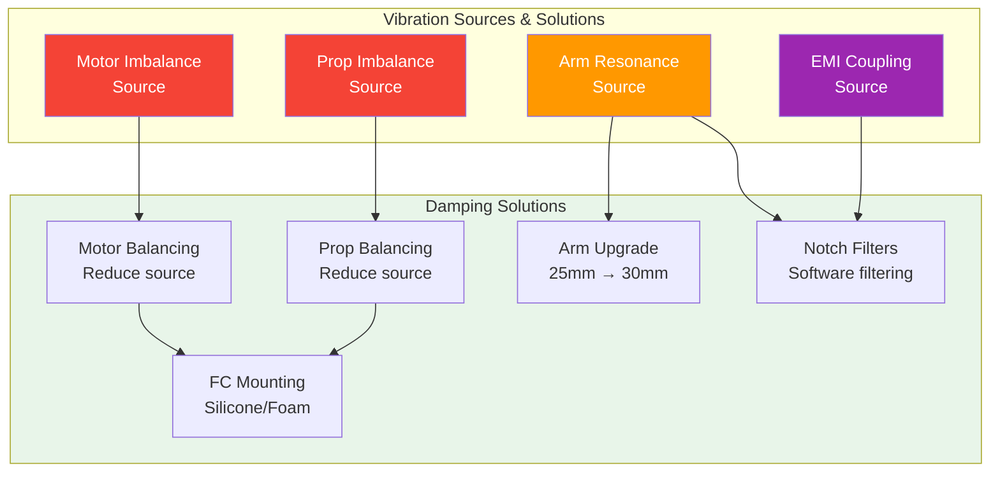

# 13. Vibration Damping



### ArduPilot Vibration Thresholds
```
VIBE Level (m/s²)    Status              Action
─────────────────────────────────────────────────
< 15                 Excellent           No action needed
15-30                Acceptable          Monitor, minor tuning
30-60                Warning             Investigate source
> 60                 Critical            Ground immediately
```

## Why Vibration Matters

Vibration is the silent killer of drone performance. Excessive vibration degrades flight stability, causes sensor noise, reduces video quality, and accelerates component fatigue. Understanding and mitigating vibration is essential for reliable autonomous operations.

---

## Sources of Vibration

### Motor Imbalance
- Slightly off-center rotor mass creates periodic vibration
- Frequency matches motor RPM (e.g., 10,000 RPM = 167 Hz)
- Manufacturing tolerances vary between motors
- Brushless motors generally smoother than brushed

### Propeller Imbalance
- Most common source of vibration in multirotors
- Uneven blade mass distribution creates 1X RPM vibration
- New props may still be imbalanced from factory
- Damaged or bent props cause severe imbalance
- Two-blade props vibrate at 2X blade pass frequency

### Arm Resonance
- Frame arms have natural frequencies that can amplify vibration
- 25mm diameter arms: approximately 32 Hz natural frequency
- 30mm diameter arms: approximately 48 Hz natural frequency
- If motor RPM matches arm resonance, vibration amplifies dramatically
- Stiffer arms push resonance frequency higher, away from operating range

### Other Sources
- Loose screws or components
- Unbalanced battery placement
- Bent motor shafts
- Damaged bearings
- Poorly mounted flight controller

---

## Vibration Thresholds

### ArduPilot VIBE Values
ArduPilot logs vibration data in the VIBE message:

| VIBE (m/s²) | Status | Action |
|-------------|--------|--------|
| 0-15 | Excellent | No action needed |
| 15-30 | Good | Acceptable for most operations |
| 30-60 | Marginal | Investigate and reduce |
| 60-90 | Poor | Significant performance degradation |
| >90 | Critical | Do not fly, fix immediately |

### IMU Clipping
- Clipping occurs when vibration exceeds IMU sensor range
- Check VIBE.Clip0 and VIBE.Clip1 in ArduPilot logs
- Acceptable: zero or very low (<100 counts per log sample)
- Increasing clipping over time indicates worsening vibration
- High clipping causes position hold drift and erratic behavior

### AutoTune Impact
- Vibration above 30 m/s² may cause AutoTune failure
- High vibration corrupts rate controller tuning
- Fix vibration before attempting AutoTune

---

## Flight Controller Mounting Methods

### Foam Pads (Simple)
- Double-sided foam tape or pads
- Low cost, easy to install
- Provides basic isolation
- May degrade over time (heat, UV)
- Adequate for well-balanced frames

### Rubber Grommets (Better)
- Soft rubber vibration isolation mounts
- Common M3 grommet style mounts
- Better isolation than foam
- Replace when hardened or cracked
- Good balance of isolation and rigidity

### Silicone Dampeners
- High-quality silicone rubber mounts
- Excellent vibration absorption
- Temperature stable
- Longer lifespan than foam
- Recommended for high-performance builds

### Hard Mounting
- Direct screw mounting to frame
- NO vibration isolation
- Required for some competition builds
- Accepts higher vibration for maximum rigidity
- Not recommended for general use

---

## Vibration Isolation Theory

### Natural Frequency Rule
The mount's natural frequency should be **1/3 or less** of the lowest vibration frequency you want to isolate.

**Example:**
- Motors spinning at 5,000 RPM = 83 Hz vibration
- Mount natural frequency should be ≤27 Hz
- Softer mounts = lower natural frequency = better isolation
- Too soft = FC moves excessively during maneuvers

### Mount Stiffness Trade-off
| Mount Type | Natural Frequency | Isolation | Rigidity |
|-----------|-------------------|-----------|----------|
| Hard mount | N/A | None | Maximum |
| Firm foam | 40-60 Hz | Low | High |
| Soft foam | 20-30 Hz | Medium | Medium |
| Silicone | 15-25 Hz | High | Medium-Low |
| Soft rubber | 10-20 Hz | Very High | Low |

---

## Propeller Balancing

### Why Balance Props
- Reduces 1X RPM vibration significantly
- Improves video quality (less jello effect)
- Extends motor bearing life
- Improves flight efficiency

### Balancing Method
1. Use a prop balancer (magnetic or blade style)
2. Place prop on balancer shaft
3. Heavy blade drops down
4. Remove material from heavy side (sandpaper on blade)
5. Repeat until prop balances level
6. Check both blades independently

### When to Balance
- New props (factory balance varies)
- After any prop damage
- Before competition or critical missions
- When vibration warnings appear

---

## Motor Balancing

### Checking Motor Health
- Spin motor by hand, feel for roughness or grinding
- Check bell runout (wobble) visually
- Listen for bearing noise at various speeds
- Inspect shaft for bends or damage

### Bell Runout Check
- Mount motor securely
- Spin by hand while observing bell edge
- Use dial indicator for precision measurement
- Acceptable runout: <0.1mm
- Bent shafts cause severe vibration

### Bearing Maintenance
- Bearings wear over time (typically 50-100 hours)
- Symptoms: noise, roughness, play
- Replace with same size/type bearings
- Clean with isopropyl alcohol before replacement
- Some bearings can be oiled (non-sealed types)

---

## FFT Vibration Analysis

### What is FFT Analysis
- Fast Fourier Transform converts time-domain vibration to frequency domain
- Identifies specific vibration frequencies
- Helps match vibrations to sources

### Using FFT in ArduPilot
1. Enable FFT logging: `FFT_ENABLE = 1`
2. Fly and collect logs
3. Analyze with ArduPilot Log Viewer or MavExplorer
4. Look for peaks at expected frequencies

### Frequency-to-Source Matching
| Frequency | Likely Source |
|-----------|--------------|
| Motor RPM (1X) | Prop imbalance |
| 2X Motor RPM | Blade pass frequency |
| 3-6X Motor RPM | Higher harmonics, motor issues |
| Frame natural frequency | Arm resonance |
| ~50 Hz | Electrical noise (50/60 Hz) |

### Dynamic Notch Filters
- ArduPilot and Betaflight use FFT to identify vibration peaks
- Dynamic notch filters automatically track and reject these frequencies
- Enable `DYN_NOTCH` features for automatic vibration rejection
- RPM filtering in Betaflight uses motor RPM data for filtering

---

## Practical Tips

### Build Checklist
1. Balance all props before first flight
2. Check motor spin by hand before installation
3. Use vibration-dampening FC mount
4. Verify no loose components
5. Check arm tightness after assembly

### Flight Testing
1. Hover at low altitude, check VIBE values
2. If VIBE > 30 m/s², land and investigate
3. Check for loose props or components
4. Review blackbox/flight logs for vibration patterns
5. Address issues before full mission

### Maintenance Schedule
- Re-check props every 10 flights
- Inspect motors every 20 flights
- Replace FC mount dampeners every 50 flights
- Log vibration trends over time

---

## Sources

- ArduPilot Vibration Handling: https://ardupilot.org/copter/docs/vibration-damping.html
- Oscar Liang Vibration Guide: https://oscarliang.com/vibration-damping/
- ArduPilot FFT Analysis: https://ardupilot.org/copter/docs/common-imu-benchmarking.html
- Betaflight Dynamic Filters: https://betaflight.com/docs/configuration/filtering

---

## EFT E616P Build Connection

> **⚠️ Critical: 25mm arm natural frequency (32 Hz) overlaps with motor shaft frequency at hover (32-36 Hz). Resonance risk.**

### Vibration Thresholds for Our Build
| VIBE Level (m/s²) | Status | Action |
|---|---|---|
| <15 | Excellent | No action needed |
| 15–30 | Good | Monitor, minor tuning |
| 30–60 | Warning | Investigate source |
| >60 | Critical | Ground immediately |

### Our Vibration Mitigation Strategy
1. Balance all MFP 36×11 props before first flight
2. Check X9 G2L motor bell runout (<0.1mm acceptable)
3. Mount Pixhawk 6C on silicone grommets
4. Enable dynamic notch filters in ArduPilot
5. Enable bidirectional DShot for RPM filtering
6. **Upgrade arm to 30mm OD** (shifts resonance from 32Hz to 48Hz)

### Arm Resonance Calculation
- 25mm arm: f_n = 32 Hz (OVERLAPS with motor RPM at hover)
- 30mm arm: f_n = 48 Hz (safe margin above motor frequency)
- Motor hover RPM: 1,916–2,146 RPM = 32–36 Hz
- **Recommendation: Upgrade to 30mm arm tube**

---

## Common Mistakes & Pitfalls

| Mistake | Consequence | Prevention |
|---|---|---|
| Not balancing props | Excessive vibration, video jello | Balance ALL props before first flight |
| Ignoring VIBE warnings | Unstable flight, sensor noise | Check VIBE values after every flight |
| Hard-mounting FC | Maximum vibration to sensors | Use silicone grommets or foam pads |
| Not enabling notch filters | Vibration passes through to PID | Enable DYN_NOTCH in ArduPilot |
| Wrong arm diameter | Resonance at motor RPM | Upgrade to 30mm arm |

---

## Quick Troubleshooting

| Problem | Likely Vibration Issue | Fix |
|---|---|---|
| High VIBE (>60) | Unbalanced props, motor issue | Balance props, check motor bearings |
| Jello in video | Vibration transmitting to camera | Dampen camera mount, balance props |
| Drift in position hold | Vibration corrupting IMU | Check VIBE, fix source, enable notch filters |
| AutoTune fails | Vibration too high | Fix vibration before AutoTune |
| Oscillations at hover | Arm resonance | Upgrade arm diameter, check frequency |

---

## Datasheet & Product Links

| Resource | URL |
|---|---|
| ArduPilot Vibration Guide | https://ardupilot.org/copter/docs/vibration-damping.html |
| ArduPilot FFT | https://ardupilot.org/copter/docs/common-imu-benchmarking.html |
| Prop balancer | https://www.amazon.com/prop-balancer |
| Silicone grommets | https://www.amazon.com/silicone-grommets-m3 |

---

*Enrichment added: May 29, 2026 | Template v1.0*
