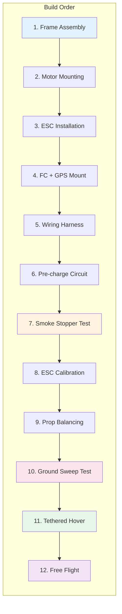
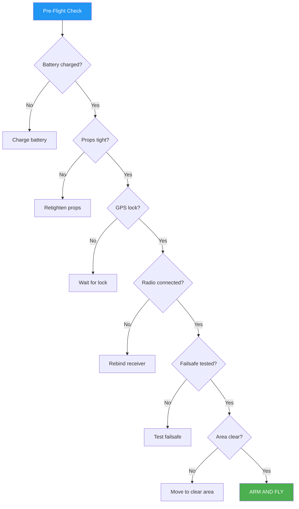

# 14. Assembly Tips

### Pre-Flight Checklist Flowchart

## Build Order

Following the correct assembly sequence prevents rework and ensures a clean build.

### Recommended Sequence
1. **Frame assembly** — Assemble arms and center plates
2. **Motors** — Mount and secure to arms
3. **ESCs** — Mount and connect to motors
4. **Power distribution** — PDB or integrated power system
5. **Flight controller** — Mount with vibration dampening
6. **Wiring** — Solder power and signal connections
7. **GPS module** — Mount on mast, away from interference
8. **Receiver and antennas** — Mount with antenna routing
9. **VTX and camera** — Video system installation
10. **Props** — Install last, before first flight

### Frame Assembly Tips
- Use threadlocker on frame bolts (medium strength)
- Tighten in star pattern for even pressure
- Verify frame is square before tightening
- Check arm alignment with straight edge

---

## Soldering Fundamentals

### Equipment Settings
- Temperature: 350-400°C (660-750°F) for leaded solder
- Higher temp for lead-free (400-420°C)
- Use appropriate tip size for pad size
- Clean tip between joints

### Soldering Process
1. **Tin the pad** — Apply small amount of solder to pad
2. **Tin the wire** — Apply solder to stripped wire end
3. **Heat joint** — Touch iron to pad and wire simultaneously
4. **Feed solder** — Apply to joint, not iron tip
5. **Remove solder** — Stop feeding when joint fills
6. **Remove iron** — Pull away cleanly
7. **Inspect** — Joint should be shiny and smooth

### Quality Indicators
| Joint Appearance | Status | Action |
|-----------------|--------|--------|
| Shiny, smooth, concave | Good | None |
| Dull, grainy | Cold joint | Reheat and add flux |
| Ball/bead shape | Excess solder | Remove with wick |
| Bridged pads | Short circuit | Remove with wick |
| Burnt/charred | Overheated | Re-solder carefully |

### Common Soldering Mistakes
- Not enough heat (cold joints)
- Too much heat (damaged pads, lifted traces)
- No flux (poor wetting, cold joints)
- Moving joint before solidification
- Using wrong solder type

### Wire Preparation
- Strip minimal insulation (just enough for joint)
- Tin stranded wire to prevent fraying
- Use heat shrink on all exposed joints
- Route wires away from moving parts

---

## Screw Tightening

### Threadlocker Usage
| Type | Color | Strength | Application |
|------|-------|----------|-------------|
| Loctite 222 | Purple | Low | Small screws (<M3), delicate parts |
| Loctite 243 | Blue | Medium | Motor screws, frame bolts |
| Loctite 271 | Red | High | Permanent joints only |
| Loctite 248 | Blue | Medium | Stick format, convenient |

### Motor Screw Best Practices
- Use Loctite 243 (blue) on all motor screws
- Apply to threads, not head
- Allow 24 hours to cure before flight
- Reapply after any motor removal
- Never use red (permanent) on motors

### Torque Specifications
- M2 screws: 0.3-0.5 Nm
- M3 screws: 0.8-1.2 Nm
- Motor mount screws: finger-tight + 1/4 turn with threadlocker
- Over-tightening strips threads or cracks carbon fiber

### Screw Inspection
- Check tightness before every flight
- Look for vibration-loosened screws
- Replace damaged or worn screws
- Use correct length (too long damages motor windings)

---

## Wire Management

### Organization Methods
- **Zip ties** — Secure bundles at regular intervals
- **Heat shrink bundles** — Group and protect wire runs
- **Adhesive mounts** — Route wires along frame
- **Velcro straps** — Temporary, adjustable routing
- **Spiral wrap** — Protect wire bundles

### Routing Rules
- Keep power wires away from signal wires
- Route antenna cables away from ESCs
- No loose wires near propeller arc
- Secure wires to prevent fatigue from vibration
- Leave service loops for maintenance access

### Wire Sizing Guide
| Application | Wire Gauge | Current Capacity |
|-------------|-----------|-----------------|
| Battery to PDB | 12-14 AWG | 30-60A |
| PDB to ESC | 14-16 AWG | 20-30A |
| ESC to Motor | 16-18 AWG | 10-20A |
| Signal wires | 24-28 AWG | <1A |

### Color Coding Convention
- Red: Positive power
- Black: Negative/Ground
- Yellow: Signal/PWM
- White: Telemetry/serial
- Green: I2C/compass

---

## Connector Orientation

### Battery Connector
- Always verify polarity before connecting
- Use XT60 (up to 60A) or XT90 (up to 90A) connectors
- Yellow/gold = positive, black = negative
- Never force a reversed connector
- Inspect connector for damage before each use

### Signal Connector Polarity
- ESC signal: check pinout diagram
- Receiver connections: match channel assignments
- GPS connections: verify TX/RX crossover
- Use multimeter to verify if unsure

---

## First Power-Up Procedure

### Smoke Stopper
A smoke stopper is essential for first power-up:
- Limits current to prevent component damage
- Use automotive bulb (1156) or dedicated device
- Connect between battery and drone
- If bulb glows brightly, short circuit exists
- Disconnect immediately and inspect

### Initial Checks
1. Power on with props removed
2. Verify all ESCs initialize (beep sequence)
3. Check motor rotation direction (using stick commands)
4. Verify radio control response
5. Check telemetry link
6. Verify GPS lock

### ESC Calibration
- Calibrate throttle range for all ESCs simultaneously
- Follow FC firmware instructions (Betaflight/ArduPilot)
- Verify consistent throttle response
- Check low voltage cutoff settings

### Motor Direction Verification
- Remove props first
- Use motor tab in configurator
- Verify correct rotation for each position
- CW motors: top-right, bottom-left (X-config)
- CCW motors: top-left, bottom-right (X-config)

---

## Propeller Installation

### Rotation Direction
- CW props: marked or shaped for clockwise rotation
- CCW props: marked or shaped for counter-clockwise
- Mounting wrong direction = instant flip on takeoff
- Verify visually before every flight

### Tightening
- Tighten until snug, then 1/4 turn more
- Do not over-torque (cracks prop hub)
- Check for cracks around mounting hole
- Replace damaged props immediately
- Use prop wrench for consistent tightness

### Pre-Flight Prop Check
- Spin each prop by hand, listen for rubbing
- Check for cracks or damage
- Verify tightness
- Ensure no debris trapped

---

## Pre-Flight Checklist

### Battery
- [ ] Fully charged to correct cell count
- [ ] No damage, swelling, or smell
- [ ] Correct connector type
- [ ] Voltage reading matches expected

### Frame and Props
- [ ] All screws tight
- [ ] Props tight and correct direction
- [ ] No loose components
- [ ] Frame undamaged

### Electronics
- [ ] GPS lock (3D fix, good HDOP)
- [ ] Radio control responding
- [ ] Telemetry connected
- [ ] Failsafe tested
- [ ] Battery voltage reading correct

### Safety
- [ ] Failsafe set to RTH or LAND
- [ ] Geofence configured
- [ ] Launch area clear
- [ ] No people in flight path

---

## Testing Sequence

### Phase 1: Bench Test
- All electronics functional
- Motor direction correct
- Radio control responding
- No wiring errors

### Phase 2: Tethered Hover
- Secure drone with tether
- Hover at low altitude (1-2m)
- Check stability and vibration
- Verify GPS hold
- Test throttle response

### Phase 3: Free Flight
- Start in stabilization mode
- Hover and check position hold
- Test basic maneuvers
- Verify failsafe
- Gradually increase complexity

---

## Sources

- CADDX FPV Assembly Guide: https://caddxfpv.com
- FPV Know It All: https://fpvknowitall.com
- InsideFPV Build Tips: https://insidefpv.com
- Oscar Liang Soldering Guide: https://oscarliang.com/soldering-guide/

---

## EFT E616P Build Connection

> **Assembly order for our specific build:**

### Build Sequence (Our Build)
| Step | Action | Key Details |
|---|---|---|
| 1 | Frame Assembly | EFT E616P, threadlocker on all bolts |
| 2 | Motor Mounting | 6× X9 G2L, verify CW/CCW rotation |
| 3 | ESC Installation | Integrated in X9 G2L, 150A fuses |
| 4 | Power Distribution | Copper busbar, pre-charge circuit |
| 5 | FC + GPS Mounting | Vibration damped, GPS mast 350mm |
| 6 | Wiring Harness | 8AWG battery, 14AWG ESC, 26AWG signal |
| 7 | Smoke Stopper Test | 1156 bulb, check for shorts |
| 8 | ESC Calibration | Throttle range, motor direction |
| 9 | Compass Calibration | Rotate in all orientations |
| 10 | Radio Calibration | Full stick range |
| 11 | Flight Mode Config | Stabilize, Loiter, Auto, RTL, Land, Guided |
| 12 | Failsafe Config | RC, battery, GPS failsafes |
| 13 | Ground Sweep | No props, check vibration |
| 14 | Prop Balancing | Magnetic balancer |
| 15 | Tethered Hover | 5m tether, 0.5m altitude |
| 16 | Free Hover | 1-2m, position hold |
| 17 | Mode Testing | Stab→Loiter→RTL→Land |
| 18 | Flight Envelope | Altitude, speed, range |
| 19 | Spray Integration | Pump test, flow calibration |
| 20 | Mission Waypoints | Autonomous flight |

### Critical Torque Specs
| Screw Type | Torque | Threadlocker |
|---|---|---|
| M2 | 0.3–0.5 Nm | Loctite 222 (purple) |
| M3 | 0.8–1.2 Nm | Loctite 243 (blue) |
| Motor mount | Finger-tight + 1/4 turn | Loctite 243 (blue) |

---

## Common Mistakes & Pitfalls

| Mistake | Consequence | Prevention |
|---|---|---|
| Not using smoke stopper | Short circuit destroys components | Always test with smoke stopper first |
| Wrong motor direction | Drone flips on takeoff | Verify rotation in Motor Test before props |
| Skipping compass calibration | Erratic heading, flyaway | Calibrate away from metal |
| No threadlocker on motor screws | Screws vibrate loose | Loctite 243 on all motor screws |
| Props on before testing | Injury, damage | Always test motors without props first |

---

## Datasheet & Product Links

| Resource | URL |
|---|---|
| Smoke stopper | https://www.amazon.com/smoke-stopper-drone |
| Loctite 243 | https://www.loctite.com |
| Soldering iron (TS101) | https://www.miniware.com |
| Threadlocker guide | https://oscarliang.com/threadlocker-guide/ |

---

*Enrichment added: May 29, 2026 | Template v1.0*
