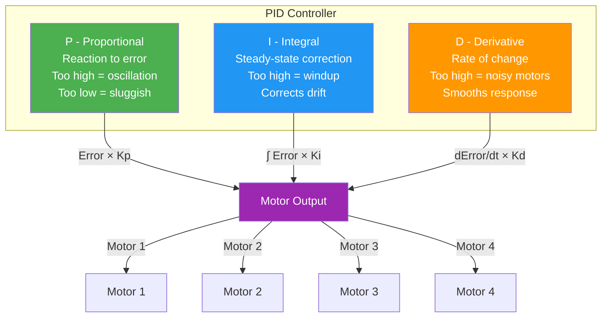
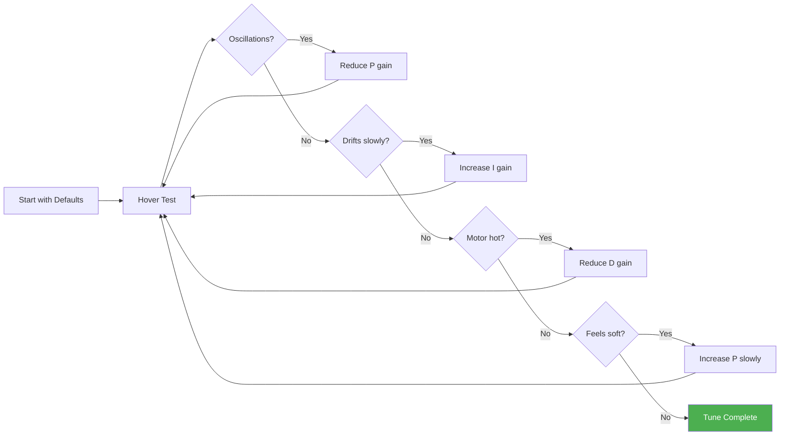

# 15. Tuning and Calibration

### Tuning Process Flow

## PID Controller Basics

### What is PID
PID stands for Proportional-Integral-Derivative. It is the control loop algorithm that keeps your drone stable and responsive.

### Proportional (P)
- Applies correction proportional to current error
- Higher P = more aggressive correction
- Too high = oscillations (visible wobble)
- Too low = sluggish response, drift
- Start with defaults, increase until oscillations appear, then back off

### Integral (I)
- Accumulates error over time
- Corrects steady-state error (drift, imbalance)
- Higher I = faster correction of sustained errors
- Too high = windup (slow recovery from aggressive maneuvers)
- Too low = slow return to level, drift in position hold

### Derivative (D)
- Predicts future error based on rate of change
- Smooths response, reduces overshoot
- Higher D = more damped, smoother flight
- Too high = noisy motors, heat, high-frequency oscillations
- Too low = overshoot, bounce-back after corrections

### PID Interaction
- P and D work together for response and damping
- I handles long-term accuracy
- Changes to one affect optimal values for others
- Tune P first, then D, then I

---

## Betaflight Tuning

### Default Tuning Strategy
1. Start with firmware defaults
2. Fly in acro mode, observe behavior
3. Adjust P gradually (increase by 5-10%)
4. Fly and re-evaluate
5. Adjust D to smooth out P-induced oscillations
6. Adjust I to fix drift and steady-state errors

### Betaflight PID Terms
| Term | Betaflight Name | Typical Range | Effect |
|------|----------------|---------------|--------|
| P (Roll) | roll_p | 40-80 | Roll response |
| I (Roll) | roll_i | 80-120 | Roll drift correction |
| D (Roll) | roll_d | 20-40 | Roll smoothing |
| P (Pitch) | pitch_p | 40-80 | Pitch response |
| I (Pitch) | pitch_i | 80-120 | Pitch drift correction |
| D (Pitch) | pitch_d | 20-40 | Pitch smoothing |
| P (Yaw) | yaw_p | 40-80 | Yaw response |
| I (Yaw) | yaw_i | 80-140 | Yaw drift correction |

### Filter Tuning in Betaflight
- **Gyro filter** — Low-pass filter on gyro signal
- **D-term filter** — Additional filtering on D term
- **Dynamic notch** — Automatically tracks vibration frequencies
- **RPM filtering** — Uses motor RPM data for precise filtering
- Higher filtering = more latency but cleaner signal
- Lower filtering = less latency but more noise

### Advanced Betaflight Features
- **Feedforward** — Anticipates stick inputs for faster response
- **Anti-gravity** — Boosts I-term during throttle changes
- **Integrated yaw** — Uses motor mixing for yaw authority
- **TPA** — Throttle PID attenuation reduces PIDs at high throttle

---

## ArduPilot Tuning

### Key Parameters
| Parameter | Description | Default Range |
|-----------|-------------|---------------|
| ATC_RAT_RLL_P | Roll rate P gain | 0.1-0.3 |
| ATC_RAT_RLL_I | Roll rate I gain | 0.01-0.05 |
| ATC_RAT_RLL_D | Roll rate D gain | 0.001-0.01 |
| ATC_RAT_PIT_P | Pitch rate P gain | 0.1-0.3 |
| ATC_RAT_PIT_I | Pitch rate I gain | 0.01-0.05 |
| ATC_RAT_PIT_D | Pitch rate D gain | 0.001-0.01 |
| ATC_RAT_YAW_P | Yaw rate P gain | 0.15-0.25 |
| MOT_THST_HOVER | Estimated hover throttle | 0.25-0.35 |

### ArduPilot Tuning Process
1. Verify vibration levels (VIBE < 30 m/s²)
2. Ensure GPS lock and good compass calibration
3. Fly in Stabilize mode, check basic stability
4. Switch to AltHold, verify altitude hold
5. Switch to Loiter, verify position hold
6. Run AutoTune for automated PID tuning

### AutoTune Procedure
1. Ensure good GPS lock (HDOP < 2.0)
2. Clear area, no obstacles nearby
3. Switch to AutoTune flight mode
4. Drone will automatically tune roll, pitch, and yaw
5. Monitor for 5-10 minutes
6. Land and save parameters
7. Test in Stabilize and Loiter modes

### AutoTune Tips
- Fly AutoTune in calm conditions (<10 km/h wind)
- Full battery recommended (AutoTune uses significant energy)
- Do not interrupt AutoTune process
- Re-run AutoTune if results are poor
- Manual fine-tuning may still be needed

---

## Filter Tuning

### Dynamic Notch Filters
- Automatically identify and reject vibration frequencies
- ArduPilot: `DYN_NOTCH_ENABLED = 1`
- Betaflight: Enable in configuration tab
- Reduces need for manual filter tuning
- Adapts to changing RPM and vibration profile

### RPM Filtering (Betaflight)
- Uses motor RPM data from ESC telemetry
- Creates precise notch filters at motor frequencies
- More effective than static notch filters
- Requires ESC telemetry (DShot telemetry or bidirectional DShot)
- Enable `RPM_FILTER` in Betaflight

### Filter Trade-offs
| Filter Setting | Latency | Noise Rejection | Recommendation |
|---------------|---------|-----------------|----------------|
| Low filtering | Low | Poor | Competition only |
| Medium filtering | Medium | Good | General use |
| High filtering | High | Excellent | High-vibration builds |

---

## Blackbox Logging

### What is Blackbox
- Records flight controller data at high frequency
- Captures gyro, PID, motor outputs, stick inputs
- Essential for diagnosing vibration and tuning issues

### Enabling Blackbox
- **Betaflight**: Enable in Configuration tab, set logging rate
- **ArduPilot**: Set `LOG_BITMASK` parameter
- Use onboard flash or SD card for storage

### Analyzing Blackbox Data
- **Betaflight**: Blackbox Explorer (free software)
- **ArduPilot**: Mission Planner, MavExplorer, APM Log
- Key things to look for:
  - Gyro traces for vibration peaks
  - PID traces for oscillations
  - Motor traces for saturation
  - Stick inputs vs response

### Blackbox Analysis Tips
- Compare left vs right motors for imbalance
- Look for consistent vibration frequencies
- Check D-term for noise (should be smooth)
- Identify throttle ranges with issues
- Compare multiple flights to track changes

---

## Calibration Procedures

### Accelerometer Calibration
1. Place drone on perfectly level surface
2. Access calibration in configurator/mission planner
3. Follow prompts (usually hold still for 10 seconds)
4. Verify level after calibration
5. Recalibrate after any crash or significant temperature change

### Compass Calibration
1. Move away from metal objects and electronics
2. Access compass calibration
3. Rotate drone in all orientations
4. Follow visual prompts (figure-8 motion)
5. Verify heading accuracy after calibration
6. Recalibrate if heading drifts

### Radio Calibration
1. Access radio calibration in configurator
2. Move all sticks through full range
3. Verify minimum, center, and maximum values
4. Set endpoints to achieve 1000-2000µs range
5. Verify channel mapping matches expected

### ESC Calibration
1. Remove props
2. Set throttle high
3. Power on drone
4. Wait for ESC initialization beeps
5. Set throttle low
6. Wait for confirmation beeps
7. Power cycle drone

### Voltage Calibration
- Verify battery voltage reading matches multimeter
- Adjust `BATT_VOLT_MULT` if needed
- Critical for accurate battery monitoring
- Calibrate with known-good multimeter

---

## Tuning Tips

### Common Issues and Solutions
| Symptom | Likely Cause | Solution |
|---------|-------------|----------|
| Oscillations | P too high | Reduce P gain |
| Drift | I too low | Increase I gain |
| Overshoot | D too low | Increase D gain |
| Jittery motors | D too high | Reduce D gain |
| Slow response | P too low | Increase P gain |
| Windup | I too high | Reduce I gain |

### Environmental Factors
- Cold weather: thinner air, may need more throttle
- Hot weather: denser air, slightly different response
- Altitude: thinner air at altitude reduces motor efficiency
- Wind: increases required control authority

### Iterative Process
- Tune one axis at a time
- Make small changes (5-10% at a time)
- Test after each change
- Keep notes of changes and results
- Re-tune after adding payload or changing battery

---

## Sources

- Betaflight Tuning Guide: https://betaflight.com/docs/tuning/
- ArduPilot Tuning Guide: https://ardupilot.org/copter/docs/tuning.html
- FPV Frenzy PID Tuning: https://fpvfrenzy.com
- FPV Tune Database: https://fpvtune.com
- Oscar Liang Tuning Guide: https://oscarliang.com/pid-tuning/

---

## EFT E616P Build Connection

> **ArduPilot PID tuning for our 45 kg MTOW hexacopter.**

### PID Starting Points for Our Build
| Parameter | Value | Description |
|---|---|---|
| ATC_RAT_RLL_P | 0.15 | Roll rate P gain |
| ATC_RAT_RLL_I | 0.10 | Roll rate I gain |
| ATC_RAT_RLL_D | 0.005 | Roll rate D gain |
| ATC_RAT_PIT_P | 0.15 | Pitch rate P gain |
| ATC_RAT_PIT_I | 0.10 | Pitch rate I gain |
| ATC_RAT_PIT_D | 0.005 | Pitch rate D gain |
| ATC_RAT_YAW_P | 0.20 | Yaw rate P gain |
| ATC_RAT_YAW_I | 0.02 | Yaw rate I gain |
| ATC_ANG_RLL_P | 4.5 | Angle P gain (roll) |
| ATC_ANG_PIT_P | 4.5 | Angle P gain (pitch) |
| ATC_ANG_YAW_P | 3.5 | Angle P gain (yaw) |
| MOT_THST_HOVER | 0.45 | Estimated hover throttle |

### Tuning Process
1. Verify VIBE < 30 m/s²
2. Ensure GPS lock (HDOP < 2.0)
3. Fly in Stabilize mode → check basic stability
4. Switch to AltHold → verify altitude hold
5. Switch to Loiter → verify position hold
6. Run AutoTune (5–10 min, calm conditions)
7. Fine-tune manually if needed

---

## Common Mistakes & Pitflies

| Mistake | Consequence | Prevention |
|---|---|---|
| Tuning with high vibration | Corrupted PID values | Fix vibration before tuning |
| AutoTune in wind | Poor PID values | Run AutoTune in calm conditions (<10 km/h) |
| Changing too many params | Unpredictable behavior | Change one parameter at a time |
| Not logging flights | Can't diagnose issues | Always log flights for analysis |
| Skipping compass calibration | Wrong heading | Calibrate before tuning |

---

## Datasheet & Product Links

| Resource | URL |
|---|---|
| ArduPilot Tuning Guide | https://ardupilot.org/copter/docs/tuning.html |
| ArduPilot AutoTune | https://ardupilot.org/copter/docs/autotune.html |
| ArduPilot Log Analysis | https://ardupilot.org/copter/docs/loganalysis.html |

---

*Enrichment added: May 29, 2026 | Template v1.0*
