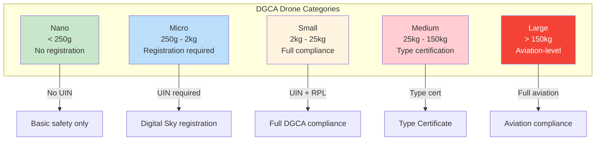
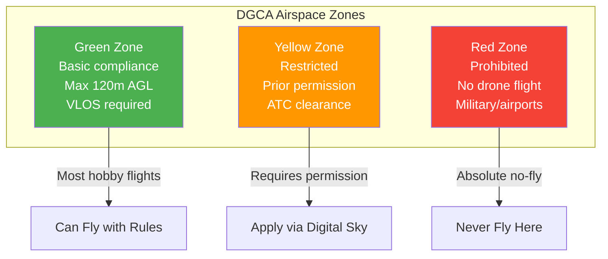

# 16. Safety and Regulations (India DGCA)

### Airspace Zones

## Overview

Operating drones in India is governed by the Directorate General of Civil Aviation (DGCA) under the Drone Rules 2021, amended in 2022 and 2023. Compliance is mandatory for legal operation.

---

## Drone Categories

### Classification by Weight
| Category | Weight | Registration | License | Operations |
|----------|--------|--------------|---------|------------|
| Nano | <250g | Not required | Not required | Uncontrolled airspace |
| Micro | 250g - 2kg | Required | Not required | Uncontrolled airspace |
| Small | 2kg - 25kg | Required | Required | Controlled airspace |
| Medium | 25kg - 150kg | Required | Required | Controlled airspace |
| Large | >150kg | Required | Required | Controlled airspace |

### Nano Category (Under 250g)
- No registration required
- No remote pilot license required
- Cannot fly above 50 feet (15m) AGL
- Cannot fly beyond Visual Line of Sight (VLOS)
- No commercial operations allowed
- No NPNT compliance required

### Micro Category (250g - 2kg)
- Must be registered on Digital Sky platform
- No remote pilot license for non-commercial use
- Can fly up to 200 feet (60m) AGL in uncontrolled airspace
- Commercial operations require license
- NPNT compliance required for new drones

### Small Category (2kg - 25kg)
- Full registration required
- Remote Pilot License (RPL) mandatory
- NPNT compliance mandatory
- Operations in controlled airspace require ATC permission
- Maximum altitude: 400 feet (120m) AGL
- Insurance mandatory

---

## Digital Sky Platform

### Registration Process
1. Visit digitalsky.dgca.gov.in
2. Create user account (Indian mobile number required)
3. Upload identity proof (Aadhaar/PAN/Passport)
4. Register drone with specifications
5. Obtain Unique Identification Number (UIN)
6. Display UIN on drone visibly

### Required Documents
- Identity proof (Aadhaar, PAN, or Passport)
- Address proof
- Drone purchase invoice
- Drone specifications and photos
- Insurance certificate (for Small+ categories)
- Remote Pilot License (for commercial operations)

### UIN Display
- Must be visible on drone body
- Engraved or permanently affixed
- Readable without disassembly
- Minimum 3mm character height

---

## NPNT (No Permission No Takeoff)

### What is NPNT
- Digital permission system for drone operations
- Drone cannot takeoff without digital authorization
- Permission granted through Digital Sky platform
- Real-time airspace management

### NPNT Compliance
- New drones manufactured after 2022 must be NPNT compliant
- Older drones can fly without NPNT in uncontrolled airspace
- NPNT app required for flight permission
- Permission valid for specific time and location

### How NPNT Works
1. Open NPNT app on mobile device
2. Request flight permission for location/time
3. System checks airspace restrictions
4. Permission granted or denied electronically
5. Drone receives permission signal before takeoff
6. Takeoff blocked without valid permission

### NPNT App Requirements
- Android smartphone with GPS
- Internet connectivity for permission request
- Bluetooth connection to drone (for new drones)
- Valid Digital Sky account

---

## Remote Pilot License (RPL)

### Who Needs RPL
- Commercial drone operations (any category)
- Small, Medium, and Large category operations
- Not required for nano/micro non-commercial use

### RPL Requirements
- Minimum 18 years of age
- 10th class education (minimum)
- Medical fitness certificate
- Pass DGCA written examination
- Pass practical flight test
- Valid for 5 years

### RPL Categories
| License | Drone Category | Weight |
|---------|---------------|--------|
| RPL-Micro | Micro | 250g - 2kg |
| RPL-Small | Small | 2kg - 25kg |
| RPL-Medium | Medium | 25kg - 150kg |
| RPL-Large | Large | >150kg |

### RPL Renewal
- Valid for 5 years from date of issue
- Renewal requires re-examination
- Medical fitness certificate required
- Apply 30 days before expiry

---

## Insurance Requirements

### Mandatory Insurance
- Required for all drones except Nano category
- Third-party liability insurance mandatory
- Coverage amount based on drone weight:

| Category | Maximum Coverage (IRDAI) |
|----------|-------------------------|
| Nano / Micro | ₹20,00,000 |
| Small | ₹30,00,000 |
| Medium | ₹40,00,000 |
| Large | ₹50,00,000 |

### Insurance Providers
- Available through IRDAI-registered insurers
- Compare premiums and coverage
- Keep insurance certificate accessible
- Renew before expiry

---

## Airspace Zones

### Zone Categories
| Zone | Color | Restrictions | Permissions |
|------|-------|-------------|-------------|
| Green | Green | Basic compliance only | Self-declaration |
| Yellow | Yellow | Restricted operations | ATC/State permission |
| Red | Red | Prohibited | Not permitted |

### Green Zone
- Uncontrolled airspace
- Basic compliance sufficient
- No special permission required
- Follow altitude and VLOS limits
- Most recreational flying in this zone

### Yellow Zone
- Controlled airspace near airports
- Restricted areas (military, government)
- State-imposed restrictions
- ATC or State permission required
- Check Digital Sky for zone boundaries

### Red Zone
- Completely prohibited for drone operations
- Areas of national security importance
- No permission granted
- Penalties for violation are severe
- Examples: airport runways, military bases, borders

### Checking Zone
- Use Digital Sky platform to check zone
- Mobile apps available for zone lookup
- Always verify before flying in unfamiliar areas
- Zone boundaries may change without notice

---

## Altitude and Distance Limits

### Maximum Altitude
- Nano: 50 feet (15m) AGL
- Micro: 200 feet (60m) AGL
- Small/Medium/Large: 400 feet (120m) AGL
- Measured Above Ground Level (AGL)
- GPS altitude is not reliable for this

### Visual Line of Sight (VLOS)
- Drone must be visible to operator at all times
- Maximum distance varies by drone size
- Generally 500m for small drones in good visibility
- FPV does not count as VLOS (need visual observer)
- Night operations require special permission

### Horizontal Distance
- Maximum 500m from operator (VLOS limit)
- Beyond VLOS (BVLOS) requires special approval
- BVLOS operations need additional safety measures

---

## Operational Restrictions

### General Restrictions
- Maximum 400 feet AGL
- VLOS at all times
- No flying over populated areas
- No flying near airports (within 5km)
- No flying near military installations
- No flying at night without permission
- No flying in bad weather
- No dropping objects from drone

### Prohibited Activities
- Flying over gatherings or events
- Surveillance without authorization
- Interfering with manned aircraft
- Flying near disaster areas
- Flying in restricted zones
- Operating under influence of alcohol/drugs
- Flying near critical infrastructure

### Required Safety Measures
- Failsafe configured (RTH or LAND)
- Battery monitoring active
- Geofence configured
- Takeoff/landing area clear
- Emergency procedures planned

---

## Penalties

### Violation Penalties
| Violation | Penalty |
|-----------|---------|
| Flying without registration | Up to ₹1,00,000 |
| Flying without license (commercial) | Up to ₹1,00,000 |
| Flying in prohibited zone | Up to ₹1,00,000 + confiscation |
| Endangering life/property | Up to ₹2,00,000 |
| Flying under influence | Up to ₹50,000 |
| Not maintaining records | Up to ₹25,000 |

### Confiscation
- Drone may be confiscated for serious violations
- Recovery process through DGCA
- May require legal proceedings
- Prevention is better than cure

---

## Compliance Checklist

### Before First Flight
- [ ] Drone registered on Digital Sky
- [ ] UIN displayed on drone
- [ ] Insurance obtained (if required)
- [ ] RPL obtained (if required)
- [ ] NPNT app configured
- [ ] Zone checked for flying location

### Before Each Flight
- [ ] Zone verification current
- [ ] Weather conditions acceptable
- [ ] Failsafe configured
- [ ] Battery adequate
- [ ] Area clear of people/obstacles
- [ ] Permission obtained (if in yellow zone)

### After Each Flight
- [ ] Log flight details
- [ ] Check drone for damage
- [ ] Store drone safely
- [ ] Report incidents if any

---

## Sources

- DroneVex India: https://dronevex.in
- Zbotic DGCA Guide: https://zbotic.in
- KodaIndia Regulations: https://kodainya.com
- DGCA Official: https://dgca.gov.in
- Digital Sky Platform: https://digitalsky.dgca.gov.in

---

## EFT E616P Build Connection

> **Our 45 kg MTOW hexacopter falls under the "Medium" category (25–150 kg).**

### Regulatory Requirements for Our Build

| Requirement | Status | Detail |
|---|---|---|
| DGCA Registration | Required | Digital Sky platform (digitalsky.dgca.gov.in) |
| UIN Display | Required | Visible on airframe, ≥3mm characters |
| Type Certificate | Required | From QCI-accredited agency |
| Remote Pilot License | Required | ₹15,000–25,000, 5–10 day training, 5-year validity |
| Insurance | Required | ₹40L coverage, ₹15,000–25,000/year |
| NPNT Module | Required | 865–867 MHz, ₹20,000–40,000 |
| Anti-collision Strobe | Required | Visible 3 km, 1 Hz flash |
| Flight Data Logging | Required | Min 30 days onboard storage |
| Telemetry Frequency | 865–867 MHz ISM | **915 MHz is BANNED** |

### Airspace Zones for Our Operations
| Zone | Color | Restrictions |
|---|---|---|
| Green | 🟢 | Unrestricted, NPNT auto-approval, 120m AGL |
| Yellow | 🟡 | Controlled, 60m AGL, prior DGCA permission |
| Red | 🔴 | Prohibited, 0m |

### Operational Limits
- Max altitude: 120m AGL
- VLOS: ≤500m from operator
- Spray altitude: 1.5–2.5m above crop canopy
- Flight speed (spray): 3–5 m/s
- Wind limit: <10 km/h for spraying

### Penalties
| Violation | Penalty |
|---|---|
| Flying without registration | Up to ₹1,00,000 |
| NPNT violation | Up to ₹1,00,000 |
| Endangering safety | Up to ₹5,00,000 |
| Flying under influence | Up to ₹50,000 |

---

## Common Mistakes & Pitflies

| Mistake | Consequence | Prevention |
|---|---|---|
| Flying without registration | Fines up to ₹1L, confiscation | Register on Digital Sky before first flight |
| Using 915 MHz telemetry | Illegal in India | Use 865-867 MHz RFD868x only |
| No insurance | Legal liability | Obtain insurance before operations |
| Flying in red zones | Severe penalties | Check Digital Sky zone before each flight |
| Night flying without lights | Illegal without permission | Install anti-collision strobe |

---

## Datasheet & Product Links

| Resource | URL |
|---|---|
| DGCA Official | https://dgca.gov.in |
| Digital Sky Platform | https://digitalsky.dgca.gov.in |
| Drone Rules 2021 | https://pib.gov.in |
| BIS Standards | https://www.bis.gov.in |
| NPNT Module | https://www.indian drones.com |

---

*Enrichment added: May 29, 2026 | Template v1.0*
