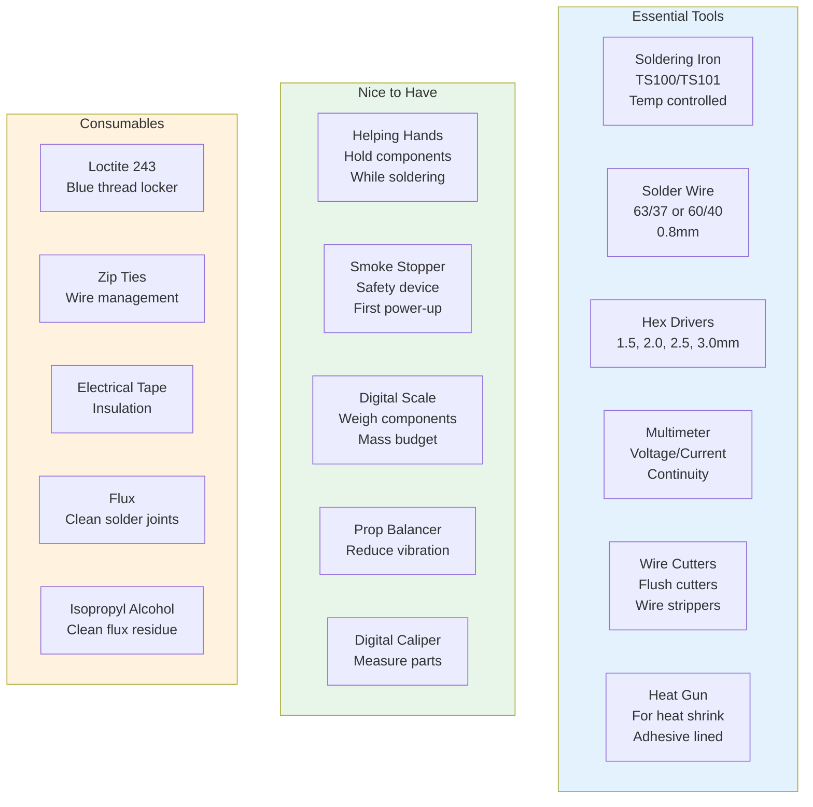

# 17. Tools Needed

## Essential Tools

### Soldering Iron
A good soldering iron is the most critical tool for drone building.

**Recommended Models:**
- TS101 / TS100 — Portable, excellent temperature control
- Hakko FX-888D — Station-style, reliable
- Pinecil — Budget-friendly, USB-C powered
- Miniware MHP30 — Compact, good for field work

**Specifications:**
- Temperature range: 200-450°C
- Tip type: Conical or chisel (have both)
- Wattage: 40-65W recommended
- Fast heat-up time (<30 seconds)

**Temperature Settings:**
| Solder Type | Temperature |
|-------------|-------------|
| 63/37 leaded | 350-375°C |
| 60/40 leaded | 375-400°C |
| Lead-free | 400-420°C |

---

### Solder

**Types:**
| Type | Composition | Melting Point | Recommendation |
|------|-------------|---------------|----------------|
| 63/37 | 63% tin, 37% lead | 183°C | Best for beginners |
| 60/40 | 60% tin, 40% lead | 183-190°C | Good, widely available |
| Lead-free | SAC305 | 217°C | Required for commercial |

**Diameter:**
- 0.5mm — Fine work, small pads
- 0.8mm — General purpose (recommended)
- 1.0mm — Large joints, battery connectors

**Recommended Brands:**
- Kester 63/37
- MG Chemicals
- Loctite Multicore

---

### Flux

**Why Flux is Essential:**
- Removes oxidation from metal surfaces
- Improves solder wetting and flow
- Prevents cold solder joints
- Creates stronger, more reliable connections

**Types:**
| Type | Form | Application |
|------|------|-------------|
| Paste flux | Thick paste | Apply with brush or toothpick |
| Liquid flux | Fluid | Apply with pen or dropper |
| Flux pen | Pen format | Convenient, controlled application |
| Flux core solder | In solder wire | Built into solder |

**Recommended Products:**
- MG Chemicals Liquid Flux (415D)
- Kester Flux Pen
- Amtech paste flux
- No-clean flux preferred for most work

---

### Multimeter

**Essential Functions:**
- DC voltage measurement
- AC voltage measurement
- Current measurement (amps)
- Resistance measurement
- Continuity test (beep)
- Diode test

**Specifications:**
- True RMS for accurate AC readings
- Auto-ranging preferred
- CAT III rating minimum
- Backlit display for field use

**Drone-Specific Uses:**
- Verify battery voltage
- Check for short circuits
- Test ESC signals
- Verify wiring continuity
- Check connector resistance
- Measure current draw

**Recommended Models:**
- Fluke 115 / 117 — Professional quality
- Uni-T UT61E — Budget-friendly, accurate
- Klein MM600 — Good mid-range option

---

### Hex Drivers

**Required Sizes:**
| Size | Application |
|------|-------------|
| 1.5mm | Small M2 screws, camera mounts |
| 2.0mm | M2.5 screws, most frame screws |
| 2.5mm | M3 screws, motor mounts |
| 3.0mm | M3 bolts, prop nuts |
| 4.0mm | Larger frame bolts |

**Quality Matters:**
- Cheap drivers strip screw heads
- Ball-end drivers allow angled access
- Magnetic tips hold screws
- Comfortable grip for extended use

**Recommended Sets:**
- Wiha Precision Hex Set
- Wera Kraftform Micro
- Budget: Yescom or similar (replace when worn)

---

### Wire Cutters and Strippers

**Flush Cutters:**
- For cutting component leads
- Clean, flat cuts
- Essential for tight spaces
- Replace when tips wear

**Wire Strippers:**
- Adjustable gauge settings
- Strip without cutting strands
- Auto-adjusting preferred
- AWG 18-30 range

**Side Cutters:**
- For cutting zip ties
- Cutting wire to length
- General purpose cutting

**Recommended:**
- Hakko CHP-170 flush cutters
- Knipex wire strippers
- Engineer brand strippers

---

### Heat Gun

**Purpose:**
- Shrinking heat shrink tubing
- Activating adhesive-lined heat shrink
- Bending plastic components
- Removing heat shrink without damaging wires

**Specifications:**
- Temperature range: 100-600°C
- Airflow control preferred
- Compact size for field use
- 1500W minimum

**Tips:**
- Keep moving to prevent burning
- Use lowest effective temperature
- Shield nearby components
- Have fire extinguisher nearby

---

### Helping Hands

**Purpose:**
- Hold PCBs during soldering
- Clamp wires in position
- Magnifying glass attachment useful
- Third hand for complex joints

**Types:**
| Type | Features | Best For |
|------|----------|----------|
| Stationary | Heavy base, multiple arms | Bench work |
| Flexible arm | Gooseneck arms | Versatile positions |
| PCB holder | Dedicated PCB clamps | Board-level work |
| Vise style | Clamping mechanism | Larger components |

---

### Smoke Stopper

**What is a Smoke Stopper:**
- Safety device for first power-up
- Limits current to prevent damage
- Detects short circuits before they destroy components

**Construction:**
- 1156 automotive bulb in series with battery
- Or dedicated commercial device
- Connect between battery and drone
- If bulb glows brightly, short circuit exists

**Commercial Options:**
- VIFLY WhoopStor
-ToolkitRC Soldering Helper
- DIY with automotive bulb and XT60 connectors

---

## Optional but Useful Tools

### Prop Balancer
- Magnetic or blade style
- Essential for reducing vibration
- Pays for itself in flight performance
- Budget: $10-20

### Zip Ties
- Multiple sizes (3", 6", 8")
- Black UV-resistant preferred
- Use for wire management
- Always carry spare pack

### Loctite 243 (Blue)
- Medium-strength threadlocker
- Essential for motor screws
- Prevents vibration loosening
- Never use red (permanent) on motors

### Electrical Tape
- Insulation for exposed wires
- Temporary wire management
- Color coding available
- Self-amalgamating tape excellent

### Isopropyl Alcohol
- Clean flux residue after soldering
- 90% or higher concentration
- Use with small brush or cotton swab
- Essential for clean builds

### Scale
- Weigh components for mass budget
- Verify battery capacity
- Ensure under 250g for nano category
- Resolution: 1g minimum

---

## Tool Kit Summary

### Essential Kit (Must Have)
- Soldering iron + tips
- Solder (63/37, 0.8mm)
- Flux (paste or liquid)
- Multimeter
- Hex drivers (1.5, 2.0, 2.5, 3.0mm)
- Flush cutters
- Wire strippers
- Heat shrink + heat gun
- Smoke stopper
- Zip ties
- Loctite 243

### Recommended Extras
- Prop balancer
- Helping hands
- Isopropyl alcohol
- Electrical tape
- Scale
- Spare tips for soldering iron
- Spare hex driver bits

### Field Kit
- Portable soldering iron
- Pre-cut heat shrink
- Zip ties
- Electrical tape
- Multimeter
- Spare props
- Smoke stopper

---

## Sources

- FPV Know It All Tools: https://fpvknowitall.com
- Oscar Liang Tools Guide: https://oscarliang.com/tools/
- RaceDayQuads Store: https://racedayquads.com
- Oscar Liang Soldering Guide: https://oscarliang.com/soldering-guide/
