# 18. Common Beginner Mistakes

```mermaid
graph TB
    subgraph MISTAKES["Top 10 Beginner Mistakes"]
        M1["1. No simulator practice<br/>Crash cost: $100+"]
        M2["2. Wrong battery S count<br/>Fried ESCs/motors"]
        M3["3. Wrong motor direction<br/>Props fly off"]
        M4["4. Cold solder joints<br/>Intermittent failure"]
        M5["5. Loose props<br/>Mid-flight ejection"]
        M6["6. No failsafe test<br/>Flyaway risk"]
        M7["7. No GPS lock<br/>Unstable loiter"]
        M8["8. Ignore vibrations<br/>Camera jello, crash"]
        M9["9. Over-discharge LiPo<br/>Battery damage"]
        M10["10. No Loctite<br/>Motors loosen"]
    end

    subgraph SOLUTIONS2["Solutions"]
        S1["Use Liftoff/Velocidrone"]
        S2["Check motor KV vs battery"]
        S3["Check motor rotation"]
        S4["Use flux, proper temp"]
        S5["Check before every flight"]
        S6["Test failsafe indoors"]
        S7["Wait for 3D fix"]
        S8["Check VIBE in logs"]
        S9["Land at 3.5V/cell"]
        S10["Blue Loctite on screws"]
    end

    M1 -.-> S1
    M2 -.-> S2
    M3 -.-> S3
    M4 -.-> S4
    M5 -.-> S5
    M6 -.-> S6
    M7 -.-> S7
    M8 -.-> S8
    M9 -.-> S9
    M10 -.-> S10

    style M1 fill:#f44336,color:#fff
    style M2 fill:#f44336,color:#fff
    style M3 fill:#ff5722,color:#fff
    style M4 fill:#ff5722,color:#fff
    style M5 fill:#ff9800,color:#fff
    style M6 fill:#ff9800,color:#fff
    style M7 fill:#ffc107,color:#000
    style M8 fill:#ffc107,color:#000
    style M9 fill:#ffc107,color:#000
    style M10 fill:#ffc107,color:#000
    style SOLUTIONS2 fill:#e8f5e9
```

## Overview

Learning from others' mistakes saves time, money, and frustration. This guide covers the most common errors beginners make and how to avoid them.

---

## Mistake 1: Not Practicing in Simulator First

### The Problem
- Jumping straight to real flight without practice
- Crashing expensive components on first flight
- Building bad habits from the start

### The Solution
- Use a simulator for at least 20-30 hours before first real flight
- Start with stabilization mode, progress to acro
- Practice basic maneuvers: hover, turns, figure-8
- Learn failsafe behavior in simulator

### Recommended Simulators
| Simulator | Price | Platform | Notes |
|-----------|-------|----------|-------|
| Liftoff | $20 | PC | Good physics, active community |
| Velocidrone | $20 | PC | Accurate physics, competitive |
| DRL Simulator | Free | PC/Console | Official DRL sim |
| FPV.SkyDive | Free | PC | Good for beginners |
| Uncrashed | $20 | PC | Beautiful environments |

---

## Mistake 2: Wrong Battery Voltage/S Count

### The Problem
- Using 3S battery on 4S-only motors
- Over-volting components (magic smoke)
- Under-volting (poor performance)
- Incompatible ESC ratings

### The Solution
- Match battery cell count to motor KV rating
- Check component voltage ratings before purchase
- Use battery voltage calculator:
  - 3S: 11.1V nominal (12.6V fully charged)
  - 4S: 14.8V nominal (16.8V fully charged)
  - 6S: 22.2V nominal (25.2V fully charged)

### KV Rating Guide
| Motor KV | Recommended Battery |
|----------|-------------------|
| 2300-2600 KV | 4S (14.8V) |
| 1700-2000 KV | 6S (22.2V) |
| 1100-1400 KV | 6S for 5" racing |
| 400-800 KV | 6S for 7"+ long range |

---

## Mistake 3: Not Checking Motor Rotation Direction

### The Problem
- Props installed wrong = instant flip on takeoff
- Motor rotation mismatch causes instability
- Wasted flight time diagnosing

### The Solution
1. Remove props before testing
2. Use motor tab in Betaflight/ArduPilot
3. Verify each motor spins correct direction
4. Mark motors with tape or labels
5. Install props only after verification

### Correct Rotation (X Configuration)
| Position | Rotation | Prop Marking |
|----------|----------|--------------|
| Front-Left | CCW | "L" or counter-clockwise |
| Front-Right | CW | "R" or clockwise |
| Rear-Left | CW | "R" or clockwise |
| Rear-Right | CCW | "L" or counter-clockwise |

---

## Mistake 4: Cold Solder Joints

### The Problem
- Joint looks connected but has high resistance
- Causes intermittent failures, voltage drops
- Difficult to diagnose
- May work on bench but fail in flight

### The Solution
- Always use flux (essential, not optional)
- Proper temperature (350-400°C for leaded)
- Heat both pad and wire simultaneously
- Joint should be shiny and smooth
- Pull test: gently tug wire to verify strength

### Identifying Cold Joints
| Appearance | Problem | Fix |
|-----------|---------|-----|
| Dull, grainy | Insufficient heat | Reheat with flux |
| Ball shape | Excess solder | Remove with wick |
| Cracked | Movement during cooling | Re-solder |
| Burnt/charred | Too much heat | Clean and re-solder |

---

## Mistake 5: Loose Propellers

### The Problem
- Prop comes off during flight
- Instant loss of control
- Potential injury or damage
- Most common cause of crashes

### The Solution
- Tighten props before every flight
- Use prop wrench for consistent torque
- Check for cracks around mounting hole
- Replace damaged props immediately
- Develop pre-flight prop check habit

### Tightening Guide
- Hand-tight plus 1/4 turn with wrench
- Do not over-torque (cracks hub)
- Check thread condition regularly
- Use nyloc nuts when available
- Replace props every 10-20 flights

---

## Mistake 6: Not Testing Failsafe

### The Problem
- Receiver signal lost in flight
- Drone flies away or crashes
- No failsafe configured = unpredictable behavior
- Battery lost in flight = no return

### The Solution
- Configure failsafe BEFORE first flight
- Test failsafe on bench (props removed)
- Test failsafe at low altitude with tether
- Verify RTH or LAND works correctly
- Set appropriate failsafe delays

### Failsafe Configuration
1. Set failsafe channel values
2. Configure failsafe behavior:
   - RTH (Return to Home) — recommended
   - LAND — safe if no GPS
   - HOLD — maintain position
3. Test with transmitter off
4. Verify drone responds correctly
5. Test in field at safe altitude

---

## Mistake 7: Flying Without GPS Lock

### The Problem
- Position hold fails without GPS
- RTH flies to wrong location
- Erratic behavior in autonomous modes
- Compass calibration issues

### The Solution
- Wait for 3D GPS lock before autonomous flight
- Check HDOP < 2.0 (lower is better)
- Verify satellite count (minimum 10)
- Calibrate compass away from metal
- Use manual modes until GPS confirmed

### GPS Lock Indicators
| Indicator | Good | Bad |
|-----------|------|-----|
| Satellite count | >10 | <8 |
| HDOP | <2.0 | >3.0 |
| Fix type | 3D | 2D or None |
| GPS LED | Solid green | Flashing/red |

---

## Mistake 8: Ignoring Vibration Warnings

### The Problem
- High vibration causes sensor noise
- Position hold drifts, unstable flight
- AutoTune fails
- Component fatigue and failure

### The Solution
- Check VIBE values after every flight
- Address vibration before it becomes critical
- Balance props regularly
- Check motor bearings
- Verify FC mount is secure

### Vibration Thresholds
| VIBE Value | Status | Action |
|------------|--------|--------|
| <15 m/s² | Excellent | No action |
| 15-30 m/s² | Good | Monitor |
| 30-60 m/s² | Marginal | Investigate |
| >60 m/s² | Poor | Do not fly |

---

## Mistake 9: Over-Discharging LiPo Batteries

### The Problem
- Permanent battery damage below 3.5V/cell
- Reduced capacity and lifespan
- Risk of swelling or fire
- Expensive to replace

### The Solution
- Land when battery reaches 3.5V/cell under load
- Use voltage telemetry or OSD
- Set low voltage warning in flight controller
- Store batteries at 3.8V/cell (storage mode)
- Never fully discharge

### Voltage Reference
| Voltage/Cell | State | Action |
|-------------|-------|--------|
| 4.2V | Fully charged | Ready to fly |
| 3.8V | Storage | Ideal storage voltage |
| 3.5V | Empty | Land immediately |
| 3.3V | Critical | Emergency landing |
| <3.0V | Damage | Do not fly again |

---

## Mistake 10: Not Using Loctite on Motor Screws

### The Problem
- Motor screws vibrate loose
- Motor shifts or detaches in flight
- Causes vibration and instability
- Potential loss of drone

### The Solution
- Apply Loctite 243 (blue) to all motor screws
- Apply to threads, not head
- Allow 24 hours to cure
- Reapply after any motor removal
- Check tightness before every flight

### Loctite Selection
| Type | Color | Use |
|------|-------|-----|
| Loctite 222 | Purple | Small screws, delicate |
| Loctite 243 | Blue | Motor screws, frame bolts |
| Loctite 271 | Red | Permanent joints only |
| Loctite 248 | Blue | Stick format, convenient |

---

## Mistake 11: GPS Mounted Too Close to ESCs/VTX

### The Problem
- EMI interference degrades GPS accuracy
- Compass calibration fails
- Poor position hold performance
- Erratic autonomous flight

### The Solution
- Mount GPS on mast above frame
- Minimum 5cm separation from ESCs/VTX
- Use GPS ground plane if available
- Route GPS cable away from power wires
- Verify HDOP and satellite count

### GPS Mounting Best Practices
- Elevated mount (mast or standoff)
- Away from power distribution
- Away from video transmitter
- Antenna facing skyward
- Secure mounting (no vibration)

---

## Mistake 12: Not Checking Regulatory Requirements

### The Problem
- Flying illegally
- Fines up to ₹1,00,000
- Drone confiscation
- Legal liability

### The Solution
- Check DGCA regulations before flying
- Register drone on Digital Sky platform
- Obtain required licenses
- Check airspace zone before each flight
- Carry documentation

### India-Specific Requirements
| Category | Registration | License | Insurance |
|----------|-------------|---------|-----------|
| Nano (<250g) | No | No | No |
| Micro (250g-2kg) | Yes | No (non-commercial) | Yes |
| Small (2-25kg) | Yes | Yes | Yes |

---

## Mistake 13: Buying Most Expensive Parts Without Research

### The Problem
- Overpaying for unnecessary features
- Incompatible components
- Poor value for money
- Overcomplicated build for skill level

### The Solution
- Research before buying
- Read reviews from multiple sources
- Start with mid-range components
- Buy compatible component ecosystem
- Upgrade as skills improve

### Smart Shopping Tips
- Buy from reputable vendors
- Check return policies
- Look for bundle deals
- Read community forums
- Don't buy the cheapest either (quality matters)

---

## Mistake 14: Skipping Pre-Flight Checklist

### The Problem
- Forgetting critical checks
- Preventable crashes
- Injuries from oversight
- Inconsistent flight preparation

### The Solution
- Create written checklist
- Follow it every time
- Update as you learn
- Teach others to use it
- Make it a habit

### Essential Pre-Flight Checklist
- [ ] Battery charged and correct voltage
- [ ] Props tight and correct direction
- [ ] GPS lock (3D fix, good HDOP)
- [ ] Radio control responding
- [ ] Failsafe configured and tested
- [ ] Frame and screws tight
- [ ] No loose wires
- [ ] Area clear of people
- [ ] Weather acceptable
- [ ] Documentation available

---

## Mistake 15: Flying Over People or Near Airports

### The Problem
- Illegal and dangerous
- Risk of injury to people
- Potential aircraft collision
- Severe legal consequences

### The Solution
- Never fly over people
- Stay away from airports (5km minimum)
- Fly in open, unpopulated areas
- Maintain VLOS at all times
- Respect others' privacy

### Safe Flying Locations
- Open fields away from buildings
- Designated RC flying fields
- Rural areas with no air traffic
- Away from wildlife
- Private property with permission

---

## Mistake Summary Table

| # | Mistake | Consequence | Prevention |
|---|---------|-------------|------------|
| 1 | No simulator practice | Crash, injury | 20+ hours sim time |
| 2 | Wrong battery voltage | Component damage | Match KV to battery |
| 3 | Wrong motor direction | Flip on takeoff | Test without props |
| 4 | Cold solder joints | Intermittent failure | Use flux, proper temp |
| 5 | Loose props | Crash, injury | Check every flight |
| 6 | No failsafe test | Fly away, crash | Test before first flight |
| 7 | No GPS lock | Erratic behavior | Wait for 3D fix |
| 8 | Ignoring vibrations | Poor performance | Check VIBE values |
| 9 | Over-discharging | Battery damage | Land at 3.5V/cell |
| 10 | No Loctite | Motor loose | Use Loctite 243 |
| 11 | GPS interference | Poor accuracy | Mount high, away from EMI |
| 12 | No regulations | Fines, confiscation | Check DGCA rules |
| 13 | No research | Waste money | Read reviews first |
| 14 | No checklist | Preventable crashes | Use checklist always |
| 15 | Flying over people | Injury, legal | Fly in safe areas |

---

## Sources

- Oscar Liang Common Mistakes: https://oscarliang.com/fpv-drone-guide/
- RC Hobby Lab Beginner Guide: https://rchobbylab.com
- Unmanned Tech Blog: https://blog.unmanned.tech
- Mepsking FPV Guide: https://mepsking.shop
