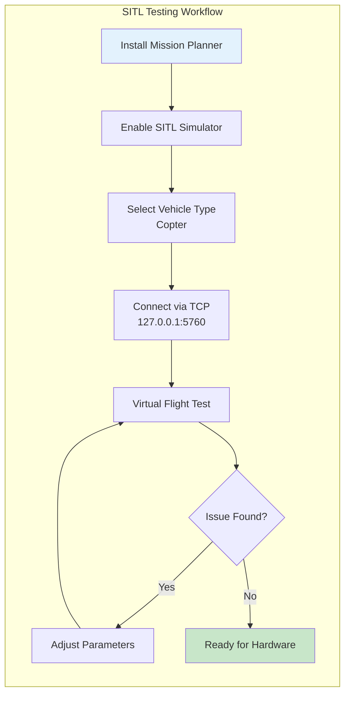

# 19. SITL Virtual Testing

## What is SITL?

SITL (Software In The Loop) simulates your entire drone in software — no hardware needed. The flight controller code runs on your PC, with virtual sensors generating realistic data. You can test flights, tune parameters, and practice emergency procedures without risking a single component.

For fixed-wing builders transitioning to multirotors, SITL is invaluable: you can learn ArduCopter's behavior, test failsafes, and validate your motor configuration before soldering a single wire.

## How to Install

1. Download **Mission Planner** from ardupilot.org
2. Install and launch Mission Planner
3. Go to **Simulation** tab → enable SITL simulator
4. Select vehicle type (Copter, Plane, Rover)
5. Click **Launch SITL** — a virtual vehicle starts immediately

No physical FC, no GPS module, no batteries required.

## Connecting to SITL

Once SITL is running, Mission Planner connects automatically via TCP:

| Connection | Address | Use Case |
|------------|---------|----------|
| TCP | `127.0.0.1:5760` | Default, same PC |
| TCP | `0.0.0.0:5760` | Multiple GCS instances |
| UDP | `127.0.0.1:14550` | Lower latency |

The virtual FC responds to all MAVLink commands exactly like hardware — arm, disarm, takeoff, RTL, auto mission.

## Vehicle Types

| Type | Description | Best For |
|------|-------------|----------|
| Copter | Multirotor simulation | Hover, VTOL, delivery |
| Plane | Fixed-wing simulation | Survey, long range |
| Rover | Ground vehicle | Autonomous driving |

For this project, focus on **Copter** — it matches your hexacopter build.

## Testing Scenarios

### Basic Hover Stability
Launch SITL, arm, takeoff to 10m altitude. Release sticks and observe stability. The virtual PID controller should hold position without drift. If oscillations appear, tune `ATC_RATE_P` and `ATC_RATE_D`.

### Waypoint Missions
Plan a mission in Mission Planner's flight plan editor. Set waypoints with altitude, speed, and heading. Run the mission and observe path tracking. Check if the copter overshoots turns or cuts corners.

### Return-to-Home (RTL)
Fly to 200m distance, trigger RTL. Verify the copter climbs to the configured RTL altitude, flies home, and lands. Test RTL at different distances and altitudes.

### Geofence Behavior
Set a geofence in Mission Planner (cylinder or polygon). Fly outside the boundary. The copter should automatically RTL or land. Test both horizontal and altitude fences.

### Single Motor Failure (SMF) Simulation
In SITL, disable one motor output via `SIM Motor Fail` parameter. Observe how the FC compensates:
- Opposite motor throttles down 40% for yaw balance
- Remaining motors increase to maintain altitude
- Check if the copter can still land safely

### Battery Failsafe Behavior
Set `BATT_LOW_VOLT` to a high value (e.g., 99V). Take off and wait for the failsafe to trigger. Verify the copter performs its configured action (RTL, land, or smart return).

## Parameter Testing

SITL lets you change any parameter and see results instantly:

| Parameter | What It Controls | Test |
|-----------|-----------------|------|
| `ATC_RATE_P` | Roll/Pitch rate P gain | Increase → faster response, more oscillation |
| `ATC_RATE_D` | Roll/Pitch rate D gain | Increase → less overshoot, more noise |
| `ATC_THR_MIN` | Minimum throttle | Set higher → better hover authority |
| `WP_RADIUS` | Waypoint acceptance radius | Set smaller → tighter path tracking |
| `RTL_ALT` | Return-to-home altitude | Test at different heights |

Change one parameter at a time. Log each flight. Compare behavior.

## Log Analysis

SITL generates `.bin` log files identical to hardware logs. Download them from Mission Planner:

1. **Flight Data** tab → **Log Download**
2. Select the latest log
3. Open in Mission Planner's **Log Analyzer**
4. Plot key messages: `ATT` (attitude), `CTUN` (throttle), `GPS` (position)

Key plots to review:
- `ATT.Roll` vs `ATT.DesRoll` — tracking accuracy
- `CTUN.ThrOut` — throttle usage
- `GPS.Alt` vs `BARO.Alt` — altitude consistency

## Benefits

- **Zero crash risk**: Test extreme scenarios without destroying hardware
- **Parameter exploration**: Change 50 PIDs in one session, no physical risk
- **Failsafe validation**: Practice emergency procedures repeatedly
- **Mission planning**: Test complex waypoints before field deployment
- **Learning curve**: Master ArduCopter interface before real flight

## Limitations

- **No vibration simulation**: Real motors vibrate; SITL assumes perfect sensors
- **No wind**: Basic wind model exists but is unrealistic
- **No sensor noise**: Gyro/accel noise is absent — tuning may not transfer perfectly
- **No prop wash**: Ground effect and prop wash interactions are missing
- **Perfect GPS**: No multipath, no HDOP variation

SITL is a starting point, not a replacement for field testing.

## Recommended Testing Workflow

```
1. Build SITL hexacopter model
2. Test basic hover (10 flights)
3. Test waypoint missions (5 missions)
4. Test RTL from various distances (10 flights)
5. Test motor failure (5 failures)
6. Test battery failsafe (5 flights)
7. Export all parameter sets
8. Transfer best parameters to hardware FC
```

## Source

- ardupilot.org/copter/docs/sitl-simulator-software-in-the-loop.html
- ardupilot.org/copter/docs/parameters.html
- Mission Planner documentation

---



```
┌──────────────┐    TCP/USB    ┌──────────────┐
│ Mission      │◄────────────►│ SITL Sim     │
│ Planner      │              │ (Virtual FC) │
│ (GCS)        │              │              │
└──────────────┘              └──────┬───────┘
                                     │
                              ┌──────▼───────┐
                              │ Simulated    │
                              │ Sensors:     │
                              │ - Gyro/Accel │
                              │ - GPS        │
                              │ - Barometer  │
                               │ - Magnetometer│
                               └──────────────┘
```

---

## EFT E616P Build Connection

> **Test our hexacopter configuration in SITL before hardware deployment.**

### SITL Testing Sequence for Our Build
| Test | What to Verify | Expected Result |
|---|---|---|
| Basic hover | Hexa-X stability | Stable hover at 10m |
| Waypoint mission | Path tracking | Within 3m of waypoints |
| RTL from 200m | Return-to-home | Climb to RTL_ALT, return, land |
| Single motor failure | SMF handler | Opposite motor throttled, auto land |
| Battery failsafe | Low voltage action | Stop spray, land |
| Geofence breach | Fence behavior | RTL with 50m margin |
| Spray pump control | PWM output | Pump responds to commands |

### Our SITL Configuration
```
# Frame setup
FRAME_CLASS = 6        (Hexa)
FRAME_TYPE = 1         (X)
SIM_FRAME = 60         (Hexacopter)

# Motor failure test
SIM_MOTOR_FAIL = 1     (Enable motor failure simulation)
SIM_MOTOR_FAIL_MASK = 0x04  (Fail motor 3)

# Battery simulation
BATT_CAPACITY = 90000  (3×30Ah in mAh)
BATT_FS_VOLTAGE = 44.0
```

---

## Common Mistakes & Pitflies

| Mistake | Consequence | Prevention |
|---|---|---|
| Skipping SITL before hardware | Crash on first flight | Test all scenarios in SITL first |
| Not testing SMF | Unprepared for motor failure | Simulate motor failure in SITL |
| Ignoring geofence | Drone leaves safe area | Configure and test fence in SITL |
| Wrong frame class | Incorrect motor mixing | Set FRAME_CLASS=6, FRAME_TYPE=1 |

---

*Enrichment added: May 29, 2026 | Template v1.0*
