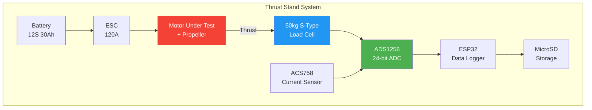

# 20. Thrust Stand Design

## Purpose

A thrust stand measures motor performance at different throttle levels — thrust, current, efficiency, and RPM. This data lets you select the optimal motor-propeller combination for your build, verify manufacturer claims, and create custom thrust curves.

For a hexacopter build, a thrust stand is essential: you need to confirm all 6 motors produce matched thrust, and that your 12S battery can deliver the current each motor demands.

## Components

| Component | Specification | Purpose | Cost (₹) |
|-----------|--------------|---------|-----------|
| Load Cell | 50kg S-type (YZC-516) | Measures thrust force | 800 |
| ADC | ADS1256 24-bit, 30kHz | Reads load cell signal | 600 |
| MCU | ESP32-WROOM-32 | Data logging, control | 300 |
| Current Sensor | ACS758-200B | Measures motor current | 250 |
| MicroSD Module | SPI interface | Stores test data | 50 |
| I-Beam | Steel, 30cm length | Rigid test rig base | 400 |
| Motor Mount | Aluminum plate | Attaches motor to load cell | 200 |
| Connectors | XT90-S + 10AWG wire | Battery-to-ESC connection | 200 |
| ESC | 120A, compatible with test motor | Drives motor under test | 1,500 |
| Battery | 12S 30Ah (or bench supply) | Powers ESC and motor | — |
| Load Cell Amplifier | HX711 (budget) or ADS1256 | Amplifies load cell signal | 100–600 |
| Enclosure | Project box | Houses electronics | 200 |

**Total cost: ~₹6,000–7,250** (excluding battery and ESC, which you likely own)

## Build Process

### Step 1: Mount the Load Cell

Bolt the S-type load cell to the I-beam base. The load cell should be oriented so thrust pushes vertically on the sensing axis. Use M6 bolts with lock nuts.

```
Top Plate (Motor Mount)
        │
   ┌────▼────┐
   │ Load    │
   │ Cell    │
   └────┬────┘
        │
   I-Beam Base
```

### Step 2: Attach Motor Mount

Bolt an aluminum plate to the top of the load cell. Mount the motor on this plate using its standard bolt pattern. The propeller should spin freely without contacting the load cell or I-beam.

### Step 3: Wire ESC to Motor and Battery

Connect ESC signal wire to ESP32 GPIO (pin 13). Connect ESC power wires to battery via XT90-S connector. Route the current sensor in series with the battery positive lead.

### Step 4: Connect ADC to Load Cell and Current Sensor

Wire the ADS1256 to the ESP32 via SPI:
- CLK → GPIO 18
- DOUT → GPIO 19
- DIN → GPIO 23
- CS → GPIO 5
- DRDY → GPIO 4

Connect load cell signal wires to ADS1256 differential inputs (AIN0/AIN1). Connect current sensor analog output to AIN2.

### Step 5: Program ESP32

The ESP32 firmware should:
1. Initialize ADS1256 at 200Hz sampling rate
2. Calibrate load cell (zero offset, known weight)
3. Read current sensor values
4. Log timestamped data to MicroSD card
5. Accept serial commands to start/stop logging

### Step 6: Run Throttle Sweep

Execute a systematic throttle sweep:
1. Arm motor at 0% throttle
2. Increase throttle in 5% steps (0%, 5%, 10%, ... 100%)
3. Hold each step for 3 seconds (allow stable reading)
4. Record average thrust, current, voltage at each step
5. Log RPM if using optical tachometer or ESC telemetry
6. Return to 0% and disarm

## Data to Collect

| Parameter | Units | Why |
|-----------|-------|-----|
| Thrust | gf (grams-force) | Motor lifting capability |
| Current | A | Battery load per motor |
| Voltage | V | Battery sag under load |
| Efficiency | g/W | Thrust per watt — key metric |
| RPM | rev/min | Propeller speed |
| Temperature | °C | Motor heat buildup |

## Creating Thrust Curves

Plot these curves for each motor-propeller combination:

1. **Thrust vs Throttle**: Shows thrust linearity and maximum output
2. **Current vs Throttle**: Shows current draw at each throttle level
3. **Efficiency vs Throttle**: Peaks around 50% — hover should be near peak
4. **Thrust vs Power**: Direct comparison between motors at same power

The hover point should fall near the efficiency peak. If your copter hovers at 40% throttle but efficiency peaks at 60%, consider a larger propeller.

## Comparing to Manufacturer Datasheet

Manufacturer thrust data is often optimistic. Your stand reveals reality:

| Metric | Datasheet | Your Test | Difference |
|--------|-----------|-----------|------------|
| Max Thrust | 15,000gf | 13,200gf | -12% |
| Max Current | 60A | 68A | +13% |
| Efficiency at Hover | 5.2 g/W | 4.8 g/W | -8% |

Common discrepancies:
- Manufacturer uses shorter props or higher voltage
- Temperature derating not accounted for
- Propeller quality varies between batches

## Hexacopter Motor Matching

For your hexacopter, test all 6 motors with identical propellers. Record thrust at 50% throttle (approximate hover). Motors should match within ±3%. If one motor produces significantly less thrust, it may have a manufacturing defect.

| Motor | Thrust at 50% | Current at 50% | Status |
|-------|---------------|----------------|--------|
| M1 | 4,200gf | 8.2A | ✓ |
| M2 | 4,150gf | 8.1A | ✓ |
| M3 | 4,180gf | 8.3A | ✓ |
| M4 | 3,800gf | 8.0A | ⚠ Replace |
| M5 | 4,220gf | 8.2A | ✓ |
| M6 | 4,190gf | 8.1A | ✓ |

## Source

- COEP report Appendix D
- hobbywing.com load tables
- ardupilot.org/copter/docs/motor-thrust-scaling

---



```
Throttle Sweep Data Layout (CSV):

Time(s), Throttle(%), Thrust(gf), Current(A), Voltage(V), Efficiency(g/W), RPM
0.0,     0,           0,          0.5,        50.4,       0.0,             0
3.0,     5,           280,        1.2,        50.3,      4.63,            1200
6.0,     10,          620,        2.1,        50.1,      5.88,            2100
9.0,     15,          1050,       3.4,        49.9,      6.16,            2850
...
45.0,    100,         13200,      68.0,       47.2,      4.14,            8400
```

---

## EFT E616P Build Connection

> **Verify X9 G2L motor performance matches datasheet before assembly.**

### Thrust Stand Test Protocol for X9 G2L
| Test Point | Throttle | Expected Thrust | Expected Current | Expected Power |
|---|---|---|---|---|
| Idle | 0% | 0 g | 0.5A | 25W |
| Low | 15% | ~3,000 g | ~5A | ~250W |
| Hover | 33% | 4,353 g | 7.8A | 376W |
| Mid | 51% | 9,284 g | 22.5A | 1,080W |
| High | 72% | 15,867 g | 49.5A | 2,377W |
| Max | 100% | 23,997 g | 95.9A | 4,607W |

### Acceptance Criteria
| Parameter | Minimum | Maximum | Source |
|---|---|---|---|
| Max thrust | ≥80% of datasheet (19.2 kg) | ≤110% of datasheet | hobbywing.com |
| Hover current | Within ±10% of datasheet | — | hobbywing.com |
| Efficiency at hover | ≥7.0 g/W | — | hobbywing.com |
| All 6 motors matched | ±5% thrust at same throttle | — | Matched set |

---

## Common Mistakes & Pitflies

| Mistake | Consequence | Prevention |
|---|---|---|
| Not testing before assembly | Undetected defective motor | Test ALL 6 motors on thrust stand |
| Not matching motors | Uneven thrust, vibration | Test all motors at same throttle, select matched set |
| Wrong prop on stand | Incorrect thrust reading | Use exact prop that will be flown |
| No current sensor | Can't verify power draw | Include ACS758 or shunt resistor |
| Not logging data | Can't analyze results | Log timestamped CSV data |

---

*Enrichment added: May 29, 2026 | Template v1.0*
