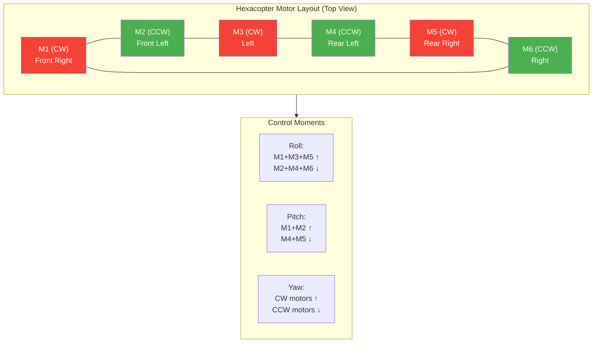

# 22. Hexacopter Motor Mixing

## Motor Numbering Convention (ArduCopter)

ArduCopter uses a specific motor numbering scheme for hexacopters. Understanding this is critical for correct wiring and failure recovery.

```
         Front
          ▲
          │
    M2(CCW)  M1(CW)
         \  /
          \/
          /\
         /  \
   M3(CW)    M6(CCW)
         \  /
          \/
          /\
         /  \
    M4(CCW)  M5(CW)
          │
          │
         Rear
```

| Motor | Position | Rotation | ESC Channel |
|-------|----------|----------|-------------|
| M1 | Front Right | CW | CH1 |
| M2 | Front Left | CCW | CH2 |
| M3 | Left | CW | CH3 |
| M4 | Rear Left | CCW | CH4 |
| M5 | Rear Right | CW | CH5 |
| M6 | Right | CCW | CH6 |

**Rotation rule**: Adjacent motors always spin in opposite directions. This cancels reactive torque.

## How Differential Thrust Creates Moments

The flight controller creates roll, pitch, and yaw by varying individual motor speeds. No moving parts — only thrust differential.

### Roll (Rotation Around Front-Back Axis)

To roll right:
- **Increase**: M1, M3, M5 (right-side motors)
- **Decrease**: M2, M4, M6 (left-side motors)

To roll left:
- **Increase**: M2, M4, M6 (left-side motors)
- **Decrease**: M1, M3, M5 (right-side motors)

### Pitch (Rotation Around Left-Right Axis)

To pitch forward:
- **Increase**: M1, M2 (front motors)
- **Decrease**: M4, M5 (rear motors)

To pitch backward:
- **Increase**: M4, M5 (rear motors)
- **Decrease**: M1, M2 (front motors)

### Yaw (Rotation Around Vertical Axis)

Yaw uses reactive torque from propeller drag. CW and CCW propellers create opposing torques.

To yaw clockwise (turn right):
- **Increase**: M1, M3, M5 (CW motors)
- **Decrease**: M2, M4, M6 (CCW motors)

To yaw counter-clockwise (turn left):
- **Increase**: M2, M4, M6 (CCW motors)
- **Decrease**: M1, M3, M5 (CW motors)

## Mixer Types

ArduCopter supports several hexacopter mixer configurations:

| Mixer | Layout | Use Case |
|-------|--------|----------|
| X6 | Arms at 60° angles, motors at ends | Standard hexacopter |
| +6 | Arms at 0°, 60°, 120°, etc. | Alternative geometry |
| Y6 | Coaxial (3 arms, 2 motors each) | Compact, redundant |

**X6** is most common. Motors are arranged with 60° between each arm, providing balanced thrust in all directions.

## ArduCopter Parameters

### Throttle Range

| Parameter | Default | Description |
|-----------|---------|-------------|
| `MOT_PWM_MIN` | 1000 | Minimum PWM signal to motors |
| `MOT_PWM_MAX` | 2000 | Maximum PWM signal to motors |
| `MOT_SPIN_MIN` | 0.15 | Minimum throttle when armed (15%) |
| `MOT_SPIN_MAX` | 1.0 | Maximum throttle output (100%) |

### Thrust Estimation

| Parameter | Default | Description |
|-----------|---------|-------------|
| `MOT_THST_HOVER` | 0.5 | Estimated hover throttle (50%) |
| `MOT_THST_EXPO` | 0.65 | Thrust curve exponent |
| `MOT_BAT_VOLT_MAX` | 12.6 | Max cell voltage for thrust calc |

### Hover Throttle Estimation

The FC continuously estimates hover throttle. If your hexacopter hovers at 40% throttle, set `MOT_THST_HOVER = 0.4`. This helps the FC distribute thrust correctly.

## Single Motor Failure (SMF) Behavior

When a motor fails, ArduCopter activates the **Motor Failure** handler:

### What Happens

1. **Motor opposite to failed one throttled down 40%**
   - Prevents uncontrolled yaw
   - Maintains torque balance

2. **Remaining 4 motors compensate**
   - Increase thrust to maintain altitude
   - Adjust differential for attitude control

3. **FC recalculates thrust budget**
   - Maximum thrust reduced by ~25%
   - TWR drops from 3.0 to ~2.4 (safe)
   - Landing is possible but hover margin is reduced

### Thrust Budget Calculation

```
Normal operation:
  6 motors × 15kg max = 90kg total thrust
  Copter weight: 30kg
  TWR: 90/30 = 3.0

Single Motor Failure:
  Motor 3: FAILED (0kg)
  Motor 6 (opposite): throttled to 60% (9kg)
  Motors 1,2,4,5: at 100% (15kg each)
  Total: 0 + 9 + 60 = 69kg
  TWR: 69/30 = 2.3 ← SAFE (needs >1.5)
```

### Recovery Behavior

When SMF is detected:
- FC enters **land** mode automatically
- Descent rate limited to 1 m/s
- Position hold maintained if GPS available
- Pilot can override to manual land

## Testing Motor Failure in SITL

Test SMF behavior before hardware deployment:

1. Launch SITL hexacopter
2. Take off and hover at 10m
3. Open **Sim Physics** → **Motor Fail**
4. Select motor to disable (e.g., Motor 3)
5. Observe:
   - Yaw moment is corrected
   - Altitude is maintained
   - FC initiates landing
6. Verify descent is controlled
7. Re-enable motor and verify recovery

## Motor Wiring Verification

Before first flight, verify motor positions match ArduCopter's numbering:

1. In Mission Planner, go to **Setup → Mandatory Hardware → Motor Test**
2. Click each motor button (1-6)
3. Verify the correct motor spins
4. Verify rotation direction matches the diagram
5. If a motor spins wrong direction, swap any two ESC signal wires

## Mixed Rotation Advantage

Hexacopters with alternating CW/CCW rotations have an inherent advantage over same-direction configurations:

| Configuration | Yaw Authority | Yaw Rate |
|---------------|---------------|----------|
| All CW | None (no reactive torque) | 0 °/s |
| Alternating CW/CCW | Full | 200+ °/s |

Alternating rotations also cancel vibrations — each pair produces vibrations at slightly different frequencies, reducing resonance.

## Source

- ArduCopter motor mixing documentation
- ardupilot.org/copter/docs/parameters.html
- ArduPilot source: AP_MotorsHexa.cpp

---



```
Single Motor Failure (Motor 3 fails):

Normal:                    After Failure:
M1(CW)  M2(CCW)          M1(CW)  M2(CCW)
   \      /                 \      /
    \    /                   \    /
M6(CCW)--M3(CW)          M6(CCW)--M3(X)
    /    \                   /    \
   /      \                 /      \
M5(CW)  M4(CCW)          M5(CW)  M4(CCW)

Motor 3: FAILED (0%)
Motor 6 (opposite): THROTTLED DOWN 40% (yaw balance)
Motors 1,2,4,5: INCREASED to compensate (max 100%)
Total available: 0 + 8kg + 80kg = 88kg
At 36kg: SMF TWR = 88/36 = 2.44 ✓ Safe
At 45kg: SMF TWR = 88/45 = 1.96 ⚠ Marginal
```

```
Thrust Distribution During Motor Failure:

Normal Hover (50% all motors):
M1: ████████████████████ 50%
M2: ████████████████████ 50%
M3: ████████████████████ 50%
M4: ████████████████████ 50%
M5: ████████████████████ 50%
M6: ████████████████████ 50%

Motor 3 Failed + Recovery:
M1: ██████████████████████████ 75%
M2: ██████████████████████████ 75%
M3:                          0%  ← FAILED
M4: ██████████████████████████ 75%
M5: ██████████████████████████ 75%
M6: ████████████████ 40%  ← throttled for yaw balance
```

---

## EFT E616P Build Connection

> **Our hexacopter uses X9 G2L motors with integrated ESCs. Motor mixing is handled by ArduCopter on the Pixhawk 6C.**

### Our Motor Configuration
| Motor | Position | Rotation | ESC | Max Thrust |
|---|---|---|---|---|
| M1 | Front Right | CW | Integrated | 24 kg |
| M2 | Front Left | CCW | Integrated | 24 kg |
| M3 | Left | CW | Integrated | 24 kg |
| M4 | Rear Left | CCW | Integrated | 24 kg |
| M5 | Rear Right | CW | Integrated | 24 kg |
| M6 | Right | CCW | Integrated | 24 kg |

### ArduPilot Parameters
| Parameter | Value |
|---|---|
| FRAME_CLASS | 6 (Hexa) |
| FRAME_TYPE | 1 (X) |
| MIXING_GAIN | 0.5 |
| MOT_PWM_MIN | 1000 |
| MOT_PWM_MAX | 2000 |
| MOT_THST_HOVER | 0.45 |

---

## Common Mistakes & Pitfalls

| Mistake | Consequence | Prevention |
|---|---|---|
| Wrong motor order in config | Drone flips on takeoff | Verify motor order matches ArduCopter hexa-X layout |
| Adjacent motors same direction | Uncontrolled yaw, no torque cancellation | Adjacent motors must spin opposite directions |
| Not testing motor direction | Crash on first flight | Use Motor Test in Mission Planner before props |
| Ignoring SMF behavior | Uncontrolled spin after motor loss | Test SMF in SITL before field deployment |
| Wrong FRAME_CLASS/TYPE | Incorrect motor mixing | Set FRAME_CLASS=6, FRAME_TYPE=1 for hexa-X |

---

## Quick Troubleshooting

| Problem | Likely Mixing Issue | Fix |
|---|---|---|
| Drone flips on takeoff | Motor direction wrong | Swap two motor wires or reverse ESC direction |
| Yaw spin | Motor order wrong | Verify motor positions match ArduCopter layout |
| Vibration on one axis | Motor imbalance | Check motor bearings, balance props |
| Oscillation | PID too high for mixing | Reduce ATC_RAT gains by 20% |
| Won't hover level | Compass/calibration issue | Recalibrate compass, check GPS |

---

## Datasheet & Product Links

| Resource | URL |
|---|---|
| ArduCopter motor mixing | https://ardupilot.org/copter/docs/connecting-escs-motors.html |
| Motor test procedure | https://ardupilot.org/copter/docs/motor-test.html |
| SMF in SITL | https://ardupilot.org/copter/docs/simulation.html |

---

*Enrichment added: May 29, 2026 | Template v1.0*
