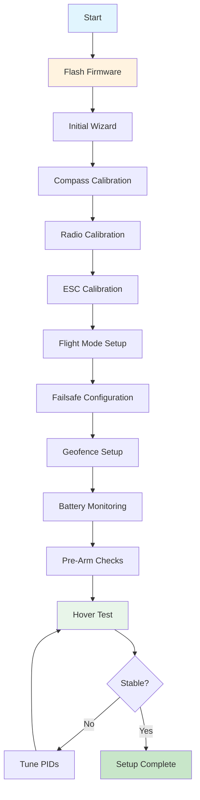

# 26 - ArduPilot Setup Guide (ArduCopter 4.4 on Pixhawk 6C)

## Overview

This guide walks through complete ArduCopter setup on a Pixhawk 6C for our 12S hexacopter agricultural drone.

---

## Prerequisites

| Item | Requirement |
|------|-------------|
| FC | Pixhawk 6C (or compatible) |
| Firmware | ArduCopter 4.4.x |
| Ground Station | Mission Planner (Windows) or QGroundControl (cross-platform) |
| USB Cable | Micro-USB or USB-C (depending on Pixhawk version) |
| Computer | Windows 10+ (Mission Planner) or any OS (QGC) |
| Internet | For firmware download |

---

## Setup Flow



---

## Step 1: Flash Firmware

### Download ArduCopter 4.4

```
    1. Download Mission Planner from:
       https://ardupilot.org/planner/
    
    2. Connect Pixhawk 6C via USB
    
    3. Open Mission Planner
    
    4. Go to: Initial Setup → Install Firmware
    
    5. Select:
       - Board: Pixhawk 6C (or "Pixhawk6C")
       - Firmware: ArduCopter 4.4.x
       
    6. Click "Install Firmware"
    
    7. Wait for completion (2-3 minutes)
    
    8. Board will reboot automatically
```

### Verify Firmware

```
    After flashing, check:
    □ MAVLink connection established
    □ Firmware version shows 4.4.x
    □ Board type shows Pixhawk 6C
    □ No error messages in console
```

---

## Step 2: Initial Wizard

```
    1. Connect to Mission Planner
    
    2. Go to: Initial Setup → Mandatory Hardware → Accel Calibration
    
    3. Follow the wizard prompts:
       - Place level → Click "Calibrate Level"
       - Place nose up → Click "Next"
       - Place nose down → Click "Next"
       - Place left side down → Click "Next"
       - Place right side down → Click "Next"
       - Place upside down → Click "Next"
       - Place on back → Click "Next"
       
    4. Wizard will also prompt for:
       - Frame type selection
       - Motor configuration
       - RC type
       
    5. Select:
       - Frame Class: Hexa
       - Frame Type: X (or Plus based on your build)
```

---

## Step 3: Compass Calibration

### Why Compass Calibration Matters

```
    ┌─────────────────────────────────────────────────────┐
    │  COMPASS CALIBRATION IMPORTANCE                      │
    ├─────────────────────────────────────────────────────┤
    │                                                      │
    │  The compass (magnetometer) provides heading         │
    │  information essential for:                          │
    │                                                      │
    │  - GPS-guided flight (Loiter, RTL, Auto)            │
    │  - Heading hold (Yaw stabilization)                 │
    │  - Mission navigation                                │
    │  - Return-to-launch                                 │
    │                                                      │
    │  WITHOUT calibration:                                │
    │  - Heading will be wrong                             │
    │  - Drone may fly in wrong direction                  │
    │  - RTL may fail                                     │
    │  - GPS missions will be incorrect                   │
    │                                                      │
    └─────────────────────────────────────────────────────┘
```

### Calibration Procedure

```
    1. Go to: Initial Setup → Mandatory Hardware → Compass
    
    2. Verify compass is detected:
       - Compass 1: Internal (if using Pixhawk 6C internal)
       - Compass 2: External (QMC5883L on GPS module)
       
    3. Set compass orientation:
       - If GPS mounted with arrow forward: ROTATION_NONE
       - If GPS mounted differently: select appropriate rotation
       
    4. Click "New Compass Calibration"
    
    5. Rotate the vehicle in all orientations:
       ┌────────────────────────────────────────┐
       │  ROTATION PATTERN:                      │
       │                                          │
       │  1. Hold level, rotate 360° yaw         │
       │  2. Tilt nose down 45°, rotate 360°    │
       │  3. Tilt nose up 45°, rotate 360°      │
       │  4. Tilt left 45°, rotate 360°         │
       │  5. Tilt right 45°, rotate 360°        │
       │  6. Hold upside down, rotate 360°      │
       │  7. Repeat until "Magfield" shows green │
       └────────────────────────────────────────┘
       
    6. Wait for "Calibration Complete" message
    
    7. Verify offsets are reasonable:
       - Offset X: ±100 to ±300
       - Offset Y: ±100 to ±300
       - Offset Z: ±100 to ±300
       - Diagonal should be close to 1.0
    
    8. Click "Save"
```

### Verify Compass

```
    After calibration:
    
    1. Go to Flight Data → HUD
    
    2. Rotate vehicle nose left/right
    
    3. Verify heading changes correctly:
       - Nose left → heading decreases (west)
       - Nose right → heading increases (east)
       
    4. Check "Compass Health" in status messages
    
    5. Verify "Magfield" strength is reasonable:
       - Good: 150-350 (varies by location)
       - Bad: <100 or >500
```

---

## Step 4: Radio Calibration

### Connect RC Receiver

```
    Pixhawk 6C RC Input:
    
    ┌─────────────────────────────────────────┐
    │  Pixhawk 6C                              │
    │                                          │
    │  RC IN:                                  │
    │  ┌──────────────────────────────────┐   │
    │  │  1  2  3  4  5  6  7  8  GND 5V │   │
    │  └──┴──┴──┴──┴──┴──┴──┴──┴───┴────┘   │
    │   CH1 CH2 CH3 CH4 CH5 CH6 CH7 CH8      │
    │    │   │   │   │                       │
    │    │   │   │   └── Yaw (rudder)        │
    │    │   │   └────── Pitch (elevator)    │
    │    │   └────────── Roll (aileron)      │
    │    └────────────── Throttle            │
    │                                          │
    │  For ELRS/CRSF: Use RCIN port (UART)   │
    │  For PPM: Use RCIN port                │
    │  For SBUS: Use RCIN port (inverted)    │
    └─────────────────────────────────────────┘
```

### Calibration Steps

```
    1. Go to: Initial Setup → Mandatory Hardware → Radio Calibration
    
    2. Turn on RC transmitter
    
    3. Click "Calibrate Radio"
    
    4. Move all sticks through full range:
       ┌────────────────────────────────────────┐
       │  STICK MOVEMENT:                        │
       │                                          │
       │  Throttle: Down → Up                    │
       │  Yaw: Left → Right                      │
       │  Pitch: Down → Up                       │
       │  Roll: Left → Right                     │
       │                                          │
       │  Also move all switches through range    │
       └────────────────────────────────────────┘
       
    5. Watch bars move on screen
    
    6. When all bars show green, click "Click when Done"
    
    7. Verify channel mapping:
       - Channel 1: Roll
       - Channel 2: Pitch
       - Channel 3: Throttle
       - Channel 4: Yaw
       - Channel 5-8: Flight modes, etc.
       
    8. Click "Save"
```

### RC failsafe Settings

```
    In Radio Calibration:
    
    □ Set RC failsafe to "Enabled"
    □ Throttle failsafe: PWM < 950 (typically)
    □ Action: "Land" or "RTL" (recommended)
    
    Test RC failsafe:
    1. Arm and hover (tethered)
    2. Turn off transmitter
    3. Verify drone enters failsafe mode
    4. Turn transmitter back on
    5. Verify control returns
```

---

## Step 5: ESC Calibration

### Why ESC Calibration Matters

```
    ESC calibration ensures:
    - All motors respond identically to throttle commands
    - Minimum and maximum PWM values are matched
    - Motor spin-up is synchronized
    - Throttle response is linear
    
    WITHOUT calibration:
    - Motors may spin at different speeds for same command
    - Some motors may not start at low throttle
    - Flight instability possible
```

### Calibration Procedure

```
    ⚠️ REMOVE PROPELLERS BEFORE CALIBRATING ⚠️
    
    1. Go to: Initial Setup → Mandatory Hardware → Motor Test
    
    2. Set throttle to maximum (full up)
    
    3. Power on the ESCs (connect battery)
    
    4. Wait for ESC initialization tones:
       ┌────────────────────────────────────────┐
       │  ESC CALIBRATION SEQUENCE:              │
       │                                          │
       │  1. Connect battery                      │
       │  2. ESCs beep: "Initialization"         │
       │  3. Wait for "Calibration mode" beeps   │
       │  4. Throttle high → "Max throttle" beep  │
       │  5. Move throttle to low                 │
       │  6. "Min throttle" beep                  │
       │  7. Calibration complete                 │
       │                                          │
       │  Total time: ~10 seconds                │
       └────────────────────────────────────────┘
       
    5. After calibration, test each motor:
       - Click "Test" for Motor 1
       - Verify it spins
       - Check direction (CW or CCW)
       - Repeat for all 6 motors
    
    6. Verify motor order matches configuration:
       ┌────────────────────────────────────────┐
       │  HEXACOPTER MOTOR ORDER (X config):     │
       │                                          │
       │        M2(CCW)     M1(CW)              │
       │           ╲         ╱                   │
       │            ╲       ╱                    │
       │     M6(CCW) ╲─────╱ M3(CW)             │
       │              │     │                    │
       │     M5(CW)  ╱─────╲ M4(CCW)            │
       │            ╱       ╲                    │
       │           ╱         ╲                   │
       │                                          │
       │  CW = Clockwise (prop: CCW thread)      │
       │  CCW = Counter-Clockwise (prop: CW)     │
       └────────────────────────────────────────┘
```

### Verify Motor Directions

```
    Use "Motor Test" in Mission Planner:
    
    1. Remove all propellers
    
    2. Power on drone (battery connected)
    
    3. Go to Initial Setup → Motor Test
    
    4. Click "Test" for each motor
    
    5. Verify direction matches diagram above
    
    6. If wrong direction:
       - Swap any two motor wires
       - OR reverse ESC direction via BLHeli configurator
       
    7. Verify motor order:
       - Motor 1: Front-right
       - Motor 2: Front-left
       - Motor 3: Right
       - Motor 4: Rear-right
       - Motor 5: Rear-left
       - Motor 6: Left
```

---

## Step 6: Flight Mode Setup

### Configure Flight Modes

```
    1. Go to: Initial Setup → Mandatory Hardware → Flight Modes
    
    2. Configure 6 flight modes:
    
    ┌─────────────────────────────────────────────────┐
    │  FLIGHT MODE CONFIGURATION                       │
    ├─────────────────────────────────────────────────┤
    │                                                  │
    │  Mode 1: Stabilize                               │
    │  - Manual control with self-leveling            │
    │  - Good for testing and manual flying           │
    │                                                  │
    │  Mode 2: Loiter                                 │
    │  - GPS position hold                            │
    │  - Altitude hold                                │
    │  - Good for hovering and spraying               │
    │                                                  │
    │  Mode 3: Auto                                   │
    │  - Follow waypoint missions                     │
    │  - Autonomous flight                            │
    │                                                  │
    │  Mode 4: RTL (Return To Launch)                 │
    │  - Automatic return to home                     │
    │  - Land at takeoff point                        │
    │                                                  │
    │  Mode 5: Land                                   │
    │  - Controlled landing at current position       │
    │                                                  │
    │  Mode 6: Guided                                 │
    │  - Accept commands from ground station          │
    │  - Click-to-fly                                 │
    │                                                  │
    └─────────────────────────────────────────────────┘
    
    3. Click "Save Modes"
```

### Verify Flight Modes

```
    Test each mode:
    
    1. Arm drone (tethered)
    
    2. Switch to Mode 1 (Stabilize)
       - Verify manual control
       - Verify self-leveling
       
    3. Switch to Mode 2 (Loiter)
       - Verify GPS hold
       - Verify altitude hold
       
    4. Switch to Mode 4 (RTL)
       - Verify drone returns to home
       - Verify landing
       
    5. Test mode switching during flight
       - Verify smooth transitions
       - Verify no jerky movements
```

---

## Step 7: Failsafe Configuration

### Configure Failsafes

```
    1. Go to: Config/Tuning → Full Parameter List
    
    2. Set failsafe parameters:
    
    ┌─────────────────────────────────────────────────┐
    │  FAILSAFE CONFIGURATION                          │
    ├─────────────────────────────────────────────────┤
    │                                                  │
    │  RC failsafe:                                    │
    │  ┌──────────────────────────────────────────┐   │
    │  │ FS_THR_ENABLE = 1 (Enabled)              │   │
    │  │ FS_THR_VALUE = 950 (PWM below this = FS) │   │
    │  │ FS_PILOT_TIMEOUT = 1 (seconds)           │   │
    │  └──────────────────────────────────────────┘   │
    │                                                  │
    │  Battery failsafe:                               │
    │  ┌──────────────────────────────────────────┐   │
    │  │ BATT_FS_VOLTAGE = 42V (12S minimum)      │   │
    │  │ BATT_FS_BATT_VOLTAGE = 42V               │   │
    │  │ BATT_FS_LOW_VOLT = 1 (Enable)            │   │
    │  │ BATT_FS_CRT_VOLT = 39.6V (Critical)      │   │
    │  │ BATT_FS_LOW_ACT = 2 (Land)               │   │
    │  │ BATT_FS_CRT_ACT = 1 (Land immediately)   │   │
    │  └──────────────────────────────────────────┘   │
    │                                                  │
    │  GPS failsafe:                                   │
    │  ┌──────────────────────────────────────────┐   │
    │  │ FS_GPS_ENABLE = 1 (Enabled)              │   │
    │  │ FS_PILOT_TIMEOUT = 1 (seconds)           │   │
    │  └──────────────────────────────────────────┘   │
    │                                                  │
    └─────────────────────────────────────────────────┘
```

### Test Failsafes

```
    ⚠️ TEST FAILSAFE IN SAFE AREA WITH TETHER ⚠️
    
    Test sequence:
    
    1. RC Failsafe Test:
       - Arm and hover (tethered, low altitude)
       - Turn off RC transmitter
       - Verify drone enters failsafe (should land or RTL)
       - Turn transmitter back on
       - Verify control returns
       
    2. Battery Failsafe Test:
       - Set BATT_FS_VOLTAGE temporarily high
       - Arm and hover
       - Verify failsafe triggers at threshold
       - Verify drone lands
       
    3. GPS Failsafe Test:
       - Cover GPS antenna (if safe to do so)
       - Verify GPS failsafe triggers
       - Verify drone behavior is safe
```

---

## Step 8: Geofence Setup

### Configure Geofence

```
    1. Go to: Config/Tuning → Full Parameter List
    
    2. Set geofence parameters:
    
    ┌─────────────────────────────────────────────────┐
    │  GEOFENCE CONFIGURATION                          │
    ├─────────────────────────────────────────────────┤
    │                                                  │
    │  FENCE_ENABLE = 1 (Enabled)                     │
    │  FENCE_TYPE = 7 (Altitude + Polygon + Circle)   │
    │  FENCE_ACTION = 1 (RTL)                         │
    │  FENCE_ALT_MAX = 120 (meters AGL)              │
    │  FENCE_RADIUS = 300 (meters from home)         │
    │  FENCE_MARGIN = 10 (meters from boundary)      │
    │                                                  │
    │  For polygon fence:                             │
    │  - Draw fence in Mission Planner                │
    │  - Or set FENCE_POLYGON = 1 and upload points   │
    │                                                  │
    └─────────────────────────────────────────────────┘
```

### Test Geofence

```
    Test procedure:
    
    1. Verify geofence is enabled
    
    2. Fly near fence boundary (safely)
    
    3. Verify warning appears on ground station
    
    4. Verify drone turns back when reaching boundary
    
    5. Test altitude limit:
       - Climb to 115m
       - Verify warning at 120m
       - Verify drone prevents further climb
    
    6. Test RTL on fence breach:
       - Fly outside fence (if safe)
       - Verify RTL activates
```

---

## Step 9: Battery Monitoring

### Configure Battery Monitor

```
    1. Go to: Config/Tuning → Full Parameter List
    
    2. Set battery parameters:
    
    ┌─────────────────────────────────────────────────┐
    │  BATTERY MONITORING (12S 30Ah)                  │
    ├─────────────────────────────────────────────────┤
    │                                                  │
    │  BATT_MONITOR = 4 (Analog voltage + current)   │
    │  BATT_VOLT_PIN = 2 (Voltage sensor pin)        │
    │  BATT_CURR_PIN = 3 (Current sensor pin)        │
    │  BATT_VOLT_MULT = 11 (Voltage divider ratio)   │
    │  BATT_CURR_MULT = 100 (Current scaling)        │
    │                                                  │
    │  BATT_CAPACITY = 30000 (mAh)                   │
    │  BATT_WARN_VOLT = 42 (Warning voltage)         │
    │  BATT_CRT_VOLT = 39.6 (Critical voltage)       │
    │  BATT_LOW_VOLT = 40.8 (Low voltage)            │
    │                                                  │
    │  BATT_FS_VOLTAGE = 42 (Failsafe voltage)       │
    │  BATT_FS_BATT_VOLTAGE = 42                      │
    │                                                  │
    └─────────────────────────────────────────────────┘
```

### Verify Battery Monitoring

```
    After configuration:
    
    1. Connect battery
    
    2. Go to Flight Data → HUD
    
    3. Verify:
       - Voltage shows ~50.4V (fully charged)
       - Current shows ~0A (not flying)
       - Capacity shows ~0 mAh used
       
    4. Arm and hover briefly
    
    5. Verify:
       - Voltage drops under load
       - Current increases
       - Capacity usage increases
       
    6. Set battery alerts:
       - Low voltage warning: 42V
       - Critical voltage: 39.6V
       - Capacity warning: 80% used
```

---

## Step 10: Pre-Arm Checks and Hover Test

### Pre-Arm Checklist

```
    ┌─────────────────────────────────────────────────┐
    │           PRE-ARM CHECKLIST                      │
    ├─────────────────────────────────────────────────┤
    │                                                  │
    │  HARDWARE:                                       │
    │  □ All bolts tight                              │
    │  □ No loose wires                               │
    │  □ Props installed correctly (CW/CCW)          │
    │  □ Battery secured                              │
    │  □ GPS antenna mounted (arrow forward)          │
    │  □ No debris on motors or props                 │
    │                                                  │
    │  SOFTWARE:                                       │
    │  □ Firmware up to date                          │
    │  □ Compass calibrated                           │
    │  □ Accelerometer calibrated                     │
    │  □ Radio calibrated                             │
    │  □ ESC calibrated                               │
    │  □ Flight modes configured                      │
    │  □ Failsafe configured                          │
    │  □ Geofence configured                          │
    │  □ Battery monitoring configured                │
    │                                                  │
    │  SAFETY:                                         │
    │  □ Tether attached (for first test)            │
    │  □ Clear area (10m radius minimum)             │
    │  □ No people nearby                             │
    │  □ Class D extinguisher accessible              │
    │  □ Emergency plan reviewed                      │
    │  □ Weather conditions suitable                  │
    │                                                  │
    │  FINAL CHECKS:                                   │
    │  □ GPS lock (10+ satellites)                    │
    │  □ Home position set                            │
    │  □ All pre-arm checks pass (green)             │
    │  □ Mission Planner shows "Ready to Arm"        │
    │                                                  │
    └─────────────────────────────────────────────────┘
```

### Hover Test Procedure

```
    ┌─────────────────────────────────────────────────┐>
    │           HOVER TEST PROCEDURE                    │
    ├─────────────────────────────────────────────────┤>
    │                                                  │>
    │  1. TETHERED TEST (5 minutes)                   │>
    │     □ Attach tether to drone                    │>
    │     □ Attach tether to anchor point             │>
    │     □ Arm in Stabilize mode                     │>
    │     □ Slowly increase throttle                  │>
    │     □ Verify motors spin correctly              │>
    │     □ Verify no vibration                       │>
    │     □ Verify controls respond                   │>
    │     □ Hover at 0.5m for 30 seconds              │>
    │     □ Land and inspect                          │>
    │                                                  │>
    │  2. UNTETHERED TEST (low altitude)              │>
    │     □ Remove tether                             │>
    │     □ Clear area (10m radius)                   │>
    │     □ Arm in Stabilize mode                     │>
    │     □ Hover at 1-2m for 1 minute                │>
    │     □ Verify position hold (Loiter mode)        │>
    │     □ Test yaw response                         │>
    │     □ Test pitch/roll response                  │>
    │     □ Land and inspect                          │>
    │                                                  │>
    │  3. MODE TESTING                                │>
    │     □ Test Stabilize mode                       │>
    │     □ Test Loiter mode                          │>
    │     □ Test RTL mode (from 10m altitude)         │>
    │     □ Test Land mode                            │>
    │     □ Verify all modes work correctly           │>
    │                                                  │>
    │  4. POST-FLIGHT INSPECTION                      │>
    │     □ Check motor temperature                   │>
    │     □ Check ESC temperature                     │>
    │     □ Check for loose bolts                     │>
    │     □ Check battery voltage                     │>
    │     □ Review flight logs                        │>
    │                                                  │>
    └─────────────────────────────────────────────────┘>
```

---

## Troubleshooting

### Common Issues

| Issue | Possible Cause | Solution |
|-------|---------------|----------|
| Won't arm | Pre-arm check failing | Check Mission Planner messages |
| Compass error | Poor calibration | Recalibrate compass |
| GPS not locking | Poor sky view | Move to open area |
| Motor wrong direction | ESC/motor wiring | Swap two motor wires |
| Excessive vibration | Loose props/bolts | Tighten everything |
| Drifting in Loiter | Poor GPS/compass | Recalibrate, check placement |
| Failsafe not working | Incorrect configuration | Review failsafe parameters |

---

## Post-Setup Verification

```
    After completing all 10 steps:
    
    □ All pre-arm checks pass
    □ Compass calibrated and verified
    □ Radio calibrated and verified
    □ ESC calibrated and verified
    □ Flight modes configured and tested
    □ Failsafe configured and tested
    □ Geofence configured and tested
    □ Battery monitoring configured and verified
    □ Hover test successful
    □ Mode testing successful
    
    Your drone is now ready for mission testing!
```

---

## Next Steps

After completing this setup:
1. Proceed to **27_maiden_flight.md** for complete first flight procedure
2. Run **PID tuning** procedures (see 15_tuning_calibration.md)
3. Test **autonomous missions** in SITL before real flight
4. Review **29_troubleshooting.md** for common issues

---

## EFT E616P Build Connection

> **Complete ArduPilot setup for our Pixhawk 6C + X9 G2L hexacopter.**

### Our Configuration Summary
| Parameter | Value | Source |
|---|---|---|
| Board | Pixhawk 6C | holybro.com |
| Firmware | ArduCopter 4.4 | ardupilot.org |
| Frame Class | 6 (Hexa) | ArduPilot |
| Frame Type | 1 (X) | ArduPilot |
| GPS 1 | HGLRC M10 Mini, UART1 | hglrc.com |
| GPS 2 | HGLRC M10 Mini, UART2 | hglrc.com |
| Telemetry | RFD868x, UART3, 115200 | rfdesign.com.au |
| RC | FrSky R-XSR, UART6, CRSF 420000 | frsky-rc.com |
| CAN1 | Jetson Orin Nano, 1Mbps | nvidia.com |
| Pump | PWM CH5, 50Hz | COEP Report |
| Bypass | PWM CH6, 50Hz | COEP Report |

### Key Parameters
| Parameter | Value | Description |
|---|---|---|
| ATC_RAT_RLL_P | 0.15 | Roll rate P |
| ATC_RAT_RLL_I | 0.10 | Roll rate I |
| ATC_RAT_RLL_D | 0.005 | Roll rate D |
| ATC_RAT_PIT_P | 0.15 | Pitch rate P |
| ATC_RAT_YAW_P | 0.20 | Yaw rate P |
| MOT_THST_HOVER | 0.45 | Hover throttle estimate |
| RTL_ALT | 1000 | RTL altitude (10m) |
| FENCE_ENABLE | 1 | Geofence on |
| BATT_CAPACITY | 90000 | 3×30Ah in mAh |
| BATT_FS_VOLTAGE | 44.0 | Low voltage trigger |

---

## Common Mistakes & Pitflies

| Mistake | Consequence | Prevention |
|---|---|---|
| Wrong board selected in Mission Planner | Firmware incompatible | Select "Pixhawk 6C" explicitly |
| Skipping compass calibration | Erratic heading | Follow full rotation procedure |
| Not testing failsafe | Flyaway risk | Test RC/battery/GPS failsafe |
| Wrong motor order | Crash on first flight | Use Motor Test to verify |
| Not configuring geofence | Drone leaves safe area | Set FENCE_ENABLE=1 before outdoor |

---

## Datasheet & Product Links

| Resource | URL |
|---|---|
| ArduPilot Setup | https://ardupilot.org/copter/docs/setup.html |
| Pixhawk 6C Manual | https://holybro.com/downloads |
| Mission Planner | https://ardupilot.org/planner/ |
| ArduPilot Parameters | https://ardupilot.org/copter/docs/parameters.html |

---

*Enrichment added: May 29, 2026 | Template v1.0*
