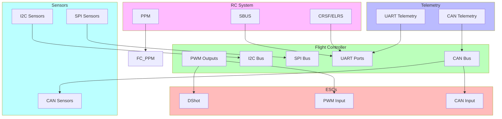

# 28 - Communication Protocols Explained

## Overview

Drones use multiple communication protocols to connect components. Understanding these protocols is essential for building, debugging, and upgrading.

---

## Protocol Categories



---

## Protocol Details

### 1. PWM (Pulse Width Modulation)

```
    PWM Signal:
    
    ┌──────┐      ┌──────┐      ┌──────┐
    │      │      │      │      │      │
    │      │      │      │      │      │
    ─┘      └──────┘      └──────┘      └──────
    
    1000µs    1500µs    2000µs
    
    ────── 1000µs = 0% throttle (minimum)
    ────── 1500µs = 50% throttle (midpoint)
    ────── 2000µs = 100% throttle (maximum)
    
    Frequency: 50Hz (20ms period)
```

| Property | Value |
|----------|-------|
| Type | Analog |
| Wires | 1 signal + 1 ground per channel |
| Speed | 50Hz update rate |
| Resolution | ~10-bit (1024 steps) |
| Range | 1000-2000µs |
| Use | Legacy ESCs, servos, older systems |

**Pros**: Simple, universal, works with everything
**Cons**: Slow, requires many wires, no feedback

---

### 2. PPM (Pulse Position Modulation)

```
    PPM Signal (8 channels):
    
    ┌────┬────┬────┬────┬────┬────┬────┬────┬────┐
    │CH1 │CH2 │CH3 │CH4 │CH5 │CH6 │CH7 │CH8 │SYNC│
    └────┴────┴────┴────┴────┴────┴────┴────┴────┘
    
    Each channel: 1000-2000µs pulse
    Sync pulse: >3000µs (gap between frames)
    
    Total frame: ~22.5ms (for 8 channels)
```

| Property | Value |
|----------|-------|
| Type | Analog (multiplexed) |
| Wires | 1 signal + 1 ground (all channels) |
| Speed | ~44Hz (22.5ms frame) |
| Resolution | ~10-bit |
| Channels | 8-16 typical |
| Use | RC receivers, older FCs |

**Pros**: Single wire for all channels
**Cons**: Slow, no bidirectional communication

---

### 3. SBUS (Serial Bus)

```
    SBUS Frame Structure:
    
    ┌────┬─────────────────────────────────────┬────┐
    │HDR │          16 channels (11-bit each)  │STS│
    │0x0F│                                     │CRC│
    └────┴─────────────────────────────────────┴────┘
    
    Header: 0x0F
    Data: 16 channels × 11 bits = 22 bytes
    Status: Flags byte
    CRC: Checksum
    
    Total: 25 bytes per frame
    Update rate: 7.4ms (135Hz)
```

| Property | Value |
|----------|-------|
| Type | Digital (inverted serial) |
| Wires | 1 signal + 1 ground |
| Speed | 100,000 baud (135Hz update) |
| Resolution | 11-bit (2048 steps) |
| Channels | 16 (17-32 with extended) |
| Voltage | 3.3V (inverted signal) |
| Use | FrSky, Futaba, some receivers |

**Pros**: Fast, high resolution, single wire
**Cons**: Inverted signal (needs inverter on some FCs), proprietary

---

### 4. CRSF (Crossfire Protocol)

```
    CRSF Frame Structure:
    
    ┌────┬────┬─────────────────┬────┐
    │ADDR│LEN │    Payload      │CRC │
    │    │    │                 │    │
    └────┴────┴─────────────────┴────┘
    
    Address: Device address
    Length: Payload length + 2
    Payload: Channel data or telemetry
    CRC: CRC-8 checksum
    
    Update rate: 4ms (250Hz) for RC channels
    Telemetry: 4ms (250Hz)
```

| Property | Value |
|----------|-------|
| Type | Digital (serial) |
| Wires | 1 signal + 1 ground |
| Speed | 420,000 baud (250Hz update) |
| Resolution | 11-bit (2048 steps) |
| Channels | 16 |
| Telemetry | Bidirectional |
| Use | TBS Crossfire, ELRS |

**Pros**: Very fast, bidirectional telemetry, low latency
**Cons**: Requires compatible receiver

---

### 5. DShot (Digital Shot)

```
    DShot Frame (16 bits):
    
    ┌─────┬─────┬─────┬──────┐
    │11bit│ 1bit│ 1bit│ 4bit │
    │DATA │ CMD │ REV │ CRC  │
    └─────┴─────┴──────┴──────┘
    
    Data: Throttle value (0-2047)
    Command: Telemetry request bit
    Reverse: Motor direction command
    CRC: CRC checksum
    
    DShot speeds:
    DShot150: 150kbit/s
    DShot300: 300kbit/s
    DShot600: 600kbit/s (most common)
    DShot1200: 1200kbit/s
```

| Property | Value |
|----------|-------|
| Type | Digital |
| Wires | 1 signal per motor |
| Speed | 150-1200kbit/s |
| Resolution | 11-bit (2048 steps) |
| Update rate | Up to 8kHz |
| Calibration | Not required |
| Feedback | Bidirectional (ERPM, temp, current) |
| Use | Modern ESCs (BLHeli_32, AM32, BlueJay) |

**Pros**: Fast, no calibration, bidirectional telemetry, precise
**Cons**: Requires compatible ESCs

---

### 6. CAN Bus (Controller Area Network)

```
    CAN Bus Topology:
    
    ┌─────────┐     ┌─────────┐     ┌─────────┐
    │   FC    │─────│  ESC 1  │─────│  ESC 2  │
    └────┬────┘     └─────────┘     └─────────┘
         │
    ┌────┴────┐     ┌─────────┐     ┌─────────┐
    │  GPS    │─────│ Compass │─────│  ESC 3  │
    └─────────┘     └─────────┘     └─────────┘
    
    Bus: Twisted pair (CAN_H, CAN_L)
    Termination: 120Ω resistor at each end
    Speed: 1Mbit/s typical
```

| Property | Value |
|----------|-------|
| Type | Digital (differential) |
| Wires | 2 (CAN_H, CAN_L) + ground |
| Speed | 125k-1Mbit/s |
| Devices | Up to 110 on one bus |
| Topology | Bus (daisy-chain or star) |
| Termination | 120Ω at each end |
| Use | Industrial drones, high-end systems |

**Pros**: Robust, noise-resistant, multi-device, bidirectional
**Cons**: More complex, requires CAN-capable components

---

### 7. UART (Universal Asynchronous Receiver/Transmitter)

```
    UART Communication:
    
    ┌──────┐                    ┌──────┐
    │  TX  │───────────────────►│  RX  │
    │      │                    │      │
    │  RX  │◄───────────────────│  TX  │
    │      │                    │      │
    │ GND  │────────────────────│ GND  │
    └──────┘                    └──────┘
    
    TX: Transmit
    RX: Receive
    GND: Ground reference
    
    Baud rates: 9600, 57600, 115200, 230400, 460800, 921600
```

| Property | Value |
|----------|-------|
| Type | Digital (serial) |
| Wires | 2 (TX, RX) + ground |
| Speed | 9600 - 921600 baud |
| Direction | Full duplex (bidirectional) |
| Use | GPS, telemetry, RC receivers, ESC telemetry |

**Pros**: Simple, bidirectional, widely supported
**Cons**: Point-to-point (one device per UART)

---

### 8. I2C (Inter-Integrated Circuit)

```
    I2C Bus Topology:
    
    ┌──────┐     ┌─────────┐     ┌─────────┐
    │  FC  │─────│ Compass │─────│  Baro   │
    │ SDA  │     │ 0x1E    │     │ 0x76    │
    │ SCL  │     │         │     │         │
    └──────┘     └─────────┘     └─────────┘
         │
         │     ┌─────────┐
         └─────│  Baro   │
               │ 0x77    │
               └─────────┘
    
    SDA: Data line (bidirectional)
    SCL: Clock line (master controlled)
    Pull-up: 4.7kΩ to 3.3V on both lines
```

| Property | Value |
|----------|-------|
| Type | Digital (synchronous) |
| Wires | 2 (SDA, SCL) + ground |
| Speed | 100kHz, 400kHz, 1MHz |
| Devices | Up to 112 (7-bit addressing) |
| Addresses | 0x08 - 0x77 (typical sensors) |
| Use | Compass, barometer, IMU, sensors |

**Pros**: Multi-device, simple wiring, low pin count
**Cons**: Slower than SPI, shared bus can cause conflicts

---

### 9. SPI (Serial Peripheral Interface)

```
    SPI Bus Topology:
    
    ┌──────┐     ┌─────────┐
    │  FC  │─────│  IMU    │
    │ MOSI │     │         │
    │ MISO │     └─────────┘
    │ SCK  │
    │ CS1  │─────┌─────────┐
    │ CS2  │─────│  Baro   │
    └──────┘     └─────────┘
    
    MOSI: Master Out Slave In
    MISO: Master In Slave Out
    SCK: Clock
    CS: Chip Select (one per device)
```

| Property | Value |
|----------|-------|
| Type | Digital (synchronous) |
| Wires | 4+ (MOSI, MISO, SCK, CS per device) |
| Speed | Up to 50MHz |
| Devices | One per CS pin |
| Use | High-speed sensors (IMU, baro) |

**Pros**: Very fast, full duplex, no address conflicts
**Cons**: More wires, one device per CS pin

---

## Protocol Comparison Table

| Protocol | Speed | Wires | Direction | Calibration | Use Case |
|----------|-------|-------|-----------|-------------|----------|
| **PWM** | 50Hz | 2/ch | Unidirectional | Required | Legacy ESCs |
| **PPM** | 44Hz | 2 | Unidirectional | Required | Older RC |
| **SBUS** | 135Hz | 2 | Unidirectional | No | FrSky RC |
| **CRSF** | 250Hz | 2 | Bidirectional | No | ELRS, Crossfire |
| **DShot** | 8kHz | 1/motor | Bidirectional | No | Modern ESCs |
| **CAN** | 1Mbit/s | 2 | Bidirectional | No | Industrial |
| **UART** | 921kbaud | 2 | Bidirectional | N/A | GPS, Telemetry |
| **I2C** | 400kHz | 2 | Bidirectional | N/A | Sensors |
| **SPI** | 50MHz | 4+ | Bidirectional | N/A | IMU, Baro |

---

## Which Protocol Connects What

```
    FLIGHT CONTROLLER CONNECTIONS:
    
    ┌─────────────────────────────────────────────────────┐
    │                   FLIGHT CONTROLLER                   │
    │                                                       │
    │  PWM OUT:                                             │
    │  ├─ CH1 → ESC 1 (if using PWM ESCs)                 │
    │  ├─ CH2 → ESC 2                                      │
    │  ├─ CH3 → ESC 3                                      │
    │  ├─ CH4 → ESC 4                                      │
    │  ├─ CH5 → ESC 5 (hexa)                               │
    │  └─ CH6 → ESC 6 (hexa)                               │
    │                                                       │
    │  DShot OUT (DMA capable pins):                        │
    │  ├─ DShot1 → ESC 1 (preferred)                       │
    │  ├─ DShot2 → ESC 2                                   │
    │  ├─ DShot3 → ESC 3                                   │
    │  ├─ DShot4 → ESC 4                                   │
    │  ├─ DShot5 → ESC 5 (hexa)                            │
    │  └─ DShot6 → ESC 6 (hexa)                            │
    │                                                       │
    │  CAN BUS:                                             │
    │  ├─ CAN1_H/CAN1_L → ESC 1, ESC 2, ESC 3 (CAN ESCs) │
    │  ├─ CAN2_H/CAN2_L → ESC 4, ESC 5, ESC 6            │
    │  └─ CAN1 → GPS (if CAN GPS)                          │
    │                                                       │
    │  UART:                                                │
    │  ├─ UART1 → RC Receiver (SBUS/CRSF)                 │
    │  ├─ UART2 → GPS (if UART GPS)                        │
    │  ├─ UART3 → Telemetry Radio (RFD868x)               │
    │  ├─ UART4 → ESC Telemetry (if available)            │
    │  └─ UART6 → Debug / Secondary Telemetry              │
    │                                                       │
    │  I2C:                                                 │
    │  ├─ SDA/SCL → Compass (QMC5883L)                     │
    │  ├─ SDA/SCL → Barometer (if external)                │
    │  └─ SDA/SCL → Airspeed sensor                        │
    │                                                       │
    │  SPI:                                                 │
    │  ├─ Internal → IMU 1 (accel + gyro)                  │
    │  ├─ Internal → IMU 2 (redundant)                     │
    │  ├─ Internal → Barometer (onboard)                   │
    │  └─ CS pins → External SPI devices                    │
    │                                                       │
    └─────────────────────────────────────────────────────┘
```

---

## Protocol Selection Guide

```
    CHOOSING THE RIGHT PROTOCOL:
    
    ┌─────────────────────────────────────────────────────┐
    │  FOR ESCS:                                           │
    │                                                      │
    │  PWM: Only if using legacy ESCs                     │
    │       └─ Simple but slow, no telemetry               │
    │                                                      │
    │  DShot: Recommended for most builds                  │
    │       └─ Fast, no calibration, bidirectional         │
    │       └─ Use DShot600 for most applications          │
    │       └─ Requires BLHeli_32/AM32/BlueJay firmware    │
    │                                                      │
    │  CAN: For industrial/commercial drones               │
    │       └─ Most robust, best telemetry                 │
    │       └─ Requires CAN ESCs (expensive)               │
    │       └─ Used in heavy-lift builds                   │
    │                                                      │
    ├─────────────────────────────────────────────────────┤
    │  FOR RC:                                             │
    │                                                      │
    │  PPM: Legacy, avoid if possible                     │
    │                                                      │
    │  SBUS: If using FrSky receivers                      │
    │       └─ Fast, reliable, widely supported            │
    │                                                      │
    │  CRSF: If using ELRS or Crossfire                    │
    │       └─ Fastest, lowest latency                     │
    │       └─ Bidirectional telemetry                     │
    │                                                      │
    ├─────────────────────────────────────────────────────┤
    │  FOR SENSORS:                                        │
    │                                                      │
    │  I2C: Compass, barometer, most sensors               │
    │       └─ Simple wiring, multiple devices             │
    │                                                      │
    │  SPI: IMU, high-speed sensors                        │
    │       └─ Fastest, used internally by FC              │
    │                                                      │
    ├─────────────────────────────────────────────────────┤
    │  FOR TELEMETRY:                                      │
    │                                                      │
    │  UART: GPS, telemetry radios, ESC telemetry          │
    │       └─ Point-to-point, simple                      │
    │                                                      │
    │  CAN: All components on one bus                      │
    │       └─ Most robust, best for industrial            │
    │                                                      │
    └─────────────────────────────────────────────────────┘
```

---

## Signal Types

### Analog vs Digital

```
    ANALOG SIGNAL (PWM, PPM):
    
    ┌─────────────────────────────────────────┐
    │                                          │
    │  Continuous voltage levels               │
    │  Subject to noise and interference       │
    │  Limited resolution                      │
    │  Example: PWM 1000-2000µs               │
    │                                          │
    │  ─────┐      ┌─────┐      ┌────         │
    │       │      │     │      │             │
    │       └──────┘     └──────┘             │
    │                                          │
    └─────────────────────────────────────────┘
    
    DIGITAL SIGNAL (DShot, SBUS, CRSF, CAN):
    
    ┌─────────────────────────────────────────┐
    │                                          │
    │  Discrete bits (0s and 1s)              │
    │  Noise immune                            │
    │  High resolution                         │
    │  Example: DShot 11-bit data              │
    │                                          │
    │  ┌┐ ┌┐   ┌┐ ┌┐ ┌┐   ┌┐ ┌┐             │
    │  │└┐│└┐  │└┐│└┐│└┐  │└┐│└┐            │
    │  └─┘└─┘  └─┘└─┘└─┘  └─┘└─┘            │
    │  0  1  0  1  1  0  1  0  1              │
    │                                          │
    └─────────────────────────────────────────┘
```

### Unidirectional vs Bidirectional

```
    UNIDIRECTIONAL (PWM, PPM, SBUS):
    
    FC ──────────────────────► ESC/Receiver
         Command/data flow only
    
    
    BIDIRECTIONAL (DShot, CRSF, CAN):
    
    FC ◄─────────────────────► ESC/Receiver
         Commands out, telemetry back
    
    Example DShot bidirectional:
    FC → ESC: "Set throttle to 50%"
    ESC → FC: "Motor RPM = 1200, temp = 45°C"
```

---

## Protocol Configuration

### DShot Configuration in ArduPilot

```
    In Mission Planner → Config/Tuning → Full Parameter List:
    
    ┌─────────────────────────────────────────────────────┐
    │  DSHOT CONFIGURATION                                │
    ├─────────────────────────────────────────────────────┤
    │                                                      │
    │  RC_PROTOCOLS = 0 (disable PWM/PPM/SBUS on RC pin) │
    │                                                      │
    │  MOT_PWM_TYPE = 5 (DShot600)                        │
    │  - 0 = Normal PWM                                    │
    │  - 1 = OneShot125                                    │
    │  - 2 = OneShot250                                    │
    │  - 3 = DShot150                                      │
    │  - 4 = DShot300                                      │
    │  - 5 = DShot600                                      │
    │  - 6 = DShot1200                                     │
    │                                                      │
    │  DSHOT_ONESHOT = 0 (DSHOT bidirectional)            │
    │  - 0 = DShot (unidirectional)                       │
    │  - 1 = DShot bidirectional (recommended)            │
    │                                                      │
    │  For bidirectional DShot, also set:                  │
    │  BRD_SAFETYENABLE = 0                               │
    │  HAL_USE_ACTUATOR = 1                               │
    │                                                      │
    └─────────────────────────────────────────────────────┘
```

### CAN Configuration

```
    In Mission Planner → Config/Tuning → Full Parameter List:
    
    ┌─────────────────────────────────────────────────────┐
    │  CAN CONFIGURATION                                  │
    ├─────────────────────────────────────────────────────┤
    │                                                      │
    │  CAN_D1_PROTOCOL = 1 (DroneCAN or UAVCAN)          │
    │  CAN_D1_NODE1 = 0 (ESC 1 node ID)                  │
    │  CAN_D1_NODE2 = 1 (ESC 2 node ID)                  │
    │  CAN_D1_NODE3 = 2 (ESC 3 node ID)                  │
    │                                                      │
    │  CAN_D2_PROTOCOL = 1 (for second CAN bus)          │
    │  CAN_D2_NODE4 = 3 (ESC 4 node ID)                  │
    │  CAN_D2_NODE5 = 4 (ESC 5 node ID)                  │
    │  CAN_D2_NODE6 = 5 (ESC 6 node ID)                  │
    │                                                      │
    │  GPS_TYPE2 = 9 (DroneCAN GPS)                       │
    │  GPS_NODE1 = 10 (GPS node ID)                       │
    │                                                      │
    └─────────────────────────────────────────────────────┘
```

---

## Troubleshooting Protocols

```
    COMMON PROTOCOL ISSUES:
    
    ┌─────────────────────────────────────────────────────┐
    │  DSHOT NOT WORKING:                                  │
    │  □ Check firmware supports DShot                    │
    │  □ Check ESC firmware supports DShot                │
    │  □ Check wiring (signal wire to correct pin)       │
    │  □ Check MOT_PWM_TYPE setting                       │
    │  □ Check for DMA conflicts                          │
    │  □ Try DShot300 instead of DShot600                │
    │                                                      │
    │  SBUS NOT WORKING:                                   │
    │  □ Check SBUS is inverted (some FCs need inverter) │
    │  □ Check UART wiring (TX/RX swapped?)              │
    │  □ Check baud rate (100000)                         │
    │  □ Check receiver powered (3.3V or 5V)             │
    │                                                      │
    │  I2C NOT WORKING:                                    │
    │  □ Check pull-up resistors (4.7kΩ on SDA and SCL) │
    │  □ Check wiring (SDA to SDA, SCL to SCL)           │
    │  □ Check device address (use I2C scanner)           │
    │  □ Check voltage (3.3V or 5V per device)           │
    │                                                      │
    │  CAN NOT WORKING:                                    │
    │  □ Check termination (120Ω at each end)            │
    │  □ Check wiring (CAN_H to CAN_H, CAN_L to CAN_L) │
    │  □ Check baud rate (1Mbit/s typical)                │
    │  □ Check node IDs (unique per device)              │
    │  □ Check protocol setting in ArduPilot              │
    │                                                      │
    └─────────────────────────────────────────────────────┘
```

---

## Our Protocol Stack (12S Hexacopter)

```
    COMPONENT COMMUNICATION MAP:
    
    ┌─────────────────────────────────────────────────────┐
    │  Component        │ Protocol │ Details               │
    ├───────────────────┼──────────┼───────────────────────┤
    │  ESCs to FC       │ DShot600 │ 6 wires, one per ESC  │
    │  GPS to FC        │ UART     │ 115200 baud           │
    │  Compass to FC    │ I2C      │ QMC5883L @ 0x0E      │
    │  Barometer to FC  │ SPI      │ Internal MS5611       │
    │  IMU to FC        │ SPI      │ Internal ICM-42688    │
    │  RC Receiver      │ CRSF     │ 420000 baud           │
    │  Telemetry Radio  │ UART     │ 57600 baud (RFD868x)  │
    │  ESC Telemetry    │ DShot    │ Bidirectional DShot   │
    │  Spray Pump       │ PWM/CAN  │ FC controlled         │
    │  Flow Sensor      │ UART/PWM │ Pulse counting        │
    │  Ground Station   │ MAVLink  │ Via telemetry radio   │
    └─────────────────────────────────────────────────────┘
```

Understanding these protocols helps you debug connection issues, select compatible components, and optimize your drone's communication architecture.

---

## EFT E616P Build Connection

> **Our complete protocol stack for the hexacopter.**

### Protocol Map for Our Build
| Component | Protocol | Speed | Wires | FC Port |
|---|---|---|---|---|
| ESCs ×6 | DShot600 | 600kbit/s | 1/motor | PWM CH1-6 |
| GPS 1 | UART (UBX) | 115,200 baud | 2+GND | UART1 |
| GPS 2 | UART (UBX) | 115,200 baud | 2+GND | UART2 |
| Telemetry | UART (MAVLink) | 115,200 baud | 2+GND | UART3 |
| RC Receiver | CRSF/S.BUS | 420,000 baud | 2+GND | UART6 |
| Jetson Orin | CAN | 1 Mbps | 2+GND | CAN1 |
| Compass | I2C | 400 kHz | 2+GND | I2C1 |
| IMU | SPI | 50 MHz | 4+ | SPI1 (internal) |
| Barometer | SPI | 50 MHz | 4+ | SPI1 (internal) |
| Flow Sensor | GPIO IRQ | Pulse count | 3 | GPIO |
| Pump | PWM | 50 Hz | 2 | CH5 |
| Bypass Valve | PWM | 50 Hz | 2 | CH6 |
| GCS | MAVLink v2 | Radio | wireless | via RFD868x |

### Protocol Selection Rationale
| Protocol | Why Chosen |
|---|---|
| DShot600 | Fast, no calibration, bidirectional telemetry |
| UART | Simple, point-to-point, widely supported |
| CAN | Robust, multi-device, long cable runs |
| I2C | Low-speed, short distance, multiple devices |
| SPI | High-speed internal sensors |
| CRSF | Lowest latency RC input |
| MAVLink | Standard for FC-GCS communication |

---

## Common Mistakes & Pitflies

| Mistake | Consequence | Prevention |
|---|---|---|
| Wrong baud rate | Device not detected | Match baud to device spec |
| TX/RX swapped | No communication | Cross TX/RX between devices |
| No CAN termination | Intermittent CAN errors | 120Ω at each CAN bus end |
| I2C address conflict | Sensor not detected | Check and set unique addresses |
| PWM interference on UART | Corrupted telemetry | Route signal wires away from power |

---

*Enrichment added: May 29, 2026 | Template v1.0*
