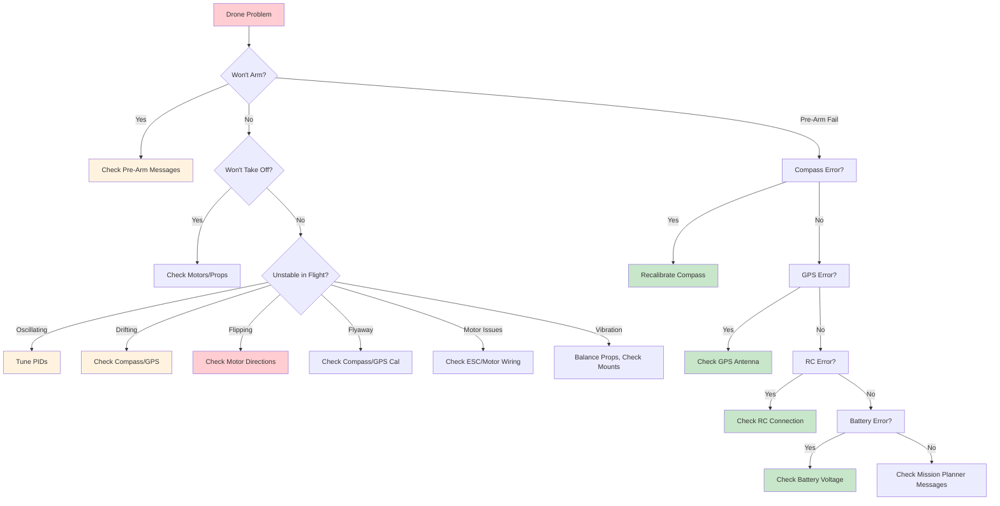

# 29 - Troubleshooting: 15 Common Drone Problems

## Overview

This guide covers the 15 most common drone problems and their solutions. Use the troubleshooting flowchart below, then find your specific issue in the detailed sections.

---

## Troubleshooting Flowchart



---

## Problem 1: Won't Arm

### Symptoms
- Drone does not respond to arm command
- Mission Planner shows "PreArm: check failsafe" or similar
- Motors do not spin when armed

### Causes & Solutions

```
    ┌─────────────────────────────────────────────────────┐
    │  PRE-ARM CHECK FAILURE DIAGNOSIS                     │
    ├─────────────────────────────────────────────────────┤
    │                                                      │
    │  "PreArm: Compass not calibrated"                   │
    │  → Recalibrate compass (Step 3 in setup guide)      │
    │  → Check compass orientation in parameters          │
    │  → Move away from metal objects                     │
    │                                                      │
    │  "PreArm: GPS not healthy"                          │
    │  → Wait for GPS lock (10+ satellites)               │
    │  → Check GPS antenna connection                     │
    │  → Check GPS antenna placement (sky view)           │
    │  → Try different GPS location                       │
    │                                                      │
    │  "PreArm: RC failsafe"                              │
    │  → Check RC receiver connection                     │
    │  → Verify RC calibration                            │
    │  → Check RC failsafe settings                       │
    │  → Ensure transmitter is on and bound               │
    │                                                      │
    │  "PreArm: Battery failsafe"                         │
    │  → Check battery voltage                            │
    │  → Charge battery                                   │
    │  → Check battery monitor configuration              │
    │                                                      │
    │  "PreArm: Throttle below failsafe"                  │
    │  → Raise throttle to minimum (1000µs)               │
    │  → Check radio calibration                          │
    │                                                      │
    │  "PreArm: Safety switch"                            │
    │  → Press safety switch (if equipped)                │
    │  → Disable safety switch in parameters              │
    │                                                      │
    │  "PreArm: Barometer not healthy"                    │
    │  → Check barometer for debris/blockage              │
    │  → Recalibrate barometer                            │
    │                                                      │
    └─────────────────────────────────────────────────────┘
```

### Verification Steps

1. Open Mission Planner → Flight Data
2. Check "PreArm" status messages
3. Fix each reported issue
4. Retry arming

---

## Problem 2: Won't Take Off

### Symptoms
- Motors spin but drone doesn't lift
- Drone lifts partially then falls
- Motors spin but no thrust

### Causes & Solutions

```
    ┌─────────────────────────────────────────────────────┐
    │  MOTOR/THRUST DIAGNOSIS                              │
    ├─────────────────────────────────────────────────────┤
    │                                                      │
    │  MOTORS SPIN BUT NO THRUST:                         │
    │  □ Check propellers installed correctly              │
    │  □ Verify CW/CCW props on correct motors            │
    │  □ Check prop pitch (too low = no thrust)           │
    │  □ Check motor rotation direction                    │
    │                                                      │
    │  MOTORS SPIN BUT DRONE FLIPS:                       │
    │  □ Motor direction wrong (swap two wires)           │
    │  □ Prop on wrong motor                               │
    │  □ Motor order wrong in configuration               │
    │                                                      │
    │  MOTORS DON'T SPIN:                                 │
    │  □ Check ESC calibration                            │
    │  □ Check motor connections                          │
    │  □ Check ESC firmware                               │
    │  □ Check motor windings ( burned smell?)            │
    │                                                      │
    │  LOW THRUST:                                         │
    │  □ Battery not fully charged                        │
    │  □ Battery sag under load                           │
    │  □ Props damaged or unbalanced                       │
    │  □ Motor bearings worn                              │
    │                                                      │
    └─────────────────────────────────────────────────────┘
```

### Quick Test

```
    MOTOR DIRECTION TEST (NO PROPS):
    
    1. Remove all propellers
    
    2. Arm in Stabilize mode
    
    3. Increase throttle to ~30%
    
    4. Check each motor:
       - Motor should spin
       - Direction should match diagram
       - All motors should spin at similar speed
    
    5. If motor doesn't spin:
       - Check ESC connection
       - Check motor wires
       - Check ESC calibration
```

---

## Problem 3: Oscillating / Shaking

### Symptoms
- Drone shakes or vibrates in flight
- Oscillation at specific throttle
- Jello effect in video

### Causes & Solutions

```
    ┌─────────────────────────────────────────────────────┐
    │  OSCILLATION DIAGNOSIS                               │
    ├─────────────────────────────────────────────────────┤
    │                                                      │
    │  HIGH-FREQUENCY OSCILLATION (>50Hz):                │
    │  □ PID gains too high (P term)                     │
    │  □ Reduce P by 20% and test                         │
    │  □ Check for loose bolts                            │
    │  □ Check motor mounting                             │
    │                                                      │
    │  LOW-FREQUENCY OSCILLATION (<10Hz):                 │
    │  □ PID gains too low (I term)                      │
    │  □ Increase I slightly                              │
    │  □ Check GPS interference                           │
    │  □ Check compass interference                       │
    │                                                      │
    │  THROTTLE-DEPENDENT OSCILLATION:                    │
    │  □ PID tuning not optimal                           │
    │  □ Run AutoTune                                      │
    │  □ Adjust PIDs for hover throttle                    │
    │                                                      │
    │  VIBRATION-INDUCED OSCILLATION:                     │
    │  □ Balance propellers                               │
    │  □ Check motor bearings                             │
    │  □ Check prop balance                                │
    │  □ Check FC mounting (vibration damping)            │
    │                                                      │
    └─────────────────────────────────────────────────────┘
```

### PID Tuning Quick Fix

```
    STARTING PIDS FOR HEXACOPTER:
    
    ATC_RAT_RLL_P = 1.0
    ATC_RAT_RLL_I = 0.1
    ATC_RAT_RLL_D = 0.01
    
    ATC_RAT_PIT_P = 1.0
    ATC_RAT_PIT_I = 0.1
    ATC_RAT_PIT_D = 0.01
    
    ATC_RAT_YAW_P = 1.0
    ATC_RAT_YAW_I = 0.1
    ATC_RAT_YAW_D = 0.0
    
    If oscillating:
    1. Reduce P by 20%
    2. Test hover
    3. If still oscillating, reduce another 20%
    4. If stable, increase P by 10% until oscillation returns
    5. Set P to 80% of oscillation point
```

---

## Problem 4: Drifting

### Symptoms
- Drone drifts in one direction
- Won't hold position in Loiter
- Gradual drift over time

### Causes & Solutions

```
    ┌─────────────────────────────────────────────────────┐
    │  DRIFT DIAGNOSIS                                     │
    ├─────────────────────────────────────────────────────┤
    │                                                      │
    │  DRIFT IN STABILIZE MODE:                           │
    │  □ Compass needs recalibration                      │
    │  □ Accelerometer needs recalibration                │
    │  □ Check for wind                                    │
    │  □ Check motor balance                              │
    │  □ Check prop balance                                │
    │                                                      │
    │  DRIFT IN LOITER MODE:                              │
    │  □ GPS HDOP too high (>2.0)                        │
    │  □ Compass interference (metal, electronics)        │
    │  □ GPS antenna placement issue                      │
    │  □ Need to recalibrate compass                      │
    │                                                      │
    │  GRADUAL DRIFT OVER TIME:                           │
    │  □ Compass calibration drift                        │
    │  □ GPS multipath (bouncing signals)                 │
    │  □ Temperature affecting sensors                    │
    │                                                      │
    │  VERTICAL DRIFT (altitude):                         │
    │  □ Barometer blocked (prop wash)                    │
    │  □ Barometer needs recalibration                    │
    │  □ GPS altitude inaccurate                          │
    │  □ Check BARO_GLITCH parameter                      │
    │                                                      │
    └─────────────────────────────────────────────────────┘
```

### Compass Calibration Check

```
    VERIFY COMPASS CALIBRATION:
    
    1. Open Mission Planner → Flight Data
    
    2. Look at compass heading
    
    3. Rotate drone nose left/right
    
    4. Verify heading changes correctly:
       - Nose left → heading decreases
       - Nose right → heading increases
    
    5. If heading is wrong:
       - Recalibrate compass
       - Check compass orientation parameter
       - Move away from metal objects
    
    6. Check compass offsets:
       - Offset X: ±100 to ±300 (good)
       - Offset Y: ±100 to ±300 (good)
       - Offset Z: ±100 to ±300 (good)
       - Diagonal: close to 1.0 (good)
```

---

## Problem 5: Motor Wrong Direction

### Symptoms
- Drone flips on takeoff
- One motor spins wrong direction
- Uncontrolled rotation

### Causes & Solutions

```
    ┌─────────────────────────────────────────────────────┐
    │  MOTOR DIRECTION FIX                                 │
    ├─────────────────────────────────────────────────────┤
    │                                                      │
    │  OPTION 1: SWAP MOTOR WIRES (simplest)              │
    │  □ Identify wrong motor                             │
    │  □ Disconnect motor from ESC                        │
    │  □ Swap any two of the three motor wires            │
    │  □ Reconnect                                        │
    │  □ Test direction                                   │
    │                                                      │
    │  OPTION 2: REVERSE ESC DIRECTION                    │
    │  □ Connect ESC to BLHeli configurator               │
    │  □ Change direction setting                         │
    │  □ Flash if needed (AM32/BlueJay)                   │
    │  □ Test direction                                   │
    │                                                      │
    │  HEXACOPTER MOTOR DIRECTION:                        │
    │                                                      │
    │        M2(CCW)     M1(CW)                          │
    │           ╲         ╱                               │
    │            ╲       ╱                                │
    │     M6(CCW) ╲─────╱ M3(CW)                         │
    │              │     │                                │
    │     M5(CW)  ╱─────╲ M4(CCW)                        │
    │            ╱       ╲                                │
    │           ╱         ╲                               │
    │                                                      │
    │  CW = Clockwise rotation (prop: CCW thread)        │
    │  CCW = Counter-Clockwise rotation (prop: CW)       │
    │                                                      │
    └─────────────────────────────────────────────────────┘
```

### Verify Motor Order

```
    In Mission Planner → Motor Test:
    
    1. Click "Test" for Motor 1
       - Should spin front-right motor
    
    2. Click "Test" for Motor 2
       - Should spin front-left motor
    
    3. Continue for all 6 motors
    
    4. If order wrong:
       - Check MOTOR_ORDER parameter
       - Or physically swap motor connections
    
    5. Verify directions match diagram above
```

---

## Problem 6: Telemetry Issues

### Symptoms
- No telemetry data on ground station
- Intermittent telemetry
- High latency in telemetry

### Causes & Solutions

```
    ┌─────────────────────────────────────────────────────┐
    │  TELEMETRY DIAGNOSIS                                 │
    ├─────────────────────────────────────────────────────┤
    │                                                      │
    │  NO TELEMETRY:                                      │
    │  □ Check telemetry radio power                      │
    │  □ Check UART wiring (TX/RX swapped?)              │
    │  □ Check baud rate (57600 for RFD868x)             │
    │  □ Check telemetry protocol (MAVLink2)              │
    │  □ Check radio binding                               │
    │  □ Check frequency (868MHz for RFD868x)            │
    │                                                      │
    │  INTERMITTENT TELEMETRY:                            │
    │  □ Check antenna connections                        │
    │  □ Check for interference                           │
    │  □ Check link quality (LQ >80%)                     │
    │  □ Check range (reduce distance)                    │
    │  □ Check for physical obstructions                  │
    │                                                      │
    │  HIGH LATENCY:                                      │
    │  □ Increase baud rate                               │
    │  □ Reduce telemetry rate                            │
    │  □ Check for packet loss                            │
    │  □ Check radio interference                         │
    │                                                      │
    │  SERIAL CONFIGURATION:                              │
    │  □ SERIAL4_PROTOCOL = 2 (MAVLink2)                 │
    │  □ SERIAL4_BAUD = 57 (57600 baud)                  │
    │  □ Check correct SERIAL port used                   │
    │                                                      │
    └─────────────────────────────────────────────────────┘
```

### Telemetry Test

```
    TEST TELEMETRY LINK:
    
    1. Connect both radios (air and ground)
    
    2. Power on ground station
    
    3. Open Mission Planner
    
    4. Select correct COM port
    
    5. Click "Connect"
    
    6. Verify parameters download
    
    7. Check Flight Data screen:
       - GPS lock
       - Battery voltage
       - Flight modes
       - Altitude
    
    8. If no connection:
       - Check wiring
       - Check baud rate
       - Check radio binding
       - Check frequency
```

---

## Problem 7: Battery Sag

### Symptoms
- Voltage drops quickly under load
- Drone loses power during aggressive maneuvers
- Battery voltage lower than expected

### Causes & Solutions

```
    ┌─────────────────────────────────────────────────────┐
    │  BATTERY SAG DIAGNOSIS                               │
    ├─────────────────────────────────────────────────────┤
    │                                                      │
    │  NORMAL SAG:                                        │
    │  □ 1-2V drop under full throttle (12S)             │
    │  □ Voltage recovers when throttle reduced           │
    │  □ This is normal LiPo behavior                     │
    │                                                      │
    │  EXCESSIVE SAG (>3V under load):                    │
    │  □ Battery aging (high IR)                         │
    │  □ Battery not fully charged                        │
    │  □ Battery damaged (swollen)                        │
    │  □ Cold temperature (<10°C)                        │
    │  □ High current draw beyond C-rating               │
    │                                                      │
    │  SOLUTIONS:                                          │
    │  □ Charge battery fully before flight               │
    │  □ Warm battery to room temperature                 │
    │  □ Reduce aggressive maneuvers                      │
    │  □ Use higher C-rated battery                       │
    │  □ Replace aging battery                            │
    │  □ Check current draw vs C-rating                   │
    │                                                      │
    │  C-RATING CHECK:                                     │
    │  Max current = mAh × C-rating / 1000               │
    │  Example: 30000mAh × 5C = 150A continuous          │
    │  If hover current > 150A: battery undersized        │
    │                                                      │
    └─────────────────────────────────────────────────────┘
```

### Battery Health Check

```
    CHECK BATTERY HEALTH:
    
    1. Fully charge battery (4.20V/cell)
    
    2. Measure internal resistance (if charger supports)
       - Good: <5mΩ per cell (12S pack)
       - Fair: 5-10mΩ per cell
       - Bad: >10mΩ per cell
    
    3. Check voltage under load:
       - Hover at 50% throttle
       - Measure voltage drop
       - Good: <2V drop from full
       - Fair: 2-3V drop
       - Bad: >3V drop
    
    4. Check cell balance:
       - All cells within 0.05V of each other
       - If cells imbalanced: balance charge
    
    5. If battery unhealthy:
       - Replace battery
       - Do not use for flight
```

---

## Problem 8: Excessive Vibration

### Symptoms
- Buzzing sound from drone
- Jello effect in video
- FC reports high vibration levels
- Poor flight stability

### Causes & Solutions

```
    ┌─────────────────────────────────────────────────────┐
    │  VIBRATION DIAGNOSIS                                 │
    ├─────────────────────────────────────────────────────┤
    │                                                      │
    │  VIBRATION SOURCES:                                  │
    │                                                      │
    │  1. UNBALANCED PROPELLERS                           │
    │     □ Balance propellers on balancer                │
    │     □ Replace damaged props                         │
    │     □ Use high-quality props                         │
    │                                                      │
    │  2. MOTOR ISSUES                                    │
    │     □ Check motor bearings                          │
    │     □ Check motor bell (wobbly?)                    │
    │     □ Check motor mounting bolts                    │
    │     □ Replace worn motors                           │
    │                                                      │
    │  3. FRAME ISSUES                                    │
    │     □ Check all bolts tight                         │
    │     □ Check arm stiffness                           │
    │     □ Check FC mounting (use damping)               │
    │     □ Check for cracked frame                       │
    │                                                      │
    │  4. FC MOUNTING                                     │
    │     □ Use vibration damping foam                    │
    │     □ Use rubber grommets                           │
    │     □ Mount FC away from motors                     │
    │     □ Use anti-vibration mount                      │
    │                                                      │
    │  VIBRATION LEVELS (from logs):                      │
    │  □ Good: <5 m/s²                                    │
    │  □ Fair: 5-15 m/s²                                 │
    │  □ Bad: >15 m/s² (fix before flying)               │
    │                                                      │
    └─────────────────────────────────────────────────────┘
```

### Vibration Test

```
    GROUND SWEEP TEST:
    
    1. Remove propellers
    
    2. Secure drone (tether or clamp)
    
    3. Arm in Stabilize mode
    
    4. Slowly increase throttle:
       - 20%: Check for vibration
       - 40%: Check for vibration
       - 60%: Check for vibration
    
    5. Feel for vibration:
       - Frame should feel smooth
       - No buzzing or rattling
    
    6. If vibration present:
       - Check motor bolts
       - Check motor bearings
       - Check frame bolts
       - Check FC mounting
    
    7. Reinstall props and test hover
```

---

## Problem 9: Failsafe Triggers Unexpectedly

### Symptoms
- Drone enters failsafe during normal flight
- Drone lands or returns without command
- RC link lost intermittently

### Causes & Solutions

```
    ┌─────────────────────────────────────────────────────┐
    │  FAILSAFE DIAGNOSIS                                  │
    ├─────────────────────────────────────────────────────┤
    │                                                      │
    │  RC FAILSAFE:                                       │
    │  □ Check RC failsafe settings                       │
    │  □ Verify FS_THR_VALUE is correct                  │
    │  □ Check RC signal strength (RSSI/LQ)              │
    │  □ Check for interference                           │
    │  □ Check antenna placement                          │
    │  □ Test failsafe intentionally                      │
    │                                                      │
    │  BATTERY FAILSAFE:                                  │
    │  □ Check battery voltage                            │
    │  □ Check BATT_FS_VOLTAGE setting                    │
    │  □ Check for voltage sag under load                 │
    │  □ Verify battery monitoring accuracy               │
    │                                                      │
    │  GPS FAILSAFE:                                      │
    │  □ Check GPS health                                 │
    │  □ Check for GPS interference                       │
    │  □ Verify GPS antenna placement                     │
    │  □ Wait for good GPS lock                           │
    │                                                      │
    │  PREVENTING FALSE FAILSAFES:                        │
    │  □ Set failsafe delay (FS_PILOT_TIMEOUT = 1.5)     │
    │  □ Ensure good RC link quality                      │
    │  □ Use quality battery                              │
    │  □ Check wiring for intermittent connections        │
    │                                                      │
    └─────────────────────────────────────────────────────┘
```

### Failsafe Test Procedure

```
    TEST FAILSAFE (IN SAFE AREA):
    
    1. RC FAILSAFE TEST:
       □ Arm and hover at 2m (tethered)
       □ Turn off RC transmitter
       □ Verify drone enters failsafe
       □ Verify drone lands or RTLs
       □ Turn transmitter back on
       □ Verify control returns
    
    2. BATTERY FAILSAFE TEST:
       □ Set BATT_FS_VOLTAGE temporarily high (e.g., 50V)
       □ Arm and hover
       □ Verify failsafe triggers
       □ Verify drone lands
       □ Reset BATT_FS_VOLTAGE to normal
    
    3. GPS FAILSAFE TEST:
       □ Cover GPS antenna (if safe)
       □ Verify GPS failsafe triggers
       □ Verify drone behavior is safe
```

---

## Problem 10: Flyaway

### Symptoms
- Drone flies away without control
- Drone ignores RC commands
- Drone flies in wrong direction

### Causes & Solutions

```
    ┌─────────────────────────────────────────────────────┐
    │  FLYAWAY PREVENTION AND RESPONSE                     │
    ├─────────────────────────────────────────────────────┤
    │                                                      │
    │  IMMEDIATE ACTIONS:                                  │
    │  □ Switch to Stabilize mode                         │
    │  □ Throttle down                                    │
    │  □ If no response: Turn off transmitter             │
    │  □ If no response: Use geofence                      │
    │  □ If no response: Press emergency stop              │
    │                                                      │
    │  COMMON CAUSES:                                      │
    │  □ Compass interference (metal, power lines)        │
    │  □ Compass not calibrated                            │
    │  □ GPS multipath (urban canyon)                     │
    │  □ Software bug                                     │
    │  □ RC link lost                                     │
    │                                                      │
    │  PREVENTION:                                         │
    │  □ Always calibrate compass away from metal         │
    │  □ Check compass before every flight                │
    │  □ Use geofence                                     │
    │  □ Test failsafe before flying                      │
    │  □ Fly in open areas                                │
    │  □ Never fly near power lines                       │
    │  □ Always have emergency stop ready                 │
    │                                                      │
    │  POST-INCIDENT:                                      │
    │  □ Download and analyze logs                         │
    │  □ Determine root cause                             │
    │  □ Fix before next flight                            │
    │  □ Report if required by regulations                │
    │                                                      │
    └─────────────────────────────────────────────────────┘
```

### Emergency Stop Procedure

```
    EMERGENCY STOP SEQUENCE:
    
    1. FIRST ATTEMPT:
       → Switch to Stabilize mode
       → Throttle to minimum
       → Wait 2 seconds
    
    2. SECOND ATTEMPT:
       → Turn off RC transmitter
       → Triggers throttle failsafe
       → Drone should land
    
    3. THIRD ATTEMPT:
       → Press safety switch (if equipped)
       → Motors should stop immediately
    
    4. LAST RESORT:
       → Cover props with fire extinguisher blanket
       → Let drone crash
       → Safety first, drone second
```

---

## Problem 11: Motor Overheating

### Symptoms
- Motors hot to touch after flight
- Burning smell from motors
- Motor bearings seized

### Causes & Solutions

```
    ┌─────────────────────────────────────────────────────┐
    │  MOTOR OVERHEATING DIAGNOSIS                         │
    ├─────────────────────────────────────────────────────┤
    │                                                      │
    │  NORMAL TEMPERATURE:                                │
    │  □ Warm to touch (40-50°C)                         │
    │  □ Can hold finger for 5+ seconds                   │
    │  □ This is normal after flight                      │
    │                                                      │
    │  OVERHEATING:                                        │
    │  □ Too hot to touch (<50°C)                        │
    │  □ Burning smell                                    │
    │  □ Discoloration                                    │
    │  □ This indicates problem                           │
    │                                                      │
    │  CAUSES:                                             │
    │  □ Props too large for motor                        │
    │  □ KV too low for prop                              │
    │  □ Motor timing too high                            │
    │  □ ESC calibration off                              │
    │  □ Motor bearings worn                              │
    │  □ Motor windings damaged                           │
    │  □ Airflow blocked                                 │
    │                                                      │
    │  SOLUTIONS:                                          │
    │  □ Use smaller props                                │
    │  □ Use higher KV motors                             │
    │  □ Reduce motor timing                              │
    │  □ Recalibrate ESC                                  │
    │  □ Replace bearings                                │
    │  □ Replace motor if damaged                         │
    │  □ Ensure motor has airflow                         │
    │                                                      │
    └─────────────────────────────────────────────────────┘
```

### Motor Temperature Check

```
    AFTER EACH FLIGHT:
    
    1. Land and disarm immediately
    
    2. Wait 30 seconds
    
    3. Touch each motor:
       □ All motors should be similar temperature
       □ One hot motor indicates problem
    
    4. Temperature guide:
       - Cool (<30°C): Normal
       - Warm (30-50°C): Normal
       - Hot (50-70°C): Check for issues
       - Very hot (>70°C): Stop, diagnose
       - Burning smell: Replace motor
    
    5. If one motor hot:
       □ Check motor bearing
       □ Check motor bell wobble
       □ Check prop balance
       □ Check ESC calibration
```

---

## Problem 12: Poor Throttle Response

### Symptoms
- Drone responds slowly to throttle
- Throttle feels mushy
- Delayed response to inputs

### Causes & Solutions

```
    ┌─────────────────────────────────────────────────────┐
    │  THROTTLE RESPONSE DIAGNOSIS                         │
    ├─────────────────────────────────────────────────────┤
    │                                                      │
    │  SLOW RESPONSE:                                     │
    │  □ PID gains too low                                │
    │  □ Throttle curve not optimized                     │
    │  □ ESC response time too slow                       │
    │  □ Motor KV too low for weight                      │
    │                                                      │
    │  SOLUTIONS:                                          │
    │  □ Increase P and I gains                           │
    │  □ Adjust throttle curve in RC                      │
    │  □ Update ESC firmware                              │
    │  □ Use higher KV motors                             │
    │  □ Reduce drone weight                              │
    │                                                      │
    │  THROTTLE CURVE ADJUSTMENT:                         │
    │  □ Increase resolution at hover point               │
    │  □ Adjust RC expo for smoother control              │
    │  □ Test different throttle curves                   │
    │                                                      │
    │  ESC OPTIMIZATION:                                   │
    │  □ Update to latest firmware                        │
    │  □ Increase motor timing                            │
    │  □ Check ESC calibration                            │
    │  □ Use DShot for faster response                    │
    │                                                      │
    └─────────────────────────────────────────────────────┘
```

### Throttle Response Test

```
    TEST THROTTLE RESPONSE:
    
    1. Hover at 2m
    
    2. Quick throttle blip:
       - Throttle up quickly
       - Throttle down quickly
       - Should respond immediately
    
    3. If sluggish:
       - Check PID gains
       - Check ESC settings
       - Check motor performance
    
    4. If jerky:
       - PID gains too high
       - Reduce P gains
       - Add expo to RC
```

---

## Problem 13: CAN Bus Errors

### Symptoms
- CAN devices not detected
- Intermittent CAN communication
- CAN errors in logs

### Causes & Solutions

```
    ┌─────────────────────────────────────────────────────┐
    │  CAN BUS DIAGNOSIS                                   │
    ├─────────────────────────────────────────────────────┤
    │                                                      │
    │  NO CAN DEVICES DETECTED:                           │
    │  □ Check wiring (CAN_H to CAN_H, CAN_L to CAN_L)  │
    │  □ Check termination (120Ω at each end)            │
    │  □ Check baud rate (1Mbit/s typical)                │
    │  □ Check node IDs (unique per device)              │
    │  □ Check power to devices                           │
    │                                                      │
    │  INTERMITTENT CAN:                                  │
    │  □ Check wiring for loose connections               │
    │  □ Check for EMI interference                       │
    │  □ Use shielded cable                               │
    │  □ Check for ground loops                           │
    │                                                      │
    │  CAN TERMINATION:                                    │
    │  □ 120Ω resistor at each end of bus                │
    │  □ Don't terminate in the middle                    │
    │  □ Use proper CAN cable (twisted pair)             │
    │                                                      │
    │  NODE ID CONFIGURATION:                              │
    │  □ Each device needs unique ID                      │
    │  □ Check for ID conflicts                           │
    │  □ Configure IDs in ArduPilot parameters           │
    │                                                      │
    └─────────────────────────────────────────────────────┘
```

### CAN Bus Test

```
    TEST CAN BUS:
    
    1. Check wiring:
       □ CAN_H connected to all CAN_H pins
       □ CAN_L connected to all CAN_L pins
       □ 120Ω at each end of bus
    
    2. Check parameters:
       □ CAN_D1_PROTOCOL = 1 (DroneCAN)
       □ CAN_D2_PROTOCOL = 1 (if second bus)
       □ Node IDs unique
    
    3. Power on and check:
       □ Mission Planner → DroneCAN
       □ Verify devices listed
       □ Check for errors
    
    4. If no devices:
       □ Check power supply
       □ Check termination
       □ Check wiring continuity
```

---

## Problem 14: Log Clipping

### Symptoms
- Flight logs show "clipping" warnings
- Sensor data maxed out
- Missing data in logs

### Causes & Solutions

```
    ┌─────────────────────────────────────────────────────┐
    │  LOG CLIPPING DIAGNOSIS                              │
    ├─────────────────────────────────────────────────────┤
    │                                                      │
    │  WHAT IS LOG CLIPPING?                              │
    │  □ Sensor value exceeds measurement range           │
    │  □ Data is clipped at maximum/minimum               │
    │  □ Results in inaccurate data                       │
    │                                                      │
    │  ACCELEROMETER CLIPPING:                            │
    │  □ Range exceeded (usually ±16g)                   │
    │  □ Caused by vibration or crash                     │
    │  □ Check vibration levels                           │
    │  □ Check FC mounting                                │
    │                                                      │
    │  GYRO CLIPPING:                                     │
    │  □ Angular rate exceeded                            │
    │  □ Caused by aggressive maneuver                    │
    │  □ Reduce stick sensitivity                         │
    │                                                      │
    │  BAROMETER CLIPPING:                                │
    │  □ Altitude change too rapid                        │
    │  □ Prop wash hitting barometer                      │
    │  □ Shield barometer from prop wash                  │
    │                                                      │
    │  SOLUTIONS:                                          │
    │  □ Reduce vibration                                 │
    │  □ Balance props                                    │
    │  □ Check FC mounting                                │
    │  □ Use vibration damping                            │
    │  □ Review logs for patterns                         │
    │                                                      │
    └─────────────────────────────────────────────────────┘
```

### Log Analysis

```
    CHECK FOR CLIPPING:
    
    1. Download flight logs
    
    2. Open in Mission Planner → Log Analysis
    
    3. Look for:
       □ ACC clip count > 0
       □ GYR clip count > 0
       □ BARO clip count > 0
    
    4. If clipping found:
       □ Check vibration levels
       □ Check motor balance
       □ Check prop balance
       □ Check FC mounting
    
    5. Reduce clipping:
       □ Balance props
       □ Check motor bearings
       □ Use vibration damping
       □ Reduce aggressive maneuvers
```

---

## Problem 15: GPS HDOP High

### Symptoms
- GPS HDOP > 2.0
- Poor position hold
- Drifting in Loiter

### Causes & Solutions

```
    ┌─────────────────────────────────────────────────────┐
    │  GPS HDOP DIAGNOSIS                                  │
    ├─────────────────────────────────────────────────────┤
    │                                                      │
    │  WHAT IS HDOP?                                      │
    │  □ Horizontal Dilution of Precision                 │
    │  □ Lower is better                                  │
    │  □ <1.0 = excellent                                 │
    │  □ 1.0-2.0 = good                                  │
    │  □ 2.0-5.0 = fair                                  │
    │  □ >5.0 = poor (don't fly)                         │
    │                                                      │
    │  CAUSES OF HIGH HDOP:                               │
    │  □ Poor sky view                                    │
    │  □ GPS antenna blocked                               │
    │  □ Multipath (signals bouncing)                    │
    │  □ Interference                                     │
    │  □ Few satellites visible                           │
    │                                                      │
    │  SOLUTIONS:                                          │
    │  □ Move to open area                                │
    │  □ Ensure GPS antenna has clear sky view            │
    │  □ Mount GPS antenna higher                         │
    │  □ Use higher quality GPS module                    │
    │  □ Wait for more satellites                         │
    │  □ Avoid flying near buildings                      │
    │                                                      │
    │  GOOD GPS:                                           │
    │  □ 10+ satellites                                   │
    │  □ HDOP < 2.0                                      │
    │  □ Clear sky view                                   │
    │  □ Away from interference                           │
    │                                                      │
    └─────────────────────────────────────────────────────┘
```

### GPS Health Check

```
    CHECK GPS HEALTH:
    
    1. Open Mission Planner → Flight Data
    
    2. Check GPS status:
       □ Satellites: 10+ (good)
       □ HDOP: <2.0 (good)
       □ Fix type: 3D (good)
    
    3. If HDOP high:
       □ Wait for more satellites
       □ Move to open area
       □ Check GPS antenna
    
    4. If no fix:
       □ Check GPS power
       □ Check GPS wiring
       □ Check GPS antenna
       □ Wait 5 minutes for cold start
```

---

## Quick Reference: Problem → Solution

| # | Problem | Most Likely Cause | Quick Fix |
|---|---------|-------------------|-----------|
| 1 | Won't arm | Pre-arm check fail | Check Mission Planner messages |
| 2 | Won't take off | Motor/prop issue | Check motor directions, props |
| 3 | Oscillating | PID too high | Reduce P gains |
| 4 | Drifting | Compass/GPS issue | Recalibrate compass |
| 5 | Motor wrong direction | Wiring/ESC | Swap two motor wires |
| 6 | Telemetry issues | Wiring/baud rate | Check UART config |
| 7 | Battery sag | Battery health | Charge fully, check C-rating |
| 8 | Vibration | Unbalanced props | Balance props, check motors |
| 9 | Failsafe triggers | Signal loss | Check RC link, adjust settings |
| 10 | Flyaway | Compass/GPS error | Emergency stop, recalibrate |
| 11 | Motor overheating | Props too large | Use smaller props |
| 12 | Poor throttle response | PID too low | Increase P/I gains |
| 13 | CAN errors | Wiring/termination | Check CAN_H/CAN_L, 120Ω |
| 14 | Log clipping | Vibration too high | Balance props, check mounts |
| 15 | High HDOP | Poor GPS view | Move to open area |

---

## When to Seek Help

```
    SEEK PROFESSIONAL HELP IF:
    
    □ Crash causes structural damage
    □ Battery is swollen or damaged
    □ Motor windings are burned
    □ FC is unresponsive
    □ ESC is smoking or burned
    □ You cannot diagnose the issue
    □ Issue persists after multiple attempts
    
    CONTACT:
    □ Manufacturer support
    □ ArduPilot forums (discuss.ardupilot.org)
    □ Local drone community
    □ Professional repair service
```

Understanding these common problems and their solutions will help you diagnose and fix issues quickly, getting your drone back in the air safely.

---

## EFT E616P Build Connection

> **Quick troubleshooting for our specific build.**

### Our Top 15 Issues (Specific to Our Build)

| # | Problem | Our Component | Likely Cause | Quick Fix |
|---|---|---|---|---|
| 1 | Won't arm | Pixhawk 6C | Pre-arm check fail | Check MP messages |
| 2 | Won't lift off | X9 G2L motors | Motor direction wrong | Verify CW/CCW in Motor Test |
| 3 | Oscillating | All | PID too high | Reduce ATC_RAT gains 20% |
| 4 | Drifting | GPS/Compass | Compass interference | Recalibrate away from metal |
| 5 | Motor wrong direction | X9 G2L | Wiring/ESC | Swap two motor wires |
| 6 | No telemetry | RFD868x | UART config | Check baud (115200), wiring |
| 7 | Battery sag | Tattu 12S 30Ah | Battery health | Check cell IR, charge fully |
| 8 | Vibration | MFP 36×11 props | Unbalanced props | Balance all props |
| 9 | Failsafe triggers | R-XSR | Signal loss | Check RC link quality |
| 10 | Flyaway | Compass error | Compass calibration | Emergency stop, recalibrate |
| 11 | Motor overheating | X9 G2L | Props too large | Use MFP 36×11 only |
| 12 | Slow throttle response | All | PID too low | Increase P/I gains |
| 13 | CAN errors | Jetson↔FC | Termination | Check 120Ω at CAN ends |
| 14 | Log clipping | Pixhawk 6C | Vibration | Balance props, check mounts |
| 15 | High HDOP | M10 Mini GPS | Poor sky view | Move to open area |

### Emergency Stop Sequence
1. Switch to Stabilize → throttle to minimum
2. Turn off RC transmitter → triggers failsafe
3. Press safety switch → motors stop
4. Last resort: cover props, let crash

---

## Datasheet & Product Links

| Resource | URL |
|---|---|
| ArduPilot Troubleshooting | https://ardupilot.org/copter/docs/common-problems.html |
| ArduPilot Forums | https://discuss.ardupilot.org |
| ArduPilot Discord | https://discord.gg/ardupilot |
| Pixhawk 6C Support | https://holybro.com/support |

---

*Enrichment added: May 29, 2026 | Template v1.0*
