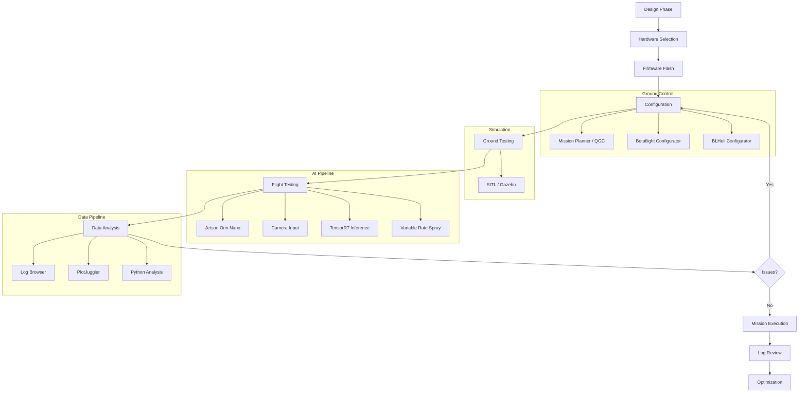

# 31. Software Tools — Complete Guide

Comprehensive reference to all software used in drone building, organized by category.

---

## Flight Controller Firmware

| Firmware | License | Best For | Key Features |
|----------|---------|----------|--------------|
| **ArduPilot (ArduCopter 4.4+)** | GPL v3 | Industrial, research | Open source, Pixhawk ecosystem, huge community |
| **PX4** | BSD-3 | Commercial, research | Open source, commercial-friendly, ROS integration |
| **Betaflight** | GPL v3 | FPV racing/freestyle | Fastest loop times (8kHz), optimized for manual flight |
| **iNav** | GPL v3 | GPS navigation | Waypoint missions, long-range fixed-wing |
| **BLHeli_32 / AM32** | GPL | ESC firmware | Motor commutation, DShot, RPM telemetry |

### Firmware URLs
- ArduPilot: https://ardupilot.org/dev/
- PX4: https://docs.px4.io
- Betaflight: https://betaflight.com
- iNav: https://iNavFlight.github.io
- BLHeli_32: https://www.blheli32.com
- AM32: https://github.com/AM32-ESC/AM32

---

## Ground Control Stations

| GCS | Platform | Firmware Support | Best For |
|-----|----------|-----------------|----------|
| **Mission Planner** | Windows only | ArduPilot | Most features, log analysis, full setup |
| **QGroundControl** | Win/Mac/Linux/Android/iOS | PX4 + ArduPilot | Cross-platform, mobile |
| **APM Planner 2** | Mac/Linux | ArduPilot | Mac/Linux alternative |
| **MAVProxy** | All (Python) | ArduPilot | Command-line, scripting, headless |
| **Tower** | Android | ArduPilot | Mobile field use (legacy) |

### GCS URLs
- Mission Planner: https://ardupilot.org/planner/
- QGroundControl: https://qgroundcontrol.com
- APM Planner 2: https://ardupilot.org/planner2/
- MAVProxy: https://ardupilot.org/dev/docs/mavproxy.html
- Tower: https://github.com/DroidPlanner/tower

---

## Configuration Tools

### Betaflight Configurator
- FC setup, OSD configuration
- PID tuning wizard
- Flight modes, arming flags
- Receiver channel mapping
- Download: https://github.com/betaflight/betaflight-configurator

### BLHeli Suite / BLHeli Configurator
- ESC firmware update
- Motor direction, timing, throttle range
- Bidirectional DShot setup
- Download: https://github.com/AlkaMotors/BLHeli-Configurator-Multi

### Mission Planner Setup Workflow
1. **Compass calibration**: Rotate drone in all orientations
2. **Accelerometer calibration**: Level, nose down, nose up, left, right, back
3. **Radio calibration**: Move all sticks to extremes
4. **Flight mode mapping**: Stabilize, Loiter, Auto, RTL, etc.
5. **ESC calibration**: Throttle range calibration

### ArduPilot Key Parameters

| Prefix | Purpose | Examples |
|--------|---------|----------|
| `ATC_*` | Attitude control | `ATC_RAT_PIT_P`, `ATC_RATE_MAX` |
| `MOT_*` | Motor mixing | `MOT_1_FUNC`, `MOT_PWM_MIN` |
| `PSC_*` | Position control | `PSC_POSXY_P`, `PSC_VELXY_P` |
| `WP_*` | Waypoint navigation | `WP_RADIUS`, `WP_SPEED` |
| `ARM_*` | Arming checks | `ARM_CHECK`, `ARMING_VOLT_MIN` |
| `BATT_*` | Battery monitoring | `BATT_CAPACITY`, `BATT_VOLT_MULT` |

---

## Simulation

| Simulator | Firmware | Use Case |
|-----------|----------|----------|
| **SITL** | ArduPilot | Software-in-the-loop, virtual testing |
| **Gazebo** | PX4/ROS | Physics simulation, ROS integration |
| **FlightGear** | ArduPilot | Visual flight simulation |
| **JMAVSim** | PX4 | Lightweight quadcopter sim |

### Simulation URLs
- SITL: https://ardupilot.org/dev/docs/simulation.html
- Gazebo: https://gazebosim.org
- FlightGear: https://www.flightgear.org
- JMAVSim: https://dev.px4.io/en/simulation/

---

## Data Analysis

### Mission Planner Log Browser
- `.bin` flight log analysis
- Graph vibration, GPS accuracy, battery performance
- KML export for Google Earth

### Blackbox Explorer
- Betaflight log visualization
- PID performance analysis
- Download: https://github.com/betaflight/blackbox-log-viewer

### PlotJuggler
- Advanced time-series visualization
- ROS bag file support
- Download: https://github.com/facontidavide/PlotJuggler

### Python + pandas
```python
import pandas as pd
import matplotlib.pyplot as plt

# Parse ArduPilot log CSV export
df = pd.read_csv("flight_log.csv")
df.plot(x="Time", y=["ROLL", "PITCH", "YAW"])
plt.show()
```

---

## AI / Edge Computing

| Tool | Purpose |
|------|---------|
| **NVIDIA Jetson SDK** | Edge AI deployment (Orin Nano, Xavier) |
| **TensorFlow / PyTorch** | ML model training |
| **OpenCV** | Computer vision, image processing |
| **ROS / ROS2** | Robot operating system, middleware |
| **TensorRT** | Model optimization for Jetson |

### URLs
- Jetson: https://developer.nvidia.com/embedded/jetson
- OpenCV: https://opencv.org
- ROS2: https://docs.ros.org

---

## Mapping & Survey

| Tool | Type | Use Case |
|------|------|----------|
| **Pix4Dmapper** | Commercial | Professional photogrammetry |
| **OpenDroneMap** | Open source | 3D mapping from drone imagery |
| **QGIS** | Open source | Geographic analysis, GIS |
| **WebODM** | Open source | Cloud-based photogrammetry |

### URLs
- Pix4D: https://www.pix4d.com
- OpenDroneMap: https://www.opendronemap.org
- QGIS: https://qgis.org
- WebODM: https://www.webodm.org

---

## Version Control

- **Git**: Distributed version control
- **GitHub**: Code hosting, CI/CD, issue tracking
- Essential for reproducible drone builds and firmware modifications

---

## Software Workflow



---

## Comparison: GCS Options

| Feature | Mission Planner | QGroundControl | APM Planner |
|---------|----------------|----------------|-------------|
| **Platform** | Windows | All | Mac/Linux |
| **ArduPilot** | Full | Full | Full |
| **PX4** | No | Full | No |
| **Mobile** | No | Yes (Android/iOS) | No |
| **Log Analysis** | Excellent | Good | Basic |
| **Setup Wizards** | Complete | Good | Basic |
| **Community** | Largest | Growing | Small |
| **Best For** | Power users | Cross-platform | Mac users |

---

*Last updated: 2026-05-29*
