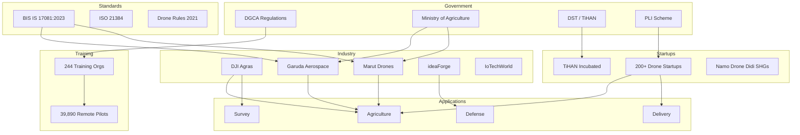

# 32. India Drone Ecosystem

Comprehensive documentation of India's drone ecosystem — market, regulations, players, and government initiatives.

---

## Market Statistics (2024–2026)

| Metric | Value | Source/Date |
|--------|-------|-------------|
| Registered drones | 38,500+ | DGCA, Feb 2026 |
| Certified remote pilots | 39,890 | DGCA, 2026 |
| Approved training organisations | 244 | DGCA, 2026 |
| Drone startups | 200+ | Industry reports |
| Capital raised since 2014 | INR 12 Bn+ | Invest India |
| Market size (2024) | INR 57 Bn | Industry estimate |
| Market size (2029 projected) | INR 123 Bn | Industry estimate |
| India drone market (2025) | USD 0.47 Bn | Market research |
| India drone market (2030 projected) | USD 1.39 Bn | Market research |
| CAGR (2025–2030) | 24.4% | Market research |
| Agricultural drones (current) | 3,000+ | Ministry of Agriculture |
| Agricultural drones (FY25 target) | 7,000+ | Government target |

---

## Key Players

### Agricultural Drone Manufacturers

| Company | Product | Tank Capacity | Coverage | Location |
|---------|---------|---------------|----------|----------|
| **DJI** | Agras T30 | 30L | 50 acres/hr | International |
| **DJI** | Agras T100 | 100L | 100+ acres/hr | International |
| **Garuda Aerospace** | Kisan Drone | 10L | 30 acres/day | Chennai |
| **Marut Drones** | AG-365S | 16L | Multi-utility | Hyderabad |
| **insideFPV** | Krishi Drone | 10L | — | Gujarat |
| **XAG** | P40/P150 | 10L/15L | Intelligent planning | International |
| **Hylio** | AG-272 | 27L (dual) | Heavy-duty | USA |
| **Robocraft** | 10L Hexacopter | 10L | GPS waypoint | India |

### Defense & Commercial

| Company | Focus | Notes |
|---------|-------|-------|
| **ideaForge** | Defense, surveillance | Largest Indian defense drone maker |
| **IoTechWorld** | Agribot, commercial | DGCA-certified |
| **SkyDrones Technologies** | Commercial, survey | — |
| **Zen Technologies** | Defense training | Drone simulators |

---

## Government Schemes

### Kisan Drone Scheme (2022)
- Subsidies for farm mechanization drones
- 50–100% subsidy based on category
- Focus: spraying, seeding, crop monitoring

### Namo Drone Didi
- **Target**: Women Self-Help Groups (SHGs)
- **Subsidy**: 80% of drone cost
- **Budget**: ₹8 lakh per drone
- **Goal**: Empower rural women as drone operators
- **Training**: 5-day DGCA-certified course

### Sub-Mission on Agricultural Mechanization (SMAM)
- Subsidy for farm equipment including drones
- Available through agriculture department

### Agriculture Infrastructure Fund (AIF)
- ₹1 lakh crore fund
- Drone infrastructure as eligible project
- 3% interest subvention

### PLI Scheme for Drones
- Production-Linked Incentive for drone manufacturing
- 20% incentive on value addition
- 3-year tenure

### Drone Rules 2021
- Simplified regulatory framework
- Digital registration via Digital Sky
- Reduced airspace restrictions
- NPNT (No Permission No Takeoff) system

---

## DGCA Regulations Summary

### Drone Categories

| Category | Weight | Registration | License |
|----------|--------|--------------|---------|
| **Nano** | <250g | Not required | Not required |
| **Micro** | 250g–2kg | Required | Required |
| **Small** | 2–25kg | Required | Required (RPL) |
| **Medium** | 25–150kg | Required | Required (RPL) |
| **Large** | >150kg | Required | Required (RPL) |

### Key Regulations

| Rule | Requirement |
|------|-------------|
| **Registration** | Digital Sky platform (dgca.gov.in) |
| **NPNT** | No Permission No Takeoff — mandatory for all flights |
| **RPL** | Remote Pilot License mandatory for micro+ category |
| **Insurance** | Mandatory under Rule 44 |
| **Max altitude** | 120m AGL |
| **Frequency** | 865–867 MHz ISM band (India) |
| **Flight near airports** | Prohibited without permission |
| **Night operations** | Allowed with anti-collision lights |
| **Payload** | No goods delivery in most zones |
| **Penalties** | Up to ₹1,00,000 fine |

### Airspace Zones

| Zone | Description |
|------|-------------|
| 🟢 **Green** | Unrestricted, can fly with NPNT |
| 🟡 **Yellow** | Controlled, requires ATC permission |
| 🔴 **Red** | Restricted, no flying allowed |

---

## TiHAN — IIT Hyderabad

### Overview
- **Full Name**: Technology Innovation Hub on Autonomous Navigation
- **Funded by**: Department of Science and Technology (DST)
- **Location**: IIT Hyderabad, Telangana
- **Distinction**: India's first autonomous navigation testbed

### Focus Areas
- Unmanned Aerial Vehicles (UAVs)
- Autonomous ground vehicles
- Edge AI for navigation
- Smart mobility solutions
- eVTOL (electric Vertical Take-Off and Landing)

### Achievements
- **35+ startups** incubated
- **eVTOL Propulsion Lab**: NABL-accredited testing facility
- **Autonomous navigation testbed**: Real-world testing infrastructure
- **Industry collaborations**: Partnerships with defense, agriculture, logistics

### Collaborations
- **Academia**: IITs, IISc, NITs
- **Defense**: DRDO, Indian Armed Forces
- **Industry**: Drone manufacturers, AI companies
- **Government**: State and central agencies

### Relevance to This Project
- TiHAN provides testing infrastructure for autonomous drone certification
- Edge-AI validation protocols align with TiHAN's research goals
- Standards framework can be adopted for TiHAN-certified drones

---

## Ecosystem Map

---

## Key Resources

| Resource | URL |
|----------|-----|
| DGCA Digital Sky | https://digitalsky.dgca.gov.in |
| TiHAN IIT Hyderabad | https://tihan.iith.ac.in |
| Garuda Aerospace | https://www.garuda.aerospace |
| Marut Drones | https://www.marutdrones.com |
| ideaForge | https://ideaforge.co.in |
| Drone Rules 2021 | https://pib.gov.in |
| BIS Standards | https://www.bis.gov.in |

---

*Last updated: 2026-05-29*
