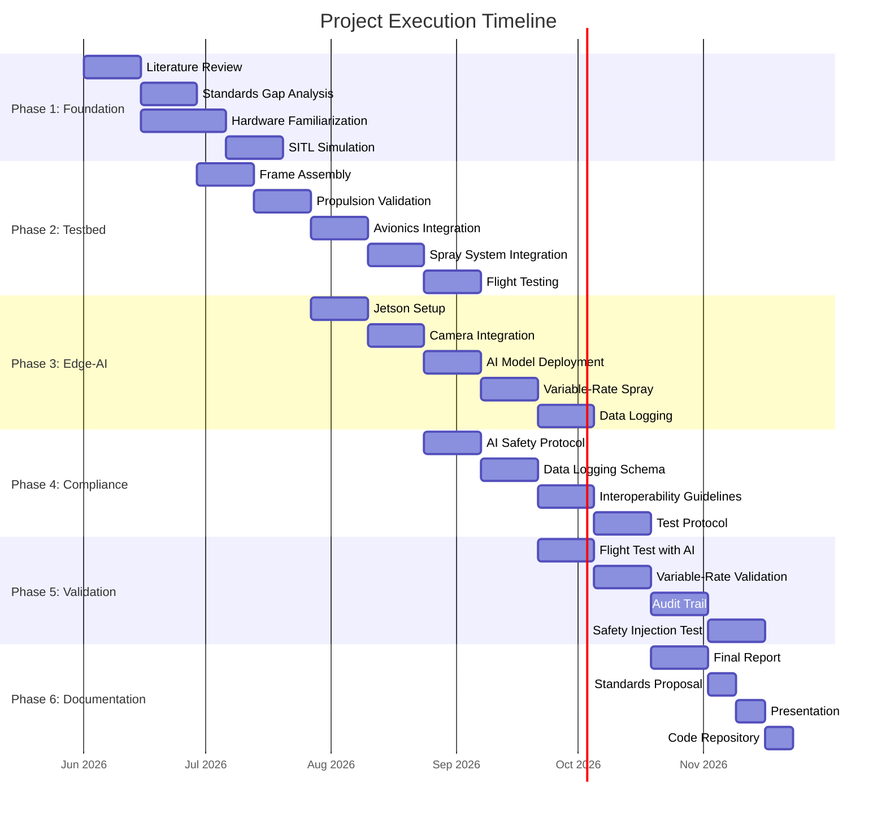

# 34. Project Execution Plan

Detailed execution plan for TIHAN + COEP Tech internship project.

---

## Project Overview

| Field | Detail |
|-------|--------|
| **Title** | National Reference Standards and Certification Framework for Edge-AI Enabled Autonomous Agricultural Drones |
| **Institution** | COEP Technological University + TiHAN IIT Hyderabad |
| **Target TRL** | TRL-6 — Compliance framework demonstrated in relevant testbed environment |
| **Duration** | 10 months |
| **Hardware** | EFT E616P hexacopter, Pixhawk 6C, Jetson Orin Nano |

---

## Phase 1: Foundation (Months 1–2)

### Objectives
- Understand existing standards landscape
- Set up development environment
- Complete simulation testing

### Tasks

| Week | Task | Deliverable |
|------|------|-------------|
| 1–2 | Literature review: BIS IS 17081:2023, DGCA Drone Rules 2021, ISO 21384-3:2019 | Standards inventory |
| 3–4 | Gap analysis: What's missing for edge-AI certification | Gap analysis matrix |
| 5–6 | Hardware familiarization: Pixhawk 6C, ArduCopter, Mission Planner | Setup guide |
| 7–8 | SITL simulation: Autonomous mission testing | Simulation logs |

### Deliverables
- [ ] Standards Gap Analysis Report
- [ ] Development environment setup documentation
- [ ] SITL simulation test results

---

## Phase 2: Testbed Development (Months 2–4)

### Objectives
- Assemble and validate flight testbed
- Integrate all subsystems
- Achieve first hover

### Tasks

| Week | Task | Deliverable |
|------|------|-------------|
| 9–10 | Frame assembly: EFT E616P hexacopter build | Assembled frame |
| 11–12 | Propulsion validation: Thrust stand testing | Motor performance data |
| 13–14 | Avionics integration: Pixhawk + GPS + telemetry + RC | Avionics stack |
| 15–16 | Spray system integration: SHURflo pump + TeeJet nozzles + flow sensor | Spray system |
| 17–18 | Ground sweep → tethered hover → free flight | Flight test report |

### Deliverables
- [ ] Flight-validated testbed at 36 kg MTOW
- [ ] Thrust stand test data
- [ ] First hover video/log

---

## Phase 3: Edge-AI Integration (Months 4–6)

### Objectives
- Deploy AI models on Jetson Orin Nano
- Integrate camera and AI pipeline
- Connect AI output to spray system

### Tasks

| Week | Task | Deliverable |
|------|------|-------------|
| 19–20 | Jetson Orin Nano setup: Ubuntu, CUDA, TensorRT | Dev environment |
| 21–22 | Camera integration: Multispectral/NDVI camera | Camera pipeline |
| 23–24 | AI model deployment: Crop health classification, weed detection | Trained models |
| 25–26 | Variable-rate spray: AI output → pump PWM control | Spray control |
| 27–28 | Data logging: Per-decision audit trail | Logging system |

### Deliverables
- [ ] AI-enabled spray system on testbed
- [ ] Model accuracy benchmarks
- [ ] Variable-rate spray demonstration

---

## Phase 4: Compliance Framework (Months 5–7)

### Objectives
- Design AI safety validation protocol
- Define data logging standards
- Create interoperability guidelines

### Tasks

| Week | Task | Deliverable |
|------|------|-------------|
| 29–30 | AI safety validation protocol: Functional accuracy, latency, failsafe | Validation doc |
| 31–32 | Data logging schema: Standardized JSON/Protobuf format | Schema spec |
| 33–34 | Interoperability guidelines: MAVLink extensions for AI decisions | Protocol spec |
| 35–36 | Test protocol: Pass/fail criteria for each validation layer | Test matrix |

### Deliverables
- [ ] Draft certification framework document
- [ ] AI validation protocol
- [ ] Data logging schema specification

---

## Phase 5: Testbed Validation (Months 7–9)

### Objectives
- Demonstrate TRL-6 in relevant testbed environment
- Validate AI + spray integration
- Generate flight test data for certification

### Tasks

| Week | Task | Deliverable |
|------|------|-------------|
| 37–38 | Flight test with AI active: Real-time NDVI inference | NDVI flight logs |
| 39–40 | Variable-rate spray validation: Prove spray rate changes with AI | Spray rate data |
| 41–42 | Decision audit trail: Log GPS, NDVI, confidence, spray rate | Audit logs |
| 43–44 | Safety injection test: Simulate camera failure, verify safe mode | Safety test report |

### Deliverables
- [ ] TRL-6 validation report with flight test data
- [ ] Safety injection test results
- [ ] Complete audit trail data

---

## Phase 6: Documentation & Handover (Months 9–10)

### Objectives
- Finalize all documentation
- Propose standards amendments
- Hand over code and documentation

### Tasks

| Week | Task | Deliverable |
|------|------|-------------|
| 45–46 | Final report: Complete certification framework | Final report |
| 47–48 | Standards proposal: Specific amendments to BIS/DGCA/ISO | Proposal document |
| 49 | Presentation: To TiHAN advisory board | Slide deck |
| 50 | Code repository: Open-source testbed software | GitHub repo |

### Deliverables
- [ ] Final report + standards proposal
- [ ] GitHub repository with complete code
- [ ] Presentation to TiHAN advisory board

---

## Gantt Chart

---

## Deliverables Timeline

| Month | Phase | Deliverable |
|-------|-------|-------------|
| 1–2 | Foundation | Standards Gap Analysis Report |
| 2–4 | Testbed | Flight-validated testbed at 36 kg MTOW |
| 4–6 | Edge-AI | AI-enabled spray system |
| 5–7 | Compliance | Draft certification framework |
| 7–9 | Validation | TRL-6 validation report |
| 9–10 | Handover | Final report + standards proposal + GitHub repo |

---

## Risk Mitigation

| Risk | Impact | Mitigation Strategy |
|------|--------|---------------------|
| AI accuracy <95% | High | Use simpler rule-based approach initially, iterate |
| Flight time <20 min | Medium | Reduce spray duration, increase battery capacity |
| DGCA approval delays | High | Focus on research documentation, submit after |
| Hardware failure | Medium | Maintain spare components list, critical spares on hand |
| Budget overrun | Medium | Prioritize essential components, seek additional funding |
| Scope creep | High | Stick to TRL-6 scope, document future work separately |

---

## Resources Required

### Hardware
- EFT E616P hexacopter frame
- Pixhawk 6C flight controller
- Holybro GPS module
- SHURflo pump + TeeJet nozzles
- Jetson Orin Nano dev kit
- Multispectral/NDVI camera
- 6S LiPo batteries (×3)
- Telemetry radio (433/915 MHz)
- RC transmitter/receiver

### Software
- ArduCopter 4.4+
- Mission Planner
- NVIDIA JetPack SDK
- TensorRT
- OpenCV
- Python 3.10+
- ROS2 Humble

### Human Resources
- 1× Intern (COEP Tech)
- 1× Faculty advisor
- 1× TiHAN mentor
- Access to TiHAN testbed

---

## Success Criteria (TRL-6)

| Criterion | Measurement |
|-----------|-------------|
| Autonomous flight | GPS waypoint navigation with AI active |
| AI inference latency | <200ms per frame |
| Variable-rate spray | Spray rate changes based on crop health data |
| Audit trail | Complete GPS + NDVI + confidence + spray rate logs |
| Safety mode | Autonomous return-to-launch on camera failure |
| Documentation | Complete certification framework draft |

---

*Last updated: 2026-05-29*
