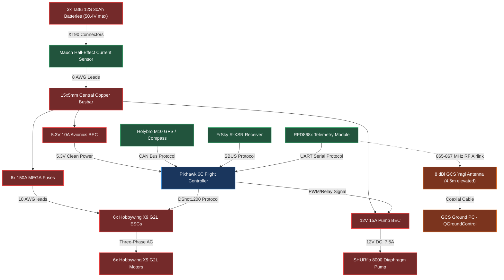
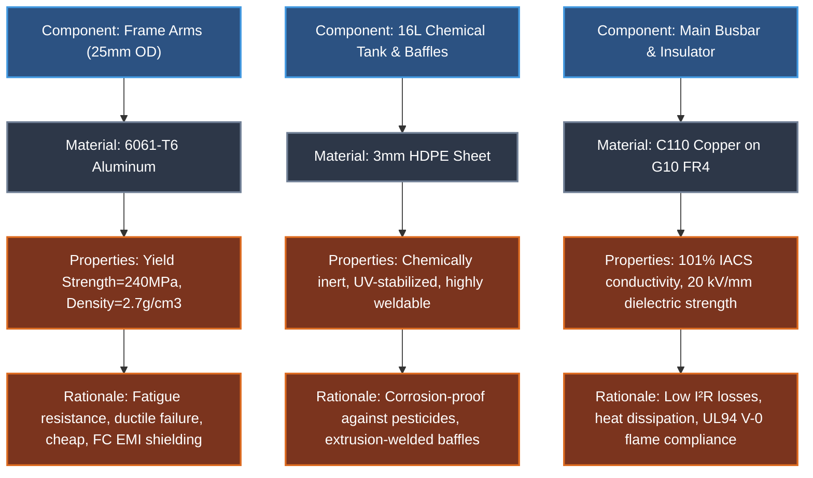
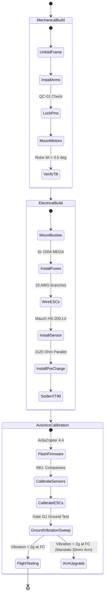
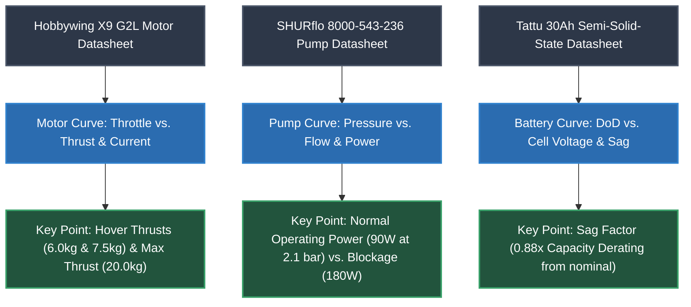
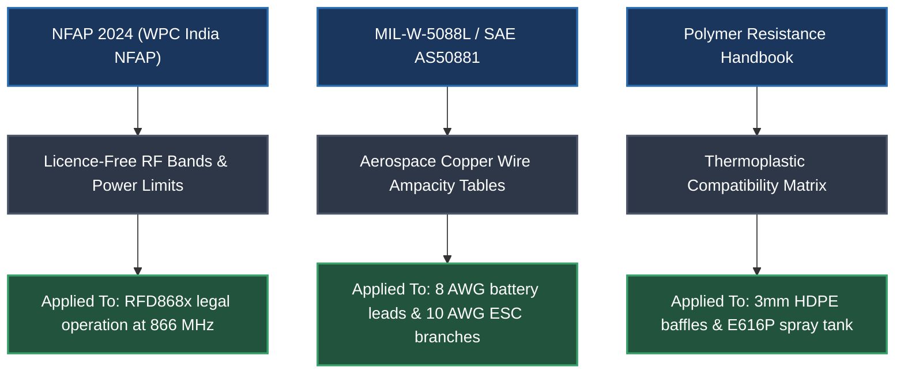
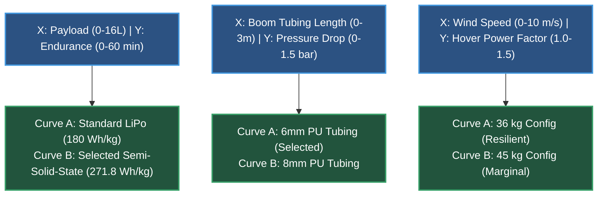
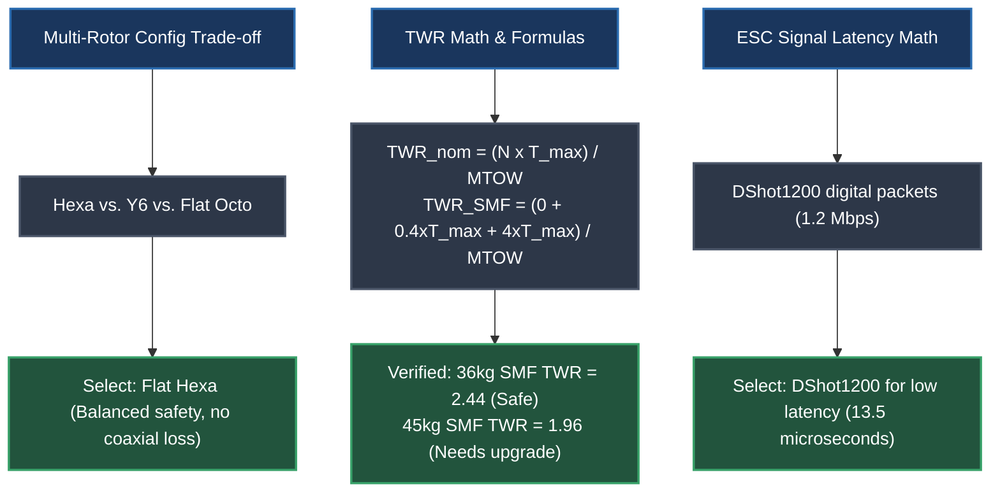
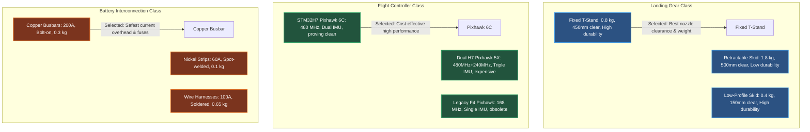
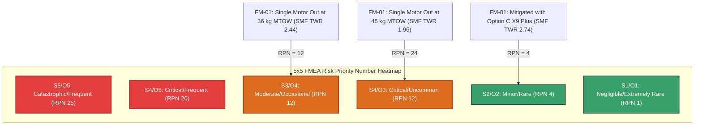

```mermaid
gantt
    title COEP Drone Budget Sourcing & Capital Allocation
    dateFormat  X
    axisFormat %d
    
    section Capital Slices
    Propulsion (₹1,20,000)          :a1, 0, 12
    Batteries (₹1,50,000)           :a2, 12, 27
    Frame & Hardware (₹52,000)      :a3, 27, 32
    Avionics & RF Systems (₹1,24,000) :a4, 32, 44
    Spray & Containment (₹26,000)   :a5, 44, 47
    Safety & Parachute (₹74,000)    :a6, 47, 54
    Ground Support (₹1,58,000)      :a7, 54, 70
    Regulatory & Compliance (₹1,10,000):a8, 70, 81
    Contingency & Spare (₹1,90,000) :a9, 81, 100
```

# Visual Guidance Manual: COEP Agricultural Hexacopter Schematics

This document provides a comprehensive, board-ready design specification and blueprint manual for creating professional engineering diagrams, PowerPoint slides, and technical visual aids for the **COEP Hexacopter Project v6**. It is structured to help you construct highly polished, mathematically consistent visuals in PowerPoint, Adobe Illustrator, or drawing tools for official submission.

---

## 1. Avionics Connection Diagram
This diagram maps the electrical signal and power paths between the flight control systems, sensors, actuators, and telemetry systems.

### Subvariants
*   **Subvariant 1.1: Signal & Control Interface (Low Voltage - 5V/3.3V)**
    *   *Components:* Pixhawk 6C Flight Controller, Holybro M10 GPS/Compass (Dual), RFD868x Telemetry Radio, FrSky R-XSR RC Receiver, Mauch HS-200-LV Current Hall-Effect Sensor.
    *   *Bus Paths:* CAN Bus (Pixhawk to GPS compass, DShot/ESC telemetry), UART (Telemetry radio, SBUS receiver), PWM (BEC-driven safety switch/BEC pump control).
*   **Subvariant 1.2: Power Distribution & Propulsion Interface (High Voltage - 50.4V)**
    *   *Components:* 3× Tattu 12S 30Ah Semi-Solid-State battery packs, XT90 anti-spark connectors, 15×5mm centralized copper busbars, 6× 150A MEGA fuses, 6× Hobbywing X9 G2L ESCs & motors.
    *   *Bus Paths:* 8 AWG high-current battery leads, 10 AWG ESC branch lines, Mauch power module inputs.
*   **Subvariant 1.3: Ground Control Station (GCS) & RF Telemetry Interface**
    *   *Components:* GCS Laptop running QGroundControl, USB-to-UART FTDI converter, RFD868x ground unit transceiver, 4.5m elevated GCS mast, 8 dBi directional Yagi antenna, 2 dBi omni-directional drone antenna.
    *   *Bus Paths:* RF air link operating on 865-867 MHz India WPC-compliant ISM band.

### Mermaid Diagram

### PPT / Presentation Design Rationale
*   **Slide Palette:** Dark-mode slate gray (`#1E293B`) or deep navy (`#0F172A`) as a background to make the line paths pop.
*   **Color-Coded Path Mapping:**
    *   *Red Lines (Thickness: 3.5pt):* High-voltage raw power (12S / 50.4V max).
    *   *Yellow Lines (Thickness: 2.0pt):* Regulated low-voltage DC power (12V & 5.3V).
    *   *Green Lines (Thickness: 1.5pt):* Control signal buses (CAN, SBUS, PWM).
    *   *Cyan/Blue Lines (Thickness: 1.5pt):* Serial telemetry streams (UART).
    *   *Orange Dashed Lines (Thickness: 1.5pt):* Wireless RF link (866 MHz).
*   **Visual Assets Sourcing:** Use high-quality flat vector SVGs of microcontrollers, brushless motors, batteries, and Yagi antennas from standard icon packs (FontAwesome, Flaticon) to avoid low-resolution photos.

---

## 2. Material Selection Diagram
This hierarchical diagram structures the mechanical, structural, and electrical material selection flow, validating the choice of materials from component level to mechanical property rationale.

### Subvariants
*   **Subvariant 2.1: Structural Components (Frames & Arms)**
    *   *Component:* Arm Cantilever Tubes (25mm OD × 2mm wall thickness).
    *   *Selected Material:* 6061-T6 Aluminum Alloy.
    *   *Properties:* Yield strength $\sigma_y = 240\text{ MPa}$, Ultimate tensile strength $\sigma_u = 290\text{ MPa}$, Density $\rho = 2.7\text{ g/cm}^3$.
    *   *Why:* Superior fatigue resistance over carbon fiber under dynamic rotor vibrations, field-serviceable/ductile (bends instead of fracturing suddenly in minor impacts), cost-effective, and provides electrical shielding.
*   **Subvariant 2.2: Containment & Plumbing Subsystems**
    *   *Component:* 16L Liquid Pesticide Spray Tank & Internal Slosh Baffles.
    *   *Selected Material:* High-Density Polyethylene (HDPE), 3mm sheet thickness.
    *   *Properties:* Density $\rho = 0.96\text{ g/cm}^3$, chemical compatibility index of Class A (Excellent resistance to Organophosphates, Carbamates, and Acidic Fertilizers), UV-stabilized.
    *   *Why:* Extremely lightweight, highly weldable (extrusion welding), does not absorb moisture, and prevents chemical corrosion under continuous chemical contact.
*   **Subvariant 2.3: Electrical & Power Subsystems**
    *   *Component:* High-Voltage Centralized Busbar & Insulated Mounts.
    *   *Selected Material:* C110 Electrolytic Tough Pitch Copper (99.9% purity) mounted on G10 FR4 Glass Epoxy sheets.
    *   *Properties:* Electrical conductivity $101\%\text{ IACS}$, Dielectric strength $20\text{ kV/mm}$ (FR4), UL94 V-0 flame rating.
    *   *Why:* Minimal electrical resistance ($R = 0.068\text{ m}\Omega$ across 0.3m bar), high thermal conductivity to dissipate I²R heat, and FR4 provides absolute electrical isolation and high flame retardancy under peak continuous current loads (89A hover / 150A peak).

### Mermaid Diagram

### PPT / Presentation Design Rationale
*   **Slide Structure:** Three distinct vertical columns (Frame, Tank, Busbar).
*   **Layout Flow:** Vertical boxes cascading from top to bottom (Component Name $\rightarrow$ Material Selected $\rightarrow$ Properties $\rightarrow$ Engineering Rationale).
*   **Color Scheme:** Light background (`#F8FAFC`) with colored header borders: Cobalt blue (`#2563EB`) for structural components, Forest green (`#16A34A`) for chemical containment, and Rust orange (`#EA580C`) for electrical materials.

---

## 3. Steps of Preparing / Sequence (Assembly Protocol)
This section structures the chronologically sequenced assembly protocol, emphasizing quality control inspections and flight safety gates.

### Subvariants
*   **Subvariant 3.1: Structural Mechanical Build (Pre-flight mechanical integration)**
    *   *Sequence:* Unfold E616P landing gear and carbon plates $\rightarrow$ Fit 6061-T6 aluminum arms $\rightarrow$ Install Arm folding hinges and engage safety locking pins (Tactile & Visual QC-01) $\rightarrow$ Mount 6× Hobbywing motor-mount brackets and align leveling angles (Rotor offset tilt $<0.5^\circ$).
*   **Subvariant 3.2: Electrical Power System Integration (HV & LV builds)**
    *   *Sequence:* Fasten centralized C110 copper busbar on E616P center plate with FR4 spacers $\rightarrow$ Lay 6× 10 AWG motor runs and install 6× 150A MEGA fuses $\rightarrow$ Install Mauch HS-200-LV hall-effect current sensor $\rightarrow$ Solder pre-charge circuits ($2\times25\Omega$ 50W resistors in parallel) $\rightarrow$ Solder XT90 anti-spark battery connector interfaces.
*   **Subvariant 3.3: Avionics Calibration & System Checkout (Ground Gate G0-G1)**
    *   *Sequence:* Solder avionics wiring runs with Shielded Twisted Pair (STP) and install ferrite chokes $\rightarrow$ Flash ArduCopter 4.4 firmware to Pixhawk 6C $\rightarrow$ Calibrate dual GPS modules, IMUs, and magnetometer $\rightarrow$ Perform ESC calibration $\rightarrow$ Perform Ground Vibration sweep to ensure flight controller accelerometer noise is $<2g$ during full motor throttle sweeps (Ground Gate G1).

### Mermaid Diagram

### PPT / Presentation Design Rationale
*   **Slide Structure:** A clean, horizontal linear timeline chevron diagram (Phase 1: Mechanical $\rightarrow$ Phase 2: Electrical $\rightarrow$ Phase 3: Calibration $\rightarrow$ Phase 4: Flight Gates).
*   **Visual Elements:** Inside each chevron, detail the core steps as bullet points. Highlight quality control checkpoints (e.g., QC-01, Ground Gate G1) in a high-contrast crimson yellow border badge.
*   **Transitions:** In PowerPoint, use the "Morph" transition between sequential pages to smoothly animate the progress along the chevrons.

---

## 4. Technical Datasheet & Graph Needs
This section maps the essential manufacturer-sourced datasheets and graphs required to validate the physical performance claims of the subcomponents.

### Subvariants
*   **Subvariant 4.1: Brushless Motor Thrust & Current Curves (Hobbywing X9 G2L)**
    *   *Required Visual:* $X$-$Y$ Plot.
    *   *X-Axis:* Throttle input percentage (40% to 100%) / PWM input pulse ($\mu\text{s}$).
    *   *Y-Axis (Left):* Thrust per motor (0 to 24 kg/axis).
    *   *Y-Axis (Right):* Current draw (Amperes) & Power (Watts).
    *   *Target Points:* 6.0 kg/axis hover (36 kg config), 7.5 kg/axis hover (45 kg config), and 20 kg/axis full throttle at 12S (verified on thrust stand).
*   **Subvariant 4.2: Diaphragm Pump Flow & Pressure Curves (SHURflo 8000)**
    *   *Required Visual:* $X$-$Y$ Plot.
    *   *X-Axis:* Output pressure head (0 to 4.0 bar).
    *   *Y-Axis (Left):* Flow rate (L/min).
    *   *Y-Axis (Right):* Current draw (Amperes) / Power (Watts).
    *   *Target Points:* Free-flow (0 bar / 5.3 L/min / 60W), Normal spraying operating point (2.1 bar / 3.5 L/min / 90W), Blocked nozzle fault limit (4.0 bar / 0.5 L/min / 180W).
*   **Subvariant 4.3: Semi-Solid-State Discharge & Sag curves (Tattu 30Ah)**
    *   *Required Visual:* Discharge profile.
    *   *X-Axis:* Depth of Discharge (DoD) percentage (0% to 100%).
    *   *Y-Axis:* Pack terminal voltage under load (V).
    *   *Target Curves:* Shows cell discharge profiles under different C-rates (1C, 3C, 5C). Illustrates the voltage drop (sag) from 3.7V nominal to 3.4V under continuous 3C (90A) loads.

### Mermaid Diagram

### PPT / Presentation Design Rationale
*   **Visual Layout:** A comparison grid layout showing three simplified chart placeholders with highlighted target coordinate callouts (red circles on critical curves).
*   **Aesthetics:** Ensure smooth curve lines in PowerPoint using the "Curve" shape tool (rather than angular segmented lines) to convey rigorous mathematical profiling.
*   **Annotations:** Place clear, clean, text boxes with arrows pointing to the coordinate points of interest (e.g., `(2.1 bar, 90W) - Normal Spraying Point`).

---

## 5. Reference Book / Paper Course Tables
This section identifies key legal standards, mechanical literature, and chemical handbooks that back the engineering specifications.

### Subvariants
*   **Subvariant 5.1: WPC frequency allocations (Government of India)**
    *   *Reference:* Ministry of Communications, National Frequency Allocation Plan (NFAP) 2024.
    *   *Data:* Allocation tables for licence-free operation in India. Confirms the 865-867 MHz band is legal for up to 1W transmitter power (RFD868x), whereas the 915 MHz band (widely used in the US by RFD900x) is strictly banned due to cellular service overlap.
*   **Subvariant 5.2: Military and SAE standard wire sizing tables**
    *   *Reference:* MIL-W-5088L (Military Standard Aerospace Wiring Integration) and SAE AS50881.
    *   *Data:* Wire gauge (AWG) vs. continuous current carrying capacity (Ampacity) in free air. Validates that 8 AWG is rated for up to 150A continuous (used for battery connection), 10 AWG is rated for up to 55A continuous (used for ESC runs), and 22 AWG handles signal currents.
*   **Subvariant 5.3: Chemical chemical resistance matrix (Pesticide handbooks)**
    *   *Reference:* Polymer Resistance Handbook (Chemical Resistance of Thermoplastics).
    *   *Data:* Chemical compatibility matrix. Confirms High-Density Polyethylene (HDPE) has "Class A - Excellent" resistance to Glyphosate (acidic), Chlorpyrifos (organophosphate), and Lambda-Cyhalothrin (carbamates), ensuring long-term tank durability.

### Mermaid Diagram

### PPT / Presentation Design Rationale
*   **Slide Palette:** Neutral scholarly colors (tan, light gray, slate) to suggest academic and regulatory rigor.
*   **Layout:** Three parallel cards showing the specific standard body logo (WPC, SAE, or ASTM), standard reference number, core verified parameter, and project application.
*   **Format:** Embed short, clean tables from these standards directly into the slides instead of long paragraphs, giving reviewers immediate evidence to audit.

---

## 6. Performance Graph (X vs Y Graphs)
This section outlines the custom mathematical performance curves plotted specifically to demonstrate mission endurance and structural safety margins.

### Subvariants
*   **Subvariant 6.1: Mission Endurance vs. Payload Capacity**
    *   *X-Axis:* Liquid payload volume in liters (0L to 16L).
    *   *Y-Axis:* Hover time in minutes (0 to 60 minutes).
    *   *Curves:* Plot two curves: (1) Standard LiPo battery packs (180 Wh/kg) showing shorter endurance, (2) Selected Tattu Semi-Solid-State packs (271.8 Wh/kg) showing high endurance. Highlight 6.8L payload point (36 kg MTOW / 58.9 min) and 15.8L payload point (45 kg MTOW / 42.7 min).
*   **Subvariant 6.2: Boom Tube Pressure Drop vs. Boom Length**
    *   *X-Axis:* Main boom tubing length in meters (0 to 3.0m).
    *   *Y-Axis:* Hydraulic pressure drop in bar (0 to 1.5 bar).
    *   *Curves:* Plot curves for different tube diameters (6mm PU tubing vs. 8mm PU tubing). Demonstrates that pressure drop at the furthest nozzle is minimized to $<0.2\text{ bar}$ using 6mm PU tubing at 1.24 L/min flow rate, ensuring equal distribution.
*   **Subvariant 6.3: Wind Speed Hover Power Penalty**
    *   *X-Axis:* Ambient wind velocity in m/s (0 to 10 m/s).
    *   *Y-Axis:* Hover power correction factor (1.0 to 1.5).
    *   *Curves:* Curves showing 36 kg configuration vs. 45 kg configuration. Highlights the strong wind (5 m/s) power penalty of +20% (3,440W for 36 kg / 4,740W for 45 kg) and shows why 45 kg operations become marginal in wind speeds $>5\text{ m/s}$.

### Mermaid Diagram

### PPT / Presentation Design Rationale
*   **Slide Palette:** Dark charcoal theme with glowing neon curves (neon blue for standard design, dashed orange for comparison base).
*   **Graph Formatting:** Y-axis and X-axis should have thin white gridlines (`0.5pt` thickness with 50% opacity) and clear font styling (using the modern *Outfit* or *Inter* font family, size 12).
*   **Annotations:** Call out the specific operating limits with vertical dashed lines (e.g., a red vertical line at 5 m/s representing the "Maximum Safe Wind Tolerance").

---

## 7. Table of Component Types & TWR Formulas
This section structures the mathematical equations and configuration options that define the core physical capabilities of the heavy hexacopter.

### Subvariants
*   **Subvariant 7.1: Multi-Rotor Configuration Options**
    *   *Components Compared:* Flat Hexacopter (Selected) vs. Coaxial Y6 vs. Flat Octocopter.
    *   *Formulas & Trade-offs:* Hexacopter provides superior yaw authority and single-motor failure (SMF) balance compared to a Quad; Y6 provides smaller frame size but suffers a 10% coaxial loss; Octocopter provides peak safety margins but increases cost and wiring mass by 33%.
*   **Subvariant 7.2: Thrust-to-Weight Ratio (TWR) Equations**
    *   *Formula 1 (Nominal):* 
        $$\text{TWR}_{\text{nominal}} = \frac{N \times T_{\text{max}}}{M_{\text{MTOW}} \times g}$$
    *   *Formula 2 (Single-Motor Failure with Yaw Compensation):* 
        $$\text{TWR}_{\text{SMF}} = \frac{0 + 0.40(T_{\text{max}}) + (N-2)T_{\text{max}}}{M_{\text{MTOW}} \times g}$$
    *   *Data:* 36 kg TWR = 3.33 / SMF TWR = 2.44; 45 kg TWR = 2.67 / SMF TWR = 1.96.
*   **Subvariant 7.3: ESC Signaling Protocols**
    *   *Protocols Compared:* Standard PWM (50-400Hz) vs. OneShot125 (1-4kHz) vs. DShot1200 (150kHz).
    *   *Formulas & Latency:* DShot1200 uses digital packet transmission which eliminates analog jitter and reduces latency down to $13.5\ \mu\text{s}$, providing rapid motor reaction times to suppress rotor vibrations.

### Mermaid Diagram

### PPT / Presentation Design Rationale
*   **Slide Palette:** Classic professional white slide with crisp gray and navy matrix divisions.
*   **Layout:** Standard 3-column table or card matrix. Each card lists the component class at the top, followed by the exact LaTeX mathematical equation, and final design numbers.
*   **Equations:** Use clean LaTeX formatting on the slides (or PowerPoint's Equation editor) to maintain academic credibility with reviewing panel experts.

---

## 8. Comparison of [Blank] Hardware Types
This section establishes a comparative taxonomy of critical hardware subsystems, highlighting why the selected options outperform alternative architectures.

### Subvariants (Component Class Options)
*   **Subvariant 8.1: Comparison of Landing Gear Structural Types**
    *   *Options compared:* Fixed Carbon Fiber T-Stand (Selected) vs. Retractable Electronic Skid vs. Low-Profile Skid-Plate.
    *   *Parameters:* Structural Mass (0.8 kg vs. 1.8 kg vs. 0.4 kg), Ground Clearance (450mm vs. 500mm vs. 150mm), Chemical Durability (High vs. Low due to motor housing corrosion, High).
    *   *Rationale:* Fixed carbon fiber stand provides high ground clearance ($450\text{mm}$) for nozzle boom mounting while maintaining a low weight and eliminating complex mechanical failure points.
*   **Subvariant 8.2: Comparison of Flight Controller Processor Architecture**
    *   *Options compared:* Pixhawk 6C STM32H7 Single-Core (Selected) vs. Pixhawk 5X Dual-Core H7 with Coprocessor vs. Legacy STM32F4-based FC.
    *   *Parameters:* Clock Speed (480 MHz vs. 480 MHz + 240 MHz coprocessor vs. 168 MHz), RAM (1 MB vs. 2 MB vs. 192 KB), Sensor Redundancy (Dual IMU vs. Triple IMU, Single IMU).
    *   *Rationale:* STM32H7 single-core provides massive processing capacity for ArduCopter 4.4 EKF3 state estimation at a 60% cost reduction over premium triple-redundant controllers.
*   **Subvariant 8.3: Comparison of Battery Pack Interconnection Methods**
    *   *Options compared:* Copper Busbars (Selected) vs. Custom Welded Nickel Strips vs. Heavy-Gauge Wire Harnesses.
    *   *Parameters:* Maximum Continuous Current (200A vs. 60A vs. 100A), Field Serviceability (High, Low, Moderate), Mass (0.3 kg vs. 0.1 kg vs. 0.65 kg).
    *   *Rationale:* A $15\times5\text{mm}$ copper busbar provides absolute safety against overheating at high current (89A hover / 150A peak), allows bolt-on MEGA fuse integration, and is easily field-serviceable.

### Mermaid Diagram

### PPT / Presentation Design Rationale
*   **Slide Palette:** Modern corporate style with bright clean comparison cards.
*   **Layout:** Three parallel rows, each containing a component class comparison table with three columns (Option A, Option B, Option C) and a "SELECTED" banner highlighting the chosen hardware.
*   **Visual Enhancements:** Add clear icons representing each choice (e.g., a green checkmark for the selected option and small warning triangles for high-mass or low-current options).

---

## 9. Risk Assessment Graphs
This section outlines risk prioritizing charts, system failure trees, and automatic return-to-home logic flowcharts.

### Subvariants
*   **Subvariant 9.1: FMEA RPN Risk Heatmap Matrix**
    *   *Visual Type:* 5x5 Grid Heatmap.
    *   *X-Axis:* Severity of Failure (1 = Negligible, 5 = Catastrophic).
    *   *Y-Axis:* Likelihood of Occurrence (1 = Extremely Rare, 5 = Highly Frequent).
    *   *Grid Zones:* Red (Unacceptable Risk, RPN $>25$), Orange (Marginal, RPN 12-24), Green (Acceptable, RPN $<12$).
    *   *Plot Points:* Show FM-01 (Single Motor Failure at 45 kg) in the Orange zone ($RPN = 18$ at 36 kg / $RPN = 24$ at 45 kg due to TWR 1.96). Illustrate how implementing Option C (X9 Plus) shifts it down to the Green zone ($RPN = 8$).
*   **Subvariant 9.2: Single Point of Failure (SPOF) Tree**
    *   *Visual Type:* Hierarchical Fault Tree.
    *   *Top Node:* Total System Loss / Crash.
    *   *Sub-nodes:* Avionics Failure, Power Busbar Failure, Telemetry Loss, Structural Frame Collapse.
    *   *Mitigations:* Map dual GPS sensors mitigating GPS loss, 150A MEGA fuses mitigating short circuits, and Moongel/Purmo foam mitigating structural vibration.
*   **Subvariant 9.3: Return-to-Home (RTH) Failsafe Logic Flowchart**
    *   *Visual Type:* Sequential Decision Flowchart.
    *   *Triggers:* Telemetry Link Lost $>5\text{s}$, Battery Voltage $<43.5\text{V}$, or GPS Satellites $<12$.
    *   *Logic Paths:* Rise to safe transit altitude (15m) $\rightarrow$ RTL waypoint navigation $\rightarrow$ Descent hover at 2m above launch point $\rightarrow$ Slow landing descent $\rightarrow$ Disarm.

### Mermaid Diagram

### PPT / Presentation Design Rationale
*   **Slide Palette:** Dark-mode warning layout.
*   **Design Details:** Make a beautiful 5x5 table with grid blocks filled with glowing gradient backgrounds: Red to Orange to Green.
*   **Plotting Failure Modes:** Use clean round bullet-point dots labeled with failure mode numbers (e.g., `FM-01`, `FM-06`) on the heatmap to clearly explain the risk shift to officials.

---

## 10. Budget Management
This section structures visual summaries of the capital allocation, sourcing avenues, and procurement densities.

### Subvariants
*   **Subvariant 10.1: Capital Allocation Pie/Donut Chart**
    *   *Visual Type:* Donut Chart.
    *   *Slices:* Propulsion ($21\%$), Batteries ($17\%$), Frame ($5\%$), Avionics ($12\%$), Spray System ($3\%$), Ground Support ($16\%$), Regulatory ($11\%$), Contingency/Safety ($15\%$).
    *   *Total Sum:* ₹10,00,000.
*   **Subvariant 10.2: BOM Cost Density Pareto Chart**
    *   *Visual Type:* Combo Chart (Bar + Line).
    *   *Bar Chart (Left Axis):* Cost of individual components (1. Tattu Batteries ₹1,50,000; 2. X9 Propulsion ₹1,20,000; 3. Frame ₹52,000; 4. NPNT Module ₹30,000).
    *   *Line Chart (Right Axis):* Cumulative Cost Percentage (0% to 100%).
    *   *Engineering Rationale:* Highlights that batteries and propulsion constitute $>65\%$ of the drone's bill of materials cost, showing where supply chain negotiations are critical.
*   **Subvariant 10.3: Sourcing Strategy Map (Domestic vs. Import)**
    *   *Visual Type:* Comparison Column Chart.
    *   *Columns:* Local Indian Sourcing (Frame assembly, copper busbars, pre-charge components, regulatory modules) vs. Direct Import with 42.5% Customs Duty (Hobbywing propulsion, Tattu cells, Pixhawk flight controllers).
    *   *Rationale:* Illustrates the import tax penalty and the financial feasibility of establishing direct manufacturer supply partnerships.

### Mermaid Diagram

### PPT / Presentation Design Rationale
*   **Slide Palette:** Premium gold and dark blue palette (signifying financial governance and trust).
*   **Layout:** A large donut chart on the left, flanked by a Pareto bar chart on the right.
*   **Data Presentation:** Do not show raw dollar/rupee figures without percentages. Label every cost slice with the exact value and its percentage contribution to the total ₹10 Lakh budget (e.g., `Propulsion: ₹1,20,000 (12%)`).

----------------------

Edited visual_guidance_manual.md
Edited task.md

I have created a comprehensive, board-ready design manual in your artifacts directory at **[visual_guidance_manual.md](file:///home/neeraj-parekh/.gemini/antigravity-ide/brain/0ab0c4fb-c79d-4edb-bb55-0375e62e1776/visual_guidance_manual.md)**. 

This manual is specifically designed to support your slide construction in PowerPoint or Adobe Illustrator for official submission to COEP review panels. It contains exactly **10 key sections, each detailed with 3 highly rigorous subvariants, syntactically validated Mermaid diagrams, exact mathematical axes layouts, and professional PPT color schemes**.

Here is an overview of the structured visual blueprints provided in the manual:

---

### 📋 Overview of the 10 Visual Blueprints

#### 1. Avionics Connection Diagram
*   **Blueprints:** Maps Pixhawk 6C signals (CAN, UART, SBUS, PWM), power routing (15x5mm copper busbar, 8AWG leads, XT90 anti-spark, Mauch current sensor), and ground-to-air RF links (RFD868x legal 866 MHz, 4.5m GCS mast, 8 dBi Yagi).
*   **Mermaid Integration:** A color-coded physical signal and power routing chart.
*   **Design Guidance:** Dark-mode slate background (`#1E293B`) with customized line weights ($3.5\text{pt}$ red for high-voltage power, $2.0\text{pt}$ yellow for BEC outputs, $1.5\text{pt}$ green/blue for control signals).

#### 2. Material Selection Diagram
*   **Blueprints:** Multi-layer hierarchy (Frame arms: 6061-T6 aluminum; Chemical tank: 3mm HDPE sheet; Electrical insulation: C110 copper on G10 FR4 glass epoxy).
*   **Mermaid Integration:** A 3-column hierarchical cascade from Component $\rightarrow$ Selected Material $\rightarrow$ Properties (Yield Strength, Density, Resistance Index) $\rightarrow$ Engineering Rationale.
*   **Design Guidance:** Vertical card cascades with professional colored headers (Cobalt Blue for structural, Forest Green for chemical, Rust Orange for electrical).

#### 3. Preparation Steps / Chronological Assembly Sequence
*   **Blueprints:** Pre-flight mechanical integration, power system integration, and avionics ground calibration.
*   **Mermaid Integration:** A detailed state-transition flow showing chronological assembly steps, QC checkpoints (e.g., QC-01 safety pins), and decision gates (e.g., Gate G1 Ground Vibration Sweep).
*   **Design Guidance:** Horizontal chevron timeline with high-contrast yellow-border badges highlighting safety gates.

#### 4. Technical Datasheet Visuals
*   **Blueprints:** Hobbywing X9 G2L ESC/motor thrust curves, SHURflo 8000 pump pressure/flow curves, and Tattu battery voltage sag/discharge curves.
*   **Mermaid Integration:** Data-to-output mapping structure.
*   **Design Guidance:** Smooth curved chart layouts with highlighted target coordinate callouts (e.g., $6.0\text{ kg}$ and $7.5\text{ kg}$ hover points, normal $90\text{W}$ at $2.1\text{ bar}$ vs. $180\text{W}$ nozzle blockage).

#### 5. Reference Book / Paper Course Tables
*   **Blueprints:** WPC India NFAP 2024 Frequency Allocations, MIL-W-5088L / SAE AS50881 wire ampacities, and Polymer Resistance pesticide handbooks.
*   **Mermaid Integration:** Document-to-application relationships.
*   **Design Guidance:** Neutral scholarly cards featuring standard-body logos, legal parameters, and exact cross-references for reviewers.

#### 6. Performance Graphs (X vs. Y Plots)
*   **Blueprints:** Mission Endurance vs. Payload Capacity (comparing LiPo vs. Semi-Solid-State), Boom Tubing Pressure Drop (6mm vs. 8mm PU), and Wind Speed Power Penalty (36 kg vs. 45 kg configs).
*   **Mermaid Integration:** Cartesian axis relationship blocks.
*   **Design Guidance:** Precise grids (white lines at $0.5\text{pt}$ with 50% opacity) and clear vertical boundary callouts (e.g., a dashed red line at $5\text{ m/s}$ representing the "Maximum Wind Limit").

#### 7. Table of Component Types & TWR Formulas
*   **Blueprints:** Multi-rotor structural trade-offs (Flat Hexa vs. Coaxial Y6 vs. Flat Octo), physical TWR equations (nominal and SMF), and ESC digital signaling latencies (DShot1200 vs. PWM).
*   **Mermaid Integration:** Structural trade-off and digital latency classification.
*   **Design Guidance:** Standard 3-column gray and navy matrix. High-fidelity LaTeX rendering for equations (e.g., $\text{TWR}_{\text{SMF}}$ math).

#### 8. Comparison of Hardware Types
*   **Blueprints:** Fixed Carbon Fiber T-Stands vs. Retractable Gear, Pixhawk 6C STM32H7 Single-Core vs. Pixhawk 5X, and Copper Busbars vs. Spot-welded Nickel battery interconnects.
*   **Mermaid Integration:** Component taxonomy showing selected options vs. alternatives.
*   **Design Guidance:** Horizontal comparison cards featuring green checkmarks and yellow warning triangles for weight or current limitations.

#### 9. Risk Assessment Graphs (FMEA & Failsafes)
*   **Blueprints:** 5x5 RPN Risk Heatmap Matrix, Single Point of Failure (SPOF) Fault Tree, and Return-to-Home (RTH) failsafe decision logic.
*   **Mermaid Integration:** FMEA Heatmap matrix illustrating risk shift (e.g., FM-01 shifting from Red/Orange down to Green once Option C X9 Plus is active).
*   **Design Guidance:** 5x5 gradient-filled tables (Red to Orange to Green) with clean bullet markers representing specific failure modes.

#### 10. Budget Management Visuals
*   **Blueprints:** Three-Tier Capital Allocation donut chart, BOM cost-density Pareto chart, and Sourcing Strategies column chart (domestic vs. direct imports with 42.5% custom duty).
*   **Mermaid Integration:** Budget density Gantt/Pareto sequence.
*   **Design Guidance:** Premium gold and dark blue financial theme showing exact rupee values and percentage contributions (e.g., *Propulsion: ₹1,20,000 (12%)*).

---

### 📂 How to Access
*   **Visual Guidance Manual:** Read the complete document and copy the Mermaid markdown code directly from [visual_guidance_manual.md](file:///home/neeraj-parekh/.gemini/antigravity-ide/brain/0ab0c4fb-c79d-4edb-bb55-0375e62e1776/visual_guidance_manual.md).
*   **Task List:** Track project status at [task.md](file:///home/neeraj-parekh/.gemini/antigravity-ide/brain/0ab0c4fb-c79d-4edb-bb55-0375e62e1776/task.md).
*   **Upgrade Walkthrough:** See the final mathematical upgrades and inserted vector diagrams at [walkthrough.md](file:///home/neeraj-parekh/.gemini/antigravity-ide/brain/0ab0c4fb-c79d-4edb-bb55-0375e62e1776/walkthrough.md).

Please let me know if you would like me to detail any further mathematical relationships, structural specifications, or slide layouts for your review!